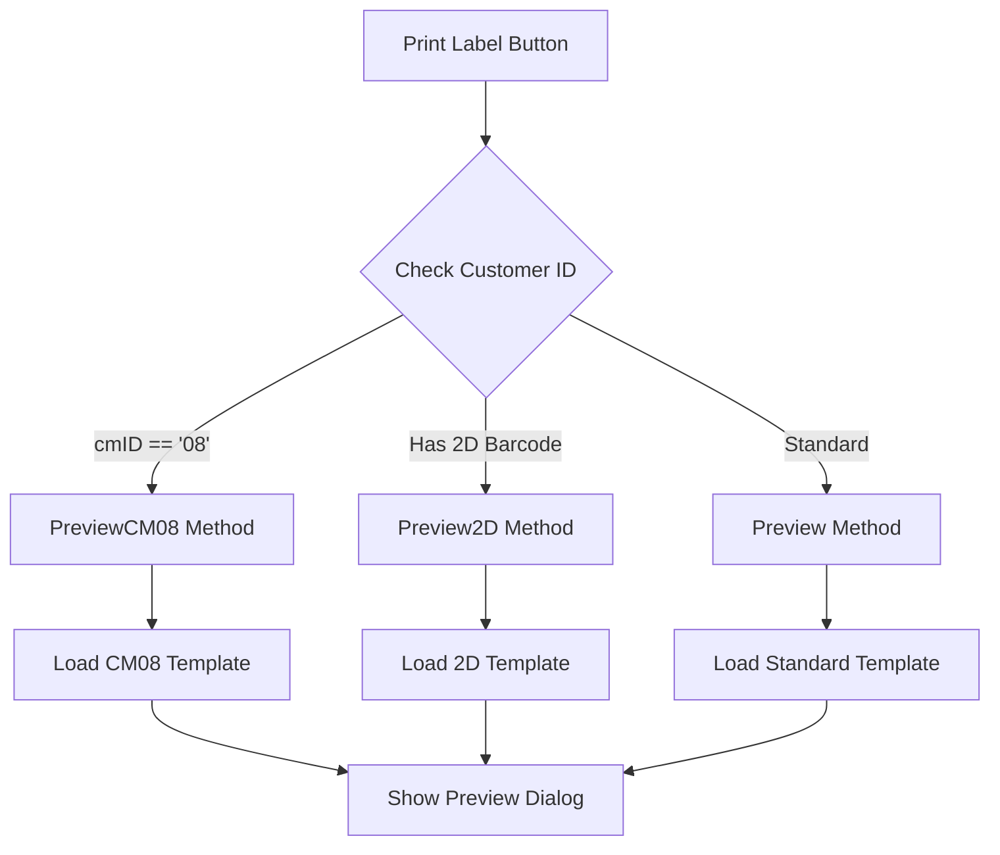
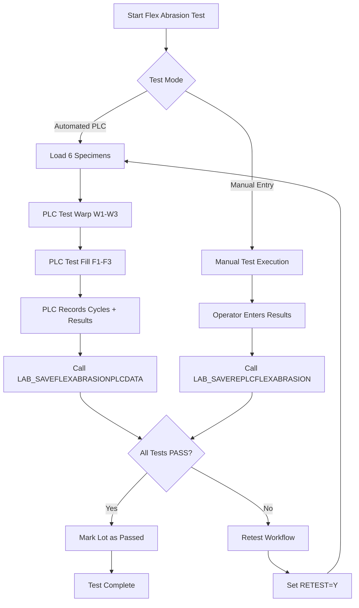

# Multi-Session Documentation Update Plan (REVISED)

**Created**: 2025-10-15
**Revised**: 2025-10-15 (adjusted for 1-hour sessions)
**Total Work**: 6-7 hours estimated
**Strategy**: Split into 6 manageable sessions (~1 hour each)
**Approach**: Each session is independent and resumable

---

## Revision Summary

**CHANGED**: Original 4 sessions (1.5-2.5 hours each) → 6 sessions (~1 hour each)

**REASON**: Accommodate interruptions, chat time, and maintain focus

**New Structure**:
- Session 1: Automated script + verification (1 hour)
- Session 2: Database procedures batch 1 (1 hour)
- Session 3: Database procedures batch 2 + Packing (1 hour)
- Session 4: LAB System part 1 (flex abrasion) (1 hour)
- Session 5: LAB System part 2 (tensile testing) (1 hour)
- Session 6: MODERNIZATION docs + final verification (1 hour)

---

## SESSION 1: Automated Script + Database TODO (1 hour)

### Session 1 Prompt File: `Prompts/session1_automated_script.txt`

**Duration**: 45-60 minutes

**Tasks**:
1. Create Python script for line reference updates (15 min)
2. Test script on 5 sample files (10 min)
3. Run script on ALL database procedure docs (5 min)
4. Verify 10 random files for accuracy (15 min)
5. Update `.DATABASE_STORED_PROCEDURES_TODO.md` - add 2 LAB procedures (10 min)
6. Create Session 2 prompt (5 min)

**Files Affected**: 104 files
- 103 database procedure docs (automated)
- 1 TODO tracker (manual)

**Why This First**:
- Fully automatable (script does heavy lifting)
- Foundation for all other updates
- Clear pass/fail verification
- Quick wins to build momentum

**Output**:
- ✅ Python script created and tested
- ✅ All database docs have corrected line references
- ✅ TODO tracker shows 298 procedures (was 296)
- ✅ Verification report (10 spot-checks passed)
- ✅ Session 2 prompt file ready

**Estimated Time**: 45-60 minutes

---

## SESSION 2: Database Verification + Spot Checks (1 hour)

### Session 2 Prompt File: `Prompts/session2_database_verification.txt`

**Duration**: 45-60 minutes

**Tasks**:
1. Comprehensive verification of Finishing module procedures (20 min)
   - All 17 procedures (087-103) should have +91 shift
2. Spot-check Weaving procedures (15 min)
   - Random 10 files from procedures 054-086
3. Spot-check other modules (15 min)
   - Beaming, Drawing, Inspection
4. Document any errors found and fix them (10 min)
5. Create verification report (5 min)
6. Create Session 3 prompt (5 min)

**Files Affected**: 103 files (verification only, fixes if needed)

**Why This Second**:
- Validate automated script worked correctly
- Catch errors early before moving to new content
- Focus on recently created docs (Finishing module)
- Low-risk (just verification)

**Output**:
- ✅ Finishing module procedures verified (17 files)
- ✅ 20 random procedures spot-checked across all modules
- ✅ Any errors documented and fixed
- ✅ Verification report created
- ✅ Session 3 prompt file ready

**Estimated Time**: 45-60 minutes

---

## SESSION 3: Packing Module Complete (1 hour)

### Session 3 Prompt File: `Prompts/session3_packing_complete.txt`

**Duration**: 50-60 minutes

**Tasks**:
1. Update `040-PROCESS_ORDER_PACKING.md` (25 min)
   - Add GROSSLENGTH section
   - Add CM08 label section
   - Update diagrams if needed
2. Update `041-UI_LOGIC_PACKING_LABEL.md` (25 min)
   - Update LOC count (389 → 414)
   - Add PreviewCM08() method documentation
   - Add customer selection flowchart (Mermaid)
3. Update `ACTUAL_IMPLEMENTATIONS_CATALOG.md` (5 min)
   - Update PackingLabelPage LOC
   - Add CM08 note
4. Create Session 4 prompt (5 min)

**Files Affected**: 3 files
- 2 packing docs (major updates)
- 1 catalog (minor update)

**Why This Third**:
- Self-contained module
- Clear feature additions (well-documented in code summary)
- High business priority (customer-facing)
- No dependencies on other sessions

**New Content Required**:
- GROSSLENGTH field documentation (~30 lines)
- CM08 label workflow (~40 lines)
- Mermaid diagram for customer selection
- PreviewCM08() method documentation (~50 lines)

**Output**:
- ✅ Packing process doc includes GROSSLENGTH + CM08
- ✅ UI Logic Analysis doc updated with new method
- ✅ Catalog updated
- ✅ Session 4 prompt file ready

**Estimated Time**: 50-60 minutes

---

## SESSION 4: LAB System - Flex Abrasion (1 hour)

### Session 4 Prompt File: `Prompts/session4_lab_flex_abrasion.txt`

**Duration**: 50-60 minutes

**Tasks**:
1. Create NEW: `012-PROCESS_FLEX_ABRASION_TESTING.md` (35 min)
   - Complete test procedure documentation
   - Equipment description
   - Pass/fail criteria
   - Database schema
   - Code references
2. Update `001-PROCESS_LAB_TEST_OPERATIONS.md` (10 min)
   - Add flex abrasion to test method list
   - Add references to 2 new stored procedures
3. Update `007-PROCESS_LAB_EQUIPMENT_INTEGRATION.md` (10 min)
   - Add flex abrasion equipment section
   - Document LAB_SAVEFLEXABRASIONPLCDATA integration
4. Create Session 5 prompt (5 min)

**Files Affected**: 3 files
- 1 new file (flex abrasion process)
- 2 updates (operations overview, PLC integration)

**Why This Fourth**:
- Focus on ONE new test method only
- Well-defined scope (flex abrasion only)
- Clear stored procedure documentation to reference
- Separated from tensile testing for clarity

**New Content Required**:
- Complete flex abrasion test procedure (~200 lines)
- Equipment integration details (~60 lines)
- 2 stored procedure references
- Workflow diagrams

**Output**:
- ✅ Flex abrasion testing fully documented
- ✅ LAB operations doc includes new test method
- ✅ PLC integration documented
- ✅ Session 5 prompt file ready

**Estimated Time**: 50-60 minutes

---

## SESSION 5: LAB System - Enhanced Tensile (1 hour)

### Session 5 Prompt File: `Prompts/session5_lab_tensile.txt`

**Duration**: 50-60 minutes

**Tasks**:
1. Update `003-PROCESS_MANUAL_TEST_ENTRY.md` (40 min)
   - Add section for 6-point tensile testing
   - Document 12 new fields (W4-W6, F4-F6 for max force + elongation)
   - Update validation logic
   - Update workflow diagrams
   - Update statistical analysis section
2. Review other LAB docs for line reference updates (10 min)
   - Quick scan of remaining ~35 LAB docs
   - Apply automated fixes if needed
3. Create Session 6 prompt (5 min)

**Files Affected**: 1 major + ~35 minor
- 1 major update (manual test entry)
- ~35 files checked for line references

**Why This Fifth**:
- Focus on ONE update only (tensile testing expansion)
- Separated from flex abrasion for focus
- Most complex LAB documentation update
- Allows full hour for quality content

**New Content Required**:
- 6-point testing procedure (~80 lines)
- 12 new field documentation
- Updated validation logic
- Updated workflow diagrams

**Output**:
- ✅ Tensile testing updated to 6-point method
- ✅ All 12 new fields documented
- ✅ Validation logic updated
- ✅ Remaining LAB docs checked
- ✅ Session 6 prompt file ready

**Estimated Time**: 50-60 minutes

---

## SESSION 6: MODERNIZATION + Final Verification (1 hour)

### Session 6 Prompt File: `Prompts/session6_modernization_final.txt`

**Duration**: 50-60 minutes

**Tasks**:
1. Update `MODERNIZATION_ANALYSIS.md` (10 min)
   - Update module table (M13 Packing)
   - Add "Recent Enhancements" section
2. Update `MODERNIZATION_UI_NAVIGATION.md` (10 min)
   - Add CM08 label navigation path
3. Update `MODERNIZATION_SESSION_TRACKER.md` (10 min)
   - Document all 6 update sessions
4. Final comprehensive verification (15 min)
   - Spot-check 20 files across all categories
   - Verify all TODOs completed
5. Create completion report (10 min)
   - Statistics: files updated, lines changed
   - Summary of all changes
6. Cleanup (5 min)
   - Delete temporary tracking files
   - Mark project complete

**Files Affected**: ~10 files
- 3 MODERNIZATION docs
- 1 session tracker
- Verification of 20 random files
- Completion report

**Why This Last**:
- Summary documents depend on all previous work
- Final verification ensures quality
- Completion report for documentation
- Clean closure of update project

**Output**:
- ✅ All MODERNIZATION docs updated
- ✅ Comprehensive verification complete
- ✅ Completion report generated
- ✅ Ready to resume procedure 104 documentation

**Estimated Time**: 50-60 minutes

---

## Progress Tracking System

### Master Progress File: `.DOCUMENTATION_UPDATE_PROGRESS.md`

**Format**:

```markdown
# Documentation Update Progress Tracker

**Started**: [Date of Session 1]
**Target Completion**: 6 sessions (~1 hour each)
**Current Status**: [Session X of 6]

## Session Completion Status

- [ ] Session 1: Automated script + TODO tracker (1 hour)
- [ ] Session 2: Database verification (1 hour)
- [ ] Session 3: Packing module (1 hour)
- [ ] Session 4: LAB flex abrasion (1 hour)
- [ ] Session 5: LAB tensile testing (1 hour)
- [ ] Session 6: MODERNIZATION + final (1 hour)

## Current Session

**Session Number**: X
**Started**: [Time]
**Tasks Completed**: X/Y
**Status**: In Progress / Complete

## Files Updated Summary

- Database procedures: 103 files ✅
- Database TODO: 1 file ✅
- Packing docs: 3 files ⏳
- LAB docs: 4 files ⏳
- MODERNIZATION docs: 3 files ⏳
- Total: X/114 files complete

## Time Tracking

| Session | Planned | Actual | Status |
|---------|---------|--------|--------|
| Session 1 | 1 hour | X min | ✅/⏳ |
| Session 2 | 1 hour | X min | ✅/⏳ |
| Session 3 | 1 hour | X min | ✅/⏳ |
| Session 4 | 1 hour | X min | ✅/⏳ |
| Session 5 | 1 hour | X min | ✅/⏳ |
| Session 6 | 1 hour | X min | ✅/⏳ |

## Next Actions

[What to do in next session]
```

---

## Session Handoff Protocol

### End of Each Session Checklist

1. **Update Progress Tracker**
   - Mark current session complete
   - Update file counts
   - Add actual time spent

2. **Create Next Session Prompt**
   - Use template from this document
   - Customize for next session's specific tasks
   - Include brief "What was completed" summary

3. **Quick Verification**
   - Did all planned tasks complete?
   - Any issues to note for next session?
   - Files saved and updated correctly?

4. **Brief Summary** (2 sentences)
   - What was accomplished
   - Ready for next session? (yes/no)

### Start of Next Session

1. Read `.DOCUMENTATION_UPDATE_PROGRESS.md`
2. Identify current session number
3. Read corresponding `sessionX_*.txt` prompt file
4. Summarize tasks (30 seconds)
5. Ask user: "Ready to proceed with Session X?"
6. Execute tasks

---

## Time Management

### Realistic Time Estimates

| Session | Minimum | Expected | Maximum |
|---------|---------|----------|---------|
| Session 1 | 40 min | 50 min | 60 min |
| Session 2 | 40 min | 50 min | 60 min |
| Session 3 | 45 min | 55 min | 60 min |
| Session 4 | 45 min | 55 min | 60 min |
| Session 5 | 45 min | 55 min | 65 min |
| Session 6 | 45 min | 55 min | 60 min |
| **Total** | **4.5 hr** | **5.5 hr** | **6.5 hr** |

### Session Buffer Time

Each session includes:
- **Actual work**: 40-50 minutes
- **Chat/interruptions**: 5-10 minutes
- **Context loading**: 2-5 minutes
- **Total**: ~1 hour wall-clock time

### Recommended Scheduling

**Option A: 2 days (3 sessions per day)**
- Day 1 Morning: Session 1 (1 hr)
- Day 1 Midday: Session 2 (1 hr)
- Day 1 Afternoon: Session 3 (1 hr)
- Day 2 Morning: Session 4 (1 hr)
- Day 2 Midday: Session 5 (1 hr)
- Day 2 Afternoon: Session 6 (1 hr)

**Option B: 3 days (2 sessions per day)**
- More relaxed pace
- Morning + afternoon sessions
- Buffer time for other work

**Option C: Flexible (1 session whenever available)**
- Fits into busy schedule
- Can do 1 hour here and there
- Clear checkpoints allow easy pause/resume

---

## Detailed Session Breakdowns

### SESSION 1 DETAILS

**Python Script** (`update_line_refs.py`):

```python
import re
import glob
import os

# Line shift mapping
SHIFTS = [
    (2203, 2),
    (2935, 14),  # Cumulative: +16
    (3109, 13),  # Cumulative: +29
    (3212, 27),  # Cumulative: +56
    (3327, 35),  # Cumulative: +91
]

def calculate_shift(line_num):
    shift = 0
    for threshold, amount in SHIFTS:
        if line_num >= threshold:
            shift += amount
    return shift

def update_file(file_path):
    with open(file_path, 'r', encoding='utf-8') as f:
        content = f.read()

    original = content

    # Pattern: "Lines**: 7047-7113"
    def replace_lines(match):
        start = int(match.group(1))
        end = int(match.group(2))
        new_start = start + calculate_shift(start)
        new_end = end + calculate_shift(end)
        return f'Lines**: {new_start}-{new_end}'

    content = re.sub(r'Lines\*\*: (\d+)-(\d+)', replace_lines, content)

    if content != original:
        with open(file_path, 'w', encoding='utf-8') as f:
            f.write(content)
        return True
    return False

# Test on 5 sample files first
test_files = [
    'Documents/Database/06_Finishing/087-FINISHING_CHECKITEMWEAVING.md',
    'Documents/Database/06_Finishing/095-FINISHING_UPDATECOATINGDATA.md',
    'Documents/Database/06_Finishing/103-FINISHING_UPDATESCOURINGDATA.md',
    'Documents/Database/05_Weaving/054-WEAV_DEFECTLIST.md',
    'Documents/Database/02_Warping/001-WARP_CANCELCREELSETUP.md',
]

print("Testing on 5 sample files...")
for f in test_files:
    if os.path.exists(f):
        result = update_file(f)
        print(f"  {f}: {'UPDATED' if result else 'NO CHANGE'}")
    else:
        print(f"  {f}: NOT FOUND")

input("\nPress Enter to continue with full update...")

# Run on all database procedure docs
updated = []
for file_path in glob.glob('Documents/Database/**/*.md', recursive=True):
    if file_path.endswith('.md') and 'README' not in file_path:
        if update_file(file_path):
            updated.append(file_path)

print(f"\n✅ Updated {len(updated)} files")
```

**Verification Queries**:

```bash
# Verify Finishing module (should be +91)
grep "Lines\*\*:" Documents/Database/06_Finishing/102-FINISHING_UPDATESCOURING.md

# Verify Warping module (should be 0 to +2)
grep "Lines\*\*:" Documents/Database/02_Warping/010-WARP_GETBEAMNOBYPALLETNO.md
```

---

### SESSION 3 DETAILS

**Content Templates for Packing Docs**:

**GROSSLENGTH Section Template**:
```markdown
### New Field: GROSSLENGTH (Added 2025-06-24)

**Purpose**: Track total fabric length including waste material

**Data Type**: `DECIMAL(18,2)` (meters)

**Business Logic**:
- GROSSLENGTH = Total length before trimming/cutting
- NET_LENGTH = Usable length after trimming
- Waste = GROSSLENGTH - NET_LENGTH
- Used for waste tracking and cost analysis

**Database**:
- Table: `tblPackingPallet` (or related)
- Column: `GROSSLENGTH DECIMAL(18,2)`
- Nullable: Yes (optional field)

**Code References**:
- Model: `Packing.cs:200` - Property definition
- Service: `PackingDataService.cs:657` - Data mapping
- SP Result: `AirbagSPs.cs:2203` - GROSSLENGTH property
```

**CM08 Label Section Template**:
```markdown
### Customer-Specific Label: CM08 (Added 2025-06-24)

**Purpose**: Specialized packing label format for Customer ID "08"

**Implementation**:
- Conditional logic based on customer ID
- If `cmID == "08"` → Use `RepPackingLabelCM08.rdlc`
- Otherwise → Use standard label template

**Report Template**:
- File: `RepPackingLabelCM08.rdlc`
- Created: June 24, 2025
- Size: 57KB

**Code Flow**:


**Code References**:
- `PackingLabelPage.xaml.cs:113-119` - Conditional logic
- `PackingLabelPage.xaml.cs:117+` - PreviewCM08() method
- `RePrintLabelPage.xaml.cs` - Reprint logic
```

---

### SESSION 4 DETAILS

**Flex Abrasion Document Template**:

```markdown
# LAB Process: Flex Abrasion Testing

**Process ID**: 012
**Module**: LAB System
**Category**: Physical Testing
**Created**: 2025-10-15
**Updated**: 2025-10-15

---

## Process Overview

**Purpose**: Test fabric durability under repeated bending stress

**Test Method**: Flex abrasion - measures cycles to failure

**Test Points**: 6 total (3 warp + 3 fill directions)

**Equipment**: Flex abrasion testing machine with PLC integration

**Acceptance Criteria**: Compare results against item specification limits

---

## Equipment Description

**Machine Type**: Automated flex abrasion tester
**PLC Integration**: Yes (automatic cycle counting)
**Pass/Fail Detection**: Automatic (PLC monitors for failure)

---

## Test Procedure

### Sample Preparation
1. Cut test specimens from production lot
2. 6 specimens total: 3 warp direction, 3 fill direction
3. Condition specimens per ASTM standards

### Test Execution - Warp Direction
1. Load specimen W1 into test fixture
2. Start PLC automated test
3. PLC counts cycles until failure
4. Record W1 result (cycles + PASS/FAIL)
5. Repeat for W2, W3

### Test Execution - Fill Direction
1. Load specimen F1 into test fixture
2. Start PLC automated test
3. Record F1 result
4. Repeat for F2, F3

---

## Database Operations

### Stored Procedures

**LAB_SAVEREPLCFLEXABRASION** (Manual Entry)
- **Location**: `AirbagSPs.cs:3212-3238`
- **Purpose**: Save manually entered flex abrasion results
- **Parameters**:
  - `P_ITMCODE`: Item code
  - `P_PRODUCTIONLOT`: Production lot number
  - `P_FLEXABRASION_W1, W2, W3`: Warp direction results (cycles)
  - `P_FLEXABRASION_F1, F2, F3`: Fill direction results (cycles)
  - `P_FLEXABRASIONDATE`: Test date
  - `P_FLEXABRASIONBY`: Operator ID
- **Returns**: `P_RETURN` (success/error message)

**LAB_SAVEFLEXABRASIONPLCDATA** (PLC Integration)
- **Location**: `AirbagSPs.cs:3327-3361`
- **Purpose**: Save PLC-captured flex abrasion results with pass/fail
- **Parameters**:
  - All parameters from manual entry PLUS:
  - `P_RESULT_W1, W2, W3`: Warp pass/fail results
  - `P_RESULT_F1, F2, F3`: Fill pass/fail results
  - `P_TESTNO`: Test sequence number
  - `P_RETEST`: Retest flag (Y/N)
- **Returns**: `P_RETURN` (success/error message)

---

## Workflow Diagram



---

## Pass/Fail Criteria

**Comparison**:
- Each test result compared to item specification
- Specification defines minimum cycles required
- If actual cycles ≥ spec limit → PASS
- If actual cycles < spec limit → FAIL

**Retest Logic**:
- If any test fails → Retest required
- Set `P_RETEST = 'Y'`
- Increment test number
- Execute new test on fresh specimens

---

## UI Implementation

**Page**: (To be determined - likely LABDataEntryPage or similar)

**Fields**:
- Item code (lookup)
- Production lot (lookup)
- Test date
- Operator ID
- W1, W2, W3 results (numeric, cycles)
- F1, F2, F3 results (numeric, cycles)
- Result indicators (PASS/FAIL display)
- Retest checkbox

---

## Report Output

**Report Name**: (To be determined)

**Content**:
- Test header (item, lot, date, operator)
- Warp results table (W1-W3)
- Fill results table (F1-F3)
- Pass/fail status
- Specification comparison
- Retest indicator if applicable

---

## Related Processes

- **001-PROCESS_LAB_TEST_OPERATIONS.md** - LAB test overview
- **007-PROCESS_LAB_EQUIPMENT_INTEGRATION.md** - PLC integration details

---

**Document Created**: 2025-10-15
**Status**: Active
**Version**: 1.0
```

---

## Summary

**6 Sessions × ~1 hour each = 6-7 hours total**

**Session 1**: Script + TODO (automated foundation)
**Session 2**: Database verification (quality check)
**Session 3**: Packing module (customer feature)
**Session 4**: LAB flex abrasion (new test method)
**Session 5**: LAB tensile expansion (6-point method)
**Session 6**: MODERNIZATION + final (wrap up)

**Benefits**:
- ✅ Each session fits in 1 hour (accounting for chat/interruptions)
- ✅ Clear, focused objectives per session
- ✅ Can pause/resume at any boundary
- ✅ Progressive completion (early wins)
- ✅ Better time management
- ✅ Less cognitive load per session

**Next Step**: Create Session 1 prompt file in detail

---

**Created**: 2025-10-15
**Status**: Ready for Implementation
