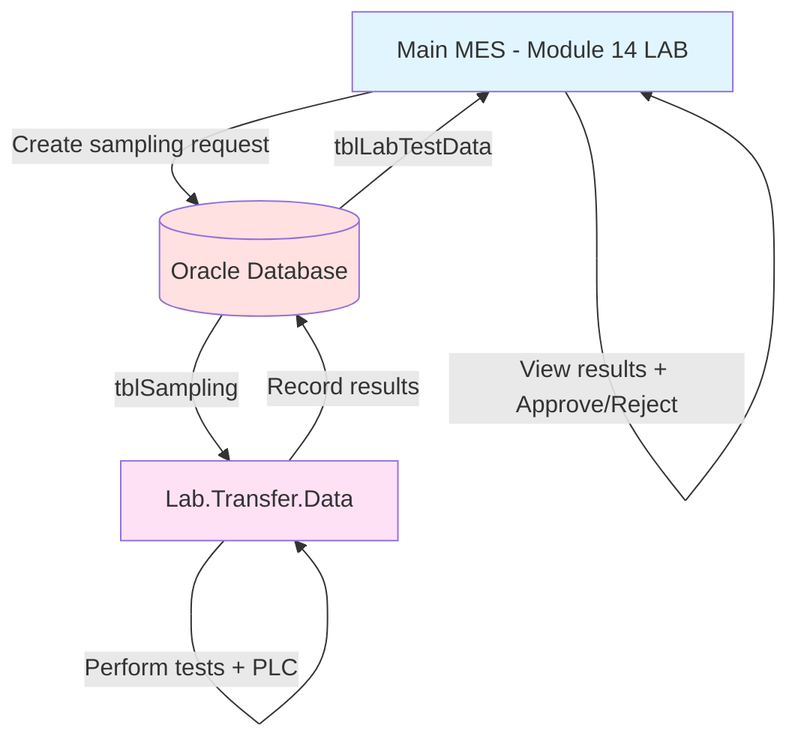

# Module Mapping Corrections - Main MES vs Lab.Transfer.Data

**Created**: 2025-10-10
**Purpose**: Document the discovered module mapping errors and correct task list

---

## 🔍 CRITICAL DISCOVERY

### Documentation Mismatch Found

**Problem**: Process documents do NOT match actual implementations in some cases.

**Root Cause**:
- Some process documents were created conceptually (planned features)
- Actual implementations split between TWO separate solutions:
  - **Main MES**: LuckyTexAirBagV01x02.sln
  - **Lab System**: LuckyTex.Lab.Transfer.Data.sln

---

## ❌ INCORRECT Documentation (Before)

| Process Doc | Claimed Module | Reality |
|-------------|----------------|---------|
| `041-PROCESS_SHIPMENT_MANAGEMENT.md` | Module 14: Shipping | ❌ **NO IMPLEMENTATION** - Conceptual only |
| `PROCESS_UI_LOGIC_TRACKER.md` | Lists "Module 14: Shipping" | ❌ Module 14 is actually **LAB** |

---

## ✅ CORRECTED Module Mapping (After)

### Main MES System - LuckyTexAirBagV01x02.sln

| Module # | Actual Folder | Purpose | XAML Files | Analysis Status |
|----------|---------------|---------|------------|-----------------|
| **M14** | **14 - LAB** | **Sampling requests** | **12 files** | ⏳ **NOT ANALYZED YET** |
| M15 | 15 - CustomerAndLoadingType | Customer config | 1 file | ⏳ Not analyzed |
| M17 | 17 - ItemCode | Master Data | ? files | ⏳ Not analyzed |
| M19 | 19 - 100MRecord | ? | ? files | ⏳ Not analyzed |
| M20 | 20 - QualityAssurance | Quality reporting | 4 files | ⏳ Not analyzed |

**Module 14 LAB Files** (12 XAML pages):
1. GreigeMenuPage.xaml
2. GreigePage.xaml
3. GreigeReceiveSamplingPage.xaml
4. GreigeSamplingStatusPage.xaml
5. LabFinishRecordPage.xaml
6. LABMenuPage.xaml
7. LABPage.xaml
8. MassProMenuPage.xaml
9. MassProPage.xaml
10. ReceiveSamplingPage.xaml
11. SamplingStatusPage.xaml
12. WeavingHistoryPage.xaml

---

### Lab.Transfer.Data System - Separate Solution

**Total**: 11 modules, ~28 XAML files

| Module # | Folder | Purpose | Est. Pages |
|----------|--------|---------|------------|
| 00 | 00 - Common | Menu/navigation | 1 |
| 01 | 01 Lab Test | Excel test operations | 2 |
| 02 | 02 PDF Loading | Import PDF test results | 4 |
| 03 | 03 Lab Data Entry | Manual test entry | 2 |
| 04 | 04 Production | Production test tracking | 2 |
| 05 | 05 Item Code Specification | Product specs | 1 |
| 06 | 06 Sample Test Data | Sample testing workflow | 5 |
| 07 | 07 PLC Get Data | **Lab equipment PLC** ⭐ | 6 |
| 08 | 08 Import Excel | Import Excel test data | 1 |
| 09 | 09 Sample Report | Sample reports | 1 |
| 10 | 10 LABReportSetting | Report config | 1 |
| 11 | 11 UploadLABReport | Upload reports | 1 |

---

## 🔗 Integration Flow Between Systems

**Workflow**:
1. **Main MES (M14 - LAB)**: Production creates sampling requests
2. **Database**: Stores requests in `tblSampling`
3. **Lab.Transfer.Data**: Lab receives samples, performs tests (manual + PLC equipment)
4. **Database**: Lab records results in `tblLabTestData`
5. **Main MES (M14 - LAB)**: Production views results, approves/rejects lots

---

## 📋 CORRECTED Task List for Main MES Completion

### Currently Complete: 23/30 (77%)

**Remaining Work** (7 items → Actually need to verify exact count):

### ✅ Priority 1: Module 14 (LAB) - CRITICAL
- [ ] **Task 21**: Analyze Module 14 (LAB) - 12 XAML pages
  - [ ] GreigePage.xaml (greige fabric sampling)
  - [ ] MassProPage.xaml (mass production sampling)
  - [ ] ReceiveSamplingPage.xaml (receive samples from production)
  - [ ] SamplingStatusPage.xaml (track sampling status)
  - [ ] LABPage.xaml (lab operations)
  - [ ] LabFinishRecordPage.xaml (finish lab records)
  - [ ] WeavingHistoryPage.xaml (weaving history for lab)
  - [ ] GreigeReceiveSamplingPage.xaml (greige sampling)
  - [ ] GreigeSamplingStatusPage.xaml (greige status)
  - [ ] LABMenuPage.xaml (menu)
  - [ ] GreigeMenuPage.xaml (greige menu)
  - [ ] MassProMenuPage.xaml (mass production menu)

**Why Priority 1**:
- Required to understand Lab.Transfer.Data integration
- Sampling workflow is critical for Lab analysis
- Integration point between two systems

---

### ✅ Priority 2: Module 17 (Master Data) - 6 documents

Process documents already exist:
- [ ] **Task 22**: `042-PROCESS_MACHINE_MANAGEMENT.md`
- [ ] **Task 23**: `043-PROCESS_EMPLOYEE_MANAGEMENT.md`
- [ ] **Task 24**: `044-PROCESS_SHIFT_MANAGEMENT.md`
- [ ] **Task 25**: `045-PROCESS_PRODUCT_MANAGEMENT.md`
- [ ] **Task 26**: `046-PROCESS_CUSTOMER_SUPPLIER_MANAGEMENT.md`
- [ ] **Task 27**: `047-PROCESS_REFERENCE_DATA_MANAGEMENT.md`

**Why Priority 2**:
- Shared tables used by both Main MES and Lab system
- Foundation for all modules

---

### ✅ Priority 3: Module 19 (D365 Integration) - 1 document

- [ ] **Task 28**: `048-PROCESS_ERP_SYNCHRONIZATION.md`

**Note**: May already be documented in other modules (Warping, Weaving, Finishing all have D365 integration)

---

### ✅ Priority 4: Module 20 (Quality Assurance) - 4 XAML pages

- [ ] **Task 29**: Analyze Module 20 (QualityAssurance)
  - [ ] CheckingAirbagReportPage.xaml
  - [ ] CheckingReportDataPage.xaml
  - [ ] ManagementPage.xaml
  - [ ] QualityAssuranceMenuPage.xaml

---

### ⚠️ Optional: Module 15 (CustomerAndLoadingType) - 1 page

- [ ] **Task 30**: Analyze Module 15 (CustomerAndLoadingType)
  - [ ] CustomerLoadingPage.xaml (1 page - minor config)

**Why Optional**: Very small module, likely simple configuration

---

### ❌ REMOVED: "Module 14 - Shipping"

- ~~Task 21: `041-PROCESS_SHIPMENT_MANAGEMENT.md`~~ ❌ **NO IMPLEMENTATION FOUND**
- **Status**: This is a **CONCEPTUAL/PLANNED** feature document
- **Action**: Mark as "Not Implemented" in tracker
- **Note**: No shipping module exists in codebase

---

## 📊 Updated Progress Calculation

### Old (Incorrect):
- **Total**: 30 process documents
- **Complete**: 23 documents
- **Remaining**: 7 documents
- **Progress**: 77%

### New (Corrected):
- **Total**: ~30 documents (need to verify exact count)
- **Complete**: 23 documents
- **Remaining**: ~7-10 documents (depends on what actually exists)
- **Module 14 LAB**: 12 XAML pages (NOT ANALYZED YET)
- **Module 20 QA**: 4 XAML pages (NOT ANALYZED YET)
- **Progress**: ~75-80% (need recount after verification)

---

## 🎯 Execution Plan (Before Starting Tasks)

### STEP 1: Complete Verification ⏳ IN PROGRESS
- [x] Scan Lab.Transfer.Data solution
- [x] Compare Main MES Module 14 vs Lab system
- [x] Document module mapping corrections
- [ ] **Verify ALL remaining process documents vs actual implementations**
- [ ] **Create final accurate task list**

### STEP 2: Analyze Module 14 (LAB) - Main MES
- [ ] Read 12 XAML files
- [ ] Extract sampling workflow
- [ ] Document integration points with Lab.Transfer.Data
- [ ] Create UI logic analysis documents
- [ ] Update tracker

### STEP 3: Complete Module 17, 19, 20
- [ ] Module 17: Master Data (6 docs)
- [ ] Module 19: D365 Integration (1 doc or skip if already covered)
- [ ] Module 20: QualityAssurance (4 pages)

### STEP 4: Main MES 100% Complete
- [ ] Update `.PROCESS_UI_LOGIC_TRACKER.md`
- [ ] Update `MODERNIZATION_SESSION_TRACKER.md`
- [ ] Mark Main MES analysis complete

### STEP 5: Start Lab.Transfer.Data Analysis
- [ ] Copy `.LAB_TRANSFER_DATA_PROJECT_TRACKER.md` to active tracker
- [ ] Begin Lab analysis with full Main MES context
- [ ] Generate 11 Lab process documents
- [ ] Analyze ~27 Lab UI logic documents

---

## ⚠️ Action Items (BEFORE executing any task)

### Immediate Next Steps:

1. **Verify Process Documents vs Implementations**
   - [ ] Read `Documents/Processes/` folder structure
   - [ ] Cross-check each process doc against actual XAML files
   - [ ] Identify which docs are conceptual vs implemented
   - [ ] Create FINAL accurate task list

2. **Update Tracker Files**
   - [ ] Update `.PROCESS_UI_LOGIC_TRACKER.md` with corrections
   - [ ] Fix Module 14 name (Shipping → LAB)
   - [ ] Add Module 20 (QualityAssurance) if missing
   - [ ] Remove or mark "Not Implemented" for conceptual docs

3. **Create Clean Task List**
   - [ ] List ONLY implemented features
   - [ ] Prioritize by dependency (Module 14 LAB first)
   - [ ] Estimate effort per module
   - [ ] Get user confirmation before starting

---

## 📝 Notes

### Lessons Learned:
1. **Always verify process docs against actual code**
2. **Two separate solutions** (Main MES + Lab) complicate analysis
3. **Module numbers** don't always correspond to folder numbers
4. **Process documents** may be conceptual/planned features

### Dependencies:
- Main MES Module 14 (LAB) ← **MUST** analyze before Lab.Transfer.Data
- Master Data (Module 17) ← Shared by both systems
- Lab.Transfer.Data ← Depends on understanding Main MES Module 14

### Critical Integration Points:
- **Database tables**: `tblSampling`, `tblLabTestData`
- **Workflow**: Production → Sampling Request → Lab Test → Results → Approval
- **Shared libraries**: LuckyTex.AirBag.Core, LuckyTex.AirBag.Controls (used by both systems)

---

**Document Version**: 1.0
**Status**: ✅ Corrections documented, ready to verify remaining tasks
**Next Action**: Verify ALL process documents vs implementations before executing tasks
