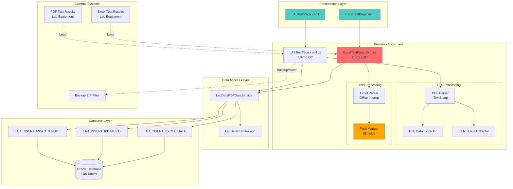
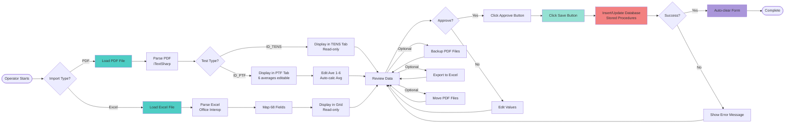

# Process Document: Lab Test Operations (Module 01)

**Document ID**: 001-PROCESS_LAB_TEST_OPERATIONS
**Module**: 01 - Lab Test
**Process Name**: Lab Test Operations (PDF and Excel Import)
**Version**: 1.0
**Last Updated**: 2025-10-11

---

## 1. Process Overview

### 1.1 Purpose
Import and manage laboratory test results from external test equipment via PDF and Excel files. This module handles two primary test result formats:
- **PDF Import**: Tensile strength test results (ID_PTF and ID_TENS formats)
- **Excel Import**: Comprehensive quality control test data

### 1.2 Scope
- **In Scope**:
  - PDF test result parsing and import (PTF and TENS test types)
  - Excel test result import (50+ quality parameters)
  - Manual data correction and approval workflow
  - Test result backup and file management
  - Operator tracking and approval

- **Out of Scope**:
  - Physical test execution (handled by lab equipment)
  - Test specification management (Module 05)
  - Report generation (Module 09)

### 1.3 Business Context
Quality control laboratory receives test results from automated testing equipment in PDF and Excel formats. These results must be imported into the MES system for traceability, approval, and integration with production lot tracking.

### 1.4 Integration Points
- **Upstream**: Lab equipment generates PDF/Excel files
- **Downstream**:
  - Main MES Module 14 (LAB) - sampling requests
  - Module 06 (Sample Test Data) - test approval workflow
  - Module 09 (Sample Report) - test result reporting

---

## 2. UI Files Inventory

### 2.1 XAML Pages

| File Path | Lines | Purpose | Complexity |
|-----------|-------|---------|------------|
| `LuckyTex.Lab.Transfer.Data/Pages/01 Lab Test/LABTestPage.xaml` | 375 | PDF test result import (PTF/TENS) | High |
| `LuckyTex.Lab.Transfer.Data/Pages/01 Lab Test/LABTestPage.xaml.cs` | 1,375 | PDF parsing, data validation, approval | Very High |
| `LuckyTex.Lab.Transfer.Data/Pages/01 Lab Test/ExcelTestPage.xaml` | 510 | Excel test result import | Medium |
| `LuckyTex.Lab.Transfer.Data/Pages/01 Lab Test/ExcelTestPage.xaml.cs` | 2,563 | Excel parsing, 50+ field import | **EXTREME** |

**Total Lines**: 4,823 LOC (largest module in Lab system)

### 2.2 Service Files

| File Path | Purpose |
|-----------|---------|
| `LuckyTex.Lab.Transfer.Data/Services/DataService/LabDataPDFDataService.cs` | Database operations for lab test data |

### 2.3 Model/Data Classes

| Class | Purpose |
|-------|---------|
| `PDFClassData.ListID_PTF` | PTF test result model (6 averages) |
| `PDFClassData.ListID_TENS` | TENS test result model (12 load/strain pairs) |
| `LabDataPDFSession` | Session management for lab operations |

---

## 3. UI Layout Descriptions

### 3.1 LABTestPage (PDF Import)

**Header**: "LAB LOAD PDF" (CornflowerBlue background)

**Top Action Buttons**:
- **Load PDF** - Opens PDF file browser, parses test results
- **Clear** - Clears all loaded data
- **Exp Excel** - Exports data to Excel format
- **Backup** - Creates zip backup of selected PDF files
- **Move** - Moves PDF files to different location

**Main Content - Tabbed Interface**:

#### Tab 1: ID_PTF (Tensile Test - PTF Format)
- **Grid Columns** (16 columns):
  - Specimen Label (read-only)
  - Specimen Rep (read-only)
  - Operator ID (read-only)
  - Weaving Lot (read-only)
  - Weaving Type (read-only)
  - Finishing Lot (read-only)
  - Ave 1-6 (editable TextBox, numeric validation, auto-calculates Avg)
  - Avg (calculated, read-only)
  - Approve (checkbox)
  - Approve (button)

#### Tab 2: ID_TENS (Tensile Test - TENS Format)
- **Grid Columns** (20 columns):
  - Specimen Label, Specimen Rep, Operator ID (read-only)
  - Weaving Lot, Weaving Type, Scouring Lot (read-only)
  - Method Type (read-only)
  - Last Test Date, Last Test Time (read-only)
  - Max Ld 1-6 (read-only, paired with Max Strain 1-6)
  - Max Strain 1-6 (read-only)
  - Approve (button)

#### Tab 3: File PDF
- Simple text display showing currently loaded PDF file path

**Bottom Controls**:
- **Operator** (read-only TextBox) - Current operator ID
- **Save** button - Saves all changes to database

### 3.2 ExcelTestPage (Excel Import)

**Header**: "LAB LOAD Excel"

**Top Action Buttons**:
- **Load Excel** - Opens Excel file browser, imports data
- **Clear** - Clears all loaded data

**Main Content - Single Grid**:
- **68 Columns** (all read-only after import):
  - Item Code, Lot No., Finishing Lot, Testing Date
  - Total Width
  - Usable Width 1-3
  - Total Weight 1-3
  - Thickness 1-3
  - Number of Threads (Warp 1-3, Filling 1-3)
  - Max Force (Warp 1-3, Filling 1-3)
  - Elongation Force (Warp 1-3, Filling 1-3)
  - Edge Comb (Warp 1-3, Filling 1-3)
  - Stiffness (Warp 1-3, Filling 1-3)
  - Tear Strength (Warp 1-3, Filling 1-3)
  - Static Air 1-3
  - Dynamic Air 1-3
  - Exponent 1-3
  - Flammability (Warp, Filling)
  - Dimensional Change (Warp 1-3, Filling 1-3)
  - Bow 1-3, Skew 1-3
  - Entry By, Approve By

**Bottom Controls**:
- **Operator** (read-only TextBox) - Current operator ID

---

## 4. Component Architecture Diagram



---

## 5. Workflow Diagram



---

## 6. Business Logic Sequence Diagram

```mermaid
sequenceDiagram
    actor Operator
    participant UI as LABTestPage/<br/>ExcelTestPage
    participant Parser as PDF/Excel<br/>Parser
    participant Validation as Data<br/>Validator
    participant Service as LabDataPDFDataService
    participant DB as Oracle Database

    Note over Operator,DB: PDF Import Workflow

    Operator->>UI: Click "Load PDF"
    UI->>UI: OpenFileDialog
    Operator->>UI: Select PDF file

    UI->>Parser: Parse PDF (iTextSharp)
    Parser->>Parser: Detect format (PTF/TENS)

    alt Format: ID_PTF
        Parser->>Parser: Extract specimen data<br/>6 averages per row
        Parser-->>UI: Return List<ListID_PTF>
        UI->>UI: Bind to gridPTF<br/>Enable Ave1-6 editing
    else Format: ID_TENS
        Parser->>Parser: Extract tensile data<br/>12 load/strain pairs
        Parser-->>UI: Return List<ListID_TENS>
        UI->>UI: Bind to gridTENS<br/>Read-only mode
    end

    Note over Operator,UI: Data Editing & Validation

    Operator->>UI: Edit Ave1-6 fields (PTF only)
    UI->>Validation: Validate numeric input<br/>Regex: ^([0-9]+(.[0-9]+)?)$

    alt Valid Number
        Validation-->>UI: Accept input
        UI->>UI: Calculate Avg<br/>(Ave1+Ave2+...Ave6)/6
    else Invalid Input
        Validation-->>UI: Reject input (e.Handled=true)
    end

    Operator->>UI: Click "Approve" button (per row)
    UI->>UI: Set Approve checkbox = true

    Note over Operator,DB: Save to Database

    Operator->>UI: Click "Save"
    UI->>Validation: Validate all approved rows

    loop For each approved row
        UI->>Service: LAB_INSERTUPDATETENSILE(...) or<br/>LAB_INSERTUPDATEPTF(...)
        Service->>Service: Check connection
        Service->>DB: Execute stored procedure
        DB->>DB: INSERT or UPDATE tblLabTestData
        DB-->>Service: Return P_RETURN (result code)
        Service-->>UI: Return result string

        alt Success
            UI->>UI: Continue to next row
        else Error
            UI->>Operator: Show error message
            UI->>UI: Stop processing
        end
    end

    UI->>UI: Clear all controls
    UI->>Operator: Show success message

    Note over Operator,DB: Excel Import Workflow

    Operator->>UI: Click "Load Excel"
    UI->>UI: OpenFileDialog (.xlsx)
    Operator->>UI: Select Excel file

    UI->>Parser: Parse Excel (Office Interop)
    Parser->>Parser: Read sheet "Sheet1"
    Parser->>Parser: Map 68 columns<br/>(Item, Lot, 66 test parameters)
    Parser-->>UI: Return DataTable (68 columns)
    UI->>UI: Bind to gridLabEntryProduction<br/>All read-only

    Operator->>UI: Review data
    Operator->>UI: Click "Save"

    loop For each row in grid
        UI->>Service: LAB_INSERT_EXCEL_DATA(...)
        Service->>DB: Execute stored procedure
        DB->>DB: INSERT tblLabProductionTest
        DB-->>Service: Return result
        Service-->>UI: Return status
    end

    UI->>UI: Clear grid
    UI->>Operator: Show completion message

    Note over Operator,UI: Optional Operations

    opt Backup PDFs
        Operator->>UI: Click "Backup"
        UI->>UI: Select PDF files (multi-select)
        UI->>UI: Select destination folder
        UI->>UI: Create ZIP archive
        UI->>Operator: Show success
    end

    opt Move PDFs
        Operator->>UI: Click "Move"
        UI->>UI: Select PDF files
        UI->>UI: Select destination folder
        UI->>UI: Move files
        UI->>Operator: Show success
    end

    opt Export to Excel
        Operator->>UI: Click "Exp Excel"
        UI->>Parser: Generate Excel (Office Interop)
        Parser->>Parser: Create workbook
        Parser->>Parser: Write grid data
        Parser-->>UI: Save file
        UI->>Operator: Show success
    end
```



---

## 7. Data Flow

### 7.1 Input Data

#### PDF Test Results (ID_PTF Format)
```
Source: Lab testing equipment (tensile tester)
Format: PDF file with structured text
Fields:
  - specimenLabel: string (specimen identifier)
  - specimenRep: string (repetition number)
  - operatorID: string (operator who ran test)
  - weavingLot: string (production lot number)
  - weavingType: string (fabric type)
  - finishingLot: string (finishing lot number)
  - ave1-ave6: decimal (6 test measurements)
  - avg: decimal (calculated average)
  - Approve: bool (approval flag)
```

#### PDF Test Results (ID_TENS Format)
```
Source: Lab testing equipment (tensile tester - different format)
Format: PDF file with structured text
Fields:
  - specimenLabel, specimenRep, operatorID: string
  - weavingLot, weavingType, scouringLot: string
  - methodType: string (test method)
  - lastTestDate: string (DD/MM/YYYY)
  - lastTestTime: string (HH:MM:SS)
  - max1-max6: decimal (max load measurements)
  - maxStrain1-maxStrain6: decimal (strain at max load)
```

#### Excel Test Results
```
Source: Lab testing equipment (comprehensive quality tests)
Format: Excel file (.xlsx) - Sheet1
Fields (68 total):
  - ITM_CODE: string (item code)
  - WEAVINGLOT: string (lot number)
  - FINISHINGLOT: string
  - ENTRYDATE: datetime (testing date)
  - WIDTH: decimal (total width)
  - USABLE_WIDTH1-3: decimal
  - TOTALWEIGHT1-3: decimal
  - THICKNESS1-3: decimal
  - NUMTHREADS_W1-3: decimal (warp thread count)
  - NUMTHREADS_F1-3: decimal (filling thread count)
  - MAXFORCE_W1-3: decimal (warp max force)
  - ELONGATIONFORCE_W1-3: decimal (warp elongation)
  - MAXFORCE_F1-3: decimal (filling max force)
  - ELONGATIONFORCE_F1-3: decimal (filling elongation)
  - EDGECOMB_W1-3, EDGECOMB_F1-3: decimal
  - STIFFNESS_W1-3, STIFFNESS_F1-3: decimal
  - TEAR_W1-3, TEAR_F1-3: decimal (tear strength)
  - STATIC_AIR1-3: decimal
  - DYNAMIC_AIR1-3: decimal
  - EXPONENT1-3: decimal
  - FLAMMABILITY_W, FLAMMABILITY_F: decimal
  - DIMENSCHANGE_W1-3, DIMENSCHANGE_F1-3: decimal
  - BOW1-3, SKEW1-3: decimal
  - ENTEYBY: string (entry operator)
  - APPROVEBY: string (approval operator)
```

### 7.2 Output Data

#### To Database (tblLabTestData - PTF)
```
Stored Procedure: LAB_INSERTUPDATEPTF
Parameters:
  - P_ITMCODE: item code
  - P_WEAVINGLOG: weaving lot
  - P_FINISHINGLOT: finishing lot
  - P_OPERATOR: operator ID
  - P_TESTDATE: test date
  - P_TESTTIME: test time
  - P_AVE1-6: decimal (6 measurements)
  - P_AVG: decimal (calculated average)
  - P_UPLOADDATE: datetime
  - P_UPLOADBY: operator
Returns:
  - P_RETURN: string (success/error message)
```

#### To Database (tblLabTestData - TENS)
```
Stored Procedure: LAB_INSERTUPDATETENSILE
Parameters:
  - P_ITMCODE, P_WEAVINGLOG, P_FINISHINGLOT
  - P_OPERATOR, P_TESTDATE, P_TESTTIME
  - P_YARN: string (yarn type)
  - P_TENSILE1-3: decimal (tensile strength)
  - P_ELONG1-3: decimal (elongation)
  - P_UPLOADDATE, P_UPLOADBY
Returns:
  - P_RETURN: string (result code)
```

#### To Database (tblLabProductionTest - Excel)
```
Stored Procedure: LAB_INSERT_EXCEL_DATA
Parameters: (68 fields - all test parameters)
Returns:
  - P_RETURN: string (result code)
```

### 7.3 Data Transformations

1. **PDF Parsing**:
   - Text extraction using iTextSharp
   - Pattern matching to identify PTF vs TENS format
   - Field extraction using regex/string parsing
   - Decimal conversion with culture handling (en-US)

2. **Average Calculation** (PTF only):
   - Formula: `Avg = (Ave1 + Ave2 + Ave3 + Ave4 + Ave5 + Ave6) / 6`
   - Triggered on `LostFocus` event of any Ave1-6 field
   - Auto-updates in grid

3. **Excel Column Mapping**:
   - Column index to field name mapping
   - Type conversion (string → decimal, string → datetime)
   - Null handling for empty cells

4. **File Management**:
   - ZIP backup creation (multi-file compression)
   - File move operations (source → destination)
   - Excel export (grid data → worksheet)

---

## 8. Database Operations

### 8.1 Stored Procedures

| Procedure Name | Purpose | Parameters | Returns |
|----------------|---------|------------|---------|
| `LAB_INSERTUPDATEPTF` | Insert/update PTF test results | Item, Lot, Operator, 6 averages, dates | P_RETURN (status) |
| `LAB_INSERTUPDATETENSILE` | Insert/update TENS test results | Item, Lot, Operator, 3 tensile + 3 elongation, dates | P_RETURN (status) |
| `LAB_INSERT_EXCEL_DATA` | Insert comprehensive Excel test data | 68 quality parameters | P_RETURN (status) |

### 8.2 Table Operations

**Estimated Tables** (based on parameter patterns):

| Table | Operation | Key Fields |
|-------|-----------|------------|
| `tblLabTestData` | INSERT/UPDATE | ITMCODE, WEAVINGLOG, FINISHINGLOT, TESTDATE |
| `tblLabTestPTF` | INSERT/UPDATE | Same as above + AVE1-6 |
| `tblLabTestTENS` | INSERT/UPDATE | Same as above + MAX1-6, MAXSTRAIN1-6 |
| `tblLabProductionTest` | INSERT | All 68 Excel fields |

**Primary Keys**: Composite (ITMCODE + WEAVINGLOG + FINISHINGLOT + TESTDATE)

**Indexes**: Likely on WEAVINGLOG, FINISHINGLOT for lookup performance

### 8.3 Transaction Boundaries

**No explicit transactions in current code** - Each row saved independently:
- Risk: Partial save if error occurs mid-batch
- Implication: No rollback capability for batch imports

---

## 9. Business Rules

### 9.1 PDF Import Rules

1. **Format Detection**: System must auto-detect PTF vs TENS format from PDF content
2. **PTF Editing**: Only Ave1-6 fields are editable; all other fields read-only
3. **TENS Read-Only**: All TENS data is read-only after import (no editing allowed)
4. **Average Calculation**: PTF average auto-calculates on field LostFocus
5. **Approval Required**: Operator must explicitly click "Approve" button per row before saving
6. **Numeric Validation**: Ave1-6 fields accept only numeric input (decimal allowed)

### 9.2 Excel Import Rules

1. **All Read-Only**: Excel data cannot be edited after import (view only)
2. **68-Field Mandate**: All 68 fields must be present in Excel file
3. **Sheet Name**: Must be "Sheet1" (hardcoded expectation)
4. **Batch Import**: All rows imported as a batch on Save
5. **No Approval Workflow**: Excel data saves directly without approval step

### 9.3 File Management Rules

1. **Backup**: Supports multi-file selection for ZIP backup
2. **Move**: Moves files (does not copy) - source files deleted
3. **Export**: Creates new Excel file from current grid data
4. **PDF Path Display**: Tab 3 shows currently loaded PDF file path

### 9.4 Operator Tracking

1. **Operator Field**: Auto-populated from login session
2. **Upload Date**: Auto-set to current datetime on save
3. **Approval Tracking**: APPROVEBY field tracks who approved (Excel only)

---

## 10. Critical Issues & Bugs

### 10.1 Data Integrity Issues

1. ❌ **No Transaction Rollback**: Batch saves process row-by-row without transaction
   - **Impact**: Partial data corruption if error occurs mid-batch
   - **Fix**: Wrap all INSERT/UPDATE in single database transaction

2. ❌ **Silent Exception Handling**: PDF parsing errors may fail silently
   - **Impact**: Missing data without operator notification
   - **Fix**: Add comprehensive error logging and user notifications

3. ❌ **No Data Validation**: Excel import accepts all values without range/spec checking
   - **Impact**: Invalid test results may be saved
   - **Fix**: Add specification-based validation before save

### 10.2 Performance Issues

1. ❌ **No Async Operations**: All PDF/Excel parsing blocks UI thread
   - **Impact**: UI freezes during large file processing (2,563 LOC in ExcelTestPage suggests complex parsing)
   - **Fix**: Implement async/await for file operations

2. ❌ **Grid Rebinding**: Manual grid rebinding instead of ObservableCollection
   - **Impact**: Inefficient UI updates
   - **Fix**: Use MVVM pattern with data binding

### 10.3 Usability Issues

1. ⚠️ **No Progress Indicator**: Large file imports show no progress feedback
2. ⚠️ **No Confirmation Dialogs**: Move/Backup operations have no undo capability
3. ⚠️ **Approval Button Per Row**: Tedious for large batches (should add "Approve All")

---

## 11. Modernization Priorities

### 11.1 Critical (P0)
1. 🔴 **Add Transaction Support** - Wrap batch saves in database transaction
2. 🔴 **Implement Async/Await** - All file I/O and database operations
3. 🔴 **Add Input Validation** - Validate against test specifications

### 11.2 High (P1)
4. 🟠 **Refactor ExcelTestPage** (2,563 LOC) - Extract parsing logic to separate service
5. 🟠 **Add Error Logging** - Comprehensive exception tracking (NLog/Serilog)
6. 🟠 **MVVM Refactoring** - Separate UI from business logic

### 11.3 Medium (P2)
7. 🟡 **Add Progress Indicators** - Show progress for long operations
8. 🟡 **Bulk Approval** - Add "Approve All" button
9. 🟡 **Confirmation Dialogs** - Confirm before Move/Delete operations
10. 🟡 **PDF Format Flexibility** - Support multiple PDF formats/versions

---

## 12. Integration Analysis

### 12.1 Upstream Dependencies

**Lab Testing Equipment**:
- Must generate PDF in exact expected format (ID_PTF or ID_TENS)
- Must generate Excel with exact 68-column structure
- Format changes in equipment will break import

### 12.2 Downstream Consumers

**Main MES Module 14 (LAB)**:
- Creates sampling requests (tblSampling table)
- This module imports test results against those requests
- Sample workflow: Request → Test → Import Results → Approve

**Module 06 (Sample Test Data)**:
- Displays imported test results
- Approval workflow continues here
- Links to production lot traceability

**Module 09 (Sample Report)**:
- Generates reports from imported test data
- Requires complete dataset (all 68 fields for comprehensive reports)

### 12.3 Shared Database Tables

- `tblLabTestData` - Shared by multiple modules
- `tblEmployee` - Operator tracking
- `tblProduct` - Item code validation
- `tblSampling` - Sampling request linkage

---

## 13. Implementation Checklist

### 13.1 Repository Layer Tasks
- [ ] Create `ILabTestRepository` interface
- [ ] Implement `LabTestRepository` with async methods
- [ ] Add transaction support (`BeginTransaction`, `Commit`, `Rollback`)
- [ ] Create unit tests for repository operations
- [ ] Add stored procedure wrapper methods

### 13.2 Service Layer Tasks
- [ ] Create `ILabTestService` interface
- [ ] Implement `LabTestService` with business logic
- [ ] Extract PDF parsing to `IPDFParserService`
- [ ] Extract Excel parsing to `IExcelParserService`
- [ ] Add validation service `ILabTestValidationService`
- [ ] Implement async file operations
- [ ] Add comprehensive error handling

### 13.3 UI Refactoring Tasks
- [ ] Create `LABTestViewModel` (MVVM pattern)
- [ ] Create `ExcelTestViewModel`
- [ ] Implement `ICommand` for all button actions
- [ ] Replace manual grid binding with `ObservableCollection<T>`
- [ ] Add `INotifyPropertyChanged` for data binding
- [ ] Implement `IsBusy` indicator for async operations
- [ ] Add data validation attributes on models

### 13.4 Testing Tasks
- [ ] Unit tests for PDF parser (PTF and TENS formats)
- [ ] Unit tests for Excel parser (68-field mapping)
- [ ] Unit tests for average calculation logic
- [ ] Integration tests for database operations
- [ ] UI automation tests for approval workflow
- [ ] Performance tests for large file imports (>1000 rows)
- [ ] Error handling tests (malformed PDF/Excel)

### 13.5 Documentation Tasks
- [ ] Document PDF format specifications (PTF and TENS)
- [ ] Document Excel template structure (68 columns)
- [ ] Create operator training guide
- [ ] Document error codes and troubleshooting
- [ ] API documentation for service layer

---

## 14. Technical Debt Assessment

**Current Complexity**: **EXTREME**
- ExcelTestPage: 2,563 LOC (largest file in Lab system)
- LABTestPage: 1,375 LOC
- Total: 3,938 LOC in code-behind (anti-pattern)

**Estimated Refactoring Effort**:
- Repository layer: 3-5 days
- Service layer: 5-7 days
- MVVM refactoring: 7-10 days
- Testing: 5-7 days
- **Total**: 20-29 days

**Risk Level**: **HIGH**
- No transaction support (data corruption risk)
- No async operations (poor UX)
- Tight coupling (hard to maintain)
- No automated tests (regression risk)

---

## 15. Appendix

### 15.1 File Format Examples

**PDF PTF Format** (Expected structure):
```
Specimen label: S001
Specimen Rep: 1
Operator ID: OPR001
Weaving Lot no.: WL20251011001
Weaving Type: Standard
Finishing Lot no.: FL20251011001
Ave 1: 123.45
Ave 2: 125.67
Ave 3: 124.89
Ave 4: 126.12
Ave 5: 123.98
Ave 6: 125.34
```

**PDF TENS Format** (Expected structure):
```
Specimen label: S002
Method Type: ASTM D5034
Last test date: 11/10/2025
Last test time: 14:35:22
Max Ld 1: 350.5
Max Strain 1: 15.2
Max Ld 2: 352.8
Max Strain 2: 15.4
...
```

**Excel Format** (Column headers in Row 1):
```
ITM_CODE | WEAVINGLOT | FINISHINGLOT | ENTRYDATE | WIDTH | USABLE_WIDTH1 | ... (68 columns total)
```

### 15.2 Libraries Used

- **iTextSharp** (PDF parsing) - Version TBD
- **Microsoft.Office.Interop.Excel** (Excel parsing) - Office Automation
- **NLib.Data** (Database framework) - Proprietary
- **System.Data.OracleClient** (Oracle connectivity) - .NET Framework 4.0

---

**Document Status**: ✅ Complete
**Review Status**: Pending
**Approved By**: TBD
**Approval Date**: TBD
