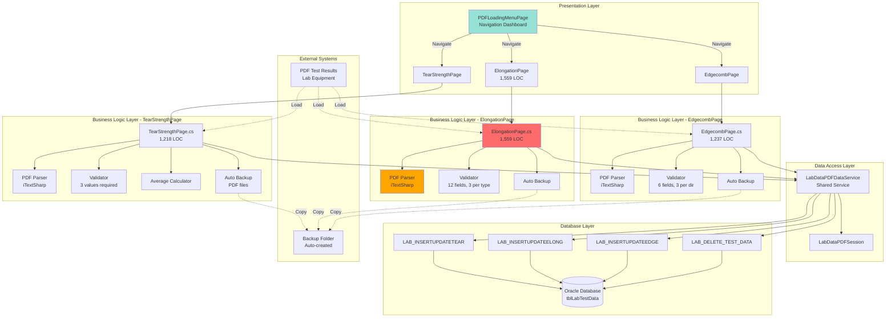
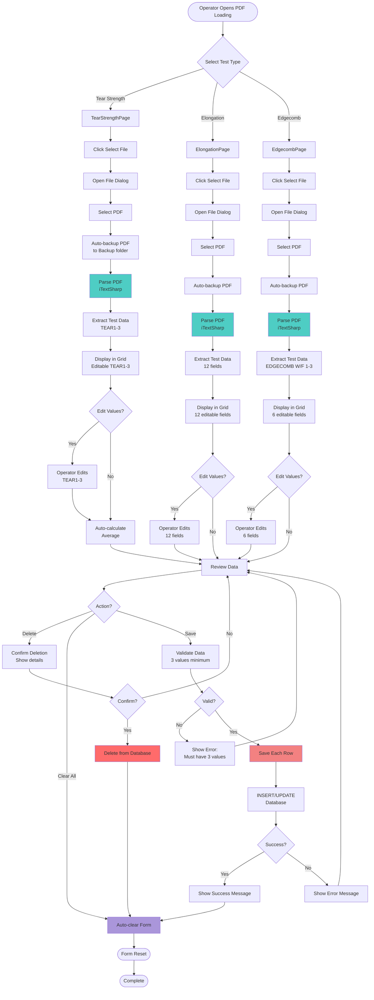

# Process Document: PDF Test Import (Module 02)

**Document ID**: 002-PROCESS_PDF_TEST_IMPORT
**Module**: 02 - PDF Loading
**Process Name**: PDF Test Result Import (Tear Strength, Elongation, Edgecomb)
**Version**: 1.0
**Last Updated**: 2025-10-11

---

## 1. Process Overview

### 1.1 Purpose
Import specific quality test results from PDF files generated by automated lab testing equipment. Module 02 handles three specialized test types that are distinct from the general PDF import in Module 01:
- **Tear Strength** - Fabric tear resistance measurement
- **Tensile Strength / Elongation** - Fabric stretching properties
- **Edgecomb Resistance** - Edge stability testing

### 1.2 Scope
- **In Scope**:
  - PDF parsing for 3 specific test types
  - Test result validation (3 values per yarn type required)
  - Manual data entry and correction
  - Database storage with operator tracking
  - File backup management
  - Row deletion capability

- **Out of Scope**:
  - Test equipment operation
  - Test specification management (Module 05)
  - General PDF import (Module 01)
  - Report generation (Module 09)

### 1.3 Business Context
Quality control lab uses specialized testing equipment that outputs results in PDF format. Each test type (Tear, Elongation, Edgecomb) has its own PDF format and data structure. Results must be imported, validated for completeness (minimum 3 values per yarn direction), and stored for traceability.

### 1.4 Integration Points
- **Upstream**: Automated testing equipment generates PDF files
- **Downstream**:
  - Module 06 (Sample Test Data) - test result retrieval
  - Module 09 (Sample Report) - quality reporting
  - Main MES Module 14 (LAB) - production lot linkage

---

## 2. UI Files Inventory

### 2.1 XAML Pages

| File Path | Lines (XAML) | Lines (C#) | Purpose | Complexity |
|-----------|--------------|------------|---------|------------|
| `LuckyTex.Lab.Transfer.Data/Pages/02 PDF Loading/PDFLoadingMenuPage.xaml` | 111 | 138 | Menu navigation (3 test types) | Low |
| `LuckyTex.Lab.Transfer.Data/Pages/02 PDF Loading/TearStrengthPage.xaml` | ~400 | 1,218 | Tear strength PDF import | High |
| `LuckyTex.Lab.Transfer.Data/Pages/02 PDF Loading/ElongationPage.xaml` | ~400 | 1,559 | Tensile/elongation PDF import | **Very High** |
| `LuckyTex.Lab.Transfer.Data/Pages/02 PDF Loading/EdgecombPage.xaml` | ~400 | 1,237 | Edgecomb resistance PDF import | High |

**Total Lines**: ~4,900 LOC (4,152 C# + 748 XAML)

### 2.2 Service Files

Shared with Module 01:
- `LuckyTex.Lab.Transfer.Data/Services/DataService/LabDataPDFDataService.cs`

### 2.3 Model/Data Classes

| Class | Purpose |
|-------|---------|
| `PDFClassData.ListTEAR` | Tear strength test result model |
| `PDFClassData.ListELONG` | Elongation test result model |
| `PDFClassData.ListEDGE` | Edgecomb test result model |

---

## 3. UI Layout Descriptions

### 3.1 PDFLoadingMenuPage (Navigation Dashboard)

**Header**: "PDF Loading" (CornflowerBlue, large font)

**Main Content - 3 Menu Buttons** (Large, centered grid layout):
1. **Tensile Strength / Elongation** (Top-left position)
2. **Edgecomb Resistance** (Top-right position)
3. **Tear Strength** (Bottom-left position)

**Layout**: 5×5 grid with buttons in strategic positions (padding for visual balance)

**Navigation**: Each button opens corresponding specialized page

---

### 3.2 TearStrengthPage (Tear Strength Import)

**Header**: "Tear Strength Menu"

**Top Controls**:
- **Label**: "Tear Strength : "
- **Select File** button - Opens PDF file browser
- **Operator** (read-only TextBox) - Current operator ID

**Main Grid** - "Tear Strength (N)" section:
- **Columns** (11 total):
  - Specimen label (read-only)
  - Specimen Rep (read-only)
  - Operator (read-only)
  - Weaving Lot (read-only)
  - Weaving Type (read-only)
  - Finishing Lot (read-only)
  - Yarn Type (read-only)
  - **TEAR 1** (editable TextBox, numeric only)
  - **TEAR 2** (editable TextBox, numeric only)
  - **TEAR 3** (editable TextBox, numeric only)
  - Average (calculated, read-only)

**Bottom Action Buttons**:
- **Clear All** - Clears all data and resets form
- **Delete** - Deletes selected row from database (with confirmation)
- **Save** - Validates and saves all rows to database

**Features**:
- Auto-backup to configurable folder on load
- Validation: Must have 3 TEAR values (TEAR1, TEAR2, TEAR3)
- Auto-calculation: Average = (TEAR1 + TEAR2 + TEAR3) / 3
- Numeric-only validation on TEAR fields

---

### 3.3 ElongationPage (Tensile Strength / Elongation Import)

**Header**: "Tensile Strength / Elongation Menu"

**Structure**: Similar to TearStrengthPage

**Main Grid** - Dual column sections:

**Section 1: Tensile Strength (Warp)** (6 columns):
  - TENS_W1, TENS_W2, TENS_W3 (editable)
  - ELONGATION_W1, ELONGATION_W2, ELONGATION_W3 (editable)

**Section 2: Tensile Strength (Weft)** (6 columns):
  - TENS_F1, TENS_F2, TENS_F3 (editable)
  - ELONGATION_F1, ELONGATION_F2, ELONGATION_F3 (editable)

**Total Editable Fields**: 12 per row (6 Warp + 6 Weft)

**Validation Rules**:
- Must have 3 values for Warp direction
- Must have 3 values for Weft direction
- All fields numeric only

**Complexity**: **HIGHEST** in Module 02 (1,559 LOC, 12 editable fields)

---

### 3.4 EdgecombPage (Edgecomb Resistance Import)

**Header**: "Edgecomb Resistance Menu"

**Structure**: Similar to TearStrengthPage

**Main Grid** - Dual direction testing:

**Edgecomb (Warp)** (3 columns):
  - EDGECOMB_W1, EDGECOMB_W2, EDGECOMB_W3 (editable)

**Edgecomb (Weft)** (3 columns):
  - EDGECOMB_F1, EDGECOMB_F2, EDGECOMB_F3 (editable)

**Total Editable Fields**: 6 per row (3 Warp + 3 Weft)

**Validation Rules**:
- Must have 3 values for Warp direction
- Must have 3 values for Weft direction

---

## 4. Component Architecture Diagram



---

## 5. Workflow Diagram



---

## 6. Business Logic Sequence Diagram

```mermaid
sequenceDiagram
    actor Operator
    participant UI as TearStrengthPage/<br/>ElongationPage/<br/>EdgecombPage
    participant Parser as PDF Parser<br/>(iTextSharp)
    participant Backup as Backup Manager
    participant Validator as Data Validator
    participant Service as LabDataPDFDataService
    participant DB as Oracle Database

    Note over Operator,DB: PDF Import Workflow

    Operator->>UI: Click "Select File"
    UI->>UI: OpenFileDialog
    Operator->>UI: Select PDF file

    UI->>Backup: CreateDirectoryBackup()
    Backup->>Backup: Check backup folder exists
    alt Folder not exists
        Backup->>Backup: Create folder (config path)
    end

    UI->>Backup: Copy PDF to backup folder
    Backup-->>UI: Backup complete

    UI->>Parser: Parse PDF (iTextSharp)
    Parser->>Parser: Open PDF document
    Parser->>Parser: Extract text content
    Parser->>Parser: Parse test data fields

    alt TearStrengthPage
        Parser->>Parser: Extract:<br/>- Specimen label/rep<br/>- Weaving/Finishing Lot<br/>- Yarn Type<br/>- TEAR1, TEAR2, TEAR3
        Parser-->>UI: Return List<ListTEAR>
        UI->>UI: Bind to gridTEAR
        UI->>UI: Calculate Average<br/>(TEAR1+TEAR2+TEAR3)/3
    else ElongationPage (Most Complex)
        Parser->>Parser: Extract:<br/>- TENS_W1-3, ELONG_W1-3<br/>- TENS_F1-3, ELONG_F1-3
        Parser-->>UI: Return List<ListELONG>
        UI->>UI: Bind to gridELONG<br/>12 editable fields
    else EdgecombPage
        Parser->>Parser: Extract:<br/>- EDGECOMB_W1-3<br/>- EDGECOMB_F1-3
        Parser-->>UI: Return List<ListEDGE>
        UI->>UI: Bind to gridEDGE
    end

    Note over Operator,UI: Data Editing

    Operator->>UI: Edit field values
    UI->>UI: NumberValidation<br/>(Numeric only)

    alt TearStrength
        UI->>UI: On LostFocus:<br/>Recalculate Average
    end

    Note over Operator,DB: Save Operation

    Operator->>UI: Click "Save"
    UI->>Validator: ChkSave() - Validate data

    alt TearStrength
        Validator->>Validator: Check: TEAR1, TEAR2, TEAR3<br/>all have values
    else Elongation
        Validator->>Validator: Check: TENS_W1-3 have values<br/>AND TENS_F1-3 have values
    else Edgecomb
        Validator->>Validator: Check: EDGECOMB_W1-3 have values<br/>AND EDGECOMB_F1-3 have values
    end

    alt Validation Failed
        Validator-->>UI: Return false
        UI->>Operator: Show error:<br/>"Must have 3 Values"
    else Validation Passed
        Validator-->>UI: Return true

        loop For each row in grid
            UI->>Service: LAB_INSERTUPDATETEAR(...) or<br/>LAB_INSERTUPDATEELONG(...) or<br/>LAB_INSERTUPDATEEDGE(...)
            Service->>Service: Check connection
            Service->>DB: Execute stored procedure
            DB->>DB: INSERT or UPDATE tblLabTestData
            DB-->>Service: Return P_RETURN
            Service-->>UI: Return result

            alt Error
                UI->>Operator: Show error message
                UI->>UI: Stop processing
            end
        end

        UI->>Operator: Show "Upload Complete"
        UI->>UI: Clear all controls
    end

    Note over Operator,DB: Delete Operation

    Operator->>UI: Select row
    UI->>UI: Store: itemCode, weavingLot,<br/>finishingLot, yarnType

    Operator->>UI: Click "Delete"
    UI->>UI: Build confirmation message<br/>with row details

    UI->>Operator: ShowMessageOKCancel<br/>"Do you want to Delete?"

    alt Operator confirms
        Operator-->>UI: OK
        UI->>Service: DeleteRow(itemCode, lot...)
        Service->>DB: LAB_DELETE_TEST_DATA(...)
        DB->>DB: DELETE FROM tblLabTestData<br/>WHERE keys match
        DB-->>Service: Return result
        Service-->>UI: Return true/false

        alt Delete success
            UI->>UI: Clear selection vars
            UI->>Operator: Show success
        else Delete failed
            UI->>Operator: Show error
        end
    else Operator cancels
        Operator-->>UI: Cancel
        UI->>UI: No action
    end

    Note over Operator,UI: Clear All Operation

    Operator->>UI: Click "Clear All"
    UI->>UI: ClearControl()
    UI->>UI: Reset all fields
    UI->>UI: Clear grid
    UI->>UI: Reset variables
```



---

## 7. Data Flow

### 7.1 Input Data

#### PDF Test Results - Tear Strength Format
```
Source: Tear strength testing equipment
Format: PDF file with structured text
Fields:
  - specimenLabel: string (specimen ID)
  - specimenRep: string (repetition number)
  - operatorID: string
  - weavingLot: string
  - weavingType: string
  - finishingLot: string
  - yarnType: string (Warp or Weft)
  - TEAR1: decimal (Newton)
  - TEAR2: decimal (Newton)
  - TEAR3: decimal (Newton)
  - average: decimal (calculated)
```

#### PDF Test Results - Elongation Format
```
Source: Tensile/elongation testing equipment
Format: PDF file with structured text
Fields:
  - specimenLabel, specimenRep, operatorID: string
  - weavingLot, weavingType, finishingLot: string
  - TENS_W1, TENS_W2, TENS_W3: decimal (Warp tensile strength)
  - ELONGATION_W1, ELONGATION_W2, ELONGATION_W3: decimal (Warp elongation %)
  - TENS_F1, TENS_F2, TENS_F3: decimal (Weft tensile strength)
  - ELONGATION_F1, ELONGATION_F2, ELONGATION_F3: decimal (Weft elongation %)
```

#### PDF Test Results - Edgecomb Format
```
Source: Edgecomb resistance testing equipment
Format: PDF file with structured text
Fields:
  - specimenLabel, specimenRep, operatorID: string
  - weavingLot, weavingType, finishingLot: string
  - EDGECOMB_W1, EDGECOMB_W2, EDGECOMB_W3: decimal (Warp direction)
  - EDGECOMB_F1, EDGECOMB_F2, EDGECOMB_F3: decimal (Weft direction)
```

### 7.2 Output Data

#### To Database - Tear Strength
```
Stored Procedure: LAB_INSERTUPDATETEAR
Parameters:
  - P_ITMCODE: item code
  - P_WEAVINGLOG: weaving lot
  - P_FINISHINGLOT: finishing lot
  - P_YARNTYPE: yarn type (Warp/Weft)
  - P_OPERATOR: operator ID
  - P_TESTDATE: test date
  - P_TEAR1, P_TEAR2, P_TEAR3: decimal
  - P_AVERAGE: decimal (calculated)
  - P_UPLOADDATE: datetime
  - P_UPLOADBY: operator
Returns:
  - P_RETURN: string (success/error)
```

#### To Database - Elongation
```
Stored Procedure: LAB_INSERTUPDATEELONG
Parameters:
  - P_ITMCODE, P_WEAVINGLOG, P_FINISHINGLOT
  - P_OPERATOR, P_TESTDATE, P_UPLOADDATE, P_UPLOADBY
  - P_TENS_W1, P_TENS_W2, P_TENS_W3
  - P_ELONG_W1, P_ELONG_W2, P_ELONG_W3
  - P_TENS_F1, P_TENS_F2, P_TENS_F3
  - P_ELONG_F1, P_ELONG_F2, P_ELONG_F3
Returns:
  - P_RETURN: string
```

#### To Database - Edgecomb
```
Stored Procedure: LAB_INSERTUPDATEEDGE
Parameters:
  - P_ITMCODE, P_WEAVINGLOG, P_FINISHINGLOT
  - P_OPERATOR, P_TESTDATE, P_UPLOADDATE, P_UPLOADBY
  - P_EDGECOMB_W1, P_EDGECOMB_W2, P_EDGECOMB_W3
  - P_EDGECOMB_F1, P_EDGECOMB_F2, P_EDGECOMB_F3
Returns:
  - P_RETURN: string
```

#### Delete Operation
```
Stored Procedure: LAB_DELETE_TEST_DATA
Parameters:
  - P_ITMCODE: item code
  - P_WEAVINGLOG: weaving lot
  - P_FINISHINGLOT: finishing lot
  - P_YARNTYPE: yarn type
  - P_TESTTYPE: test type (TEAR/ELONG/EDGE)
Returns:
  - P_RETURN: string
```

### 7.3 Data Transformations

1. **PDF Parsing** (iTextSharp):
   - Text extraction from PDF document
   - Field identification using pattern matching
   - Decimal conversion with en-US culture

2. **Average Calculation** (Tear Strength):
   - Formula: `Average = (TEAR1 + TEAR2 + TEAR3) / 3`
   - Triggered on field LostFocus event
   - Auto-updates in grid

3. **Validation Logic**:
   - Tear Strength: Must have TEAR1, TEAR2, TEAR3 (3 values)
   - Elongation: Must have 3 Warp values AND 3 Weft values (6 values minimum)
   - Edgecomb: Must have 3 Warp values AND 3 Weft values (6 values minimum)

4. **Backup Management**:
   - Auto-create backup folder from config (if not exists)
   - Copy PDF file to backup folder before processing
   - Preserve original filename

---

## 8. Database Operations

### 8.1 Stored Procedures

| Procedure Name | Purpose | Key Parameters | Returns |
|----------------|---------|----------------|---------|
| `LAB_INSERTUPDATETEAR` | Insert/update tear strength results | Item, Lot, TEAR1-3, Average | P_RETURN |
| `LAB_INSERTUPDATEELONG` | Insert/update elongation results | Item, Lot, TENS/ELONG W/F 1-3 (12 values) | P_RETURN |
| `LAB_INSERTUPDATEEDGE` | Insert/update edgecomb results | Item, Lot, EDGECOMB W/F 1-3 (6 values) | P_RETURN |
| `LAB_DELETE_TEST_DATA` | Delete specific test record | Item, Lot, YarnType, TestType | P_RETURN |

### 8.2 Table Operations

**Primary Table**: `tblLabTestData`

**Operations**:
- INSERT: New test results
- UPDATE: Existing test results (if re-importing same lot)
- DELETE: Remove erroneous records

**Primary Key** (Composite):
- ITMCODE + WEAVINGLOG + FINISHINGLOT + TESTTYPE + YARNTYPE

### 8.3 Transaction Boundaries

**Current Implementation**: No explicit transactions
- Each row saved independently
- Risk: Partial save if error occurs mid-batch
- Delete operation: Single-row atomic operation (safer)

---

## 9. Business Rules

### 9.1 Validation Rules

1. **3-Value Minimum** (All test types):
   - Tear Strength: Must have TEAR1, TEAR2, TEAR3
   - Elongation: Must have TENS_W1-3 AND TENS_F1-3
   - Edgecomb: Must have EDGECOMB_W1-3 AND EDGECOMB_F1-3
   - Error message: "Samples Data must have 3 Values Please Check again"

2. **Numeric Validation**:
   - All measurement fields accept only numeric input
   - Decimal values allowed
   - Validation on KeyDown event

3. **Operator Tracking**:
   - Operator ID auto-populated from session
   - Read-only field (cannot be edited)
   - Tracked in database (UPLOADBY field)

### 9.2 File Management Rules

1. **Auto-Backup on Load**:
   - PDF automatically copied to backup folder
   - Backup folder created if not exists
   - Backup path from configuration

2. **Delete Confirmation**:
   - Must confirm before deleting row
   - Shows: Item Code, Weaving Lot, Finishing Lot, Yarn Type
   - Delete affects database immediately (no undo)

3. **Clear All**:
   - Clears all data from grid and form
   - No database changes
   - No confirmation required

### 9.3 Average Calculation Rule (Tear Strength Only)

- Formula: `Average = (TEAR1 + TEAR2 + TEAR3) / 3`
- Triggered: On LostFocus of TEAR1, TEAR2, or TEAR3
- Display: Auto-updated in grid
- Saved to database with test results

---

## 10. Critical Issues & Bugs

### 10.1 Data Integrity Issues

1. ❌ **No Transaction Support** (Same as Module 01):
   - **Impact**: Partial data corruption if save fails mid-batch
   - **Fix**: Wrap batch saves in database transaction

2. ❌ **Silent PDF Parsing Failures**:
   - **Impact**: No error notification if PDF format doesn't match expected structure
   - **Fix**: Add comprehensive error handling and logging

3. ❌ **No Specification Validation**:
   - **Impact**: Values outside acceptable ranges can be saved
   - **Fix**: Validate against min/max specifications from Module 05

### 10.2 Performance Issues

1. ❌ **No Async Operations**:
   - **Impact**: UI freezes during PDF parsing (especially ElongationPage with 1,559 LOC)
   - **Fix**: Implement async/await for file I/O

2. ❌ **Manual Grid Rebinding**:
   - **Impact**: Inefficient UI updates
   - **Fix**: Use ObservableCollection and MVVM

### 10.3 Usability Issues

1. ⚠️ **No Progress Indicator**: PDF parsing shows no progress
2. ⚠️ **Inconsistent Validation Messages**: Different error messages across pages
3. ⚠️ **No Undo for Delete**: Deleted rows cannot be recovered

### 10.4 Code Quality Issues

1. ❌ **Massive Code Duplication**:
   - **Impact**: 3 pages (Tear, Elong, Edge) share 80%+ identical code
   - **Lines**: 1,218 + 1,559 + 1,237 = 4,014 LOC (mostly duplicated logic)
   - **Fix**: Extract common base class or shared service

2. ❌ **ElongationPage Complexity** (1,559 LOC):
   - **Impact**: Hardest file to maintain in Module 02
   - **Fix**: Refactor to MVVM, extract validation logic

---

## 11. Modernization Priorities

### 11.1 Critical (P0)
1. 🔴 **Extract Common Base Class** - 80% code duplication across 3 pages
2. 🔴 **Add Transaction Support** - Prevent partial data corruption
3. 🔴 **Implement Async/Await** - Eliminate UI freezing

### 11.2 High (P1)
4. 🟠 **Refactor ElongationPage** (1,559 LOC) - Most complex file
5. 🟠 **Add Specification Validation** - Validate against min/max ranges
6. 🟠 **Comprehensive Error Logging** - Track PDF parsing failures

### 11.3 Medium (P2)
7. 🟡 **MVVM Refactoring** - All 3 pages
8. 🟡 **Add Progress Indicators** - Show PDF parsing progress
9. 🟡 **Standardize Error Messages** - Consistent UX across pages
10. 🟡 **Add Undo/Audit Trail** - Track deletions

---

## 12. Integration Analysis

### 12.1 Upstream Dependencies

**Lab Testing Equipment**:
- **Tear Strength Tester**: Generates PDF in specific format
- **Tensile/Elongation Tester**: Generates PDF with 12 measurement fields
- **Edgecomb Tester**: Generates PDF with 6 measurement fields
- **Risk**: Equipment upgrades may change PDF formats

### 12.2 Downstream Consumers

**Module 06 (Sample Test Data)**:
- Retrieves test results for sample approval workflow
- Links test results to production lots

**Module 09 (Sample Report)**:
- Generates quality reports from test data
- Requires complete dataset (all 3/6 values)

**Main MES Module 14 (LAB)**:
- Production lot sampling requests
- Quality approval/rejection decisions based on test results

### 12.3 Shared Resources

**With Module 01**:
- Same service layer: `LabDataPDFDataService`
- Same PDF parsing library: iTextSharp
- Same database tables: `tblLabTestData`

**Difference from Module 01**:
- Module 01: General PDF import (PTF, TENS formats)
- Module 02: Specialized test imports (Tear, Elongation, Edgecomb)
- Module 02 has delete capability (Module 01 does not)

---

## 13. Implementation Checklist

### 13.1 Repository Layer Tasks
- [ ] Create `ILabTestRepository` interface
- [ ] Implement `LabTestRepository` with async methods
- [ ] Add transaction support for batch saves
- [ ] Create `DeleteTestRecord` method with audit trail
- [ ] Unit tests for all CRUD operations

### 13.2 Service Layer Tasks
- [ ] Create `ILabTestImportService` interface
- [ ] Extract common PDF parsing logic to base class
- [ ] Implement `TearStrengthImportService`
- [ ] Implement `ElongationImportService`
- [ ] Implement `EdgecombImportService`
- [ ] Add `ISpecificationValidationService`
- [ ] Implement async file operations
- [ ] Add comprehensive error handling

### 13.3 UI Refactoring Tasks
- [ ] Create base `TestImportViewModel` class
- [ ] Create `TearStrengthViewModel`
- [ ] Create `ElongationViewModel`
- [ ] Create `EdgecombViewModel`
- [ ] Extract validation rules to attribute-based validation
- [ ] Implement `ICommand` for all actions
- [ ] Replace manual grid binding with `ObservableCollection`
- [ ] Add `IsBusy` indicator for async operations

### 13.4 Testing Tasks
- [ ] Unit tests for each PDF parser (3 formats)
- [ ] Unit tests for validation logic (3-value rule)
- [ ] Unit tests for average calculation
- [ ] Integration tests for database operations
- [ ] UI automation tests for workflow
- [ ] Error handling tests (malformed PDFs)
- [ ] Performance tests (large batch imports)

### 13.5 Documentation Tasks
- [ ] Document PDF format specifications (3 types)
- [ ] Create operator training guide
- [ ] Document error codes
- [ ] API documentation for service layer
- [ ] Backup/restore procedures

---

## 14. Technical Debt Assessment

**Current Complexity**: **VERY HIGH**

**Code Metrics**:
- Total LOC: 4,014 C# (code-behind)
- Code Duplication: ~80% (3 nearly identical pages)
- Largest File: ElongationPage.cs (1,559 LOC)

**Duplication Analysis**:
| Component | TearStrengthPage | ElongationPage | EdgecombPage | Duplication |
|-----------|------------------|----------------|--------------|-------------|
| PDF Parsing | ✓ | ✓ | ✓ | 100% |
| Backup Logic | ✓ | ✓ | ✓ | 100% |
| Validation | ✓ | ✓ | ✓ | 90% |
| Save Logic | ✓ | ✓ | ✓ | 95% |
| Delete Logic | ✓ | ✓ | ✓ | 100% |
| Clear Logic | ✓ | ✓ | ✓ | 100% |

**Estimated Refactoring Effort**:
- Extract base class: 3-5 days
- Repository layer: 2-3 days
- Service layer: 4-6 days
- MVVM refactoring: 8-10 days
- Testing: 4-6 days
- **Total**: 21-30 days

**Risk Level**: **HIGH**
- No transaction support
- No async operations
- 80% code duplication (maintainability nightmare)
- No automated tests

---

## 15. Appendix

### 15.1 File Format Examples

**PDF Tear Strength Format**:
```
Specimen label: TS001
Specimen Rep: 1
Operator: OPR001
Weaving Lot no.: WL20251011001
Weaving Type: Standard
Finishing Lot no.: FL20251011001
Yarn Type: Warp
TEAR 1: 45.2 N
TEAR 2: 46.8 N
TEAR 3: 45.5 N
```

**PDF Elongation Format**:
```
Specimen label: EL001
...
TENS_W1: 350.5
ELONGATION_W1: 15.2
TENS_W2: 352.3
ELONGATION_W2: 15.4
TENS_W3: 351.8
ELONGATION_W3: 15.3
TENS_F1: 340.1
ELONGATION_F1: 14.8
... (continues for F2, F3)
```

**PDF Edgecomb Format**:
```
Specimen label: EC001
...
EDGECOMB_W1: 12.5
EDGECOMB_W2: 12.8
EDGECOMB_W3: 12.6
EDGECOMB_F1: 11.9
EDGECOMB_F2: 12.1
EDGECOMB_F3: 12.0
```

### 15.2 Backup Folder Configuration

**Config Setting** (App.config or similar):
```xml
<appSettings>
  <add key="LABBackupFolder" value="D:\LAB\Backup\PDFLoading\" />
</appSettings>
```

**Auto-created Structure**:
```
D:\LAB\Backup\PDFLoading\
├── TearStrength\
├── Elongation\
└── Edgecomb\
```

### 15.3 Comparison: Module 01 vs Module 02

| Feature | Module 01 (Lab Test) | Module 02 (PDF Loading) |
|---------|----------------------|-------------------------|
| Test Types | PTF, TENS (general) | Tear, Elongation, Edgecomb (specialized) |
| Pages | 2 pages | 4 pages (1 menu + 3 test types) |
| Total LOC | 4,823 | ~4,900 |
| PDF Import | Yes | Yes |
| Excel Import | Yes | No |
| Delete Capability | No | **Yes** |
| Auto-Backup | No | **Yes** |
| Validation | Basic | **3-value minimum** |
| Largest File | 2,563 LOC | 1,559 LOC |

---

**Document Status**: ✅ Complete
**Review Status**: Pending
**Approved By**: TBD
**Approval Date**: TBD
