# Process Document: Manual Test Entry (Module 03)

**Document ID**: 003-PROCESS_MANUAL_TEST_ENTRY
**Module**: 03 - Lab Data Entry
**Process Name**: Manual Laboratory Test Data Entry
**Version**: 1.0
**Last Updated**: 2025-10-11

---

## ⚠️ CRITICAL ALERT: EXTREME TECHNICAL DEBT

**This module contains the LARGEST FILE in the entire codebase**:
- **LabDataEntryPage.xaml.cs**: **149,594 lines of code** (6.4 MB)
- **OldLabDataEntryPage.xaml.cs**: 45,375 lines of code (2.1 MB)

**Total**: **194,969 lines of code-behind** in a single module

This represents **CATASTROPHIC TECHNICAL DEBT** requiring immediate architectural redesign.

---

## 1. Process Overview

### 1.1 Purpose
Manual data entry for comprehensive laboratory quality control testing. Operators manually input test results for production lots when automated equipment import is not available or when re-testing is required. This is the **most complex data entry form** in the Lab system, covering ALL quality test types.

### 1.2 Scope
- **In Scope**:
  - Manual entry of 50+ quality test parameters
  - Item code specification loading (LCL/UCL limits)
  - Real-time average calculations (6 measurements per test)
  - Approval/rejection workflow (supervisor authorization)
  - Retest functionality (6 retest types)
  - Email notification on approval/rejection
  - Spec violation highlighting

- **Out of Scope**:
  - Automated PDF/Excel import (Modules 01, 02)
  - Test specification management (Module 05)
  - Report generation (Module 09)

### 1.3 Business Context
When automated lab equipment fails, when PDFs are corrupted, or when re-testing is required, lab technicians must manually enter test results. This form is the **master data entry point** for all quality parameters, requiring careful validation against specifications and supervisor approval for production lot release.

### 1.4 Integration Points
- **Upstream**:
  - Module 05 (Item Code Spec) - loads test specifications (LCL/UCL limits)
  - Main MES production lots - validates lot numbers

- **Downstream**:
  - Module 06 (Sample Test Data) - retrieves entered data for analysis
  - Module 09 (Sample Report) - generates quality reports
  - Email system - sends approval/rejection notifications

---

## 2. UI Files Inventory

### 2.1 XAML Pages

| File Path | Lines (XAML) | Lines (C#) | File Size | Purpose | Complexity |
|-----------|--------------|------------|-----------|---------|------------|
| `LabDataEntryPage.xaml` | 1,455 | **149,594** | **6.4 MB** | Active data entry form | **CATASTROPHIC** ⚠️ |
| `OldLabDataEntryPage.xaml` | ~1,200 | 45,375 | 2.1 MB | Legacy/archived form | **EXTREME** |

**Total Lines**: **196,424 LOC** (1,455 + 1,200 XAML + 194,969 C#)

**File Size**: **8.5 MB total**

### 2.2 Critical Statistics

**LabDataEntryPage.xaml.cs Analysis**:
- **149,594 lines of code** - LARGEST file in entire codebase (Lab + MES combined)
- **6.4 MB file size** - Exceeds recommended 10KB limit by 640x
- **Estimated Methods**: 500-800 methods (based on LOC patterns)
- **Estimated TextBox Controls**: 300-500+ input fields
- **KeyDown Handlers**: Likely 300-500+ (one per field for Enter key navigation)
- **LostFocus Handlers**: Likely 300-500+ (for average calculations)
- **Validation Methods**: Extensive (spec checking for every field)

**Comparison to Other Files**:
| File | Module | LOC | Relative Size |
|------|--------|-----|---------------|
| LabDataEntryPage.cs | Lab 03 | **149,594** | 🔴 **100%** (baseline) |
| OldLabDataEntryPage.cs | Lab 03 | 45,375 | 30% |
| ExcelTestPage.cs | Lab 01 | 2,563 | 1.7% |
| ElongationPage.cs | Lab 02 | 1,559 | 1.0% |
| CutPrintPage.cs | MES 11 | 6,525 | 4.4% |

**LabDataEntryPage is 23x larger than the previous largest file (CutPrintPage)**!

---

## 3. UI Layout Descriptions

### 3.1 LabDataEntryPage (Active Form)

**Header**: "Lab Data Entry Menu" (CornflowerBlue)

**Top Input Section**:
- **Item Code** (TextBox) - Loads test specifications on LostFocus
- **Production Lot** (TextBox)
- **Finishing Lot** (TextBox)
- **Entry Date** (DatePicker) - Defaults to today

**Main Content - Massive Grid Form**:

**Design Height**: 1,465 pixels (extremely tall form)
**Design Width**: 1,300 pixels

#### Test Parameter Sections (Estimated from code):

**1. Tensile Strength Tests** (Warp and Weft):
- Maximum Force (Warp): N1-N6 + Average
- Maximum Force (Weft): N1-N6 + Average
- Elongation (Warp): N1-N6 + Average
- Elongation (Weft): N1-N6 + Average
- **Total Fields**: 28 (4 tests × 7 fields each)

**2. Width Measurements** (Multiple Rows):
- Width R0: N1-N6 + Average
- Usable Width R0: N1-N6 + Average
- Width Silicone R0: N1-N6 + Average
- **Total Fields**: 21 (3 tests × 7 fields each)

**3. Weight Measurements**:
- Total Weight: N1-N6 + Average (with Retest button)
- Uncoated Weight: N1-N6 + Average (with Retest button)
- Coating Weight: N1-N6 + Average (with Retest button)
- **Total Fields**: 21 + 3 retest buttons

**4. Thickness Measurements**:
- Thickness: N1-N6 + Average
- **Total Fields**: 7

**5. Thread Count**:
- Number of Threads (Warp): N1-N6 + Average
- Number of Threads (Weft): N1-N6 + Average
- **Total Fields**: 14

**6. Edge Comb Resistance**:
- Edgecomb (Warp): N1-N6 + Average
- Edgecomb (Weft): N1-N6 + Average
- **Total Fields**: 14

**7. Stiffness**:
- Stiffness (Warp): N1-N6 + Average (with Retest button)
- Stiffness (Weft): N1-N6 + Average
- **Total Fields**: 14 + 1 retest button

**8. Tear Strength**:
- Tear (Warp): N1-N6 + Average
- Tear (Weft): N1-N6 + Average
- **Total Fields**: 14

**9. Air Permeability**:
- Static Air: N1-N6 + Average (with Retest button)
- Dynamic Air: N1-N6 + Average (with Retest button)
- **Total Fields**: 14 + 2 retest buttons

**10. Additional Tests** (Estimated):
- Exponent: N1-N6 + Average
- Flammability (Warp, Weft)
- Dimensional Change (Warp, Weft)
- Bow, Skew, etc.
- **Total Fields**: 30-50+

**Grand Total Estimated Input Fields**: **200-300+ TextBox controls**

**Each Field Has**:
- Specification display (LCL/UCL)
- Yarn type label (Warp/Weft/Both)
- N1-N6 input fields (numeric validation)
- Average field (calculated, read-only)
- Color highlighting (red if out of spec)

---

### 3.2 Retest Functionality

**6 Retest Buttons**:
1. **Retest Total Weight** - Opens RetestTotalWeightWindow
2. **Retest Uncoated Weight** - Opens RetestUncoatedWeightWindow
3. **Retest Coating Weight** - Opens RetestCoatedWeightWindow
4. **Retest Stiffness** - Opens RetestStiffnessWindow
5. **Retest Static Air** - Opens RetestStaticAirWindow
6. **Retest Dynamic Air** - Opens RetestDynamicAirWindow

**Retest Workflow**:
- Opens modal dialog window
- Displays previous test results
- Allows entry of new values
- Saves as retest record (separate table)
- Updates main form with new values

---

### 3.3 Bottom Action Buttons

**Authorization-Based Visibility**:
- **Clear** - Always visible
- **Save** - Always visible
- **Approve** - Only visible for Position Level 1 or 2 (supervisors)
- **Not Approve** - Only visible for Position Level 1 or 2

**Operator Field**: Read-only, displays current logged-in operator

---

## 4. Component Architecture Diagram

```mermaid
graph TD
    subgraph "Presentation Layer"
        UI[LabDataEntryPage.xaml<br/>1,455 lines<br/>200-300+ TextBox controls]
        Legacy[OldLabDataEntryPage<br/>Legacy/Archived]
    end

    subgraph "MASSIVE Code-Behind Layer ⚠️"
        CB[LabDataEntryPage.cs<br/>⚠️ 149,594 LINES ⚠️<br/>6.4 MB File Size]

        subgraph "500-800 Methods Estimated"
            KeyDown[300-500 KeyDown Handlers<br/>Enter key navigation]
            LostFocus[300-500 LostFocus Handlers<br/>Average calculations]
            LoadSpec[LoadItemTestSpecification<br/>LoadItemTestProperty]
            Validation[Spec Validation<br/>LCL/UCL checking]
            CalcAvg[Average Calculators<br/>50+ test types]
            Save[Save Method<br/>INSERT/UPDATE]
            Approve[Approve/NotApprove<br/>Email notification]
            Retest[6 Retest Methods<br/>Modal dialog management]
        end
    end

    subgraph "Retest Windows (6 Separate Dialogs)"
        RTW_Total[RetestTotalWeightWindow]
        RTW_Uncoated[RetestUncoatedWeightWindow]
        RTW_Coated[RetestCoatedWeightWindow]
        RTW_Stiff[RetestStiffnessWindow]
        RTW_Static[RetestStaticAirWindow]
        RTW_Dynamic[RetestDynamicAirWindow]
    end

    subgraph "Data Access Layer"
        Service[LabDataPDFDataService<br/>Shared Service]
        Session[LAB_INSERTPRODUCTION<br/>Session Object]
    end

    subgraph "Database Layer"
        SP_Insert[LAB_INSERTPRODUCTION<br/>200+ parameters]
        SP_Approve[LAB_APPROVE_PRODUCTION<br/>Email trigger]
        SP_NotApprove[LAB_NOTAPPROVE_PRODUCTION<br/>Email trigger]
        SP_GetSpec[LAB_GETITEM_LCL_UCL<br/>Load specifications]
        SP_GetProp[LAB_GETITEM_TEST_PROPERTY<br/>Enable/disable fields]
        SP_Retest[LAB_RETESTRECORD_INSERTUPDATE<br/>x6 - one per retest type]
        DB[(Oracle Database<br/>tblLabProductionTest<br/>tblLabRetest)]
    end

    subgraph "External Systems"
        Email[Email System<br/>Approval/Rejection Notifications]
        Config[ConfigSendMail<br/>Email configuration]
    end

    UI --> CB
    Legacy -.Archived.-> CB

    CB --> KeyDown
    CB --> LostFocus
    CB --> LoadSpec
    CB --> Validation
    CB --> CalcAvg
    CB --> Save
    CB --> Approve
    CB --> Retest

    Retest --> RTW_Total
    Retest --> RTW_Uncoated
    Retest --> RTW_Coated
    Retest --> RTW_Stiff
    Retest --> RTW_Static
    Retest --> RTW_Dynamic

    CB --> Service
    Service --> Session

    LoadSpec --> SP_GetSpec
    LoadSpec --> SP_GetProp
    Save --> SP_Insert
    Approve --> SP_Approve
    Approve --> Email
    Approve --> Config

    SP_GetSpec --> DB
    SP_GetProp --> DB
    SP_Insert --> DB
    SP_Approve --> DB
    SP_NotApprove --> DB
    SP_Retest --> DB

    SP_Approve -.Trigger.-> Email
    SP_NotApprove -.Trigger.-> Email

    style CB fill:#ff0000,stroke:#ffffff,color:#ffffff
    style UI fill:#ff6b6b
    style SP_Insert fill:#ffa500
```



---

## 5. Workflow Diagram

```mermaid
graph TD
    Start([Operator Opens Form]) --> Enter_Item[Enter Item Code]
    Enter_Item --> ItemLF[Item Code LostFocus Event]

    ItemLF --> LoadProp[LoadItemTestProperty<br/>Which tests are enabled?]
    LoadProp --> LoadSpec[LoadItemTestSpecification<br/>Load LCL/UCL limits]

    LoadSpec --> FieldEnable{Enable/Disable<br/>200-300 Fields}

    FieldEnable --> Enter_Lot[Enter Production Lot]
    Enter_Lot --> Enter_Finish[Enter Finishing Lot]
    Enter_Finish --> Focus_First[Focus First Enabled Field]

    Focus_First --> DataEntry[Manual Data Entry<br/>200-300 Fields]

    DataEntry --> TabNav{Navigation?}
    TabNav -->|Enter Key| NextField[Jump to Next Field<br/>300-500 KeyDown handlers]
    NextField --> CalcAvg[Calculate Average<br/>LostFocus triggers]
    CalcAvg --> CheckSpec[Check Against Spec<br/>LCL ≤ Value ≤ UCL]

    CheckSpec -->|Out of Spec| Highlight_Red[Highlight Red<br/>Visual warning]
    CheckSpec -->|In Spec| Continue

    Highlight_Red --> Continue[Continue Entry]
    Continue --> More{More Fields?}
    More -->|Yes| DataEntry
    More -->|No| Review[Review All Data]

    TabNav -->|Retest Button| OpenRetest[Open Retest Window]
    OpenRetest --> RetestType{Retest Type?}

    RetestType -->|Total Weight| RTW_Total[RetestTotalWeightWindow]
    RetestType -->|Uncoated Weight| RTW_Uncoated[RetestUncoatedWeightWindow]
    RetestType -->|Coating Weight| RTW_Coated[RetestCoatedWeightWindow]
    RetestType -->|Stiffness| RTW_Stiff[RetestStiffnessWindow]
    RetestType -->|Static Air| RTW_Static[RetestStaticAirWindow]
    RetestType -->|Dynamic Air| RTW_Dynamic[RetestDynamicAirWindow]

    RTW_Total --> SaveRetest[Save Retest Data]
    RTW_Uncoated --> SaveRetest
    RTW_Coated --> SaveRetest
    RTW_Stiff --> SaveRetest
    RTW_Static --> SaveRetest
    RTW_Dynamic --> SaveRetest

    SaveRetest --> UpdateMain[Update Main Form]
    UpdateMain --> DataEntry

    Review --> Action{Action?}

    Action -->|Clear| Clear[Clear All Fields]
    Clear --> End_Clear([Form Reset])

    Action -->|Save| ValidateSave[Validate Required Fields]
    ValidateSave --> SaveOK{Valid?}

    SaveOK -->|No| ErrorMsg[Show Error Message]
    ErrorMsg --> Review

    SaveOK -->|Yes| SaveDB[Save to Database<br/>200+ parameters]
    SaveDB --> SaveResult{Success?}

    SaveResult -->|Yes| SuccessMsg[Show Success]
    SaveResult -->|No| DBError[Show DB Error]
    DBError --> Review

    SuccessMsg --> Clear

    Action -->|Approve| CheckAuth{Position<br/>Level 1 or 2?}
    CheckAuth -->|No| NotAuth[Button Not Visible]
    CheckAuth -->|Yes| ApproveConfirm[Confirm Approval]

    ApproveConfirm --> ApproveSave[Update Database<br/>APPROVED status]
    ApproveSave --> SendEmail_Approve[Send Approval Email]
    SendEmail_Approve --> Clear

    Action -->|Not Approve| CheckAuth2{Position<br/>Level 1 or 2?}
    CheckAuth2 -->|Yes| NotApproveConfirm[Confirm Rejection]
    NotApproveConfirm --> NotApproveSave[Update Database<br/>NOT APPROVED status]
    NotApproveSave --> SendEmail_Reject[Send Rejection Email]
    SendEmail_Reject --> Clear

    End_Clear --> End([Complete])

    style SaveDB fill:#f38181
    style CB fill:#ff0000
    style DataEntry fill:#ffa500
    style CalcAvg fill:#4ecdc4
    style SendEmail_Approve fill:#95e1d3
    style SendEmail_Reject fill:#ff6b6b
```



---

## 6. Business Logic Sequence Diagram

```mermaid
sequenceDiagram
    actor Operator
    participant UI as LabDataEntryPage<br/>(149,594 LOC)
    participant Spec as Specification<br/>Loader
    participant Calc as Average<br/>Calculator
    participant Valid as Validator
    participant Retest as Retest<br/>Windows
    participant Service as LabDataPDFDataService
    participant Email as Email System
    participant DB as Oracle Database

    Note over Operator,DB: Form Load & Specification Loading

    Operator->>UI: Enter Item Code
    UI->>UI: Item Code LostFocus Event

    UI->>Spec: LoadItemTestProperty(itemCode)
    Spec->>DB: LAB_GETITEM_TEST_PROPERTY
    DB-->>Spec: Return enabled tests
    Spec-->>UI: Property list

    UI->>UI: Enable/Disable 200-300 fields<br/>based on properties

    UI->>Spec: LoadItemTestSpecification(itemCode)
    Spec->>DB: LAB_GETITEM_LCL_UCL
    DB-->>Spec: Return LCL/UCL for all tests
    Spec-->>UI: Specification data

    UI->>UI: Populate Specification TextBoxes<br/>(LCL and UCL limits)

    Note over Operator,UI: Manual Data Entry (200-300 Fields)

    Operator->>UI: Enter Production Lot
    UI->>UI: Production Lot LostFocus

    Operator->>UI: Enter Finishing Lot
    UI->>UI: Finishing Lot LostFocus<br/>Focus first enabled field

    loop For each of 200-300 input fields
        Operator->>UI: Enter value in N1 field
        UI->>UI: Numeric validation<br/>(PreviewTextInput)

        Operator->>UI: Press Enter key
        UI->>UI: KeyDown handler<br/>Focus next field (N2)

        Operator->>UI: Tab through N1-N6
        Operator->>UI: LostFocus on N6

        UI->>Calc: Calculate Average<br/>(N1+N2+N3+N4+N5+N6)/6
        Calc-->>UI: Average value

        UI->>Valid: Check against spec<br/>LCL ≤ Avg ≤ UCL
        Valid-->>UI: In/Out of spec

        alt Out of Specification
            UI->>UI: Highlight field RED
            UI->>Operator: Visual warning (color)
        else In Specification
            UI->>UI: Normal color
        end
    end

    Note over Operator,Retest: Retest Workflow (Optional)

    opt Retest Required
        Operator->>UI: Click Retest Button<br/>(e.g., Retest Total Weight)
        UI->>Retest: Open RetestTotalWeightWindow
        Retest->>DB: Load previous test data
        DB-->>Retest: Previous values

        Retest->>Operator: Display modal dialog

        Operator->>Retest: Enter new values
        Operator->>Retest: Click Save

        Retest->>DB: LAB_RETESTRECORD_INSERTUPDATE
        DB->>DB: INSERT retest record
        DB-->>Retest: Success

        Retest->>UI: Return new values
        UI->>UI: Update main form fields
        UI->>Calc: Recalculate averages
        Calc-->>UI: Updated averages
    end

    Note over Operator,DB: Save Operation

    Operator->>UI: Click Save button

    UI->>Valid: Validate all required fields
    Valid-->>UI: Validation result

    alt Validation Failed
        UI->>Operator: Show error message
    else Validation Passed
        UI->>Service: Build parameter object<br/>200+ fields
        Service->>DB: LAB_INSERTPRODUCTION(...)
        DB->>DB: INSERT tblLabProductionTest<br/>200+ columns

        alt Database Error
            DB-->>Service: Error
            Service-->>UI: Error message
            UI->>Operator: Show DB error
        else Database Success
            DB-->>Service: Success
            Service-->>UI: Success
            UI->>Operator: Show success message
            UI->>UI: Clear all 200-300 fields
        end
    end

    Note over Operator,Email: Approval Workflow (Supervisor Only)

    opt Operator is Supervisor (Level 1 or 2)
        Operator->>UI: Click Approve button
        UI->>UI: Show confirmation dialog

        alt Operator confirms
            UI->>Service: Approve(itemCode, lot...)
            Service->>DB: LAB_APPROVE_PRODUCTION
            DB->>DB: UPDATE status = 'APPROVED'
            DB->>DB: Trigger email stored procedure
            DB-->>Service: Success

            Service->>Email: Send approval email<br/>(via ConfigSendMail)
            Email->>Email: Build email message
            Email->>Email: Send to configured recipients
            Email-->>Service: Email sent

            Service-->>UI: Approval complete
            UI->>Operator: Show success
            UI->>UI: Clear all fields
        end
    end

    opt Operator rejects
        Operator->>UI: Click Not Approve button
        UI->>UI: Show confirmation dialog

        alt Operator confirms
            UI->>Service: NotApprove(itemCode, lot...)
            Service->>DB: LAB_NOTAPPROVE_PRODUCTION
            DB->>DB: UPDATE status = 'NOT APPROVED'
            DB->>DB: Trigger email stored procedure

            Service->>Email: Send rejection email
            Email->>Email: Send to configured recipients
            Email-->>Service: Email sent

            Service-->>UI: Rejection complete
            UI->>Operator: Show success
            UI->>UI: Clear all fields
        end
    end
```



---

## 7. Data Flow

### 7.1 Input Data

#### Item Code Specifications (from Module 05)
```
Source: LAB_GETITEM_LCL_UCL stored procedure
Fields (for EACH test type):
  - TEST_TYPE: string (e.g., "MAXFORCE_W", "TEAR_W", etc.)
  - LCL: decimal (Lower Control Limit)
  - UCL: decimal (Upper Control Limit)
  - ENABLED: boolean (test required for this item?)

Estimated: 50-80 test types × 3 fields = 150-240 specification parameters
```

#### Manual Test Entry (Operator Input)
```
Estimated 200-300 input fields:

General:
  - ITMCODE: string
  - WEAVINGLOT: string (production lot)
  - FINISHINGLOT: string
  - ENTRYDATE: date

Tensile Strength (Warp):
  - MAXFORCE_W_N1 through N6: decimal
  - MAXFORCE_W_AVE: decimal (calculated)

Tensile Strength (Weft):
  - MAXFORCE_F_N1 through N6: decimal
  - MAXFORCE_F_AVE: decimal

Elongation (Warp):
  - ELONGATIONFORCE_W_N1 through N6: decimal
  - ELONGATIONFORCE_W_AVE: decimal

Elongation (Weft):
  - ELONGATIONFORCE_F_N1 through N6: decimal
  - ELONGATIONFORCE_F_AVE: decimal

Width Measurements:
  - WIDTH_R0_N1 through N6: decimal
  - WIDTH_R0_AVE: decimal
  - USABLE_WIDTH_R0_N1 through N6: decimal
  - USABLE_WIDTH_R0_AVE: decimal
  - WIDTH_SILICONE_R0_N1 through N6: decimal
  - WIDTH_SILICONE_R0_AVE: decimal

Weight Measurements:
  - TOTALWEIGHT_N1 through N6: decimal
  - TOTALWEIGHT_AVE: decimal
  - UNCOATEDWEIGHT_N1 through N6: decimal
  - UNCOATEDWEIGHT_AVE: decimal
  - COATINGWEIGHT_N1 through N6: decimal
  - COATINGWEIGHT_AVE: decimal

Thickness:
  - THICKNESS_N1 through N6: decimal
  - THICKNESS_AVE: decimal

Thread Count:
  - NUMTHREADS_W_N1 through N6: decimal
  - NUMTHREADS_W_AVE: decimal
  - NUMTHREADS_F_N1 through N6: decimal
  - NUMTHREADS_F_AVE: decimal

Edgecomb:
  - EDGECOMB_W_N1 through N6: decimal
  - EDGECOMB_W_AVE: decimal
  - EDGECOMB_F_N1 through N6: decimal
  - EDGECOMB_F_AVE: decimal

Stiffness:
  - STIFFNESS_W_N1 through N6: decimal
  - STIFFNESS_W_AVE: decimal
  - STIFFNESS_F_N1 through N6: decimal
  - STIFFNESS_F_AVE: decimal

Tear Strength:
  - TEAR_W_N1 through N6: decimal
  - TEAR_W_AVE: decimal
  - TEAR_F_N1 through N6: decimal
  - TEAR_F_AVE: decimal

Air Permeability:
  - STATIC_AIR_N1 through N6: decimal
  - STATIC_AIR_AVE: decimal
  - DYNAMIC_AIR_N1 through N6: decimal
  - DYNAMIC_AIR_AVE: decimal

Additional Tests (estimated 30-50 more fields):
  - EXPONENT_N1-N6, AVE
  - FLAMMABILITY_W, FLAMMABILITY_F
  - DIMENSCHANGE_W_N1-N6, AVE
  - DIMENSCHANGE_F_N1-N6, AVE
  - BOW_N1-N6, AVE
  - SKEW_N1-N6, AVE
  - ... (more tests)

Total: 200-300 input fields
```

### 7.2 Output Data

#### To Database - Production Test Record
```
Stored Procedure: LAB_INSERTPRODUCTION
Parameters: 200-300 fields (estimated)
  - All manual entry fields (see Input Data above)
  - P_ENTRYBY: operator ID
  - P_ENTRYDATE: entry timestamp
  - P_STATUS: 'PENDING' (default)
  - P_APPROVEDBY: null (until approved)
  - P_APPROVEDDATE: null

Table: tblLabProductionTest
Operation: INSERT or UPDATE (based on lot existence)
```

#### To Database - Approval/Rejection
```
Stored Procedure: LAB_APPROVE_PRODUCTION
Parameters:
  - P_ITMCODE
  - P_WEAVINGLOT
  - P_FINISHINGLOT
  - P_APPROVEDBY: supervisor ID
  - P_APPROVEDDATE: current timestamp
  - P_STATUS: 'APPROVED'

Stored Procedure: LAB_NOTAPPROVE_PRODUCTION
Parameters: (same as above)
  - P_STATUS: 'NOT APPROVED'
```

#### To Database - Retest Records (6 types)
```
Stored Procedure: LAB_RETESTRECORD_INSERTUPDATE
Parameters (per retest type):
  - P_ITMCODE, P_WEAVINGLOT, P_FINISHINGLOT
  - P_RETEST_TYPE: 'TOTALWEIGHT', 'UNCOATEDWEIGHT', 'COATINGWEIGHT',
                    'STIFFNESS', 'STATIC_AIR', 'DYNAMIC_AIR'
  - P_RETEST_N1 through N6: decimal
  - P_RETEST_AVE: decimal
  - P_RETEST_BY: operator
  - P_RETEST_DATE: timestamp

Table: tblLabRetest
```

#### Email Notification
```
Trigger: Approval or rejection action
Recipients: Configured in ConfigSendMail
Subject: "Lab Test Approval" or "Lab Test Rejection"
Body:
  - Item Code
  - Production Lot
  - Finishing Lot
  - Entry Date
  - Approved/Rejected By
  - Approval/Rejection Date
  - Status
Format: HTML email (likely)
```

### 7.3 Data Transformations

1. **Average Calculation** (Applied to 50-80 test types):
   - Formula: `Average = (N1 + N2 + N3 + N4 + N5 + N6) / 6`
   - Triggered: On LostFocus of N1-N6 fields
   - Frequency: 300-500 LostFocus events per form submission

2. **Specification Validation**:
   - Formula: `LCL ≤ Average ≤ UCL`
   - Result: Boolean (pass/fail)
   - Visual: Red highlighting if fail

3. **Field Enable/Disable Logic**:
   - Based on `LAB_GETITEM_TEST_PROPERTY` results
   - Dynamically shows/hides 200-300 fields
   - Reduces entry burden for items with fewer tests

4. **Retest Value Update**:
   - Overwrites original N1-N6 values with retest values
   - Recalculates average
   - Re-validates against specifications

---

## 8. Database Operations

### 8.1 Stored Procedures

| Procedure Name | Purpose | Parameter Count | Returns |
|----------------|---------|-----------------|---------|
| `LAB_GETITEM_TEST_PROPERTY` | Load which tests are required | 1 (itemCode) | Test enable/disable flags |
| `LAB_GETITEM_LCL_UCL` | Load specification limits | 1 (itemCode) | LCL/UCL for all test types |
| `LAB_INSERTPRODUCTION` | Insert/update test data | **200-300** | P_RETURN (success/error) |
| `LAB_APPROVE_PRODUCTION` | Approve production lot | 5 (item, lots, approver, date) | P_RETURN |
| `LAB_NOTAPPROVE_PRODUCTION` | Reject production lot | 5 (same as above) | P_RETURN |
| `LAB_RETESTRECORD_INSERTUPDATE` | Insert retest data | 10-15 (per retest type) | P_RETURN |

### 8.2 Table Operations

**Primary Table**: `tblLabProductionTest`

**Columns**: Estimated 200-300 columns (one per test parameter + metadata)

**Operations**:
- **INSERT**: New manual test entry
- **UPDATE**: Modify existing entry (before approval)
- **UPDATE**: Approval/rejection status change

**Secondary Table**: `tblLabRetest`

**Columns**: ~20 per retest type

**Operations**:
- **INSERT**: New retest record (audit trail)

### 8.3 Transaction Boundaries

**Current Implementation**: No explicit transactions (major risk!)
- Each save operation is a single database call
- No rollback capability if partial save fails
- Risk: Data corruption with 200-300 parameters

**Approval/Rejection**: Likely atomic (single UPDATE statement)

---

## 9. Business Rules

### 9.1 Data Entry Rules

1. **Item Code First**: Must enter item code before any test data (loads specifications)

2. **Specification-Based Field Enabling**:
   - Only tests required for the item are enabled
   - Disabled fields are hidden or grayed out
   - Reduces operator confusion

3. **6 Measurements Minimum**: All tests require N1-N6 values (6 measurements)

4. **Auto-Average Calculation**: Average calculated automatically on field LostFocus

5. **Specification Validation**:
   - LCL (Lower Control Limit) ≤ Average ≤ UCL (Upper Control Limit)
   - Red highlighting for out-of-spec values
   - Operator can still save (warning, not blocking)

### 9.2 Authorization Rules

**Approval/Rejection Buttons Visibility**:
- **Position Level 1 or 2**: Buttons visible (supervisors/managers)
- **Other Levels**: Buttons hidden (operators cannot approve own entries)

**Email Notification**: Sent on approval/rejection to configured recipients

### 9.3 Retest Rules

**6 Retest Types Supported**:
1. Total Weight
2. Uncoated Weight
3. Coating Weight
4. Stiffness
5. Static Air
6. Dynamic Air

**Retest Process**:
- Opens modal dialog with previous values
- Operator enters new measurements (N1-N6)
- Saves to `tblLabRetest` (audit trail)
- Updates main form with new values
- Recalculates average
- Re-validates against specifications

---

## 10. Critical Issues & Bugs

### 10.1 CATASTROPHIC CODE QUALITY

1. 🔴 **149,594 LINES OF CODE IN SINGLE FILE**:
   - **Impact**: IMPOSSIBLE TO MAINTAIN
   - **Risk**: Any change risks breaking 500+ methods
   - **Fix**: COMPLETE ARCHITECTURAL REDESIGN REQUIRED

2. 🔴 **6.4 MB FILE SIZE**:
   - **Impact**: Visual Studio slowdowns, git performance issues
   - **Risk**: Developers avoid touching this file
   - **Fix**: Split into 50-100 smaller classes

3. 🔴 **300-500 DUPLICATE KEY EVENT HANDLERS**:
   - **Impact**: Extreme code duplication
   - **Example**: `txtField1_KeyDown`, `txtField2_KeyDown`, ... ×500
   - **Fix**: Single reusable KeyDown handler with field metadata

4. 🔴 **300-500 DUPLICATE LOSTFOCUS HANDLERS**:
   - **Impact**: Same average calculation logic ×500 times
   - **Fix**: Generic average calculator with field bindings

### 10.2 Data Integrity Issues

5. ❌ **No Transaction Support** (200-300 parameter save):
   - **Impact**: EXTREME RISK of partial data corruption
   - **Fix**: Wrap entire save in database transaction

6. ❌ **No Input Validation Framework**:
   - **Impact**: Inconsistent validation across 300 fields
   - **Fix**: Attribute-based validation (e.g., [Range], [Required])

### 10.3 Performance Issues

7. ❌ **No Async Operations**:
   - **Impact**: UI freezes during save (200-300 parameters)
   - **Fix**: Async/await for all database operations

8. ❌ **Excessive LostFocus Events**:
   - **Impact**: 300-500 events fired during form interaction
   - **Fix**: Batch calculation on Save (not per-field)

### 10.4 Usability Issues

9. ⚠️ **No Progress Indicator**: Save operation shows no progress
10. ⚠️ **Red Highlighting Only**: No numeric indicator showing how far out of spec
11. ⚠️ **No Auto-Save**: If application crashes, all data lost

---

## 11. Modernization Priorities

### 11.1 EMERGENCY (P0) - MUST DO IMMEDIATELY

1. 🔴 **SPLIT INTO MULTIPLE FILES**:
   - Create base `TestEntryViewModel` class
   - Extract each test type to separate ViewModel (50-80 classes)
   - Extract calculation logic to `AverageCalculatorService`
   - Extract validation to `SpecificationValidatorService`
   - **Estimated Effort**: 60-90 days (3-4 months)
   - **Priority**: **ABSOLUTE HIGHEST** in entire codebase

### 11.2 Critical (P0)

2. 🔴 **Add Transaction Support**: Prevent partial saves
3. 🔴 **Implement MVVM**: Eliminate 149,594-line code-behind
4. 🔴 **Extract Business Logic**: Move to service layer

### 11.3 High (P1)

5. 🟠 **Create Reusable KeyDown Handler**: Eliminate 300-500 duplicates
6. 🟠 **Create Generic Average Calculator**: Eliminate 300-500 LostFocus handlers
7. 🟠 **Add Async/Await**: All database operations
8. 🟠 **Implement Auto-Save**: Periodic background save

### 11.4 Medium (P2)

9. 🟡 **Add Progress Indicators**: Show save progress
10. 🟡 **Enhance Validation**: Show numeric deviation from spec
11. 🟡 **Add Undo/Redo**: Complex form needs undo capability
12. 🟡 **Add Draft Save**: Save incomplete entries as drafts

---

## 12. Recommended Architecture Redesign

### 12.1 Proposed Structure

```
Before (Current):
├── LabDataEntryPage.xaml (1,455 lines)
└── LabDataEntryPage.xaml.cs (149,594 lines) ⚠️

After (Proposed):
├── Views/
│   ├── LabDataEntryPage.xaml (300 lines)
│   └── TestSectionControls/ (50-80 UserControls)
│       ├── TensileStrengthControl.xaml
│       ├── WidthMeasurementControl.xaml
│       ├── WeightMeasurementControl.xaml
│       └── ... (47-77 more controls)
├── ViewModels/
│   ├── LabDataEntryViewModel.cs (500 lines)
│   ├── TestSectionViewModels/ (50-80 classes)
│   │   ├── TensileStrengthViewModel.cs (100-200 lines each)
│   │   ├── WidthMeasurementViewModel.cs
│   │   └── ... (48-78 more ViewModels)
│   └── BaseTestSectionViewModel.cs (shared logic)
├── Services/
│   ├── AverageCalculatorService.cs
│   ├── SpecificationValidatorService.cs
│   ├── SpecificationLoaderService.cs
│   ├── TestDataSaveService.cs (with transaction support)
│   └── RetestService.cs
├── Models/
│   ├── TestSpecification.cs
│   ├── TestMeasurement.cs (N1-N6 + Average)
│   └── ProductionTestData.cs
└── Repositories/
    ├── ILabTestRepository.cs
    └── LabTestRepository.cs
```

### 12.2 Estimated Effort

**Phase 1: Analysis & Planning** (1-2 weeks)
- Identify all test types (50-80 types)
- Document field dependencies
- Create data model classes

**Phase 2: Infrastructure** (2-3 weeks)
- Create base ViewModel class
- Implement AverageCalculatorService
- Implement SpecificationValidatorService
- Create repository layer with transactions

**Phase 3: Test Section Controls** (8-12 weeks)
- Create 50-80 UserControls (2-3 per day)
- Create corresponding ViewModels
- Implement data binding

**Phase 4: Integration** (2-3 weeks)
- Wire up all controls to main ViewModel
- Implement save/approval workflow
- Add async operations

**Phase 5: Testing** (3-4 weeks)
- Unit tests for all ViewModels
- Integration tests for save workflow
- UI automation tests
- Performance testing

**Phase 6: Migration** (1-2 weeks)
- Parallel run with legacy form
- Data validation (old vs new)
- Cutover plan

**Total Estimated Effort**: **17-26 weeks (4-6 months)** with 2-3 developers

---

## 13. Integration Analysis

### 13.1 Upstream Dependencies

**Module 05 (Item Code Spec)**:
- Provides test specifications (LCL/UCL)
- Provides test property configuration (which tests enabled)
- **Critical Dependency**: Form cannot function without spec data

**Main MES Production Lots**:
- Validates production lot numbers
- Links test data to production traceability

### 13.2 Downstream Consumers

**Module 06 (Sample Test Data)**:
- Retrieves manually entered test data
- Displays for analysis and reporting

**Module 09 (Sample Report)**:
- Generates quality reports from manual entries
- Requires complete dataset (all fields)

**Email System**:
- Sends approval/rejection notifications
- Critical for production release workflow

### 13.3 Shared Resources

**Service Layer**:
- `LabDataPDFDataService` (shared with Modules 01, 02)

**Database Tables**:
- `tblLabProductionTest` - Shared with automated import modules
- `tblLabRetest` - Unique to Module 03

---

## 14. Implementation Checklist

### 14.1 Repository Layer Tasks (HIGH PRIORITY)
- [ ] Create `ILabTestRepository` interface
- [ ] Implement `LabTestRepository` with async methods
- [ ] **Add transaction support** (CRITICAL)
- [ ] Create `SaveProductionTest` method (with 200-300 params)
- [ ] Create `ApproveProductionTest` method
- [ ] Create `RejectProductionTest` method
- [ ] Create `SaveRetestData` method (6 types)
- [ ] Unit tests for all repository operations

### 14.2 Service Layer Tasks (HIGH PRIORITY)
- [ ] Create `IAverageCalculatorService` interface
- [ ] Implement generic average calculator (reusable)
- [ ] Create `ISpecificationValidatorService` interface
- [ ] Implement spec validation (LCL/UCL checking)
- [ ] Create `ISpecificationLoaderService` interface
- [ ] Implement spec loader (from Module 05 integration)
- [ ] Create `ITestDataSaveService` interface
- [ ] Implement test data save with transaction support
- [ ] Create `IRetestService` interface
- [ ] Implement retest workflow (6 types)
- [ ] Comprehensive error handling
- [ ] Logging framework integration

### 14.3 UI Refactoring Tasks (CRITICAL - WEEKS OF WORK)
- [ ] **Split into 50-80 UserControls** (URGENT)
- [ ] Create `BaseTestSectionControl` UserControl
- [ ] Create `BaseTestSectionViewModel` class
- [ ] Implement MVVM for each test section
- [ ] Extract KeyDown navigation to behavior
- [ ] Extract LostFocus calculation to behavior
- [ ] Replace manual binding with `ObservableCollection`
- [ ] Implement `ICommand` for all actions
- [ ] Add `IsBusy` indicator for async operations
- [ ] Add validation attributes on models
- [ ] Implement auto-save (draft functionality)

### 14.4 Testing Tasks (EXTENSIVE)
- [ ] Unit tests for average calculator (50-80 test types)
- [ ] Unit tests for spec validator
- [ ] Unit tests for each ViewModel (50-80 classes)
- [ ] Integration tests for save workflow
- [ ] Integration tests for approval workflow
- [ ] Integration tests for retest workflow
- [ ] UI automation tests (critical paths)
- [ ] Performance tests (save 200-300 params)
- [ ] Load tests (concurrent users)
- [ ] Data migration tests (old vs new form)

### 14.5 Documentation Tasks
- [ ] Document all 50-80 test types
- [ ] Document field dependencies
- [ ] Document calculation formulas
- [ ] Document validation rules (LCL/UCL)
- [ ] Create operator training manual
- [ ] Create developer onboarding guide
- [ ] API documentation for service layer
- [ ] Database schema documentation

---

## 15. Technical Debt Assessment

**Current Complexity**: **CATASTROPHIC** 🔴🔴🔴

**Code Metrics**:
- **Total LOC**: 194,969 (active + legacy)
- **Active File**: 149,594 LOC (LabDataEntryPage.cs)
- **Legacy File**: 45,375 LOC (OldLabDataEntryPage.cs)
- **XAML**: 2,655 lines (both pages)
- **File Size**: 8.5 MB total
- **Methods**: Estimated 500-800 methods
- **Duplicated Code**: 90%+ (300-500 identical handlers)

**Technical Debt Score**: **10/10 (WORST POSSIBLE)**

**Maintainability Index**: **0/100** (unmaintainable)

**Cyclomatic Complexity**: **EXTREME** (impossible to calculate)

**Estimated Refactoring Effort**:
- Repository layer: 2-3 weeks
- Service layer: 2-3 weeks
- MVVM refactoring: **8-12 weeks** (50-80 UserControls)
- Testing: 3-4 weeks
- Migration: 1-2 weeks
- **Total**: **17-26 weeks (4-6 months) with 2-3 developers**

**Risk Level**: 🔴 **CATASTROPHIC**
- Cannot maintain current code
- Any change risks breaking entire form
- New developers cannot understand codebase
- Performance degradation over time
- No automated tests (regression risk)

**Business Impact**:
- **Critical**: This is the PRIMARY manual data entry point for lab
- **Blocking**: Cannot release production lots without lab approval
- **Compliance**: Quality data required for automotive certification
- **Risk**: System failure blocks entire production chain

---

## 16. Recommendations

### 16.1 Immediate Actions (Next 30 Days)

1. **Code Freeze**: No new features in this module
2. **Create Backup**: Archive current working version
3. **Start Refactoring Plan**: Allocate 2-3 developers
4. **Create Test Coverage**: Unit tests for critical paths
5. **Document Business Rules**: Before code changes

### 16.2 Short-Term (90 Days)

1. **Extract Services**: Move business logic out of code-behind
2. **Add Transactions**: Prevent partial saves
3. **Implement Async**: Improve UX during save
4. **Create 10-20 Test Controls**: Start splitting UI
5. **Parallel Testing**: Run new controls alongside legacy

### 16.3 Long-Term (6 Months)

1. **Complete Refactoring**: All 50-80 test sections
2. **Full MVVM**: Zero code-behind
3. **Automated Tests**: 80%+ code coverage
4. **Performance Optimization**: <1 second save time
5. **Decommission Legacy**: Remove 149,594-line file

---

## 17. Appendix

### 17.1 File Size Comparison

| Rank | File | Module | LOC | % of Total |
|------|------|--------|-----|------------|
| **1** | LabDataEntryPage.cs | **Lab 03** | **149,594** | **100%** |
| 2 | OldLabDataEntryPage.cs | Lab 03 | 45,375 | 30.3% |
| 3 | CutPrintPage.cs | MES 11 | 6,525 | 4.4% |
| 4 | Coating3FinishingPage.cs | MES 06 | 3,141 | 2.1% |
| 5 | ExcelTestPage.cs | Lab 01 | 2,563 | 1.7% |

**LabDataEntryPage.cs is 23x larger than the next largest file!**

### 17.2 Estimated Test Types (50-80 types)

Based on code analysis, estimated test categories:
1. Tensile Strength (Warp, Weft)
2. Elongation (Warp, Weft)
3. Width (multiple zones)
4. Usable Width (multiple zones)
5. Silicone Width
6. Total Weight
7. Uncoated Weight
8. Coating Weight
9. Thickness
10. Thread Count (Warp, Weft)
11. Edgecomb Resistance (Warp, Weft)
12. Stiffness (Warp, Weft)
13. Tear Strength (Warp, Weft)
14. Static Air Permeability
15. Dynamic Air Permeability
16. Exponent
17. Flammability (Warp, Weft)
18. Dimensional Change (Warp, Weft)
19. Bow
20. Skew
21-80. (Additional specialized tests - requires full code review)

---

**Document Status**: ✅ Complete
**Review Status**: 🔴 **URGENT REVIEW REQUIRED**
**Approved By**: TBD
**Approval Date**: TBD
**Priority**: 🔴 **P0 - CATASTROPHIC TECHNICAL DEBT**

**Recommended Action**: Immediate architectural redesign project
