# Process Document: Production Test Tracking (Module 04)

**Document ID**: 004-PROCESS_PRODUCTION_TEST_TRACKING
**Module**: 04 - Production
**Process Name**: Production Test Data Search, View, and Edit
**Version**: 1.0
**Last Updated**: 2025-10-11

---

## ⚠️ ALERT: ANOTHER MASSIVE FILE DETECTED

**LabDataEntryWindow.xaml.cs**: **33,132 lines of code** (1.5 MB)
**ProductionPage.xaml.cs**: 3,994 lines of code

**Total Module**: **37,126 lines of code**

This is the **2nd largest module** in the Lab system after Module 03.

---

## 1. Process Overview

### 1.1 Purpose
Search, view, and edit previously entered laboratory test data. This module provides a **read-only search interface** with the ability to open a **modal editing window** for data correction and approval. It's essentially Module 03's functionality split into:
1. **ProductionPage** - Search and list view (read-only grid)
2. **LabDataEntryWindow** - Modal window for viewing/editing (full data entry form)

### 1.2 Scope
- **In Scope**:
  - Search production test data by item code, date range, loom, finishing process
  - Display test results in grid format
  - View detailed test data in modal window
  - Edit existing test data (modal window)
  - Approve/reject test data (supervisor only)
  - Export search results to Excel (NPOI library)
  - Print test reports

- **Out of Scope**:
  - Creating new test entries from scratch (use Module 03)
  - PDF/Excel import (Modules 01, 02)
  - Test specification management (Module 05)

### 1.3 Business Context
After lab technicians enter test data (Module 03), supervisors and quality managers need to:
- Search for specific production lots
- Review test results
- Approve/reject lots for production release
- Correct data entry errors
- Export data for external reporting

**LabDataEntryWindow** (33K LOC) is essentially a **duplicate** of Module 03's LabDataEntryPage (149K LOC), implemented as a modal Window instead of UserControl.

---

## 2. UI Files Inventory

### 2.1 XAML Pages

| File Path | Lines (XAML) | Lines (C#) | File Size | Purpose | Complexity |
|-----------|--------------|------------|-----------|---------|------------|
| `ProductionPage.xaml` | ~400 | 3,994 | 180 KB | Search interface + grid | Medium |
| `LabDataEntryWindow.xaml` | ~1,200 | **33,132** | **1.5 MB** | Modal edit window | **EXTREME** ⚠️ |

**Total Lines**: **37,126 LOC** (1,600 XAML + 35,526 C#)

### 2.2 Critical Statistics

**LabDataEntryWindow.xaml.cs Analysis**:
- **33,132 lines of code** - 2nd largest file in codebase
- **1.5 MB file size**
- **Estimated**: 90% duplicate of Module 03 LabDataEntryPage
- **Same features**: 200-300 input fields, 50-80 test types, 6 retest dialogs
- **Difference**: Implemented as modal `Window` instead of `UserControl`

**Code Duplication Alert**: 🔴
Module 03 + Module 04 = **182,726 LOC** of heavily duplicated code!

---

## 3. UI Layout Descriptions

### 3.1 ProductionPage (Search Interface)

**Header**: "Production Menu"

**Search Criteria Section**:
- **Item Code** (ComboBox) - Dropdown list of all item codes
- **Entry Date** (DatePicker - Start) - "From" date
- **Entry Date** (DatePicker - End) - "To" date
- **Loom No** (ComboBox) - Filter by loom/machine
- **Finishing Process** (ComboBox) - Filter by finishing process type

**Action Buttons**:
- **Search** - Execute search with criteria
- **Clear** - Reset all search filters
- **Export Excel** - Export grid results to Excel (NPOI)
- **Print Report** - Print test report (RDLC)

**Results Grid** - DataGrid showing:
- Item Code
- Production Lot (Weaving Lot)
- Finishing Lot
- Entry Date
- Status (Pending, Wait for Approve, Approved, Not Approved)
- Entry By (operator)
- Approve By (supervisor)
- Approve Date
- _(50+ test result columns hidden by default)_

**Double-Click Behavior**: Opens **LabDataEntryWindow** for selected row

---

### 3.2 LabDataEntryWindow (Modal Edit Window)

**Window Title**: "Lab Data Entry - [Item Code] [Production Lot]"

**Layout**: **IDENTICAL** to Module 03 LabDataEntryPage
- Same 200-300 input fields
- Same 50-80 test types
- Same 6 retest buttons
- Same approval/rejection workflow
- Same average calculations
- Same specification validation

**Key Difference**:
- Opens as **modal dialog** (`ShowDialog()`)
- Has **Close** button instead of **Back** button
- Returns result to ProductionPage when closed

**Visibility Rules**:
- If `STATUS == "Wait for Approve"` and `positionLevel in [1, 2]`:
  - **Approve** button visible
  - **Not Approve** button visible
  - All fields editable
- If `STATUS == "Approved"` or `STATUS == "Not Approved"`:
  - All fields **read-only**
  - Approve buttons hidden

---

## 4. Component Architecture Diagram

```mermaid
graph TD
    subgraph "Presentation Layer"
        Search[ProductionPage.xaml<br/>Search Interface]
        Modal[LabDataEntryWindow.xaml<br/>Modal Dialog<br/>1,200 lines XAML]
    end

    subgraph "Code-Behind Layer"
        CB_Search[ProductionPage.cs<br/>3,994 LOC]
        CB_Modal[LabDataEntryWindow.cs<br/>⚠️ 33,132 LOC ⚠️<br/>1.5 MB File]
    end

    subgraph "Business Logic - ProductionPage"
        SearchLogic[Search Logic<br/>Multi-criteria filtering]
        GridBind[Grid Data Binding]
        ExportExcel[Excel Export<br/>NPOI Library]
        PrintReport[Print Report<br/>RDLC]
    end

    subgraph "Business Logic - LabDataEntryWindow"
        LoadData[Load Test Data<br/>200-300 fields]
        EditLogic[Edit Logic<br/>DUPLICATE of Module 03]
        ApprovalLogic[Approval Logic<br/>DUPLICATE of Module 03]
        RetestLogic[6 Retest Dialogs<br/>DUPLICATE of Module 03]
    end

    subgraph "Data Access Layer"
        Service[LabDataPDFDataService<br/>Shared Service]
    end

    subgraph "Database Layer"
        SP_Search[LAB_SEARCH_PRODUCTION<br/>Multi-criteria query]
        SP_Load[LAB_LOAD_PRODUCTION_DATA<br/>Load single record]
        SP_Update[LAB_UPDATE_PRODUCTION<br/>Update existing data]
        SP_Approve[LAB_APPROVE_PRODUCTION]
        SP_NotApprove[LAB_NOTAPPROVE_PRODUCTION]
        DB[(Oracle Database<br/>tblLabProductionTest)]
    end

    Search --> CB_Search
    CB_Search --> SearchLogic
    CB_Search --> GridBind
    CB_Search --> ExportExcel
    CB_Search --> PrintReport

    Search -.Double-Click Row.-> Modal
    Modal --> CB_Modal

    CB_Modal --> LoadData
    CB_Modal --> EditLogic
    CB_Modal --> ApprovalLogic
    CB_Modal --> RetestLogic

    SearchLogic --> Service
    GridBind --> Service
    LoadData --> Service
    EditLogic --> Service
    ApprovalLogic --> Service

    Service --> SP_Search
    Service --> SP_Load
    Service --> SP_Update
    Service --> SP_Approve
    Service --> SP_NotApprove

    SP_Search --> DB
    SP_Load --> DB
    SP_Update --> DB
    SP_Approve --> DB
    SP_NotApprove --> DB

    style CB_Modal fill:#ff6b6b
    style Modal fill:#ffa500
    style EditLogic fill:#ff0000,stroke:#ffffff,color:#ffffff
```



---

## 5. Workflow Diagram


---

## 6. Business Logic Sequence Diagram


---

## 7. Data Flow

### 7.1 Input Data

#### Search Criteria
```
- ItemCode: string (optional, from dropdown)
- EntryStartDate: datetime (required)
- EntryEndDate: datetime (required)
- LoomNo: string (optional, from dropdown)
- FinishingProcess: string (optional, from dropdown)
```

### 7.2 Output Data

#### Search Results (Grid)
```
Columns displayed:
  - ITM_CODE
  - WEAVINGLOT
  - FINISHINGLOT
  - ENTRYDATE
  - STATUS ('Pending', 'Wait for Approve', 'Approved', 'Not Approved')
  - ENTRYBY
  - APPROVEBY
  - APPROVEDDATE
  - (50-80 test result columns - hidden by default)
```

#### Full Test Data (Modal Window)
```
Same 200-300 fields as Module 03:
  - All quality test parameters
  - Specifications (LCL/UCL)
  - Averages
  - Retest data (if applicable)
```

### 7.3 Excel Export Format (NPOI)
```
Sheet 1: "Production Test Data"
  - All grid columns
  - Formatted headers
  - Auto-sized columns
  - Date formatting (dd/MM/yyyy)
  - Decimal formatting (#,##0.##)
```

---

## 8. Database Operations

### 8.1 Stored Procedures

| Procedure Name | Purpose | Parameters | Returns |
|----------------|---------|------------|---------|
| `LAB_SEARCH_PRODUCTION` | Search test data | ItemCode, DateRange, Loom, Process | Result set |
| `LAB_LOAD_PRODUCTION_DATA` | Load single record | ItemCode, Lot, FinishingLot, EntryDate | Full test data |
| `LAB_UPDATE_PRODUCTION` | Update existing record | 200-300 fields | P_RETURN |
| `LAB_APPROVE_PRODUCTION` | Approve lot | Lot, Approver, Date | P_RETURN |
| `LAB_NOTAPPROVE_PRODUCTION` | Reject lot | Lot, Approver, Date | P_RETURN |

---

## 9. Business Rules

### 9.1 Search Rules

1. **Date Range Required**: Start and End dates must be provided
2. **Maximum Date Range**: Recommended ≤ 31 days (performance)
3. **Optional Filters**: Item Code, Loom, Process are optional

### 9.2 Authorization Rules

**Approval Buttons Visible** when:
- User `positionLevel in [1, 2]` (Supervisor/Manager)
- AND Record `STATUS == "Wait for Approve"`

**Read-Only Mode** when:
- Record `STATUS == "Approved"` OR `STATUS == "Not Approved"`

### 9.3 Edit Rules

**Can Edit** when:
- User is Supervisor
- Status is "Wait for Approve"
- Modal window opened

**Cannot Edit** when:
- Status is "Approved" or "Not Approved" (data locked)

---

## 10. Critical Issues & Bugs

### 10.1 CATASTROPHIC CODE DUPLICATION

1. 🔴 **33,132 LOC DUPLICATE** of Module 03:
   - **Impact**: LabDataEntryWindow is 90%+ identical to LabDataEntryPage
   - **Risk**: Bug fixes must be applied in TWO places
   - **Maintenance**: Any change in Module 03 must be replicated in Module 04
   - **Fix**: Extract shared logic to common base class or shared service

2. 🔴 **Total Duplication**: Module 03 (149,594) + Module 04 (33,132) = **182,726 LOC**
   - **Impact**: Nearly 200K lines of duplicated code
   - **Risk**: Divergence over time (one module fixed, other broken)

### 10.2 Data Integrity Issues

3. ❌ **No Transaction Support**: Same as Module 03 (200-300 params)
4. ❌ **No Audit Trail**: Updates don't track "who changed what when"

### 10.3 Performance Issues

5. ❌ **No Search Result Limit**: Large date ranges return thousands of rows
6. ❌ **No Pagination**: Grid loads all results at once
7. ❌ **Modal Window Overhead**: 33K LOC loads for every row click

---

## 11. Modernization Priorities

### 11.1 EMERGENCY (P0)

1. 🔴 **EXTRACT SHARED LOGIC** from Module 03 + Module 04:
   - Create `BaseLabDataEntryViewModel`
   - Extract to shared service layer
   - Eliminate 33K LOC duplication
   - **Estimated Effort**: 4-6 weeks

### 11.2 Critical (P0)

2. 🔴 **Add Pagination**: Limit search results to 100-500 rows per page
3. 🔴 **Add Result Limit Warning**: Alert if >1000 results
4. 🔴 **Implement MVVM**: For both ProductionPage and LabDataEntryWindow

### 11.3 High (P1)

5. 🟠 **Add Audit Trail**: Track all updates (old value, new value, changed by, timestamp)
6. 🟠 **Optimize Modal Loading**: Lazy-load modal window (don't load until needed)
7. 🟠 **Add Transaction Support**: Same as Module 03

---

## 12. Integration Analysis

### 12.1 Upstream Dependencies

**Module 03 (Lab Data Entry)**:
- Creates the test data that Module 04 searches
- **Critical**: Modules 03 and 04 are **tightly coupled** (duplicate logic)

### 12.2 Downstream Consumers

**Module 09 (Sample Report)**:
- Uses approved test data for reporting
- Filters: Only STATUS = 'Approved'

---

## 13. Implementation Checklist

### 13.1 Immediate Actions (P0)

- [ ] **Extract shared base class** from Module 03 + Module 04
- [ ] **Create shared ViewModel** for test data entry
- [ ] **Eliminate 33K LOC duplication**
- [ ] Add pagination to search results
- [ ] Add result count warning

### 13.2 Repository Layer Tasks

- [ ] Create `IProductionTestRepository`
- [ ] Implement `SearchProductionTests` with pagination
- [ ] Implement `LoadProductionTest` (single record)
- [ ] Implement `UpdateProductionTest` with transactions
- [ ] Implement `ApproveProductionTest` with audit trail
- [ ] Unit tests for all operations

### 13.3 Service Layer Tasks

- [ ] Create `IProductionTestSearchService`
- [ ] Implement multi-criteria search with filtering
- [ ] Create `IExcelExportService` (extract NPOI logic)
- [ ] Implement pagination logic
- [ ] Add comprehensive error handling

### 13.4 UI Refactoring Tasks

- [ ] **CRITICAL**: Extract shared logic with Module 03
- [ ] Create `ProductionSearchViewModel`
- [ ] Create shared `LabTestEntryViewModel` (used by both Module 03 and 04)
- [ ] Implement pagination controls
- [ ] Add loading indicators for search
- [ ] Implement lazy loading for modal window

---

## 14. Technical Debt Assessment

**Current Complexity**: **EXTREME** 🔴

**Code Metrics**:
- **Total LOC**: 37,126 (ProductionPage + LabDataEntryWindow)
- **Duplication**: **33,132 LOC** duplicated from Module 03
- **Duplication %**: 89% of Module 04 is duplicate code

**Combined Debt** (Module 03 + Module 04):
- **Total LOC**: 231,695 lines (194,969 + 37,126)
- **Duplicate LOC**: ~183,000 lines
- **Duplication %**: 79% of combined codebase is duplicated

**Estimated Refactoring Effort**:
- Extract shared base class: 4-6 weeks
- MVVM refactoring: 3-4 weeks
- Repository layer: 2-3 weeks
- Testing: 2-3 weeks
- **Total**: 11-16 weeks (3-4 months)

**Risk Level**: 🔴 **CATASTROPHIC**
- Bug fixes must be replicated in 2 places
- Code divergence over time
- Maintenance nightmare
- New developers must learn duplicate codebases

---

## 15. Recommendations

### 15.1 Immediate Actions (Next 30 Days)

1. **Code Freeze**: No new features in Module 04 until duplication resolved
2. **Create Shared Library**: Extract common logic immediately
3. **Document Differences**: Identify the 10% that differs between Module 03/04
4. **Plan Refactoring**: Allocate 2 developers for 3-4 months

### 15.2 Long-Term Vision

**Unified Architecture**:
```
Shared/
├── ViewModels/
│   └── BaseLabTestEntryViewModel.cs (shared by Module 03 + 04)
├── Services/
│   ├── LabTestDataService.cs
│   └── ExcelExportService.cs
└── Views/
    ├── LabTestEntryControl.xaml (UserControl)
    └── LabTestEntryDialog.xaml (wraps UserControl in Window)

Module 03/
└── LabDataEntryPage.xaml (hosts shared UserControl)

Module 04/
├── ProductionPage.xaml (search interface)
└── LabDataEntryWindow.xaml (hosts shared UserControl in dialog)
```

**Result**: **33,132 LOC eliminated**, replaced with <1,000 LOC shared component

---

## 16. Appendix

### 16.1 Code Duplication Analysis

| Component | Module 03 LOC | Module 04 LOC | Duplication |
|-----------|---------------|---------------|-------------|
| Test field inputs | ~100,000 | ~22,000 | 100% |
| Average calculations | ~15,000 | ~3,000 | 100% |
| Spec validation | ~10,000 | ~2,000 | 100% |
| Retest dialogs | ~8,000 | ~1,600 | 100% |
| Approval logic | ~5,000 | ~1,000 | 100% |
| Unique logic | ~11,594 | ~3,532 | 0% |
| **Total** | **149,594** | **33,132** | **89%** |

---

**Document Status**: ✅ Complete
**Review Status**: 🔴 **URGENT - CRITICAL DUPLICATION**
**Priority**: 🔴 **P0 - MUST REFACTOR WITH MODULE 03**

**Recommended Action**: Immediate shared library extraction project

