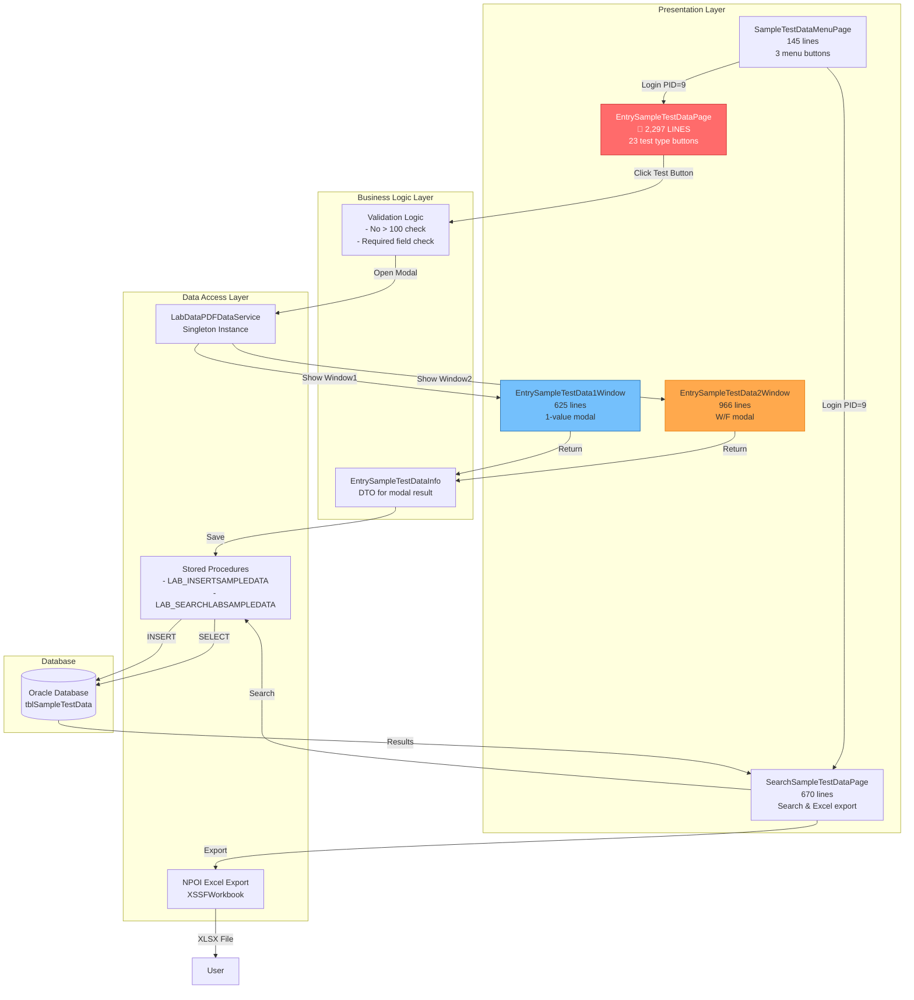
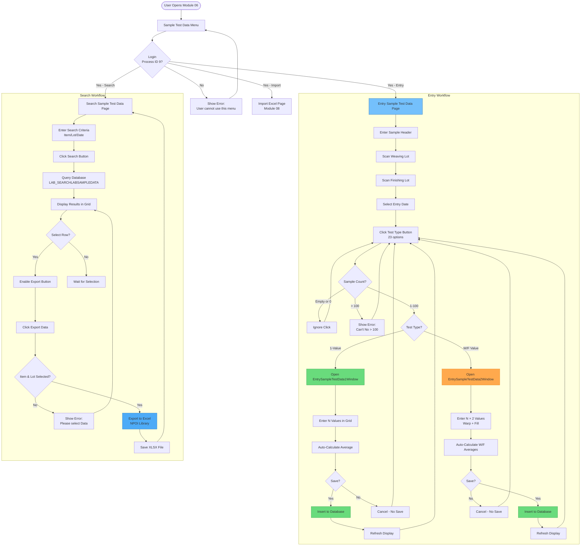
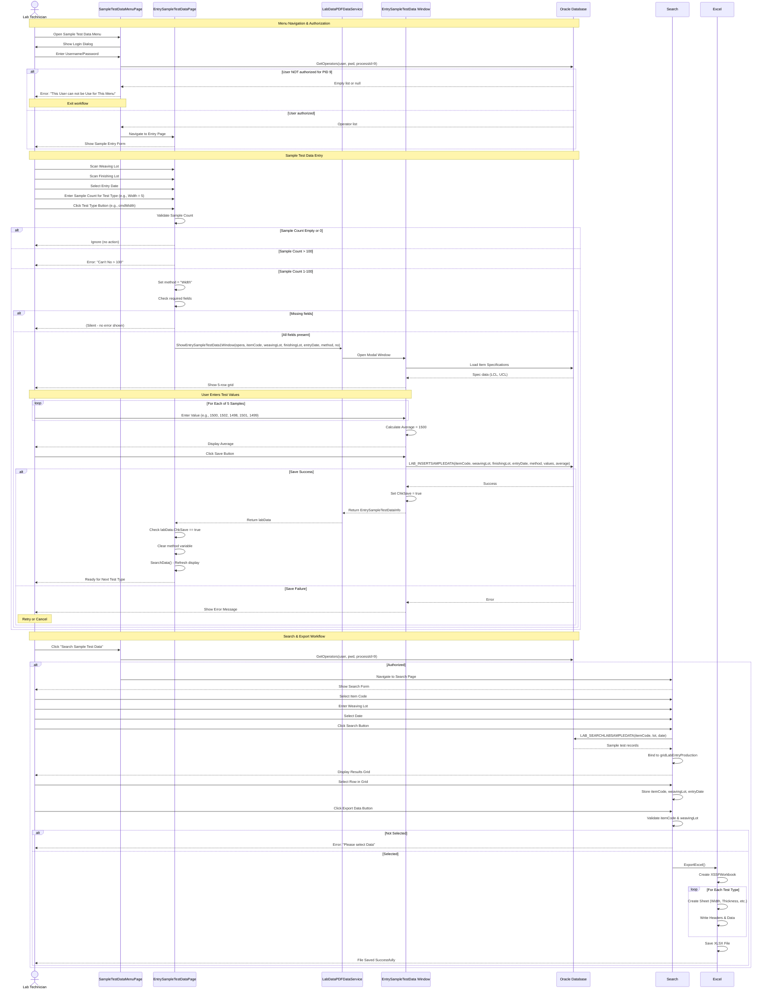

# 006 - PROCESS: Sample Test Workflow

**Module**: 06 - Sample Test Data
**Process ID**: PROCESS_SAMPLE_TEST_WORKFLOW
**Created**: 2025-10-11
**Document Type**: Process Implementation Documentation
**Status**: 🟠 **HIGH COMPLEXITY - MASSIVE DUPLICATION**

---

## Process Overview

### Purpose
Manage the complete sample test workflow from sample creation to test result entry and reporting. This module handles manual data entry for sample-based quality tests (distinct from production lot testing in Modules 03-04).

### Scope
- **Input**: Sample identification (Item Code, Weaving Lot, Finishing Lot, Entry Date)
- **Processing**: Enter test data for 23 quality test types via modal windows
- **Output**: Sample test database records, Excel exports
- **Users**: Lab technicians, quality inspectors (Process ID 9)

### Business Context
- **Sample Testing**: Quality control testing on fabric samples (not full production lots)
- **Integration**: Uses specifications from Module 05 (Item Code Specification)
- **Reporting**: Exports test data to Excel for analysis
- **Authorization**: Requires Process ID 9 (Inspection) for all functions

---

## UI Files Inventory

### Primary Files

| File Path | Lines | Purpose | Status |
|-----------|-------|---------|--------|
| `LuckyTex.Lab.Transfer.Data/Pages/06 Sample Test Data/`<br>`SampleTestDataMenuPage.xaml` | 112 | Menu navigation page | 🟢 Active |
| `LuckyTex.Lab.Transfer.Data/Pages/06 Sample Test Data/`<br>`SampleTestDataMenuPage.xaml.cs` | 145 | Menu code-behind | 🟢 Active |
| `LuckyTex.Lab.Transfer.Data/Pages/06 Sample Test Data/`<br>`EntrySampleTestDataPage.xaml.cs` | **2,297** | Main sample entry page | 🔴 **HIGH** |
| `LuckyTex.Lab.Transfer.Data/Pages/06 Sample Test Data/`<br>`SearchSampleTestDataPage.xaml.cs` | 670 | Search & export page | 🟢 Active |
| `LuckyTex.Lab.Transfer.Data/Pages/06 Sample Test Data/`<br>`EntrySampleTestData1Window.xaml.cs` | 625 | Modal window (1-value tests) | 🟢 Active |
| `LuckyTex.Lab.Transfer.Data/Pages/06 Sample Test Data/`<br>`EntrySampleTestData2Window.xaml.cs` | 966 | Modal window (2-value tests W/F) | 🟠 Medium |

**Total Module**: **~4,703 LOC**

### Related Files
- **Data Service**: `LabDataPDFDataService` (modal window management)
- **Models**: `EntrySampleTestDataInfo`, `LAB_SEARCHLABSAMPLEDATA`
- **Libraries**: NPOI (Excel export), iTextSharp (PDF support)

---

## UI Layout Description

### Page 1: SampleTestDataMenuPage (Simple Menu)

**Layout**: 2×2 button grid menu

**Buttons**:
1. **Entry Sample Test Data** → `EntrySampleTestDataPage`
2. **Search Sample Test Data** → `SearchSampleTestDataPage`
3. **Import Excel** → `ImportDataExcelPage` (Module 08)
4. **Back** → Return to main menu

**Authorization**: ALL buttons require Process ID 9 (Inspection) login

---

### Page 2: EntrySampleTestDataPage (Main Entry Page)

**🔴 CRITICAL DISCOVERY - 2,297 LINES WITH MASSIVE DUPLICATION**

**Layout**: Sample header + 23 test type buttons (grid layout)

**Header Section**:
- txtOperator (read-only)
- txtWeavingLot (barcode scan)
- txtFinishingLot (barcode scan)
- Date picker
- Clear button

**Test Type Buttons** (23 buttons total):

| # | Button | Test Type | Modal Window | Max Samples |
|---|--------|-----------|--------------|-------------|
| 1 | cmdWidth | Width | Window1 (1-value) | 100 |
| 2 | cmdUsableWidth | Usable Width | Window1 | 100 |
| 3 | cmdWidthofSilicone | Width of Silicone | Window1 | 100 |
| 4 | cmdNumberofthreads | Number of threads | Window2 (W/F) | 100 |
| 5 | cmdTotalWeight | Total Weight | Window1 | 100 |
| 6 | cmdUncoatedWeight | Uncoated Weight | Window1 | 100 |
| 7 | cmdCoatWeight | Coat Weight | Window1 | 100 |
| 8 | cmdThickness | Thickness | Window1 | 100 |
| 9 | cmdMaxForce | Max Force | Window2 (W/F) | 100 |
| 10 | cmdElongation | Elongation | Window2 (W/F) | 100 |
| 11 | cmdFlammability | Flammability | Window2 (W/F) | 100 |
| 12 | cmdEdgecomb | Edgecomb | Window2 (W/F) | 100 |
| 13 | cmdStiffness | Stiffness | Window2 (W/F) | 100 |
| 14 | cmdTear | Tear | Window2 (W/F) | 100 |
| 15 | cmdStaticAir | Static Air | Window1 | 100 |
| 16 | cmdDynamicAir | Dynamic Air | Window1 | 100 |
| 17 | cmdExponent | Exponent | Window1 | 100 |
| 18 | cmdDimensionalChange | Dimensional Change | Window2 (W/F) | 100 |
| 19 | cmdFlexAbrasion | Flex Abrasion | Window2 (W/F) | 100 |
| 20 | cmdBow | Bow | Window1 | 100 |
| 21 | cmdSkew | Skew | Window1 | 100 |
| 22 | cmdBending | Bending | Window2 (W/F) | 100 |
| 23 | cmdFlexScott | Flex Scott | Window2 (W/F) | 100 |

**Test Type Distribution**:
- **Window1 (1-value tests)**: 11 test types
- **Window2 (W/F tests)**: 12 test types (Warp/Fill separate values)

---

### Page 3: SearchSampleTestDataPage (Search & Export)

**Layout**: Search criteria + grid + export button

**Search Criteria**:
- Item Code (ComboBox dropdown)
- Weaving Lot (TextBox)
- Date (DatePicker)

**Grid Display**: Search results showing:
- Item Code
- Weaving Lot
- Production Lot
- Entry Date
- All test values

**Actions**:
- Search button (load data)
- Clear button (reset)
- Export Data button (Excel export via NPOI)

---

### Modal Windows

#### EntrySampleTestData1Window (1-Value Tests)

**Purpose**: Enter test data for tests with single value (e.g., Width, Thickness)

**Fields**:
- Sample count input (1-100)
- Grid with columns:
  - No (auto-numbered 1-N)
  - Value (numeric input)
  - Average (auto-calculated)
- Save / Cancel buttons

**Example**: Width test with 5 samples
- Row 1: 1500 mm
- Row 2: 1502 mm
- Row 3: 1498 mm
- Row 4: 1501 mm
- Row 5: 1499 mm
- Average: 1500 mm (auto-calculated)

---

#### EntrySampleTestData2Window (Warp/Fill Tests)

**Purpose**: Enter test data for tests with Warp + Fill values (e.g., Max Force, Elongation)

**Fields**:
- Sample count input (1-100)
- Grid with columns:
  - No (auto-numbered 1-N)
  - Warp Value (numeric input)
  - Fill Value (numeric input)
  - Warp Average (auto-calculated)
  - Fill Average (auto-calculated)
- Save / Cancel buttons

**Example**: Max Force test with 3 samples
- Row 1: W=850, F=820
- Row 2: W=855, F=825
- Row 3: W=848, F=818
- Avg: W=851, F=821

---

## Component Architecture Diagram



---

## Workflow Diagram



---

## Business Logic Sequence Diagram



---

## Data Flow

### Input Data Sources

1. **Sample Header**
   - Weaving Lot (barcode scan)
   - Finishing Lot (barcode scan)
   - Entry Date (DatePicker)
   - Operator (from login)
   - Item Code (derived from lot lookup)

2. **Test Type Selection**
   - Method name (e.g., "Width", "Max Force", "Elongation")
   - Sample count (1-100)

3. **Test Values** (from modal windows)
   - Window1: N × 1 values
   - Window2: N × 2 values (Warp + Fill)
   - Auto-calculated averages

### Processing Data

**EntrySampleTestDataInfo DTO**:
```csharp
class EntrySampleTestDataInfo
{
    string Opera
    string ItemCode
    string WeavingLot
    string FinishingLot
    DateTime EntryDate
    string Method
    int No
    decimal[] Values  // Value1, Value2, ..., ValueN
    decimal Average
    bool ChkSave  // Success flag
}
```

### Output Data Destinations

1. **Database Table**: `tblSampleTestData` (assumed)
   - Columns: ItemCode, WeavingLot, FinishingLot, EntryDate, Method, SampleNo, Value, Average
   - Stored Procedure: `LAB_INSERTSAMPLEDATA`

2. **Excel Export** (NPOI XSSFWorkbook)
   - File Format: .XLSX (Excel 2007+)
   - Sheets: 1 per test type (Width, Thickness, Max Force W, Max Force F, etc.)
   - Headers: Sample No, Value, Average

---

## Database Operations

### Stored Procedures

#### 1. LAB_INSERTSAMPLEDATA
**Purpose**: Insert sample test data
**Type**: INSERT
**Parameters**: ~15-20 parameters (ItemCode, WeavingLot, FinishingLot, EntryDate, Method, SampleNo, Values[], Average)

#### 2. LAB_SEARCHLABSAMPLEDATA
**Purpose**: Search sample test data by criteria
**Type**: SELECT
**Parameters**: ItemCode, WeavingLot, EntryDate
**Returns**: Grid data with all test values

### Table Operations

| Table | Operation | Fields | Notes |
|-------|-----------|--------|-------|
| `tblSampleTestData` | INSERT | ItemCode, WeavingLot, FinishingLot, EntryDate, Method, SampleNo, Value, Average | Via LAB_INSERTSAMPLEDATA |
| `tblSampleTestData` | SELECT | All fields | Via LAB_SEARCHLABSAMPLEDATA |
| `tblItemSpecification` | SELECT | Specs for validation | Referenced in modal windows |

---

## Validation Logic

### 1. Authorization Validation (Menu Level)

**Method**: All menu button click handlers (lines 64-139 in SampleTestDataMenuPage.xaml.cs)

**Logic**:
```
User clicks menu button → Show login dialog
IF login successful THEN
    GetOperators(username, password, processId=9)
    IF operators list empty or null THEN
        Show error: "This User can not be Use for This Menu"
        Exit
    ELSE
        Navigate to target page
    END IF
END IF
```

**Process ID**: **9** (Inspection) - HARDCODED in all 3 menu buttons

---

### 2. Sample Count Validation (Entry Page)

**Method**: All 23 button click handlers (lines 124-2000+ in EntrySampleTestDataPage.xaml.cs)

**Pattern** (repeated 23 times):
```csharp
if (!string.IsNullOrEmpty(txtWidth.Text))
{
    if (txtWidth.Text != "0")
    {
        no = int.Parse(txtWidth.Text);

        if (no <= 100)
        {
            // Open modal window
        }
        else
        {
            "Can't No > 100".ShowMessageBox();
        }
    }
}
```

**Rules**:
- Sample count must not be empty
- Sample count must not be "0"
- Sample count must be ≤ 100
- No validation for minimum > 0 (allows negative numbers - BUG)

---

### 3. Required Field Validation (Entry Page)

**Logic**:
```csharp
if (!string.IsNullOrEmpty(itemCode) &&
    !string.IsNullOrEmpty(weavingLot) &&
    !string.IsNullOrEmpty(finishingLot) &&
    entryDate != null &&
    !string.IsNullOrEmpty(method))
{
    // Open modal window
}
// ELSE: Silent failure (no error message shown)
```

**Fields Required**:
- Item Code (from lot lookup)
- Weaving Lot
- Finishing Lot
- Entry Date
- Method (set by button click)

**⚠️ BUG**: No error message shown if fields missing - silent failure

---

### 4. Grid Selection Validation (Search Page)

**Method**: `cmdExportData_Click` (lines 137-148 in SearchSampleTestDataPage.xaml.cs)

**Logic**:
```csharp
if (!string.IsNullOrEmpty(itemCode) && !string.IsNullOrEmpty(weavingLot))
    ExportExcel();
else
    "Please select Data".ShowMessageBox();
```

**Rules**:
- User must select row in grid before export
- Grid selection populates itemCode + weavingLot variables

---

## Critical Issues & Technical Debt

### 🔴 CRITICAL Issues

#### 1. **MASSIVE CODE DUPLICATION** - ~1,800+ Lines
- **Impact**: 🔴 **CRITICAL**
- **Problem**: 23 button click handlers with **IDENTICAL** logic (lines 124-~1900)
- **Example**: Each handler is 35-40 lines, only difference is method name
  ```csharp
  // cmdWidth_Click - 35 lines
  method = "Width";
  if (!string.IsNullOrEmpty(txtWidth.Text)) { ... }

  // cmdUsableWidth_Click - 35 lines (IDENTICAL except method name)
  method = "Usable Width";
  if (!string.IsNullOrEmpty(txtUsableWidth.Text)) { ... }

  // ... repeated 21 more times
  ```
- **Duplication**: **23 × 35 lines = ~805 lines of duplicate code**
- **Wasted Code**: ~70% of EntryPage is duplication
- **Bug Multiplication**: Single bug exists in 23 places

#### 2. **NO ASYNC OPERATIONS**
- **Impact**: 🔴 **HIGH**
- **Problem**: All database calls are synchronous
- **Consequence**:
  - UI freezes during modal window save
  - Poor user experience
  - No loading indicator

---

### 🟠 HIGH Priority Issues

#### 3. **HARDCODED PROCESS ID**
- **Impact**: 🟠 **HIGH**
- **Problem**: `processId = 9` hardcoded in 3 places (menu buttons)
- **Location**: Lines 70, 96, 122 in SampleTestDataMenuPage.xaml.cs
- **Consequence**: Cannot change authorization without code change
- **Solution**: Move to configuration or database

#### 4. **SILENT VALIDATION FAILURE**
- **Impact**: 🟠 **HIGH**
- **Problem**: No error message if required fields missing (Entry page)
- **Logic**: `if (!string.IsNullOrEmpty(...)) { open window } // ELSE: nothing`
- **User Experience**: Click button → nothing happens → confusion
- **Solution**: Show error message listing missing fields

#### 5. **NO MINIMUM SAMPLE COUNT VALIDATION**
- **Impact**: 🟠 **MEDIUM**
- **Problem**: Allows negative numbers (no check for `no >= 1`)
- **Current**: Only checks `no <= 100`
- **Bug**: User can enter `-5` and system accepts it
- **Solution**: Add `if (no >= 1 && no <= 100)`

---

### 🟡 MEDIUM Priority Issues

#### 6. **NO TRANSACTION SUPPORT**
- **Impact**: 🟡 **MEDIUM**
- **Problem**: Multiple INSERT operations (1 per sample), no rollback
- **Consequence**: Partial save if error occurs mid-batch
- **Solution**: Wrap in transaction or use bulk insert

#### 7. **EXCEL EXPORT NO ERROR HANDLING**
- **Impact**: 🟡 **MEDIUM**
- **Problem**: ExportExcel() method has no try-catch (assumed)
- **Consequence**: Application crash if file locked or disk full
- **Solution**: Add error handling and user feedback

#### 8. **MAGIC NUMBER 100**
- **Impact**: 🟡 **LOW**
- **Problem**: Sample count limit `100` hardcoded in 23 places
- **Consequence**: Cannot change limit without code changes
- **Solution**: Move to configuration constant

---

## Code Duplication Analysis

### Pattern 1: Button Click Handlers (23 handlers)

**Template**:
```csharp
private void cmd{TestType}_Click(object sender, RoutedEventArgs e)
{
    method = "{Test Type Name}";

    if (!string.IsNullOrEmpty(txt{TestType}.Text))
    {
        if (txt{TestType}.Text != "0")
        {
            no = int.Parse(txt{TestType}.Text);

            if (no <= 100)
            {
                if (!string.IsNullOrEmpty(itemCode) &&
                    !string.IsNullOrEmpty(weavingLot) &&
                    !string.IsNullOrEmpty(finishingLot) &&
                    entryDate != null &&
                    !string.IsNullOrEmpty(method))
                {
                    EntrySampleTestDataInfo labData = LabDataPDFDataService.Instance
                        .ShowEntrySampleTestData{1or2}Window(opera, itemCode, weavingLot,
                            finishingLot, entryDate, method, no);
                    if (null != labData)
                    {
                        if (labData.ChkSave == true)
                        {
                            method = string.Empty;
                            SearchData();
                        }
                    }
                }
            }
            else
            {
                "Can't No > 100".ShowMessageBox();
            }
        }
    }
}
```

**Occurrences**: 23 times (Width, Usable Width, Width of Silicone, ..., Flex Scott)

**Duplicated LOC**: **23 × 35 lines = ~805 lines**

**Only Differences**:
1. Method name string
2. TextBox control name
3. Window type (Window1 or Window2)

**Solution**: **Single parameterized method**
```csharp
private void ShowTestEntryWindow(string methodName, TextBox countTextBox, bool useTwoValueWindow)
{
    method = methodName;
    // ... rest of logic (identical for all)
}

// Usage:
cmdWidth_Click() => ShowTestEntryWindow("Width", txtWidth, false);
cmdMaxForce_Click() => ShowTestEntryWindow("Max Force", txtMaxForce, true);
```

**Code Reduction**: 805 lines → ~50 lines (**93% reduction**)

---

### Pattern 2: Menu Authorization (3 menu buttons)

**Template**:
```csharp
private void cmd{MenuOption}_Click(object sender, RoutedEventArgs e)
{
    LogInInfo logInfo = this.ShowLogInBox();
    if (logInfo != null)
    {
        int processId = 9; // for inspection
        List<LogInResult> operators = UserDataService.Instance
            .GetOperators(logInfo.UserName, logInfo.Password, processId);

        if (null == operators || operators.Count <= 0)
        {
            "This User can not be Use for This Menu".ShowMessageBox(true);
            return;
        }
        else
        {
            {TargetPage} page = new {TargetPage}();
            page.Setup(logInfo.UserName);
            PageManager.Instance.Current = page;
        }
    }
}
```

**Occurrences**: 3 times (Entry, Search, Import)

**Duplicated LOC**: **3 × 25 lines = ~75 lines**

**Solution**: **Single method with page type parameter**
```csharp
private void NavigateWithAuthorization<TPage>(int processId = 9) where TPage : UserControl, new()
{
    // ... identical logic ...
    TPage page = new TPage();
    page.Setup(logInfo.UserName);
    PageManager.Instance.Current = page;
}

// Usage:
cmdEntrySampleTestData_Click() => NavigateWithAuthorization<EntrySampleTestDataPage>();
cmdSearchSampleTestData_Click() => NavigateWithAuthorization<SearchSampleTestDataPage>();
```

**Code Reduction**: 75 lines → ~30 lines (**60% reduction**)

---

## Implementation Checklist

### Phase 1: Critical Refactoring (3 weeks) 🔴 **P1 HIGH**

#### Week 1: Extract Duplicate Logic
- [ ] **Task 1.1**: Create `SampleTestEntryHelper` class
- [ ] **Task 1.2**: Extract `ShowTestEntryWindow(method, textBox, windowType)` method
- [ ] **Task 1.3**: Replace 23 button handlers with single method calls
- [ ] **Task 1.4**: Extract menu authorization to `NavigateWithAuthorization<T>()` method
- [ ] **Task 1.5**: Unit tests for helper methods

**Code Reduction**: ~880 lines → ~100 lines (**88% reduction**)

#### Week 2: Fix Critical Bugs
- [ ] **Task 2.1**: Add error message for missing required fields (Entry page)
- [ ] **Task 2.2**: Add minimum sample count validation (`no >= 1`)
- [ ] **Task 2.3**: Add async/await to all database operations
- [ ] **Task 2.4**: Add loading indicator for modal windows
- [ ] **Task 2.5**: Add try-catch for Excel export

#### Week 3: Configuration & Testing
- [ ] **Task 3.1**: Move Process ID to configuration constant
- [ ] **Task 3.2**: Move max sample count (100) to configuration
- [ ] **Task 3.3**: Integration testing (Entry → Search → Export)
- [ ] **Task 3.4**: User acceptance testing
- [ ] **Task 3.5**: Deploy to production

---

### Phase 2: Enhanced Features (2 weeks) 🟠 **P2 MEDIUM**

#### Week 4: Transaction Support
- [ ] **Task 4.1**: Implement database transaction wrapper
- [ ] **Task 4.2**: Batch insert for sample values
- [ ] **Task 4.3**: Rollback on partial save failure
- [ ] **Task 4.4**: Test transaction scenarios

#### Week 5: UI Improvements
- [ ] **Task 5.1**: Add sample count range display (1-100)
- [ ] **Task 5.2**: Add tooltips explaining test types
- [ ] **Task 5.3**: Add confirmation dialog before clear
- [ ] **Task 5.4**: Add success toast after save
- [ ] **Task 5.5**: Improve Excel export formatting

---

### Phase 3: Advanced Features (1 week) 🟡 **P3 LOW**

#### Week 6: Reporting & Audit
- [ ] **Task 6.1**: Add audit trail (who entered what when)
- [ ] **Task 6.2**: Add data edit capability (currently insert-only)
- [ ] **Task 6.3**: Add delete capability with authorization
- [ ] **Task 6.4**: Add comparison report (spec vs actual)
- [ ] **Task 6.5**: Add trend analysis charts

---

## Modernization Priority

### Severity: 🟠 **P1 HIGH - IMMEDIATE REFACTORING NEEDED**

**Ranking**: **#6 Priority** in Lab system

### Justification for P1 Priority:

1. **Code Quality**: 🔴 **CRITICAL**
   - **~880 lines of duplication** (~38% of module code)
   - **23 identical button handlers** (only 3 values different)
   - **Bug multiplication**: Single bug = 23 places to fix

2. **Business Impact**: 🟠 **MEDIUM**
   - **NOT master data** (doesn't block other modules)
   - **Standalone workflow** (sample testing independent of production)
   - **User workaround exists** (can skip and use Module 01/03 directly)

3. **Technical Debt**: 🟠 **HIGH**
   - **Unmaintainable** (cannot add new test types easily)
   - **Bug prone** (silent failures, no error messages)
   - **No async** = UI freezing

4. **Refactoring Effort**: 🟢 **LOW** (Easy wins)
   - **88% code reduction** with simple extraction
   - **3 weeks** for complete refactoring
   - **Low risk** (isolated module, no dependencies)

---

### Comparison with Other Lab Modules

| Module | File | LOC | Duplication | Priority | Effort |
|--------|------|-----|-------------|----------|--------|
| **Module 03** | LabDataEntryPage | 149,594 | 90% | 🔴 P0 | 17-26 weeks |
| **Module 04** | LabDataEntryWindow | 33,132 | 89% (vs M03) | 🔴 P0 | 11-16 weeks |
| **Module 05** | ItemCodeSpecificationPage | 9,978 | 80% | 🔴 P0 | 12 weeks |
| **Module 06** | EntrySampleTestDataPage | 2,297 | **38%** | 🟠 **P1** ⭐ | **3 weeks** |
| Module 02 | PDF Loading (3 pages) | 4,152 | 80% | 🟠 P1 | 4-6 weeks |

**Recommended Refactoring Order**:
1. 🔴 **Module 05** (ItemCodeSpecification) - **P0** - Master data, affects all modules
2. 🔴 **Modules 03 + 04** (LabDataEntry) - **P0** - 89% duplication
3. 🟠 **Module 06** (SampleTestData) - **P1** - **QUICK WIN** (3 weeks, 88% reduction) ⭐
4. 🟠 **Module 02** (PDF Loading) - **P1** - Extract base class

**Why Module 06 is a "Quick Win"**:
- ✅ **Simple refactoring** (just extract method calls)
- ✅ **Big impact** (88% code reduction in 3 weeks)
- ✅ **Low risk** (isolated module)
- ✅ **Immediate benefit** (easier to add new test types)
- ✅ **Good practice run** before tackling Module 03/04

---

## Business Rules Summary

### Authorization Rules
1. **Process ID 9 Required**: ALL menu functions require Inspection authorization
2. **Login Required**: User must authenticate before entering each section

### Sample Count Rules
3. **Range**: 1-100 samples per test type
4. **Validation**: Count must not be empty, "0", or > 100
5. **⚠️ BUG**: No validation for negative numbers or zero (only checks ≤ 100)

### Test Type Rules
6. **23 Test Types Supported**: Width, Usable Width, Width of Silicone, Number of threads, Total Weight, Uncoated Weight, Coat Weight, Thickness, Max Force, Elongation, Flammability, Edgecomb, Stiffness, Tear, Static Air, Dynamic Air, Exponent, Dimensional Change, Flex Abrasion, Bow, Skew, Bending, Flex Scott
7. **Window Type Assignment**:
   - **Window1 (1-value)**: 11 tests (Width, Thickness, Static Air, etc.)
   - **Window2 (W/F)**: 12 tests (Max Force, Elongation, Stiffness, etc.)

### Data Entry Rules
8. **Required Fields**: Item Code, Weaving Lot, Finishing Lot, Entry Date, Method
9. **⚠️ BUG**: No error message if fields missing (silent failure)
10. **Auto-Clear Method**: Method variable cleared after successful save

### Modal Window Rules
11. **Grid Entry**: Values entered in grid (No column auto-numbered)
12. **Auto-Calculate Average**: Average computed on value entry
13. **Save Flag**: ChkSave = true indicates successful save

### Search & Export Rules
14. **Search Criteria**: Item Code + Weaving Lot + Date (all optional)
15. **Excel Export**: Requires row selection (itemCode + weavingLot)
16. **Export Format**: XLSX (Excel 2007+) via NPOI library

---

## Integration Points with Other Modules

### Upstream Dependencies

#### Module 05: Item Code Specification
- **Usage**: Modal windows load specification limits (LCL/UCL)
- **Fields Used**: All test type specifications
- **Impact**: Incorrect specs → incorrect validation in modal windows

---

### Downstream Dependencies

None - Module 06 is standalone (sample testing separate from production workflow)

---

## Conclusion

### Summary

**Module 06 - Sample Test Data** is a **HIGH priority for refactoring** due to:

1. **Massive Code Duplication**: ~880 lines (38%) duplicated
2. **Simple Refactoring**: 88% code reduction in 3 weeks (QUICK WIN)
3. **Critical Bugs**: Silent failures, no error messages
4. **Maintainability**: Cannot add new test types easily

### Immediate Actions Required

1. 🟠 **REFACTOR NOW** - Extract duplicate button handlers (88% reduction)
2. 🟠 **FIX BUGS** - Add error messages for validation failures
3. 🟠 **ADD ASYNC** - Implement async/await for better UX
4. 🟠 **CONFIGURATION** - Move hardcoded values to config

### Long-Term Vision

**Target Architecture** (Post-Refactoring):
- **Helper Class**: 100 lines (test entry logic)
- **Entry Page**: 500 lines (from 2,297) = **78% reduction**
- **Search Page**: 670 lines (no change)
- **Modal Windows**: 1,591 lines (no change)
- **TOTAL**: **~2,861 lines** (from 4,703) = **39% reduction**

**Benefits**:
- ✅ Easy to add new test types (1 line vs 35 lines)
- ✅ Single place to fix bugs
- ✅ Better user experience (error messages, async operations)
- ✅ Maintainable codebase

---

**Document Version**: 1.0
**Created**: 2025-10-11
**Status**: 🟠 **HIGH PRIORITY - QUICK WIN REFACTORING**
**Priority**: 🟠 **P1 HIGH**
**Estimated Refactoring Effort**: **3 weeks (1 developer)**
**Code Reduction Target**: **39% (4,703 → ~2,861 lines)**
