# 007 - PROCESS: Lab Equipment Integration (PLC Get Data)

**Module**: 07 - PLC Get Data
**Process ID**: PROCESS_LAB_EQUIPMENT_INTEGRATION
**Created**: 2025-10-11
**Document Type**: Process Implementation Documentation
**Status**: 🔴 **VERY HIGH COMPLEXITY - PLC INTEGRATION**

---

## Process Overview

### Purpose
Integrate lab testing equipment with the system via PLC (Programmable Logic Controller) communication using Modbus protocol. Automatically capture test data directly from testing machines in real-time.

### Scope
- **Input**: Sample identification (Production Lot, Item Code), PLC equipment readings
- **Processing**: Real-time PLC data acquisition via Modbus TCP/RTU, data validation, save to database
- **Output**: Test results saved to database, optional re-test workflow
- **Users**: Lab technicians (Process ID 9)

### Business Context
- **Automation**: Eliminates manual data entry errors for equipment-based tests
- **Real-Time**: Direct PLC communication for immediate data capture
- **Traceability**: Links equipment readings to specific production lots
- **Equipment Integration**: 5 lab testing machines integrated
- **Quality Control**: Automatic validation against specifications from Module 05

---

## UI Files Inventory

### Primary Files

| File Path | Lines | Purpose | Status |
|-----------|-------|---------|--------|
| `LuckyTex.Lab.Transfer.Data/Pages/07 PLC Get Data/`<br>`PLCGetDataMenuPage.xaml` | 121 | Menu navigation | 🟢 Active |
| `LuckyTex.Lab.Transfer.Data/Pages/07 PLC Get Data/`<br>`PLCGetDataMenuPage.xaml.cs` | 205 | Menu code-behind | 🟢 Active |
| `LuckyTex.Lab.Transfer.Data/Pages/07 PLC Get Data/`<br>`ElectricBalancePage.xaml.cs` | **1,392** | Weight measurement | 🔴 High |
| `LuckyTex.Lab.Transfer.Data/Pages/07 PLC Get Data/`<br>`StiffnessPage.xaml.cs` | 1,152 | Stiffness testing | 🟠 Medium |
| `LuckyTex.Lab.Transfer.Data/Pages/07 PLC Get Data/`<br>`StaticAirPage.xaml.cs` | 1,241 | Static air testing | 🟠 Medium |
| `LuckyTex.Lab.Transfer.Data/Pages/07 PLC Get Data/`<br>`AirPermeabilityPage.xaml.cs` | 1,209 | High-pressure air | 🟠 Medium |
| `LuckyTex.Lab.Transfer.Data/Pages/07 PLC Get Data/`<br>`DynamicAirPermeabilityPage.xaml.cs` | 1,154 | Dynamic air testing | 🟠 Medium |
| `LuckyTex.Lab.Transfer.Data/Pages/07 PLC Get Data/`<br>`PLC_TestPage.xaml.cs` | 360 | PLC testing/debug | 🟢 Active |

**Total Module**: **~6,713 LOC**

### Related Files & Libraries

**PLC Communication**:
- `ScouringLabModbusManager` - Modbus PLC manager (singleton)
- `NLib.Devices.Modbus` - Modbus TCP/RTU library
- `ModbusReadEventHandler<ScouringLab>` - Event handler for PLC readings

**Data Models**:
- `ScouringLab` - PLC data model (AIRFLAG, AIR value, etc.)
- `LAB_SEARCHITEMRETEST` - Re-test data search model
- `LAB_SEARCHLABPLCSTATICAIR` - PLC static air data model

**Configuration**:
- `ConfigManager.Instance` - Machine status configuration
- `ScouringLabMachineConfig` - PLC machine config flag

---

## UI Layout Description

### Page 1: PLCGetDataMenuPage (Equipment Menu)

**Layout**: 2×3 button grid (5 equipment buttons + 1 test button)

**Row 1 Equipment**:
1. **Electric Balance (Weight)** → `ElectricBalancePage`
2. **STIFFNESS M/C** → `StiffnessPage`
3. **Static Air M/C** → `StaticAirPage`

**Row 2 Equipment**:
4. **AIR PERMEABILITY HIGH PRESSURE M/C** → `AirPermeabilityPage`
5. **Dynamic Air Permeability** → `DynamicAirPermeabilityPage`
6. **PLC Test** → `PLC_TestPage` (no login required - testing only)

**Authorization**: Process ID 9 (Inspection) required for all equipment pages (except PLC Test)

---

### Equipment Pages (5 Similar Pages)

All 5 equipment pages share a **common architecture pattern**:

#### Common Page Structure

**Header Section**:
- Operator (read-only, from login)
- Production Lot (TextBox or ComboBox)
- Item Code (TextBox, read-only, auto-populated from lot lookup)
- Re-test checkbox (enables re-test mode)

**PLC Data Display Section**:
- Real-time value display (e.g., txtStatic_Air for current reading)
- 6 value slots (txtStatic_Air1 through txtStatic_Air6)
- Average display (auto-calculated from 6 values)

**Control Buttons**:
- **Select** - Capture current PLC reading → store in next available slot (1-6)
- **Reset** - Reset PLC to zero (send command to PLC)
- **Save** - Save all 6 values to database
- **Clear** - Clear all fields
- **Back** - Return to menu

**Re-test Mode** (checkbox enabled):
- Load existing test data for lot
- Allow additional test captures
- Save as re-test record

---

#### Page-Specific Details

##### 1. Electric Balance Page (Weight Measurement)

**Purpose**: Measure fabric weight using electronic balance

**PLC Data**:
- Single weight value per reading
- Unit: grams per square meter (g/m²)
- PLC Flag: WEIGHTFLAG (1 = new reading available)

**Stored Procedure**: `LAB_SAVEPLCELECTRICBALANCE`, `LAB_SAVEREPLCELECTRICBALANCE`

---

##### 2. Stiffness Page

**Purpose**: Measure fabric stiffness (resistance to bending)

**PLC Data**:
- Stiffness value per reading
- Unit: milligrams force (mgf)
- PLC Flag: STIFFNESSFLAG (1 = new reading)

**Stored Procedure**: `LAB_SAVEPLCSTIFFNESS`, `LAB_SAVEREPLCSTIFFNESS`

---

##### 3. Static Air Page

**Purpose**: Measure static air permeability

**PLC Data**:
- Static air value per reading
- Unit: cc/cm²/sec (air flow rate)
- PLC Flag: AIRFLAG (1 = new reading)

**Stored Procedure**: `LAB_SAVEPLCSTATICAIR`, `LAB_SAVEREPLCSTATICAIR`

---

##### 4. Air Permeability Page (High Pressure)

**Purpose**: Measure air permeability under high pressure

**PLC Data**:
- Air permeability value
- Unit: cc/cm²/sec at specified pressure
- PLC Flag: AIRFLAG (1 = new reading)

**Stored Procedure**: `LAB_SAVEPLCSTATICAIR`, `LAB_SAVEREPLCSTATICAIR`

---

##### 5. Dynamic Air Permeability Page

**Purpose**: Measure dynamic air permeability

**PLC Data**:
- Dynamic air value
- Unit: cc/cm²/sec (dynamic flow)
- PLC Flag: AIRFLAG (1 = new reading)

**Stored Procedure**: `LAB_SAVEPLCDYNAMICAIR`, `LAB_SAVEREPLCDYNAMICAIR`

---

### Page 6: PLC_TestPage (Debug/Testing)

**Purpose**: Test PLC connection and configuration

**Features**:
- Test Modbus connection
- Display PLC status
- Debug PLC communication
- **No authorization required** (testing only)

---

## Component Architecture Diagram


---

## Workflow Diagram


---

## Business Logic Sequence Diagram

```mermaid
sequenceDiagram
    actor User as Lab Technician
    participant Menu as PLCGetDataMenuPage
    participant Page as AirPermeabilityPage
    participant ModbusMgr as ScouringLabModbusManager
    participant PLC as PLC Equipment
    participant DB as Oracle Database

    Note over User,DB: Menu Navigation & Authorization

    User->>Menu: Open PLC Get Data Menu
    Menu->>User: Show Login Dialog
    User->>Menu: Enter Username/Password
    Menu->>DB: GetOperators(user, pwd, processId=9)

    alt User NOT authorized for PID 9
        DB-->>Menu: Empty list or null
        Menu-->>User: Error: "This User can not be Use for This Menu"
    else User authorized
        DB-->>Menu: Operator list
        Menu->>Page: Navigate to Equipment Page
    end

    Note over Page,PLC: PLC Initialization

    Page->>Page: Load ConfigManager
    Page->>Page: Check ScouringLabMachineConfig
    Page->>ModbusMgr: Reset_AIR() - Send PLC Reset Command

    alt PLC Connection Failed
        ModbusMgr-->>Page: false
        Page-->>User: Error: "Can't Connect PLC Please check config or PLC"
    else PLC Connected
        ModbusMgr-->>Page: true
        Page->>ModbusMgr: Register ReadCompleted Event
        Page->>ModbusMgr: Start() - Begin Modbus Polling
        Page-->>User: Ready State
    end

    Note over Page,PLC: Real-Time PLC Data Acquisition

    loop Modbus Polling (Continuous)
        ModbusMgr->>PLC: Poll Modbus Registers
        PLC-->>ModbusMgr: PLC Data (AIRFLAG, AIR value)
        ModbusMgr->>ModbusMgr: Parse Response → ScouringLab Model
        ModbusMgr->>Page: Raise ReadCompleted Event
        Page->>Page: Instance_ReadCompleted(ScouringLab data)

        alt AIRFLAG == 1 (New Reading Available)
            Page->>Page: txtStatic_Air.Text = AIR value
            Page-->>User: Display Current Reading
        else AIRFLAG == 0 (No New Reading)
            Page->>Page: Keep previous value
        end
    end

    Note over User,DB: Test Data Entry

    User->>Page: Enter Production Lot
    Page->>DB: Lookup Item Code for Lot
    DB-->>Page: Item Code
    Page->>Page: Auto-populate txtITMCODE
    Page-->>User: Display Item Code

    alt Re-test Mode (checkbox checked)
        User->>Page: Check Re-test checkbox
        Page->>DB: LAB_SEARCHITEMRETEST(lot, item)
        DB-->>Page: Existing test data
        Page->>Page: Populate existing values
        Page-->>User: Show Existing Data
    end

    Note over User,PLC: Capture PLC Readings (6 times)

    loop For Each of 6 Readings
        User->>PLC: Place fabric sample on equipment
        PLC->>PLC: Perform test measurement
        PLC->>ModbusMgr: Update registers (AIRFLAG=1, AIR=value)
        ModbusMgr->>Page: ReadCompleted Event
        Page-->>User: Display Current Reading

        User->>Page: Click Select Button
        Page->>Page: Capture txtStatic_Air value
        Page->>Page: Find next empty slot (1-6)

        alt Slot Available
            Page->>Page: txtStatic_Air[N].Text = captured value
            Page->>Page: Calculate average of filled slots
            Page-->>User: Update slot + average display
        else All 6 Slots Full
            Page-->>User: Error (silently ignored or message)
        end
    end

    Note over User,DB: Save Test Data

    User->>Page: Click Save Button
    Page->>Page: Validate: Lot, Item, At least 1 value

    alt Validation Failed
        Page-->>User: Error: "Please Select PLC Data Before Save"
    else Validation Passed
        alt Re-test Mode
            Page->>DB: LAB_SAREREPLCSTATICAIR(lot, item, values1-6, avg)
        else New Test Mode
            Page->>DB: LAB_SAVEPLCSTATICAIR(lot, item, values1-6, avg)
        end

        alt Save Success
            DB-->>Page: Success

            alt Re-test Mode
                Page-->>User: Ask: "ต้องการ Re-Test Lot นี้ อีกครั้งหรือไม่"

                alt User Clicks Yes
                    Page->>Page: ClearControlReTest() - Keep lot/item
                    Page-->>User: Ready for next test
                else User Clicks No
                    Page->>Page: ClearControl() - Clear all
                    Page-->>User: Ready for new lot
                end
            else New Test Mode
                Page->>Page: ClearControl() - Clear all
                Page-->>User: Ready for new lot
            end
        else Save Failed
            DB-->>Page: Error
            Page-->>User: Error: "Can't Save Please check data"
        end
    end

    Note over Page,PLC: Page Unload

    User->>Page: Navigate Away
    Page->>ModbusMgr: Unregister ReadCompleted Event
    Page->>ModbusMgr: Shutdown() - Stop Modbus Polling
    ModbusMgr->>PLC: Close Connection
```



---

## Data Flow

### Input Data Sources

1. **Production Sample Identification**
   - Production Lot (TextBox or ComboBox)
   - Item Code (auto-populated from lot lookup)
   - Operator (from login)

2. **PLC Equipment Readings** (via Modbus)
   - Current value (real-time display)
   - 6 captured readings per test
   - PLC flag (1 = new reading available)

3. **Re-test Data** (if re-test mode)
   - Existing test values from database
   - Previous test date/operator

### Processing Data

**PLC Data Model**: `ScouringLab`
```csharp
class ScouringLab
{
    int? AIRFLAG          // 1 = new reading, 0 = no reading
    decimal? AIR          // Air permeability value
    int? WEIGHTFLAG       // 1 = new weight reading
    decimal? WEIGHT       // Weight value
    int? STIFFNESSFLAG    // 1 = new stiffness reading
    decimal? STIFFNESS    // Stiffness value
    // ... other equipment flags/values
}
```

**Test Data Variables**:
```csharp
string itemCode
string productionlot
decimal? static_air1    // Slot 1
decimal? static_air2    // Slot 2
decimal? static_air3    // Slot 3
decimal? static_air4    // Slot 4
decimal? static_air5    // Slot 5
decimal? static_air6    // Slot 6
decimal? average        // Auto-calculated
```

### Output Data Destinations

1. **Database Table**: `tblLabPLCData` (assumed name)
   - Columns: ItemCode, ProductionLot, TestDate, Operator, Value1-6, Average, ReTestFlag
   - Stored Procedures:
     - `LAB_SAVEPLCSTATICAIR` (new test)
     - `LAB_SAVEREPLCSTATICAIR` (re-test)
     - Similar pairs for each equipment type

2. **Downstream Usage**:
   - **Module 03 (Lab Data Entry)**: PLC data can be reviewed/corrected
   - **Module 09 (Sample Report)**: PLC test results in reports
   - **Module 05 (Item Specification)**: Validation against spec limits

---

## Database Operations

### Stored Procedures by Equipment

#### 1. Electric Balance (Weight)
- **New Test**: `LAB_SAVEPLCELECTRICBALANCE`
- **Re-Test**: `LAB_SAVEREPLCELECTRICBALANCE`
- **Parameters**: ItemCode, ProductionLot, Weight1-6, Average, Operator, TestDate

#### 2. Stiffness
- **New Test**: `LAB_SAVEPLCSTIFFNESS`
- **Re-Test**: `LAB_SAVEREPLCSTIFFNESS`
- **Parameters**: ItemCode, ProductionLot, Stiffness1-6, Average, Operator, TestDate

#### 3. Static Air
- **New Test**: `LAB_SAVEPLCSTATICAIR`
- **Re-Test**: `LAB_SAVEREPLCSTATICAIR`
- **Parameters**: ItemCode, ProductionLot, StaticAir1-6, Average, Operator, TestDate

#### 4. Air Permeability (High Pressure)
- **New Test**: `LAB_SAVEPLCSTATICAIR` (same as Static Air)
- **Re-Test**: `LAB_SAVEREPLCSTATICAIR`
- **Parameters**: Same as Static Air

#### 5. Dynamic Air Permeability
- **New Test**: `LAB_SAVEPLCDYNAMICAIR`
- **Re-Test**: `LAB_SAVEREPLCDYNAMICAIR`
- **Parameters**: ItemCode, ProductionLot, DynamicAir1-6, Average, Operator, TestDate

#### 6. Search/Lookup Procedures
- **LAB_SEARCHITEMRETEST**: Retrieve existing test data for re-test mode
- **LAB_SEARCHLABPLCSTATICAIR**: Search PLC test results

### Table Operations

| Table | Operation | Fields | Notes |
|-------|-----------|--------|-------|
| `tblLabPLCData` | INSERT | ItemCode, ProductionLot, TestDate, Value1-6, Average | New test |
| `tblLabPLCData` | INSERT | Same + ReTestFlag | Re-test |
| `tblItemCode` | SELECT | ItemCode lookup | Auto-populate |
| `tblProductionLot` | SELECT | Lot validation | Lookup |

---

## PLC Communication Details

### Modbus Protocol Configuration

**ModbusManager**: `ScouringLabModbusManager` (Singleton)

**Communication Mode**: Modbus TCP or Modbus RTU (configuration-dependent)

**Key Methods**:
1. **Reset_AIR()**: Send reset command to PLC, zero all registers
2. **Start()**: Begin continuous Modbus polling loop
3. **Shutdown()**: Stop polling, close connection
4. **ReadCompleted Event**: Raised when new PLC data received

### PLC Data Flags

Each equipment type has a **flag register**:
- **AIRFLAG**: Air permeability equipment
- **WEIGHTFLAG**: Electric balance
- **STIFFNESSFLAG**: Stiffness tester

**Flag Values**:
- **1**: New reading available (capture this value)
- **0**: No new reading (keep previous value)

### Real-Time Event Flow

```
1. ModbusManager polls PLC (every N ms)
2. PLC returns register data
3. Parse data → ScouringLab model
4. Check flag (e.g., AIRFLAG == 1?)
5. If flag == 1:
   - Raise ReadCompleted event
   - UI handler updates display (txtStatic_Air)
6. Repeat loop
```

### Error Handling

**Connection Errors**:
- `Reset_AIR() == false` → Show error message
- User must check PLC config or hardware

**No Error Recovery**: If PLC disconnects during operation, page must be reloaded

---

## Validation Logic

### 1. Authorization Validation (Menu Level)

**Pattern** (lines 64-199 in PLCGetDataMenuPage.xaml.cs):
- ALL menu buttons (except PLC Test) require Process ID 9
- Same pattern as Module 06 (5 identical authorization blocks)

---

### 2. PLC Connection Validation (Page Load)

**Method**: `UserControl_Loaded` (lines 98-118 in AirPermeabilityPage.xaml.cs)

**Logic**:
```csharp
if (ScouringLabModbusManager.Instance.Reset_AIR() == false)
{
    "Can't Connect PLC Please check config or PLC".ShowMessageBox();
}
```

**Critical**: If PLC fails to connect, **no error recovery** - user must fix hardware/config

---

### 3. PLC Flag Validation (Real-Time)

**Method**: `Instance_ReadCompleted` (lines 126-149)

**Logic**:
```csharp
if (e.Value.AIRFLAG == 1)
{
    // New reading available → update display
    txtStatic_Air.Text = e.Value.AIR.Value.ToString();
    airFlage = 1;
}
else
{
    // No new reading → keep previous
    airFlage = 0;
}
```

**Purpose**: Only update display when PLC explicitly signals new data

---

### 4. Save Validation (Save Button Click)

**Method**: `cmdSave_Click` (lines 210-280)

**Required Fields**:
```csharp
if (!string.IsNullOrEmpty(txtPRODUCTIONLOT.Text) &&
    !string.IsNullOrEmpty(txtITMCODE.Text))
{
    // Check at least 1 value filled
    if (txtStatic_Air1.Text isEmpty && ... && txtStatic_Air6.Text isEmpty)
    {
        "Please Select PLC Data Before Save".ShowMessageBox();
        return;
    }
    // Proceed to save
}
```

**Validation Rules**:
1. Production Lot must not be empty
2. Item Code must not be empty
3. At least 1 of 6 values must be filled

---

### 5. Re-test Mode Validation

**Logic**:
```csharp
if (chkRetest.IsChecked == true)
{
    // At least 1 value required (OR logic)
    if (!string.IsNullOrEmpty(txtStatic_Air1.Text) ||
        !string.IsNullOrEmpty(txtStatic_Air2.Text) || ...)
    {
        Lab_SaveREPLCSTATICAIR(); // Save re-test
    }
}
else
{
    // All values must be empty (fail validation) OR at least 1 filled
    if (all empty)
    {
        "Please Select PLC Data Before Save".ShowMessageBox();
    }
}
```

**Difference**: Re-test requires **at least 1 value**, new test **forbids all empty**

---

## Critical Issues & Technical Debt

### 🔴 CRITICAL Issues

#### 1. **NO PLC ERROR RECOVERY**
- **Impact**: 🔴 **CRITICAL**
- **Problem**: If PLC disconnects during operation, application has no recovery mechanism
- **Consequence**:
  - User must close page and restart
  - Lost work if disconnect during data capture
  - No reconnection logic
- **Location**: Lines 108-111 (AirPermeabilityPage.xaml.cs)
- **Solution**: Implement reconnection retry logic, connection status monitoring

#### 2. **NO ASYNC PLC COMMUNICATION**
- **Impact**: 🔴 **HIGH**
- **Problem**: Modbus polling blocks UI thread
- **Consequence**:
  - UI freezes during PLC communication
  - Poor responsiveness
  - Application appears hung if PLC slow to respond
- **Solution**: Implement async/await for all Modbus operations

#### 3. **SINGLETON MODBUS MANAGER**
- **Impact**: 🔴 **HIGH**
- **Problem**: Single ModbusManager instance shared across all pages
- **Consequence**:
  - Thread safety issues if multiple pages opened simultaneously
  - Potential data corruption
  - Event handler conflicts
- **Solution**: Implement proper locking or per-page Modbus instances

---

### 🟠 HIGH Priority Issues

#### 4. **HARDCODED PROCESS ID** (Again!)
- **Impact**: 🟠 **HIGH**
- **Problem**: `processId = 9` hardcoded in 5 places (menu buttons)
- **Location**: Lines 70, 96, 122, 148, 182 in PLCGetDataMenuPage.xaml.cs
- **Same Issue as Module 06**: Identical duplication pattern
- **Solution**: Extract to configuration constant

#### 5. **5 IDENTICAL AUTHORIZATION BLOCKS**
- **Impact**: 🟠 **HIGH**
- **Problem**: 5 button handlers with identical authorization logic (~125 lines duplicated)
- **Same Pattern as Module 06**: Same 25-line authorization block repeated 5 times
- **Solution**: Extract to single method with page type parameter

#### 6. **NO TRANSACTION SUPPORT**
- **Impact**: 🟠 **MEDIUM**
- **Problem**: 6 separate INSERT operations (1 per value), no rollback
- **Consequence**: Partial save if error occurs mid-batch
- **Solution**: Use transaction wrapper or bulk insert

#### 7. **THAI ERROR MESSAGES**
- **Impact**: 🟠 **MEDIUM**
- **Problem**: Re-test confirmation in Thai: `"ต้องการ Re-Test Lot นี้ อีกครั้งหรือไม่"`
- **Location**: Line 224 (AirPermeabilityPage.xaml.cs)
- **Consequence**: Not internationalized
- **Solution**: Move to resource file

---

### 🟡 MEDIUM Priority Issues

#### 8. **NO PLC TIMEOUT**
- **Impact**: 🟡 **MEDIUM**
- **Problem**: No timeout for PLC polling operations
- **Consequence**: Application hangs indefinitely if PLC fails to respond
- **Solution**: Implement configurable timeout (e.g., 5 seconds)

#### 9. **NO PLC STATUS INDICATOR**
- **Impact**: 🟡 **MEDIUM**
- **Problem**: No visual indicator showing PLC connection status
- **Consequence**: User unsure if PLC connected, data stale, or disconnected
- **Solution**: Add status light (green = connected, red = disconnected, yellow = no data)

#### 10. **NO DATA TIMESTAMP**
- **Impact**: 🟡 **MEDIUM**
- **Problem**: No timestamp showing when PLC reading was captured
- **Consequence**: User unsure if displayed value is current or stale
- **Solution**: Display last reading timestamp (e.g., "Last updated: 14:35:22")

#### 11. **MAGIC NUMBER 6**
- **Impact**: 🟡 **LOW**
- **Problem**: 6 readings hardcoded (6 TextBoxes, 6 variables)
- **Consequence**: Cannot change number of readings without code changes
- **Solution**: Dynamic collection with configurable count

---

### 🟢 LOW Priority Issues

#### 12. **NO EQUIPMENT CALIBRATION TRACKING**
- **Impact**: 🟢 **LOW**
- **Problem**: No system to track equipment calibration dates
- **Consequence**: Risk of using out-of-calibration equipment
- **Solution**: Add calibration date field, warning if expired

#### 13. **NO AUDIT TRAIL**
- **Impact**: 🟢 **LOW**
- **Problem**: No record of who captured which reading when
- **Consequence**: Cannot trace data source in case of disputes
- **Solution**: Add audit table logging each reading capture

---

## Code Duplication Analysis

### Pattern 1: Menu Authorization (5 handlers)

**Same as Module 06** - See Module 06 document for detailed analysis

**Duplication**: **5 × 25 lines = ~125 lines**

**Solution**: Extract to `NavigateWithAuthorization<TPage>(int processId = 9)`

---

### Pattern 2: Page Structure (5 equipment pages)

All 5 equipment pages share ~80% identical code:

**Common Code** (~900 lines per page):
1. PLC initialization (lines 98-118)
2. Event handler registration/unregistration (lines 120-150)
3. Button handlers (Select, Reset, Save, Clear, Back)
4. Validation logic (lines 210-280)
5. Clear methods
6. Button enable/disable
7. Grid population (re-test mode)

**Differences** (~250 lines per page):
1. Stored procedure names (LAB_SAVEPLC**STATICAIR** vs LAB_SAVEPLC**STIFFNESS**)
2. PLC flag name (AIRFLAG vs WEIGHTFLAG vs STIFFNESSFLAG)
3. Variable names (static_air1-6 vs weight1-6 vs stiffness1-6)
4. TextBox names (txtStatic_Air1-6 vs txtWeight1-6, etc.)

**Total Duplication**: **5 pages × 900 lines = ~4,500 lines**

**Unique Code**: **5 pages × 250 lines = ~1,250 lines**

**Duplication Rate**: **78% (4,500 / 5,750 total)**

---

### Refactoring Strategy

**Extract Base Class**: `PLCEquipmentPageBase<TData>`

```csharp
abstract class PLCEquipmentPageBase<TData> : UserControl
    where TData : class
{
    // Common fields
    protected string operator;
    protected string itemCode;
    protected string productionLot;
    protected decimal?[] values = new decimal?[6];  // Configurable count

    // Abstract methods (page-specific)
    protected abstract string EquipmentType { get; }
    protected abstract string PLCFlagName { get; }
    protected abstract void SaveNewTest();
    protected abstract void SaveReTest();

    // Common methods (ALL pages use same logic)
    protected void InitializePLC() { ... }
    protected void RegisterEvents() { ... }
    protected void CaptureReading() { ... }
    protected void ValidateAndSave() { ... }
    protected void ClearControl() { ... }
    protected void ClearControlReTest() { ... }
}

// Concrete implementation (only 100-150 lines)
class AirPermeabilityPage : PLCEquipmentPageBase<ScouringLab>
{
    protected override string EquipmentType => "Air Permeability";
    protected override string PLCFlagName => "AIRFLAG";

    protected override void SaveNewTest()
    {
        LAB_SAVEPLCSTATICAIR(itemCode, productionLot, values, Average);
    }

    protected override void SaveReTest()
    {
        LAB_SAVEREPLCSTATICAIR(itemCode, productionLot, values, Average);
    }
}
```

**Code Reduction**: 5,750 lines → **~1,500 lines** (74% reduction)

---

## Implementation Checklist

### Phase 1: Critical Bug Fixes (4 weeks) 🔴 **P0 CRITICAL**

#### Week 1: PLC Communication Stability
- [ ] **Task 1.1**: Implement PLC reconnection logic
- [ ] **Task 1.2**: Add connection timeout (5 seconds)
- [ ] **Task 1.3**: Add PLC status indicator (UI)
- [ ] **Task 1.4**: Implement error recovery (retry 3 times)
- [ ] **Task 1.5**: Add PLC connection health monitoring

#### Week 2: Thread Safety & Async
- [ ] **Task 2.1**: Convert Modbus operations to async/await
- [ ] **Task 2.2**: Implement proper locking in ModbusManager
- [ ] **Task 2.3**: Add cancellation token support
- [ ] **Task 2.4**: Test concurrent page access (thread safety)
- [ ] **Task 2.5**: Add async loading indicators

#### Week 3: Transaction Support
- [ ] **Task 3.1**: Implement database transaction wrapper
- [ ] **Task 3.2**: Bulk insert for 6 values (atomic operation)
- [ ] **Task 3.3**: Add rollback on failure
- [ ] **Task 3.4**: Test partial save scenarios
- [ ] **Task 3.5**: Add save retry logic

#### Week 4: Testing & Deployment
- [ ] **Task 4.1**: Integration testing with real PLC hardware
- [ ] **Task 4.2**: Stress testing (continuous operation 8 hours)
- [ ] **Task 4.3**: Error scenario testing (PLC disconnect, timeout, etc.)
- [ ] **Task 4.4**: User acceptance testing
- [ ] **Task 4.5**: Deploy to production with rollback plan

---

### Phase 2: Code Refactoring (6 weeks) 🟠 **P1 HIGH**

#### Week 5-6: Extract Base Class
- [ ] **Task 5.1**: Design `PLCEquipmentPageBase<T>` architecture
- [ ] **Task 5.2**: Extract common initialization logic
- [ ] **Task 5.3**: Extract common event handlers
- [ ] **Task 5.4**: Extract common validation logic
- [ ] **Task 5.5**: Extract common save logic

#### Week 7-8: Refactor Equipment Pages
- [ ] **Task 6.1**: Refactor AirPermeabilityPage → inherit base
- [ ] **Task 6.2**: Refactor StaticAirPage → inherit base
- [ ] **Task 6.3**: Refactor StiffnessPage → inherit base
- [ ] **Task 6.4**: Refactor ElectricBalancePage → inherit base
- [ ] **Task 6.5**: Refactor DynamicAirPermeabilityPage → inherit base

#### Week 9-10: Extract Menu Authorization
- [ ] **Task 7.1**: Extract `NavigateWithAuthorization<T>()` method
- [ ] **Task 7.2**: Replace 5 authorization blocks with single method
- [ ] **Task 7.3**: Move Process ID to configuration constant
- [ ] **Task 7.4**: Unit tests for authorization logic
- [ ] **Task 7.5**: Integration testing

**Code Reduction**: 5,750 lines → **~1,500 lines** (74% reduction)

---

### Phase 3: Enhanced Features (4 weeks) 🟡 **P2 MEDIUM**

#### Week 11: UI Improvements
- [ ] **Task 8.1**: Add PLC status light (green/red/yellow)
- [ ] **Task 8.2**: Add last reading timestamp display
- [ ] **Task 8.3**: Add progress bar for 6 readings (1/6, 2/6, etc.)
- [ ] **Task 8.4**: Add success toast after save
- [ ] **Task 8.5**: Improve error messages (internationalization)

#### Week 12: Data Quality
- [ ] **Task 9.1**: Add reading outlier detection (statistical)
- [ ] **Task 9.2**: Add auto-validation against spec limits (Module 05)
- [ ] **Task 9.3**: Add warning if reading outside expected range
- [ ] **Task 9.4**: Add data review screen before save
- [ ] **Task 9.5**: Add data correction capability

#### Week 13: Equipment Management
- [ ] **Task 10.1**: Add equipment calibration date tracking
- [ ] **Task 10.2**: Add calibration expiry warnings
- [ ] **Task 10.3**: Add equipment maintenance log
- [ ] **Task 10.4**: Add equipment status dashboard
- [ ] **Task 10.5**: Add equipment usage statistics

#### Week 14: Audit & Reporting
- [ ] **Task 11.1**: Add audit trail (who captured when)
- [ ] **Task 11.2**: Add PLC data history report
- [ ] **Task 11.3**: Add equipment performance report
- [ ] **Task 11.4**: Add data export to Excel (NPOI)
- [ ] **Task 11.5**: Add trend analysis charts

---

## Modernization Priority

### Severity: 🔴 **P0 CRITICAL - PRODUCTION STABILITY RISK**

**Ranking**: **#4 Priority** in Lab system (after Modules 05, 03/04)

### Justification for P0 Priority:

1. **Production Impact**: 🔴 **CRITICAL**
   - **Hardware Dependency**: PLC communication failures = production stoppage
   - **No Error Recovery**: Disconnect = manual restart required
   - **Thread Safety**: Concurrent access = data corruption risk
   - **Real-Time System**: Lab equipment cannot operate without stable integration

2. **Technical Debt**: 🔴 **HIGH**
   - **78% code duplication** (~4,500 duplicated lines)
   - **No async operations** = UI freezing
   - **Singleton threading issues** = crashes
   - **No PLC reconnection** = unstable system

3. **Business Risk**: 🔴 **HIGH**
   - **Equipment downtime** if PLC fails
   - **Manual data entry fallback** (slow, error-prone)
   - **Quality control impact** (cannot test samples)
   - **Automotive compliance risk** (equipment data required)

4. **Refactoring Effort**: 🟠 **MEDIUM** (10 weeks total)
   - **Week 1-4**: Critical bug fixes (P0)
   - **Week 5-10**: Code refactoring (P1)
   - **74% code reduction** with base class extraction

---

### Comparison with Other Lab Modules

| Module | LOC | Complexity | Priority | Effort | Code Reduction |
|--------|-----|------------|----------|--------|----------------|
| Module 03 | 149,594 | CATASTROPHIC | 🔴 P0 | 17-26 weeks | 90% |
| Module 04 | 33,132 | EXTREME | 🔴 P0 | 11-16 weeks | 89% |
| Module 05 | 9,978 | VERY HIGH | 🔴 P0 | 12 weeks | 80% |
| **Module 07** | 6,713 | **VERY HIGH** | 🔴 **P0** ⚠️ | **10 weeks** | **74%** |
| Module 06 | 4,703 | HIGH | 🟠 P1 | 3 weeks | 39% |
| Module 02 | 4,900 | VERY HIGH | 🟠 P1 | 4-6 weeks | 80% |

**Recommended Priority**: **#4 in refactoring queue** (after Modules 05, 03/04)

**Why P0**:
1. 🔴 **Hardware Integration** - System stability critical for production
2. 🔴 **No Error Recovery** - Must fix before catastrophic failure
3. 🔴 **Thread Safety** - Data corruption risk with concurrent access
4. 🟠 **74% Code Duplication** - High maintenance cost

**Why NOT #1**:
- Modules 05, 03, 04 have **higher impact** (master data + larger codebases)
- Module 07 is **dependent on Module 05** (specification validation)
- **Can operate manually** as fallback (though not ideal)

---

## Business Rules Summary

### Authorization Rules
1. **Process ID 9 Required**: All equipment pages require Inspection authorization
2. **PLC Test Page Exception**: No authorization required (testing only)

### PLC Communication Rules
3. **Reset on Load**: PLC must be reset to zero on page load
4. **Flag-Based Updates**: Only update display when PLC flag == 1
5. **Continuous Polling**: Modbus manager polls PLC continuously until page unload
6. **Event Cleanup**: Must unregister events on page unload (memory leak prevention)

### Data Capture Rules
7. **6 Readings Required**: Standard test = 6 captured readings
8. **Sequential Slots**: Fill slots 1-6 in order
9. **Average Auto-Calculated**: Average computed from filled slots only
10. **At Least 1 Value**: Must capture at least 1 reading before save

### Re-test Mode Rules
11. **Load Existing Data**: Re-test mode loads previous test values
12. **Additional Captures**: Can add more readings to existing data
13. **Separate Storage**: Re-test data saved to separate records (flag: ReTestFlag = 1)
14. **Re-test Confirmation**: Ask user (Thai) if want to re-test same lot again

### Validation Rules
15. **Production Lot Required**: Cannot save without production lot
16. **Item Code Required**: Cannot save without item code
17. **Auto-Populate Item**: Item code auto-filled from lot lookup
18. **PLC Connection Required**: Show error if PLC fails to connect (no retry)

### Equipment Operation Rules
19. **Manual Sample Placement**: Operator places fabric sample on equipment
20. **Equipment Test**: PLC performs test, updates registers
21. **Operator Capture**: Operator clicks Select to capture current reading
22. **Reset Capability**: Operator can reset PLC to zero at any time

---

## Integration Points with Other Modules

### Upstream Dependencies

#### Module 05: Item Code Specification
- **Usage**: Load specification limits (LCL/UCL) for validation
- **Impact**: Cannot validate PLC readings without specs

---

### Downstream Dependencies

#### Module 03: Lab Data Entry
- **Usage**: PLC data can be reviewed/edited manually
- **Impact**: Provides manual fallback if PLC fails

#### Module 09: Sample Report
- **Usage**: PLC test results included in quality reports
- **Impact**: Equipment data required for complete reports

---

## Conclusion

### Summary

**Module 07 - PLC Get Data** is a **P0 CRITICAL priority** due to:

1. **Hardware Integration Risk**: No PLC error recovery = production stoppage
2. **Thread Safety Issues**: Singleton manager = data corruption potential
3. **78% Code Duplication**: ~4,500 duplicated lines across 5 equipment pages
4. **No Async Operations**: UI freezing during PLC communication

### Immediate Actions Required

1. 🔴 **FIX PLC RECONNECTION** - Add error recovery logic (Week 1)
2. 🔴 **IMPLEMENT ASYNC** - Convert all Modbus ops to async/await (Week 2)
3. 🔴 **ADD TRANSACTION SUPPORT** - Atomic 6-value saves (Week 3)
4. 🟠 **REFACTOR DUPLICATE CODE** - Extract base class, 74% reduction (Week 5-10)

### Long-Term Vision

**Target Architecture** (Post-Refactoring):
- **Base Class**: 600 lines (common PLC logic)
- **5 Equipment Pages**: 150 lines each = 750 lines
- **Menu**: 50 lines (extract authorization)
- **PLC Manager**: 300 lines (async, reconnection)
- **TOTAL**: **~1,700 lines** (from 6,713) = **74% code reduction**

**Benefits**:
- ✅ Stable PLC communication (reconnection + timeout)
- ✅ No UI freezing (async operations)
- ✅ Data integrity (transaction support)
- ✅ Easy to add new equipment (inherit base class)
- ✅ Maintainable codebase (no duplication)
- ✅ Production-ready (error recovery)

---

**Document Version**: 1.0
**Created**: 2025-10-11
**Status**: 🔴 **P0 CRITICAL - PRODUCTION STABILITY RISK**
**Priority**: 🔴 **P0 CRITICAL**
**Estimated Refactoring Effort**: **10 weeks (2 developers)**
**Code Reduction Target**: **74% (6,713 → ~1,700 lines)**
**Critical Fix Deadline**: **Week 1-4 (PLC stability)**
