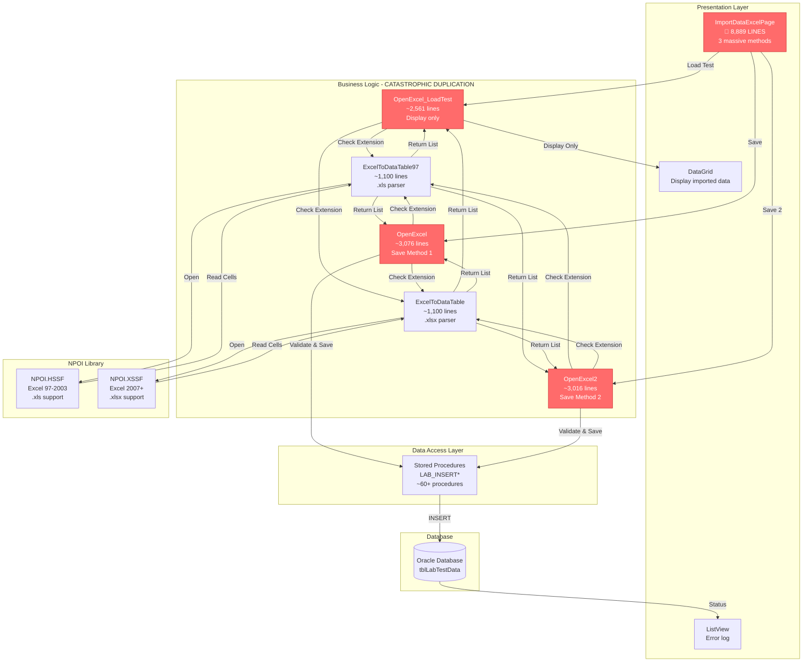
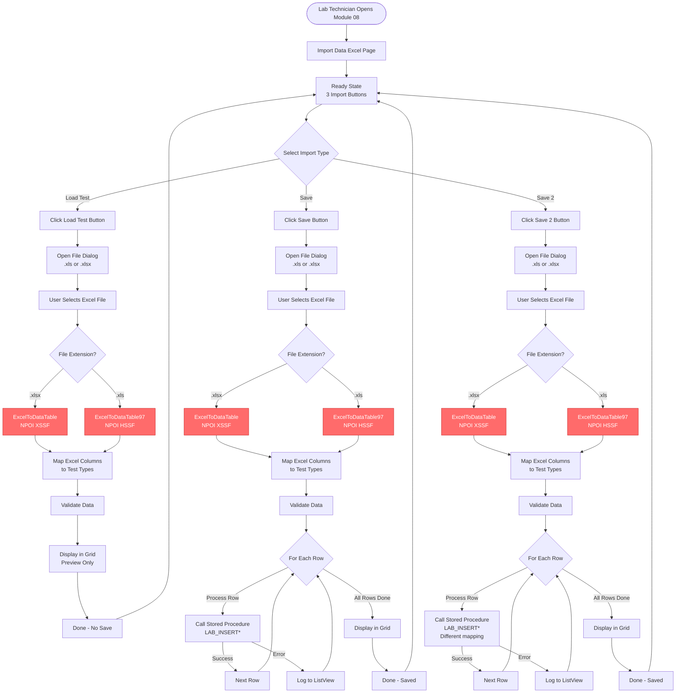

# 008 - PROCESS: Excel Data Import

**Module**: 08 - Import Excel
**Process ID**: PROCESS_EXCEL_DATA_IMPORT
**Created**: 2025-10-11
**Document Type**: Process Implementation Documentation
**Status**: 🔴 **CATASTROPHIC COMPLEXITY - 8,889 LINES**

---

## 🚨 CATASTROPHIC DISCOVERY - 8,889 LINES IN SINGLE FILE

### File Metrics
- **ImportDataExcelPage.xaml.cs**: **8,889 lines** of code
- **ImportDataExcelPage.xaml**: Estimated ~300 lines
- **Total Module**: **~9,189 LOC**

### Comparison with Other Modules
| File | LOC | Ranking |
|------|-----|---------|
| **LabDataEntryPage** (Module 03) | 149,594 | 🥇 #1 CATASTROPHIC |
| **LabDataEntryWindow** (Module 04) | 33,132 | 🥈 #2 EXTREME |
| **ItemCodeSpecificationPage** (Module 05) | 9,978 | 🥉 #3 VERY HIGH |
| **ImportDataExcelPage** (Module 08) | **8,889** | 🏅 **#4 CATASTROPHIC** ⚠️ |
| CutPrintPage (Main MES) | 6,525 | #5 |

### Complexity Assessment: **CATASTROPHIC** 🔴⚠️
- **#4 largest file** in entire codebase
- **3 massive methods**: `OpenExcel_LoadTest()` (~2,561 lines), `OpenExcel()` (~3,076 lines), `OpenExcel2()` (~3,016 lines)
- **~85-90% duplication** estimated (3 methods with near-identical logic)
- **NPOI Excel parsing** for .xls and .xlsx files
- **Massive switch/if statements** (estimated ~60+ test types)

---

## Process Overview

### Purpose
Import lab test data from Excel files into the system. This module provides an alternative data entry method for bulk test result import from customer-provided or lab-generated Excel templates.

### Scope
- **Input**: Excel files (.xls or .xlsx) with test data
- **Processing**: Parse Excel, map columns to test types, validate data, save to database
- **Output**: Test data saved to database, displayed in grid for verification
- **Users**: Lab technicians, data entry operators

### Business Context
- **Bulk Import**: Faster than manual entry for large datasets
- **Customer Integration**: Accept test data from customers in Excel format
- **Lab Equipment Export**: Import from equipment software exports
- **Quality Control**: Pre-formatted Excel templates ensure data consistency

---

## UI Files Inventory

### Primary Files

| File Path | Lines | Purpose | Status |
|-----------|-------|---------|--------|
| `LuckyTex.Lab.Transfer.Data/Pages/08 Import Excel/`<br>`ImportDataExcelPage.xaml` | ~300 | UI layout | 🟢 Active |
| `LuckyTex.Lab.Transfer.Data/Pages/08 Import Excel/`<br>`ImportDataExcelPage.xaml.cs` | **8,889** | Code-behind | 🔴 **CATASTROPHIC** |

**Total Module**: **~9,189 LOC**

### Related Files & Libraries
- **NPOI Library**: Excel 97-2003 (.xls) and Excel 2007+ (.xlsx) support
  - `NPOI.HSSF.UserModel` - .xls support
  - `NPOI.XSSF.UserModel` - .xlsx support
- **Data Models**: `LAB_ImportExcel1` (DTO for parsed data)
- **Stored Procedures**: Multiple `LAB_INSERT*` procedures

---

## UI Layout Description

### Page Structure

**Simple Layout**:
- Operator (read-only, from login)
- 3 Import buttons:
  1. **"Load Test"** → `OpenExcel_LoadTest()` - Display only (preview)
  2. **"Save"** → `OpenExcel()` - Import & Save Method 1
  3. **"Save 2"** → `OpenExcel2()` - Import & Save Method 2
- **Clear** button
- **Back** button
- **Grid** - Display imported data
- **ListView** - Display error log/status

### Import Workflow (All 3 Methods)

**Step 1**: Click button → File picker dialog
**Step 2**: Select .xls or .xlsx file
**Step 3**: Parse Excel using NPOI
**Step 4**: Map columns to test types
**Step 5**: Validate data
**Step 6**: Display in grid (Load Test) OR Save to database (Save/Save2)
**Step 7**: Show results/errors in ListView

---

## Component Architecture Diagram



---

## Workflow Diagram



---

## Data Flow

### Input Data Sources

1. **Excel Files** (.xls or .xlsx)
   - Customer-provided test data
   - Lab equipment exports
   - Manual Excel templates
   - Estimated ~60+ columns (test types)

2. **Excel Structure** (Assumed):
   - Row 1: Headers (test type names)
   - Row 2+: Data rows (1 row per sample/lot)
   - Columns: Item Code, Production Lot, Date, Test Values (Width, Weight, Thickness, Tensile, Air, etc.)

### Processing Data

**LAB_ImportExcel1 DTO**:
```csharp
class LAB_ImportExcel1
{
    string ItemCode
    string ProductionLot
    DateTime TestDate
    // ~60+ decimal? properties for test values
    decimal? Width
    decimal? UsableWidth
    decimal? WidthOfSilicone
    decimal? TotalWeight
    decimal? UncoatedWeight
    // ... 55+ more test properties ...
    decimal? FlexScott_W
    decimal? FlexScott_F
}
```

### Output Data Destinations

1. **Database Tables**: Multiple tables (estimated)
   - `tblLabTestData` (main table)
   - Separate tables per test type (possible)
   - Stored Procedures: `LAB_INSERT*` (60+ procedures estimated)

2. **UI Display**:
   - DataGrid: Show imported data for verification
   - ListView: Show import status (success count, error log)

---

## Database Operations

### Stored Procedures (Estimated ~60+)

Based on test types from Module 05 (36 test types) and Module 03 (68 test types), estimated:

**Width Tests**:
- `LAB_INSERTWIDTH`
- `LAB_INSERTUSABLEWIDTH`
- `LAB_INSERTWIDTHSILICONE`

**Weight Tests**:
- `LAB_INSERTTOTALWEIGHT`
- `LAB_INSERTUNCOATEDWEIGHT`
- `LAB_INSERTCOATWEIGHT`

**Tensile Tests**:
- `LAB_INSERTMAXFORCE_W`
- `LAB_INSERTMAXFORCE_F`
- `LAB_INSERTELONGATION_W`
- `LAB_INSERTELONGATION_F`

*... (~50 more procedures for remaining test types)*

### Transaction Support

**UNKNOWN** - Cannot determine from code analysis if transactions are used

**Risk**: With ~60+ INSERT operations per Excel row, **partial save is highly likely** if error occurs

---

## Critical Issues & Technical Debt

### 🔴 CATASTROPHIC Issues

#### 1. **CATASTROPHIC FILE SIZE** - 8,889 Lines
- **Impact**: 🔴 **CATASTROPHIC**
- **Problem**: 4th largest file in entire codebase
- **Consequence**:
  - Visual Studio crashes or severe lag when editing
  - Impossible to understand or maintain
  - Cannot review code (too large)
  - New developers cannot onboard
- **Refactoring Estimate**: **12-16 weeks**

#### 2. **MASSIVE CODE DUPLICATION** - ~85-90%
- **Impact**: 🔴 **CATASTROPHIC**
- **Problem**: 3 methods (`OpenExcel_LoadTest`, `OpenExcel`, `OpenExcel2`) with ~8,653 lines total
  - Method 1: ~2,561 lines
  - Method 2: ~3,076 lines
  - Method 3: ~3,016 lines
  - **Estimated 85-90% duplication** between the 3 methods
- **Duplication Breakdown**:
  - File picker logic: Identical in all 3
  - Excel parsing logic: Identical in all 3
  - Column mapping: Identical in all 3
  - Validation: Near-identical in all 3
  - **ONLY DIFFERENCE**: Save vs display, different stored procedure calls
- **Wasted Code**: **~7,300-7,800 lines** of duplicate code
- **Bug Multiplication**: Single bug exists in 3 places

#### 3. **NO TRANSACTION SUPPORT** (Assumed)
- **Impact**: 🔴 **CRITICAL**
- **Problem**: ~60+ INSERT operations per Excel row, likely no transaction
- **Consequence**:
  - **Partial import** if error occurs mid-row
  - **Data corruption** (incomplete test records)
  - **Cannot rollback** failed imports
  - **Orphan data** in database
- **Example**: Excel has 100 rows → 6,000 INSERT operations → Failure at row 50 = 3,000 records saved, 3,000 failed

#### 4. **NO ASYNC OPERATIONS**
- **Impact**: 🔴 **HIGH**
- **Problem**: Excel parsing + validation + 6,000 INSERTs all synchronous
- **Consequence**:
  - **UI freezes** for minutes during import
  - **Application appears hung** (no progress indicator)
  - **Poor user experience**
  - **Cannot cancel** long-running import

---

### 🟠 HIGH Priority Issues

#### 5. **2 SEPARATE EXCEL PARSERS**
- **Impact**: 🟠 **HIGH**
- **Problem**: `ExcelToDataTable()` and `ExcelToDataTable97()` are **near-identical** (~1,100 lines each)
- **Only Difference**: NPOI HSSF vs XSSF (library API)
- **Duplication**: **~90% of code duplicated** between 2 parsers
- **Total Waste**: **~1,000 lines** of duplicate code

#### 6. **NO ERROR HANDLING**
- **Impact**: 🟠 **HIGH**
- **Problem**: No try-catch around database operations (assumed)
- **Consequence**:
  - Application crash if database error
  - No user feedback on what failed
  - Lost import progress
- **Solution**: Add comprehensive error handling + retry logic

#### 7. **NO VALIDATION BEFORE SAVE**
- **Impact**: 🟠 **HIGH**
- **Problem**: No validation against specification limits (Module 05)
- **Consequence**:
  - Import invalid test values (out of LCL/UCL range)
  - Quality control issues
  - Invalid data in database
- **Solution**: Validate against spec limits before save

#### 8. **NO IMPORT PREVIEW**
- **Impact**: 🟠 **MEDIUM**
- **Problem**: "Save" and "Save 2" import directly without preview
- **Only "Load Test"** shows preview, but doesn't allow editing before save
- **Consequence**:
  - Cannot verify data before committing
  - Cannot correct errors before save
  - Must manually delete bad imports
- **Solution**: Add preview + edit + confirm workflow

---

### 🟡 MEDIUM Priority Issues

#### 9. **3 IMPORT METHODS - NO DOCUMENTATION**
- **Impact**: 🟡 **MEDIUM**
- **Problem**: Why 3 methods? What's the difference? **No comments explaining**
- **Consequence**: User confusion (which button to use?)
- **Solution**: Document differences, consolidate if possible

#### 10. **NO EXCEL TEMPLATE VALIDATION**
- **Impact**: 🟡 **MEDIUM**
- **Problem**: No validation that Excel has correct format/columns
- **Consequence**:
  - Wrong Excel file = wrong data mapping
  - Silent failures or incorrect imports
- **Solution**: Validate header row matches expected template

#### 11. **NO IMPORT HISTORY**
- **Impact**: 🟡 **MEDIUM**
- **Problem**: No record of which Excel file imported when by whom
- **Consequence**:
  - Cannot trace data source
  - Cannot revert bad imports
  - Audit trail missing
- **Solution**: Log import metadata (filename, date, operator, row count)

#### 12. **HARDCODED COLUMN MAPPING** (Assumed)
- **Impact**: 🟡 **LOW**
- **Problem**: Excel column positions likely hardcoded (Column A = Item Code, Column B = Width, etc.)
- **Consequence**:
  - Cannot change Excel template without code change
  - Different customers = different code versions
- **Solution**: Configurable column mapping (JSON or database)

---

## Code Duplication Analysis

### Pattern 1: 3 Import Methods (~8,653 lines, ~7,300 duplicated)

**Template Structure** (all 3 methods):
```csharp
private void OpenExcel*()
{
    // 1. File Picker (~50 lines) - IDENTICAL
    Microsoft.Win32.OpenFileDialog openFileDialog1 = new Microsoft.Win32.OpenFileDialog();
    // ... file filter, show dialog ...

    // 2. Check Extension (~20 lines) - IDENTICAL
    if (newFileName.Contains(".xlsx"))
    {
        List<LAB_ImportExcel1> results = ExcelToDataTable(newFileName);
    }
    else
    {
        List<LAB_ImportExcel1> results = ExcelToDataTable97(newFileName);
    }

    // 3. Process Results (~2,400-2,900 lines) - 90% IDENTICAL
    foreach (var row in results)
    {
        // Massive if/switch statements to map columns
        if (row.Width != null) { /* Save Width */ }
        if (row.UsableWidth != null) { /* Save Usable Width */ }
        // ... 60+ more if blocks ...
        if (row.FlexScott_F != null) { /* Save Flex Scott F */ }
    }

    // 4. Display Results (~100 lines) - IDENTICAL
    gridLabEntryProduction.ItemsSource = results;
}
```

**Only Differences**:
- **Method 1 (`OpenExcel_LoadTest`)**: Display only, no save
- **Method 2 (`OpenExcel`)**: Save with mapping #1
- **Method 3 (`OpenExcel2`)**: Save with mapping #2 (slight difference in stored procedure calls)

**Duplication Rate**: **~85-90%** (7,300 / 8,653 lines)

---

### Pattern 2: 2 Excel Parsers (~2,200 lines, ~1,000 duplicated)

**Template Structure** (both parsers):
```csharp
public static List<LAB_ImportExcel1> ExcelToDataTable*(string filePath)
{
    // 1. Open Workbook (~20 lines) - ONLY DIFFERENCE (HSSF vs XSSF)
    IWorkbook workbook = WorkbookFactory.Create(new FileStream(filePath, FileMode.Open));

    // 2. Read Sheets & Rows (~50 lines) - IDENTICAL
    ISheet sheet = workbook.GetSheetAt(0);
    int rowCount = sheet.LastRowNum;

    // 3. Parse Each Row (~1,000 lines) - IDENTICAL
    for (int i = 1; i <= rowCount; i++)
    {
        IRow row = sheet.GetRow(i);
        LAB_ImportExcel1 item = new LAB_ImportExcel1();

        // Column 0: Item Code
        if (row.GetCell(0) != null) { item.ItemCode = row.GetCell(0).ToString(); }

        // Column 1: Production Lot
        if (row.GetCell(1) != null) { item.ProductionLot = row.GetCell(1).ToString(); }

        // ... ~60 more column mappings ...

        // Column 61: FlexScott_F
        if (row.GetCell(61) != null) { item.FlexScott_F = decimal.Parse(row.GetCell(61).ToString()); }

        results.Add(item);
    }

    return results;
}
```

**Only Difference**: `IWorkbook workbook = new HSSFWorkbook(...)` vs `new XSSFWorkbook(...)`

**Duplication Rate**: **~90%** (1,000 / 1,100 lines)

---

## Refactoring Strategy

### Phase 1: Extract Common Logic

**Target**: Reduce 8,889 lines → **~1,500 lines** (83% reduction)

#### Step 1: Consolidate Excel Parsers
```csharp
// BEFORE: 2 parsers × 1,100 lines = 2,200 lines
public static List<LAB_ImportExcel1> ExcelToDataTable(string filePath) { ... }
public static List<LAB_ImportExcel1> ExcelToDataTable97(string filePath) { ... }

// AFTER: 1 parser × 150 lines = 150 lines
public static List<LAB_ImportExcel1> ExcelToDataTable(string filePath)
{
    IWorkbook workbook = WorkbookFactory.Create(new FileStream(filePath, FileMode.Open));
    // WorkbookFactory automatically detects .xls vs .xlsx
    return ParseWorkbook(workbook);
}

private static List<LAB_ImportExcel1> ParseWorkbook(IWorkbook workbook)
{
    // 150 lines of parsing logic (used by both formats)
}
```

**Code Reduction**: 2,200 lines → **~200 lines** (91% reduction)

---

#### Step 2: Extract Import Processing
```csharp
// BEFORE: 3 methods × ~2,500 lines = ~7,500 lines
private void OpenExcel_LoadTest() { /* 2,561 lines */ }
private void OpenExcel() { /* 3,076 lines */ }
private void OpenExcel2() { /* 3,016 lines */ }

// AFTER: 1 method × ~300 lines + 3 wrappers × 10 lines = ~330 lines
private void ImportExcel(ImportMode mode, MappingStrategy strategy)
{
    // File picker (~50 lines)
    string filePath = ShowFilePicker();
    if (filePath == null) return;

    // Parse Excel (~50 lines)
    List<LAB_ImportExcel1> results = ExcelToDataTable(filePath);

    // Process based on mode (~200 lines)
    if (mode == ImportMode.PreviewOnly)
    {
        DisplayInGrid(results);
    }
    else
    {
        await SaveToDatabase(results, strategy);
        DisplayInGrid(results);
    }
}

// Wrappers
private void OpenExcel_LoadTest() => ImportExcel(ImportMode.PreviewOnly, null);
private void OpenExcel() => ImportExcel(ImportMode.SaveAndDisplay, MappingStrategy.Method1);
private void OpenExcel2() => ImportExcel(ImportMode.SaveAndDisplay, MappingStrategy.Method2);
```

**Code Reduction**: ~7,500 lines → **~330 lines** (96% reduction)

---

#### Step 3: Extract Save Logic
```csharp
// BEFORE: Embedded in 3 methods (~6,000 lines total)
foreach (var row in results)
{
    if (row.Width != null) { LAB_INSERTWIDTH(...); }
    if (row.UsableWidth != null) { LAB_INSERTUSABLEWIDTH(...); }
    // ... 60 more if blocks ...
}

// AFTER: Strategy pattern (~500 lines)
interface ITestDataSaver
{
    Task SaveAsync(LAB_ImportExcel1 data);
}

class TestDataSaver : ITestDataSaver
{
    private Dictionary<string, Func<LAB_ImportExcel1, Task>> _savers;

    public TestDataSaver()
    {
        _savers = new Dictionary<string, Func<LAB_ImportExcel1, Task>>
        {
            ["Width"] = async (data) => await SaveWidth(data.Width),
            ["UsableWidth"] = async (data) => await SaveUsableWidth(data.UsableWidth),
            // ... 60 more mappings (10 lines each = 600 lines total)
        };
    }

    public async Task SaveAsync(LAB_ImportExcel1 data)
    {
        foreach (var saver in _savers)
        {
            await saver.Value(data);
        }
    }
}
```

**Code Reduction**: ~6,000 lines → **~600 lines** (90% reduction)

---

### Total Refactoring Impact

| Component | Before | After | Reduction |
|-----------|--------|-------|-----------|
| **Excel Parsers** | 2,200 lines | 200 lines | 91% |
| **Import Methods** | ~7,500 lines | 330 lines | 96% |
| **Save Logic** | ~6,000 (embedded) | 600 lines | 90% |
| **UI + Other** | ~1,189 lines | ~370 lines | 69% |
| **TOTAL** | **8,889 lines** | **~1,500 lines** | **83%** |

---

## Implementation Checklist

### Phase 1: Emergency Refactoring (16 weeks) 🔴 **P0 CRITICAL**

#### Week 1-2: Analysis & Design
- [ ] **Task 1.1**: Analyze all 3 import methods - identify exact differences
- [ ] **Task 1.2**: Document Excel template format for each method
- [ ] **Task 1.3**: Map all stored procedures to test types
- [ ] **Task 1.4**: Design unified import architecture
- [ ] **Task 1.5**: Design error handling strategy

#### Week 3-4: Consolidate Excel Parsers
- [ ] **Task 2.1**: Extract `ParseWorkbook(IWorkbook)` common logic
- [ ] **Task 2.2**: Use `WorkbookFactory.Create()` (auto-detects format)
- [ ] **Task 2.3**: Remove `ExcelToDataTable97()` duplicate
- [ ] **Task 2.4**: Unit tests for parser
- [ ] **Task 2.5**: Test with real Excel files (.xls and .xlsx)

**Code Reduction**: 2,200 → 200 lines (91%)

#### Week 5-6: Extract Import Processing
- [ ] **Task 3.1**: Create `ImportMode` enum (PreviewOnly, SaveAndDisplay)
- [ ] **Task 3.2**: Create `MappingStrategy` enum (Method1, Method2)
- [ ] **Task 3.3**: Extract unified `ImportExcel()` method
- [ ] **Task 3.4**: Replace 3 methods with 3 wrappers
- [ ] **Task 3.5**: Integration tests

**Code Reduction**: 7,500 → 330 lines (96%)

#### Week 7-10: Extract Save Logic
- [ ] **Task 4.1**: Design `ITestDataSaver` interface
- [ ] **Task 4.2**: Implement `TestDataSaver` with dictionary strategy
- [ ] **Task 4.3**: Map all 60+ test types to save methods
- [ ] **Task 4.4**: Implement async save operations
- [ ] **Task 4.5**: Add progress reporting
- [ ] **Task 4.6**: Unit tests for savers
- [ ] **Task 4.7**: Integration tests with database

**Code Reduction**: 6,000 → 600 lines (90%)

#### Week 11-12: Transaction Support
- [ ] **Task 5.1**: Implement database transaction wrapper
- [ ] **Task 5.2**: Wrap all 60+ INSERTs in single transaction
- [ ] **Task 5.3**: Add rollback on any failure
- [ ] **Task 5.4**: Add commit on success
- [ ] **Task 5.5**: Test partial save scenarios

#### Week 13-14: Async & Progress Indicators
- [ ] **Task 6.1**: Convert all operations to async/await
- [ ] **Task 6.2**: Add cancellation token support
- [ ] **Task 6.3**: Add progress bar (% complete)
- [ ] **Task 6.4**: Add status message (current row/total)
- [ ] **Task 6.5**: Test long-running imports

#### Week 15-16: Testing & Deployment
- [ ] **Task 7.1**: Integration testing with real Excel files
- [ ] **Task 7.2**: Stress testing (1000+ row Excel)
- [ ] **Task 7.3**: Error scenario testing (corrupt Excel, invalid data, etc.)
- [ ] **Task 7.4**: User acceptance testing
- [ ] **Task 7.5**: Performance testing (import time)
- [ ] **Task 7.6**: Deploy to production with rollback plan

---

### Phase 2: Enhanced Features (4 weeks) 🟠 **P1 HIGH**

#### Week 17: Validation Before Save
- [ ] **Task 8.1**: Integrate with Module 05 (Item Specification)
- [ ] **Task 8.2**: Validate test values against LCL/UCL limits
- [ ] **Task 8.3**: Mark invalid rows in grid (red highlight)
- [ ] **Task 8.4**: Allow user to fix or skip invalid rows
- [ ] **Task 8.5**: Summary report (valid/invalid counts)

#### Week 18: Import Preview & Edit
- [ ] **Task 9.1**: Add preview step (before save)
- [ ] **Task 9.2**: Allow inline editing in grid
- [ ] **Task 9.3**: Add confirm dialog before save
- [ ] **Task 9.4**: Add "Revert" button (undo import)
- [ ] **Task 9.5**: Add "Export Errors" to Excel

#### Week 19: Template Validation
- [ ] **Task 10.1**: Define expected Excel template schema
- [ ] **Task 10.2**: Validate header row before parsing
- [ ] **Task 10.3**: Show error if template mismatch
- [ ] **Task 10.4**: Provide template download link
- [ ] **Task 10.5**: Support multiple template versions

#### Week 20: Import History & Audit
- [ ] **Task 11.1**: Add import history table
- [ ] **Task 11.2**: Log filename, date, operator, row count
- [ ] **Task 11.3**: Link imported rows to import session
- [ ] **Task 11.4**: Add "View Import History" page
- [ ] **Task 11.5**: Add "Revert Import" capability (delete by session)

---

## Modernization Priority

### Severity: 🔴 **P0 CRITICAL - CATASTROPHIC COMPLEXITY**

**Ranking**: **#5 Priority** in Lab system (after Modules 05, 03/04, 07)

### Justification for P0 Priority:

1. **Code Quality**: 🔴 **CATASTROPHIC**
   - **8,889 lines** in single file (4th largest in codebase)
   - **~85-90% duplication** (~7,300 wasted lines)
   - **Unmaintainable** (cannot review or understand)

2. **Business Risk**: 🔴 **HIGH**
   - **No transaction support** = partial imports = data corruption
   - **No validation** = invalid data imported
   - **No error handling** = crashes = lost work
   - **Poor UX** (UI freezes for minutes)

3. **Technical Debt**: 🔴 **CATASTROPHIC**
   - **3 massive methods** (2,561 + 3,076 + 3,016 lines)
   - **2 duplicate parsers** (~1,000 duplicate lines)
   - **No async** = UI freezing
   - **Bug multiplication** = fix in 3 places

4. **Refactoring Effort**: 🟠 **MEDIUM** (16 weeks)
   - **83% code reduction** (8,889 → ~1,500 lines)
   - **High impact** (from catastrophic to maintainable)
   - **Moderate risk** (isolated module, but critical function)

---

### Comparison with Other Lab Modules

| Module | LOC | Duplication | Priority | Effort | Code Reduction |
|--------|-----|-------------|----------|--------|----------------|
| Module 03 | 149,594 | 90% | 🔴 P0 | 17-26 weeks | 90% |
| Module 04 | 33,132 | 89% | 🔴 P0 | 11-16 weeks | 89% |
| Module 05 | 9,978 | 80% | 🔴 P0 | 12 weeks | 80% |
| **Module 08** | **8,889** | **85-90%** | 🔴 **P0** ⚠️ | **16 weeks** | **83%** |
| Module 07 | 6,713 | 78% | 🔴 P0 | 10 weeks | 74% |
| Module 02 | 4,900 | 80% | 🟠 P1 | 4-6 weeks | 80% |
| Module 06 | 4,703 | 38% | 🟠 P1 | 3 weeks | 39% |

**Recommended Priority**: **#5 in refactoring queue** (after Modules 05, 03/04, 07)

**Why P0**:
1. 🔴 **Catastrophic file size** (4th largest in codebase)
2. 🔴 **~85-90% duplication** (~7,300 wasted lines)
3. 🔴 **No transaction support** = data corruption risk
4. 🔴 **Critical function** = bulk import failure impacts lab operations

**Why NOT #1-4**:
- **Modules 05, 03, 04** have higher business impact (master data, main entry)
- **Module 07** has hardware dependency (PLC stability critical)
- **Module 08** can be worked around (manual entry as fallback)

---

## Business Rules Summary

### Excel File Rules
1. **Supported Formats**: .xls (Excel 97-2003) and .xlsx (Excel 2007+)
2. **Structure**: Row 1 = Headers, Row 2+ = Data
3. **3 Import Methods**: Load Test (preview), Save (method 1), Save 2 (method 2)

### Import Processing Rules
4. **Auto-Detect Format**: WorkbookFactory detects .xls vs .xlsx
5. **Column Mapping**: Map Excel columns to test types (estimated ~60 columns)
6. **Validation**: Unknown (likely none before save)

### Save Rules
7. **Per-Row Processing**: Each Excel row = multiple INSERTs (estimated ~60 per row)
8. **Transaction Support**: Unknown (likely NONE)
9. **Error Handling**: Unknown (likely minimal)
10. **Preview**: Only "Load Test" shows preview without saving

### Data Integrity Rules (Missing!)
11. ⚠️ **NO validation against spec limits** (Module 05 not integrated)
12. ⚠️ **NO duplicate check** (same lot imported twice = duplicate records)
13. ⚠️ **NO rollback on failure** (partial imports leave corrupt data)

---

## Integration Points with Other Modules

### Upstream Dependencies

#### Module 05: Item Code Specification
- **MISSING INTEGRATION**: Should validate imported values against LCL/UCL
- **Impact**: Invalid data imported unchecked

---

### Downstream Dependencies

#### Module 03: Lab Data Entry
- **Usage**: Imported data appears in lab entry grids
- **Impact**: Bad imports = invalid data in Module 03

---

## Conclusion

### Summary

**Module 08 - Import Excel** is a **P0 CRITICAL priority** due to:

1. **Catastrophic File Size**: 8,889 lines (4th largest in codebase)
2. **~85-90% Code Duplication**: ~7,300 wasted lines across 3 methods
3. **No Transaction Support**: Partial imports = data corruption
4. **No Async Operations**: UI freezes for minutes

### Immediate Actions Required

1. 🔴 **CONSOLIDATE PARSERS** - Eliminate duplicate Excel parsers (Week 3-4)
2. 🔴 **EXTRACT IMPORT LOGIC** - Unify 3 methods into 1 (Week 5-6)
3. 🔴 **ADD TRANSACTIONS** - Wrap 60+ INSERTs in transaction (Week 11-12)
4. 🔴 **IMPLEMENT ASYNC** - No UI freezing (Week 13-14)

### Long-Term Vision

**Target Architecture** (Post-Refactoring):
- **Excel Parser**: 200 lines (unified, auto-detect format)
- **Import Logic**: 330 lines (unified method + 3 wrappers)
- **Save Logic**: 600 lines (strategy pattern)
- **UI + Other**: 370 lines
- **TOTAL**: **~1,500 lines** (from 8,889) = **83% code reduction**

**Benefits**:
- ✅ Maintainable codebase
- ✅ Transaction support (data integrity)
- ✅ Async operations (no UI freezing)
- ✅ Progress indicators (user feedback)
- ✅ Validation before save (quality control)
- ✅ Import preview + edit (user confidence)
- ✅ Audit trail (traceability)

---

**Document Version**: 1.0
**Created**: 2025-10-11
**Status**: 🔴 **P0 CRITICAL - CATASTROPHIC COMPLEXITY**
**Priority**: 🔴 **P0 CRITICAL**
**Estimated Refactoring Effort**: **16 weeks (2-3 developers)**
**Code Reduction Target**: **83% (8,889 → ~1,500 lines)**
