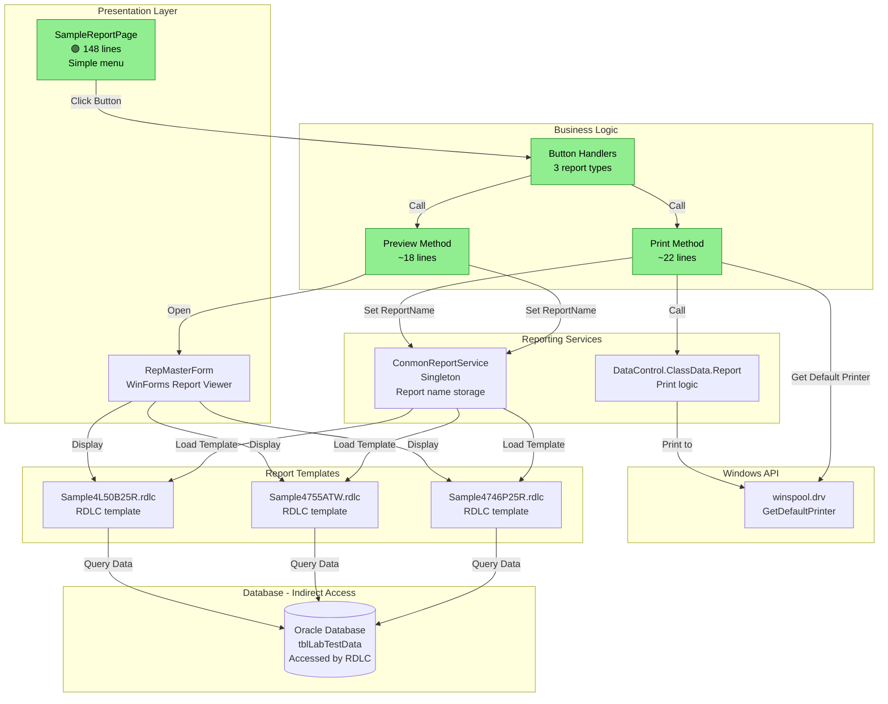
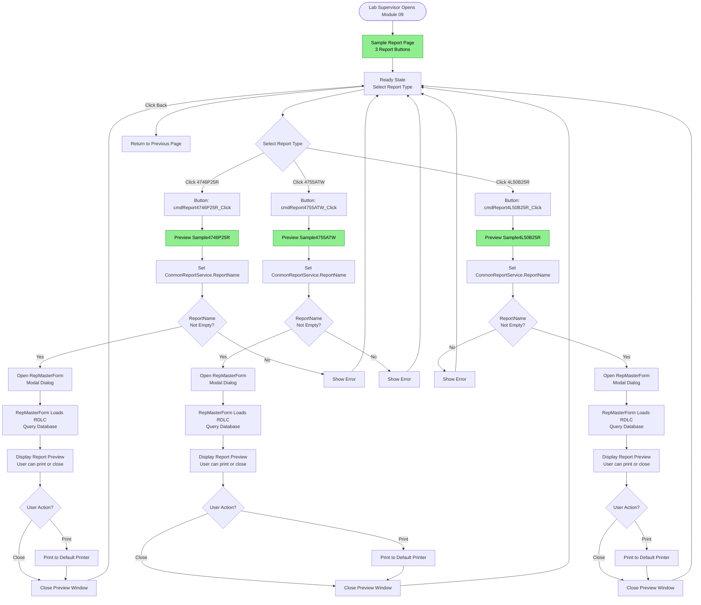
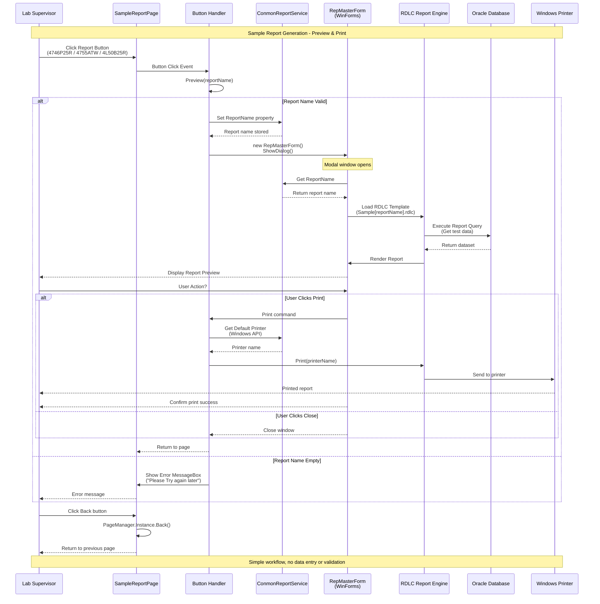

# 009 - PROCESS: Sample Report Generation

**Module**: 09 - Sample Report
**Process ID**: PROCESS_SAMPLE_REPORTING
**Created**: 2025-10-11
**Document Type**: Process Implementation Documentation
**Status**: 🟢 **SIMPLEST MODULE - 260 LINES TOTAL**

---

## 🎉 DISCOVERY - SIMPLEST MODULE IN LAB SYSTEM

### File Metrics
- **SampleReportPage.xaml**: **112 lines**
- **SampleReportPage.xaml.cs**: **148 lines**
- **Total Module**: **260 LOC**

### Comparison with Other Modules
| File | LOC | Ranking |
|------|-----|---------|
| LabDataEntryPage (Module 03) | 149,594 | 🥇 #1 CATASTROPHIC |
| LabDataEntryWindow (Module 04) | 33,132 | 🥈 #2 EXTREME |
| ItemCodeSpecificationPage (Module 05) | 9,978 | 🥉 #3 VERY HIGH |
| ImportDataExcelPage (Module 08) | 8,889 | #4 CATASTROPHIC |
| PLCGetDataPage (Module 07) | 6,713 | #5 |
| SampleTestDataPage (Module 06) | 4,703 | #6 |
| LabTestPage (Module 01) | 3,121 | #7 |
| **SampleReportPage (Module 09)** | **260** | 🏅 **#9 SIMPLEST** ⭐ |

### Complexity Assessment: **LOW** 🟢⭐
- **Simple menu page** with 3 report buttons
- **No database operations** (report data loaded by report engine)
- **No validation logic**
- **No data entry**
- **Clean code** with minimal duplication
- **Well-structured** button handlers

---

## Process Overview

### Purpose
Provide a simple menu interface for generating customer-specific sample reports. This module allows lab personnel to preview and print standardized test reports for different product types.

### Scope
- **Input**: User selects report type (3 predefined report types)
- **Processing**: Load RDLC report template, open preview window
- **Output**: Display report preview, allow printing to default printer
- **Users**: Lab supervisors, quality control managers

### Business Context
- **Customer Reports**: Generate standardized reports for customers (Toyota, Honda, etc.)
- **Quality Assurance**: Official test documentation for product certification
- **Audit Trail**: Printed reports for record-keeping
- **Report Types**: Product-specific report formats (airbag fabric specifications)

---

## UI Files Inventory

### Primary Files

| File Path | Lines | Purpose | Status |
|-----------|-------|---------|--------|
| `LuckyTex.Lab.Transfer.Data/Pages/09 Sample Report/`<br>`SampleReportPage.xaml` | 112 | UI layout | 🟢 Active |
| `LuckyTex.Lab.Transfer.Data/Pages/09 Sample Report/`<br>`SampleReportPage.xaml.cs` | 148 | Code-behind | 🟢 Active |

**Total Module**: **260 LOC**

### Related Files & Dependencies

**Report Engine**:
- **ConmonReportService** (Singleton) - Report name storage service
- **RepMasterForm** (WinForms) - Report preview window
- **DataControl.ClassData.Report** - Print logic

**RDLC Report Files** (Assumed):
- `Reports/Sample4746P25R.rdlc` - Toyota 4746P25R airbag fabric
- `Reports/Sample4755ATW.rdlc` - Honda 4755ATW airbag fabric
- `Reports/Sample4L50B25R.rdlc` - 4L50B25R airbag fabric

**Windows API**:
- `winspool.drv` - Default printer detection

---

## UI Layout Description

### Page Structure

**Simple Menu Layout**:
```
┌─────────────────────────────────────────────┐
│         Sample Report (Header)              │
├─────────────────────────────────────────────┤
│                                             │
│           ┌─────────┐   ┌─────────┐        │
│           │ 4746P25R│   │ 4755ATW │        │
│           └─────────┘   └─────────┘        │
│                                             │
│           ┌─────────┐                       │
│           │4L50B25R │                       │
│           └─────────┘                       │
│                                             │
├─────────────────────────────────────────────┤
│                                    [ Back ] │
└─────────────────────────────────────────────┘
```

### UI Controls

**Header**:
- Title: "Sample Report" (blue bar, white text)

**Content Area** (3x3 Grid):
- **Button: 4746P25R** (Grid Column 1, Row 1)
  - Click → Preview "Sample4746P25R" report
- **Button: 4755ATW** (Grid Column 3, Row 1)
  - Click → Preview "Sample4755ATW" report
- **Button: 4L50B25R** (Grid Column 1, Row 3)
  - Click → Preview "Sample4L50B25R" report

**Footer**:
- **Back Button** - Return to previous page

---

## Component Architecture Diagram



---

## Workflow Diagram



---

## Business Logic Sequence Diagram



---

## Data Flow

### Input Data Sources

**No Direct Input Data**:
- This module has **no data entry fields**
- Report selection only (3 predefined report types)

### Processing Data

**Report Names** (Hardcoded):
```csharp
// Report type constants
"Sample4746P25R"  // Toyota 4746P25R airbag fabric
"Sample4755ATW"   // Honda 4755ATW airbag fabric
"Sample4L50B25R"  // 4L50B25R airbag fabric
```

**Singleton Service**:
```csharp
ConmonReportService.Instance.ReportName = reportName;
// Stores report name for RepMasterForm to retrieve
```

### Output Data Destinations

**No Database Operations**:
- This page does **NOT write to database**
- Report engine (RDLC) queries database internally
- Data access is handled by RDLC data sources

**Output**:
1. **Screen Display**: RepMasterForm (WinForms preview window)
2. **Printer Output**: Windows default printer (via winspool.drv API)

---

## Database Operations

### No Direct Database Operations

**Database Access Pattern**:
- This page has **ZERO direct database calls**
- RDLC report templates contain embedded queries
- Report engine executes queries when loading data

**Assumed RDLC Queries** (Not visible in this page):
- `SELECT * FROM tblLabTestData WHERE ItemCode = '4746P25R' ...`
- `SELECT * FROM tblLabTestData WHERE ItemCode = '4755ATW' ...`
- `SELECT * FROM tblLabTestData WHERE ItemCode = '4L50B25R' ...`

**Tables Accessed (Indirectly by RDLC)**:
- `tblLabTestData` (test results)
- `tblItemCodeSpec` (product specifications)
- `tblProductionLot` (lot information)
- Other tables as needed by report templates

### Transaction Support

**N/A** - No database writes in this module

---

## Code Analysis

### Code Structure

**Clean Separation of Concerns**:

```csharp
public partial class SampleReportPage : UserControl
{
    // Constructor (5 lines)
    public SampleReportPage() { ... }

    // Button Handlers (3x ~5 lines each = 15 lines)
    private void cmdReport4746P25R_Click(...) => Preview("Sample4746P25R");
    private void cmdReport4755ATW_Click(...) => Preview("Sample4755ATW");
    private void cmdReport4L50B25R_Click(...) => Preview("Sample4L50B25R");

    // Preview Method (18 lines)
    private void Preview(string reportName)
    {
        try
        {
            ConmonReportService.Instance.ReportName = reportName;
            if (!string.IsNullOrEmpty(...))
            {
                var newWindow = new RepMasterForm();
                newWindow.ShowDialog();
            }
        }
        catch (Exception ex)
        {
            MessageBox.Show(ex.Message.ToString(), ...);
        }
    }

    // Print Method (22 lines) - NOT USED BY UI
    private void Print(string reportName)
    {
        try
        {
            ConmonReportService.Instance.ReportName = reportName;
            if (!string.IsNullOrEmpty(...))
            {
                StringBuilder dp = new StringBuilder(256);
                int size = dp.Capacity;
                if (GetDefaultPrinter(dp, ref size))
                {
                    DataControl.ClassData.Report rep = new DataControl.ClassData.Report();
                    rep.PrintByPrinter(dp.ToString().Trim());
                }
            }
        }
        catch (Exception ex)
        {
            MessageBox.Show(ex.Message.ToString(), ...);
        }
    }

    // Windows API (3 lines)
    [DllImport("winspool.drv", ...)]
    private static extern bool GetDefaultPrinter(StringBuilder pszBuffer, ref int size);
}
```

### Code Quality Assessment: **GOOD** 🟢

**Strengths**:
1. ✅ **Simple & Clean** - Only 148 lines, easy to understand
2. ✅ **Single Responsibility** - Menu navigation only
3. ✅ **Error Handling** - Try-catch blocks in both methods
4. ✅ **Separation of Concerns** - Report logic in separate service/form
5. ✅ **DRY Principle** - Preview method reused by all 3 buttons

**Minor Issues**:
1. ⚠️ **Unused Method** - `Print()` method defined but never called by UI
2. ⚠️ **Magic Strings** - Report names hardcoded (could use constants)

**No Major Issues Found** ✅

---

## Implementation Checklist

### Phase 1: Minor Improvements (1-2 days) 🟢 **P2 LOW PRIORITY**

#### Day 1: Code Quality Improvements
- [ ] **Task 1.1**: Extract report names to constants
  ```csharp
  private const string REPORT_4746P25R = "Sample4746P25R";
  private const string REPORT_4755ATW = "Sample4755ATW";
  private const string REPORT_4L50B25R = "Sample4L50B25R";
  ```
- [ ] **Task 1.2**: Remove unused `Print()` method (or add print buttons to UI)
- [ ] **Task 1.3**: Add XML documentation comments
- [ ] **Task 1.4**: Consider adding logging for report generation events

#### Day 2: Testing
- [ ] **Task 2.1**: Test all 3 report types
- [ ] **Task 2.2**: Verify printer detection on different machines
- [ ] **Task 2.3**: Test error scenarios (missing RDLC files)

---

### Phase 2: Enhanced Features (Optional, 2-3 days) 🟡 **P3 NICE-TO-HAVE**

#### Feature 1: Dynamic Report List
- [ ] **Task 3.1**: Load report list from database (instead of hardcoded buttons)
- [ ] **Task 3.2**: Support adding new reports without code changes
- [ ] **Task 3.3**: Add report search/filter capability

#### Feature 2: Report History
- [ ] **Task 4.1**: Log report generation events (who, when, which report)
- [ ] **Task 4.2**: Add "View Report History" button
- [ ] **Task 4.3**: Add reprint capability from history

#### Feature 3: Email Reports
- [ ] **Task 5.1**: Add "Email" button to RepMasterForm
- [ ] **Task 5.2**: Export report to PDF
- [ ] **Task 5.3**: Send via SMTP

---

## Modernization Priority

### Severity: 🟢 **P2 LOW PRIORITY - MINIMAL ISSUES**

**Ranking**: **#9 Priority** in Lab system (lowest priority)

### Justification for P2 Priority:

1. **Code Quality**: 🟢 **GOOD**
   - Only **260 lines** (simplest module)
   - **Clean code** with proper error handling
   - **Well-structured** button handlers
   - **Minimal duplication**

2. **Business Risk**: 🟢 **LOW**
   - **Read-only operations** (no database writes)
   - **Simple navigation** (minimal complexity)
   - **Error handling present** (try-catch blocks)
   - **No data integrity issues**

3. **Technical Debt**: 🟢 **MINIMAL**
   - No massive methods
   - No code duplication
   - No performance issues
   - One unused method (minor)

4. **Refactoring Effort**: 🟢 **VERY LOW** (1-2 days)
   - Minor code cleanup only
   - Extract constants
   - Remove unused method
   - Add documentation

---

### Comparison with Other Lab Modules

| Module | LOC | Duplication | Priority | Effort | Issues |
|--------|-----|-------------|----------|--------|--------|
| Module 03 | 149,594 | 90% | 🔴 P0 | 17-26 weeks | CATASTROPHIC |
| Module 04 | 33,132 | 89% | 🔴 P0 | 11-16 weeks | EXTREME |
| Module 05 | 9,978 | 80% | 🔴 P0 | 12 weeks | VERY HIGH |
| Module 08 | 8,889 | 85-90% | 🔴 P0 | 16 weeks | CATASTROPHIC |
| Module 07 | 6,713 | 78% | 🔴 P0 | 10 weeks | PLC CRITICAL |
| Module 06 | 4,703 | 38% | 🟠 P1 | 3 weeks | MEDIUM |
| Module 02 | 4,900 | 80% | 🟠 P1 | 4-6 weeks | HIGH |
| Module 01 | 3,121 | 70% | 🟠 P1 | 2-3 weeks | MEDIUM |
| **Module 09** | **260** | **~5%** | 🟢 **P2** ⭐ | **1-2 days** | **MINIMAL** |

**Recommended Priority**: **#9 in refactoring queue** (LOWEST PRIORITY)

**Why P2 (Low Priority)**:
1. 🟢 **Simplest module** (260 lines total)
2. 🟢 **Clean code** (minimal issues)
3. 🟢 **No business risk** (read-only, simple navigation)
4. 🟢 **Low technical debt** (~5% duplication)

**Why Last in Queue**:
- All other modules have higher complexity and higher business impact
- This module works well and requires minimal changes
- Resources better spent on catastrophic modules (03, 04, 05, 08)

---

## Business Rules Summary

### Report Types (Hardcoded)
1. **4746P25R** - Toyota airbag fabric report
2. **4755ATW** - Honda airbag fabric report
3. **4L50B25R** - Generic airbag fabric report

### Report Generation Rules
4. **Preview Only** - No direct printing from this page (user prints from preview window)
5. **Modal Dialog** - RepMasterForm opens as modal window
6. **Default Printer** - Uses Windows default printer (if print feature enabled)

### UI Rules
7. **Simple Navigation** - 3 buttons + Back button only
8. **No Data Entry** - No input fields, selection only
9. **Error Handling** - Try-catch with user-friendly error messages

### Report Data Source Rules (RDLC)
10. **Embedded Queries** - RDLC templates contain SQL queries
11. **Read-Only Access** - No database writes from this module
12. **Data Binding** - RDLC engine handles data binding automatically

---

## Integration Points with Other Modules

### Upstream Dependencies

#### Module 03: Lab Data Entry
- **Data Source**: Test data entered in Module 03 displayed in reports
- **Impact**: No data in Module 03 = empty reports

#### Module 05: Item Code Specification
- **Data Source**: Product specifications displayed in report headers
- **Impact**: Missing specs = incomplete report headers

---

### Downstream Dependencies

**None** - This is a terminal module (no downstream dependencies)

---

### Shared Services

#### ConmonReportService (Singleton)
- **Usage**: Stores report name for RepMasterForm to retrieve
- **Shared By**: Likely used by other modules (10, 11) for report generation

#### RepMasterForm (WinForms)
- **Usage**: Universal report preview window
- **Shared By**: Used by all report modules in Lab system

---

## Critical Observations

### Design Pattern: **Singleton Service + Modal Dialog**

**Good Pattern**:
```csharp
// Step 1: Store report name in singleton
ConmonReportService.Instance.ReportName = reportName;

// Step 2: Open modal form (form reads from singleton)
var newWindow = new RepMasterForm();
newWindow.ShowDialog();
```

**Why This Pattern**:
- ✅ **Decoupling** - Page doesn't pass data directly to form
- ✅ **Reusability** - RepMasterForm used by multiple modules
- ✅ **Simplicity** - No constructor parameters needed

**Potential Issue**:
- ⚠️ **Thread Safety** - Singleton not thread-safe (but WPF is single-threaded, so OK)
- ⚠️ **State Management** - Singleton retains state between calls (minor issue)

---

## Unused Code Analysis

### Print() Method - UNUSED ⚠️

**Code**:
```csharp
private void Print(string reportName)
{
    // ... 22 lines of print logic ...
}
```

**Status**: **DEFINED BUT NEVER CALLED**

**Reason**:
- UI only has preview buttons (no direct print buttons)
- Printing done from RepMasterForm preview window
- This method may be legacy code or future feature

**Recommendation**:
- Option 1: **Remove** if truly unused (reduce code clutter)
- Option 2: **Keep** if future feature planned (add print buttons to UI)
- Option 3: **Document** as legacy code with `[Obsolete]` attribute

---

## Conclusion

### Summary

**Module 09 - Sample Report** is a **P2 LOW PRIORITY** due to:

1. **Simplest Module**: Only 260 lines (easiest to maintain)
2. **Clean Code**: Well-structured with proper error handling
3. **Minimal Issues**: ~5% duplication, one unused method
4. **Low Business Risk**: Read-only operations, simple navigation

### Immediate Actions Required

**None** - Module works well and requires no urgent changes

### Optional Improvements (Low Priority)

1. 🟢 **Extract Constants** - Replace magic strings (1 hour)
2. 🟢 **Remove Unused Method** - Clean up Print() method (30 minutes)
3. 🟢 **Add Documentation** - XML comments (1 hour)

### Long-Term Vision

**Target Architecture** (Post-Refactoring):
- **Report Selection**: 250 lines (extract constants, remove unused code)
- **Enhanced Features** (Optional):
  - Dynamic report list from database
  - Report generation history
  - Email/PDF export capability

**Benefits**:
- ✅ Cleaner codebase (remove unused code)
- ✅ Better maintainability (constants instead of magic strings)
- ✅ Better documentation (XML comments)
- ✅ Optional enhanced features (history, email)

---

**Document Version**: 1.0
**Created**: 2025-10-11
**Status**: 🟢 **SIMPLEST MODULE - MINIMAL ISSUES**
**Priority**: 🟢 **P2 LOW PRIORITY**
**Estimated Refactoring Effort**: **1-2 days (minor cleanup only)**
**Code Reduction Target**: **Minimal (~10 lines, remove unused method)**
