# 010 - PROCESS: Lab Report Configuration

**Module**: 10 - LAB Report Setting
**Process ID**: PROCESS_REPORT_CONFIGURATION
**Created**: 2025-10-11
**Document Type**: Process Implementation Documentation
**Status**: 🟡 **MEDIUM COMPLEXITY - CONFIGURATION MODULE**

---

## Module Overview

### File Metrics
- **LABReportSettingPage.xaml**: **294 lines**
- **LABReportSettingPage.xaml.cs**: **853 lines**
- **Total Module**: **1,147 LOC**

### Comparison with Other Modules
| File | LOC | Ranking |
|------|-----|---------|
| LabDataEntryPage (Module 03) | 149,594 | 🥇 #1 CATASTROPHIC |
| LabDataEntryWindow (Module 04) | 33,132 | 🥈 #2 EXTREME |
| ItemCodeSpecificationPage (Module 05) | 9,978 | 🥉 #3 VERY HIGH |
| ImportDataExcelPage (Module 08) | 8,889 | #4 CATASTROPHIC |
| PLCGetDataPage (Module 07) | 6,713 | #5 |
| SampleTestDataPage (Module 06) | 4,703 | #6 |
| LabTestPage (Module 01) | 3,121 | #7 |
| **LABReportSettingPage (Module 10)** | **1,147** | **#8 MEDIUM** 🟡 |
| SampleReportPage (Module 09) | 260 | #9 SIMPLEST |

### Complexity Assessment: **MEDIUM** 🟡
- **Configuration page** for lab report templates
- **19 test parameter fields** with multiline text support
- **Edit/Save workflow** with enabled/disabled state management
- **Search and display** existing configurations
- **Position-based access control** (level 5 = read-only)
- **Moderate duplication** in KeyDown handlers

---

## Process Overview

### Purpose
Configure lab report templates by mapping item codes and customers to report formats with specific test parameter descriptions. This module allows lab managers to customize report text/specifications that appear on printed customer reports.

### Scope
- **Input**: Item Code, Customer, Report ID, 19 test parameter specifications
- **Processing**: Load existing configuration, edit text fields, validate required fields, save to database
- **Output**: Report configuration saved, used by report generation modules (09, 11)
- **Users**: Lab managers, supervisors (position level < 5)

### Business Context
- **Customer-Specific Reports**: Different customers require different report formats and terminology
- **Test Parameter Descriptions**: Customize specification text for each test type (Weight, Thickness, Tensile, etc.)
- **Report Templates**: Configure which RDLC report template to use per item/customer combination
- **Multi-language Support**: Text fields support Thai and English
- **Quality Assurance**: Ensure reports match customer requirements

---

## UI Files Inventory

### Primary Files

| File Path | Lines | Purpose | Status |
|-----------|-------|---------|--------|
| `LuckyTex.Lab.Transfer.Data/Pages/10 LABReportSetting/`<br>`LABReportSettingPage.xaml` | 294 | UI layout | 🟢 Active |
| `LuckyTex.Lab.Transfer.Data/Pages/10 LABReportSetting/`<br>`LABReportSettingPage.xaml.cs` | 853 | Code-behind | 🟢 Active |

**Total Module**: **1,147 LOC**

### Related Files & Dependencies

**Data Services**:
- **LabDataPDFDataService** (Singleton)
  - `GETITEMCODELIST()` - Load item codes
  - `LAB_GETREPORTIDLIST()` - Load report IDs
  - `LAB_GETREPORTINFO()` - Search existing configuration
  - `LAB_INSERTUPDATEREPORTINFO()` - Save/update configuration
- **MasterDataService** (Singleton)
  - `GetCUS_GETLISTDataList()` - Load customer list

**Database Tables**:
- `tblLabReportInfo` (main table, assumed)
- `tblItemCode` (item master)
- `tblCustomer` (customer master)
- `tblReportID` (report template master)

---

## UI Layout Description

### Page Structure


### UI Controls

**Header**:
- Title: "LAB Report Setting" (blue bar)

**Top Controls**:
- **ComboBox: Item Code** - Select product to configure
- **Button: Edit** - Enable fields for editing
- **Button: Save** - Save configuration (disabled initially)
- **Button: Clear** - Clear all fields

**Left Panel (420px width)**:
- **ComboBox: Customer** - Select customer
- **ComboBox: Report ID** - Select report template
- **TextBox: Specification Issue** (Reversion) - Single line
- **TextBox: Yarn Type** - Multiline (162px height)

**Right Panel (Scrollable, 765px width)**:
- **19 Text Fields** - All multiline with `AcceptsReturn="True"`
- Fields support long text descriptions
- Enter/RightShift key navigation between fields

**Footer**:
- **Operator** - Read-only, shows current user
- **Button: Back** - Return to previous page

---

## Component Architecture Diagram


---

## Workflow Diagram

```mermaid
graph TD
    Start([Lab Manager Opens Module 10]) --> Page[LAB Report Setting Page]
    Page --> Load[Load Dropdowns<br/>Item Codes, Customers, Report IDs]
    Load --> CheckLevel{Position Level?}

    CheckLevel -->|Level < 5| ShowEditSave[Show Edit & Save Buttons]
    CheckLevel -->|Level = 5| HideEditSave[Hide Edit & Save Buttons<br/>Read-only mode]

    ShowEditSave --> Ready[Ready State<br/>Select Item & Customer]
    HideEditSave --> Ready

    Ready --> SelectItem[User Selects Item Code]
    SelectItem --> SelectCustomer[User Selects Customer]
    SelectCustomer --> AutoSearch{Both Selected?}

    AutoSearch -->|Yes| CallSearch[Call SearchData<br/>ItemCode + CustomerID]
    AutoSearch -->|No| Ready

    CallSearch --> QueryDB[(Query LAB_GETREPORTINFO)]
    QueryDB --> CheckResult{Data Found?}

    CheckResult -->|Yes| DisplayData[Display Configuration<br/>Fill all 19 fields]
    CheckResult -->|No| ShowNotFound[Show Thai Message:<br/>ไม่พบข้อมูล]

    ShowNotFound --> ClearFields[Clear All Fields]
    ClearFields --> Ready

    DisplayData --> UserAction{User Action?}

    UserAction -->|Click Edit| EnableFields[Enable All Fields<br/>Edit = Disabled<br/>Save = Enabled]
    UserAction -->|Click Clear| ClearAll[Clear All Fields]
    UserAction -->|Click Back| Back[Return to Previous Page]

    EnableFields --> EditState[Edit Mode<br/>User can modify fields]
    EditState --> Navigate[Navigate with Enter/RightShift]
    Navigate --> UserEdit{User Action?}

    UserEdit -->|Click Save| ValidateRequired{Required Fields<br/>Not Empty?}
    UserEdit -->|Click Clear| ClearAll
    UserEdit -->|Click Back| Back

    ValidateRequired -->|No| ShowError[Show Error Message<br/>Item Code/Customer/Report ID required]
    ShowError --> EditState

    ValidateRequired -->|Yes| BuildParams[Build 25 Parameters<br/>P_ITMCODE to P_BENDING]
    BuildParams --> CallSave[Call LAB_INSERTUPDATEREPORTINFO]
    CallSave --> SaveDB[(INSERT or UPDATE)]

    SaveDB --> CheckSaveResult{Save Success?}

    CheckSaveResult -->|Yes| ShowSuccess[Show Save Data Complete]
    CheckSaveResult -->|No| ShowSaveError[Show Error Message]

    ShowSuccess --> DisableFields[Disable Fields<br/>Edit = Enabled<br/>Save = Disabled]
    ShowSaveError --> EditState

    DisableFields --> ClearAll
    ClearAll --> Ready

    style Page fill:#ffd700,stroke:#ffa500,color:#000
    style CallSearch fill:#ffd700,stroke:#ffa500,color:#000
    style EnableFields fill:#90ee90,stroke:#228b22
    style ValidateRequired fill:#ffd700,stroke:#ffa500,color:#000
    style CallSave fill:#ffa500,stroke:#ff8c00
    style QueryDB fill:#ffa500,stroke:#ff8c00
    style SaveDB fill:#ffa500,stroke:#ff8c00
```



---

## Business Logic Sequence Diagram

```mermaid
sequenceDiagram
    participant Manager as Lab Manager
    participant UI as LABReportSettingPage
    participant Load as Load Methods
    participant Search as SearchData
    participant Save as Save Method
    participant LabSvc as LabDataPDFDataService
    participant MasterSvc as MasterDataService
    participant DB as Oracle Database

    Note over Manager,DB: Lab Report Configuration - Edit & Save

    Manager->>UI: Open Page
    UI->>Load: UserControl_Loaded()

    par Load Dropdowns in Parallel
        Load->>LabSvc: GETITEMCODELIST()
        LabSvc->>DB: SELECT ItemCodes
        DB-->>LabSvc: Return items
        LabSvc-->>Load: List<ITM_GETITEMCODELIST>

        Load->>MasterSvc: GetCUS_GETLISTDataList()
        MasterSvc->>DB: SELECT Customers
        DB-->>MasterSvc: Return customers
        MasterSvc-->>Load: List<CUS_GETLISTData>

        Load->>LabSvc: LAB_GETREPORTIDLIST()
        LabSvc->>DB: SELECT ReportIDs
        DB-->>LabSvc: Return reportIDs
        LabSvc-->>Load: List<LAB_GETREPORTIDLIST>
    end

    Load->>UI: Populate ComboBoxes
    Load->>UI: Check Position Level

    alt Position Level < 5 (Manager/Supervisor)
        UI->>UI: Show Edit & Save Buttons
    else Position Level = 5 (Operator)
        UI->>UI: Hide Edit & Save Buttons<br/>(Read-only mode)
    end

    UI-->>Manager: Ready State

    Manager->>UI: Select Item Code
    UI->>UI: cbItemCode_SelectionChanged

    Manager->>UI: Select Customer
    UI->>UI: cbCUSTOMERID_SelectionChanged

    alt Both Item Code & Customer Selected
        UI->>Search: SearchData(ItemCode, CustomerID)
        Search->>LabSvc: LAB_GETREPORTINFO(ItemCode, CustomerID)
        LabSvc->>DB: SELECT * FROM tblLabReportInfo<br/>WHERE ITM_CODE=? AND CUSTOMERID=?
        DB-->>LabSvc: Return configuration (or empty)

        alt Configuration Found
            LabSvc-->>Search: List<LAB_GETREPORTINFO> (1 row)
            Search->>UI: Fill 22 Fields<br/>(Report ID + 19 parameters)
            UI-->>Manager: Display Configuration
        else Configuration Not Found
            LabSvc-->>Search: List<LAB_GETREPORTINFO> (0 rows)
            Search->>UI: Show Thai Error Message<br/>ไม่พบข้อมูล
            Search->>UI: ClearText() - Clear fields
            UI-->>Manager: Empty form
        end
    end

    Manager->>UI: Click Edit Button
    UI->>UI: EnabledControl(true)<br/>Enable 20 fields
    UI->>UI: Edit = Disabled<br/>Save = Enabled
    UI-->>Manager: Edit Mode Active

    Manager->>UI: Modify Fields<br/>(Navigate with Enter/RightShift)

    loop For Each Field (19 KeyDown handlers)
        Manager->>UI: Press Enter/RightShift
        UI->>UI: Focus Next Field<br/>SelectAll text
    end

    Manager->>UI: Click Save Button
    UI->>Save: cmdSave_Click()

    Save->>Save: Validate Required Fields

    alt Required Fields Empty
        Save->>UI: Show Error MessageBox<br/>Item Code/Customer/Report ID isn't Null
        UI-->>Manager: Error message
    else All Required Fields Present
        Save->>Save: Build 25 Parameters

        Note over Save: P_ITMCODE, P_CUSTOMERID, P_REPORTID,<br/>P_REVERSION, P_YARNTYPE, P_WEIGHT,<br/>... (19 test parameters)

        Save->>LabSvc: LAB_INSERTUPDATEREPORTINFO<br/>(25 parameters)
        LabSvc->>DB: CALL SP_LAB_INSERTUPDATEREPORTINFO

        alt Record Exists
            DB->>DB: UPDATE tblLabReportInfo<br/>SET fields WHERE ItemCode+CustomerID
        else Record New
            DB->>DB: INSERT INTO tblLabReportInfo<br/>VALUES (...)
        end

        alt Save Success
            DB-->>LabSvc: Return "1"
            LabSvc-->>Save: "1"
            Save->>UI: Show Save Data Complete
            Save->>UI: ClearControl()
            UI-->>Manager: Success, form cleared
        else Save Error
            DB-->>LabSvc: Return error message
            LabSvc-->>Save: Error message
            Save->>UI: Show Error MessageBox
            UI-->>Manager: Error message
        end
    end

    Manager->>UI: Click Back Button
    UI->>UI: PageManager.Instance.Back()
    UI-->>Manager: Return to previous page

    Note over Manager,DB: 19 Test Parameters:<br/>Weight, Coat, Threads, Width, Thickness,<br/>MaxForce, Elongation, Flammability,<br/>Edgecomb, Stiffness, Tear, Static Air,<br/>Dynamic Air, Exponent, Dimensional Change,<br/>Flex Abrasion, Flex Scott, BOW, SKEW, Bending
```



---

## Data Flow

### Input Data Sources

**1. ComboBox Data** (Loaded on page load):
- **Item Codes**: From `GETITEMCODELIST()` - Product master
- **Customers**: From `CUS_GETLIST()` - Customer master
- **Report IDs**: From `LAB_GETREPORTIDLIST()` - Report template master

**2. Configuration Search** (When Item + Customer selected):
- **Query**: `LAB_GETREPORTINFO(ItemCode, CustomerID)`
- **Returns**: Existing configuration (22 fields) or empty

**3. User Input** (22 fields):
```csharp
class LAB_REPORTINFO_Input
{
    // Key fields
    string ItemCode        // From ComboBox
    string CustomerID      // From ComboBox
    string ReportID        // From ComboBox

    // Report metadata
    string Reversion       // Specification issue version
    string YarnType        // Yarn type description (multiline)

    // 19 Test Parameter Descriptions (all multiline text)
    string Weight          // Total Weight spec
    string CoatWeight      // Coating Weight spec
    string NumThreads      // Number of Threads spec
    string UseWidth        // Usable Width spec
    string Thickness       // Thickness spec
    string MaxForce        // Elongation at Maximum Force spec
    string Elogation       // Elongation spec
    string Flammability    // Flammability spec
    string Edgecomb        // Edgecomb Resistance spec
    string Stiffness       // Stiffness spec
    string Tear            // Tear Force spec
    string Static_Air      // Static Air Permeability spec
    string Dynamic_Air     // Dynamic Air spec
    string Exponent        // Exponent spec
    string DimensChange    // Dimensional Change spec
    string FlexAbrasion    // Flex Abrasion (Scrub) spec
    string Flex_Scott      // Abrasion Resistance (Scott) spec
    string BOW             // Degree of BOW spec
    string SKEW            // Degree of Bias Filling (SKEW) spec
    string Bending         // Bending spec
}
```

### Processing Data

**Validation Rules**:
1. **Required Fields**: Item Code, Customer, Report ID must not be empty
2. **Optional Fields**: All 19 test parameter fields are optional (can be empty)
3. **Multiline Support**: All text fields accept multiline input (`AcceptsReturn="True"`)
4. **Language**: Fields support Thai and English characters

**State Management**:
- **Initial State**: All fields disabled except ComboBoxes
- **Edit Mode**: Click Edit → Enable all fields, disable Edit button, enable Save button
- **Save Complete**: Disable all fields, enable Edit button, disable Save button

### Output Data Destinations

**1. Database Table**: `tblLabReportInfo` (assumed)
```sql
-- Structure (assumed)
CREATE TABLE tblLabReportInfo (
    ITM_CODE VARCHAR2(50) NOT NULL,
    CUSTOMERID VARCHAR2(50) NOT NULL,
    REPORT_ID VARCHAR2(50),
    REVESION VARCHAR2(200),
    YARNTYPE CLOB,
    WEIGHT CLOB,
    COATWEIGHT CLOB,
    NUMTHREADS CLOB,
    USABLE_WIDTH CLOB,
    THICKNESS CLOB,
    MAXFORCE CLOB,
    ELONGATIONFORCE CLOB,
    FLAMMABILITY CLOB,
    EDGECOMB CLOB,
    STIFFNESS CLOB,
    TEAR CLOB,
    STATIC_AIR CLOB,
    DYNAMIC_AIR CLOB,
    EXPONENT CLOB,
    DIMENSCHANGE CLOB,
    FLEXABRASION CLOB,
    FLEX_SCOTT CLOB,
    BOW CLOB,
    SKEW CLOB,
    BENDING CLOB,
    PRIMARY KEY (ITM_CODE, CUSTOMERID)
);
```

**2. Used By**:
- **Module 09**: Sample Report generation (reads config for report text)
- **Module 11**: Upload LAB Report (likely reads config)
- **RDLC Reports**: Report templates read configuration for specification text

---

## Database Operations

### Stored Procedures

**1. LAB_GETREPORTINFO** (SELECT - Search existing config)
```sql
-- Assumed signature
PROCEDURE LAB_GETREPORTINFO(
    P_ITMCODE IN VARCHAR2,
    P_CUSTOMERID IN VARCHAR2,
    P_CURSOR OUT SYS_REFCURSOR
)
-- Returns: Configuration row (22 fields) or empty
```

**2. LAB_INSERTUPDATEREPORTINFO** (INSERT/UPDATE - Save config)
```sql
-- Actual signature (from code)
PROCEDURE LAB_INSERTUPDATEREPORTINFO(
    P_ITMCODE IN VARCHAR2,
    P_CUSTOMERID IN VARCHAR2,
    P_REPORTID IN VARCHAR2,
    P_REVERSION IN VARCHAR2,
    P_YARNTYPE IN VARCHAR2,
    P_WEIGHT IN VARCHAR2,
    P_COATWEIGHT IN VARCHAR2,
    P_NUMTHREADS IN VARCHAR2,
    P_USEWIDTH IN VARCHAR2,
    P_THICKNESS IN VARCHAR2,
    P_MAXFORCE IN VARCHAR2,
    P_ELOGATION IN VARCHAR2,
    P_FLAMMABILITY IN VARCHAR2,
    P_EDGECOMB IN VARCHAR2,
    P_STIFFNESS IN VARCHAR2,
    P_TEAR IN VARCHAR2,
    P_STATIC_AIR IN VARCHAR2,
    P_DYNAMIC_AIR IN VARCHAR2,
    P_EXPONENT IN VARCHAR2,
    P_DIMENSCHANGE IN VARCHAR2,
    P_FLEXABRASION IN VARCHAR2,
    P_BOW IN VARCHAR2,
    P_SKEW IN VARCHAR2,
    P_FLEX_SCOTT IN VARCHAR2,
    P_BENDING IN VARCHAR2
)
RETURNS VARCHAR2  -- "1" = success, error message = failure
-- Logic: Check if record exists (ItemCode+CustomerID)
--        If exists: UPDATE
--        If not: INSERT
```

**3. GETITEMCODELIST** (SELECT - Load item master)
```sql
PROCEDURE GETITEMCODELIST(
    P_CURSOR OUT SYS_REFCURSOR
)
-- Returns: List of item codes
```

**4. CUS_GETLIST** (SELECT - Load customer master)
```sql
PROCEDURE CUS_GETLIST(
    P_CURSOR OUT SYS_REFCURSOR
)
-- Returns: List of customers (CUSTOMERID, CUSTOMERNAME)
```

**5. LAB_GETREPORTIDLIST** (SELECT - Load report template master)
```sql
PROCEDURE LAB_GETREPORTIDLIST(
    P_CURSOR OUT SYS_REFCURSOR
)
-- Returns: List of report templates (REPORT_ID, REPORT_NAME)
```

### Transaction Support

**Assumed**: Single stored procedure call = implicit transaction (Oracle default)
- **No explicit transaction** in C# code
- **Stored procedure** likely handles transaction internally
- **Risk**: Low (single INSERT/UPDATE operation, not multiple)

---

## Code Analysis

### Code Structure

**853 Lines Breakdown**:
- **Constructor**: 10 lines (load dropdowns)
- **Button Handlers**: 60 lines (Back, Edit, Save, Clear)
- **KeyDown Handlers**: 228 lines (**19 handlers × ~12 lines = DUPLICATION**)
- **ComboBox Handlers**: 38 lines (2 handlers with similar logic)
- **Private Methods**: 517 lines
  - LoadItemCode: 15 lines
  - LoadCUS_GETLIST: 15 lines
  - LoadLAB_GETREPORTINFO: 15 lines
  - EnabledControl: 29 lines (20 field enable/disable)
  - ClearControl: 45 lines (22 field clear)
  - ClearText: 28 lines (21 field clear)
  - SearchData: 53 lines (22 field assignment)
  - Save: 135 lines (25 parameter extraction + SP call)

### Code Quality Assessment: **MEDIUM** 🟡

**Strengths**:
1. ✅ **Separation of concerns** - Clear method organization
2. ✅ **Error handling** - Try-catch blocks in all database operations
3. ✅ **Access control** - Position-based visibility (level 5 = read-only)
4. ✅ **User feedback** - Error messages for validation failures
5. ✅ **Keyboard navigation** - Enter/RightShift navigation chain

**Issues**:

#### 🟠 **MODERATE Duplication** - KeyDown Handlers (228 lines, 90% duplicate)
```csharp
// Pattern repeated 19 times
private void txtFIELD_KeyDown(object sender, KeyEventArgs e)
{
    if (e.Key == Key.RightShift || e.Key == Key.Return)
    {
        txtNEXTFIELD.Focus();
        txtNEXTFIELD.SelectAll();
        e.Handled = true;
    }
}
```
**Solution**: Extract to helper method or use attached behavior

#### 🟠 **MODERATE Duplication** - Clear Methods (2 methods, 90% duplicate)
- `ClearControl()` - 45 lines (clears 22 fields + resets buttons)
- `ClearText()` - 28 lines (clears 21 fields)
**Solution**: Extract common clear logic

#### 🟡 **Minor Issue** - Bug in Validation Logic (Line 165)
```csharp
else if (string.IsNullOrEmpty(cmID))
    "Customer isn't Null".ShowMessageBox();
else if (string.IsNullOrEmpty(cmID))  // ⚠️ BUG: Should check repID
    "Report ID isn't Null".ShowMessageBox();
```
**Solution**: Change second `cmID` to `repID`

#### 🟡 **Minor Issue** - Magic Number
- Position level "5" hardcoded (line 93, 100)
**Solution**: Extract constant

---

## Critical Issues & Technical Debt

### 🟠 MODERATE Priority Issues

#### 1. **MODERATE CODE DUPLICATION** - KeyDown Handlers
- **Impact**: 🟠 **MEDIUM**
- **Problem**: 19 handlers × ~12 lines = **228 duplicate lines** (90% identical)
- **Consequence**:
  - Hard to maintain (change navigation = update 19 methods)
  - Bug multiplication (fix in 19 places)
  - Code clutter
- **Solution**: Extract helper method
```csharp
// BEFORE: 19 methods × 12 lines = 228 lines
private void txtWEIGHT_KeyDown(...) { /* 12 lines */ }
private void txtCOATWEIGHT_KeyDown(...) { /* 12 lines */ }
// ... 17 more methods

// AFTER: 1 method + configuration = ~30 lines
private Dictionary<TextBox, TextBox> _navigationMap;
private void InitializeNavigationMap()
{
    _navigationMap = new Dictionary<TextBox, TextBox>
    {
        [txtWEIGHT] = txtCOATWEIGHT,
        [txtCOATWEIGHT] = txtNUMTHREADS,
        // ... 17 more mappings
    };
}
private void Common_KeyDown(object sender, KeyEventArgs e)
{
    if (e.Key == Key.RightShift || e.Key == Key.Return)
    {
        if (sender is TextBox current && _navigationMap.ContainsKey(current))
        {
            var next = _navigationMap[current];
            next.Focus();
            next.SelectAll();
            e.Handled = true;
        }
    }
}
```
**Code Reduction**: 228 lines → **~30 lines** (87% reduction)

#### 2. **MODERATE DUPLICATION** - ClearControl vs ClearText
- **Impact**: 🟠 **MEDIUM**
- **Problem**: 2 methods with 90% duplicate code (clear 21 fields)
- **Solution**: Extract common clear logic to base method

#### 3. **VALIDATION BUG** - Incorrect Field Check
- **Impact**: 🟡 **LOW**
- **Problem**: Line 165 checks `cmID` instead of `repID`
- **Consequence**: Report ID validation never triggers
- **Solution**: Fix typo

### 🟡 LOW Priority Issues

#### 4. **NO ASYNC OPERATIONS**
- **Impact**: 🟡 **LOW**
- **Problem**: Database operations are synchronous
- **Consequence**: UI may freeze during save (unlikely for single UPDATE)
- **Solution**: Convert to async/await (optional)

#### 5. **MAGIC NUMBER** - Position Level
- **Impact**: 🟡 **LOW**
- **Problem**: "5" hardcoded for operator level
- **Solution**: Extract constant

#### 6. **NO TRANSACTION SUPPORT** (Assumed Low Risk)
- **Impact**: 🟡 **LOW**
- **Problem**: No explicit transaction in C# code
- **Consequence**: Low risk (single INSERT/UPDATE)
- **Solution**: Stored procedure likely handles transaction

---

## Implementation Checklist

### Phase 1: Refactoring (3-4 days) 🟠 **P1 MEDIUM PRIORITY**

#### Day 1: Extract KeyDown Navigation Logic
- [ ] **Task 1.1**: Create navigation map (Dictionary<TextBox, TextBox>)
- [ ] **Task 1.2**: Extract common KeyDown handler method
- [ ] **Task 1.3**: Attach common handler to all 19 textboxes
- [ ] **Task 1.4**: Remove 19 duplicate KeyDown methods
- [ ] **Task 1.5**: Test navigation flow

**Code Reduction**: 228 → 30 lines (87% reduction)

#### Day 2: Extract Clear Logic
- [ ] **Task 2.1**: Extract common clear logic to base method
- [ ] **Task 2.2**: Refactor ClearControl() and ClearText() to use base method
- [ ] **Task 2.3**: Test clear functionality

**Code Reduction**: 73 → ~40 lines (45% reduction)

#### Day 3: Bug Fixes & Code Quality
- [ ] **Task 3.1**: Fix validation bug (line 165: cmID → repID)
- [ ] **Task 3.2**: Extract position level constant
- [ ] **Task 3.3**: Add XML documentation comments
- [ ] **Task 3.4**: Add logging for save operations

#### Day 4: Testing
- [ ] **Task 4.1**: Test all 19 field navigation paths
- [ ] **Task 4.2**: Test Edit/Save workflow
- [ ] **Task 4.3**: Test validation errors
- [ ] **Task 4.4**: Test position-based access control
- [ ] **Task 4.5**: Test Search functionality

---

### Phase 2: Enhanced Features (Optional, 2-3 days) 🟡 **P2 NICE-TO-HAVE**

#### Feature 1: Async Operations
- [ ] **Task 5.1**: Convert Save method to async
- [ ] **Task 5.2**: Add progress indicator during save
- [ ] **Task 5.3**: Add cancellation token support

#### Feature 2: Configuration Validation
- [ ] **Task 6.1**: Validate text field lengths (prevent overflow)
- [ ] **Task 6.2**: Add character count indicators for long fields
- [ ] **Task 6.3**: Add warning if unsaved changes exist

#### Feature 3: Configuration History
- [ ] **Task 7.1**: Log configuration changes (audit trail)
- [ ] **Task 7.2**: Add "View History" button
- [ ] **Task 7.3**: Add "Revert to Previous" capability

---

## Modernization Priority

### Severity: 🟠 **P1 MEDIUM PRIORITY - MODERATE DUPLICATION**

**Ranking**: **#7 Priority** in Lab system

### Justification for P1 Priority:

1. **Code Quality**: 🟡 **MEDIUM**
   - **1,147 lines** (moderate complexity)
   - **~30% duplication** (KeyDown handlers + clear methods)
   - **Clean structure** with good separation of concerns
   - **1 validation bug** (low impact)

2. **Business Risk**: 🟡 **LOW**
   - **Configuration data only** (no production data at risk)
   - **Single UPDATE operation** (low data corruption risk)
   - **Validation present** (required fields checked)
   - **Used by report modules** (but not critical path)

3. **Technical Debt**: 🟠 **MEDIUM**
   - **228 duplicate lines** (KeyDown handlers)
   - **73 duplicate lines** (Clear methods)
   - **Minor bug** (validation typo)
   - **No async** (low impact)

4. **Refactoring Effort**: 🟢 **LOW** (3-4 days)
   - **87% reduction** in KeyDown handlers (228 → 30 lines)
   - **45% reduction** in Clear methods (73 → 40 lines)
   - **Low risk** (isolated module, configuration only)

---

### Comparison with Other Lab Modules

| Module | LOC | Duplication | Priority | Effort | Code Reduction |
|--------|-----|-------------|----------|--------|----------------|
| Module 03 | 149,594 | 90% | 🔴 P0 | 17-26 weeks | 90% |
| Module 04 | 33,132 | 89% | 🔴 P0 | 11-16 weeks | 89% |
| Module 05 | 9,978 | 80% | 🔴 P0 | 12 weeks | 80% |
| Module 08 | 8,889 | 85-90% | 🔴 P0 | 16 weeks | 83% |
| Module 07 | 6,713 | 78% | 🔴 P0 | 10 weeks | 74% |
| Module 06 | 4,703 | 38% | 🟠 P1 | 3 weeks | 88% (Quick Win) |
| Module 02 | 4,152 | 80% | 🟠 P1 | 4-6 weeks | 85% |
| **Module 10** | **1,147** | **~30%** | 🟠 **P1** 🟡 | **3-4 days** | **~35%** |
| Module 01 | 3,121 | 70% | 🟠 P1 | 2-3 weeks | ~70% |
| Module 09 | 260 | ~5% | 🟢 P2 | 1-2 days | ~4% |

**Recommended Priority**: **#7 in refactoring queue**

**Why P1 (Medium Priority)**:
1. 🟠 **Moderate duplication** (~30%, 300 duplicate lines)
2. 🟢 **Low effort** (3-4 days refactoring)
3. 🟢 **Low business risk** (configuration only)
4. 🟡 **Medium impact** (cleaner navigation code)

**Why NOT P0**:
- Not catastrophic (only 1,147 lines, 30% duplication)
- Configuration module (lower business impact than data entry modules)
- No critical bugs (only minor validation typo)

**Why NOT P2**:
- Significant duplication (300 lines, 30%)
- Quick win opportunity (3-4 days for 35% code reduction)
- Moderate maintenance burden (19 duplicate KeyDown handlers)

---

## Business Rules Summary

### Configuration Rules
1. **Primary Key**: Item Code + Customer (unique combination)
2. **Required Fields**: Item Code, Customer, Report ID
3. **Optional Fields**: All 19 test parameter descriptions (can be empty)
4. **Multiline Support**: All text fields accept multiline input

### Access Control Rules
5. **Position Level < 5**: Full access (Edit & Save visible)
6. **Position Level = 5**: Read-only (Edit & Save hidden)

### Search Rules
7. **Auto-Search**: Triggers when both Item Code AND Customer selected
8. **Search Result**: Load existing configuration or show "Not Found" message
9. **Thai Error Messages**: ไม่พบข้อมูล (Data not found)

### Save Rules
10. **INSERT or UPDATE**: Stored procedure checks if record exists
11. **Success**: Returns "1", shows "Save Data Complete"
12. **Failure**: Returns error message, shows error dialog

### Navigation Rules
13. **Keyboard Navigation**: Enter or RightShift key moves to next field
14. **Focus Management**: Auto-select all text on focus
15. **Last Field**: Bending field → focus moves to Save button

---

## Integration Points with Other Modules

### Upstream Dependencies

#### Module 05: Item Code Specification
- **Data Source**: Item codes loaded from same master table
- **Impact**: No item codes = empty Item Code dropdown

#### Master Data: Customer Master
- **Data Source**: Customer list from `CUS_GETLIST`
- **Impact**: No customers = empty Customer dropdown

### Downstream Dependencies

#### Module 09: Sample Report
- **Usage**: Reads configuration for report text/specifications
- **Impact**: No configuration = empty or default text on reports

#### Module 11: Upload LAB Report
- **Usage**: Likely reads configuration for report metadata
- **Impact**: No configuration = possible report upload issues

### Shared Services

#### LabDataPDFDataService (Singleton)
- **Usage**: Configuration CRUD operations
- **Shared By**: Modules 01, 02, 07, 08, 10, 11

#### MasterDataService (Singleton)
- **Usage**: Customer master data
- **Shared By**: Multiple modules across Lab and MES systems

---

## Conclusion

### Summary

**Module 10 - LAB Report Setting** is a **P1 MEDIUM PRIORITY** due to:

1. **Moderate Duplication**: ~30% (300 lines, mostly KeyDown handlers)
2. **Low Effort**: 3-4 days refactoring
3. **Low Business Risk**: Configuration data only, single UPDATE operation
4. **Clean Structure**: Well-organized code with good separation of concerns

### Immediate Actions Required

1. 🟠 **EXTRACT KEYDOWN HANDLERS** - Reduce 228 lines to 30 lines (87% reduction)
2. 🟠 **EXTRACT CLEAR LOGIC** - Reduce 73 lines to 40 lines (45% reduction)
3. 🟡 **FIX VALIDATION BUG** - Line 165 typo (5 minutes)

### Long-Term Vision

**Target Architecture** (Post-Refactoring):
- **Navigation Logic**: 30 lines (dictionary-based, was 228 lines)
- **Clear Logic**: 40 lines (extracted base method, was 73 lines)
- **Total**: **~850 lines** (from 1,147) = **26% code reduction**

**Benefits**:
- ✅ Maintainable navigation (change in 1 place, not 19)
- ✅ Cleaner code structure
- ✅ Bug fix (validation typo)
- ✅ Easier to add new fields
- ✅ Optional enhancements (async, history, validation)

---

**Document Version**: 1.0
**Created**: 2025-10-11
**Status**: 🟡 **MEDIUM COMPLEXITY - MODERATE DUPLICATION**
**Priority**: 🟠 **P1 MEDIUM PRIORITY**
**Estimated Refactoring Effort**: **3-4 days (1 developer)**
**Code Reduction Target**: **26% (1,147 → ~850 lines)**
