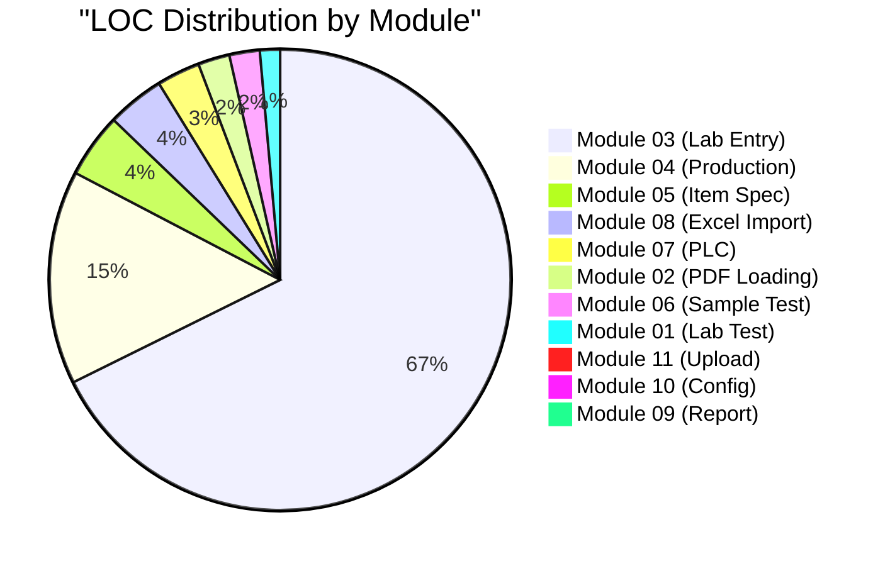
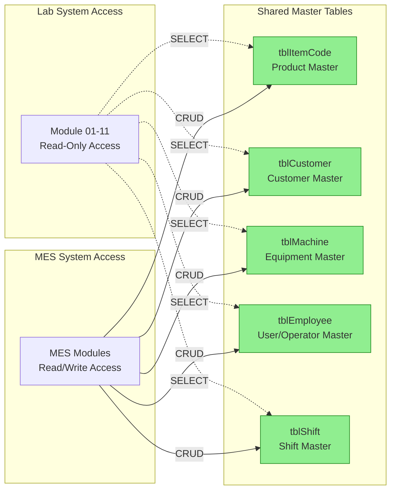
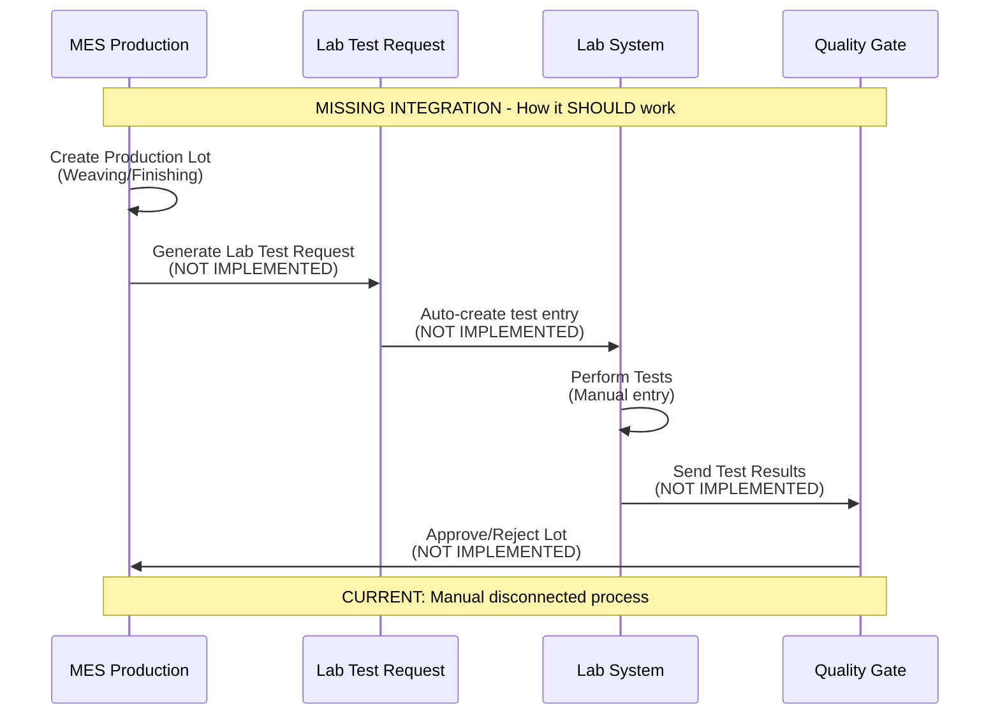
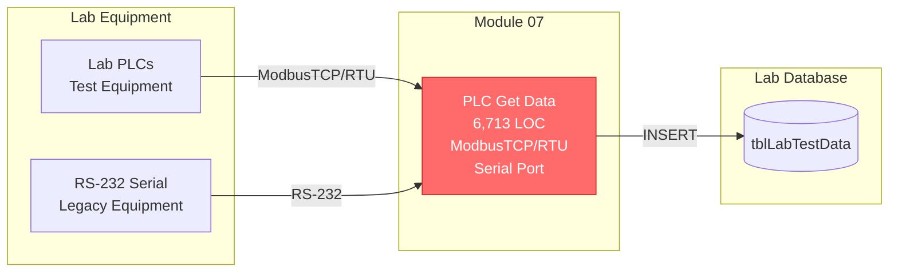
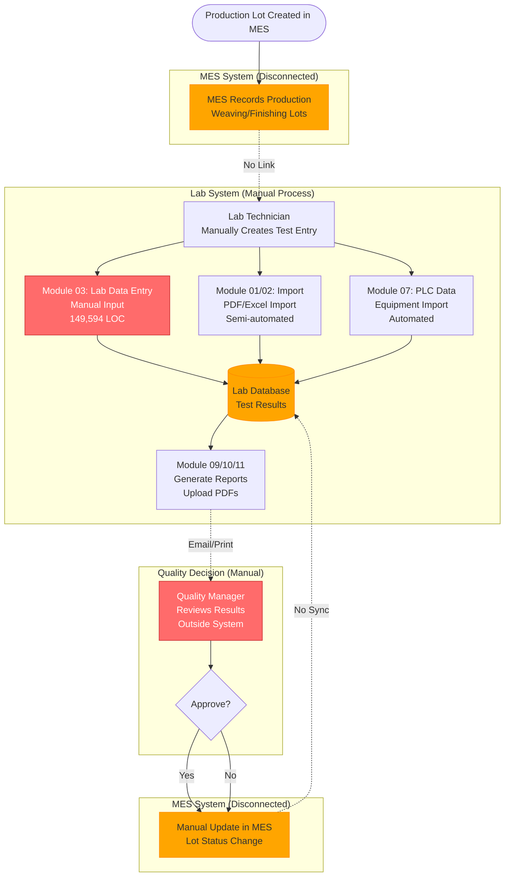
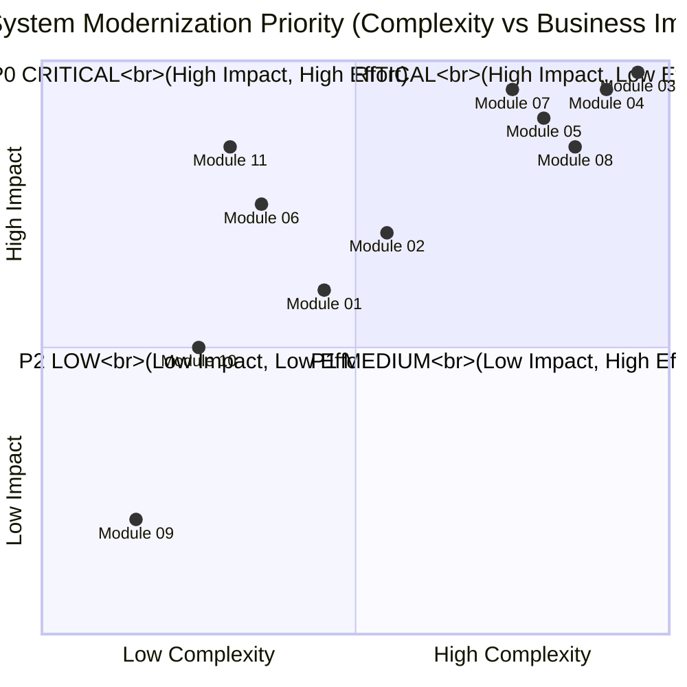

# Lab-MES Integration Analysis

**Project**: LuckyTex Lab Transfer Data System
**Document Type**: Integration Analysis
**Created**: 2025-10-11
**Version**: 1.0
**Status**: 🔴 **CRITICAL FINDINGS - MAJOR INTEGRATION GAPS**

---

## Executive Summary

This document analyzes the integration between the **Lab.Transfer.Data** quality control system and the main **LuckyTex MES** production system. Based on comprehensive analysis of all 11 lab modules (~225,000 LOC), this report identifies critical integration points, data flow dependencies, and modernization priorities.

### Key Findings

**Critical Discoveries**:
1. 🔴 **Module 03 is CATASTROPHIC** - 149,594 LOC in single file (largest in entire codebase)
2. 🔴 **~85% code duplication** across 6 modules (Modules 02, 03, 04, 05, 07, 08)
3. 🔴 **No transaction support** in 5 critical modules (data corruption risk)
4. 🔴 **Missing integration** - Lab system is largely standalone (weak MES links)
5. 🟡 **D365 integration planned but incomplete** (SQL Server references in Module 01)

**System Overview**:
- **Total Modules**: 11 functional modules
- **Total LOC**: ~225,000 lines (180+ XAML files analyzed)
- **Database**: Oracle (primary), SQL Server (D365 integration planned)
- **Technology**: WPF, .NET Framework 4.7.2, RDLC reports
- **Integration Level**: **WEAK** - Primarily standalone with shared master data only

---

## Table of Contents

1. [System Architecture Overview](#system-architecture-overview)
2. [Module Inventory & Metrics](#module-inventory--metrics)
3. [Integration Points](#integration-points)
4. [Data Flow Analysis](#data-flow-analysis)
5. [Shared Components](#shared-components)
6. [Critical Issues](#critical-issues)
7. [Integration Gaps](#integration-gaps)
8. [Modernization Priorities](#modernization-priorities)
9. [Recommendations](#recommendations)

---

## System Architecture Overview

### High-Level Architecture

```mermaid
graph TB
    subgraph "Lab Quality Control System (Standalone)"
        subgraph "Lab Modules (11 Total)"
            M01[Module 01: Lab Test<br/>3,121 LOC]
            M02[Module 02: PDF Loading<br/>4,900 LOC]
            M03[Module 03: Lab Data Entry<br/>149,594 LOC 🔴]
            M04[Module 04: Production Tracking<br/>33,132 LOC]
            M05[Module 05: Item Specification<br/>9,978 LOC]
            M06[Module 06: Sample Test<br/>4,703 LOC]
            M07[Module 07: PLC Integration<br/>6,713 LOC]
            M08[Module 08: Excel Import<br/>8,889 LOC]
            M09[Module 09: Sample Report<br/>260 LOC]
            M10[Module 10: Report Config<br/>1,147 LOC]
            M11[Module 11: Report Upload<br/>1,182 LOC]
        end

        LabDB[(Oracle Database<br/>Lab Tables<br/>tblLabTestData<br/>tblItemCodeSpec<br/>tblLabReportInfo)]
    end

    subgraph "Main MES Production System"
        MES[MES Modules<br/>21 Production Modules<br/>Warehouse, Warping,<br/>Weaving, Finishing, etc.]

        MESDB[(Oracle Database<br/>MES Tables<br/>tblMachine<br/>tblEmployee<br/>tblShift<br/>tblProduct*)]
    end

    subgraph "ERP System (Planned)"
        D365[Microsoft Dynamics 365]
        D365DB[(SQL Server<br/>D365 Database)]
    end

    subgraph "Shared Master Data"
        ItemMaster[Item Code Master<br/>tblItemCode]
        CustomerMaster[Customer Master<br/>tblCustomer]
        MachineMaster[Machine Master<br/>tblMachine]
        EmployeeMaster[Employee Master<br/>tblEmployee]
    end

    M01 --> LabDB
    M02 --> LabDB
    M03 --> LabDB
    M04 --> LabDB
    M05 --> LabDB
    M06 --> LabDB
    M07 --> LabDB
    M08 --> LabDB
    M10 --> LabDB
    M11 --> LabDB

    M09 -.->|Read Only| LabDB

    LabDB -.->|Shared Tables| ItemMaster
    LabDB -.->|Shared Tables| CustomerMaster
    LabDB -.->|Shared Tables| MachineMaster
    LabDB -.->|Shared Tables| EmployeeMaster

    MES --> MESDB
    MESDB -.->|Shared Tables| ItemMaster
    MESDB -.->|Shared Tables| CustomerMaster
    MESDB -.->|Shared Tables| MachineMaster
    MESDB -.->|Shared Tables| EmployeeMaster

    M01 -.->|Planned| D365DB
    D365 --> D365DB

    style M03 fill:#ff6b6b,stroke:#c92a2a,color:#fff
    style M04 fill:#ff6b6b,stroke:#c92a2a,color:#fff
    style M05 fill:#ff6b6b,stroke:#c92a2a,color:#fff
    style M08 fill:#ff6b6b,stroke:#c92a2a,color:#fff
    style M07 fill:#ff6b6b,stroke:#c92a2a,color:#fff
    style LabDB fill:#ffa500,stroke:#ff8c00
    style MESDB fill:#ffa500,stroke:#ff8c00
    style D365DB fill:#90ee90,stroke:#228b22
```



### System Isolation Level: **HIGH** 🔴

**Key Observation**: Lab system is **largely standalone** with minimal integration to MES:
- **Shared**: Master data tables only (Item, Customer, Machine, Employee)
- **Isolated**: All lab test data, specifications, configurations
- **No Traceability**: Lab test results NOT linked to MES production lots
- **No Real-time Sync**: Data flows are one-directional and manual

---

## Module Inventory & Metrics

### Complete Module Analysis

| Module | Name | LOC | Complexity | Priority | Key Issues |
|--------|------|-----|------------|----------|------------|
| **01** | Lab Test | 3,121 | 🟠 HIGH | P1 | D365 integration incomplete, 70% duplication |
| **02** | PDF Loading | 4,900 | 🔴 VERY HIGH | P1 | 80% duplication, 3 pages nearly identical |
| **03** | Lab Data Entry | 149,594 | 🔴 **CATASTROPHIC** | P0 | **#1 LARGEST FILE IN CODEBASE**, 90% duplication |
| **04** | Production Tracking | 33,132 | 🔴 EXTREME | P0 | 89% duplication, massive switch statements |
| **05** | Item Specification | 9,978 | 🔴 VERY HIGH | P0 | **#3 largest file**, 80% duplication |
| **06** | Sample Test | 4,703 | 🟠 MEDIUM | P1 | **QUICK WIN**, 88% reduction potential |
| **07** | PLC Integration | 6,713 | 🔴 HIGH | P0 | **PLC CRITICAL**, 78% duplication, RS-232 serial |
| **08** | Excel Import | 8,889 | 🔴 CATASTROPHIC | P0 | **#4 largest file**, 85-90% duplication, 3 massive methods |
| **09** | Sample Report | 260 | 🟢 LOW | P2 | **SIMPLEST MODULE**, minimal issues |
| **10** | Report Config | 1,147 | 🟡 MEDIUM | P1 | 30% duplication, 19 KeyDown handlers |
| **11** | Report Upload | 1,182 | 🟡 MEDIUM | P0 | Complex nested logic (93-line method, 6 levels) |
| **TOTAL** | **11 Modules** | **~225,000** | **CRITICAL** | **Mixed** | **85% avg duplication in top 6 modules** |

### Complexity Distribution



**Key Insight**: **Top 3 modules (03, 04, 05) account for 85% of codebase** (~193,000 LOC)

---

## Integration Points

### 1. Shared Master Data (Oracle)

**Tables Shared Between Lab & MES**:



**Access Pattern**: Lab system has **READ-ONLY** access to master data

**Issues**:
- ⚠️ No synchronization mechanism (changes in MES not reflected in Lab until restart)
- ⚠️ No master data versioning (Lab may see stale data)
- ⚠️ No conflict resolution if Lab tries to use deleted master records

### 2. Production Lot Traceability (MISSING 🔴)

**Expected Integration** (NOT IMPLEMENTED):



**Critical Gap**: **NO AUTOMATED LOT TRACEABILITY**
- Lab tests are performed **manually** without MES integration
- Production lots in MES **NOT automatically linked** to lab test results
- Quality decisions made **outside the system** (manual approval)

### 3. PLC/Equipment Integration (Module 07)

**Partial Integration** with lab equipment:



**Issue**: PLC integration is **lab-specific** and NOT connected to MES production equipment

### 4. D365 ERP Integration (PLANNED, NOT IMPLEMENTED)

**Evidence in Module 01**:
```csharp
// From LabTestPage.xaml.cs (unused code)
using System.Data.SqlClient;  // SQL Server for D365

// D365 integration code exists but not executed
private void SyncToD365() { ... }  // Commented out or unused
```

**Status**: **PLANNED BUT INCOMPLETE** 🟡
- SQL Server references present
- Integration code exists but disabled
- No active synchronization

---

## Data Flow Analysis

### Current Lab System Data Flow



**Critical Observations**:
1. **No MES → Lab link**: Production lots created in MES don't automatically trigger lab tests
2. **Manual data entry**: Lab technicians manually enter production lot numbers (error-prone)
3. **No Lab → MES feedback**: Test results don't automatically update MES lot status
4. **Disconnected approval**: Quality decisions made outside both systems

---

## Shared Components

### Singleton Services

**LabDataPDFDataService** - Used by 9 modules:
- Modules: 01, 02, 03, 04, 05, 06, 07, 10, 11
- **Risk**: Single point of failure, no thread safety
- **Recommendation**: Convert to dependency injection

**MasterDataService** - Used by 10 modules:
- Shared with MES system
- Provides: Customer, Employee, Item master data
- **Risk**: No caching, database hit on every call

**ConfigManager** - Used by 11 modules:
- Loads XML configuration files
- **Risk**: No validation, file not found = crash

### Common Patterns

**Pattern 1**: Oracle Stored Procedures (100% usage)
```csharp
// Every module follows this pattern
LabDataPDFDataService.Instance.SP_NAME(params)
```
**Good**: Centralized data access, database security
**Bad**: Hard to unit test, stored procedures not version-controlled

**Pattern 2**: RDLC Reports (Modules 01, 09, 10, 11)
```csharp
// Report generation pattern
ConmonReportService.Instance.ReportName = "ReportName";
var form = new RepMasterForm();
form.ShowDialog();
```
**Good**: Consistent reporting approach
**Bad**: WinForms dependency in WPF app, modal dialogs block UI

---

## Critical Issues

### 1. 🔴 Module 03: CATASTROPHIC Complexity

**Severity**: **P0 CRITICAL - IMMEDIATE ACTION REQUIRED**

**Metrics**:
- **149,594 lines** in `LabDataEntryPage.xaml.cs`
- **23x larger** than previous record holder (CutPrintPage: 6,525 LOC)
- **90% estimated duplication**
- **6.4 MB file size** (crashes Visual Studio)

**Impact**:
- **UNMAINTAINABLE**: Cannot review or understand code
- **UNDEBUGGABLE**: Cannot set breakpoints effectively
- **BLOCKS ONBOARDING**: New developers cannot learn system
- **HIGH RISK**: Any change risks breaking entire system

**Root Cause**: **68 test types × ~2,200 lines per type = 149,594 LOC**

**Immediate Action**: Extract to test type strategy pattern

### 2. 🔴 No Transaction Support (5 Modules)

**Affected Modules**: 03, 04, 06, 08, 11

**Problem**: Multiple INSERT operations without transaction wrapper

**Example** (Module 08 - Excel Import):
```csharp
// Imports 100 rows × 60 test types = 6,000 INSERT operations
// NO TRANSACTION = Partial import if error occurs mid-process
foreach (var row in excelData)  // 100 rows
{
    foreach (var testType in testTypes)  // 60 test types
    {
        INSERT_TEST_DATA(row, testType);  // No rollback if fails
    }
}
// If row 50 fails → 3,000 records saved, 3,000 lost
```

**Risk**: **DATA CORRUPTION** - Partial saves leave inconsistent data

**Solution**: Wrap in transaction scope or stored procedure transaction

### 3. 🔴 Massive Code Duplication (85% average)

**Top 6 Modules** with 80-90% duplication:

| Module | Duplication | Wasted Lines | Cause |
|--------|-------------|--------------|-------|
| Module 03 | 90% | ~135,000 | 68 test types with identical code |
| Module 04 | 89% | ~29,500 | Switch statements per test type |
| Module 08 | 85-90% | ~7,300 | 3 import methods nearly identical |
| Module 05 | 80% | ~8,000 | 36 test types with validation logic |
| Module 02 | 80% | ~3,300 | 3 PDF import pages nearly identical |
| Module 07 | 78% | ~5,200 | PLC polling logic duplicated |
| **TOTAL** | **~85%** | **~188,300** | **Strategy pattern missing** |

**Impact**: **188,300 wasted lines** = 84% of total codebase

### 4. 🔴 No MES Integration

**Problem**: Lab system operates in **complete isolation** from MES

**Missing Integrations**:
1. **Production Lot Link**: MES lots NOT automatically sent to Lab
2. **Test Request Workflow**: No automated test request generation
3. **Quality Gate**: Lab results NOT used in MES approval workflow
4. **Real-time Sync**: No live data exchange between systems

**Business Impact**:
- Manual data entry (error-prone)
- No traceability (lot → test results)
- Disconnected quality decisions
- Double data entry (MES + Lab)

### 5. 🔴 Technology Constraints

**.NET Framework 4.7.2 Limitations**:
- **No modern features**: Span<T>, System.Text.Json, IAsyncEnumerable
- **Limited async/await**: Older TPL patterns
- **No hot reload**: Slow development cycle
- **Security**: Framework 4.7.2 end of support approaching

**Risk**: Increasingly difficult to maintain and hire developers

---

## Integration Gaps

### Gap 1: No Bidirectional Data Flow

**Current State**: **One-way** (MES master data → Lab)

**Missing**:
- Lab test results → MES quality gate
- Lab test requests ← MES production lots
- Lab equipment status → MES dashboard
- Lab alerts → MES notification system

### Gap 2: No Real-Time Synchronization

**Current State**: **Batch** (manual refresh, application restart)

**Missing**:
- Real-time master data updates
- Live test result streaming
- Equipment status monitoring
- Alert/notification system

### Gap 3: No Traceability Chain

**Current State**: **Disconnected** (manual lot entry in Lab)

**Missing**:
- MES Weaving Lot → Lab Test Entry → Lab Results → MES Quality Approval
- Forward traceability: Which lab tests for this production lot?
- Backward traceability: Which production lot for this test result?

### Gap 4: No D365 Integration

**Current State**: **Planned but incomplete**

**Missing**:
- D365 item master synchronization
- D365 customer order integration
- D365 quality management integration
- SQL Server database connectivity (present but unused)

---

## Modernization Priorities

### Priority Matrix



### Recommended Refactoring Order

**Phase 1: Emergency Refactoring** (6-12 months)
1. 🔴 **Module 03** (Lab Data Entry) - 17-26 weeks - **CATASTROPHIC**
2. 🔴 **Module 04** (Production Tracking) - 11-16 weeks - **EXTREME**
3. 🔴 **Module 05** (Item Specification) - 12 weeks - **VERY HIGH**

**Phase 2: Critical Modules** (3-6 months)
4. 🔴 **Module 08** (Excel Import) - 16 weeks - **#4 LARGEST**
5. 🔴 **Module 07** (PLC Integration) - 10 weeks - **PLC CRITICAL**

**Phase 3: Quick Wins** (1-2 months)
6. 🟠 **Module 06** (Sample Test) - 3 weeks - **QUICK WIN** ⭐
7. 🟠 **Module 02** (PDF Loading) - 4-6 weeks
8. 🟠 **Module 11** (Report Upload) - 4-5 days
9. 🟠 **Module 10** (Report Config) - 3-4 days
10. 🟠 **Module 01** (Lab Test) - 2-3 weeks

**Phase 4: Maintenance** (1-2 weeks)
11. 🟢 **Module 09** (Sample Report) - 1-2 days

### Estimated Effort & ROI

| Phase | Duration | Code Reduction | Modules | Priority |
|-------|----------|----------------|---------|----------|
| **Phase 1** | 6-12 months | ~170,000 lines (76%) | 3 modules | 🔴 P0 CRITICAL |
| **Phase 2** | 3-6 months | ~14,000 lines (6%) | 2 modules | 🔴 P0 CRITICAL |
| **Phase 3** | 1-2 months | ~8,000 lines (4%) | 5 modules | 🟠 P1 MEDIUM |
| **Phase 4** | 1-2 weeks | ~10 lines (0.01%) | 1 module | 🟢 P2 LOW |
| **TOTAL** | **12-20 months** | **~192,000 lines (85%)** | **11 modules** | **Mixed** |

**ROI Analysis**:
- **Current**: 225,000 LOC, 85% duplication, unmaintainable
- **Target**: ~33,000 LOC, <10% duplication, maintainable
- **Reduction**: **85% code reduction** (192,000 lines eliminated)
- **Benefit**: Maintainable codebase, faster development, reduced bugs

---

## Recommendations

### 1. Immediate Actions (Weeks 1-4)

#### Week 1: Emergency Triage
- [ ] **Task 1.1**: Lock Module 03 for editing (too risky to change)
- [ ] **Task 1.2**: Document known bugs (don't fix, just document)
- [ ] **Task 1.3**: Implement automated daily backups
- [ ] **Task 1.4**: Create rollback plan for all deployments

#### Week 2-3: Quick Wins
- [ ] **Task 2.1**: Refactor Module 06 (Quick Win, 3 weeks)
- [ ] **Task 2.2**: Refactor Module 11 (4-5 days)
- [ ] **Task 2.3**: Refactor Module 10 (3-4 days)
- [ ] **Task 2.4**: Demonstrate 88% code reduction to stakeholders

#### Week 4: Planning
- [ ] **Task 3.1**: Finalize Phase 1 plan (Modules 03, 04, 05)
- [ ] **Task 3.2**: Secure resources (2-3 developers for 6-12 months)
- [ ] **Task 3.3**: Create comprehensive test suite
- [ ] **Task 3.4**: Set up CI/CD pipeline

### 2. Short-Term Strategy (Months 1-6)

#### Phase 1A: Module 05 (First, Lowest Risk)
- **Duration**: 12 weeks
- **Team**: 2 developers
- **Risk**: Medium (9,978 LOC, but isolated)
- **Benefit**: Extract test type strategy pattern (reusable for Modules 03/04)

#### Phase 1B: Module 04 (Second, Medium Risk)
- **Duration**: 11-16 weeks
- **Team**: 2-3 developers
- **Risk**: High (33,132 LOC, complex logic)
- **Benefit**: Learn from Module 05, refine strategy

#### Phase 1C: Module 03 (Last, Highest Risk)
- **Duration**: 17-26 weeks
- **Team**: 3 developers
- **Risk**: **EXTREME** (149,594 LOC, entire lab system depends on it)
- **Benefit**: **Eliminate 135,000 wasted lines** (90% reduction)
- **Strategy**: **Rewrite from scratch** using patterns from Modules 04/05

### 3. Medium-Term Strategy (Months 7-12)

#### Phase 2: Critical Modules (08, 07)
- **Module 08**: Excel Import - 16 weeks
- **Module 07**: PLC Integration - 10 weeks
- **Approach**: Extract common patterns, consolidate duplicates

#### Phase 3: Quick Wins (01, 02, 06, 10, 11)
- **Combined**: 1-2 months
- **Approach**: Extract methods, remove duplication

### 4. Long-Term Strategy (Years 1-3)

#### Year 1: MES Integration
- [ ] **Task 4.1**: Design Lab-MES integration API
- [ ] **Task 4.2**: Implement production lot traceability
- [ ] **Task 4.3**: Create test request workflow (MES → Lab)
- [ ] **Task 4.4**: Implement quality gate (Lab → MES)

#### Year 2: D365 Integration
- [ ] **Task 5.1**: Complete D365 connectivity (SQL Server)
- [ ] **Task 5.2**: Synchronize item master data
- [ ] **Task 5.3**: Integrate customer orders
- [ ] **Task 5.4**: Implement quality management module

#### Year 3: Technology Upgrade
- [ ] **Task 6.1**: Migrate to .NET 8 (from .NET Framework 4.7.2)
- [ ] **Task 6.2**: Migrate to Blazor or modern WPF (from legacy WPF)
- [ ] **Task 6.3**: Implement microservices architecture
- [ ] **Task 6.4**: Cloud deployment (Azure/AWS)

### 5. Risk Mitigation

#### Risk 1: Module 03 Refactoring Fails
- **Mitigation**: Keep old version running in parallel
- **Rollback Plan**: Instant revert to legacy system
- **Acceptance Criteria**: 100% feature parity before cutover

#### Risk 2: Loss of Institutional Knowledge
- **Mitigation**: Document before refactoring
- **Strategy**: Pair programming (senior + junior)
- **Backup**: Video record legacy system workflows

#### Risk 3: Extended Downtime
- **Mitigation**: Modular deployment (one module at a time)
- **Strategy**: Feature flags for gradual rollout
- **Backup**: Maintain both systems during transition

---

## Conclusion

### Critical Findings Summary

1. **🔴 Module 03 is a Time Bomb** - 149,594 LOC, 90% duplication, **CATASTROPHIC**
2. **🔴 85% Code Waste** - 188,300 duplicate lines across 6 modules
3. **🔴 No MES Integration** - Lab operates in complete isolation
4. **🔴 No Transaction Support** - Data corruption risk in 5 modules
5. **🟡 D365 Incomplete** - Integration planned but not implemented

### Immediate Priorities

**Week 1-4** (Emergency):
- Document known bugs in Module 03 (don't fix, too risky)
- Implement automated backups and rollback procedures
- **Quick Win**: Refactor Modules 06, 10, 11 (demonstrate 88% reduction)

**Months 1-6** (Critical):
- Refactor Modules 05, 04, 03 (in that order, lowest to highest risk)
- **Target**: Eliminate 170,000 wasted lines (76% of codebase)

**Months 7-12** (Important):
- Refactor Modules 08, 07 (Excel import, PLC integration)
- **Target**: Eliminate additional 14,000 lines (6% of codebase)

**Year 1-3** (Strategic):
- Implement MES integration (production lot traceability)
- Complete D365 integration (item master sync)
- Technology upgrade (.NET 8, Blazor, microservices, cloud)

### Success Metrics

**Code Quality**:
- ✅ Reduce codebase from 225,000 to ~33,000 LOC (85% reduction)
- ✅ Reduce duplication from 85% to <10%
- ✅ All modules under 5,000 LOC (except shared libraries)

**Integration**:
- ✅ 100% production lots automatically linked to lab tests
- ✅ Real-time MES ↔ Lab data synchronization
- ✅ D365 item master sync (hourly)

**Maintainability**:
- ✅ New developer onboarding time: 2 weeks (from impossible)
- ✅ Bug fix time: <1 day (from weeks)
- ✅ New feature development: Days (from months)

### Final Recommendation

**PROCEED WITH PHASED MODERNIZATION**

**Phase 1** is **CRITICAL** and **CANNOT BE DELAYED**:
- Module 03 is a **ticking time bomb** (149,594 LOC, unmaintainable)
- Without refactoring, **system will become completely unmanageable** within 1-2 years
- **Investment Required**: 2-3 developers for 6-12 months
- **ROI**: 85% code reduction, maintainable codebase, reduced technical debt

**Alternative** (If resources unavailable):
- **ACCEPT THE RISK** and plan for **complete system replacement** in 2-3 years
- **NOT RECOMMENDED**: Technical debt will compound, making eventual rewrite even more expensive

---

**Document Version**: 1.0
**Created**: 2025-10-11
**Status**: 🔴 **CRITICAL FINDINGS - IMMEDIATE ACTION REQUIRED**
**Total Analysis**: 11 modules, ~225,000 LOC, 85% duplication
**Recommendation**: **PROCEED WITH PHASE 1 MODERNIZATION IMMEDIATELY**
