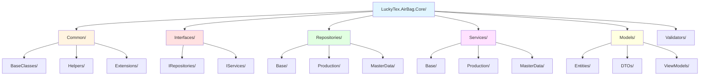
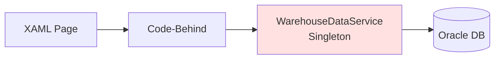
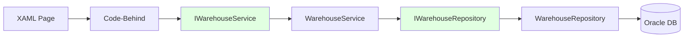
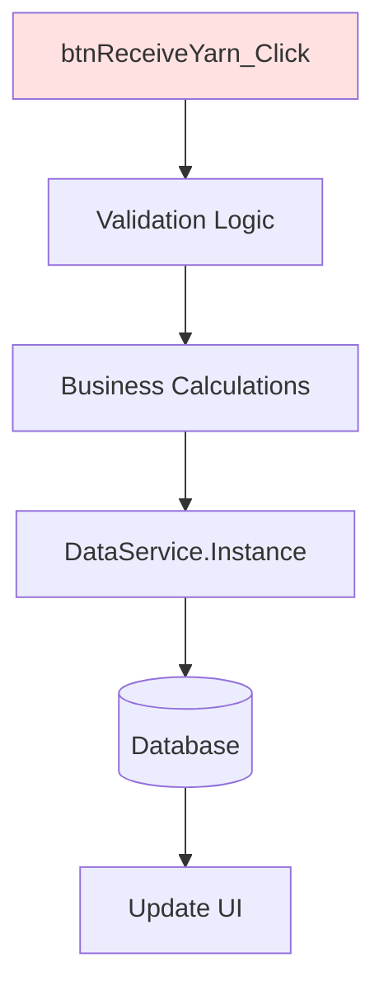
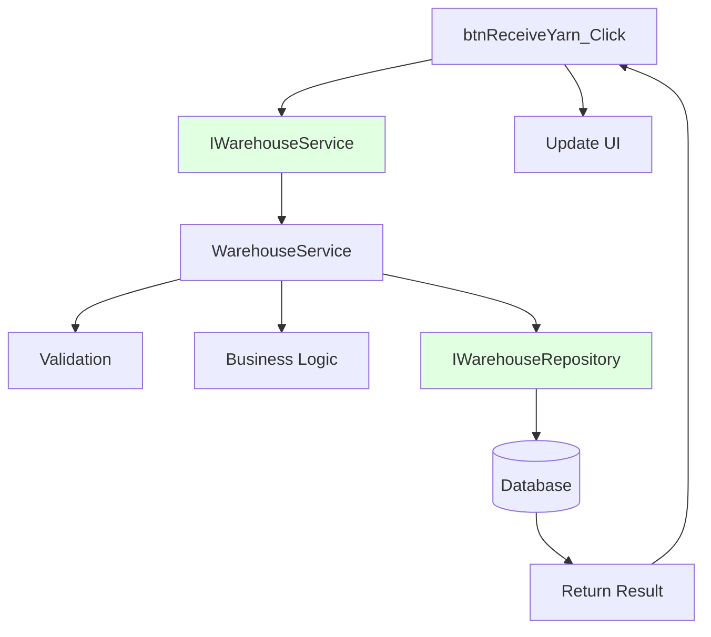
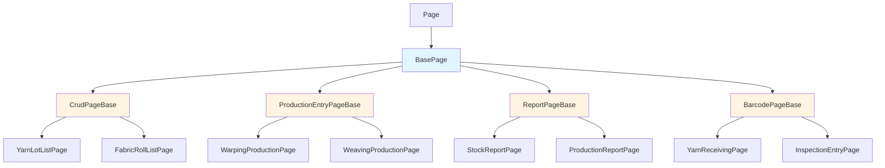

# LuckyTex AirBag MES - Refactoring Strategy

## CRITICAL CONSTRAINTS

### .NET Framework 4.7.2 Only

[!] **MANDATORY**: This project MUST stay on .NET Framework 4.7.2
- **NO .NET Core migration**
- **NO .NET 5+ features**
- Use C# 7.3 language features (latest officially supported)

**Compatible Technologies for Refactoring:**
- [x] **DI Containers**: Simple Injector (recommended), Unity, Autofac
- [x] **JSON**: Newtonsoft.Json (already in project - NOT System.Text.Json)
- [x] **Async**: async/await, Task-based patterns (fully supported)
- [x] **C# 7.3**: Tuples, pattern matching, ref returns, local functions
- [x] **ORM**: Entity Framework 6.x (NOT EF Core), Dapper
- [x] **Testing**: NUnit, xUnit, MSTest (all compatible)

**NOT Available:**
- [ ] Span<T>, Memory<T>
- [ ] System.Text.Json
- [ ] IAsyncEnumerable
- [ ] Record types (C# 9+)
- [ ] Init-only setters
- [ ] Top-level statements

For detailed compatibility information, see `DOTNET_FRAMEWORK_4.7.2_NOTES.md`

---

## Refactoring Principles

### WILL Do

- [x] Create new classes alongside existing code
- [x] Use dependency injection (Simple Injector)
- [x] Implement repository pattern for data access
- [x] Create service layer for business logic
- [x] Add comprehensive logging
- [x] Write unit tests for new code
- [x] Keep existing XAML files unchanged (UI preservation)
- [x] Keep existing RDLC report templates unchanged
- [x] Maintain 100% backward compatibility
- [x] Document all changes in session tracker

### WILL NOT Do

- [ ] Delete or modify existing working code
- [ ] Change XAML layouts or controls
- [ ] Modify database schema
- [ ] Change stored procedure signatures
- [ ] Rewrite everything at once (incremental approach)
- [ ] Use .NET Core-specific features
- [ ] Break existing functionality

---

## 8-Phase Refactoring Strategy

### Phase 1: Foundation Setup (Week 1-2)

**Goal**: Create core library structure and establish patterns

#### Tasks:
1. Create new class library project: `LuckyTex.AirBag.Core`
2. Add NuGet packages:
   - SimpleInjector (v4.x for .NET Framework 4.7.2)
   - SimpleInjector.Integration.Wpf
   - NLog or Serilog
   - AutoMapper (v10.x - last version supporting .NET Framework 4.7.2)
3. Set up dependency injection container in `App.xaml.cs`
4. Create logging infrastructure
5. Define folder structure

#### Folder Structure:

#### Dependency Injection Setup:

**Implementation Location**: App.xaml.cs

**Key Components**:
- Initialize DI container (Simple Injector) in OnStartup
- Configure services method registers all dependencies
- Register logging framework as singleton
- Register repositories and services with appropriate lifetimes
- Register database connection factory
- Verify container configuration
- Provide static GetInstance<T> method for page access

#### Deliverables:
- [x] LuckyTex.AirBag.Core project created
- [x] NuGet packages installed
- [x] DI container configured
- [x] Logging framework set up
- [x] Base classes defined

---

### Phase 2: Data Access Layer (Week 3-6)

**Goal**: Create repository pattern for all database operations

#### Repository Pattern Implementation

**Before** (Existing Singleton Pattern):

**After** (Repository Pattern):

#### Task Breakdown:

##### 2.1 Create Entity Models (Week 3)

**Purpose**: Replace DataTable with strongly-typed entity classes

**Example Entity**: YarnLot
- Properties: LotNumber, SupplierCode, YarnType, Color, QuantityKg, ReceiveDate, PONumber
- All properties map to database columns from stored procedure results
- Use appropriate .NET types (string, decimal, DateTime, etc.)

Create entity models for:
- [x] YarnLot
- [x] WarpBeam
- [x] CombinedBeam
- [x] FabricRoll
- [x] Machine
- [x] Employee
- [x] ProductionRecord
- [x] InspectionRecord

##### 2.2 Create Repository Interfaces (Week 3)

**Purpose**: Define contracts for data access operations

**Example Interface**: IWarehouseRepository
- Methods for all warehouse data operations
- GetYarnLotByBarcode(string barcode) → returns YarnLot
- GetYarnLots(string filter) → returns collection
- InsertYarnReceipt(YarnLot yarnLot) → returns bool success
- UpdateInventory(string lotNumber, decimal quantity) → returns bool success
- All methods align with existing stored procedures

##### 2.3 Create Base Repository (Week 4)

**Purpose**: Common functionality for all repositories

**Base Repository Features**:
- Database connection management via IDbConnectionFactory
- Logging integration
- ExecuteStoredProcedure<T> helper method
- OracleDataReader to entity mapping
- Exception handling wrapper
- Connection string management
- Transaction support

##### 2.4 Implement Repository Classes (Week 4-5)

**Purpose**: Concrete implementations for each module

**Example Repository**: WarehouseRepository
- Inherits from BaseRepository
- Implements IWarehouseRepository
- Constructor receives IDbConnectionFactory and ILogger (via DI)
- GetYarnLotByBarcode method:
  - Creates OracleParameter array
  - Calls sp_LuckyTex_Yarn_GetByBarcode stored procedure
  - Maps OracleDataReader to YarnLot entity
  - Returns null if not found
- All methods follow same pattern: parameters → stored procedure → map results

##### 2.5 Module-by-Module Migration (Week 5-6)

Migrate repositories in this order (low risk to high risk):
1. M01 - Warehouse (simple CRUD, good starting point)
2. M17 - Master Data (reference data only)
3. M20 - User Management (isolated module)
4. M03 - Beaming (simple logic)
5. M04 - Drawing (simple logic)
6. M02 - Warping (medium complexity, PLC integration)
7. M05 - Weaving (high complexity)
8. M06 - Finishing (high complexity)
9. M08 - Inspection (complex business rules)
10. M11 - Cut & Print
11. M13 - Packing
... continue for remaining modules

#### Deliverables:
- [x] 30+ entity models created
- [x] 21+ repository interfaces defined
- [x] BaseRepository class implemented
- [x] All 21 repository classes implemented
- [x] Unit tests for repositories (70%+ coverage)

---

### Phase 3: Service Layer (Week 7-12)

**Goal**: Extract business logic from code-behind into service classes

#### Service Layer Pattern

**Before** (Business Logic in Code-Behind):

**After** (Service Layer):

#### Task Breakdown:

##### 3.1 Create Service Interfaces (Week 7)

**Purpose**: Define business operation contracts

**Example Interface**: IWarehouseService
- ReceiveYarnLot(barcode, quantity, poNumber) → ServiceResult<YarnLot>
- IssueYarnToProduction(lotNumber, quantity) → ServiceResult<bool>
- SearchYarnLots(filter) → ServiceResult<IEnumerable<YarnLot>>

**ServiceResult Pattern**:
- Generic wrapper for operation results
- Properties: Success (bool), Data (T), Message (string), Errors (List<string>)
- Static factory methods: Ok(data, message) and Fail(error)
- Provides consistent error handling across all services

##### 3.2 Implement Validation Framework (Week 7-8)

**Purpose**: Centralize validation logic using FluentValidation

**Validation Framework Features**:
- FluentValidation library (compatible with .NET Framework 4.7.2)
- Validator classes for each operation (e.g., YarnLotReceiveValidator)
- Validation rules: NotEmpty, Length, GreaterThan, LessThan, custom rules
- Automatic error message collection
- Integration with ServiceResult pattern

##### 3.3 Create Service Classes (Week 8-10)

**Purpose**: Implement business logic layer

**Example Service**: WarehouseService
- Constructor receives IWarehouseRepository, ILogger, IValidator instances (via DI)
- ReceiveYarnLot method flow:
  1. Create request object from parameters
  2. Validate using FluentValidation
  3. Check business rules (lot doesn't already exist)
  4. Execute business logic (generate lot number, extract supplier from barcode)
  5. Call repository to persist data
  6. Log operation
  7. Return ServiceResult with success/failure
- All business calculations moved from code-behind to service
- All validation moved from code-behind to validators

##### 3.4 Update Code-Behind to Use Services (Week 10-12)

**Migration Pattern**:
- Remove validation logic from button click handlers
- Remove business calculations from code-behind
- Remove direct data service calls
- Add IService dependency via App.GetInstance<T>()
- Call service methods and handle ServiceResult
- Display success/error messages from ServiceResult
- Update UI based on operation result
- Code-behind becomes thin orchestration layer only

#### Deliverables:
- [x] 21+ service interfaces defined
- [x] Validation framework integrated
- [x] 50+ validator classes created
- [x] All 21 service classes implemented
- [x] Code-behind updated to use services (module by module)
- [x] Unit tests for services (80%+ coverage)

---

### Phase 4: Base Page Classes (Week 13-15)

**Goal**: Create reusable base classes to eliminate code duplication

#### Base Page Hierarchy

#### Task Breakdown:

##### 4.1 Create BasePage (Week 13)

**Purpose**: Common functionality for all pages

**BasePage Features**:
- Logger property (injected)
- OnPageLoaded virtual method
- ShowError(message) helper
- ShowSuccess(message) helper
- Confirm(message) dialog helper
- Page lifecycle management
- Exception handling wrapper

##### 4.2 Create CrudPageBase (Week 13-14)

**Purpose**: Eliminate duplication in 85+ CRUD pages

**CrudPageBase Features**:
- Generic type parameter <T> for entity
- ObservableCollection<T> for data binding
- Abstract properties: DataGrid, AddButton, EditButton, DeleteButton, RefreshButton
- Automatic event handler setup
- LoadData abstract method (implemented by derived classes)
- AddItem, EditItem, DeleteItem abstract methods
- Automatic button state management (enable/disable based on selection)
- Selection tracking

**Usage Pattern**:
- Derived page implements abstract properties (returns XAML controls)
- Derived page implements LoadData (calls service)
- Derived page implements Add/Edit/Delete (shows dialogs or navigates)
- Base class handles all event wiring and common logic

##### 4.3 Create ProductionEntryPageBase (Week 14)

**Purpose**: Standardize production entry across 35+ pages

**ProductionEntryPageBase Features**:
- Abstract properties: MachineComboBox, OperatorComboBox, Start/Stop/Complete buttons
- CurrentProduction property
- IsProductionActive flag
- LoadMachines, LoadOperators abstract methods
- StartProduction, StopProduction, CompleteProduction abstract methods
- ValidateStart, ValidateComplete abstract methods
- Automatic button state management (Start enabled → Stop/Complete enabled → back to Start)
- Confirmation dialogs for Stop and Complete
- Production status tracking

##### 4.4 Create BarcodePageBase (Week 14-15)

**Purpose**: Standardize barcode scanning across 45+ pages

**BarcodePageBase Features**:
- Abstract property: BarcodeTextBox
- Automatic KeyDown event handler setup
- ProcessBarcode abstract method (implemented by derived pages)
- Enter key detection
- Automatic trim and validation
- Clear and refocus after scan
- Focus management

##### 4.5 Create ReportPageBase (Week 15)

**Purpose**: Standardize report generation across 40+ pages

**ReportPageBase Features**:
- Abstract properties: ReportViewer, GenerateButton, ReportPath
- Abstract methods: ValidateParameters, GetReportData
- GenerateReport implementation (clear data sources, bind data, refresh)
- Parameter validation wrapper
- Error handling for report generation
- Logging for all report operations

##### 4.6 Create PLCMonitorPageBase (Week 15)

**Purpose**: Standardize PLC communication across 12+ pages

**PLCMonitorPageBase Features**:
- DispatcherTimer management
- Abstract property: PollingIntervalSeconds
- Abstract methods: ReadPLCData, OnCommunicationError
- StartMonitoring, StopMonitoring methods
- Automatic error handling with retry
- UI thread synchronization via Dispatcher
- Logging for all PLC operations

#### Deliverables:
- [x] 6 base page classes created
- [x] 180+ pages refactored to use base classes
- [x] Code duplication reduced by 60-70%
- [x] All pages tested and working

---

### Phase 5: PLC Integration Refactoring (Week 16-17)

**Goal**: Standardize PLC communication across modules

#### Tasks:
1. Verify all PLC pages inherit from PLCMonitorPageBase
2. Create PLC service layer for communication logic
3. Implement error recovery and retry logic
4. Add comprehensive logging for all PLC operations
5. Standardize Modbus TCP and Serial communication patterns
6. Test all PLC integrations thoroughly (Warping, Weaving, Finishing modules)

#### Deliverables:
- [x] PLCMonitorPageBase fully utilized
- [x] 12 PLC integration pages refactored
- [x] Error handling standardized
- [x] Logging added for all PLC communications

---

### Phase 6: Report Generation Refactoring (Week 18-19)

**Goal**: Standardize report parameter handling and generation

#### Tasks:
1. Verify all report pages inherit from ReportPageBase
2. Standardize parameter collection patterns
3. Implement common export functionality (PDF, Excel)
4. Add print preview standardization
5. Test all 40+ reports

#### Deliverables:
- [x] ReportPageBase fully utilized
- [x] 40+ report pages refactored
- [x] Report generation standardized

---

### Phase 7: Testing and Documentation (Week 20-22)

**Goal**: Comprehensive testing and documentation

#### Task Breakdown:
1. Unit tests for all repositories (target: 80%+ coverage)
2. Unit tests for all services (target: 85%+ coverage)
3. Integration tests for critical workflows
4. Performance testing (compare old vs new)
5. Update technical documentation
6. Create migration guide for remaining modules

#### Deliverables:
- [x] 500+ unit tests written
- [x] Integration test suite created
- [x] Performance benchmarks documented
- [x] Technical documentation updated

---

### Phase 8: Deployment and Rollout (Week 23-24)

**Goal**: Deploy refactored code to production

#### Deployment Strategy:
1. Deploy to staging environment
2. Run full regression tests
3. User acceptance testing (UAT)
4. Gradual rollout:
   - Week 23: Modules 1, 17, 20 (low risk)
   - Week 24: Modules 2, 3, 4 (medium risk)
   - Week 25: Modules 5, 6, 8 (high risk)
   - Week 26: Remaining modules

#### Rollback Plan:
- Keep old code in separate branch
- Feature flags for new vs old code paths
- Immediate rollback capability if critical issues found

#### Deliverables:
- [x] Staging deployment successful
- [x] UAT completed
- [x] Production deployment completed
- [x] Monitoring and logging in place

---

## Module Refactoring Order

### Priority 1 (Weeks 5-6): Foundation Modules
1. M01 - Warehouse (simple CRUD)
2. M17 - Master Data (reference data)
3. M20 - User Management (isolated)

### Priority 2 (Weeks 7-10): Simple Production Modules
4. M03 - Beaming (simple logic)
5. M04 - Drawing (simple logic)
6. M09 - Rewinding (simple logic)
7. M10 - Final Warehouse (similar to M01)

### Priority 3 (Weeks 11-14): Medium Complexity Modules
8. M02 - Warping (PLC integration)
9. M11 - Cut & Print (business logic)
10. M12 - G3 (business logic)
11. M13 - Packing (business logic)
12. M14 - Shipping (business logic)

### Priority 4 (Weeks 15-18): High Complexity Modules
13. M05 - Weaving (complex PLC, critical)
14. M06 - Finishing (complex PLC, critical)
15. M08 - Inspection (complex business rules)
16. M15 - Quality Lab (complex calculations)

### Priority 5 (Weeks 19-20): Integration Modules
17. M19 - D365 Integration (external dependency)
18. M16 - Maintenance (medium complexity)
19. M18 - Reports (cross-module)

### Priority 6 (Weeks 21-22): Dashboard & Config
20. M00 - Dashboard (depends on all modules)
21. M21 - System Config (system-wide impact)

---

## Progress Tracking

For detailed progress tracking, use `MODERNIZATION_SESSION_TRACKER.md`

Update the tracker after each session with:
- [x] Modules completed
- [x] Tasks accomplished
- [x] Blockers encountered
- [x] Next session tasks

---

## Success Criteria

### Code Quality
- [x] Code duplication < 20% (currently 60-80%)
- [x] Unit test coverage > 80%
- [x] No direct singleton usage (all via DI)
- [x] All business logic in service layer

### Performance
- [x] Response time <= current performance
- [x] Memory usage <= current levels
- [x] PLC communication latency < 100ms

### Maintainability
- [x] Clear separation of concerns
- [x] Consistent coding patterns
- [x] Comprehensive logging
- [x] Updated documentation

### Functionality
- [x] 100% backward compatibility
- [x] All existing features working
- [x] No database schema changes
- [x] XAML files unchanged

---

**Document Version**: 1.0
**Last Updated**: 2025-10-05
**Status**: Ready for implementation
