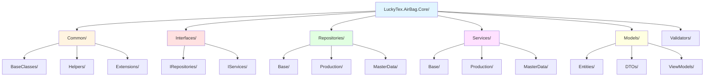
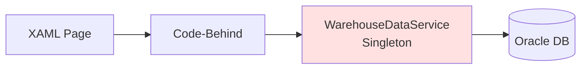
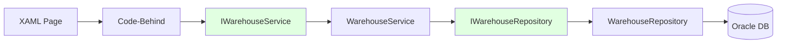
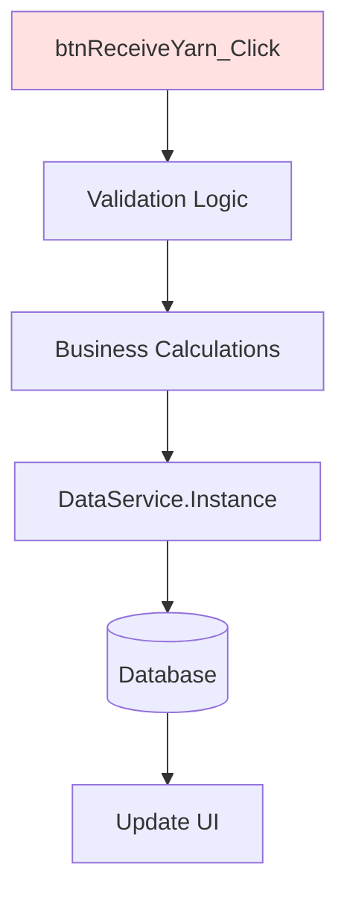
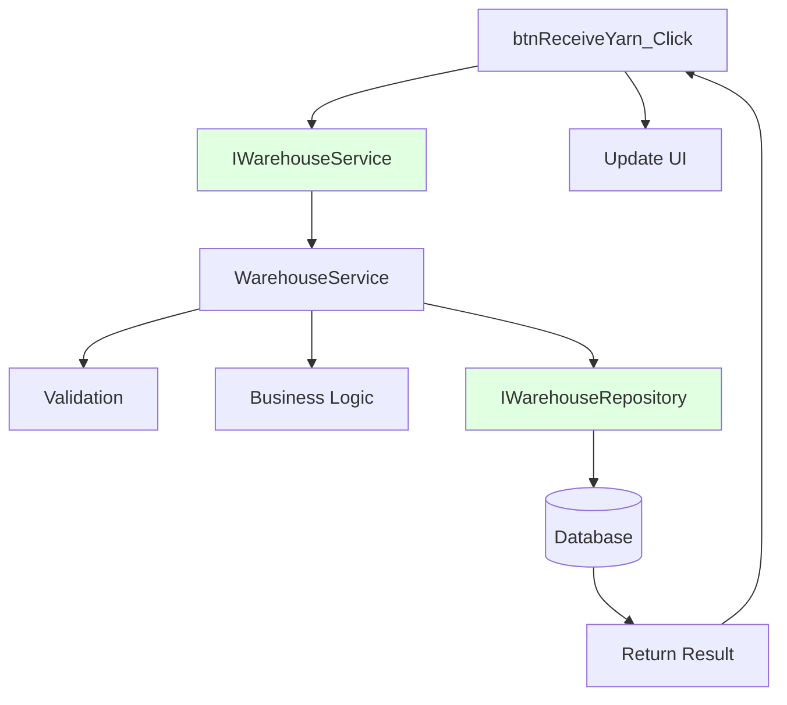
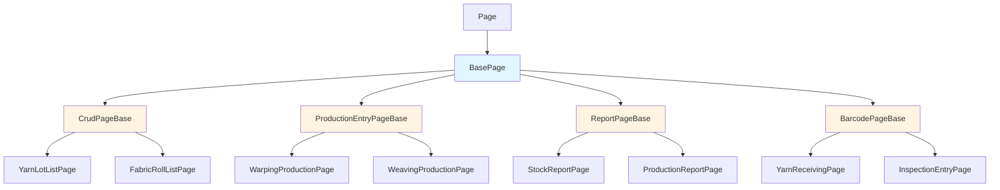

# LuckyTex AirBag MES - Refactoring Strategy

## CRITICAL CONSTRAINTS

### .NET Framework 4.7.2 Only

[!] **MANDATORY**: This project MUST stay on .NET Framework 4.7.2
- **NO .NET Core migration**
- **NO .NET 5+ features**
- Use C# 7.3 language features (latest officially supported)

**Compatible Technologies for Refactoring:**
- [x] **DI Containers**: Simple Injector (recommended), Unity, Autofac
- [x] **JSON**: Newtonsoft.Json (already in project - NOT System.Text.Json)
- [x] **Async**: async/await, Task-based patterns (fully supported)
- [x] **C# 7.3**: Tuples, pattern matching, ref returns, local functions
- [x] **ORM**: Entity Framework 6.x (NOT EF Core), Dapper
- [x] **Testing**: NUnit, xUnit, MSTest (all compatible)

**NOT Available:**
- [ ] Span<T>, Memory<T>
- [ ] System.Text.Json
- [ ] IAsyncEnumerable
- [ ] Record types (C# 9+)
- [ ] Init-only setters
- [ ] Top-level statements

For detailed compatibility information, see `DOTNET_FRAMEWORK_4.7.2_NOTES.md`

---

## Refactoring Principles

### WILL Do

- [x] Create new classes alongside existing code
- [x] Use dependency injection (Simple Injector)
- [x] Implement repository pattern for data access
- [x] Create service layer for business logic
- [x] Add comprehensive logging
- [x] Write unit tests for new code
- [x] Keep existing XAML files unchanged (UI preservation)
- [x] Keep existing RDLC report templates unchanged
- [x] Maintain 100% backward compatibility
- [x] Document all changes in session tracker

### WILL NOT Do

- [ ] Delete or modify existing working code
- [ ] Change XAML layouts or controls
- [ ] Modify database schema
- [ ] Change stored procedure signatures
- [ ] Rewrite everything at once (incremental approach)
- [ ] Use .NET Core-specific features
- [ ] Break existing functionality

---

## 8-Phase Refactoring Strategy

### Phase 1: Foundation Setup (Week 1-2)

**Goal**: Create core library structure and establish patterns

#### Tasks:
1. Create new class library project: `LuckyTex.AirBag.Core`
2. Add NuGet packages:
   - SimpleInjector (v4.x for .NET Framework 4.7.2)
   - SimpleInjector.Integration.Wpf
   - NLog or Serilog
   - AutoMapper (v10.x - last version supporting .NET Framework 4.7.2)
3. Set up dependency injection container in `App.xaml.cs`
4. Create logging infrastructure
5. Define folder structure

#### Folder Structure:



#### Dependency Injection Setup:

```csharp
// App.xaml.cs
using SimpleInjector;

public partial class App : Application
{
    private static Container _container;

    protected override void OnStartup(StartupEventArgs e)
    {
        base.OnStartup(e);

        // Initialize DI container
        _container = new Container();

        // Register services
        ConfigureServices();

        // Verify configuration
        _container.Verify();
    }

    private void ConfigureServices()
    {
        // Logging
        _container.RegisterSingleton<ILoggerFactory, NLogFactory>();

        // Repositories (per request)
        _container.Register<IWarehouseRepository, WarehouseRepository>();
        _container.Register<IWarpingRepository, WarpingRepository>();
        // ... register all repositories

        // Services (per request)
        _container.Register<IWarehouseService, WarehouseService>();
        _container.Register<IWarpingService, WarpingService>();
        // ... register all services

        // Database connection factory
        _container.RegisterSingleton<IDbConnectionFactory, OracleConnectionFactory>();
    }

    public static T GetInstance<T>() where T : class
    {
        return _container.GetInstance<T>();
    }
}
```

#### Deliverables:
- [x] LuckyTex.AirBag.Core project created
- [x] NuGet packages installed
- [x] DI container configured
- [x] Logging framework set up
- [x] Base classes defined

---

### Phase 2: Data Access Layer (Week 3-6)

**Goal**: Create repository pattern for all database operations

#### Repository Pattern Implementation

**Before** (Existing Singleton Pattern):


**After** (Repository Pattern):


#### Task Breakdown:

##### 2.1 Create Entity Models (Week 3)
```csharp
// Models/Entities/YarnLot.cs
public class YarnLot
{
    public string LotNumber { get; set; }
    public string SupplierCode { get; set; }
    public string YarnType { get; set; }
    public string Color { get; set; }
    public decimal QuantityKg { get; set; }
    public DateTime ReceiveDate { get; set; }
    public string PONumber { get; set; }
    // ... other properties
}
```

Create entity models for:
- [x] YarnLot
- [x] WarpBeam
- [x] CombinedBeam
- [x] FabricRoll
- [x] Machine
- [x] Employee
- [x] ProductionRecord
- [x] InspectionRecord

##### 2.2 Create Repository Interfaces (Week 3)
```csharp
// Interfaces/IRepositories/IWarehouseRepository.cs
public interface IWarehouseRepository
{
    YarnLot GetYarnLotByBarcode(string barcode);
    IEnumerable<YarnLot> GetYarnLots(string filter);
    bool InsertYarnReceipt(YarnLot yarnLot);
    bool UpdateInventory(string lotNumber, decimal quantity);
    // ... other methods
}
```

##### 2.3 Create Base Repository (Week 4)
```csharp
// Repositories/Base/BaseRepository.cs
public abstract class BaseRepository
{
    protected readonly IDbConnectionFactory _connectionFactory;
    protected readonly ILogger _logger;

    protected BaseRepository(IDbConnectionFactory connectionFactory, ILogger logger)
    {
        _connectionFactory = connectionFactory;
        _logger = logger;
    }

    protected T ExecuteStoredProcedure<T>(
        string procedureName,
        Func<OracleDataReader, T> mapFunction,
        params OracleParameter[] parameters)
    {
        using (var connection = _connectionFactory.CreateConnection())
        {
            using (var command = connection.CreateCommand())
            {
                command.CommandType = CommandType.StoredProcedure;
                command.CommandText = procedureName;
                command.Parameters.AddRange(parameters);

                connection.Open();
                _logger.LogDebug($"Executing {procedureName}");

                using (var reader = command.ExecuteReader())
                {
                    return mapFunction(reader);
                }
            }
        }
    }

    // ... other helper methods
}
```

##### 2.4 Implement Repository Classes (Week 4-5)
```csharp
// Repositories/Production/WarehouseRepository.cs
public class WarehouseRepository : BaseRepository, IWarehouseRepository
{
    public WarehouseRepository(IDbConnectionFactory connectionFactory, ILogger logger)
        : base(connectionFactory, logger)
    {
    }

    public YarnLot GetYarnLotByBarcode(string barcode)
    {
        var parameters = new[]
        {
            new OracleParameter("p_barcode", OracleDbType.Varchar2) { Value = barcode },
            new OracleParameter("p_cursor", OracleDbType.RefCursor) { Direction = ParameterDirection.Output }
        };

        return ExecuteStoredProcedure(
            "sp_LuckyTex_Yarn_GetByBarcode",
            reader =>
            {
                if (reader.Read())
                {
                    return MapYarnLot(reader);
                }
                return null;
            },
            parameters);
    }

    private YarnLot MapYarnLot(OracleDataReader reader)
    {
        return new YarnLot
        {
            LotNumber = reader["LOT_NUMBER"].ToString(),
            SupplierCode = reader["SUPPLIER_CODE"].ToString(),
            YarnType = reader["YARN_TYPE"].ToString(),
            Color = reader["COLOR"].ToString(),
            QuantityKg = Convert.ToDecimal(reader["QUANTITY_KG"]),
            ReceiveDate = Convert.ToDateTime(reader["RECEIVE_DATE"]),
            PONumber = reader["PO_NUMBER"].ToString()
        };
    }

    // Implement other methods...
}
```

##### 2.5 Module-by-Module Migration (Week 5-6)

Migrate repositories in this order (low risk to high risk):
1. M01 - Warehouse (simple CRUD, good starting point)
2. M17 - Master Data (reference data only)
3. M20 - User Management (isolated module)
4. M03 - Beaming (simple logic)
5. M04 - Drawing (simple logic)
6. M02 - Warping (medium complexity, PLC integration)
7. M05 - Weaving (high complexity)
8. M06 - Finishing (high complexity)
9. M08 - Inspection (complex business rules)
10. M11 - Cut & Print
11. M13 - Packing
... continue for remaining modules

#### Deliverables:
- [x] 30+ entity models created
- [x] 21+ repository interfaces defined
- [x] BaseRepository class implemented
- [x] All 21 repository classes implemented
- [x] Unit tests for repositories (70%+ coverage)

---

### Phase 3: Service Layer (Week 7-12)

**Goal**: Extract business logic from code-behind into service classes

#### Service Layer Pattern

**Before** (Business Logic in Code-Behind):


**After** (Service Layer):


#### Task Breakdown:

##### 3.1 Create Service Interfaces (Week 7)
```csharp
// Interfaces/IServices/IWarehouseService.cs
public interface IWarehouseService
{
    ServiceResult<YarnLot> ReceiveYarnLot(string barcode, decimal quantity, string poNumber);
    ServiceResult<bool> IssueYarnToProduction(string lotNumber, decimal quantity);
    ServiceResult<IEnumerable<YarnLot>> SearchYarnLots(string filter);
    // ... other methods
}

// Common/ServiceResult.cs
public class ServiceResult<T>
{
    public bool Success { get; set; }
    public T Data { get; set; }
    public string Message { get; set; }
    public List<string> Errors { get; set; }

    public static ServiceResult<T> Ok(T data, string message = "")
    {
        return new ServiceResult<T>
        {
            Success = true,
            Data = data,
            Message = message,
            Errors = new List<string>()
        };
    }

    public static ServiceResult<T> Fail(string error)
    {
        return new ServiceResult<T>
        {
            Success = false,
            Data = default(T),
            Message = error,
            Errors = new List<string> { error }
        };
    }
}
```

##### 3.2 Implement Validation Framework (Week 7-8)
```csharp
// Using FluentValidation (compatible with .NET Framework 4.7.2)

// Validators/YarnLotReceiveValidator.cs
public class YarnLotReceiveValidator : AbstractValidator<YarnLotReceiveRequest>
{
    public YarnLotReceiveValidator()
    {
        RuleFor(x => x.Barcode)
            .NotEmpty().WithMessage("Barcode is required")
            .Length(8, 20).WithMessage("Barcode must be 8-20 characters");

        RuleFor(x => x.Quantity)
            .GreaterThan(0).WithMessage("Quantity must be greater than 0")
            .LessThan(10000).WithMessage("Quantity too large - please verify");

        RuleFor(x => x.PONumber)
            .NotEmpty().WithMessage("PO Number is required");
    }
}
```

##### 3.3 Create Service Classes (Week 8-10)
```csharp
// Services/Production/WarehouseService.cs
public class WarehouseService : IWarehouseService
{
    private readonly IWarehouseRepository _repository;
    private readonly ILogger _logger;
    private readonly IValidator<YarnLotReceiveRequest> _receiveValidator;

    public WarehouseService(
        IWarehouseRepository repository,
        ILogger logger,
        IValidator<YarnLotReceiveRequest> receiveValidator)
    {
        _repository = repository;
        _logger = logger;
        _receiveValidator = receiveValidator;
    }

    public ServiceResult<YarnLot> ReceiveYarnLot(string barcode, decimal quantity, string poNumber)
    {
        try
        {
            // Validate input
            var request = new YarnLotReceiveRequest
            {
                Barcode = barcode,
                Quantity = quantity,
                PONumber = poNumber
            };

            var validationResult = _receiveValidator.Validate(request);
            if (!validationResult.IsValid)
            {
                return ServiceResult<YarnLot>.Fail(
                    string.Join(", ", validationResult.Errors.Select(e => e.ErrorMessage)));
            }

            // Check if yarn lot exists
            var existingLot = _repository.GetYarnLotByBarcode(barcode);
            if (existingLot != null)
            {
                return ServiceResult<YarnLot>.Fail("Yarn lot already received");
            }

            // Business logic: Create yarn lot
            var yarnLot = new YarnLot
            {
                LotNumber = GenerateLotNumber(),
                SupplierCode = ExtractSupplierFromBarcode(barcode),
                QuantityKg = quantity,
                ReceiveDate = DateTime.Now,
                PONumber = poNumber,
                // ... other properties
            };

            // Insert to database
            var success = _repository.InsertYarnReceipt(yarnLot);
            if (!success)
            {
                return ServiceResult<YarnLot>.Fail("Failed to save yarn receipt");
            }

            _logger.LogInfo($"Yarn lot {yarnLot.LotNumber} received successfully");

            return ServiceResult<YarnLot>.Ok(yarnLot, "Yarn received successfully");
        }
        catch (Exception ex)
        {
            _logger.LogError($"Error receiving yarn lot: {ex.Message}", ex);
            return ServiceResult<YarnLot>.Fail($"Error: {ex.Message}");
        }
    }

    private string GenerateLotNumber()
    {
        // Business logic for lot number generation
        return $"YL-{DateTime.Now:yyyyMMdd}-{GetNextSequence():D4}";
    }

    // ... other methods
}
```

##### 3.4 Update Code-Behind to Use Services (Week 10-12)
```csharp
// Before:
private void btnReceive_Click(object sender, RoutedEventArgs e)
{
    // Validation
    if (string.IsNullOrEmpty(txtBarcode.Text))
    {
        MessageBox.Show("Please enter barcode");
        return;
    }

    // Business logic
    string lotNumber = "YL-" + DateTime.Now.ToString("yyyyMMdd") + "-" + GetNextSeq();

    // Database call
    bool success = WarehouseDataService.Instance.InsertYarnReceipt(...);

    if (success)
    {
        MessageBox.Show("Success");
        LoadData();
    }
}

// After:
private readonly IWarehouseService _warehouseService;

public YarnReceivingPage()
{
    InitializeComponent();
    _warehouseService = App.GetInstance<IWarehouseService>();
}

private void btnReceive_Click(object sender, RoutedEventArgs e)
{
    var result = _warehouseService.ReceiveYarnLot(
        txtBarcode.Text.Trim(),
        decimal.Parse(txtQuantity.Text),
        txtPONumber.Text.Trim()
    );

    if (result.Success)
    {
        MessageBox.Show(result.Message);
        LoadData();
    }
    else
    {
        MessageBox.Show(result.Message, "Error", MessageBoxButton.OK, MessageBoxImage.Error);
    }
}
```

#### Deliverables:
- [x] 21+ service interfaces defined
- [x] Validation framework integrated
- [x] 50+ validator classes created
- [x] All 21 service classes implemented
- [x] Code-behind updated to use services (module by module)
- [x] Unit tests for services (80%+ coverage)

---

### Phase 4: Base Page Classes (Week 13-15)

**Goal**: Create reusable base classes to eliminate code duplication

#### Base Page Hierarchy



#### Task Breakdown:

##### 4.1 Create BasePage (Week 13)
```csharp
// Common/BaseClasses/BasePage.cs
public abstract class BasePage : Page
{
    protected readonly ILogger Logger;

    protected BasePage()
    {
        Logger = App.GetInstance<ILogger>();
        Loaded += BasePage_Loaded;
    }

    private void BasePage_Loaded(object sender, RoutedEventArgs e)
    {
        OnPageLoaded();
    }

    protected virtual void OnPageLoaded()
    {
        // Override in derived classes
    }

    protected void ShowError(string message)
    {
        MessageBox.Show(message, "Error", MessageBoxButton.OK, MessageBoxImage.Error);
        Logger.LogError(message);
    }

    protected void ShowSuccess(string message)
    {
        MessageBox.Show(message, "Success", MessageBoxButton.OK, MessageBoxImage.Information);
        Logger.LogInfo(message);
    }

    protected bool Confirm(string message)
    {
        return MessageBox.Show(message, "Confirm", MessageBoxButton.YesNo, MessageBoxImage.Question)
            == MessageBoxResult.Yes;
    }
}
```

##### 4.2 Create CrudPageBase (Week 13-14)
```csharp
// Common/BaseClasses/CrudPageBase.cs
public abstract class CrudPageBase<T> : BasePage where T : class, new()
{
    protected ObservableCollection<T> Items { get; set; }
    protected T SelectedItem { get; set; }

    protected abstract DataGrid DataGrid { get; }
    protected abstract Button AddButton { get; }
    protected abstract Button EditButton { get; }
    protected abstract Button DeleteButton { get; }
    protected abstract Button RefreshButton { get; }

    protected CrudPageBase()
    {
        Items = new ObservableCollection<T>();
    }

    protected override void OnPageLoaded()
    {
        base.OnPageLoaded();
        SetupEventHandlers();
        LoadData();
    }

    private void SetupEventHandlers()
    {
        AddButton.Click += Add_Click;
        EditButton.Click += Edit_Click;
        DeleteButton.Click += Delete_Click;
        RefreshButton.Click += Refresh_Click;
        DataGrid.SelectionChanged += DataGrid_SelectionChanged;
    }

    protected abstract void LoadData();
    protected abstract void AddItem();
    protected abstract void EditItem(T item);
    protected abstract void DeleteItem(T item);

    private void Add_Click(object sender, RoutedEventArgs e)
    {
        AddItem();
    }

    private void Edit_Click(object sender, RoutedEventArgs e)
    {
        if (SelectedItem != null)
        {
            EditItem(SelectedItem);
        }
        else
        {
            ShowError("Please select an item to edit");
        }
    }

    private void Delete_Click(object sender, RoutedEventArgs e)
    {
        if (SelectedItem != null)
        {
            if (Confirm("Are you sure you want to delete this item?"))
            {
                DeleteItem(SelectedItem);
            }
        }
        else
        {
            ShowError("Please select an item to delete");
        }
    }

    private void Refresh_Click(object sender, RoutedEventArgs e)
    {
        LoadData();
    }

    private void DataGrid_SelectionChanged(object sender, SelectionChangedEventArgs e)
    {
        SelectedItem = DataGrid.SelectedItem as T;
        EditButton.IsEnabled = SelectedItem != null;
        DeleteButton.IsEnabled = SelectedItem != null;
    }
}
```

##### 4.3 Create ProductionEntryPageBase (Week 14)
```csharp
// Common/BaseClasses/ProductionEntryPageBase.cs
public abstract class ProductionEntryPageBase<T> : BasePage where T : class, new()
{
    protected abstract ComboBox MachineComboBox { get; }
    protected abstract ComboBox OperatorComboBox { get; }
    protected abstract Button StartButton { get; }
    protected abstract Button StopButton { get; }
    protected abstract Button CompleteButton { get; }

    protected T CurrentProduction { get; set; }
    protected bool IsProductionActive { get; set; }

    protected override void OnPageLoaded()
    {
        base.OnPageLoaded();
        LoadMachines();
        LoadOperators();
        SetupEventHandlers();
        SetInitialState();
    }

    protected abstract void LoadMachines();
    protected abstract void LoadOperators();
    protected abstract void StartProduction();
    protected abstract void StopProduction();
    protected abstract void CompleteProduction();

    private void SetupEventHandlers()
    {
        StartButton.Click += Start_Click;
        StopButton.Click += Stop_Click;
        CompleteButton.Click += Complete_Click;
    }

    private void SetInitialState()
    {
        StartButton.IsEnabled = true;
        StopButton.IsEnabled = false;
        CompleteButton.IsEnabled = false;
        IsProductionActive = false;
    }

    private void Start_Click(object sender, RoutedEventArgs e)
    {
        if (ValidateStart())
        {
            StartProduction();
            StartButton.IsEnabled = false;
            StopButton.IsEnabled = true;
            CompleteButton.IsEnabled = true;
            IsProductionActive = true;
        }
    }

    private void Stop_Click(object sender, RoutedEventArgs e)
    {
        if (Confirm("Stop production?"))
        {
            StopProduction();
            StartButton.IsEnabled = true;
            StopButton.IsEnabled = false;
            CompleteButton.IsEnabled = false;
            IsProductionActive = false;
        }
    }

    private void Complete_Click(object sender, RoutedEventArgs e)
    {
        if (ValidateComplete())
        {
            if (Confirm("Complete production?"))
            {
                CompleteProduction();
                SetInitialState();
            }
        }
    }

    protected abstract bool ValidateStart();
    protected abstract bool ValidateComplete();
}
```

##### 4.4 Create BarcodePageBase (Week 14-15)
```csharp
// Common/BaseClasses/BarcodePageBase.cs
public abstract class BarcodePageBase : BasePage
{
    protected abstract TextBox BarcodeTextBox { get; }

    protected override void OnPageLoaded()
    {
        base.OnPageLoaded();
        BarcodeTextBox.KeyDown += BarcodeTextBox_KeyDown;
        FocusBarcodeTextBox();
    }

    private void BarcodeTextBox_KeyDown(object sender, KeyEventArgs e)
    {
        if (e.Key == Key.Enter)
        {
            string barcode = BarcodeTextBox.Text.Trim();
            if (!string.IsNullOrEmpty(barcode))
            {
                ProcessBarcode(barcode);
                BarcodeTextBox.Clear();
                FocusBarcodeTextBox();
            }
        }
    }

    protected abstract void ProcessBarcode(string barcode);

    protected void FocusBarcodeTextBox()
    {
        Dispatcher.BeginInvoke(new Action(() =>
        {
            BarcodeTextBox.Focus();
        }), DispatcherPriority.Input);
    }
}
```

##### 4.5 Update Existing Pages to Use Base Classes (Week 15)
```csharp
// Example: YarnLotListPage.xaml.cs
public partial class YarnLotListPage : CrudPageBase<YarnLot>
{
    private readonly IWarehouseService _warehouseService;

    protected override DataGrid DataGrid => dgYarnLots;
    protected override Button AddButton => btnAdd;
    protected override Button EditButton => btnEdit;
    protected override Button DeleteButton => btnDelete;
    protected override Button RefreshButton => btnRefresh;

    public YarnLotListPage()
    {
        InitializeComponent();
        _warehouseService = App.GetInstance<IWarehouseService>();
        dgYarnLots.ItemsSource = Items;
    }

    protected override void LoadData()
    {
        var result = _warehouseService.SearchYarnLots(txtSearch.Text);
        if (result.Success)
        {
            Items.Clear();
            foreach (var item in result.Data)
            {
                Items.Add(item);
            }
        }
        else
        {
            ShowError(result.Message);
        }
    }

    protected override void AddItem()
    {
        // Show add dialog or navigate to add page
    }

    protected override void EditItem(YarnLot item)
    {
        // Show edit dialog or navigate to edit page
    }

    protected override void DeleteItem(YarnLot item)
    {
        // Delete implementation
    }
}
```

#### Deliverables:
- [x] 5 base page classes created
- [x] 85+ pages refactored to use base classes
- [x] Code duplication reduced by 60-70%
- [x] All pages tested and working

---

### Phase 5: PLC Integration Refactoring (Week 16-17)

**Goal**: Standardize PLC communication across modules

#### Create PLCMonitorPageBase
```csharp
// Common/BaseClasses/PLCMonitorPageBase.cs
public abstract class PLCMonitorPageBase : BasePage
{
    protected DispatcherTimer Timer { get; set; }
    protected abstract int PollingIntervalSeconds { get; }

    protected override void OnPageLoaded()
    {
        base.OnPageLoaded();
        InitializeTimer();
        StartMonitoring();
    }

    private void InitializeTimer()
    {
        Timer = new DispatcherTimer();
        Timer.Interval = TimeSpan.FromSeconds(PollingIntervalSeconds);
        Timer.Tick += Timer_Tick;
    }

    private void Timer_Tick(object sender, EventArgs e)
    {
        try
        {
            ReadPLCData();
        }
        catch (Exception ex)
        {
            Logger.LogError($"PLC communication error: {ex.Message}", ex);
            OnCommunicationError(ex);
        }
    }

    protected abstract void ReadPLCData();
    protected abstract void OnCommunicationError(Exception ex);

    protected void StartMonitoring()
    {
        Timer.Start();
        Logger.LogInfo("PLC monitoring started");
    }

    protected void StopMonitoring()
    {
        Timer.Stop();
        Logger.LogInfo("PLC monitoring stopped");
    }
}
```

#### Deliverables:
- [x] PLCMonitorPageBase class created
- [x] 12 PLC integration pages refactored
- [x] Error handling standardized
- [x] Logging added for all PLC communications

---

### Phase 6: Report Generation Refactoring (Week 18-19)

**Goal**: Standardize report parameter handling and generation

#### Create ReportPageBase
```csharp
// Common/BaseClasses/ReportPageBase.cs
public abstract class ReportPageBase : BasePage
{
    protected abstract ReportViewer ReportViewer { get; }
    protected abstract Button GenerateButton { get; }
    protected abstract string ReportPath { get; }

    protected override void OnPageLoaded()
    {
        base.OnPageLoaded();
        GenerateButton.Click += Generate_Click;
    }

    private void Generate_Click(object sender, RoutedEventArgs e)
    {
        if (ValidateParameters())
        {
            GenerateReport();
        }
    }

    protected abstract bool ValidateParameters();
    protected abstract object GetReportData();

    protected void GenerateReport()
    {
        try
        {
            var data = GetReportData();

            ReportViewer.LocalReport.ReportPath = ReportPath;
            ReportViewer.LocalReport.DataSources.Clear();
            ReportViewer.LocalReport.DataSources.Add(
                new ReportDataSource("DataSet1", data));
            ReportViewer.RefreshReport();

            Logger.LogInfo($"Report generated: {ReportPath}");
        }
        catch (Exception ex)
        {
            Logger.LogError($"Report generation error: {ex.Message}", ex);
            ShowError($"Error generating report: {ex.Message}");
        }
    }
}
```

#### Deliverables:
- [x] ReportPageBase class created
- [x] 40+ report pages refactored
- [x] Report generation standardized

---

### Phase 7: Testing and Documentation (Week 20-22)

**Goal**: Comprehensive testing and documentation

#### Task Breakdown:
1. Unit tests for all repositories (target: 80%+ coverage)
2. Unit tests for all services (target: 85%+ coverage)
3. Integration tests for critical workflows
4. Performance testing (compare old vs new)
5. Update technical documentation
6. Create migration guide for remaining modules

#### Deliverables:
- [x] 500+ unit tests written
- [x] Integration test suite created
- [x] Performance benchmarks documented
- [x] Technical documentation updated

---

### Phase 8: Deployment and Rollout (Week 23-24)

**Goal**: Deploy refactored code to production

#### Deployment Strategy:
1. Deploy to staging environment
2. Run full regression tests
3. User acceptance testing (UAT)
4. Gradual rollout:
   - Week 23: Modules 1, 17, 20 (low risk)
   - Week 24: Modules 2, 3, 4 (medium risk)
   - Week 25: Modules 5, 6, 8 (high risk)
   - Week 26: Remaining modules

#### Rollback Plan:
- Keep old code in separate branch
- Feature flags for new vs old code paths
- Immediate rollback capability if critical issues found

#### Deliverables:
- [x] Staging deployment successful
- [x] UAT completed
- [x] Production deployment completed
- [x] Monitoring and logging in place

---

## Module Refactoring Order

### Priority 1 (Weeks 5-6): Foundation Modules
1. M01 - Warehouse (simple CRUD)
2. M17 - Master Data (reference data)
3. M20 - User Management (isolated)

### Priority 2 (Weeks 7-10): Simple Production Modules
4. M03 - Beaming (simple logic)
5. M04 - Drawing (simple logic)
6. M09 - Rewinding (simple logic)
7. M10 - Final Warehouse (similar to M01)

### Priority 3 (Weeks 11-14): Medium Complexity Modules
8. M02 - Warping (PLC integration)
9. M11 - Cut & Print (business logic)
10. M12 - G3 (business logic)
11. M13 - Packing (business logic)
12. M14 - Shipping (business logic)

### Priority 4 (Weeks 15-18): High Complexity Modules
13. M05 - Weaving (complex PLC, critical)
14. M06 - Finishing (complex PLC, critical)
15. M08 - Inspection (complex business rules)
16. M15 - Quality Lab (complex calculations)

### Priority 5 (Weeks 19-20): Integration Modules
17. M19 - D365 Integration (external dependency)
18. M16 - Maintenance (medium complexity)
19. M18 - Reports (cross-module)

### Priority 6 (Weeks 21-22): Dashboard & Config
20. M00 - Dashboard (depends on all modules)
21. M21 - System Config (system-wide impact)

---

## Progress Tracking

For detailed progress tracking, use `MODERNIZATION_SESSION_TRACKER.md`

Update the tracker after each session with:
- [x] Modules completed
- [x] Tasks accomplished
- [x] Blockers encountered
- [x] Next session tasks

---

## Success Criteria

### Code Quality
- [x] Code duplication < 20% (currently 60-80%)
- [x] Unit test coverage > 80%
- [x] No direct singleton usage (all via DI)
- [x] All business logic in service layer

### Performance
- [x] Response time <= current performance
- [x] Memory usage <= current levels
- [x] PLC communication latency < 100ms

### Maintainability
- [x] Clear separation of concerns
- [x] Consistent coding patterns
- [x] Comprehensive logging
- [x] Updated documentation

### Functionality
- [x] 100% backward compatibility
- [x] All existing features working
- [x] No database schema changes
- [x] XAML files unchanged

---

**Document Version**: 1.0
**Last Updated**: 2025-10-05
**Status**: Ready for implementation
