# LuckyTex AirBag MES - UI Navigation and Screen Flows

**Purpose**: Document screen-to-screen navigation and UI workflows for all 21 modules

---

## Overall Application Navigation

### Main Dashboard Navigation

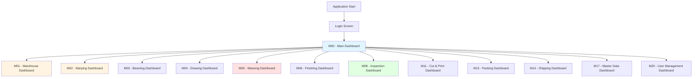

---

## Module 01 - Warehouse (12 Pages)

### Warehouse Dashboard Navigation

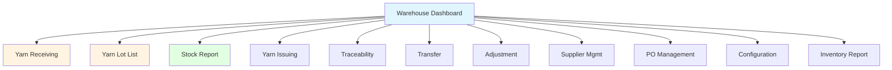

### Yarn Receiving Flow

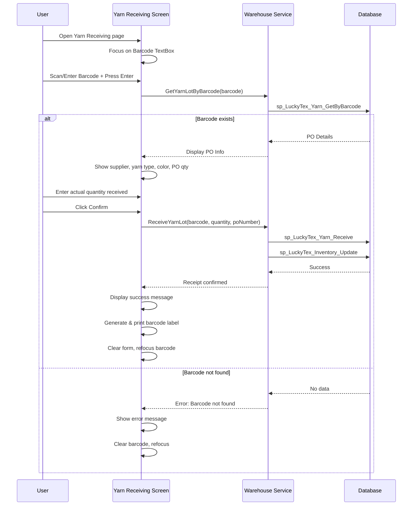

### Yarn Lot List CRUD Flow

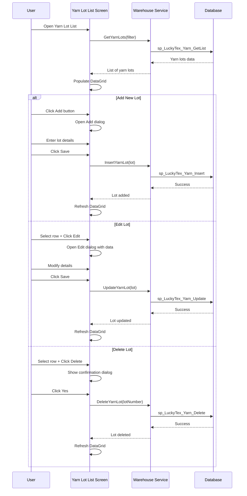

---

## Module 02 - Warping (15 Pages)

### Warping Dashboard Navigation

```mermaid
graph TD
    WP_DASH[Warping Dashboard] --> WP_PROD[Production Entry]
    WP_DASH --> WP_CREEL[Creel Loading]
    WP_DASH --> WP_BEAM[Beam List]
    WP_DASH --> WP_MONITOR[PLC Monitor]
    WP_DASH --> WP_DEFECT[Defect Entry]
    WP_DASH --> WP_COMPLETE[Complete Beam]
    WP_DASH --> WP_REPORT[Production Report]
    WP_DASH --> WP_EFFICIENCY[Efficiency Report]
    WP_DASH --> WP_MACHINE[Machine Status]
    WP_DASH --> WP_SPEC[Beam Specification]
    WP_DASH --> WP_HISTORY[Production History]
    WP_DASH --> WP_TRACE[Beam Traceability]
    WP_DASH --> WP_QC[Quality Check]
    WP_DASH --> WP_MATERIAL[Material Consumption]
    WP_DASH --> WP_CONFIG[Configuration]

    style WP_DASH fill:#e1f5ff
    style WP_PROD fill:#fff4e1
    style WP_CREEL fill:#fff4e1
    style WP_MONITOR fill:#ffe1e1
```

### Warping Production Entry Flow

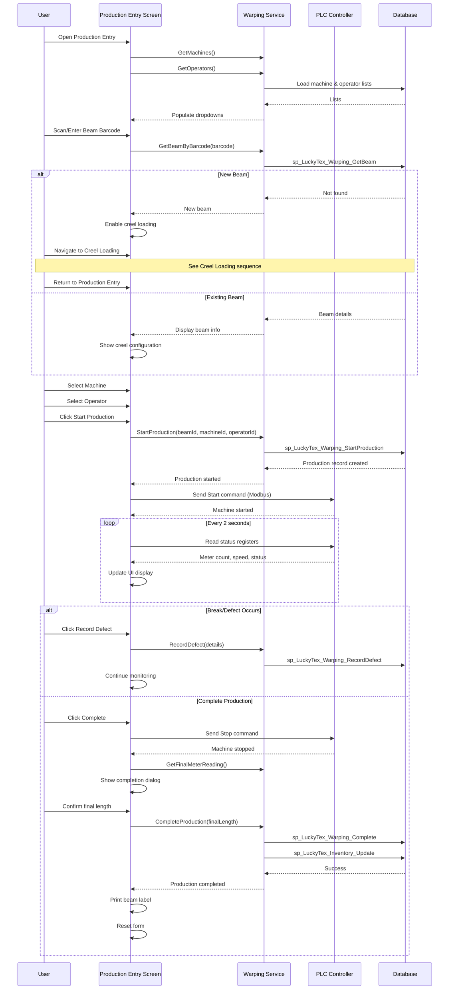

### Creel Loading Flow

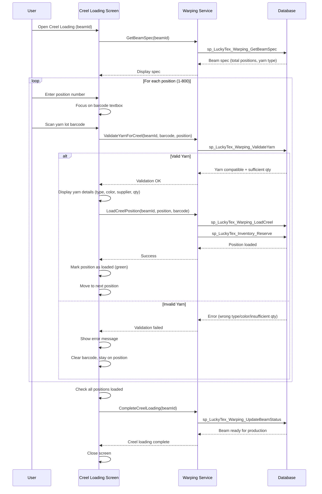

---

## Module 05 - Weaving (18 Pages)

### Weaving Dashboard Navigation

```mermaid
graph TD
    WV_DASH[Weaving Dashboard] --> WV_PROD[Production Entry]
    WV_DASH --> WV_LOOM[Loom Setup]
    WV_DASH --> WV_ROLL[Roll Generation]
    WV_DASH --> WV_LIST[Fabric Roll List]
    WV_DASH --> WV_MONITOR[Loom Monitor]
    WV_DASH --> WV_BREAK[Break Recording]
    WV_DASH --> WV_WEFT[Weft Change]
    WV_DASH --> WV_COMPLETE[Complete Weaving]
    WV_DASH --> WV_REPORT[Production Report]
    WV_DASH --> WV_EFFICIENCY[Efficiency Dashboard]
    WV_DASH --> WV_DEFECT[Defect Analysis]
    WV_DASH --> WV_TRACE[Fabric Traceability]
    WV_DASH --> WV_QC[Quality Check]
    WV_DASH --> WV_PICK[Pick Counter]
    WV_DASH --> WV_MATERIAL[Material Usage]
    WV_DASH --> WV_SCHEDULE[Production Schedule]
    WV_DASH --> WV_MAINTENANCE[Maintenance Log]
    WV_DASH --> WV_CONFIG[Configuration]

    style WV_DASH fill:#e1f5ff
    style WV_PROD fill:#ffe1e1
    style WV_MONITOR fill:#ffe1e1
    style WV_ROLL fill:#fff4e1
```

### Weaving Production Flow

```mermaid
sequenceDiagram
    participant User
    participant Screen as Weaving Production Screen
    participant Service as Weaving Service
    participant PLC as Loom PLC
    participant DB as Database

    User->>Screen: Open Weaving Production
    Screen->>Service: GetLooms()
    Screen->>Service: GetOperators()
    Service->>DB: Load lists
    DB-->>Service: Data
    Service-->>Screen: Populate UI

    User->>Screen: Scan beam barcode
    Screen->>Service: GetBeamForWeaving(barcode)
    Service->>DB: sp_LuckyTex_Weaving_GetBeam

    alt Beam not ready
        DB-->>Service: Status != Ready for Weaving
        Service-->>Screen: Error: Beam not ready
        Screen->>Screen: Show error, clear
    else Beam ready
        DB-->>Service: Beam details + yarn composition
        Service-->>Screen: Display beam info

        User->>Screen: Select loom
        User->>Screen: Scan weft yarn lot barcode
        Screen->>Service: ValidateWeftYarn(beamId, weftBarcode)
        Service->>DB: sp_LuckyTex_Weaving_ValidateWeft
        DB-->>Service: Validation result
        Service-->>Screen: Weft validated

        User->>Screen: Enter target fabric length
        User->>Screen: Select operator
        User->>Screen: Click Start Weaving

        Screen->>Service: StartWeaving(beamId, loomId, weftLot, targetLength, operatorId)
        Service->>DB: sp_LuckyTex_Weaving_StartProduction
        DB-->>Service: Production record created
        Service-->>Screen: Weaving started

        Screen->>PLC: Send Start command
        PLC-->>Screen: Loom started

        loop Real-time monitoring (every 2 sec)
            Screen->>PLC: Read pick counter, speed, status
            PLC-->>Screen: Current data
            Screen->>Screen: Calculate fabric length = picks / picks-per-cm
            Screen->>Screen: Update progress display

            alt Weft break detected
                PLC-->>Screen: Weft break alarm
                Screen->>Screen: Show alarm notification
                PLC->>PLC: Auto-stop loom
                User->>Screen: Acknowledge alarm
                Screen->>Service: RecordDefect(WEFT_BREAK, position)
                Service->>DB: sp_LuckyTex_Weaving_RecordDefect
                User->>Screen: Fix weft, Click Resume
                Screen->>PLC: Clear alarm, restart
            else Warp break detected
                PLC-->>Screen: Warp break alarm (critical)
                Screen->>Screen: Show critical alarm
                PLC->>PLC: Emergency stop
                User->>Screen: Click Record Critical Defect
                Screen->>Service: RecordCriticalDefect(WARP_BREAK, position)
                Service->>DB: sp_LuckyTex_Weaving_RecordDefect
                Screen->>Screen: Mark production for inspection
            end
        end

        alt Stop Mark (Generate Roll)
            User->>Screen: Click Stop Mark
            Screen->>PLC: Read current meter
            PLC-->>Screen: Current position
            Screen->>Service: GenerateFabricRoll(beamId, startMeter, endMeter)
            Service->>DB: sp_LuckyTex_Weaving_CreateRoll
            DB-->>Service: Roll barcode generated
            Service-->>Screen: Roll created
            Screen->>Screen: Print roll label
            Screen->>Screen: Continue weaving
        else Complete Weaving
            User->>Screen: Click Complete
            Screen->>PLC: Send Stop command
            PLC-->>Screen: Loom stopped
            Screen->>Service: GetFinalMeters()
            Screen->>Screen: Show completion dialog
            User->>Screen: Confirm final data
            Screen->>Service: CompleteWeaving(finalMeters, totalPicks)
            Service->>DB: sp_LuckyTex_Weaving_Complete
            Service->>DB: sp_LuckyTex_Weaving_CalculateConsumption
            Service->>DB: sp_LuckyTex_Inventory_Update
            DB-->>Service: Success
            Service-->>Screen: Weaving completed
            Screen->>Screen: Display summary (rolls produced, efficiency)
            Screen->>Screen: Print final report
            Screen->>Screen: Reset form
        end
    end
```

### Fabric Roll Generation Flow

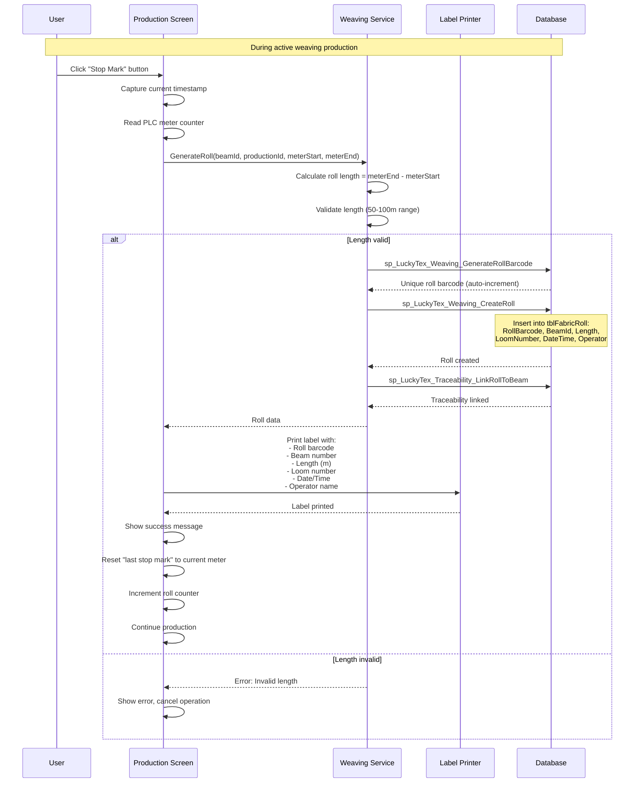

---

## Module 08 - Inspection (14 Pages)

### Inspection Dashboard Navigation

```mermaid
graph TD
    INS_DASH[Inspection Dashboard] --> INS_ENTRY[Inspection Entry]
    INS_DASH --> INS_LIST[Inspection List]
    INS_DASH --> INS_DEFECT[Defect Recording]
    INS_DASH --> INS_GRADE[Grade Calculation]
    INS_DASH --> INS_APPROVE[Approve/Reject]
    INS_DASH --> INS_REPORT[Inspection Report]
    INS_DASH --> INS_DEFECT_RPT[Defect Analysis]
    INS_DASH --> INS_TREND[Quality Trend]
    INS_DASH --> INS_CERT[Certificate Print]
    INS_DASH --> INS_TRACE[Roll Traceability]
    INS_DASH --> INS_REWORK[Rework Queue]
    INS_DASH --> INS_STANDARD[Standard Setup]
    INS_DASH --> INS_INSPECTOR[Inspector Performance]
    INS_DASH --> INS_CONFIG[Configuration]

    style INS_DASH fill:#e1f5ff
    style INS_ENTRY fill:#e1ffe1
    style INS_DEFECT fill:#e1ffe1
    style INS_GRADE fill:#e1ffe1
```

### Inspection Entry Flow

```mermaid
sequenceDiagram
    participant User as Inspector
    participant Screen as Inspection Entry Screen
    participant Service as Inspection Service
    participant Printer as Certificate Printer
    participant DB as Database

    User->>Screen: Open Inspection Entry
    Screen->>Service: GetInspectors()
    Service->>DB: sp_LuckyTex_Inspection_GetInspectors
    DB-->>Service: Inspector list
    Service-->>Screen: Populate dropdown

    User->>Screen: Select inspector (self)
    User->>Screen: Scan fabric roll barcode

    Screen->>Service: GetRollForInspection(barcode)
    Service->>DB: sp_LuckyTex_Inspection_GetRoll

    alt Roll not found
        DB-->>Service: No data
        Service-->>Screen: Error: Invalid roll
        Screen->>Screen: Clear, refocus
    else Roll already inspected
        DB-->>Service: Status = Inspected
        Service-->>Screen: Warning: Already inspected
        Screen->>Screen: Show previous inspection data
        Screen->>Screen: Offer re-inspection option
    else Roll ready
        DB-->>Service: Roll details (beam, length, loom, date)
        Service-->>Screen: Display roll information

        Screen->>Service: GetQualityStandard(rollType)
        Service->>DB: sp_LuckyTex_Inspection_GetStandard
        DB-->>Service: Standard criteria (defect types, point values)
        Service-->>Screen: Load defect types

        Screen->>Screen: Clear defect list
        Screen->>Screen: Reset point counter to 0

        loop Inspect fabric (manual review)
            User->>Screen: Identify defect on fabric
            User->>Screen: Enter defect position (meter mark)
            User->>Screen: Select defect type from dropdown
            User->>Screen: Select severity (Minor/Major/Critical)
            User->>Screen: Click Add Defect

            Screen->>Service: ValidateDefect(position, type, severity)
            Service->>Service: Calculate defect points based on severity
            Service-->>Screen: Defect validated

            Screen->>Screen: Add to defect list (DataGrid)
            Screen->>Screen: Update total points
            Screen->>Screen: Clear defect entry form
        end

        User->>Screen: Click Calculate Grade

        Screen->>Service: CalculateGrade(rollId, defectList)
        Service->>Service: Sum total penalty points
        Service->>Service: Apply grading logic:<br/>0-10 points = Grade A<br/>11-20 points = Grade B<br/>21+ points = Grade C<br/>Critical defect = Reject

        Service->>DB: sp_LuckyTex_Inspection_RecordDefects
        Service->>DB: sp_LuckyTex_Inspection_CalculateGrade
        DB-->>Service: Grade calculated
        Service-->>Screen: Grade result

        Screen->>Screen: Display grade (A/B/C/Reject)
        Screen->>Screen: Show defect summary

        alt Grade = Reject
            Screen->>Screen: Highlight as rejected (red)
            Screen->>Screen: Enable Rework/Scrap buttons
            User->>Screen: Select action (Rework/Scrap)
            Screen->>Service: UpdateRollStatus(REJECT, action)
            Service->>DB: sp_LuckyTex_Inspection_UpdateStatus
            DB-->>Service: Status updated
            Service-->>Screen: Roll marked for rework/scrap
        else Grade = A/B/C
            Screen->>Screen: Show as approved (green)
            User->>Screen: Click Approve
            Screen->>Service: ApproveRoll(rollId, grade)
            Service->>DB: sp_LuckyTex_Inspection_Approve
            Service->>DB: sp_LuckyTex_Inventory_UpdateGrade
            DB-->>Service: Roll approved
            Service-->>Screen: Approval confirmed

            Screen->>Printer: Print inspection certificate:<br/>- Roll barcode<br/>- Grade<br/>- Defect summary<br/>- Inspector name<br/>- Date/Time
            Printer-->>Screen: Certificate printed
        end

        Screen->>Screen: Show success message
        Screen->>Screen: Reset form for next roll
    end
```

---

## Module 17 - Master Data (14 Pages)

### Master Data Dashboard Navigation

```mermaid
graph TD
    MD_DASH[Master Data Dashboard] --> MD_MACHINE[Machine Management]
    MD_DASH --> MD_EMP[Employee Management]
    MD_DASH --> MD_SHIFT[Shift Management]
    MD_DASH --> MD_PRODUCT[Product Management]
    MD_DASH --> MD_CUSTOMER[Customer Management]
    MD_DASH --> MD_SUPPLIER[Supplier Management]
    MD_DASH --> MD_DEPT[Department Management]
    MD_DASH --> MD_LOCATION[Location Management]
    MD_DASH --> MD_DEFECT[Defect Type Setup]
    MD_DASH --> MD_IMPORT[Data Import]
    MD_DASH --> MD_EXPORT[Data Export]
    MD_DASH --> MD_SYNC[D365 Sync]
    MD_DASH --> MD_BACKUP[Backup/Restore]
    MD_DASH --> MD_CONFIG[Configuration]

    style MD_DASH fill:#e1f5ff
    style MD_MACHINE fill:#fff4e1
    style MD_EMP fill:#fff4e1
```

### Master Data CRUD Flow (Generic)

```mermaid
sequenceDiagram
    participant User
    participant Screen as Master Data Screen<br/>(Machine/Employee/etc.)
    participant Service as Master Data Service
    participant DB as Database

    User->>Screen: Open master data screen
    Screen->>Service: GetAll(filter, sortBy)
    Service->>DB: sp_LuckyTex_MasterData_Get[EntityType]
    DB-->>Service: Entity list
    Service-->>Screen: Data
    Screen->>Screen: Populate DataGrid

    alt Create New
        User->>Screen: Click Add button
        Screen->>Screen: Open Add dialog/panel
        Screen->>Screen: Clear all fields

        User->>Screen: Enter entity data (all fields)
        User->>Screen: Click Save

        Screen->>Service: Insert(entity)
        Service->>Service: Validate entity

        alt Validation passed
            Service->>DB: sp_LuckyTex_MasterData_Insert[EntityType]

            alt Insert successful
                DB-->>Service: New entity ID
                Service-->>Screen: Success result
                Screen->>Screen: Show success message
                Screen->>Screen: Close dialog
                Screen->>Service: GetAll (refresh)
                Service->>DB: sp_LuckyTex_MasterData_Get[EntityType]
                DB-->>Service: Updated list
                Service-->>Screen: Refreshed data
                Screen->>Screen: Refresh DataGrid
            else Duplicate/Constraint error
                DB-->>Service: Error (duplicate key, etc.)
                Service-->>Screen: Error message
                Screen->>Screen: Show error, stay in dialog
            end
        else Validation failed
            Service-->>Screen: Validation errors
            Screen->>Screen: Highlight invalid fields
            Screen->>Screen: Show error messages
        end

    else Edit Existing
        User->>Screen: Select row from DataGrid
        User->>Screen: Click Edit button
        Screen->>Screen: Open Edit dialog
        Screen->>Screen: Populate fields with selected entity

        User->>Screen: Modify field values
        User->>Screen: Click Save

        Screen->>Service: Update(entity)
        Service->>Service: Validate entity
        Service->>DB: sp_LuckyTex_MasterData_Update[EntityType]

        alt Update successful
            DB-->>Service: Rows affected = 1
            Service-->>Screen: Success
            Screen->>Screen: Show success message
            Screen->>Screen: Close dialog
            Screen->>Service: GetAll (refresh)
            Service->>DB: Query updated data
            DB-->>Service: Updated list
            Service-->>Screen: Data
            Screen->>Screen: Refresh DataGrid
        else Update failed
            DB-->>Service: Error
            Service-->>Screen: Error message
            Screen->>Screen: Show error
        end

    else Delete
        User->>Screen: Select row
        User->>Screen: Click Delete button
        Screen->>Screen: Show confirmation dialog:<br/>"Delete [EntityName]?"

        alt User confirms
            User->>Screen: Click Yes
            Screen->>Service: Delete(entityId)
            Service->>DB: sp_LuckyTex_MasterData_Delete[EntityType]

            alt Delete successful
                DB-->>Service: Rows affected = 1
                Service-->>Screen: Success
                Screen->>Screen: Show success message
                Screen->>Service: GetAll (refresh)
                Service->>DB: Query data
                DB-->>Service: Updated list
                Service-->>Screen: Data
                Screen->>Screen: Refresh DataGrid
            else Foreign key constraint
                DB-->>Service: Error: Referenced by other records
                Service-->>Screen: Error: Cannot delete
                Screen->>Screen: Show error:<br/>"Cannot delete - in use"
            end
        else User cancels
            User->>Screen: Click No
            Screen->>Screen: Close dialog, no action
        end

    else Search/Filter
        User->>Screen: Enter search text
        User->>Screen: Press Enter or Click Search
        Screen->>Service: GetAll(filter: searchText)
        Service->>DB: sp_LuckyTex_MasterData_Search[EntityType]
        DB-->>Service: Filtered results
        Service-->>Screen: Data
        Screen->>Screen: Refresh DataGrid with filtered data

    else Refresh
        User->>Screen: Click Refresh button
        Screen->>Service: GetAll()
        Service->>DB: sp_LuckyTex_MasterData_Get[EntityType]
        DB-->>Service: Current data
        Service-->>Screen: Data
        Screen->>Screen: Refresh DataGrid
    end
```

---

## Common UI Patterns

### Pattern 1: Barcode Scan Pattern (45+ pages)

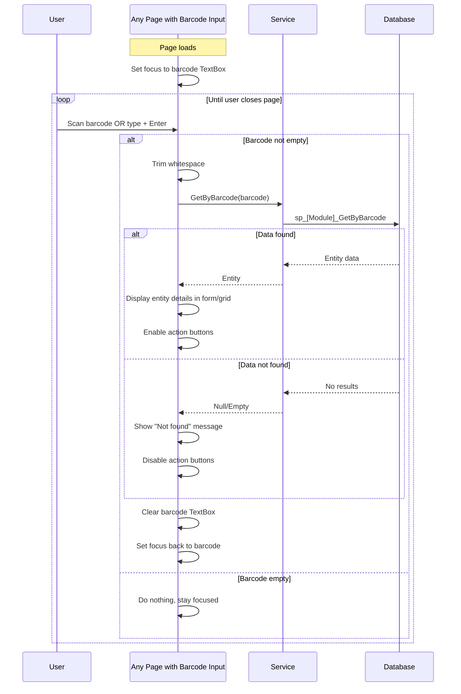

### Pattern 2: Report Parameter Selection Pattern (40+ pages)

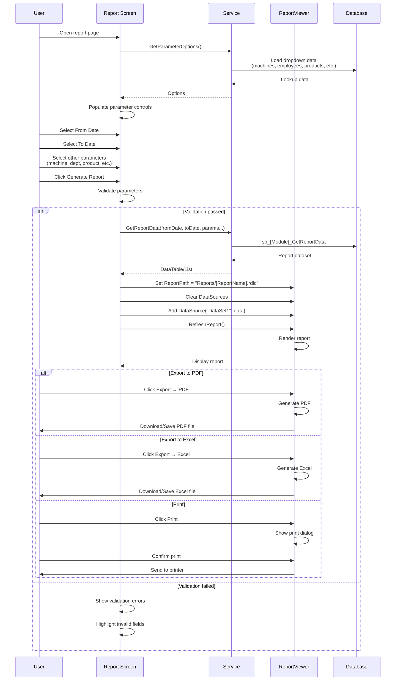

### Pattern 3: Production Entry Pattern (35+ pages)

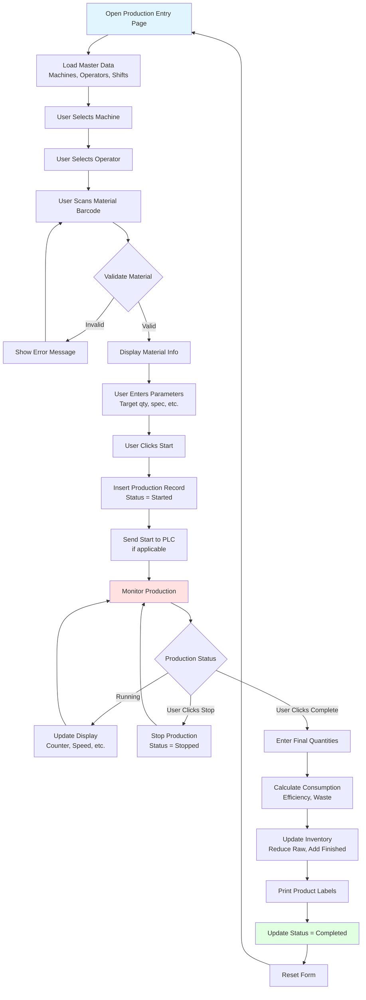

---

## Cross-Module Navigation Flows

### Material Traceability Flow (Crosses Multiple Modules)

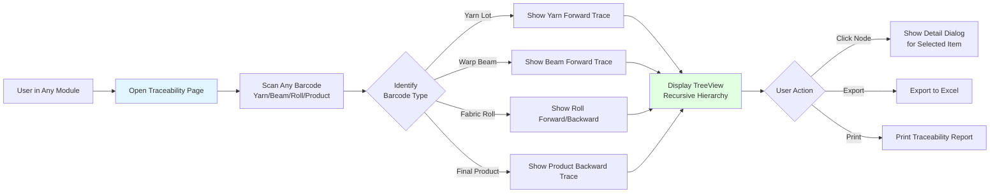

### D365 Integration Flow (M19)

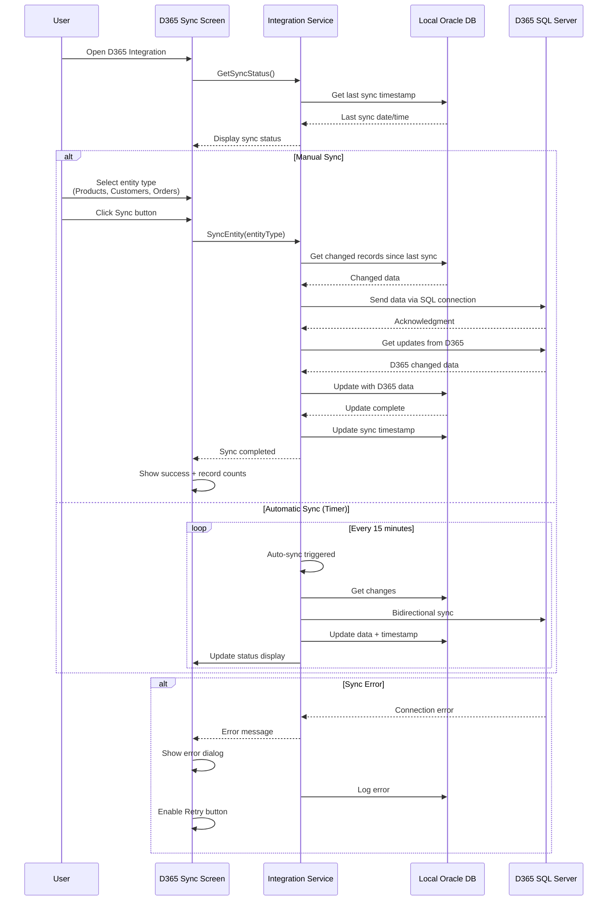

---

## Summary of UI Navigation Patterns

### Page Type Distribution

| Pattern | Page Count | Modules | Key Features |
|---------|------------|---------|--------------|
| Barcode Scan Entry | 45 | All production modules | Focus on barcode, scan loop, clear & refocus |
| CRUD List | 85 | All modules | DataGrid, Add/Edit/Delete buttons, search |
| Production Entry | 35 | M02, M05, M06, M11 | Machine select, material scan, start/stop/complete |
| Report Generation | 40 | All modules | Parameter selection, generate, export |
| PLC Monitor | 12 | M02, M05, M06 | Real-time polling, status display, alarms |
| Traceability View | 15 | M01, M02, M05, M08, M13 | TreeView, recursive query, export |
| Dashboard/Summary | 18 | All modules | Cards/panels, navigation buttons, KPIs |

### Common Navigation Sequences

1. **Dashboard → List → Detail/Edit → Back to List**
2. **Dashboard → Production Entry → Monitor → Complete → Dashboard**
3. **Dashboard → Scan Entry → Display → Action → Scan Next**
4. **Dashboard → Report → Parameters → Generate → Export**
5. **Any Page → Traceability → TreeView → Detail → Close**

---

**Document Version**: 1.0
**Last Updated**: 2025-10-05
**Total Diagrams**: 22 (15 sequence, 7 graph)
**Coverage**: All 21 modules + common patterns
