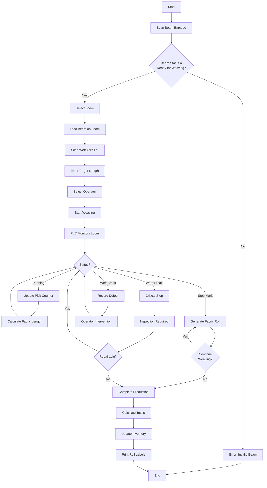

# LuckyTex AirBag MES - Workflow Documentation

## Main Production Flow

---

## Module 01 - Warehouse

### Yarn Receiving Workflow

**Business Logic Sequence**:

**Database Operations**:
- `sp_LuckyTex_Yarn_GetByBarcode` - Lookup yarn lot
- `sp_LuckyTex_Yarn_Receive` - Insert receipt record
- `sp_LuckyTex_Inventory_Update` - Update stock levels

**Output**: Yarn lot stored in warehouse with tracking barcode

---

## Module 02 - Warping

### Warping Production Workflow

### Creel Loading Details

**Business Logic Sequence**:

**Database Operations**:
- `sp_LuckyTex_Warping_GetBeamSpec` - Get beam specifications
- `sp_LuckyTex_Warping_ValidateYarn` - Validate yarn compatibility
- `sp_LuckyTex_Warping_LoadCreel` - Insert creel loading record
- `sp_LuckyTex_Inventory_Reserve` - Reserve yarn quantity

### PLC Integration (Warping)

**PLC Data Points**:
- Register 1000: Machine status (0=Stopped, 1=Running, 2=Error)
- Register 1001: Meter counter (accumulated length)
- Register 1002: Current speed (RPM)
- Register 1010-1019: Alarm codes
- Register 2000: Control command (0=Stop, 1=Start, 2=Reset)

**Polling Interval**: 2 seconds

---

## Module 03 - Beaming

### Beaming Workflow

**Business Logic Sequence**:

**Compatibility Rules**:
- All beams must have same yarn type and count
- All beams must have similar length (±5%)
- Calculate total length of combined beam
- Source beams marked as consumed

**Database Operations**:
- `sp_LuckyTex_Beaming_GetBeam` - Get beam details
- `sp_LuckyTex_Beaming_ValidateBeams` - Check compatibility
- `sp_LuckyTex_Beaming_Create` - Create combined beam record
- `sp_LuckyTex_Beaming_ConsumeSource` - Mark source beams as used

---

## Module 04 - Drawing

### Drawing Workflow

**Business Logic Sequence**:

**Process Notes**:
- Validate beam is from beaming (not warping)
- Loom number determines threading pattern
- Manual operation - operator threads yarn through equipment
- Record operator and time (critical for traceability)

**Database Operations**:
- `sp_LuckyTex_Drawing_GetBeam` - Get beam details
- `sp_LuckyTex_Drawing_GetPattern` - Get threading pattern for loom
- `sp_LuckyTex_Drawing_Complete` - Update beam status
- `sp_LuckyTex_Drawing_AssignLoom` - Link beam to loom

---

## Module 05 - Weaving

### Weaving Production Workflow

### Fabric Roll Generation

**UI Flow**:
1. During weaving, operator presses "Stop Mark" button
2. System captures current meter reading
3. Generate unique roll barcode
4. Print roll label with:
   - Roll barcode
   - Beam number (traceability)
   - Length
   - Loom number
   - Date/time
   - Operator

**Business Logic**:
- Calculate roll length = Current meter - Last stop mark
- Typical roll length: 50-100 meters
- Each roll inherits beam's yarn traceability
- Weft yarn lot also tracked per roll

**Database Operations**:
- `sp_LuckyTex_Weaving_CreateRoll` - Insert fabric roll record
- `sp_LuckyTex_Weaving_UpdateMeter` - Update production meters
- `sp_LuckyTex_Traceability_Link` - Link roll to beam and yarn lots

### PLC Integration (Weaving)

---

## Module 06 - Finishing

### Coating/Heat-Setting Workflow

**UI Flow**:
1. Scan fabric roll barcode
2. Select process type (coating/heat-setting/both)
3. Select machine
4. Enter process parameters:
   - Temperature
   - Speed
   - Coating thickness (if coating)
5. Start process
6. Monitor real-time parameters via PLC
7. Complete and generate finished roll

**Business Logic**:
- Validate roll has passed inspection (if required)
- Process parameters must be within specification
- PLC monitors temperature ±2°C tolerance
- Record actual vs target parameters
- Generate new barcode for finished roll

**Database Operations**:
- `sp_LuckyTex_Finishing_ValidateRoll` - Check roll status
- `sp_LuckyTex_Finishing_StartProcess` - Insert process record
- `sp_LuckyTex_Finishing_UpdateParameters` - Log parameters (every 30 sec)
- `sp_LuckyTex_Finishing_Complete` - Generate finished roll

---

## Module 08 - Inspection

### Quality Inspection Workflow

**Business Logic Sequence**:

**Grading Formula**:
- Defect points = Severity × Frequency
- Critical defects = automatic rejection
- Grade A: 0-10 points
- Grade B: 11-20 points
- Grade C: 21+ points
- Reject: Critical defects present

**Database Operations**:
- `sp_LuckyTex_Inspection_GetRoll` - Get roll details
- `sp_LuckyTex_Inspection_GetStandard` - Get quality standards
- `sp_LuckyTex_Inspection_RecordDefect` - Insert defect record
- `sp_LuckyTex_Inspection_CalculateGrade` - Calculate final grade
- `sp_LuckyTex_Inspection_UpdateRollStatus` - Update to Approved/Rejected

---

## Module 11 - Cut & Print

### Cutting Workflow

**UI Flow**:
1. Scan approved fabric roll
2. Enter customer order number
3. Display cutting plan (lengths and quantities)
4. Operator cuts fabric per plan
5. Generate cut piece barcodes
6. Print labels for each cut piece

**Business Logic**:
- Validate roll is Grade A or B
- Cutting plan optimizes material usage
- Each cut piece linked to parent roll (traceability)
- Update roll status to "Partially Used" or "Consumed"

**Database Operations**:
- `sp_LuckyTex_Cut_GetCuttingPlan` - Get order cutting requirements
- `sp_LuckyTex_Cut_GeneratePieces` - Create cut piece records
- `sp_LuckyTex_Cut_UpdateRollBalance` - Update remaining length

---

## Module 13 - Packing

### Packing Workflow

**UI Flow**:
1. Scan customer order number
2. Display required cut pieces
3. Scan each cut piece barcode to confirm
4. System validates against order
5. Enter packing details:
   - Box number
   - Quantity per box
6. Generate packing list
7. Print shipping label

**Business Logic**:
- All pieces must match order specifications
- Verify total quantity matches order
- Generate packing list with full traceability
- Update order status to "Packed"

**Database Operations**:
- `sp_LuckyTex_Packing_GetOrder` - Get order details
- `sp_LuckyTex_Packing_ValidatePiece` - Check piece belongs to order
- `sp_LuckyTex_Packing_Complete` - Create shipment record
- `sp_LuckyTex_Packing_GenerateDocument` - Generate packing list

---

## Data Entity Flow

---

## Traceability Chain

### Forward Traceability (Yarn to Customer)

### Backward Traceability (Customer to Yarn)

---

## PLC Integration Patterns

### Serial Communication (RS-232) - Legacy Equipment

### Modbus TCP Communication - Modern Equipment

---

## Common Workflow Patterns

### Pattern 1: Barcode Scan Workflow

[x] Focus on barcode textbox on page load
[x] User scans barcode (or types + Enter)
[x] Lookup in database via stored procedure
[x] Display results or error message
[x] Clear textbox and refocus for next scan

### Pattern 2: Production Start Workflow

[x] Select machine (dropdown or scan)
[x] Select operator (dropdown or employee card scan)
[x] Scan material barcode(s)
[x] Validate all inputs
[x] Insert production record with status = 'Started'
[x] Enable real-time monitoring (if PLC integrated)

### Pattern 3: Production Complete Workflow

[x] Enter final quantities
[x] Calculate consumption (actual vs theoretical)
[x] Record any defects or issues
[x] Update production record status = 'Completed'
[x] Update inventory (reduce raw material, increase finished goods)
[x] Print labels/documents
[x] Clear form for next production

### Pattern 4: Report Generation Workflow

[x] User selects report parameters (dates, filters, etc.)
[x] Validate parameter ranges
[x] Call stored procedure to get data
[x] Bind data to RDLC report template
[x] Display in ReportViewer control
[x] User can export (PDF, Excel) or print

---

## Cross-Module Dependencies

| Source Module | Target Module | Dependency Type |
|---------------|---------------|-----------------|
| M01 Warehouse | M02 Warping | Yarn lot availability |
| M02 Warping | M03 Beaming | Warp beam availability |
| M03 Beaming | M04 Drawing | Combined beam availability |
| M04 Drawing | M05 Weaving | Drawn beam ready status |
| M05 Weaving | M06 Finishing | Grey fabric roll availability |
| M06 Finishing | M08 Inspection | Finished roll availability |
| M08 Inspection | M11 Cut & Print | Approved roll status |
| M11 Cut & Print | M13 Packing | Cut piece availability |
| M05 Weaving | M02 Warping | Beam consumption (close loop) |
| All Modules | M17 Master Data | Machine, Employee, Shift data |

---

## Next Steps

[*] This document provides business logic understanding
[*] For implementation strategy, see MODERNIZATION_REFACTORING.md
[*] For codebase patterns, see MODERNIZATION_ANALYSIS.md
[*] For .NET Framework constraints, see DOTNET_FRAMEWORK_4.7.2_NOTES.md

---

**Document Version**: 1.0
**Last Updated**: 2025-10-05
**Status**: Complete
