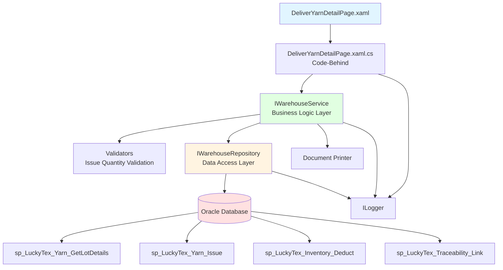
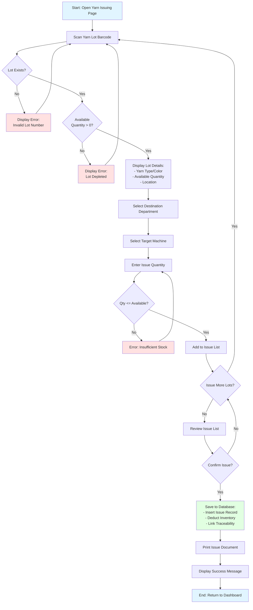
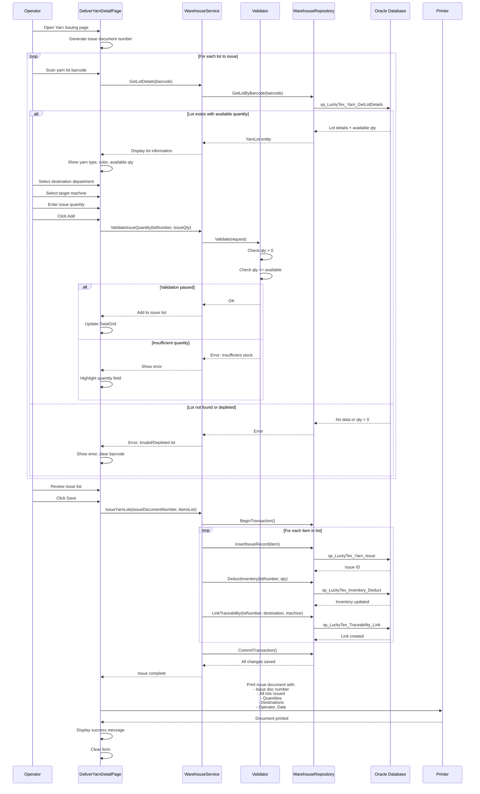

# Process: Yarn Issuing

**Process ID**: WH-002
**Module**: 01 - Warehouse
**Priority**: P1 (Foundation Module)
**Created**: 2025-10-05

---

## 1. Process Overview

### Purpose
Issue yarn lots from warehouse inventory to production departments (Warping, Weaving) with complete traceability and inventory deduction.

### Scope
- Scan yarn lot barcode
- Validate lot availability and quantity
- Select destination department/machine
- Enter issue quantity
- Generate issue document
- Update inventory (reduce stock)
- Record traceability linkage

### Module(s) Involved
- **Primary**: M01 - Warehouse
- **Downstream**: M02 - Warping, M05 - Weaving (receive issued yarn)

---

## 2. UI Files Inventory

### XAML Files
| File Path | Description | Purpose |
|-----------|-------------|---------|
| `LuckyTex.AirBag.Pages/Pages/01 - Warehouse/DeliverYarnDetailPage.xaml` | Yarn issuing/delivery screen | Main form for issuing yarn to production |
| `LuckyTex.AirBag.Pages/Pages/01 - Warehouse/WarehouseMenuPage.xaml` | Warehouse dashboard | Navigation hub |

### Code-Behind Files
| File Path | Description |
|-----------|-------------|
| `LuckyTex.AirBag.Pages/Pages/01 - Warehouse/DeliverYarnDetailPage.xaml.cs` | Event handlers and business logic |

### Service Files
| File Path | Description |
|-----------|-------------|
| *(To be created)* `LuckyTex.AirBag.Core/Repositories/WarehouseRepository.cs` | Repository for warehouse operations |
| *(To be created)* `LuckyTex.AirBag.Core/Services/WarehouseService.cs` | Service layer for business logic |

---

## 3. UI Layout Description

### DeliverYarnDetailPage.xaml

**Screen Title**: "Deliver Yarn Detail" or "Yarn Issuing"

**Key UI Controls**:

**Header Section**:
- Issue date display
- Shift and operator information
- Issue document number (auto-generated)

**Lot Selection Section**:
- Yarn lot barcode input textbox
  - KeyUp event: Enter key triggers lot lookup
- Display lot details:
  - Yarn type, color, supplier
  - Available quantity (current stock)
  - Location in warehouse

**Issue Details Section**:
- Destination department dropdown (Warping, Weaving, etc.)
- Target machine/equipment selection
- Issue quantity input (decimal)
- Purpose/remarks textbox

**Items List Section**:
- DataGrid showing issued items
- Columns: Lot Number, Yarn Type, Issue Qty, Remaining Qty, Destination, Machine

**Action Buttons**:
- `cmdAdd` - Add lot to issue list
- `cmdRemove` - Remove selected item from list
- `cmdSave` - Confirm issue and update inventory
- `cmdPrint` - Print issue document
- `cmdBack` - Return to dashboard

---

## 4. Component Architecture Diagram



---

## 5. Workflow Diagram



---

## 6. Business Logic Sequence Diagram



---

## 7. Data Flow

### Input Data
| Data Element | Source | Format | Validation |
|--------------|--------|--------|------------|
| Lot Barcode | Warehouse label | String, 30 chars | Must exist with qty > 0 |
| Issue Quantity | Operator input | Decimal (kg) | Must be > 0 and <= available |
| Destination Department | Dropdown selection | String | Must be valid department |
| Target Machine | Dropdown selection | String | Must exist in machine table |
| Issue Date | System | DateTime | Auto-set to current |
| Operator ID | Login session | String | Valid employee |

### Output Data
| Data Element | Destination | Format | Purpose |
|--------------|-------------|--------|---------|
| Issue Document Number | Database + Document | String (ISS-YYYY-MM-DD-####) | Unique transaction ID |
| Issue Records | tblYarnIssue | Database records | Transaction history |
| Inventory Deduction | tblInventory | Quantity decrement | Stock levels |
| Traceability Link | tblTraceability | Lot → Destination mapping | Forward traceability |
| Issue Document | Printer | Printed document | Audit trail |

### Data Transformations
1. **Issue Date + Sequence → Doc Number**: Format as ISS-YYYY-MM-DD-####
2. **Issue Qty → Inventory Delta**: Subtract from current stock
3. **Lot Number + Destination → Traceability**: Create forward link for material flow

---

## 8. Database Operations

### Stored Procedures Used

#### sp_LuckyTex_Yarn_GetLotDetails
- **Purpose**: Get lot details and available quantity
- **Parameters**: @LotNumber VARCHAR(30)
- **Returns**: YarnType, Color, Supplier, AvailableQty, Location
- **Tables Read**: tblYarnReceipt, tblInventory

#### sp_LuckyTex_Yarn_Issue
- **Purpose**: Insert yarn issue record
- **Parameters**:
  - @IssueDocNumber VARCHAR(30)
  - @LotNumber VARCHAR(30)
  - @Quantity DECIMAL(10,2)
  - @Destination VARCHAR(50)
  - @Machine VARCHAR(20)
  - @IssueDate DATETIME
  - @OperatorID VARCHAR(10)
- **Returns**: Issue record ID
- **Tables Written**: tblYarnIssue

#### sp_LuckyTex_Inventory_Deduct
- **Purpose**: Reduce inventory quantity
- **Parameters**:
  - @LotNumber VARCHAR(30)
  - @Quantity DECIMAL(10,2)
  - @TransactionType VARCHAR(10) = 'ISSUE'
- **Returns**: Success flag
- **Tables Written**: tblInventory, tblInventoryTransaction

#### sp_LuckyTex_Traceability_Link
- **Purpose**: Create traceability link
- **Parameters**:
  - @SourceLotNumber VARCHAR(30)
  - @DestinationDept VARCHAR(50)
  - @TargetMachine VARCHAR(20)
  - @LinkType VARCHAR(20) = 'ISSUE'
- **Returns**: Link ID
- **Tables Written**: tblTraceability

### Transaction Scope
```
BEGIN TRANSACTION
  FOR EACH issued lot:
    1. INSERT into tblYarnIssue
    2. UPDATE tblInventory (deduct quantity)
    3. INSERT into tblInventoryTransaction
    4. INSERT into tblTraceability
COMMIT TRANSACTION
```

---

## 9. Implementation Checklist

### Phase 1: Repository Layer
- [ ] Extend `IWarehouseRepository` interface
  - [ ] GetLotDetails(string lotNumber) method
  - [ ] InsertIssueRecord(YarnIssue issue) method
  - [ ] DeductInventory(string lotNumber, decimal qty) method
  - [ ] LinkTraceability(TraceabilityLink link) method
- [ ] Implement in `WarehouseRepository`
  - [ ] Map stored procedures
  - [ ] Transaction management for multi-lot issues
- [ ] Unit tests
  - [ ] Test lot lookup with valid/invalid/depleted lot
  - [ ] Test transaction rollback on error

### Phase 2: Service Layer
- [ ] Extend `IWarehouseService`
  - [ ] GetLotDetails(string barcode) method
  - [ ] IssueYarnLots(IssueYarnRequest request) method
  - [ ] ValidateIssueQuantity(string lot, decimal qty) method
- [ ] Create `IssueYarnRequestValidator`
  - [ ] Validate quantities
  - [ ] Validate destination/machine exist
- [ ] Implement in `WarehouseService`
  - [ ] Issue document number generation
  - [ ] Multi-lot transaction handling
- [ ] Unit tests
  - [ ] Test insufficient quantity detection
  - [ ] Test multi-lot issue
  - [ ] Test validation errors

### Phase 3: UI Refactoring
- [ ] Update `DeliverYarnDetailPage.xaml.cs`
  - [ ] Inject IWarehouseService
  - [ ] Update barcode scan handler
  - [ ] Update Add/Save button handlers
  - [ ] Handle ServiceResult
- [ ] DataGrid binding for issue list
- [ ] Error message display improvements

### Phase 4: Integration Testing
- [ ] Test with real database
  - [ ] Valid lot issuing
  - [ ] Insufficient quantity handling
  - [ ] Multi-lot transaction success/rollback
  - [ ] Traceability link created correctly
- [ ] Print document verification
- [ ] Performance testing

### Phase 5: Deployment
- [ ] Code review
- [ ] Unit tests passing (80%+)
- [ ] Integration tests passing
- [ ] UAT completed
- [ ] Production deployment

---

---

## 10. UI Input Logic Analysis

**See detailed UI logic documentation**: [004-UI_LOGIC_ISSUE_RAW_MATERIAL.md](../UI_Logic_Analysis/12_G3/004-UI_LOGIC_ISSUE_RAW_MATERIAL.md)

### Summary

The Yarn Issuing process (`IssueRawMaterialPage`) implements complex validation logic:

**Key Validation Rules:**
- Request Number must be unique (database check)
- Pallet Number must exist in stock and not already issued
- Warp/Weft type must match Issue To destination (Warp AB/AD or Weft AB/AD)
- Item Yarn and Yarn Type filters lock after first pallet selection

**State Management:**
- Request No becomes read-only after first item added
- Can edit Request No via separate txtNewRequestNo field
- Filters (cbItemYarn, cbYarnType) disabled when items selected
- Totals auto-calculate: Total Pallets, Sum Weight, Sum CH

**User Workflows:**
1. **By Request Number**: Enter Request No → Scan pallets → Save
2. **By Stock Filter**: Select ItemYarn + YarnType → Check pallets in grid → Enter Request No → Save
3. **Edit Request**: Use Edit Request No button after first item added

For complete analysis including flowcharts, state diagrams, and validation logic, see the detailed UI logic document linked above.

---

**Document Version**: 1.1
**Last Updated**: 2025-10-06
**Status**: Ready for Implementation + UI Logic Analysis Complete
**Estimated Effort**: 1-2 days (1 developer)
