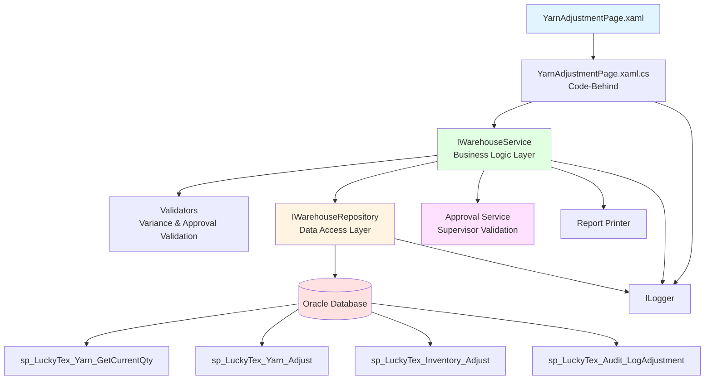
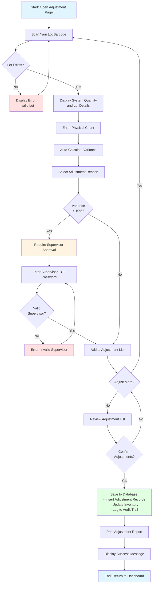
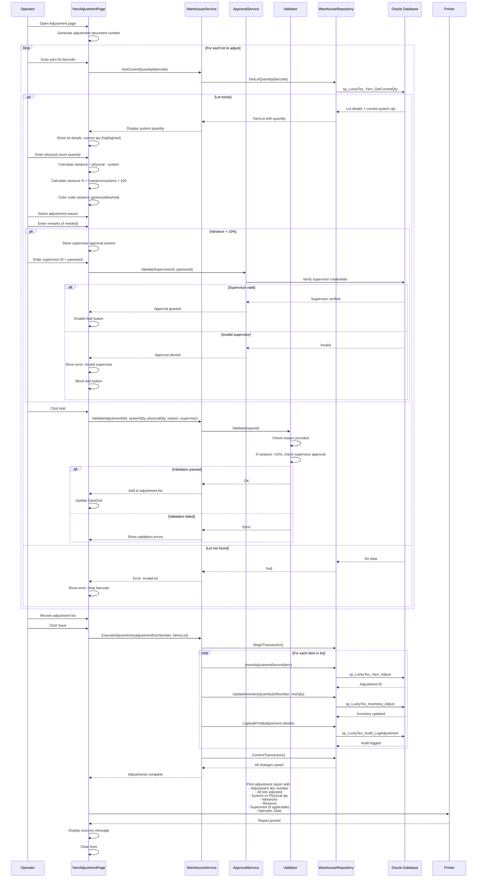

# Process: Yarn Inventory Adjustment

**Process ID**: WH-004
**Module**: 01 - Warehouse
**Priority**: P1 (Foundation Module)
**Created**: 2025-10-05

---

## 1. Process Overview

### Purpose
Adjust yarn lot inventory quantities to correct discrepancies found during physical stock counts or to resolve system errors.

### Scope
- Scan yarn lot barcode
- Verify current system quantity
- Enter actual physical count
- Calculate variance
- Require approval for large adjustments
- Update inventory with corrected quantity
- Record adjustment reason and audit trail

### Module(s) Involved
- **Primary**: M01 - Warehouse
- **Related**: Inventory management, Audit trail

---

## 2. UI Files Inventory

### XAML Files
| File Path | Description | Purpose |
|-----------|-------------|---------|
| `LuckyTex.AirBag.Pages/Pages/01 - Warehouse/YarnAdjustmentPage.xaml` | Inventory adjustment screen (assumed) | Adjust lot quantities |
| `LuckyTex.AirBag.Pages/Pages/01 - Warehouse/WarehouseMenuPage.xaml` | Warehouse dashboard | Navigation hub |

### Code-Behind Files
| File Path | Description |
|-----------|-------------|
| `LuckyTex.AirBag.Pages/Pages/01 - Warehouse/YarnAdjustmentPage.xaml.cs` | Event handlers and business logic (assumed) |

### Service Files
| File Path | Description |
|-----------|-------------|
| *(To be created)* `LuckyTex.AirBag.Core/Repositories/WarehouseRepository.cs` | Repository for warehouse operations |
| *(To be created)* `LuckyTex.AirBag.Core/Services/WarehouseService.cs` | Service layer for business logic |

---

## 3. UI Layout Description

### Yarn Adjustment Screen

**Screen Title**: "Yarn Inventory Adjustment"

**Key UI Controls**:

**Header Section**:
- Adjustment date display
- Operator information
- Adjustment document number (auto-generated)

**Lot Information Section**:
- Yarn lot barcode input textbox
  - KeyUp event: Enter key triggers lot lookup
- Display lot details (type, color, location)
- Show current system quantity (bold, highlighted)

**Adjustment Section**:
- Physical count input (decimal)
- Variance display (auto-calculated):
  - Variance = Physical Count - System Quantity
  - Variance % = (Variance / System Quantity) × 100
  - Color coded: Green (<5%), Yellow (5-10%), Red (>10%)
- Adjustment reason dropdown (mandatory):
  - Stock count discrepancy
  - Damaged material
  - System error
  - Other (requires remarks)
- Remarks textbox

**Approval Section** (for variance >10%):
- Supervisor ID input
- Supervisor password input
- Approval checkbox

**Adjustment List Section**:
- DataGrid showing adjustments
- Columns: Lot Number, System Qty, Physical Qty, Variance, Variance %, Reason

**Action Buttons**:
- `cmdAdd` - Add adjustment to list
- `cmdRemove` - Remove item from list
- `cmdSave` - Execute adjustments and update inventory
- `cmdPrint` - Print adjustment report
- `cmdBack` - Return to dashboard

---

## 4. Component Architecture Diagram



---

## 5. Workflow Diagram



---

## 6. Business Logic Sequence Diagram



---

## 7. Data Flow

### Input Data
| Data Element | Source | Format | Validation |
|--------------|--------|--------|------------|
| Lot Barcode | Warehouse label | String, 30 chars | Must exist |
| System Quantity | Database | Decimal (kg) | Auto-retrieved |
| Physical Count | Operator input | Decimal (kg) | Must be >= 0 |
| Adjustment Reason | Dropdown | String | Mandatory |
| Remarks | Operator input | String, 200 chars | Mandatory if reason = "Other" |
| Supervisor ID | Supervisor input | String | Required if variance >10% |
| Supervisor Password | Supervisor input | String (masked) | Required if variance >10% |
| Adjustment Date | System | DateTime | Auto-set |
| Operator ID | Login session | String | Valid employee |

### Output Data
| Data Element | Destination | Format | Purpose |
|--------------|-------------|--------|---------|
| Adjustment Document Number | Database + Report | String (ADJ-YYYY-MM-DD-####) | Unique transaction ID |
| Adjustment Records | tblYarnAdjustment | Database records | Full adjustment history |
| Inventory Update | tblInventory | Quantity update | Corrected stock levels |
| Audit Trail | tblAuditLog | Audit records | Compliance and traceability |
| Adjustment Report | Printer | Printed report | Documentation |

### Data Transformations
1. **Physical Count - System Quantity → Variance**: Calculate difference
2. **(Variance / System Qty) × 100 → Variance %**: Calculate percentage
3. **Adjustment Date + Sequence → Doc Number**: Format as ADJ-YYYY-MM-DD-####
4. **Variance + Reason + Approval → Audit Record**: Complete audit trail

---

## 8. Database Operations

### Stored Procedures Used

#### sp_LuckyTex_Yarn_GetCurrentQty
- **Purpose**: Get current system quantity for lot
- **Parameters**: @LotNumber VARCHAR(30)
- **Returns**: CurrentQuantity DECIMAL(10,2)
- **Tables Read**: tblInventory

#### sp_LuckyTex_Yarn_Adjust
- **Purpose**: Insert adjustment record
- **Parameters**:
  - @AdjustmentDocNumber VARCHAR(30)
  - @LotNumber VARCHAR(30)
  - @SystemQuantity DECIMAL(10,2)
  - @PhysicalCount DECIMAL(10,2)
  - @Variance DECIMAL(10,2)
  - @Reason VARCHAR(50)
  - @Remarks VARCHAR(200)
  - @SupervisorID VARCHAR(10) (nullable)
  - @AdjustmentDate DATETIME
  - @OperatorID VARCHAR(10)
- **Returns**: Adjustment record ID
- **Tables Written**: tblYarnAdjustment

#### sp_LuckyTex_Inventory_Adjust
- **Purpose**: Update inventory to physical count
- **Parameters**:
  - @LotNumber VARCHAR(30)
  - @NewQuantity DECIMAL(10,2)
  - @TransactionType VARCHAR(10) = 'ADJUST'
- **Returns**: Success flag
- **Tables Written**: tblInventory, tblInventoryTransaction

#### sp_LuckyTex_Audit_LogAdjustment
- **Purpose**: Create audit trail entry
- **Parameters**:
  - @AdjustmentDocNumber VARCHAR(30)
  - @LotNumber VARCHAR(30)
  - @OldQuantity DECIMAL(10,2)
  - @NewQuantity DECIMAL(10,2)
  - @Reason VARCHAR(50)
  - @ApprovedBy VARCHAR(10)
  - @PerformedBy VARCHAR(10)
  - @AdjustmentDate DATETIME
- **Returns**: Audit ID
- **Tables Written**: tblAuditLog

### Transaction Scope
```
BEGIN TRANSACTION
  FOR EACH adjusted lot:
    1. INSERT into tblYarnAdjustment (record adjustment)
    2. UPDATE tblInventory SET Quantity = @PhysicalCount
    3. INSERT into tblInventoryTransaction (audit trail)
    4. INSERT into tblAuditLog (compliance log)
COMMIT TRANSACTION
```

**Rollback Conditions**:
- Any database error
- Supervisor validation failure (if required)
- Constraint violations

---

## 9. Implementation Checklist

### Phase 1: Repository Layer
- [ ] Extend `IWarehouseRepository` interface
  - [ ] GetLotCurrentQuantity(string lotNumber) method
  - [ ] InsertAdjustmentRecord(YarnAdjustment adjustment) method
  - [ ] UpdateInventoryQuantity(string lot, decimal newQty) method
  - [ ] LogAuditTrail(AuditLog log) method
- [ ] Implement in `WarehouseRepository`
  - [ ] Map all stored procedures
  - [ ] Transaction management for multi-lot adjustments
- [ ] Unit tests
  - [ ] Test quantity update
  - [ ] Test audit trail creation
  - [ ] Test transaction rollback on error

### Phase 2: Service Layer
- [ ] Extend `IWarehouseService`
  - [ ] GetLotCurrentQuantity(string barcode) method
  - [ ] ExecuteAdjustments(AdjustmentRequest request) method
  - [ ] ValidateAdjustment(...) method
- [ ] Create `IApprovalService` interface
  - [ ] ValidateSupervisor(string id, string password) method
- [ ] Create `AdjustmentRequestValidator`
  - [ ] Validate physical count >= 0
  - [ ] Validate reason provided
  - [ ] Validate supervisor approval if variance >10%
  - [ ] Validate remarks if reason = "Other"
- [ ] Implement services
  - [ ] Adjustment document number generation
  - [ ] Variance calculation logic
  - [ ] Multi-lot transaction handling
- [ ] Unit tests
  - [ ] Test variance calculation
  - [ ] Test approval requirement (>10%)
  - [ ] Test validation errors
  - [ ] Test successful adjustment flow

### Phase 3: UI Refactoring
- [ ] Create or update YarnAdjustmentPage.xaml.cs
  - [ ] Inject IWarehouseService, IApprovalService
  - [ ] Implement barcode scan handler
  - [ ] Implement variance calculation (real-time)
  - [ ] Implement conditional supervisor approval UI
  - [ ] Implement Add/Save button handlers
  - [ ] Handle ServiceResult
- [ ] UI data binding
  - [ ] Bind system quantity (read-only, highlighted)
  - [ ] Bind variance display with color coding
  - [ ] Bind adjustment list to DataGrid
- [ ] Conditional UI visibility
  - [ ] Show/hide supervisor section based on variance
- [ ] Input validation and error display

### Phase 4: Integration Testing
- [ ] Test with real database
  - [ ] Valid adjustments (small variance <5%)
  - [ ] Medium variance (5-10%) - no approval needed
  - [ ] Large variance (>10%) - supervisor approval required
  - [ ] Invalid supervisor handling
  - [ ] Multi-lot transaction success/rollback
  - [ ] Audit trail verification
- [ ] Report printing
- [ ] Performance testing

### Phase 5: Security & Compliance
- [ ] Supervisor password encryption
- [ ] Audit trail completeness verification
- [ ] Access control (who can adjust?)
- [ ] Adjustment limits (max variance allowed?)

### Phase 6: Deployment
- [ ] Code review
- [ ] Security review
- [ ] Unit tests passing (80%+)
- [ ] Integration tests passing
- [ ] UAT completed
- [ ] Production deployment with rollback plan

---

**Document Version**: 1.0
**Last Updated**: 2025-10-05
**Status**: Ready for Implementation
**Estimated Effort**: 2 days (1 developer)
**Security Note**: Requires supervisor approval workflow
