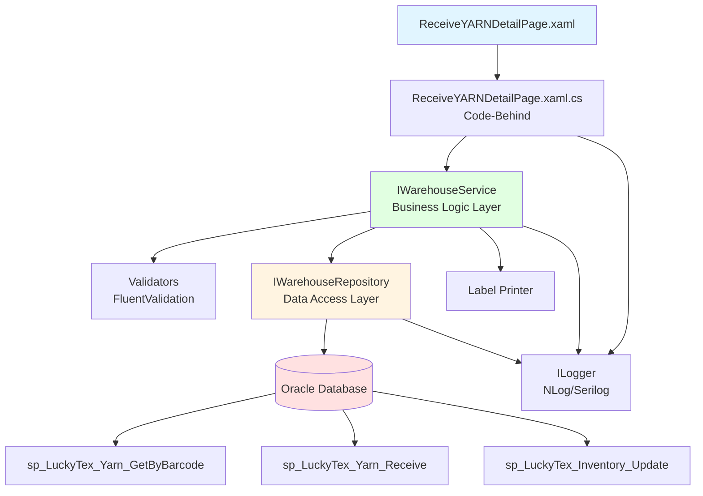
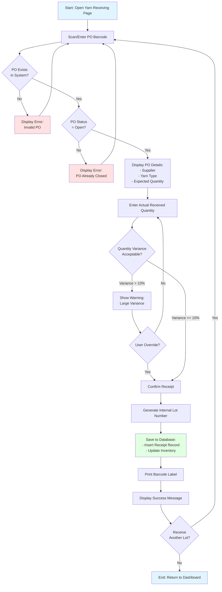
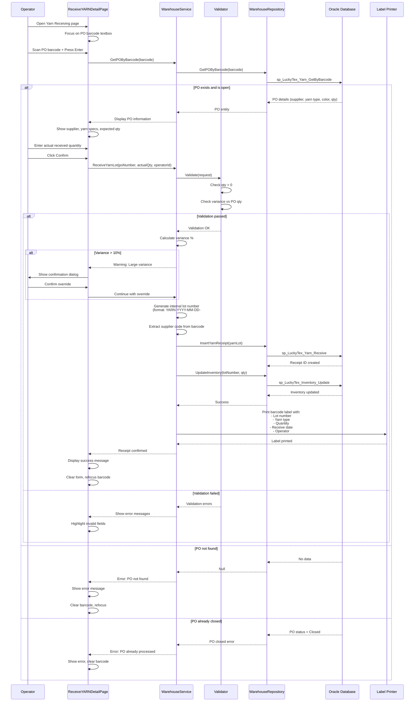

# Process: Yarn Receiving

**Process ID**: WH-001
**Module**: 01 - Warehouse
**Priority**: P1 (Foundation Module)
**Created**: 2025-10-05

---

## 1. Process Overview

### Purpose
Receive raw yarn materials from suppliers into warehouse inventory system with complete traceability.

### Scope
- Scan supplier PO barcode
- Validate PO details and yarn specifications
- Enter actual received quantity
- Generate internal lot tracking barcode
- Update inventory levels
- Print barcode labels for warehouse storage

### Module(s) Involved
- **Primary**: M01 - Warehouse
- **Downstream**: M02 - Warping (consumes yarn lots)

---

## 2. UI Files Inventory

### XAML Files
| File Path | Description | Purpose |
|-----------|-------------|---------|
| `LuckyTex.AirBag.Pages/Pages/01 - Warehouse/ReceiveYARNDetailPage.xaml` | Yarn receiving entry screen | Main form for scanning PO and entering receipt details |
| `LuckyTex.AirBag.Pages/Pages/01 - Warehouse/WarehouseMenuPage.xaml` | Warehouse dashboard | Navigation hub to all warehouse operations |

### Code-Behind Files
| File Path | Description |
|-----------|-------------|
| `LuckyTex.AirBag.Pages/Pages/01 - Warehouse/ReceiveYARNDetailPage.xaml.cs` | Event handlers and business logic |
| `LuckyTex.AirBag.Pages/Pages/01 - Warehouse/WarehouseMenuPage.xaml.cs` | Dashboard navigation logic |

### Service Files
| File Path | Description |
|-----------|-------------|
| `LuckyTex.AirBag.Core/Services/DataService/DataServicecs.cs` | Central data service (singleton pattern) |
| *(To be created)* `LuckyTex.AirBag.Core/Repositories/WarehouseRepository.cs` | Repository for warehouse operations |
| *(To be created)* `LuckyTex.AirBag.Core/Services/WarehouseService.cs` | Service layer for business logic |

---

## 3. UI Layout Description

### ReceiveYARNDetailPage.xaml

**Screen Title**: "G3 - Receive Yarn Detail"

**Key UI Controls**:

**Header Section**:
- `txtReceiveDate` (TextBlock) - Display current receive date
- Display fields for login info, shift, operator

**Input Section** (Top Grid):
- Pallet Number input textbox (`txtPalletNo`)
  - KeyUp event: Enter key triggers barcode scan
- PO Number display
- Supplier information display
- Yarn type/specification display

**Data Grid Section** (Center):
- DataGrid for received items list
- Columns: Lot Number, Yarn Type, Color, Quantity (kg), Supplier, PO Number
- Multi-row display for multiple lot receipts

**Action Buttons** (Bottom):
- `cmdDelete` - Delete selected item from list
- `cmdSave` - Save all received items to database
- `cmdBack` - Return to warehouse dashboard

**Data Binding Points**:
- Barcode input → PO lookup service
- PO details → UI display fields
- Received items collection → DataGrid.ItemsSource
- Save button → Insert receipt records + Update inventory

---

## 4. Component Architecture Diagram



---

## 5. Workflow Diagram



---

## 6. Business Logic Sequence Diagram



---

## 7. Data Flow

### Input Data
| Data Element | Source | Format | Validation |
|--------------|--------|--------|------------|
| PO Barcode | Supplier document | String, 20 chars | Must exist in system |
| Actual Quantity | Operator input | Decimal (kg) | Must be > 0 |
| Receive Date | System | DateTime | Auto-set to current date |
| Operator ID | Login session | String | Must be valid employee |
| Shift | Login session | String | Current shift |

### Output Data
| Data Element | Destination | Format | Purpose |
|--------------|-------------|--------|---------|
| Internal Lot Number | Database + Label | String (YARN-YYYY-MM-DD-####) | Unique tracking ID |
| Receipt Record | tblYarnReceipt | Database record | Transaction history |
| Inventory Update | tblInventory | Quantity increment | Stock levels |
| Barcode Label | Label Printer | Physical label | Warehouse tracking |
| Receipt Confirmation | UI | Message | User feedback |

### Data Transformations
1. **PO Barcode → Supplier Code**: Extract first 6 characters
2. **Receive Date + Sequence → Lot Number**: Format as YARN-YYYY-MM-DD-####
3. **Actual Qty vs PO Qty → Variance %**: Calculate (Actual - Expected) / Expected * 100
4. **Receipt Record → Inventory Delta**: Add received quantity to current stock

---

## 8. Database Operations

### Stored Procedures Used

#### sp_LuckyTex_Yarn_GetByBarcode
- **Purpose**: Lookup PO details by barcode
- **Parameters**:
  - @Barcode VARCHAR(20)
- **Returns**: PO details (Supplier, YarnType, Color, ExpectedQty, POStatus)
- **Tables Read**: tblPurchaseOrder, tblSupplier, tblYarnType

#### sp_LuckyTex_Yarn_Receive
- **Purpose**: Insert yarn receipt record
- **Parameters**:
  - @LotNumber VARCHAR(30)
  - @PONumber VARCHAR(20)
  - @YarnType VARCHAR(50)
  - @Color VARCHAR(30)
  - @Quantity DECIMAL(10,2)
  - @ReceiveDate DATETIME
  - @OperatorID VARCHAR(10)
  - @ShiftCode VARCHAR(10)
- **Returns**: @@IDENTITY (new receipt ID)
- **Tables Written**: tblYarnReceipt

#### sp_LuckyTex_Inventory_Update
- **Purpose**: Update warehouse inventory levels
- **Parameters**:
  - @LotNumber VARCHAR(30)
  - @Quantity DECIMAL(10,2)
  - @TransactionType VARCHAR(10) = 'RECEIVE'
- **Returns**: Success flag
- **Tables Written**: tblInventory, tblInventoryTransaction

### Table Operations

| Table | Operation | Columns Affected | Transaction Boundary |
|-------|-----------|------------------|---------------------|
| tblYarnReceipt | INSERT | All columns | Part of main transaction |
| tblInventory | UPDATE | QuantityOnHand, LastUpdateDate | Part of main transaction |
| tblInventoryTransaction | INSERT | LotNumber, Quantity, TransactionType, Date | Part of main transaction |

### Transaction Scope
All operations wrapped in single transaction:
```
BEGIN TRANSACTION
  1. INSERT into tblYarnReceipt
  2. UPDATE tblInventory (add quantity)
  3. INSERT into tblInventoryTransaction (audit trail)
COMMIT TRANSACTION
```

Rollback on any error to maintain data consistency.

---

## 9. Implementation Checklist

### Phase 1: Repository Layer
- [ ] Create `YarnLot` entity model
  - [ ] Properties: LotNumber, PONumber, SupplierCode, YarnType, Color, QuantityKg, ReceiveDate, OperatorID
  - [ ] Validation attributes
- [ ] Create `IWarehouseRepository` interface
  - [ ] GetPOByBarcode(string barcode) method
  - [ ] InsertYarnReceipt(YarnLot yarnLot) method
  - [ ] UpdateInventory(string lotNumber, decimal quantity) method
- [ ] Implement `WarehouseRepository` class
  - [ ] Inherit from BaseRepository
  - [ ] Implement IWarehouseRepository
  - [ ] Map stored procedure calls to methods
  - [ ] Handle OracleDataReader → Entity mapping
- [ ] Unit tests for repository
  - [ ] Test GetPOByBarcode with valid/invalid barcode
  - [ ] Test InsertYarnReceipt success case
  - [ ] Test UpdateInventory with transaction rollback

### Phase 2: Service Layer
- [ ] Create `IWarehouseService` interface
  - [ ] GetPODetails(string barcode) method
  - [ ] ReceiveYarnLot(ReceiveYarnRequest request) method
  - [ ] ValidateReceipt(ReceiveYarnRequest request) method
- [ ] Create validators using FluentValidation
  - [ ] `ReceiveYarnRequestValidator`
    - [ ] PONumber not empty
    - [ ] Quantity > 0
    - [ ] Operator ID valid
- [ ] Implement `WarehouseService` class
  - [ ] Constructor with IWarehouseRepository, ILogger, IValidator
  - [ ] ReceiveYarnLot method with full business logic
  - [ ] Variance calculation logic
  - [ ] Lot number generation logic
  - [ ] Return ServiceResult<YarnLot>
- [ ] Unit tests for service
  - [ ] Test variance detection (>10%)
  - [ ] Test lot number generation format
  - [ ] Test validation errors
  - [ ] Test successful receipt flow

### Phase 3: UI Refactoring
- [ ] Update `ReceiveYARNDetailPage.xaml.cs`
  - [ ] Remove direct DataService.Instance calls
  - [ ] Inject IWarehouseService via constructor or property
  - [ ] Update txtPalletNo_KeyUp to call GetPODetails
  - [ ] Update cmdSave_Click to call ReceiveYarnLot
  - [ ] Handle ServiceResult (success/error messages)
  - [ ] Update UI based on result
- [ ] Ensure XAML data binding works
  - [ ] Bind PO details to display fields
  - [ ] Bind received items to DataGrid
- [ ] Add loading indicators for async operations
- [ ] Improve error message display (user-friendly)

### Phase 4: Integration Testing
- [ ] Test with real Oracle database
  - [ ] Valid PO barcode scan
  - [ ] Invalid PO barcode
  - [ ] Closed PO handling
  - [ ] Variance warning triggers correctly
  - [ ] Barcode label prints with correct data
- [ ] Test inventory update accuracy
  - [ ] Verify tblInventory quantity incremented
  - [ ] Verify transaction audit trail created
- [ ] Test error scenarios
  - [ ] Database connection failure
  - [ ] Transaction rollback on error
  - [ ] Duplicate lot number handling
- [ ] Performance testing
  - [ ] Barcode scan response time < 500ms
  - [ ] Save operation < 1 second

### Phase 5: Deployment Preparation
- [ ] Code review completed
- [ ] All unit tests passing (80%+ coverage)
- [ ] Integration tests passing
- [ ] Documentation updated
- [ ] Deployment to staging environment
- [ ] UAT completed successfully
- [ ] Production deployment checklist ready

---

**Document Version**: 1.0
**Last Updated**: 2025-10-05
**Status**: Ready for Implementation
**Estimated Effort**: 2-3 days (1 developer)
