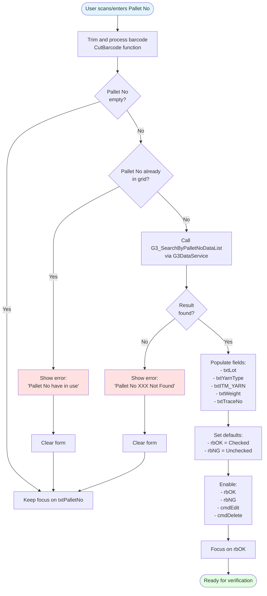
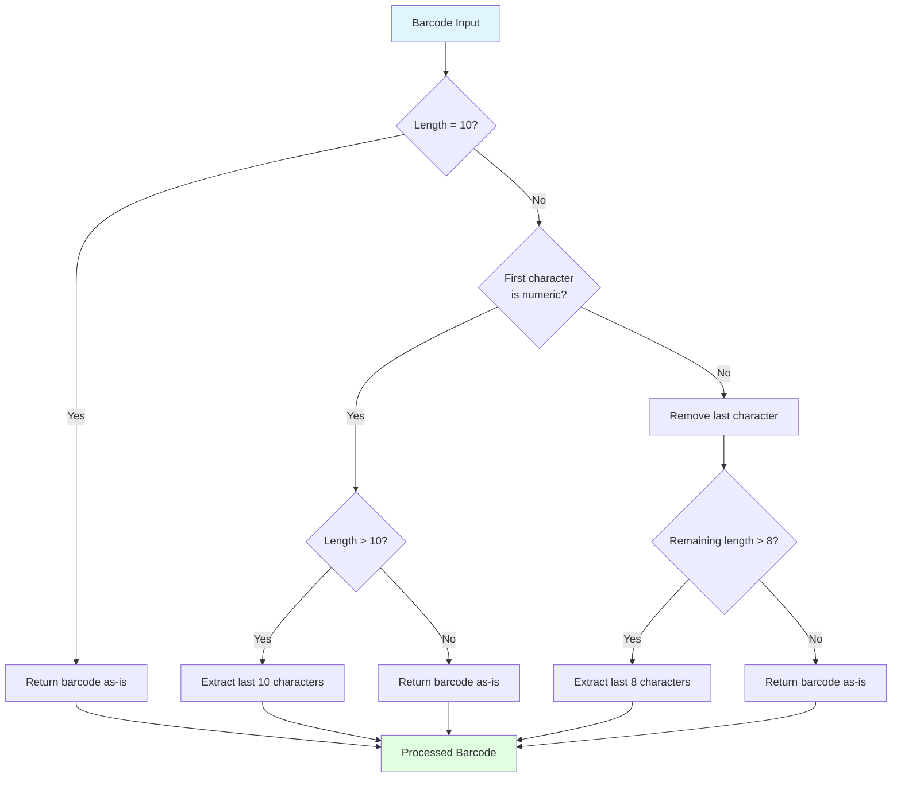
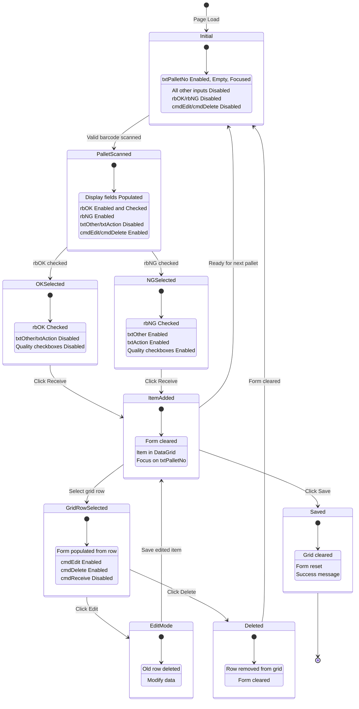
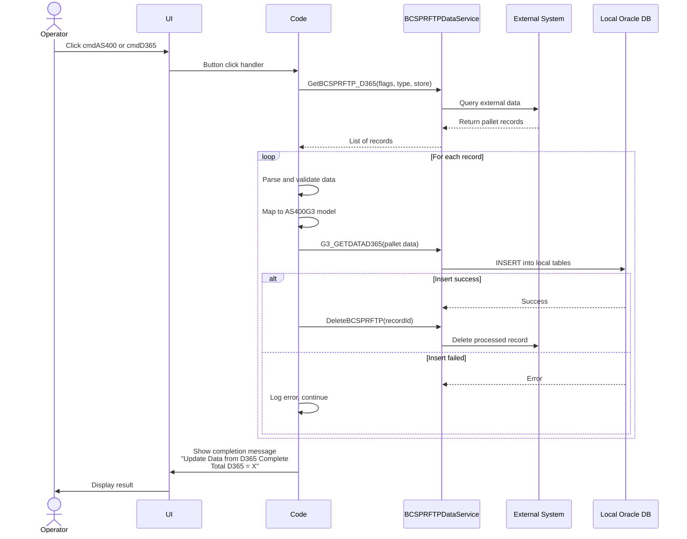

# Process: Yarn Receiving

**Process ID**: WH-001
**Module**: 01 - Warehouse
**Priority**: P1 (Foundation Module)
**Created**: 2025-10-05

---

## 1. Process Overview

### Purpose
Receive raw yarn materials from suppliers into warehouse inventory system with complete traceability.

### Scope
- Scan supplier PO barcode
- Validate PO details and yarn specifications
- Enter actual received quantity
- Generate internal lot tracking barcode
- Update inventory levels
- Print barcode labels for warehouse storage

### Module(s) Involved
- **Primary**: M01 - Warehouse
- **Downstream**: M02 - Warping (consumes yarn lots)

---

## 2. UI Files Inventory

### XAML Files
| File Path | Description | Purpose |
|-----------|-------------|---------|
| `LuckyTex.AirBag.Pages/Pages/01 - Warehouse/ReceiveYARNDetailPage.xaml` | Yarn receiving entry screen | Main form for scanning PO and entering receipt details |
| `LuckyTex.AirBag.Pages/Pages/01 - Warehouse/WarehouseMenuPage.xaml` | Warehouse dashboard | Navigation hub to all warehouse operations |

### Code-Behind Files
| File Path | Description |
|-----------|-------------|
| `LuckyTex.AirBag.Pages/Pages/01 - Warehouse/ReceiveYARNDetailPage.xaml.cs` | Event handlers and business logic |
| `LuckyTex.AirBag.Pages/Pages/01 - Warehouse/WarehouseMenuPage.xaml.cs` | Dashboard navigation logic |

### Service Files
| File Path | Description |
|-----------|-------------|
| `LuckyTex.AirBag.Core/Services/DataService/DataServicecs.cs` | Central data service (singleton pattern) |
| *(To be created)* `LuckyTex.AirBag.Core/Repositories/WarehouseRepository.cs` | Repository for warehouse operations |
| *(To be created)* `LuckyTex.AirBag.Core/Services/WarehouseService.cs` | Service layer for business logic |

---

## 3. UI Layout Description

### ReceiveYARNDetailPage.xaml

**Screen Title**: "G3 - Receive Yarn Detail"

**Key UI Controls**:

**Header Section**:
- `txtReceiveDate` (TextBlock) - Display current receive date
- Display fields for login info, shift, operator

**Input Section** (Top Grid):
- Pallet Number input textbox (`txtPalletNo`)
  - KeyUp event: Enter key triggers barcode scan
- PO Number display
- Supplier information display
- Yarn type/specification display

**Data Grid Section** (Center):
- DataGrid for received items list
- Columns: Lot Number, Yarn Type, Color, Quantity (kg), Supplier, PO Number
- Multi-row display for multiple lot receipts

**Action Buttons** (Bottom):
- `cmdDelete` - Delete selected item from list
- `cmdSave` - Save all received items to database
- `cmdBack` - Return to warehouse dashboard

**Data Binding Points**:
- Barcode input → PO lookup service
- PO details → UI display fields
- Received items collection → DataGrid.ItemsSource
- Save button → Insert receipt records + Update inventory

---

## 4. Component Architecture Diagram


---

## 5. Workflow Diagram


---

## 6. Business Logic Sequence Diagram


---

## 7. Data Flow

### Input Data
| Data Element | Source | Format | Validation |
|--------------|--------|--------|------------|
| PO Barcode | Supplier document | String, 20 chars | Must exist in system |
| Actual Quantity | Operator input | Decimal (kg) | Must be > 0 |
| Receive Date | System | DateTime | Auto-set to current date |
| Operator ID | Login session | String | Must be valid employee |
| Shift | Login session | String | Current shift |

### Output Data
| Data Element | Destination | Format | Purpose |
|--------------|-------------|--------|---------|
| Internal Lot Number | Database + Label | String (YARN-YYYY-MM-DD-####) | Unique tracking ID |
| Receipt Record | tblYarnReceipt | Database record | Transaction history |
| Inventory Update | tblInventory | Quantity increment | Stock levels |
| Barcode Label | Label Printer | Physical label | Warehouse tracking |
| Receipt Confirmation | UI | Message | User feedback |

### Data Transformations
1. **PO Barcode → Supplier Code**: Extract first 6 characters
2. **Receive Date + Sequence → Lot Number**: Format as YARN-YYYY-MM-DD-####
3. **Actual Qty vs PO Qty → Variance %**: Calculate (Actual - Expected) / Expected * 100
4. **Receipt Record → Inventory Delta**: Add received quantity to current stock

---

## 8. Database Operations

### Stored Procedures Used

#### sp_LuckyTex_Yarn_GetByBarcode
- **Purpose**: Lookup PO details by barcode
- **Parameters**:
  - @Barcode VARCHAR(20)
- **Returns**: PO details (Supplier, YarnType, Color, ExpectedQty, POStatus)
- **Tables Read**: tblPurchaseOrder, tblSupplier, tblYarnType

#### sp_LuckyTex_Yarn_Receive
- **Purpose**: Insert yarn receipt record
- **Parameters**:
  - @LotNumber VARCHAR(30)
  - @PONumber VARCHAR(20)
  - @YarnType VARCHAR(50)
  - @Color VARCHAR(30)
  - @Quantity DECIMAL(10,2)
  - @ReceiveDate DATETIME
  - @OperatorID VARCHAR(10)
  - @ShiftCode VARCHAR(10)
- **Returns**: @@IDENTITY (new receipt ID)
- **Tables Written**: tblYarnReceipt

#### sp_LuckyTex_Inventory_Update
- **Purpose**: Update warehouse inventory levels
- **Parameters**:
  - @LotNumber VARCHAR(30)
  - @Quantity DECIMAL(10,2)
  - @TransactionType VARCHAR(10) = 'RECEIVE'
- **Returns**: Success flag
- **Tables Written**: tblInventory, tblInventoryTransaction

### Table Operations

| Table | Operation | Columns Affected | Transaction Boundary |
|-------|-----------|------------------|---------------------|
| tblYarnReceipt | INSERT | All columns | Part of main transaction |
| tblInventory | UPDATE | QuantityOnHand, LastUpdateDate | Part of main transaction |
| tblInventoryTransaction | INSERT | LotNumber, Quantity, TransactionType, Date | Part of main transaction |

### Transaction Scope
All operations wrapped in single transaction:
```
BEGIN TRANSACTION
  1. INSERT into tblYarnReceipt
  2. UPDATE tblInventory (add quantity)
  3. INSERT into tblInventoryTransaction (audit trail)
COMMIT TRANSACTION
```

Rollback on any error to maintain data consistency.

---

## 9. Implementation Checklist

### Phase 1: Repository Layer
- [ ] Create `YarnLot` entity model
  - [ ] Properties: LotNumber, PONumber, SupplierCode, YarnType, Color, QuantityKg, ReceiveDate, OperatorID
  - [ ] Validation attributes
- [ ] Create `IWarehouseRepository` interface
  - [ ] GetPOByBarcode(string barcode) method
  - [ ] InsertYarnReceipt(YarnLot yarnLot) method
  - [ ] UpdateInventory(string lotNumber, decimal quantity) method
- [ ] Implement `WarehouseRepository` class
  - [ ] Inherit from BaseRepository
  - [ ] Implement IWarehouseRepository
  - [ ] Map stored procedure calls to methods
  - [ ] Handle OracleDataReader → Entity mapping
- [ ] Unit tests for repository
  - [ ] Test GetPOByBarcode with valid/invalid barcode
  - [ ] Test InsertYarnReceipt success case
  - [ ] Test UpdateInventory with transaction rollback

### Phase 2: Service Layer
- [ ] Create `IWarehouseService` interface
  - [ ] GetPODetails(string barcode) method
  - [ ] ReceiveYarnLot(ReceiveYarnRequest request) method
  - [ ] ValidateReceipt(ReceiveYarnRequest request) method
- [ ] Create validators using FluentValidation
  - [ ] `ReceiveYarnRequestValidator`
    - [ ] PONumber not empty
    - [ ] Quantity > 0
    - [ ] Operator ID valid
- [ ] Implement `WarehouseService` class
  - [ ] Constructor with IWarehouseRepository, ILogger, IValidator
  - [ ] ReceiveYarnLot method with full business logic
  - [ ] Variance calculation logic
  - [ ] Lot number generation logic
  - [ ] Return ServiceResult<YarnLot>
- [ ] Unit tests for service
  - [ ] Test variance detection (>10%)
  - [ ] Test lot number generation format
  - [ ] Test validation errors
  - [ ] Test successful receipt flow

### Phase 3: UI Refactoring
- [ ] Update `ReceiveYARNDetailPage.xaml.cs`
  - [ ] Remove direct DataService.Instance calls
  - [ ] Inject IWarehouseService via constructor or property
  - [ ] Update txtPalletNo_KeyUp to call GetPODetails
  - [ ] Update cmdSave_Click to call ReceiveYarnLot
  - [ ] Handle ServiceResult (success/error messages)
  - [ ] Update UI based on result
- [ ] Ensure XAML data binding works
  - [ ] Bind PO details to display fields
  - [ ] Bind received items to DataGrid
- [ ] Add loading indicators for async operations
- [ ] Improve error message display (user-friendly)

### Phase 4: Integration Testing
- [ ] Test with real Oracle database
  - [ ] Valid PO barcode scan
  - [ ] Invalid PO barcode
  - [ ] Closed PO handling
  - [ ] Variance warning triggers correctly
  - [ ] Barcode label prints with correct data
- [ ] Test inventory update accuracy
  - [ ] Verify tblInventory quantity incremented
  - [ ] Verify transaction audit trail created
- [ ] Test error scenarios
  - [ ] Database connection failure
  - [ ] Transaction rollback on error
  - [ ] Duplicate lot number handling
- [ ] Performance testing
  - [ ] Barcode scan response time < 500ms
  - [ ] Save operation < 1 second

### Phase 5: Deployment Preparation
- [ ] Code review completed
- [ ] All unit tests passing (80%+ coverage)
- [ ] Integration tests passing
- [ ] Documentation updated
- [ ] Deployment to staging environment
- [ ] UAT completed successfully
- [ ] Production deployment checklist ready

---

---

## 10. UI Input Logic Analysis

### Overview

This section provides detailed analysis of the user interface logic, input validation, state management, and user interaction flows based on the actual implementation in `ReceiveYARNPage.xaml` and `ReceiveYARNPage.xaml.cs`.

### UI Controls and State Management

#### Input Controls
| Control Name | Type | Enabled State | Purpose | Validation |
|--------------|------|---------------|---------|------------|
| `txtPalletNo` | TextBox | Always enabled | Scan/Enter pallet barcode | Not empty, barcode format validation |
| `txtLot` | TextBox | Disabled (read-only) | Display lot number from DB | Auto-populated from barcode lookup |
| `txtITM_YARN` | TextBox | Disabled (read-only) | Display yarn item code | Auto-populated from barcode lookup |
| `txtYarnType` | TextBox | Disabled (read-only) | Display yarn type | Auto-populated from barcode lookup |
| `txtWeight` | TextBox | Disabled (read-only) | Display weight (kg) | Auto-populated, numeric only |
| `txtTraceNo` | TextBox | Disabled (read-only) | Display trace number | Auto-populated from barcode lookup |
| `rbOK` | RadioButton | Enabled after valid scan | Mark receipt as OK | Mutually exclusive with rbNG |
| `rbNG` | RadioButton | Enabled after valid scan | Mark receipt as NG | Mutually exclusive with rbOK |
| `txtOther` | TextBox | Enabled only when rbNG checked | Enter other issues | Free text when NG selected |
| `txtAction` | TextBox | Enabled only when rbNG checked | Enter corrective action | Free text when NG selected |

#### Quality Checkboxes (Enabled only when rbNG is checked)
- `chkPackaging` - Material packaging condition
- `chkClean` - Cleanliness check
- `chkTearing` - Tearing/damage check
- `chkFalldown` - Fall down check
- `chkCertification` - Certification document check
- `chkInvoice` - Invoice document check
- `chkIdentifyarea` - Identification area check
- `chkAmountpallet` - Pallet amount check

#### Action Buttons
| Button | Initial State | Enable Condition | Purpose |
|--------|--------------|------------------|---------|
| `cmdReceive` | Enabled | After valid pallet scan | Add current item to grid |
| `cmdClear` | Enabled | Always | Clear current form inputs |
| `cmdEdit` | Disabled | When grid row selected | Edit selected grid item |
| `cmdVerify` | Hidden | N/A | Legacy verify function |
| `cmdDelete` | Disabled | When grid row selected | Delete selected grid item |
| `cmdSave` | Enabled | Always | Save all grid items to database |
| `cmdAS400` | Enabled | Always | Import data from AS400 |
| `cmdD365` | Enabled | Always | Import data from D365 |

---

### Input Validation Flowchart



---

### Barcode Processing Logic



---

### UI State Transition Diagram



---

### Validation Sequence Diagram

```mermaid
sequenceDiagram
    actor Operator
    participant UI as ReceiveYARNPage
    participant Code as Code-Behind Logic
    participant Svc as G3DataService
    participant DB as Oracle Database

    Note over UI,DB: Barcode Scan Flow

    Operator->>UI: Scan barcode in txtPalletNo
    Operator->>UI: Press Enter
    UI->>Code: txtPalletNo_KeyDown event

    Code->>Code: Check if barcode empty
    alt Barcode is empty
        Code->>UI: Keep focus on txtPalletNo
        UI->>Operator: Awaiting input
    else Barcode not empty
        Code->>Code: CutBarcode(barcode)<br/>Process barcode format
        Code->>Code: ChkPalletNoInList(barcode)<br/>Check if already in grid

        alt Already in grid
            Code->>UI: Show error "Pallet No have in use"
            Code->>Code: ClearControl()
            Code->>UI: Focus txtPalletNo
            UI->>Operator: Error displayed
        else Not in grid
            Code->>Svc: G3_SearchByPalletNoDataList(palletNo)
            Svc->>DB: sp_G3_SearchByPalletNo

            alt Pallet found
                DB-->>Svc: Return pallet data
                Svc-->>Code: Pallet details
                Code->>UI: Populate txtLot
                Code->>UI: Populate txtYarnType
                Code->>UI: Populate txtITM_YARN
                Code->>UI: Populate txtWeight (formatted)
                Code->>UI: Populate txtTraceNo
                Code->>UI: Set rbOK = Checked
                Code->>Code: EnabledControl(true)
                Code->>UI: Enable rbOK, rbNG
                Code->>UI: Focus rbOK
                UI->>Operator: Ready for verification
            else Pallet not found
                DB-->>Svc: Null result
                Svc-->>Code: Null
                Code->>UI: Show error "Pallet No XXX Not Found"
                Code->>Code: ClearControl()
                Code->>UI: Focus txtPalletNo
                UI->>Operator: Error displayed
            end
        end
    end

    Note over UI,DB: Verification Selection Flow

    Operator->>UI: Select rbOK or rbNG

    alt rbOK selected
        UI->>Code: rbOK_Checked event
        Code->>UI: Disable txtOther
        Code->>UI: Disable txtAction
        Code->>UI: Clear txtOther, txtAction
        Code->>UI: Disable all quality checkboxes
        Code->>UI: Uncheck all quality checkboxes
    else rbNG selected
        UI->>Code: rbNG_Checked event
        Code->>UI: Enable txtOther
        Code->>UI: Enable txtAction
        Code->>UI: Enable all quality checkboxes
    end

    Note over UI,DB: Add to Grid Flow

    Operator->>UI: Click Receive button
    UI->>Code: cmdReceive_Click event
    Code->>Code: CheckPalletNo(txtPalletNo.Text)<br/>Verify not duplicate

    alt Duplicate in grid
        Code->>UI: Show "Pallet No had in DataGrid"
        Code->>Code: ClearControl()
    else Not duplicate
        Code->>Code: AddDataInGrid()
        Code->>Code: Create ListG3_YarnData object
        Code->>Code: Populate from UI controls
        Code->>Code: Add to listG3_Yarn collection
        Code->>UI: Bind gridG3.ItemsSource
        Code->>UI: Display success
        Code->>Code: ClearControl()
        Code->>Code: CalTotal()<br/>Update total pallet count
        Code->>UI: Update txtTotalPallet
        UI->>Operator: Item added to grid
    end

    Note over UI,DB: Save to Database Flow

    Operator->>UI: Click Save button
    UI->>Code: cmdSave_Click event
    Code->>Code: SaveG3_UPDATEYARN()

    loop For each item in listG3_Yarn
        Code->>Code: Map to G3Session object
        Code->>Svc: G3_RECEIVEYARN(session data)
        Svc->>DB: sp_G3_ReceiveYarn<br/>INSERT yarn receipt

        alt Save success
            DB-->>Svc: Success
            Svc-->>Code: True
        else Save failed
            DB-->>Svc: Error
            Svc-->>Code: False
            Code->>Code: Break loop, set error flag
        end
    end

    alt All saved
        Code->>Svc: NewUpdateG3_yarn()<br/>Post-save operations
        Code->>UI: Show "Save Data Complete"
        Code->>UI: Clear grid
        Code->>Code: ClearControl()
        UI->>Operator: Success message
    else Save error
        Code->>UI: Show "Error on Save Data"
        UI->>Operator: Error message with failed pallet
    end
```



---

### Validation Rules Table

| Field | Validation Rule | Error Message | Action on Error |
|-------|----------------|---------------|-----------------|
| Pallet No | Must not be empty | (Focus remains on field) | Keep focus, wait for input |
| Pallet No | Must not duplicate in grid | "Pallet No have in use" | Clear form, refocus |
| Pallet No | Must exist in database | "Pallet No XXX Not Found in Database" | Clear form, refocus |
| Pallet No | Format: 10 chars numeric OR 8 chars with prefix | (Auto-processed by CutBarcode) | Extract valid portion |
| Weight | Numeric only | (PreviewKeyDown validation) | Reject non-numeric input |
| Verification | Either OK or NG must be selected | (Default to OK) | Auto-select OK when loaded |
| NG Reason | Required when NG selected | (No explicit validation) | Enable quality checkboxes |
| Grid | Must have at least 1 item before Save | (No explicit check) | Save button always enabled |
| TraceNo | Must not be empty before DB save | (Skip save if empty) | Skip record in loop |

---

### Control Enable/Disable Logic

#### On Page Load
```csharp
txtTotalPallet.Text = "0";
ClearControl();
EnabledControl(false); // Disables rbOK, rbNG, cmdEdit, cmdVerify, cmdDelete
```

#### After Valid Barcode Scan
```csharp
EnabledControl(true);  // Enables rbOK, rbNG
rbOK.Focus();
```

#### When rbOK Checked
```csharp
txtOther.IsEnabled = false;
txtAction.IsEnabled = false;
All quality checkboxes: IsEnabled = false, IsChecked = false
```

#### When rbNG Checked
```csharp
txtOther.IsEnabled = true;
txtAction.IsEnabled = true;
All quality checkboxes: IsEnabled = true
```

#### When Grid Row Selected
```csharp
cmdEdit.IsEnabled = true;
cmdDelete.IsEnabled = true;
EnabledControl(false); // Disables rbOK, rbNG initially
LoadDataEdit();        // Populates form from selected row
rbOK.IsEnabled = true;
rbNG.IsEnabled = true;
cmdReceive.IsEnabled = false;
```

#### After Receive/Edit/Delete
```csharp
ClearControl();        // Resets all inputs
EnabledControl(false); // Disables verification controls
txtPalletNo.Focus();   // Ready for next scan
```

---

### Error Handling Patterns

#### 1. Database Lookup Failure
```csharp
if (null == lots || lots.Count == 0 || null == lots[0])
{
    string ErrPalletNo = "Pallet No " + _palletNo + " Not Found in Database";
    ErrPalletNo.ShowMessageBox(true); // true = error icon
    ClearControl();
    EnabledControl(false);
    txtPalletNo.Focus();
    txtPalletNo.SelectAll();
}
```

#### 2. Duplicate Entry Prevention
```csharp
if (ChkPalletNoInList(palletNo) == false)
{
    LoadPalletNoData(palletNo);
}
else
{
    "Pallet No have in use".ShowMessageBox(true);
    ClearControl();
    txtPalletNo.Focus();
    txtPalletNo.SelectAll();
}
```

#### 3. Save Operation Error
```csharp
try
{
    // Save loop
    if (chkError == false)
    {
        "Save Data Complete".ShowMessageBox(false); // false = info icon
        // Clear and reset
    }
    else
    {
        string error = "Error on Save Data please try again: " + "\r\n Pallet No Error \r\n" + palletNo;
        error.ShowMessageBox(true);
    }
}
catch (Exception ex)
{
    ex.Message.ToString().ShowMessageBox(true);
    chkSave = false;
}
```

---

### User Interaction Patterns

#### Pattern 1: Happy Path Flow
1. Page loads → Focus on `txtPalletNo`
2. User scans barcode → Press Enter
3. System validates → Populates fields
4. User verifies OK → Clicks Receive
5. Item added to grid → Form cleared automatically
6. User scans next pallet → Repeat steps 2-5
7. After all pallets → Click Save
8. Success message → Grid cleared

#### Pattern 2: NG (Not Good) Flow
1. Scan barcode → System populates fields
2. User selects rbNG
3. Quality checkboxes auto-enabled
4. User checks applicable issues (e.g., chkPackaging, chkClean)
5. User enters text in txtOther (if needed)
6. User enters corrective action in txtAction
7. Click Receive → Item marked as NG in grid
8. Continue with next pallet

#### Pattern 3: Edit Existing Entry
1. User selects row in grid
2. Form auto-populates with row data
3. cmdEdit/cmdDelete enabled
4. User modifies verification status or quality checks
5. Click Edit → Old row deleted, new row added
6. Form cleared, ready for next entry

#### Pattern 4: Delete Entry
1. User selects row in grid
2. Click Delete
3. Row removed from grid
4. Total count updated
5. Form cleared and disabled

---

### Integration Points

#### AS400/D365 Import Flow


---

### Performance Considerations

1. **Barcode Scan Response**: Immediate validation on KeyDown event (Enter key)
2. **Database Lookup**: Single stored procedure call per pallet scan
3. **Grid Binding**: ItemsSource rebind on each add/delete (potential performance issue with large lists)
4. **Save Operation**: Transactional loop through all items (should be batch operation)
5. **Focus Management**: Automatic refocus to `txtPalletNo` after each operation for rapid scanning

---

### Recommendations for Refactoring

1. **Input Validation**: Move to FluentValidation in service layer
2. **State Management**: Implement ViewModel pattern with INotifyPropertyChanged
3. **Grid Operations**: Use ObservableCollection for automatic UI updates
4. **Error Handling**: Centralize error display logic
5. **Async Operations**: Convert database calls to async/await pattern
6. **Batch Save**: Replace loop with single batch INSERT operation
7. **Barcode Processing**: Extract to separate utility class
8. **Control State**: Implement state machine pattern for clearer state transitions

---

**Document Version**: 1.1
**Last Updated**: 2025-10-06
**Status**: Ready for Implementation + UI Logic Analysis Complete
**Estimated Effort**: 2-3 days (1 developer)
