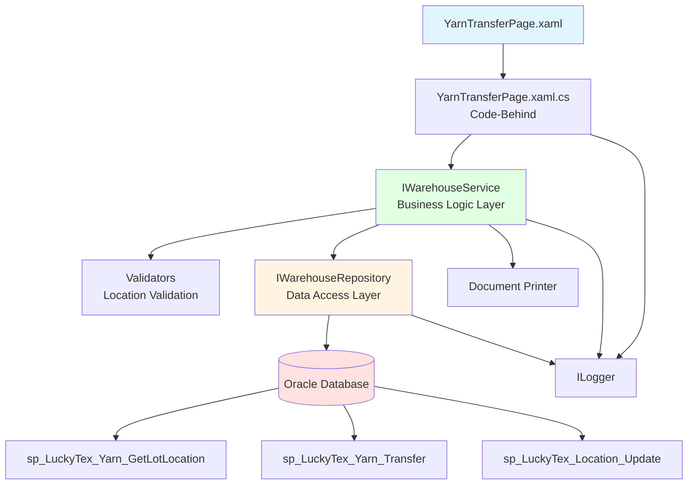
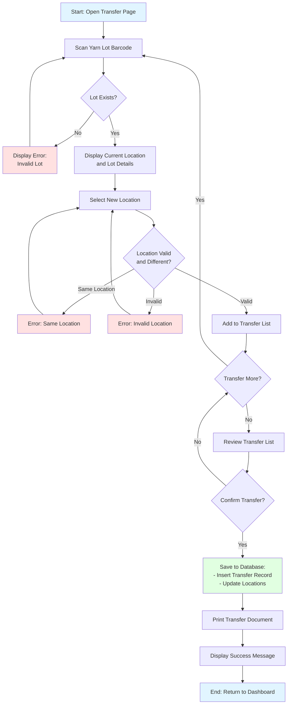
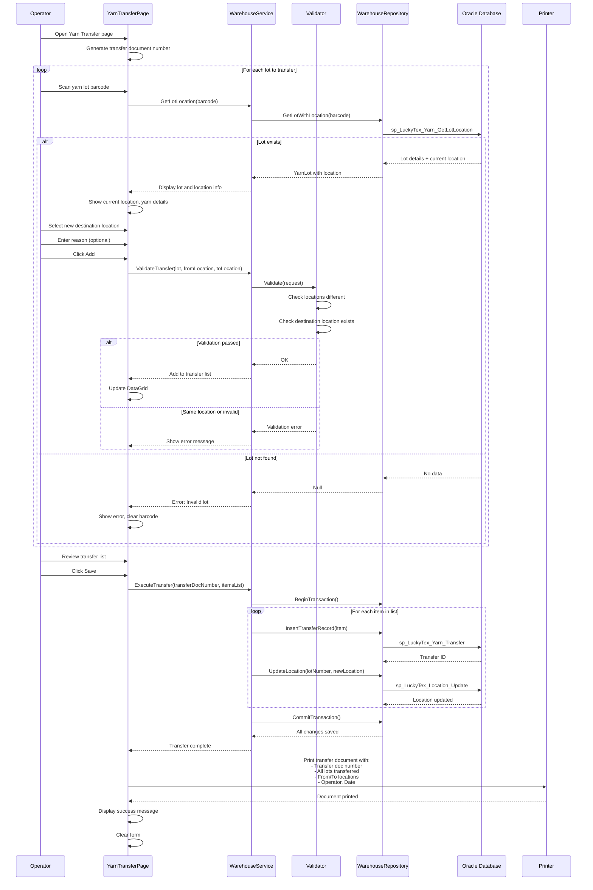

# Process: Yarn Transfer

**Process ID**: WH-003
**Module**: 01 - Warehouse
**Priority**: P1 (Foundation Module)
**Created**: 2025-10-05

---

## 1. Process Overview

### Purpose
Transfer yarn lots between warehouse locations or storage areas with updated location tracking and inventory accuracy.

### Scope
- Scan yarn lot barcode
- Verify current location
- Enter new destination location
- Update location records
- Maintain inventory accuracy
- Generate transfer document

### Module(s) Involved
- **Primary**: M01 - Warehouse
- **Related**: Inventory management, Location tracking

---

## 2. UI Files Inventory

### XAML Files
| File Path | Description | Purpose |
|-----------|-------------|---------|
| `LuckyTex.AirBag.Pages/Pages/01 - Warehouse/YarnTransferPage.xaml` | Yarn transfer screen (assumed) | Transfer lots between locations |
| `LuckyTex.AirBag.Pages/Pages/01 - Warehouse/WarehouseMenuPage.xaml` | Warehouse dashboard | Navigation hub |

### Code-Behind Files
| File Path | Description |
|-----------|-------------|
| `LuckyTex.AirBag.Pages/Pages/01 - Warehouse/YarnTransferPage.xaml.cs` | Event handlers and business logic (assumed) |

### Service Files
| File Path | Description |
|-----------|-------------|
| *(To be created)* `LuckyTex.AirBag.Core/Repositories/WarehouseRepository.cs` | Repository for warehouse operations |
| *(To be created)* `LuckyTex.AirBag.Core/Services/WarehouseService.cs` | Service layer for business logic |

---

## 3. UI Layout Description

### Yarn Transfer Screen

**Screen Title**: "Yarn Transfer" or "Location Transfer"

**Key UI Controls**:

**Header Section**:
- Transfer date display
- Operator information
- Transfer document number (auto-generated)

**Source Information Section**:
- Yarn lot barcode input textbox
  - KeyUp event: Enter key triggers lot lookup
- Display current location
- Display lot details (type, color, quantity)

**Destination Section**:
- New location dropdown or input
- Reason/remarks textbox

**Transfer List Section**:
- DataGrid showing transfer items
- Columns: Lot Number, Yarn Type, Quantity, From Location, To Location

**Action Buttons**:
- `cmdAdd` - Add lot to transfer list
- `cmdRemove` - Remove item from list
- `cmdSave` - Execute transfer and update locations
- `cmdPrint` - Print transfer document
- `cmdBack` - Return to dashboard

---

## 4. Component Architecture Diagram



---

## 5. Workflow Diagram



---

## 6. Business Logic Sequence Diagram



---

## 7. Data Flow

### Input Data
| Data Element | Source | Format | Validation |
|--------------|--------|--------|------------|
| Lot Barcode | Warehouse label | String, 30 chars | Must exist in system |
| Current Location | Database lookup | String | Auto-retrieved |
| New Location | Dropdown/input | String | Must be valid location code |
| Transfer Reason | Operator input (optional) | String, 100 chars | Optional |
| Transfer Date | System | DateTime | Auto-set to current |
| Operator ID | Login session | String | Valid employee |

### Output Data
| Data Element | Destination | Format | Purpose |
|--------------|-------------|--------|---------|
| Transfer Document Number | Database + Document | String (TRF-YYYY-MM-DD-####) | Unique transaction ID |
| Transfer Records | tblYarnTransfer | Database records | Transaction history |
| Location Updates | tblInventory | Location field update | Current location tracking |
| Transfer Document | Printer | Printed document | Audit trail |

### Data Transformations
1. **Transfer Date + Sequence → Doc Number**: Format as TRF-YYYY-MM-DD-####
2. **Old Location → New Location**: Update lot location field
3. **Transfer Record → Audit Trail**: Create movement history

---

## 8. Database Operations

### Stored Procedures Used

#### sp_LuckyTex_Yarn_GetLotLocation
- **Purpose**: Get lot details with current location
- **Parameters**: @LotNumber VARCHAR(30)
- **Returns**: YarnType, Color, Quantity, CurrentLocation
- **Tables Read**: tblYarnReceipt, tblInventory

#### sp_LuckyTex_Yarn_Transfer
- **Purpose**: Insert transfer record
- **Parameters**:
  - @TransferDocNumber VARCHAR(30)
  - @LotNumber VARCHAR(30)
  - @FromLocation VARCHAR(20)
  - @ToLocation VARCHAR(20)
  - @Reason VARCHAR(100)
  - @TransferDate DATETIME
  - @OperatorID VARCHAR(10)
- **Returns**: Transfer record ID
- **Tables Written**: tblYarnTransfer

#### sp_LuckyTex_Location_Update
- **Purpose**: Update lot location
- **Parameters**:
  - @LotNumber VARCHAR(30)
  - @NewLocation VARCHAR(20)
- **Returns**: Success flag
- **Tables Written**: tblInventory

### Transaction Scope
```
BEGIN TRANSACTION
  FOR EACH transferred lot:
    1. INSERT into tblYarnTransfer
    2. UPDATE tblInventory SET CurrentLocation = @NewLocation
COMMIT TRANSACTION
```

---

## 9. Implementation Checklist

### Phase 1: Repository Layer
- [ ] Extend `IWarehouseRepository` interface
  - [ ] GetLotWithLocation(string lotNumber) method
  - [ ] InsertTransferRecord(YarnTransfer transfer) method
  - [ ] UpdateLotLocation(string lot, string location) method
- [ ] Implement in `WarehouseRepository`
  - [ ] Map stored procedures
  - [ ] Transaction management
- [ ] Unit tests
  - [ ] Test location update
  - [ ] Test transaction rollback

### Phase 2: Service Layer
- [ ] Extend `IWarehouseService`
  - [ ] GetLotLocation(string barcode) method
  - [ ] ExecuteTransfer(TransferRequest request) method
  - [ ] ValidateTransfer(string lot, string from, string to) method
- [ ] Create `TransferRequestValidator`
  - [ ] Validate locations different
  - [ ] Validate destination exists
- [ ] Implement in `WarehouseService`
  - [ ] Transfer document number generation
  - [ ] Multi-lot transaction handling
- [ ] Unit tests

### Phase 3: UI Refactoring
- [ ] Create or update YarnTransferPage.xaml.cs
  - [ ] Inject IWarehouseService
  - [ ] Implement barcode scan handler
  - [ ] Implement Add/Save button handlers
- [ ] DataGrid binding
- [ ] Location dropdown population

### Phase 4: Integration Testing
- [ ] Test with real database
  - [ ] Valid transfers
  - [ ] Same location prevention
  - [ ] Multi-lot transaction
- [ ] Document printing
- [ ] Performance testing

### Phase 5: Deployment
- [ ] Code review
- [ ] Tests passing
- [ ] UAT
- [ ] Production deployment

---

---

## 10. UI Input Logic Analysis

### Summary

The Yarn Transfer process (implementation pending) will require the following UI validation logic:

**Key Validation Rules:**
- Lot Number must exist in inventory system
- Current location must be verified before transfer
- Destination location must be different from current location
- Destination location must be valid warehouse location code
- Transfer reason required for audit trail

**Expected State Management:**
- Lot barcode input → triggers location lookup
- Current location displayed (read-only)
- Destination location dropdown (or validated input)
- Transfer list in DataGrid with multi-lot support
- Running total of lots to transfer

**Expected User Workflows:**
1. **Single Lot Transfer**: Scan lot → Select new location → Add → Save
2. **Bulk Transfer**: Scan multiple lots to same destination → Review list → Save
3. **Inter-Warehouse Transfer**: Scan lot → Select destination warehouse + location → Approve → Save

**Implementation Notes:**
- No actual implementation file found in codebase (YarnTransferPage.xaml not located)
- Process may be handled through manual location updates or external system
- Recommended to implement as separate module with location master data integration
- Should include transfer document printing for material movement tracking

---

**Document Version**: 1.1
**Last Updated**: 2025-10-06
**Status**: Conceptual Design + UI Logic Planning
**Estimated Effort**: 1 day (1 developer)
