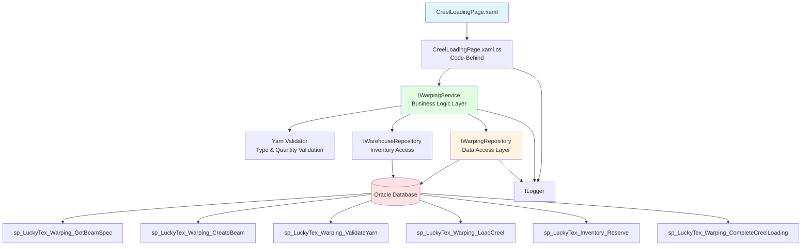
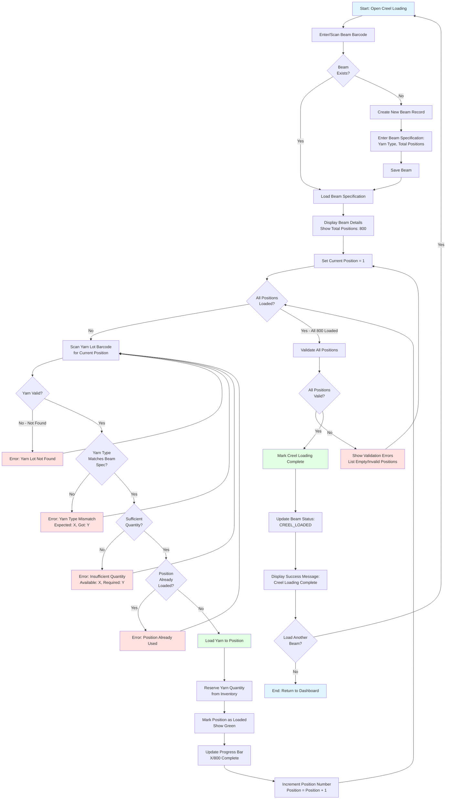

# Process: Creel Loading

**Process ID**: WP-001
**Module**: 02 - Warping
**Priority**: P2 (Production Module)
**Created**: 2025-10-05

---

## 1. Process Overview

### Purpose
Load yarn lots from warehouse inventory onto creel positions (typically 800 positions) in preparation for warping production, with validated yarn compatibility, sufficient quantity checks, and complete material traceability.

### Scope
- Scan warp beam barcode or create new beam
- Load beam specifications (yarn type, total positions)
- Scan yarn lots for each creel position (1-800)
- Validate yarn type compatibility with beam specification
- Verify sufficient yarn quantity for production
- Prevent duplicate position assignments
- Reserve yarn quantities from inventory
- Track all yarn lots used in beam
- Generate creel loading completion status

### Module(s) Involved
- **Primary**: M02 - Warping
- **Upstream**: M01 - Warehouse (yarn lots)
- **Downstream**: M02 - Warping Production (uses loaded creel)

---

## 2. UI Files Inventory

### XAML Files
| File Path | Description | Purpose |
|-----------|-------------|---------|
| `LuckyTex.AirBag.Pages/Pages/02 - Warping/CreelLoadingPage.xaml` | Creel loading screen | Main creel loading interface |
| `LuckyTex.AirBag.Pages/Pages/02 - Warping/WarpingMenuPage.xaml` | Warping dashboard | Navigation hub |

### Code-Behind Files
| File Path | Description |
|-----------|-------------|
| `LuckyTex.AirBag.Pages/Pages/02 - Warping/CreelLoadingPage.xaml.cs` | Creel loading logic |
| `LuckyTex.AirBag.Pages/Pages/02 - Warping/WarpingMenuPage.xaml.cs` | Dashboard navigation |

### Service Files
| File Path | Description |
|-----------|-------------|
| *(Existing)* `LuckyTex.AirBag.Core/Services/DataService/WarpingDataService.cs` | Current singleton service |
| *(To be created)* `LuckyTex.AirBag.Core/Repositories/IWarpingRepository.cs` | Repository interface |
| *(To be created)* `LuckyTex.AirBag.Core/Repositories/WarpingRepository.cs` | Repository implementation |
| *(To be created)* `LuckyTex.AirBag.Core/Services/IWarpingService.cs` | Service interface |
| *(To be created)* `LuckyTex.AirBag.Core/Services/WarpingService.cs` | Service implementation |

---

## 3. UI Layout Description

### CreelLoadingPage.xaml

**Screen Title**: "Creel Loading"

**Key UI Controls**:

**Header Section**:
- Loading date display
- Shift and operator information

**Beam Information Section** (Top Left):
- Warp beam barcode input (`txtBeamBarcode`)
  - KeyUp event: Enter key triggers beam lookup or creation
- Beam details display (read-only):
  - Beam ID
  - Yarn Type (specification)
  - Yarn Count
  - Total Positions (e.g., 800)
  - Status

**Creel Position Loading Section** (Top Right):
- Current position input (`txtPosition`)
  - Numeric, 1-800
  - Auto-increment after successful load
- Yarn lot barcode input (`txtYarnLotBarcode`)
  - KeyUp event: Enter key triggers yarn validation and loading
- Quick navigation: Jump to position button

**Yarn Lot Validation Display**:
- Yarn type (from scanned lot)
- Yarn color
- Supplier
- Available quantity
- Match indicator (✓ Compatible or ✗ Mismatch)

**Creel Position Grid** (Main area):
- DataGrid or visual grid showing all positions
- Columns:
  - Position Number (1-800)
  - Yarn Lot Barcode
  - Yarn Type
  - Color
  - Status (Loaded=Green, Empty=Gray, Error=Red)
- Click position to jump to it
- Visual progress indicator (e.g., 452/800 loaded)

**Progress Section** (Bottom Left):
- Progress bar: Loaded positions / Total positions
- Percentage complete
- Estimated time remaining (if available)

**Action Buttons** (Bottom Right):
- `cmdValidateAll` - Validate all loaded positions
- `cmdComplete` - Mark creel loading as complete (enabled when all positions loaded)
- `cmdClear` - Clear all positions and start over
- `cmdBack` - Return to dashboard

**Data Binding Points**:
- Beam barcode → Beam lookup/create
- Yarn lot barcode → Yarn validation
- Position grid → Creel position collection
- Progress → Calculated from loaded positions

---

## 4. Component Architecture Diagram



---

## 5. Workflow Diagram



---

## 6. Business Logic Sequence Diagram

```mermaid
sequenceDiagram
    participant Operator
    participant UI as CreelLoadingPage
    participant BL as WarpingService
    participant VAL as YarnValidator
    participant REPO as WarpingRepository
    participant INV_REPO as WarehouseRepository
    participant DB as Oracle Database

    Operator->>UI: Open Creel Loading page
    UI->>UI: Clear all fields

    Operator->>UI: Enter/scan warp beam barcode
    UI->>BL: GetBeamSpecification(beamBarcode)
    BL->>REPO: GetBeamByBarcode(beamBarcode)
    REPO->>DB: sp_LuckyTex_Warping_GetBeamSpec

    alt Beam exists
        DB-->>REPO: Beam spec (YarnType, YarnCount, TotalPositions: 800, Status)
        REPO-->>BL: Beam entity
        BL-->>UI: Display beam specification
        UI->>UI: Show: Beam ID, Yarn Type, Total Positions: 800
        UI->>UI: Set current position = 1
    else Beam does not exist
        DB-->>REPO: No data
        REPO-->>BL: Beam not found
        BL-->>UI: Beam not found
        UI->>UI: Prompt: "Create new beam?"
        Operator->>UI: Click Yes
        UI->>UI: Show beam creation form
        Operator->>UI: Enter yarn type, yarn count, total positions
        Operator->>UI: Click Create
        UI->>BL: CreateBeam(beamBarcode, yarnType, yarnCount, totalPositions)
        BL->>REPO: InsertBeam(beam)
        REPO->>DB: sp_LuckyTex_Warping_CreateBeam
        DB-->>REPO: Beam created
        REPO-->>BL: Success
        BL-->>UI: Beam created successfully
        UI->>UI: Display beam specification
        UI->>UI: Set current position = 1
    end

    loop For each position (1 to 800)
        UI->>UI: Display current position number
        UI->>UI: Focus on yarn lot barcode input

        Operator->>UI: Scan yarn lot barcode
        UI->>BL: ValidateYarnForCreel(beamBarcode, yarnLotBarcode, position)
        BL->>REPO: GetYarnLotDetails(yarnLotBarcode)
        REPO->>DB: sp_LuckyTex_Warping_ValidateYarn

        alt Yarn lot exists
            DB-->>REPO: Yarn details (YarnType, Color, Supplier, AvailableQty)
            REPO-->>BL: Yarn lot entity
            BL->>VAL: Validate(yarnLot, beamSpec)
            VAL->>VAL: Check yarnLot.YarnType == beamSpec.YarnType
            VAL->>VAL: Check yarnLot.AvailableQty >= requiredQty (calculated)

            alt Yarn type matches
                alt Sufficient quantity
                    VAL-->>BL: Validation OK
                    BL->>REPO: CheckPositionDuplicate(beamBarcode, position)
                    REPO->>DB: SELECT FROM tblCreelLoading WHERE BeamBarcode=@Beam AND Position=@Position

                    alt Position not used
                        DB-->>REPO: No duplicate
                        REPO-->>BL: Position available
                        BL->>REPO: InsertCreelPosition(beamBarcode, position, yarnLotBarcode)
                        REPO->>DB: sp_LuckyTex_Warping_LoadCreel
                        DB-->>REPO: Position loaded

                        BL->>INV_REPO: ReserveYarnQuantity(yarnLotBarcode, requiredQty)
                        INV_REPO->>DB: sp_LuckyTex_Inventory_Reserve
                        DB-->>INV_REPO: Quantity reserved

                        INV_REPO-->>BL: Inventory updated
                        REPO-->>BL: Creel position loaded
                        BL-->>UI: Position loaded successfully
                        UI->>UI: Update position grid: Position X = Loaded (Green)
                        UI->>UI: Update progress: X/800 positions loaded
                        UI->>UI: Increment position: currentPosition++
                        UI->>UI: Clear yarn barcode input, refocus
                    else Position already used
                        DB-->>REPO: Duplicate position found
                        REPO-->>BL: Error: Position already loaded
                        BL-->>UI: Error message
                        UI->>UI: Show error: "Position [X] already used"
                    end
                else Insufficient quantity
                    VAL-->>BL: Error: Insufficient quantity
                    BL-->>UI: Error message
                    UI->>UI: Show error: "Insufficient yarn. Available: [X]kg, Required: [Y]kg"
                end
            else Yarn type mismatch
                VAL-->>BL: Error: Yarn type mismatch
                BL-->>UI: Error message
                UI->>UI: Show error: "Yarn type mismatch. Expected: [SpecType], Got: [LotType]"
            end
        else Yarn lot not found
            DB-->>REPO: No data
            REPO-->>BL: Yarn lot not found
            BL-->>UI: Error message
            UI->>UI: Show error: "Yarn lot not found: [Barcode]"
        end
    end

    Operator->>UI: All 800 positions loaded
    Operator->>UI: Click "Validate All"

    UI->>BL: ValidateAllCreelPositions(beamBarcode)
    BL->>REPO: GetAllCreelPositions(beamBarcode)
    REPO->>DB: SELECT FROM tblCreelLoading WHERE BeamBarcode=@Beam ORDER BY Position
    DB-->>REPO: All position records
    REPO-->>BL: List of creel positions
    BL->>VAL: ValidateCompleteness(positions, expectedTotal: 800)
    VAL->>VAL: Check count == 800
    VAL->>VAL: Check all positions 1-800 present (no gaps)

    alt All positions valid
        VAL-->>BL: Validation OK
        BL-->>UI: All positions validated
        UI->>UI: Show success: "All 800 positions loaded and validated ✓"
        UI->>UI: Enable "Complete" button

        Operator->>UI: Click "Complete"

        UI->>BL: CompleteCreelLoading(beamBarcode, operatorID)
        BL->>REPO: UpdateBeamStatus(beamBarcode, "CREEL_LOADED")
        REPO->>DB: UPDATE tblBeam SET Status='CREEL_LOADED', CreelLoadedBy=@Operator, CreelLoadedDate=GETDATE()
        DB-->>REPO: Beam status updated

        BL->>REPO: InsertCreelLoadingCompletion(beamBarcode, operatorID)
        REPO->>DB: sp_LuckyTex_Warping_CompleteCreelLoading
        DB-->>REPO: Completion recorded

        REPO-->>BL: Creel loading complete
        BL-->>UI: Success
        UI->>UI: Display success message: "Creel loading complete. Beam ready for warping production."
        UI->>UI: Clear all fields
        UI->>UI: Ask: "Load another beam?"
    else Validation failed (missing positions or gaps)
        VAL-->>BL: Validation errors (list of missing positions)
        BL-->>UI: Error list
        UI->>UI: Show error: "Incomplete creel loading. Missing positions: [list]"
        UI->>UI: Highlight missing positions in grid
    end
```



---

## 7. Data Flow

### Input Data
| Data Element | Source | Format | Validation |
|--------------|--------|--------|------------|
| Beam Barcode | Operator input | String, 20 chars | Create if not exists |
| Yarn Type (if new beam) | Operator input | String, 50 chars | Required for new beam |
| Total Positions (if new beam) | Operator input | Integer | Typically 800 |
| Position Number | Auto-increment or manual | Integer (1-800) | Required, unique per beam |
| Yarn Lot Barcode | Operator scan | String, 30 chars | Must exist in inventory |
| Operator ID | Login session | String | Valid employee |
| Shift | Login session | String | Current shift |

### Output Data
| Data Element | Destination | Format | Purpose |
|--------------|-------------|--------|---------|
| Beam Record | tblBeam | Database row | Beam master record |
| Creel Position Records | tblCreelLoading | Database rows (800 rows) | Position-to-yarn mapping |
| Inventory Reservations | tblInventory | Quantity reserved | Reserved yarn for warping |
| Beam Status Update | tblBeam | Status = CREEL_LOADED | Mark creel ready for production |
| Progress Indicator | UI | X/800 positions | User feedback |

### Data Transformations
1. **Position Progress**: Loaded count / Total positions × 100 = Percentage
2. **Yarn Reservation**: Calculate required quantity based on beam length and yarn specs
3. **Beam Status**: NEW → CREEL_LOADING → CREEL_LOADED
4. **Validation Result**: All positions loaded AND all yarn valid = Complete

---

## 8. Database Operations

### Stored Procedures Used

#### sp_LuckyTex_Warping_GetBeamSpec
- **Purpose**: Retrieve beam specification
- **Parameters**: @BeamBarcode VARCHAR(20)
- **Returns**: BeamBarcode, YarnType, YarnCount, TotalPositions, Status
- **Tables Read**: tblBeam

#### sp_LuckyTex_Warping_CreateBeam
- **Purpose**: Create new warp beam record
- **Parameters**:
  - @BeamBarcode VARCHAR(20)
  - @YarnType VARCHAR(50)
  - @YarnCount VARCHAR(20)
  - @TotalPositions INT
  - @CreatedBy VARCHAR(10)
- **Returns**: Success flag
- **Tables Written**: tblBeam

#### sp_LuckyTex_Warping_ValidateYarn
- **Purpose**: Get yarn lot details for validation
- **Parameters**: @YarnLotBarcode VARCHAR(30)
- **Returns**: YarnType, Color, Supplier, AvailableQty
- **Tables Read**: tblYarnReceipt, tblInventory

#### sp_LuckyTex_Warping_LoadCreel
- **Purpose**: Insert creel position record
- **Parameters**:
  - @BeamBarcode VARCHAR(20)
  - @Position INT
  - @YarnLotBarcode VARCHAR(30)
  - @LoadedBy VARCHAR(10)
  - @LoadedDate DATETIME
- **Returns**: Success flag
- **Tables Written**: tblCreelLoading

#### sp_LuckyTex_Inventory_Reserve
- **Purpose**: Reserve yarn quantity from inventory
- **Parameters**:
  - @YarnLotBarcode VARCHAR(30)
  - @ReservedQty DECIMAL(10,2)
  - @ReservedFor VARCHAR(50) -- Beam barcode
- **Returns**: Success flag
- **Tables Written**: tblInventory (update reserved quantity)

#### sp_LuckyTex_Warping_CompleteCreelLoading
- **Purpose**: Mark creel loading as complete
- **Parameters**:
  - @BeamBarcode VARCHAR(20)
  - @CompletedBy VARCHAR(10)
  - @CompletionDate DATETIME
- **Returns**: Success flag
- **Tables Written**: tblBeam (update status), tblCreelLoadingCompletion

### Table Operations

**tblBeam**:
- INSERT: New beam record (if not exists)
- UPDATE: Status (CREEL_LOADED)

**tblCreelLoading**:
- INSERT: 800 position records (1 per position)

**tblInventory**:
- UPDATE: Reserved quantity for each yarn lot

### Transaction Scope
For each position load:
```
BEGIN TRANSACTION
  1. INSERT creel position into tblCreelLoading
  2. UPDATE tblInventory SET ReservedQty = ReservedQty + @RequiredQty
COMMIT TRANSACTION
```

For completion:
```
BEGIN TRANSACTION
  1. UPDATE tblBeam SET Status = 'CREEL_LOADED'
  2. INSERT into tblCreelLoadingCompletion
COMMIT TRANSACTION
```

---

## 9. Implementation Checklist

### Phase 1: Repository Layer
- [ ] Create `WarpBeam` entity model
  - [ ] Properties: BeamBarcode, YarnType, YarnCount, TotalPositions, Status
- [ ] Create `CreelPosition` entity model
  - [ ] Properties: BeamBarcode, Position, YarnLotBarcode, LoadedBy, LoadedDate
- [ ] Create `IWarpingRepository` interface
  - [ ] GetBeamByBarcode(string barcode) method
  - [ ] InsertBeam(WarpBeam beam) method
  - [ ] GetYarnLotDetails(string yarnLotBarcode) method
  - [ ] CheckPositionDuplicate(string beam, int position) method
  - [ ] InsertCreelPosition(CreelPosition position) method
  - [ ] GetAllCreelPositions(string beamBarcode) method
  - [ ] UpdateBeamStatus(string barcode, string status) method
  - [ ] InsertCreelLoadingCompletion(string beam, string operator) method
- [ ] Create `IWarehouseRepository` interface extension
  - [ ] ReserveYarnQuantity(string yarnLot, decimal qty) method
- [ ] Implement repositories
  - [ ] Map all stored procedures
  - [ ] Transaction handling for position load
- [ ] Unit tests for repository

### Phase 2: Service Layer
- [ ] Create `IWarpingService` interface
  - [ ] GetBeamSpecification(string barcode) method
  - [ ] CreateBeam(WarpBeam beam) method
  - [ ] ValidateYarnForCreel(string beam, string yarnLot, int position) method
  - [ ] LoadCreelPosition(string beam, int position, string yarnLot) method
  - [ ] ValidateAllCreelPositions(string beamBarcode) method
  - [ ] CompleteCreelLoading(string beamBarcode, string operatorID) method
- [ ] Create `YarnValidator` using FluentValidation
  - [ ] Validate yarn type match
  - [ ] Validate sufficient quantity
- [ ] Create `CreelValidator`
  - [ ] Validate position range (1-800)
  - [ ] Validate no duplicate positions
  - [ ] Validate all positions loaded (completeness)
- [ ] Implement `WarpingService`
  - [ ] Constructor with repositories, validators, ILogger
  - [ ] Validation before loading position
  - [ ] Return ServiceResult
- [ ] Unit tests for service

### Phase 3: UI Refactoring
- [ ] Update `CreelLoadingPage.xaml.cs`
  - [ ] Remove DataService.Instance calls
  - [ ] Inject IWarpingService
  - [ ] Update txtBeamBarcode_KeyUp to call GetBeamSpecification or CreateBeam
  - [ ] Update txtYarnLotBarcode_KeyUp to call ValidateYarnForCreel and LoadCreelPosition
  - [ ] Auto-increment position after successful load
  - [ ] Update cmdValidateAll_Click to call ValidateAllCreelPositions
  - [ ] Update cmdComplete_Click to call CompleteCreelLoading
  - [ ] Handle ServiceResult
  - [ ] Update progress bar in real-time
- [ ] XAML data binding
  - [ ] Bind position grid to ObservableCollection<CreelPosition>
  - [ ] Bind progress bar (loaded/total)
  - [ ] Value converter for position status color
- [ ] Add loading indicators
- [ ] User-friendly error messages

### Phase 4: Integration Testing
- [ ] Test with real database
  - [ ] Create new beam (success)
  - [ ] Load existing beam (success)
  - [ ] Scan valid yarn lot (success, position loaded)
  - [ ] Scan yarn with type mismatch (error)
  - [ ] Scan yarn with insufficient quantity (error)
  - [ ] Scan same position twice (error - duplicate)
  - [ ] Load all 800 positions (success)
  - [ ] Validate all positions (success)
  - [ ] Complete creel loading (success)
  - [ ] Verify beam status = CREEL_LOADED
  - [ ] Verify inventory reserved quantities
- [ ] Progress tracking
  - [ ] Progress bar updates correctly
  - [ ] Position auto-increment
  - [ ] Grid visual indicators (green/gray/red)
- [ ] Error scenarios
  - [ ] Transaction rollback on error
  - [ ] Validation incomplete (missing positions)
- [ ] Performance testing
  - [ ] Load 800 positions (acceptable time)
  - [ ] Validation of 800 positions < 2 seconds

### Phase 5: Deployment Preparation
- [ ] Code review completed
- [ ] Unit tests passing (80%+ coverage)
- [ ] Integration tests passing
- [ ] Documentation updated
- [ ] UAT completed
- [ ] Production deployment checklist ready

---

**Document Version**: 1.0
**Last Updated**: 2025-10-05
**Status**: Ready for Implementation
**Estimated Effort**: 4-5 days (1 developer)
**Dependencies**: M01 - Warehouse (yarn lots must exist in inventory)
**Critical Business Rules**:
- Typical creel has 800 positions (configurable per beam)
- Each position must be loaded with compatible yarn lot
- Yarn type must match beam specification exactly
- Sufficient quantity must be available in inventory
- No duplicate position assignments allowed
- All positions must be loaded before creel loading can be completed
- Yarn quantities are reserved (not consumed) until warping production
- Complete traceability: beam → 800 positions → yarn lots
