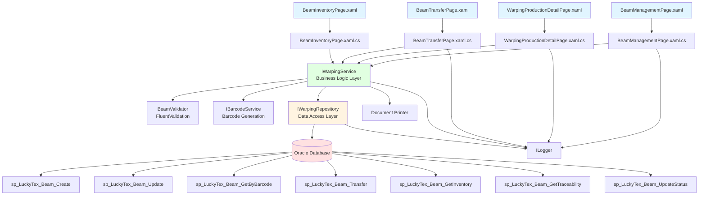

# Process: Beam Management

**Process ID**: WP-003
**Module**: 02 - Warping
**Priority**: P1 (Foundation Module)
**Created**: 2025-10-06

---

## 1. Process Overview

### Purpose
Manage warp beam lifecycle from creation during warping production to transfer to downstream processes (Beaming/Drawing/Weaving), including beam information maintenance, quality tracking, and inventory status management.

### Scope
- Create beam record upon warping completion
- Generate unique beam barcode
- Record beam specifications (length, width, yarn composition)
- Track beam quality parameters (tension, defects)
- Manage beam inventory status (Available, In Use, Depleted, Scrapped)
- Transfer beams to downstream departments
- Maintain complete traceability to source yarn lots
- Handle beam adjustments and rework

### Module(s) Involved
- **Primary**: M02 - Warping
- **Upstream**: M01 - Warehouse (yarn lot traceability)
- **Downstream**: M03 - Beaming, M04 - Drawing, M05 - Weaving (beam consumption)

---

## 2. UI Files Inventory

### XAML Files
| File Path | Description | Purpose |
|-----------|-------------|---------|
| `LuckyTex.AirBag.Pages/Pages/02 - Warping/BeamManagementPage.xaml` | Beam master data management | CRUD operations for beam records |
| `LuckyTex.AirBag.Pages/Pages/02 - Warping/WarpingProductionDetailPage.xaml` | Warping production screen | Creates beam records upon production completion |
| `LuckyTex.AirBag.Pages/Pages/02 - Warping/BeamTransferPage.xaml` | Beam transfer to downstream | Issue beams to other departments |
| `LuckyTex.AirBag.Pages/Pages/02 - Warping/BeamInventoryPage.xaml` | Beam inventory dashboard | View beam stock levels and status |
| `LuckyTex.AirBag.Pages/Pages/02 - Warping/WarpingMenuPage.xaml` | Warping module dashboard | Navigation hub |

### Code-Behind Files
| File Path | Description |
|-----------|-------------|
| `LuckyTex.AirBag.Pages/Pages/02 - Warping/BeamManagementPage.xaml.cs` | Beam CRUD event handlers |
| `LuckyTex.AirBag.Pages/Pages/02 - Warping/WarpingProductionDetailPage.xaml.cs` | Production completion logic |
| `LuckyTex.AirBag.Pages/Pages/02 - Warping/BeamTransferPage.xaml.cs` | Beam transfer logic |
| `LuckyTex.AirBag.Pages/Pages/02 - Warping/BeamInventoryPage.xaml.cs` | Inventory display logic |

### Service Files
| File Path | Description |
|-----------|-------------|
| *(To be created)* `LuckyTex.AirBag.Core/Repositories/WarpingRepository.cs` | Repository for warping and beam operations |
| *(To be created)* `LuckyTex.AirBag.Core/Services/WarpingService.cs` | Service layer for warping business logic |
| *(To be created)* `LuckyTex.AirBag.Core/Services/BarcodeService.cs` | Barcode generation service |
| *(To be created)* `LuckyTex.AirBag.Core/Validators/BeamValidator.cs` | FluentValidation for beam records |

---

## 3. UI Layout Description

### BeamManagementPage.xaml

**Screen Title**: "Beam Management" or "Warp Beam Master Data"

**Key UI Controls**:

**Search Section**:
- Beam barcode search textbox
  - KeyUp event: Enter key triggers beam lookup
- Date range filter (From/To)
- Machine filter dropdown
- Status filter dropdown (All, Available, In Use, Depleted, Scrapped)
- `cmdSearch` - Execute search

**Beam Details Section** (Read-only display or edit mode):
- Beam barcode (auto-generated, format: WB-YYYYMMDD-####)
- Production date and shift
- Machine ID
- Warp plan reference
- Yarn composition display (from creel data)
- Beam specifications:
  - Length (meters) - calculated from PLC meter counter
  - Width (cm)
  - Number of ends (yarn count)
  - Target tension (N)
  - Actual average tension (N) - from production
- Quality parameters:
  - Defect count
  - Defect types breakdown
  - Quality grade (A, B, C)
- Inventory status dropdown
- Location in warehouse
- Remarks textbox

**Traceability Section**:
- DataGrid showing source yarn lots
  - Columns: Lot Number, Yarn Type, Color, Supplier, Quantity Used (kg), Position Range (1-800)
  - Read-only

**Beam History Section**:
- DataGrid showing beam usage history
  - Columns: Date, Transaction Type (Created, Transferred, Consumed, Adjusted), Department, Machine, Quantity (if partial), Operator, Remarks

**Action Buttons**:
- `cmdNew` - Create new beam record (manual entry, rare)
- `cmdEdit` - Edit selected beam (limited fields editable)
- `cmdSave` - Save changes
- `cmdDelete` - Mark beam as scrapped (soft delete)
- `cmdPrint` - Print beam label/report
- `cmdTransfer` - Open beam transfer page
- `cmdBack` - Return to dashboard

### WarpingProductionDetailPage.xaml (Beam Creation Section)

**Beam Creation on Production Stop**:
- Display production summary:
  - Total meters produced (from PLC)
  - Production duration
  - Average speed
  - Defect count
- `cmdCompleteProduction` button
  - Generates beam barcode
  - Creates beam record
  - Updates yarn lot inventory (deduct consumed quantities)
  - Links traceability

### BeamTransferPage.xaml

**Screen Title**: "Beam Transfer to Downstream Process"

**Key UI Controls**:
- Beam barcode scan textbox
- Display beam details (read-only)
- Destination department dropdown (Beaming, Drawing, Weaving)
- Target machine selection
- Transfer quantity (for partial beams, optional)
- Transfer date (default: today)
- Remarks
- Transfer list DataGrid
- `cmdAdd` - Add beam to transfer list
- `cmdRemove` - Remove from list
- `cmdSave` - Confirm transfer
- `cmdPrint` - Print transfer document

### BeamInventoryPage.xaml

**Screen Title**: "Warp Beam Inventory Dashboard"

**Key UI Controls**:
- Summary cards:
  - Total beams available
  - Total meters available
  - Beams in use
  - Beams depleted (last 7 days)
- Filters: Machine, Date range, Status
- DataGrid showing all beams:
  - Columns: Barcode, Production Date, Machine, Length (m), Width (cm), Ends, Status, Location, Age (days)
- `cmdRefresh` - Reload data
- `cmdExport` - Export to Excel

---

## 4. Component Architecture Diagram



---

## 5. Workflow Diagram

```mermaid
graph TD
    START[Start: Warping Production Complete] --> PLC_STOP[PLC Status = Stopped]
    PLC_STOP --> DISPLAY_SUMMARY[Display Production Summary:<br/>- Total Meters<br/>- Duration<br/>- Defects<br/>- Average Speed]

    DISPLAY_SUMMARY --> CONFIRM{Operator Confirms<br/>Production Complete?}
    CONFIRM -->|No| RESUME[Resume Production]
    RESUME --> PLC_STOP

    CONFIRM -->|Yes| GEN_BARCODE[Generate Beam Barcode:<br/>WB-YYYYMMDD-####]
    GEN_BARCODE --> CREATE_BEAM[Create Beam Record:<br/>- Barcode<br/>- Length from PLC<br/>- Yarn Composition<br/>- Quality Data]

    CREATE_BEAM --> LINK_TRACE[Link Traceability:<br/>Beam → Yarn Lots from Creel]
    LINK_TRACE --> DEDUCT_INV[Deduct Yarn Lot Inventory:<br/>Consumed Quantities]

    DEDUCT_INV --> PRINT_LABEL[Print Beam Label:<br/>Barcode + Specs]
    PRINT_LABEL --> UPDATE_STATUS[Set Beam Status = Available]

    UPDATE_STATUS --> SUCCESS[Success: Beam Created]
    SUCCESS --> NEXT{Continue?}

    NEXT -->|Transfer Beam| TRANSFER_FLOW[Go to Beam Transfer]
    NEXT -->|New Production| START
    NEXT -->|End Shift| END[End: Return to Dashboard]

    TRANSFER_FLOW --> SCAN_BEAM[Scan Beam Barcode]
    SCAN_BEAM --> VALIDATE{Beam Status<br/>= Available?}
    VALIDATE -->|No| ERROR1[Error: Beam Not Available]
    ERROR1 --> SCAN_BEAM

    VALIDATE -->|Yes| SELECT_DEST[Select Destination:<br/>Beaming/Drawing/Weaving]
    SELECT_DEST --> SELECT_MACHINE[Select Target Machine]
    SELECT_MACHINE --> PARTIAL{Partial Transfer?}

    PARTIAL -->|Yes| ENTER_QTY[Enter Transfer Quantity]
    PARTIAL -->|No| FULL[Transfer Full Beam]

    ENTER_QTY --> VALIDATE_QTY{Qty <= Beam Length?}
    VALIDATE_QTY -->|No| ERROR2[Error: Invalid Quantity]
    ERROR2 --> ENTER_QTY

    VALIDATE_QTY -->|Yes| ADD_LIST[Add to Transfer List]
    FULL --> ADD_LIST

    ADD_LIST --> MORE{Transfer More?}
    MORE -->|Yes| SCAN_BEAM
    MORE -->|No| SAVE_TRANSFER[Save Transfer Records]

    SAVE_TRANSFER --> UPDATE_BEAM_STATUS[Update Beam Status:<br/>Full = In Use<br/>Partial = Available<br/>Reduce Remaining Length]

    UPDATE_BEAM_STATUS --> PRINT_TRANSFER[Print Transfer Document]
    PRINT_TRANSFER --> TRANSFER_SUCCESS[Transfer Complete]
    TRANSFER_SUCCESS --> END

    style START fill:#e1f5ff
    style SUCCESS fill:#e1ffe1
    style TRANSFER_SUCCESS fill:#e1ffe1
    style END fill:#e1f5ff
    style ERROR1 fill:#ffe1e1
    style ERROR2 fill:#ffe1e1
```



---

## 6. Business Logic Sequence Diagram

```mermaid
sequenceDiagram
    participant Operator
    participant UI as WarpingProductionDetailPage
    participant BL as WarpingService
    participant VAL as BeamValidator
    participant BARCODE as BarcodeService
    participant REPO as WarpingRepository
    participant DB as Oracle Database
    participant PLC as Warping PLC
    participant Printer

    Note over Operator,Printer: Beam Creation on Production Completion

    Operator->>UI: Click "Complete Production"
    UI->>PLC: Read final meter counter
    PLC-->>UI: Total meters produced

    UI->>UI: Display production summary
    UI->>Operator: Confirm completion?
    Operator->>UI: Confirm

    UI->>BARCODE: GenerateBeamBarcode(date, machine)
    BARCODE->>BARCODE: Format: WB-YYYYMMDD-####
    BARCODE->>REPO: GetNextSequenceNumber(date)
    REPO->>DB: SELECT MAX(seq) FROM tblBeam WHERE date = @date
    DB-->>REPO: Last sequence number
    REPO-->>BARCODE: Next sequence
    BARCODE-->>UI: Barcode (e.g., WB-20251006-0042)

    UI->>BL: CreateBeam(beamRequest)
    Note over beamRequest: barcode, length, width, ends,<br/>yarnComposition, defects,<br/>machineId, warpPlanId

    BL->>VAL: Validate(beamRequest)
    VAL->>VAL: Check length > 0
    VAL->>VAL: Check ends > 0
    VAL->>VAL: Check yarn composition not empty

    alt Validation passed
        VAL-->>BL: OK

        BL->>REPO: BeginTransaction()

        BL->>REPO: InsertBeam(beam)
        REPO->>DB: sp_LuckyTex_Beam_Create
        Note over DB: INSERT INTO tblBeam<br/>VALUES (barcode, length, width,<br/>ends, machineId, warpPlanId,<br/>status='Available', date, shift)
        DB-->>REPO: Beam ID

        BL->>REPO: GetCreelPositions(warpPlanId)
        REPO->>DB: sp_LuckyTex_Creel_GetPositions
        DB-->>REPO: List of yarn lots and positions

        loop For each yarn lot used
            BL->>REPO: LinkBeamToYarnLot(beamId, lotNumber, quantity)
            REPO->>DB: sp_LuckyTex_Traceability_Link
            Note over DB: INSERT INTO tblBeamTraceability<br/>(beamId, yarnLotNumber, qtyUsed)
            DB-->>REPO: Link created

            BL->>REPO: DeductYarnInventory(lotNumber, qtyUsed)
            REPO->>DB: sp_LuckyTex_Inventory_Deduct
            DB-->>REPO: Inventory updated
        end

        BL->>REPO: InsertBeamHistory(beamId, 'CREATED')
        REPO->>DB: INSERT INTO tblBeamHistory
        DB-->>REPO: History record created

        BL->>REPO: CommitTransaction()
        REPO-->>BL: All changes saved
        BL-->>UI: Beam created successfully

        UI->>Printer: Print beam label with:<br/>- Barcode<br/>- Length, Width, Ends<br/>- Production Date<br/>- Yarn Composition
        Printer-->>UI: Label printed

        UI->>UI: Display success message
        UI->>UI: Clear form, ready for next production

    else Validation failed
        VAL-->>BL: Error: Invalid beam data
        BL-->>UI: Show validation errors
        UI->>UI: Highlight invalid fields
    end

    Note over Operator,Printer: Beam Transfer to Downstream

    Operator->>UI: Open Beam Transfer Page
    Operator->>UI: Scan beam barcode

    UI->>BL: GetBeamDetails(barcode)
    BL->>REPO: GetBeamByBarcode(barcode)
    REPO->>DB: sp_LuckyTex_Beam_GetByBarcode

    alt Beam exists and available
        DB-->>REPO: Beam details + status
        REPO-->>BL: Beam entity
        BL-->>UI: Display beam info
        UI->>UI: Show length, specs, status

        Operator->>UI: Select destination (e.g., Beaming)
        Operator->>UI: Select machine (e.g., BM-01)
        Operator->>UI: Enter quantity (optional, for partial)
        Operator->>UI: Click Add

        alt Partial transfer
            UI->>BL: ValidateTransferQuantity(barcode, qty)
            BL->>VAL: Validate transfer request
            VAL->>VAL: Check qty > 0
            VAL->>VAL: Check qty <= beam.RemainingLength

            alt Validation passed
                VAL-->>BL: OK
                BL-->>UI: Add to transfer list
                UI->>UI: Update DataGrid
            else Invalid quantity
                VAL-->>BL: Error: Quantity exceeds remaining
                BL-->>UI: Show error
                UI->>UI: Highlight quantity field
            end
        else Full transfer
            UI->>UI: Add full beam to transfer list
        end

    else Beam not found or not available
        DB-->>REPO: No data or status != 'Available'
        REPO-->>BL: Error
        BL-->>UI: Error: Invalid beam or not available
        UI->>UI: Show error, clear barcode
    end

    Operator->>UI: Review transfer list
    Operator->>UI: Click Save

    UI->>BL: TransferBeams(transferRequest)
    BL->>REPO: BeginTransaction()

    loop For each beam in list
        BL->>REPO: InsertTransferRecord(transfer)
        REPO->>DB: sp_LuckyTex_Beam_Transfer
        Note over DB: INSERT INTO tblBeamTransfer<br/>(beamBarcode, destination,<br/>machine, quantity, date)
        DB-->>REPO: Transfer ID

        alt Full transfer
            BL->>REPO: UpdateBeamStatus(barcode, 'In Use')
            REPO->>DB: UPDATE tblBeam SET status='In Use'
        else Partial transfer
            BL->>REPO: UpdateBeamRemainingLength(barcode, qty)
            REPO->>DB: UPDATE tblBeam<br/>SET remainingLength = remainingLength - qty
        end

        BL->>REPO: InsertBeamHistory(beamId, 'TRANSFERRED')
        REPO->>DB: INSERT INTO tblBeamHistory
    end

    BL->>REPO: CommitTransaction()
    REPO-->>BL: All changes saved
    BL-->>UI: Transfer complete

    UI->>Printer: Print transfer document with:<br/>- Transfer ID<br/>- Beams transferred<br/>- Destination<br/>- Date, Operator
    Printer-->>UI: Document printed

    UI->>UI: Display success message
    UI->>UI: Clear transfer list
```



---

## 7. Data Flow

### Input Data

#### Beam Creation (from Warping Production)
| Data Element | Source | Format | Validation |
|--------------|--------|--------|------------|
| Machine ID | Current production session | String (20 chars) | Must exist in tblMachine |
| Warp Plan ID | Current production session | String (30 chars) | Must exist in tblWarpPlan |
| Total Meters | PLC meter counter | Decimal (10,2) | Must be > 0 |
| Width | Warp plan specification | Decimal (5,2) cm | Must be > 0 |
| Number of Ends | Creel position count | Integer | Must match warp plan |
| Defect Count | Production tracking | Integer | >= 0 |
| Defect Types | Production tracking | JSON array | Valid defect codes |
| Average Tension | PLC data or manual | Decimal (5,2) N | Optional |
| Production Date | System | DateTime | Auto-set |
| Shift | Session context | String | Valid shift code |
| Operator ID | Login session | String (10 chars) | Valid employee |

#### Beam Transfer
| Data Element | Source | Format | Validation |
|--------------|--------|--------|------------|
| Beam Barcode | Scan/manual entry | String (30 chars) | Must exist with status = Available |
| Destination Department | Dropdown selection | String | Beaming, Drawing, or Weaving |
| Target Machine | Dropdown selection | String (20 chars) | Must exist in destination dept |
| Transfer Quantity | Operator input (optional) | Decimal (10,2) meters | If specified: > 0 and <= remaining length |
| Transfer Date | System | DateTime | Auto-set to current |
| Remarks | Operator input | String (500 chars) | Optional |

### Output Data

| Data Element | Destination | Format | Purpose |
|--------------|-------------|--------|---------|
| Beam Barcode | Database + Label | String (WB-YYYYMMDD-####) | Unique beam identifier |
| Beam Record | tblBeam | Database record | Beam master data |
| Traceability Links | tblBeamTraceability | Beam → Yarn Lot mappings | Backward traceability |
| Inventory Deduction | tblInventory | Quantity decrements | Update yarn lot stock |
| Beam History | tblBeamHistory | Transaction log | Audit trail |
| Transfer Records | tblBeamTransfer | Transfer transactions | Downstream material flow |
| Beam Label | Printer | Printed label with barcode | Physical beam identification |
| Transfer Document | Printer | Printed document | Audit trail for material movement |

### Data Transformations

1. **PLC Meter Counter → Beam Length**: Direct read from PLC register 1001
2. **Creel Positions → Yarn Composition**: Aggregate yarn lots by type/color with quantities
3. **Creel Positions → Inventory Deduction**: Calculate consumed quantity per yarn lot based on production length and yarn consumption rate
4. **Date + Sequence → Beam Barcode**: Format as WB-YYYYMMDD-#### (sequence padded to 4 digits)
5. **Transfer Quantity → Beam Status Update**:
   - If transfer quantity = remaining length → Status = "In Use"
   - If transfer quantity < remaining length → Status remains "Available", update remaining length
6. **Defect Count + Length → Quality Grade**:
   - Grade A: < 1 defect per 1000 meters
   - Grade B: 1-3 defects per 1000 meters
   - Grade C: > 3 defects per 1000 meters

---

## 8. Database Operations

### Stored Procedures Used

#### sp_LuckyTex_Beam_Create
- **Purpose**: Insert new beam record
- **Parameters**:
  - @Barcode VARCHAR(30)
  - @MachineID VARCHAR(20)
  - @WarpPlanID VARCHAR(30)
  - @Length DECIMAL(10,2)
  - @Width DECIMAL(5,2)
  - @Ends INT
  - @DefectCount INT
  - @QualityGrade CHAR(1)
  - @AverageTension DECIMAL(5,2)
  - @Status VARCHAR(20) = 'Available'
  - @ProductionDate DATETIME
  - @Shift VARCHAR(10)
  - @OperatorID VARCHAR(10)
- **Returns**: Beam ID
- **Tables Written**: tblBeam

#### sp_LuckyTex_Beam_Update
- **Purpose**: Update beam record (limited fields)
- **Parameters**:
  - @BeamID INT
  - @Status VARCHAR(20)
  - @Location VARCHAR(50)
  - @Remarks VARCHAR(500)
- **Returns**: Success flag
- **Tables Written**: tblBeam

#### sp_LuckyTex_Beam_GetByBarcode
- **Purpose**: Get beam details by barcode
- **Parameters**: @Barcode VARCHAR(30)
- **Returns**: Beam details with current status and remaining length
- **Tables Read**: tblBeam, tblMachine, tblWarpPlan

#### sp_LuckyTex_Beam_Transfer
- **Purpose**: Insert beam transfer record
- **Parameters**:
  - @BeamBarcode VARCHAR(30)
  - @Destination VARCHAR(50)
  - @TargetMachine VARCHAR(20)
  - @Quantity DECIMAL(10,2) (NULL = full transfer)
  - @TransferDate DATETIME
  - @OperatorID VARCHAR(10)
  - @Remarks VARCHAR(500)
- **Returns**: Transfer record ID
- **Tables Written**: tblBeamTransfer

#### sp_LuckyTex_Beam_GetInventory
- **Purpose**: Get beam inventory summary
- **Parameters**:
  - @MachineID VARCHAR(20) (optional filter)
  - @Status VARCHAR(20) (optional filter)
  - @DateFrom DATETIME (optional filter)
  - @DateTo DATETIME (optional filter)
- **Returns**: List of beams with details
- **Tables Read**: tblBeam, tblMachine

#### sp_LuckyTex_Beam_GetTraceability
- **Purpose**: Get source yarn lots for a beam
- **Parameters**: @BeamBarcode VARCHAR(30)
- **Returns**: List of yarn lots with quantities used
- **Tables Read**: tblBeamTraceability, tblYarnReceipt, tblInventory

#### sp_LuckyTex_Beam_UpdateStatus
- **Purpose**: Update beam status and remaining length
- **Parameters**:
  - @BeamBarcode VARCHAR(30)
  - @Status VARCHAR(20)
  - @RemainingLength DECIMAL(10,2)
- **Returns**: Success flag
- **Tables Written**: tblBeam

#### sp_LuckyTex_Traceability_Link
- **Purpose**: Create traceability link between beam and yarn lot
- **Parameters**:
  - @BeamID INT
  - @YarnLotNumber VARCHAR(30)
  - @QuantityUsed DECIMAL(10,2)
  - @PositionRange VARCHAR(50) (e.g., "1-150")
- **Returns**: Link ID
- **Tables Written**: tblBeamTraceability

#### sp_LuckyTex_Inventory_Deduct
- **Purpose**: Deduct yarn lot inventory
- **Parameters**:
  - @LotNumber VARCHAR(30)
  - @Quantity DECIMAL(10,2)
  - @TransactionType VARCHAR(10) = 'WARPING'
  - @ReferenceID INT (Beam ID)
- **Returns**: Success flag
- **Tables Written**: tblInventory, tblInventoryTransaction

#### sp_LuckyTex_BeamHistory_Insert
- **Purpose**: Insert beam history record
- **Parameters**:
  - @BeamID INT
  - @TransactionType VARCHAR(20) (CREATED, TRANSFERRED, CONSUMED, ADJUSTED, SCRAPPED)
  - @Quantity DECIMAL(10,2) (for partial transactions)
  - @Department VARCHAR(50)
  - @Machine VARCHAR(20)
  - @OperatorID VARCHAR(10)
  - @Remarks VARCHAR(500)
- **Returns**: History record ID
- **Tables Written**: tblBeamHistory

### Transaction Scope

#### Beam Creation Transaction
```sql
BEGIN TRANSACTION
  1. INSERT into tblBeam (sp_LuckyTex_Beam_Create)
  2. FOR EACH yarn lot in creel:
     a. INSERT into tblBeamTraceability (sp_LuckyTex_Traceability_Link)
     b. UPDATE tblInventory - deduct quantity (sp_LuckyTex_Inventory_Deduct)
     c. INSERT into tblInventoryTransaction
  3. INSERT into tblBeamHistory - 'CREATED' (sp_LuckyTex_BeamHistory_Insert)
COMMIT TRANSACTION
```

#### Beam Transfer Transaction
```sql
BEGIN TRANSACTION
  FOR EACH beam in transfer list:
    1. INSERT into tblBeamTransfer (sp_LuckyTex_Beam_Transfer)
    2. UPDATE tblBeam - status and/or remaining length (sp_LuckyTex_Beam_UpdateStatus)
    3. INSERT into tblBeamHistory - 'TRANSFERRED' (sp_LuckyTex_BeamHistory_Insert)
COMMIT TRANSACTION
```

---

## 9. Implementation Checklist

### Phase 1: Repository Layer
- [ ] Extend `IWarpingRepository` interface
  - [ ] CreateBeam(Beam beam) method
  - [ ] UpdateBeam(Beam beam) method
  - [ ] GetBeamByBarcode(string barcode) method
  - [ ] TransferBeam(BeamTransfer transfer) method
  - [ ] GetBeamInventory(BeamInventoryFilter filter) method
  - [ ] GetBeamTraceability(string barcode) method
  - [ ] UpdateBeamStatus(string barcode, string status, decimal? remainingLength) method
  - [ ] LinkBeamToYarnLot(int beamId, string lotNumber, decimal qtyUsed, string positionRange) method
  - [ ] InsertBeamHistory(BeamHistory history) method
- [ ] Implement in `WarpingRepository`
  - [ ] Map all stored procedures
  - [ ] Transaction management for beam creation (multi-step)
  - [ ] Transaction management for beam transfer (multi-beam)
- [ ] Unit tests
  - [ ] Test beam creation with traceability links
  - [ ] Test beam transfer (full and partial)
  - [ ] Test transaction rollback on error
  - [ ] Test inventory deduction calculations

### Phase 2: Service Layer
- [ ] Create `IBarcodeService` interface
  - [ ] GenerateBeamBarcode(DateTime date, string machineId) method
  - [ ] ValidateBarcodeFormat(string barcode) method
- [ ] Implement `BarcodeService`
  - [ ] Barcode format: WB-YYYYMMDD-####
  - [ ] Sequence number generation (thread-safe)
- [ ] Extend `IWarpingService` interface
  - [ ] CreateBeam(CreateBeamRequest request) method
  - [ ] GetBeamDetails(string barcode) method
  - [ ] TransferBeams(TransferBeamsRequest request) method
  - [ ] GetBeamInventory(BeamInventoryFilter filter) method
  - [ ] UpdateBeamInfo(UpdateBeamRequest request) method (limited fields)
  - [ ] ScrapBeam(string barcode, string reason) method
- [ ] Create `BeamValidator` using FluentValidation
  - [ ] Validate beam creation request
    - Length > 0
    - Ends > 0
    - Valid machine ID
    - Valid warp plan ID
  - [ ] Validate beam transfer request
    - Beam exists and status = Available
    - Destination is valid
    - Transfer quantity <= remaining length (if partial)
- [ ] Implement in `WarpingService`
  - [ ] Beam creation orchestration (beam + traceability + inventory)
  - [ ] Beam transfer orchestration (transfer + status update + history)
  - [ ] Quality grade calculation logic
  - [ ] Error handling and logging
- [ ] Unit tests
  - [ ] Test barcode generation uniqueness
  - [ ] Test beam creation with multiple yarn lots
  - [ ] Test full vs partial transfer logic
  - [ ] Test validation errors
  - [ ] Test quality grade calculation

### Phase 3: UI Refactoring
- [ ] Update `WarpingProductionDetailPage.xaml.cs`
  - [ ] Inject IWarpingService, IBarcodeService
  - [ ] Update "Complete Production" button handler
  - [ ] Call CreateBeam() service method
  - [ ] Handle ServiceResult<Beam>
  - [ ] Print beam label
- [ ] Update `BeamManagementPage.xaml.cs`
  - [ ] Inject IWarpingService
  - [ ] Update search handler
  - [ ] Update edit/save handlers (limited fields)
  - [ ] Update delete handler (scrap beam)
  - [ ] Bind traceability DataGrid
  - [ ] Bind history DataGrid
- [ ] Update `BeamTransferPage.xaml.cs`
  - [ ] Inject IWarpingService
  - [ ] Update barcode scan handler
  - [ ] Update Add/Remove button handlers
  - [ ] Update Save button handler
  - [ ] Handle partial vs full transfer logic
  - [ ] Print transfer document
- [ ] Update `BeamInventoryPage.xaml.cs`
  - [ ] Inject IWarpingService
  - [ ] Update inventory query with filters
  - [ ] Bind summary cards
  - [ ] Export to Excel functionality

### Phase 4: Integration Testing
- [ ] Test with real database
  - [ ] Complete warping production and create beam
  - [ ] Verify traceability links created correctly
  - [ ] Verify yarn lot inventory deducted
  - [ ] Test beam transfer (full)
  - [ ] Test beam transfer (partial)
  - [ ] Verify beam status updates
  - [ ] Test multi-beam transfer transaction
- [ ] Test barcode generation
  - [ ] Verify uniqueness across multiple productions
  - [ ] Verify sequence reset on date change
- [ ] Test label/document printing
- [ ] Performance testing
  - [ ] Beam inventory query with large dataset
  - [ ] Traceability query performance

### Phase 5: Deployment
- [ ] Code review
- [ ] Unit tests passing (80%+)
- [ ] Integration tests passing
- [ ] User acceptance testing (UAT)
  - [ ] Production operators test beam creation
  - [ ] Warehouse staff test beam transfer
  - [ ] QA staff verify traceability
- [ ] Production deployment
- [ ] Monitor first week of production use

---

**Document Version**: 1.0
**Last Updated**: 2025-10-06
**Status**: Ready for Implementation
**Estimated Effort**: 2-3 days (1 developer)
