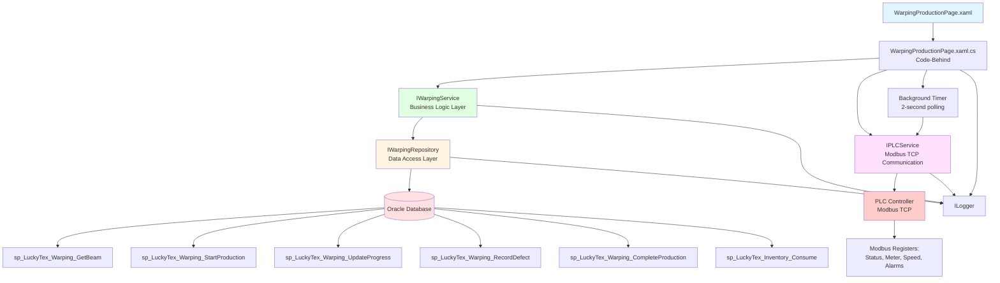
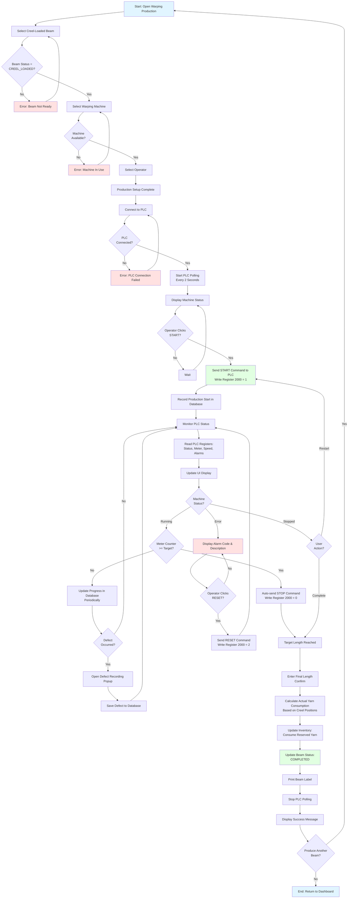

# Process: Warping Production

**Process ID**: WP-002
**Module**: 02 - Warping
**Priority**: P2 (Production Module)
**Created**: 2025-10-05

---

## 1. Process Overview

### Purpose
Execute warping production with PLC-controlled warping machine, monitoring real-time production metrics, managing yarn consumption from creel, tracking defects, and generating completed warp beams ready for beaming operations.

### Scope
- Select creel-loaded warp beam
- Select warping machine
- Assign operator
- Start warping production via PLC interface
- Monitor real-time production (meter counter, speed, status)
- Handle production events (start, stop, complete, error)
- Record yarn breaks and defects
- Calculate actual yarn consumption
- Update inventory (consume reserved yarn)
- Generate completed beam record
- Print beam label

### Module(s) Involved
- **Primary**: M02 - Warping
- **Integration**: PLC (Modbus TCP) - Real-time machine control and monitoring
- **Upstream**: M02 - Creel Loading (loaded beams)
- **Downstream**: M03 - Beaming (completed beams)

---

## 2. UI Files Inventory

### XAML Files
| File Path | Description | Purpose |
|-----------|-------------|---------|
| `LuckyTex.AirBag.Pages/Pages/02 - Warping/WarpingProductionPage.xaml` | Warping production screen | Main production interface with PLC monitoring |
| `LuckyTex.AirBag.Pages/Pages/02 - Warping/DefectRecordPage.xaml` | Defect recording popup | Record yarn breaks and defects |
| `LuckyTex.AirBag.Pages/Pages/02 - Warping/WarpingMenuPage.xaml` | Warping dashboard | Navigation hub |

### Code-Behind Files
| File Path | Description |
|-----------|-------------|
| `LuckyTex.AirBag.Pages/Pages/02 - Warping/WarpingProductionPage.xaml.cs` | Production logic, PLC integration |
| `LuckyTex.AirBag.Pages/Pages/02 - Warping/DefectRecordPage.xaml.cs` | Defect recording logic |

### Service Files
| File Path | Description |
|-----------|-------------|
| *(Existing)* `LuckyTex.AirBag.Core/Services/DataService/WarpingDataService.cs` | Current singleton service |
| *(To be created)* `LuckyTex.AirBag.Core/Services/IWarpingService.cs` | Service interface |
| *(To be created)* `LuckyTex.AirBag.Core/Services/WarpingService.cs` | Service implementation |
| *(To be created)* `LuckyTex.AirBag.Core/Services/IPLCService.cs` | PLC communication service |
| *(To be created)* `LuckyTex.AirBag.Core/Services/PLCService.cs` | Modbus TCP implementation |
| *(To be created)* `LuckyTex.AirBag.Core/Repositories/IWarpingRepository.cs` | Repository interface |

---

## 3. UI Layout Description

### WarpingProductionPage.xaml

**Screen Title**: "Warping Production"

**Key UI Controls**:

**Header Section**:
- Production date/time display
- Shift and operator information

**Beam Selection Section** (Top Left):
- Beam barcode input (`txtBeamBarcode`)
  - Filter: Status = CREEL_LOADED
- Beam details display (read-only):
  - Beam ID
  - Yarn Type
  - Target Length (meters)
  - Creel Positions Loaded

**Machine & Operator Section** (Top Right):
- Machine dropdown (`cmbMachine`)
  - Filter: MachineType = WARPING, Status = AVAILABLE
- Operator dropdown (`cmbOperator`)
- Target speed (RPM) input

**PLC Real-Time Monitoring Section** (Center - Main area):
- Connection status indicator (Connected/Disconnected)
- Machine status display:
  - Current status (Stopped, Running, Error)
  - Status color indicator (Gray, Green, Red)
- Production meters:
  - Meter counter (current length produced)
  - Large display, real-time update
  - Progress bar (current / target length)
- Speed display:
  - Current speed (RPM)
  - Gauge or numeric display
- Alarm/Error display:
  - Alarm code
  - Alarm description
  - Timestamp

**Production Control Buttons**:
- `cmdStart` - Send START command to PLC (enabled when machine stopped)
- `cmdStop` - Send STOP command to PLC (enabled when machine running)
- `cmdReset` - Send RESET command to PLC (enabled when error)
- `cmdRecordDefect` - Open defect recording popup
- `cmdEmergencyStop` - Emergency stop (always enabled)

**Defect History Section** (Bottom Left):
- DataGrid showing defects recorded during production
- Columns: Time, Defect Type, Position (meters), Description

**Production Summary** (Bottom Right):
- Start time
- Running time (elapsed)
- Average speed
- Total defects
- Estimated completion time

**Action Buttons** (Bottom):
- `cmdComplete` - Complete production and generate beam (enabled when target reached)
- `cmdCancel` - Cancel production (with confirmation)
- `cmdBack` - Return to dashboard

**Data Binding Points**:
- PLC registers → Real-time displays
- Beam/Machine selection → Production setup
- Defects collection → DataGrid

---

### DefectRecordPage.xaml (Popup)

**Screen Title**: "Record Defect"

**Key UI Controls**:
- Defect type dropdown (Yarn Break, Knot, Tension Issue, etc.)
- Position (meters) - Auto-filled from current meter counter
- Description textbox
- Action taken dropdown (Repaired, Replaced, Continue)
- `cmdSave` - Save defect record
- `cmdCancel` - Close without saving

---

## 4. Component Architecture Diagram



---

## 5. Workflow Diagram



---

## 6. Business Logic Sequence Diagram

```mermaid
sequenceDiagram
    participant Operator
    participant UI as WarpingProductionPage
    participant BL as WarpingService
    participant PLC as PLCService
    participant TIMER as Background Polling Timer
    participant REPO as WarpingRepository
    participant DB as Oracle Database
    participant PLC_HW as PLC Hardware (Modbus TCP)

    Operator->>UI: Open Warping Production page
    UI->>UI: Clear all fields

    Operator->>UI: Select beam (status = CREEL_LOADED)
    UI->>BL: GetBeamForProduction(beamBarcode)
    BL->>REPO: GetBeamByBarcode(beamBarcode)
    REPO->>DB: sp_LuckyTex_Warping_GetBeam
    DB-->>REPO: Beam details (YarnType, TargetLength, CreelData)
    REPO-->>BL: Beam entity
    BL-->>UI: Display beam details

    Operator->>UI: Select warping machine
    Operator->>UI: Select operator

    UI->>PLC: Connect(machineIPAddress)
    PLC->>PLC_HW: Establish Modbus TCP connection
    PLC_HW-->>PLC: Connection established
    PLC-->>UI: Connected

    UI->>TIMER: Start polling (2-second interval)
    TIMER->>PLC: ReadRegisters([1000, 1001, 1002, 1010-1019])

    loop Every 2 seconds
        PLC->>PLC_HW: Read Modbus registers
        PLC_HW-->>PLC: Register values
        PLC-->>TIMER: Status data (Status, Meter, Speed, Alarms)
        TIMER->>UI: Update UI displays
        UI->>UI: Display machine status, meter counter, speed
    end

    Operator->>UI: Click START button

    UI->>BL: StartProduction(beamBarcode, machineID, operatorID)
    BL->>REPO: InsertProductionStart(production)
    REPO->>DB: sp_LuckyTex_Warping_StartProduction
    DB-->>REPO: Production record created
    REPO-->>BL: Success
    BL-->>UI: Production started in database

    UI->>PLC: SendStartCommand()
    PLC->>PLC_HW: Write Register 2000 = 1 (START)
    PLC_HW-->>PLC: Command sent
    PLC-->>UI: Start command successful

    Note over TIMER, PLC_HW: Polling continues...

    PLC->>PLC_HW: Read Register 1000 (Status)
    PLC_HW-->>PLC: Status = 1 (Running)
    PLC-->>TIMER: Status = Running
    TIMER->>UI: Update status display (Green, "Running")

    PLC->>PLC_HW: Read Register 1001 (Meter Counter)
    PLC_HW-->>PLC: Meter = 1523.5 meters
    PLC-->>TIMER: Meter = 1523.5
    TIMER->>UI: Update meter display: 1523.5 / 2000 m
    UI->>UI: Update progress bar: 76%

    alt Periodically update progress in database (e.g., every minute)
        UI->>BL: UpdateProductionProgress(beamBarcode, currentMeter)
        BL->>REPO: UpdateProgress(beamBarcode, meter, timestamp)
        REPO->>DB: sp_LuckyTex_Warping_UpdateProgress
        DB-->>REPO: Progress updated
    end

    alt Operator records defect
        Operator->>UI: Click "Record Defect"
        UI->>UI: Open DefectRecordPage popup
        Operator->>UI: Select defect type, enter description
        Operator->>UI: Click Save
        UI->>BL: RecordDefect(beamBarcode, defectType, position, description)
        BL->>REPO: InsertDefect(defect)
        REPO->>DB: sp_LuckyTex_Warping_RecordDefect
        DB-->>REPO: Defect recorded
        REPO-->>BL: Success
        BL-->>UI: Defect saved
        UI->>UI: Add defect to defect grid
        UI->>UI: Close popup
    end

    PLC->>PLC_HW: Read Register 1001 (Meter Counter)
    PLC_HW-->>PLC: Meter = 2000.0 meters (target reached)
    PLC-->>TIMER: Meter >= Target
    TIMER->>UI: Target reached notification

    UI->>PLC: SendStopCommand()
    PLC->>PLC_HW: Write Register 2000 = 0 (STOP)
    PLC_HW-->>PLC: Command sent
    PLC-->>UI: Stop command successful

    UI->>UI: Prompt: "Confirm final length: [2000.0] meters"
    Operator->>UI: Confirm final length
    Operator->>UI: Click "Complete Production"

    UI->>BL: CompleteProduction(beamBarcode, finalLength, operatorID)
    BL->>BL: Calculate yarn consumption from creel positions
    BL->>REPO: BeginTransaction()

    BL->>REPO: UpdateProductionCompletion(beamBarcode, finalLength)
    REPO->>DB: sp_LuckyTex_Warping_CompleteProduction
    DB-->>REPO: Production completed

    loop For each yarn lot in creel
        BL->>REPO: ConsumeYarnFromInventory(yarnLotBarcode, consumedQty)
        REPO->>DB: sp_LuckyTex_Inventory_Consume
        DB-->>REPO: Inventory updated (consume reserved qty)
    end

    BL->>REPO: UpdateBeamStatus(beamBarcode, "COMPLETED")
    REPO->>DB: UPDATE tblBeam SET Status='COMPLETED', FinalLength=@Length
    DB-->>REPO: Beam status updated

    BL->>REPO: CommitTransaction()
    REPO-->>BL: Transaction committed
    BL-->>UI: Production complete successfully

    UI->>UI: Print beam label with:<br/>- Beam ID<br/>- Yarn Type<br/>- Final Length<br/>- Production Date<br/>- Operator
    UI->>TIMER: Stop polling
    TIMER->>PLC: Disconnect
    PLC->>PLC_HW: Close Modbus connection
    PLC_HW-->>PLC: Disconnected

    UI->>UI: Display success message
    UI->>UI: Clear all fields
    UI->>UI: Ask: "Produce another beam?"

    alt PLC Error during production
        PLC->>PLC_HW: Read Register 1000 (Status)
        PLC_HW-->>PLC: Status = 2 (Error)
        PLC->>PLC_HW: Read Registers 1010-1019 (Alarm codes)
        PLC_HW-->>PLC: Alarm code = 105
        PLC-->>TIMER: Status = Error, Alarm = 105
        TIMER->>UI: Update status display (Red, "Error: 105 - Yarn Break")
        UI->>UI: Enable RESET button

        Operator->>UI: Click RESET button
        UI->>PLC: SendResetCommand()
        PLC->>PLC_HW: Write Register 2000 = 2 (RESET)
        PLC_HW-->>PLC: Command sent
        PLC-->>UI: Reset command successful
        Note over TIMER, PLC_HW: Machine status returns to Stopped
    end
```



---

## 7. Data Flow

### Input Data
| Data Element | Source | Format | Validation |
|--------------|--------|--------|------------|
| Beam Barcode | Operator selection | String, 20 chars | Must exist, status = CREEL_LOADED |
| Machine | Dropdown | String | Must be available |
| Operator | Dropdown | String | Valid employee |
| Target Speed | User input | Integer (RPM) | Optional |
| Final Length | User input (confirmation) | Decimal (meters) | Confirm from meter counter |
| Defect Details | Defect popup | Object | DefectType, Position, Description |

### Output Data (From PLC)
| Data Element | Source | Format | Purpose |
|--------------|--------|--------|---------|
| Machine Status | PLC Register 1000 | Integer (0,1,2) | 0=Stopped, 1=Running, 2=Error |
| Meter Counter | PLC Register 1001 | Decimal (meters) | Current length produced |
| Current Speed | PLC Register 1002 | Integer (RPM) | Real-time speed |
| Alarm Codes | PLC Registers 1010-1019 | Integer array | Error/alarm codes |

### Output Data (To Database)
| Data Element | Destination | Format | Purpose |
|--------------|-------------|--------|---------|
| Production Record | tblWarpingProduction | Database row | Production tracking |
| Progress Updates | tblWarpingProgress | Database rows | Meter counter history |
| Defect Records | tblWarpingDefect | Database rows | Defect tracking |
| Yarn Consumption | tblInventory | Quantity consumed | Inventory deduction |
| Completed Beam | tblBeam | Status = COMPLETED | Beam ready for beaming |

### Data Transformations
1. **PLC Status Code**: 0=Stopped, 1=Running, 2=Error → UI color and text
2. **Meter Counter**: Raw value → Progress percentage (current/target × 100)
3. **Yarn Consumption**: Creel positions + Final length → Consumed quantity per lot
4. **Alarm Code**: Integer → Alarm description lookup

---

## 8. Database Operations

### Stored Procedures Used

#### sp_LuckyTex_Warping_GetBeam
- **Purpose**: Get beam for warping production
- **Parameters**: @BeamBarcode VARCHAR(20)
- **Returns**: Beam details, TargetLength, CreelPositions
- **Tables Read**: tblBeam, tblCreelLoading
- **Filter**: Status = 'CREEL_LOADED'

#### sp_LuckyTex_Warping_StartProduction
- **Purpose**: Record production start
- **Parameters**:
  - @BeamBarcode VARCHAR(20)
  - @MachineID VARCHAR(20)
  - @OperatorID VARCHAR(10)
  - @StartTime DATETIME
  - @TargetLength DECIMAL(10,2)
- **Returns**: Production ID
- **Tables Written**: tblWarpingProduction

#### sp_LuckyTex_Warping_UpdateProgress
- **Purpose**: Update production progress
- **Parameters**:
  - @BeamBarcode VARCHAR(20)
  - @CurrentMeter DECIMAL(10,2)
  - @Timestamp DATETIME
- **Returns**: Success flag
- **Tables Written**: tblWarpingProgress

#### sp_LuckyTex_Warping_RecordDefect
- **Purpose**: Record defect during production
- **Parameters**:
  - @BeamBarcode VARCHAR(20)
  - @DefectType VARCHAR(50)
  - @Position DECIMAL(10,2)
  - @Description VARCHAR(200)
  - @RecordedBy VARCHAR(10)
  - @RecordedTime DATETIME
- **Returns**: Defect ID
- **Tables Written**: tblWarpingDefect

#### sp_LuckyTex_Warping_CompleteProduction
- **Purpose**: Complete production and update beam
- **Parameters**:
  - @BeamBarcode VARCHAR(20)
  - @FinalLength DECIMAL(10,2)
  - @EndTime DATETIME
  - @CompletedBy VARCHAR(10)
- **Returns**: Success flag
- **Tables Written**: tblWarpingProduction, tblBeam

#### sp_LuckyTex_Inventory_Consume
- **Purpose**: Consume yarn from inventory (reserved → consumed)
- **Parameters**:
  - @YarnLotBarcode VARCHAR(30)
  - @ConsumedQty DECIMAL(10,2)
  - @ConsumedBy VARCHAR(50) -- Beam barcode
- **Returns**: Success flag
- **Tables Written**: tblInventory, tblInventoryTransaction

### PLC Modbus Registers

**Read Registers**:
- **1000**: Machine Status (0=Stopped, 1=Running, 2=Error)
- **1001**: Meter Counter (accumulated length in meters)
- **1002**: Current Speed (RPM)
- **1010-1019**: Alarm Codes (10 alarm registers)

**Write Registers**:
- **2000**: Control Command (0=Stop, 1=Start, 2=Reset)

**Polling Interval**: 2 seconds

### Transaction Scope
Production completion:
```
BEGIN TRANSACTION
  1. UPDATE tblWarpingProduction SET EndTime, FinalLength, Status='COMPLETED'
  2. FOR EACH yarn lot in creel:
     UPDATE tblInventory: Consume reserved quantity
     INSERT into tblInventoryTransaction (audit trail)
  3. UPDATE tblBeam SET Status='COMPLETED', FinalLength=@Length
COMMIT TRANSACTION
```

---

## 9. Implementation Checklist

### Phase 1: Repository Layer
- [ ] Create `WarpingProduction` entity model
- [ ] Create `WarpingDefect` entity model
- [ ] Extend `IWarpingRepository` interface
  - [ ] GetBeamForProduction(string barcode) method
  - [ ] InsertProductionStart(WarpingProduction production) method
  - [ ] UpdateProductionProgress(string beam, decimal meter, DateTime time) method
  - [ ] InsertDefect(WarpingDefect defect) method
  - [ ] UpdateProductionCompletion(string beam, decimal finalLength, DateTime end) method
  - [ ] GetCreelYarnLots(string beamBarcode) method
- [ ] Extend `IWarehouseRepository` interface
  - [ ] ConsumeYarn(string yarnLot, decimal qty, string consumedBy) method
- [ ] Unit tests

### Phase 2: PLC Service Layer
- [ ] Create `IPLCService` interface
  - [ ] Connect(string ipAddress) method
  - [ ] Disconnect() method
  - [ ] ReadRegister(int address) method
  - [ ] WriteRegister(int address, int value) method
  - [ ] ReadMultipleRegisters(int startAddress, int count) method
  - [ ] GetMachineStatus() method
  - [ ] GetMeterCounter() method
  - [ ] GetCurrentSpeed() method
  - [ ] GetAlarmCodes() method
  - [ ] SendStartCommand() method
  - [ ] SendStopCommand() method
  - [ ] SendResetCommand() method
- [ ] Implement `PLCService` using Modbus TCP library
  - [ ] Connection management
  - [ ] Register read/write operations
  - [ ] Error handling and reconnection logic
  - [ ] Logging all PLC communications
- [ ] Unit tests with PLC simulator

### Phase 3: Business Logic Service Layer
- [ ] Extend `IWarpingService` interface
  - [ ] GetBeamForProduction(string barcode) method
  - [ ] StartProduction(WarpingProduction production) method
  - [ ] UpdateProgress(string beam, decimal meter) method
  - [ ] RecordDefect(WarpingDefect defect) method
  - [ ] CompleteProduction(string beam, decimal finalLength, string operator) method
  - [ ] CalculateYarnConsumption(string beamBarcode, decimal finalLength) method
- [ ] Create `WarpingProductionValidator`
  - [ ] Validate beam status = CREEL_LOADED
  - [ ] Validate machine availability
  - [ ] Validate final length > 0
- [ ] Implement `WarpingService`
  - [ ] Yarn consumption calculation logic
  - [ ] Transaction handling for completion
- [ ] Unit tests

### Phase 4: UI Refactoring
- [ ] Update `WarpingProductionPage.xaml.cs`
  - [ ] Inject IWarpingService, IPLCService
  - [ ] Implement PLC connection on page load
  - [ ] Create background timer for PLC polling (2 seconds)
  - [ ] Update cmdStart_Click to call StartProduction + SendStartCommand
  - [ ] Update cmdStop_Click to call SendStopCommand
  - [ ] Update cmdReset_Click to call SendResetCommand
  - [ ] Update cmdRecordDefect_Click to open DefectRecordPage
  - [ ] Update cmdComplete_Click to call CompleteProduction
  - [ ] Real-time UI updates from PLC data
  - [ ] Handle PLC disconnection gracefully
  - [ ] Auto-stop when target reached
- [ ] XAML data binding
  - [ ] Bind PLC status to UI indicators
  - [ ] Bind meter counter to progress bar
  - [ ] Bind defects to DataGrid
  - [ ] Value converter for status colors
- [ ] Thread safety for UI updates from background timer

### Phase 5: Integration Testing
- [ ] Test with PLC simulator or real PLC
  - [ ] Connect to PLC (success)
  - [ ] Send START command (machine starts)
  - [ ] Read meter counter (real-time updates)
  - [ ] Read speed (real-time updates)
  - [ ] Detect target reached (auto-stop)
  - [ ] Send STOP command (machine stops)
  - [ ] Simulate error (alarm codes displayed)
  - [ ] Send RESET command (error cleared)
- [ ] Test with database
  - [ ] Start production (record created)
  - [ ] Update progress (meter history saved)
  - [ ] Record defects (defects saved)
  - [ ] Complete production (success)
  - [ ] Verify inventory consumption
  - [ ] Verify beam status = COMPLETED
- [ ] Error scenarios
  - [ ] PLC disconnection (reconnect logic)
  - [ ] Transaction rollback on error
  - [ ] Emergency stop handling
- [ ] Performance testing
  - [ ] Polling overhead (2-second interval sustainable)
  - [ ] UI responsiveness during production

### Phase 6: Deployment Preparation
- [ ] Code review
- [ ] Unit tests passing (80%+)
- [ ] Integration tests with PLC passing
- [ ] PLC communication documentation
- [ ] UAT with real production environment
- [ ] Production deployment

---

**Document Version**: 1.0
**Last Updated**: 2025-10-05
**Status**: Ready for Implementation
**Estimated Effort**: 5-6 days (1 developer)
**Dependencies**: M02 - Creel Loading (beams must be creel loaded), PLC configuration, Modbus TCP library
**Critical Business Rules**:
- PLC polling interval: 2 seconds (configurable)
- Auto-stop when meter counter >= target length
- Yarn consumption calculated from creel positions and final length
- All reserved yarn quantities consumed upon completion
- Complete traceability: production record → defects → yarn consumption
- Emergency stop must be available at all times
**PLC Integration**:
- Protocol: Modbus TCP
- Register mapping must match PLC configuration
- Error codes must be documented with descriptions
- Reconnection logic for network failures
