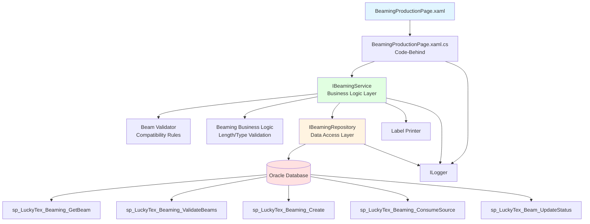
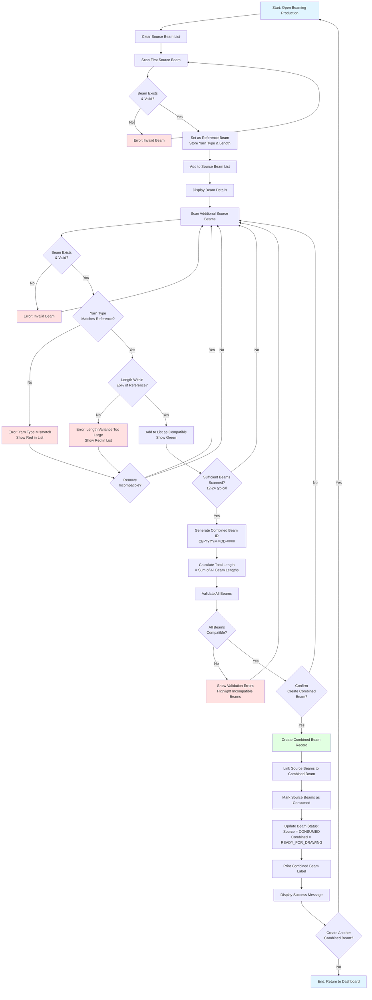

# Process: Beaming Production

**Process ID**: BM-001
**Module**: 03 - Beaming
**Priority**: P2 (Production Module)
**Created**: 2025-10-05

---

## 1. Process Overview

### Purpose
Combine multiple warp beams from the warping process into a single larger combined beam with validated yarn compatibility, uniform length requirements, and complete traceability for subsequent weaving operations.

### Scope
- Scan and validate source warp beams (typically 12-24 beams)
- Verify yarn type compatibility across all beams
- Check length uniformity (within ±5% tolerance)
- Generate combined beam ID
- Create combined beam record with traceability to source beams
- Mark source beams as consumed
- Print combined beam label
- Calculate total combined length
- Update beam inventory status

### Module(s) Involved
- **Primary**: M03 - Beaming
- **Upstream**: M02 - Warping (source beams)
- **Downstream**: M04 - Drawing (receives combined beams)

---

## 2. UI Files Inventory

### XAML Files
| File Path | Description | Purpose |
|-----------|-------------|---------|
| `LuckyTex.AirBag.Pages/Pages/03 - Beaming/BeamingProductionPage.xaml` | Beaming production screen | Main beaming operation interface |
| `LuckyTex.AirBag.Pages/Pages/03 - Beaming/BeamingMenuPage.xaml` | Beaming dashboard | Navigation hub |

### Code-Behind Files
| File Path | Description |
|-----------|-------------|
| `LuckyTex.AirBag.Pages/Pages/03 - Beaming/BeamingProductionPage.xaml.cs` | Production logic and event handlers |
| `LuckyTex.AirBag.Pages/Pages/03 - Beaming/BeamingMenuPage.xaml.cs` | Dashboard navigation logic |

### Service Files
| File Path | Description |
|-----------|-------------|
| *(Existing)* `LuckyTex.AirBag.Core/Services/DataService/BeamingDataService.cs` | Current singleton service |
| *(To be created)* `LuckyTex.AirBag.Core/Repositories/IBeamingRepository.cs` | Repository interface |
| *(To be created)* `LuckyTex.AirBag.Core/Repositories/BeamingRepository.cs` | Repository implementation |
| *(To be created)* `LuckyTex.AirBag.Core/Services/IBeamingService.cs` | Service interface |
| *(To be created)* `LuckyTex.AirBag.Core/Services/BeamingService.cs` | Service implementation |

---

## 3. UI Layout Description

### BeamingProductionPage.xaml

**Screen Title**: "Beaming Production"

**Key UI Controls**:

**Header Section**:
- Production date display
- Shift and operator information
- Machine selection dropdown (`cmbMachine`)

**Source Beam Scanning Section** (Left):
- Source beam barcode input (`txtSourceBeamBarcode`)
  - KeyUp event: Enter key triggers beam lookup
- Scan instruction label: "Scan source beams (12-24 beams)"
- Clear list button (`cmdClearList`)

**Source Beam List Section** (Center):
- DataGrid displaying scanned source beams
- Columns:
  - Beam Barcode
  - Yarn Type
  - Yarn Count
  - Length (meters)
  - Status (color indicator: Green=Compatible, Red=Incompatible)
  - Remove button (per row)
- Reference beam indicator (first beam highlighted)
- Total beams count display
- Total length display (sum of all beam lengths)

**Compatibility Validation Display**:
- Reference Yarn Type (from first beam)
- Reference Length (from first beam)
- Tolerance: ±5% length variance
- Validation status: "All beams compatible" (green) or "Incompatible beams detected" (red)

**Combined Beam Section** (Right):
- Combined Beam ID (`txtCombinedBeamID`)
  - Auto-generated or manual entry
  - Format: CB-YYYYMMDD-####
- Total Combined Length (calculated, read-only)
- Average Beam Length (calculated)
- Beam Count (count of source beams)

**Action Buttons** (Bottom):
- `cmdValidate` - Validate all beams compatibility
- `cmdCreateCombinedBeam` - Create combined beam record (enabled after validation)
- `cmdPrint` - Print combined beam label
- `cmdClear` - Clear all and start new
- `cmdBack` - Return to dashboard

**Data Binding Points**:
- Source beam barcode → Beam lookup service
- Source beams collection → DataGrid.ItemsSource
- Compatibility status → UI indicators
- Combined beam data → Database insert

---

## 4. Component Architecture Diagram



---

## 5. Workflow Diagram



---

## 6. Business Logic Sequence Diagram

```mermaid
sequenceDiagram
    participant Operator
    participant UI as BeamingProductionPage
    participant BL as BeamingService
    participant VAL as BeamValidator
    participant REPO as BeamingRepository
    participant DB as Oracle Database
    participant Printer as Label Printer

    Operator->>UI: Open Beaming Production page
    UI->>UI: Clear source beam list
    UI->>UI: Focus on barcode input

    Operator->>UI: Scan first source beam barcode
    UI->>BL: GetBeamDetails(barcode)
    BL->>REPO: GetBeamByBarcode(barcode)
    REPO->>DB: sp_LuckyTex_Beaming_GetBeam

    alt Beam exists and status = COMPLETED (from warping)
        DB-->>REPO: Beam details (YarnType, YarnCount, Length, Status)
        REPO-->>BL: Beam entity
        BL-->>UI: Display beam details
        UI->>UI: Set as REFERENCE beam
        UI->>UI: Store reference YarnType, YarnCount, Length
        UI->>UI: Add to source beam list (index 1)
        UI->>UI: Display: "Reference beam: [Barcode]"

        loop Scan additional source beams (beam 2 to N)
            Operator->>UI: Scan source beam barcode
            UI->>BL: GetBeamDetails(barcode)
            BL->>REPO: GetBeamByBarcode(barcode)
            REPO->>DB: sp_LuckyTex_Beaming_GetBeam

            alt Beam exists and valid
                DB-->>REPO: Beam details
                REPO-->>BL: Beam entity
                BL->>VAL: ValidateCompatibility(beam, referenceBeam)
                VAL->>VAL: Check YarnType matches
                VAL->>VAL: Check YarnCount matches
                VAL->>VAL: Calculate length variance % = (beam.Length - ref.Length) / ref.Length * 100
                VAL->>VAL: Check variance within ±5%

                alt All compatibility checks passed
                    VAL-->>BL: Compatible = true
                    BL-->>UI: Beam compatible
                    UI->>UI: Add to source beam list (green status)
                    UI->>UI: Update total length = sum(all beam lengths)
                    UI->>UI: Update beam count
                else Yarn type mismatch
                    VAL-->>BL: Error: Yarn type mismatch
                    BL-->>UI: Error message
                    UI->>UI: Show error: "Yarn type [X] does not match reference [Y]"
                    UI->>UI: Add to list with RED status indicator
                else Length variance too large
                    VAL-->>BL: Error: Length variance [X]% exceeds ±5%
                    BL-->>UI: Error message
                    UI->>UI: Show error: "Length [X]m variance too large (ref: [Y]m)"
                    UI->>UI: Add to list with RED status indicator
                end
            else Beam not found or invalid status
                DB-->>REPO: No data or invalid status
                REPO-->>BL: Error: Beam not found
                BL-->>UI: Error message
                UI->>UI: Show error: "Beam not found or already consumed"
            end
        end

        Operator->>UI: Review scanned beams (12-24 beams typical)
        Operator->>UI: Click Validate All

        UI->>BL: ValidateAllBeams(sourceBeamList)
        BL->>VAL: ValidateBeamList(beams)
        VAL->>VAL: Check all beams have green status
        VAL->>VAL: Check minimum beam count (e.g., >= 12)
        VAL->>VAL: Check maximum beam count (e.g., <= 24)

        alt All validations passed
            VAL-->>BL: Validation OK
            BL-->>UI: All beams compatible
            UI->>UI: Show success: "All beams validated ✓"
            UI->>UI: Enable "Create Combined Beam" button

            Operator->>UI: Click Create Combined Beam

            UI->>BL: GenerateCombinedBeamID()
            BL->>BL: Generate ID: CB-YYYYMMDD-#### (auto-increment)
            BL-->>UI: Combined beam ID
            UI->>UI: Display combined beam ID

            Operator->>UI: Confirm creation

            UI->>BL: CreateCombinedBeam(combinedBeamID, sourceBeamList, operator, machine)
            BL->>REPO: BeginTransaction()

            BL->>REPO: InsertCombinedBeam(combinedBeam)
            REPO->>DB: sp_LuckyTex_Beaming_Create
            DB-->>REPO: Combined beam created

            loop For each source beam
                BL->>REPO: LinkSourceBeam(combinedBeamID, sourceBeamBarcode)
                REPO->>DB: INSERT INTO tblBeamingSource
                DB-->>REPO: Link created

                BL->>REPO: UpdateBeamStatus(sourceBeamBarcode, "CONSUMED")
                REPO->>DB: sp_LuckyTex_Beam_UpdateStatus
                DB-->>REPO: Source beam status updated
            end

            BL->>REPO: UpdateBeamStatus(combinedBeamID, "READY_FOR_DRAWING")
            REPO->>DB: sp_LuckyTex_Beam_UpdateStatus
            DB-->>REPO: Combined beam status updated

            BL->>REPO: CommitTransaction()
            REPO-->>BL: Transaction committed
            BL-->>UI: Combined beam created successfully

            UI->>Printer: Print combined beam label with:<br/>- Combined Beam ID<br/>- Total Length<br/>- Yarn Type/Count<br/>- Source Beam Count<br/>- Creation Date/Operator
            Printer-->>UI: Label printed

            UI->>UI: Display success message
            UI->>UI: Clear source beam list
            UI->>UI: Ask: "Create another combined beam?"
        else Validation failed
            VAL-->>BL: Validation errors (incompatible beams found)
            BL-->>UI: Error list
            UI->>UI: Highlight incompatible beams in red
            UI->>UI: Show error summary
            UI->>UI: Disable "Create Combined Beam" button
        end

    else Beam not found or invalid status
        DB-->>REPO: Error
        REPO-->>BL: Beam not found
        BL-->>UI: Error message
        UI->>UI: Show error: "Invalid beam barcode"
    end
```



---

## 7. Data Flow

### Input Data
| Data Element | Source | Format | Validation |
|--------------|--------|--------|------------|
| Source Beam Barcodes | Operator scan | String, 20 chars | Must exist, status = COMPLETED from warping |
| Machine | Dropdown | String | Required |
| Operator ID | Login session | String | Valid employee |
| Shift | Login session | String | Current shift |
| Production Date | System | DateTime | Auto-set to current date |

### Output Data
| Data Element | Destination | Format | Purpose |
|--------------|-------------|--------|---------|
| Combined Beam ID | Database + Label | String (CB-YYYY-MM-DD-####) | Unique combined beam identifier |
| Combined Beam Record | tblBeam | Database row | Combined beam master record |
| Source Beam Links | tblBeamingSource | Database rows | Traceability links |
| Total Combined Length | Database + Label | Decimal (meters) | Sum of source beam lengths |
| Source Beam Status Updates | tblBeam | Status = CONSUMED | Mark source beams as used |
| Combined Beam Label | Printer | Physical label | Identification for next process |

### Data Transformations
1. **Combined Beam ID**: Generate CB-YYYY-MM-DD-#### with auto-increment
2. **Total Length**: Sum of all source beam lengths
3. **Average Length**: Total length / beam count
4. **Length Variance %**: (Beam length - Reference length) / Reference length × 100
5. **Compatibility Status**: Boolean based on yarn type match AND length variance ≤ ±5%

---

## 8. Database Operations

### Stored Procedures Used

#### sp_LuckyTex_Beaming_GetBeam
- **Purpose**: Retrieve beam details for beaming
- **Parameters**: @BeamBarcode VARCHAR(20)
- **Returns**: BeamBarcode, YarnType, YarnCount, Length, Status, CreatedDate
- **Tables Read**: tblBeam
- **Filter**: Status = 'COMPLETED' (from warping, not consumed)

#### sp_LuckyTex_Beaming_ValidateBeams
- **Purpose**: Validate compatibility of beam list
- **Parameters**: @BeamBarcodeList VARCHAR(MAX) (comma-separated)
- **Returns**: Validation result with incompatible beam details
- **Tables Read**: tblBeam
- **Logic**:
  - Check all beams have same YarnType and YarnCount
  - Check length variance within ±5%

#### sp_LuckyTex_Beaming_Create
- **Purpose**: Create combined beam record
- **Parameters**:
  - @CombinedBeamID VARCHAR(20)
  - @YarnType VARCHAR(50)
  - @YarnCount VARCHAR(20)
  - @TotalLength DECIMAL(10,2)
  - @SourceBeamCount INT
  - @Machine VARCHAR(20)
  - @Operator VARCHAR(10)
  - @ProductionDate DATETIME
  - @Shift VARCHAR(10)
- **Returns**: Success flag
- **Tables Written**: tblBeam (insert combined beam record)

#### sp_LuckyTex_Beaming_ConsumeSource
- **Purpose**: Link source beams and mark as consumed
- **Parameters**:
  - @CombinedBeamID VARCHAR(20)
  - @SourceBeamBarcode VARCHAR(20)
- **Returns**: Success flag
- **Tables Written**:
  - tblBeamingSource (insert link)
  - tblBeam (update source beam status to CONSUMED)

#### sp_LuckyTex_Beam_UpdateStatus
- **Purpose**: Update beam status
- **Parameters**:
  - @BeamBarcode VARCHAR(20)
  - @Status VARCHAR(20)
  - @ModifiedBy VARCHAR(10)
- **Returns**: Rows affected
- **Tables Written**: tblBeam

### Table Operations

**tblBeam**:
- INSERT: Combined beam record
- UPDATE: Source beam status (CONSUMED)
- UPDATE: Combined beam status (READY_FOR_DRAWING)

**tblBeamingSource**:
- INSERT: Link records (CombinedBeamID, SourceBeamBarcode)

### Transaction Scope
```
BEGIN TRANSACTION
  1. INSERT combined beam into tblBeam
  2. FOR EACH source beam:
     a. INSERT link into tblBeamingSource
     b. UPDATE source beam status to CONSUMED in tblBeam
  3. UPDATE combined beam status to READY_FOR_DRAWING
COMMIT TRANSACTION
```

Rollback on any error to maintain data consistency.

---

## 9. Implementation Checklist

### Phase 1: Repository Layer
- [ ] Create `Beam` entity model
  - [ ] Properties: BeamBarcode, YarnType, YarnCount, Length, Status, etc.
- [ ] Create `CombinedBeam` entity model (inherits from Beam)
  - [ ] Additional: SourceBeamCount, SourceBeamBarcodes list
- [ ] Create `IBeamingRepository` interface
  - [ ] GetBeamByBarcode(string barcode) method
  - [ ] ValidateBeams(List<string> barcodes) method
  - [ ] InsertCombinedBeam(CombinedBeam beam) method
  - [ ] LinkSourceBeam(string combinedID, string sourceBarcode) method
  - [ ] UpdateBeamStatus(string barcode, string status) method
- [ ] Implement `BeamingRepository`
  - [ ] Map all stored procedures
  - [ ] Transaction handling for combined beam creation
  - [ ] Error handling and logging
- [ ] Unit tests for repository

### Phase 2: Service Layer
- [ ] Create `IBeamingService` interface
  - [ ] GetBeamDetails(string barcode) method
  - [ ] ValidateBeamCompatibility(Beam beam, Beam referenceBeam) method
  - [ ] ValidateAllBeams(List<Beam> beams) method
  - [ ] GenerateCombinedBeamID() method
  - [ ] CreateCombinedBeam(CombinedBeam beam) method
- [ ] Create `BeamValidator` using FluentValidation
  - [ ] Validate beam status = COMPLETED
  - [ ] Validate yarn type match
  - [ ] Validate length variance ≤ ±5%
  - [ ] Validate minimum beam count (e.g., >= 12)
- [ ] Create `BeamingBusinessLogic` helper class
  - [ ] CalculateLengthVariance(decimal length, decimal refLength) method
  - [ ] IsCompatible(Beam beam, Beam reference) method
  - [ ] CalculateTotalLength(List<Beam> beams) method
- [ ] Implement `BeamingService`
  - [ ] Constructor with IBeamingRepository, IValidator, ILogger
  - [ ] Validation before creating combined beam
  - [ ] Return ServiceResult<CombinedBeam>
- [ ] Unit tests for service
  - [ ] Test compatibility validation (type match, length variance)
  - [ ] Test combined beam ID generation
  - [ ] Test transaction success/rollback

### Phase 3: UI Refactoring
- [ ] Update `BeamingProductionPage.xaml.cs`
  - [ ] Remove DataService.Instance calls
  - [ ] Inject IBeamingService
  - [ ] Update txtSourceBeamBarcode_KeyUp to call GetBeamDetails
  - [ ] Implement real-time compatibility check on each scan
  - [ ] Update cmdValidate_Click to call ValidateAllBeams
  - [ ] Update cmdCreateCombinedBeam_Click to call CreateCombinedBeam
  - [ ] Handle ServiceResult (display errors)
  - [ ] Update UI indicators (green/red status)
- [ ] XAML data binding
  - [ ] Bind source beam list to DataGrid
  - [ ] Bind total length (calculated)
  - [ ] Bind beam count
  - [ ] Value converter for status color (green/red)
- [ ] Add loading indicators for async operations
- [ ] User-friendly error messages

### Phase 4: Integration Testing
- [ ] Test with real Oracle database
  - [ ] Scan valid source beams (success)
  - [ ] Scan incompatible yarn type (error, red status)
  - [ ] Scan beam with length variance >5% (error, red status)
  - [ ] Scan already consumed beam (error)
  - [ ] Create combined beam with valid beams (success)
  - [ ] Verify source beams marked as CONSUMED
  - [ ] Verify combined beam status = READY_FOR_DRAWING
  - [ ] Print combined beam label (verify data)
- [ ] Traceability testing
  - [ ] Verify tblBeamingSource links created
  - [ ] Query source beams from combined beam ID
- [ ] Error scenarios
  - [ ] Transaction rollback on database error
  - [ ] Duplicate combined beam ID handling
- [ ] Performance testing
  - [ ] Scan 24 beams (acceptable response time)
  - [ ] Validation of 24 beams < 1 second

### Phase 5: Deployment Preparation
- [ ] Code review completed
- [ ] Unit tests passing (80%+ coverage)
- [ ] Integration tests passing
- [ ] Documentation updated
- [ ] UAT completed
- [ ] Production deployment checklist ready

---

**Document Version**: 1.0
**Last Updated**: 2025-10-05
**Status**: Ready for Implementation
**Estimated Effort**: 3 days (1 developer)
**Dependencies**: M02 - Warping (source beams must exist)
**Critical Business Rules**:
- All source beams must have identical yarn type and count
- Length variance must be within ±5%
- Typical combined beam uses 12-24 source beams
- Source beams must have status = COMPLETED (from warping)
- Complete traceability from combined beam to all source beams required
