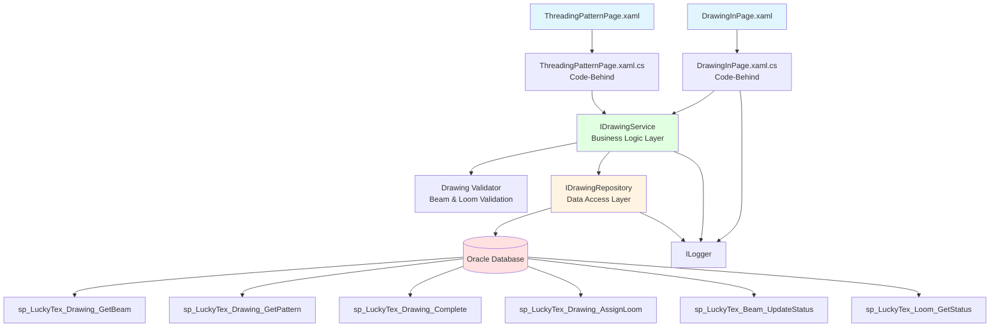
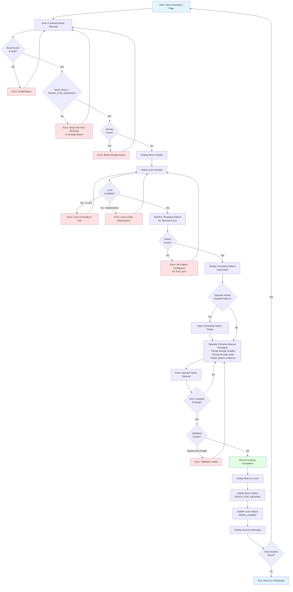

# Process: Drawing-In

**Process ID**: DR-001
**Module**: 04 - Drawing
**Priority**: P2 (Production Module)
**Created**: 2025-10-05

---

## 1. Process Overview

### Purpose
Thread combined warp beams through loom heddles and reeds following specific threading patterns, preparing the beam for weaving operations with correct yarn positioning and tension.

### Scope
- Scan and validate combined beam from beaming
- Select target loom number
- Retrieve threading pattern for selected loom
- Display threading instructions to operator
- Record drawing completion
- Assign beam to specific loom
- Update beam status to READY_FOR_WEAVING
- Generate drawing completion record

### Module(s) Involved
- **Primary**: M04 - Drawing
- **Upstream**: M03 - Beaming (source combined beams)
- **Downstream**: M05 - Weaving (receives drawn beams)

---

## 2. UI Files Inventory

### XAML Files
| File Path | Description | Purpose |
|-----------|-------------|---------|
| `LuckyTex.AirBag.Pages/Pages/04 - Drawing/DrawingInPage.xaml` | Drawing-in operation screen | Main drawing interface |
| `LuckyTex.AirBag.Pages/Pages/04 - Drawing/ThreadingPatternPage.xaml` | Threading pattern display | Show pattern instructions |
| `LuckyTex.AirBag.Pages/Pages/04 - Drawing/DrawingMenuPage.xaml` | Drawing dashboard | Navigation hub |

### Code-Behind Files
| File Path | Description |
|-----------|-------------|
| `LuckyTex.AirBag.Pages/Pages/04 - Drawing/DrawingInPage.xaml.cs` | Drawing operation logic |
| `LuckyTex.AirBag.Pages/Pages/04 - Drawing/ThreadingPatternPage.xaml.cs` | Pattern display logic |
| `LuckyTex.AirBag.Pages/Pages/04 - Drawing/DrawingMenuPage.xaml.cs` | Dashboard navigation |

### Service Files
| File Path | Description |
|-----------|-------------|
| *(Existing)* `LuckyTex.AirBag.Core/Services/DataService/DrawingDataService.cs` | Current singleton service |
| *(To be created)* `LuckyTex.AirBag.Core/Repositories/IDrawingRepository.cs` | Repository interface |
| *(To be created)* `LuckyTex.AirBag.Core/Repositories/DrawingRepository.cs` | Repository implementation |
| *(To be created)* `LuckyTex.AirBag.Core/Services/IDrawingService.cs` | Service interface |
| *(To be created)* `LuckyTex.AirBag.Core/Services/DrawingService.cs` | Service implementation |

---

## 3. UI Layout Description

### DrawingInPage.xaml

**Screen Title**: "Drawing-In Operation"

**Key UI Controls**:

**Header Section**:
- Operation date display
- Shift and operator information

**Beam Information Section** (Top):
- Combined beam barcode input (`txtBeamBarcode`)
  - KeyUp event: Enter key triggers beam lookup
- Display beam details (read-only):
  - Beam ID
  - Yarn Type
  - Yarn Count
  - Total Length
  - Source Beam Count
  - Current Status

**Loom Selection Section** (Middle):
- Loom number dropdown (`cmbLoomNumber`)
  - Populated from tblMachine where MachineType = 'LOOM'
- Loom status display (Available, In Use, Under Maintenance)
- Current beam on loom (if any)

**Threading Pattern Section** (Main area):
- Pattern display mode: Diagram or Text instructions
- Pattern details (read-only):
  - Heddle count
  - Reed configuration
  - Threading sequence
  - Denting pattern
- Pattern diagram image (if available)
- Step-by-step instructions list

**Drawing Progress Section**:
- Start time (auto-set when beam scanned)
- Expected duration (from pattern data)
- Operator notes textbox (`txtOperatorNotes`)

**Action Buttons** (Bottom):
- `cmdShowPattern` - Open detailed pattern view in popup
- `cmdCompleteDrawing` - Mark drawing as complete (enabled after validation)
- `cmdCancel` - Cancel operation and release beam
- `cmdBack` - Return to dashboard

**Data Binding Points**:
- Beam barcode → Beam lookup service
- Loom selection → Pattern retrieval
- Pattern data → Display controls
- Completion → Database update

---

### ThreadingPatternPage.xaml (Popup/Separate Window)

**Screen Title**: "Threading Pattern: Loom [Number]"

**Key UI Controls**:

**Pattern Header**:
- Loom number
- Pattern type (e.g., Plain weave, Twill, Satin)
- Yarn type/count

**Visual Pattern Display**:
- Heddle diagram (visual representation)
- Reed denting diagram
- Color-coded threading sequence

**Text Instructions**:
- Step-by-step numbered instructions
- Special notes or warnings
- Threading order (shaft 1, 2, 3, 4, etc.)

**Action Buttons**:
- `cmdPrint` - Print pattern for reference
- `cmdClose` - Close pattern view

---

## 4. Component Architecture Diagram



---

## 5. Workflow Diagram



---

## 6. Business Logic Sequence Diagram

```mermaid
sequenceDiagram
    participant Operator
    participant UI as DrawingInPage
    participant PopupUI as ThreadingPatternPage
    participant BL as DrawingService
    participant VAL as DrawingValidator
    participant REPO as DrawingRepository
    participant DB as Oracle Database

    Operator->>UI: Open Drawing-In page
    UI->>UI: Clear all fields

    Operator->>UI: Scan combined beam barcode
    UI->>BL: GetBeamForDrawing(barcode)
    BL->>REPO: GetBeamByBarcode(barcode)
    REPO->>DB: sp_LuckyTex_Drawing_GetBeam

    alt Beam exists and status = READY_FOR_DRAWING
        DB-->>REPO: Beam details (YarnType, YarnCount, Length, Status, FromBeaming=true)
        REPO-->>BL: Beam entity
        BL->>VAL: ValidateBeamForDrawing(beam)
        VAL->>VAL: Check status = READY_FOR_DRAWING
        VAL->>VAL: Check beam is from beaming (not warping)
        VAL->>VAL: Check not already drawn

        alt Validation passed
            VAL-->>BL: Validation OK
            BL-->>UI: Display beam details
            UI->>UI: Show beam info: ID, YarnType, Length, etc.
            UI->>UI: Enable loom selection

            Operator->>UI: Select loom number from dropdown
            UI->>BL: GetLoomStatus(loomNumber)
            BL->>REPO: GetLoomStatus(loomNumber)
            REPO->>DB: sp_LuckyTex_Loom_GetStatus
            DB-->>REPO: Loom status (Available, In Use, Under Maintenance)
            REPO-->>BL: Loom status
            BL-->>UI: Display loom status

            alt Loom available
                UI->>BL: GetThreadingPattern(loomNumber)
                BL->>REPO: GetThreadingPattern(loomNumber)
                REPO->>DB: sp_LuckyTex_Drawing_GetPattern
                DB-->>REPO: Pattern details (HeddleCount, ReedConfig, Sequence, Instructions)
                REPO-->>BL: Threading pattern entity
                BL-->>UI: Display pattern summary
                UI->>UI: Show pattern: Heddle count, Reed config, Instructions

                Operator->>UI: Click "Show Detailed Pattern"
                UI->>PopupUI: Open ThreadingPatternPage (loomNumber, pattern)
                PopupUI->>PopupUI: Display visual pattern diagram
                PopupUI->>PopupUI: Display step-by-step instructions
                Operator->>PopupUI: Review pattern
                Operator->>PopupUI: Close popup (or print for reference)
                PopupUI->>UI: Return to main page

                Note over Operator: Operator performs manual threading:<br/>1. Thread warp ends through heddles<br/>2. Thread through reeds<br/>3. Follow pattern sequence<br/>4. Check tension

                Operator->>UI: Enter operator notes (optional)
                Operator->>UI: Click "Complete Drawing"

                UI->>BL: CompleteDrawing(beamBarcode, loomNumber, operatorID, notes)
                BL->>VAL: ValidateCompletion(beam, loom)
                VAL->>VAL: Re-validate beam and loom status

                alt Validation passed
                    VAL-->>BL: OK
                    BL->>REPO: BeginTransaction()

                    BL->>REPO: InsertDrawingRecord(drawing)
                    REPO->>DB: sp_LuckyTex_Drawing_Complete
                    DB-->>REPO: Drawing record created

                    BL->>REPO: AssignBeamToLoom(beamBarcode, loomNumber)
                    REPO->>DB: sp_LuckyTex_Drawing_AssignLoom
                    DB-->>REPO: Beam assigned to loom

                    BL->>REPO: UpdateBeamStatus(beamBarcode, "READY_FOR_WEAVING")
                    REPO->>DB: sp_LuckyTex_Beam_UpdateStatus
                    DB-->>REPO: Beam status updated

                    BL->>REPO: UpdateLoomStatus(loomNumber, "BEAM_LOADED", beamBarcode)
                    REPO->>DB: UPDATE tblMachine SET Status='BEAM_LOADED', CurrentBeam=@BeamBarcode
                    DB-->>REPO: Loom status updated

                    BL->>REPO: CommitTransaction()
                    REPO-->>BL: Transaction committed
                    BL-->>UI: Drawing complete successfully

                    UI->>UI: Display success message:<br/>"Drawing complete. Beam ready for weaving."
                    UI->>UI: Clear all fields
                    UI->>UI: Ask: "Draw another beam?"
                else Validation failed
                    VAL-->>BL: Validation errors
                    BL-->>UI: Error list
                    UI->>UI: Show validation errors
                end

            else Loom not available (In Use)
                BL-->>UI: Error: Loom currently in use
                UI->>UI: Show error message
                UI->>UI: Suggest selecting different loom
            else Loom under maintenance
                BL-->>UI: Error: Loom under maintenance
                UI->>UI: Show error message
            end

        else Validation failed (beam not ready)
            VAL-->>BL: Error: Beam not from beaming or already drawn
            BL-->>UI: Error message
            UI->>UI: Show error: "Beam must be from beaming process and not already drawn"
        end

    else Beam not found or invalid status
        DB-->>REPO: No data or invalid status
        REPO-->>BL: Error: Beam not found
        BL-->>UI: Error message
        UI->>UI: Show error: "Invalid beam barcode or beam not ready for drawing"
    end
```



---

## 7. Data Flow

### Input Data
| Data Element | Source | Format | Validation |
|--------------|--------|--------|------------|
| Combined Beam Barcode | Operator scan | String, 20 chars | Must exist, status = READY_FOR_DRAWING, from beaming |
| Loom Number | Dropdown | String | Must exist, status = Available |
| Operator ID | Login session | String | Valid employee |
| Shift | Login session | String | Current shift |
| Operator Notes | User input | String, 500 chars | Optional |
| Operation Date | System | DateTime | Auto-set to current date |

### Output Data
| Data Element | Destination | Format | Purpose |
|--------------|-------------|--------|---------|
| Drawing Record | tblDrawing | Database row | Drawing completion record |
| Beam-Loom Assignment | tblBeam | LoomNumber field | Link beam to loom |
| Beam Status Update | tblBeam | Status = READY_FOR_WEAVING | Mark beam ready for weaving |
| Loom Status Update | tblMachine (Loom) | Status = BEAM_LOADED, CurrentBeam | Mark loom has beam loaded |
| Success Message | UI | String | User feedback |

### Data Transformations
1. **Beam Status**: READY_FOR_DRAWING → READY_FOR_WEAVING
2. **Loom Status**: Available → BEAM_LOADED
3. **Beam-Loom Link**: Store loom number in beam record
4. **Drawing Timestamp**: Record completion date/time

---

## 8. Database Operations

### Stored Procedures Used

#### sp_LuckyTex_Drawing_GetBeam
- **Purpose**: Retrieve beam for drawing operation
- **Parameters**: @BeamBarcode VARCHAR(20)
- **Returns**: Beam details, FromBeaming flag, Status
- **Tables Read**: tblBeam
- **Filter**: Status = 'READY_FOR_DRAWING', FromBeaming = 1

#### sp_LuckyTex_Loom_GetStatus
- **Purpose**: Check loom availability
- **Parameters**: @LoomNumber VARCHAR(20)
- **Returns**: LoomNumber, Status, CurrentBeam (if any)
- **Tables Read**: tblMachine WHERE MachineType = 'LOOM'

#### sp_LuckyTex_Drawing_GetPattern
- **Purpose**: Retrieve threading pattern for loom
- **Parameters**: @LoomNumber VARCHAR(20)
- **Returns**: HeddleCount, ReedConfiguration, ThreadingSequence, Instructions, PatternImage
- **Tables Read**: tblThreadingPattern

#### sp_LuckyTex_Drawing_Complete
- **Purpose**: Record drawing completion
- **Parameters**:
  - @BeamBarcode VARCHAR(20)
  - @LoomNumber VARCHAR(20)
  - @OperatorID VARCHAR(10)
  - @Shift VARCHAR(10)
  - @OperatorNotes VARCHAR(500)
  - @CompletionDate DATETIME
- **Returns**: Drawing record ID
- **Tables Written**: tblDrawing

#### sp_LuckyTex_Drawing_AssignLoom
- **Purpose**: Assign beam to loom
- **Parameters**:
  - @BeamBarcode VARCHAR(20)
  - @LoomNumber VARCHAR(20)
- **Returns**: Success flag
- **Tables Written**: tblBeam (set LoomNumber field)

#### sp_LuckyTex_Beam_UpdateStatus
- **Purpose**: Update beam status
- **Parameters**:
  - @BeamBarcode VARCHAR(20)
  - @Status VARCHAR(20)
  - @ModifiedBy VARCHAR(10)
- **Returns**: Rows affected
- **Tables Written**: tblBeam

### Table Operations

**tblBeam**:
- UPDATE: LoomNumber (assign loom)
- UPDATE: Status (READY_FOR_WEAVING)

**tblMachine** (Loom):
- UPDATE: Status (BEAM_LOADED)
- UPDATE: CurrentBeam (beam barcode)

**tblDrawing**:
- INSERT: Drawing completion record

### Transaction Scope
```
BEGIN TRANSACTION
  1. INSERT drawing record into tblDrawing
  2. UPDATE tblBeam SET LoomNumber = @LoomNumber
  3. UPDATE tblBeam SET Status = 'READY_FOR_WEAVING'
  4. UPDATE tblMachine (Loom) SET Status = 'BEAM_LOADED', CurrentBeam = @BeamBarcode
COMMIT TRANSACTION
```

Rollback on any error.

---

## 9. Implementation Checklist

### Phase 1: Repository Layer
- [ ] Create `Drawing` entity model
  - [ ] Properties: DrawingID, BeamBarcode, LoomNumber, OperatorID, CompletionDate, Notes
- [ ] Create `ThreadingPattern` entity model
  - [ ] Properties: LoomNumber, HeddleCount, ReedConfig, Sequence, Instructions, PatternImage
- [ ] Create `IDrawingRepository` interface
  - [ ] GetBeamForDrawing(string barcode) method
  - [ ] GetLoomStatus(string loomNumber) method
  - [ ] GetThreadingPattern(string loomNumber) method
  - [ ] InsertDrawingRecord(Drawing drawing) method
  - [ ] AssignBeamToLoom(string beamBarcode, string loomNumber) method
  - [ ] UpdateBeamStatus(string barcode, string status) method
  - [ ] UpdateLoomStatus(string loomNumber, string status, string currentBeam) method
- [ ] Implement `DrawingRepository`
  - [ ] Map all stored procedures
  - [ ] Transaction handling for drawing completion
  - [ ] Error handling and logging
- [ ] Unit tests for repository

### Phase 2: Service Layer
- [ ] Create `IDrawingService` interface
  - [ ] GetBeamDetails(string barcode) method
  - [ ] GetLoomStatus(string loomNumber) method
  - [ ] GetThreadingPattern(string loomNumber) method
  - [ ] CompleteDrawing(Drawing drawing) method
- [ ] Create `DrawingValidator` using FluentValidation
  - [ ] Validate beam status = READY_FOR_DRAWING
  - [ ] Validate beam FromBeaming = true
  - [ ] Validate loom status = Available
  - [ ] Validate threading pattern exists for loom
- [ ] Implement `DrawingService`
  - [ ] Constructor with IDrawingRepository, IValidator<Drawing>, ILogger
  - [ ] Validation before completing drawing
  - [ ] Return ServiceResult<Drawing>
- [ ] Unit tests for service
  - [ ] Test beam validation (status, from beaming)
  - [ ] Test loom validation (availability)
  - [ ] Test pattern retrieval
  - [ ] Test transaction success/rollback

### Phase 3: UI Refactoring
- [ ] Update `DrawingInPage.xaml.cs`
  - [ ] Remove DataService.Instance calls
  - [ ] Inject IDrawingService
  - [ ] Update txtBeamBarcode_KeyUp to call GetBeamDetails
  - [ ] Update cmbLoomNumber_SelectionChanged to call GetLoomStatus and GetThreadingPattern
  - [ ] Update cmdCompleteDrawing_Click to call CompleteDrawing
  - [ ] Handle ServiceResult (display errors)
  - [ ] Update UI indicators
- [ ] Update `ThreadingPatternPage.xaml.cs`
  - [ ] Inject IDrawingService
  - [ ] Display pattern details (diagram, instructions)
  - [ ] Print pattern functionality
- [ ] XAML data binding
  - [ ] Bind beam details to display fields
  - [ ] Bind pattern data to display controls
  - [ ] Bind loom status indicator
- [ ] Add loading indicators
- [ ] User-friendly error messages

### Phase 4: Integration Testing
- [ ] Test with real Oracle database
  - [ ] Scan valid combined beam (success)
  - [ ] Scan beam from warping (error - must be from beaming)
  - [ ] Scan already drawn beam (error)
  - [ ] Select available loom (success)
  - [ ] Select in-use loom (error)
  - [ ] Select loom under maintenance (error)
  - [ ] Retrieve threading pattern (success)
  - [ ] Complete drawing (success)
  - [ ] Verify beam status = READY_FOR_WEAVING
  - [ ] Verify loom status = BEAM_LOADED
  - [ ] Verify beam-loom assignment
- [ ] Pattern display testing
  - [ ] Display pattern diagram
  - [ ] Display step-by-step instructions
  - [ ] Print pattern
- [ ] Error scenarios
  - [ ] Transaction rollback on database error
  - [ ] Loom availability conflict (concurrent assignment)
- [ ] Performance testing
  - [ ] Beam lookup < 500ms
  - [ ] Pattern retrieval < 500ms

### Phase 5: Deployment Preparation
- [ ] Code review completed
- [ ] Unit tests passing (80%+ coverage)
- [ ] Integration tests passing
- [ ] Documentation updated
- [ ] UAT completed
- [ ] Production deployment checklist ready

---

**Document Version**: 1.0
**Last Updated**: 2025-10-05
**Status**: Ready for Implementation
**Estimated Effort**: 2-3 days (1 developer)
**Dependencies**: M03 - Beaming (combined beams must exist), Threading pattern master data
**Critical Business Rules**:
- Only combined beams from beaming can be drawn (not warp beams from warping)
- Beam must have status READY_FOR_DRAWING
- Loom must be available (not in use, not under maintenance)
- Threading pattern must exist for selected loom
- Manual operation - operator physically threads yarn through equipment
- Complete traceability: beam → loom assignment recorded
