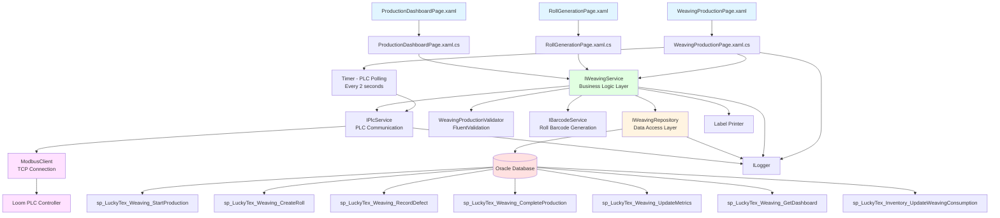

# Process: Weaving Production

**Process ID**: WV-002
**Module**: 05 - Weaving
**Priority**: P2 (Core Production Module)
**Created**: 2025-10-06

---

## 1. Process Overview

### Purpose
Execute fabric weaving production on configured loom with real-time PLC monitoring, fabric roll generation, defect tracking, and material consumption recording. Produce grey fabric rolls from warp beam and weft yarn with complete traceability.

### Scope
- Start weaving production on ready loom
- Monitor real-time production metrics via PLC (pick counter, speed, breaks)
- Generate fabric rolls at stop marks
- Record defects (weft breaks, warp breaks, pattern defects)
- Complete production and calculate material consumption
- Update inventory (consume beam and weft, create fabric rolls)
- Print fabric roll labels with traceability

### Module(s) Involved
- **Primary**: M05 - Weaving
- **Upstream**: M04 - Drawing (beam supply), M01 - Warehouse (weft yarn)
- **Downstream**: M06 - Finishing, M08 - Inspection (fabric roll consumption)

---

## 2. UI Files Inventory

### XAML Files
| File Path | Description | Purpose |
|-----------|-------------|---------|
| `LuckyTex.AirBag.Pages/Pages/05 - Weaving/WeavingProductionPage.xaml` | Production monitoring interface | Start/monitor/complete weaving |
| `LuckyTex.AirBag.Pages/Pages/05 - Weaving/RollGenerationPage.xaml` | Roll creation dialog | Generate fabric roll on stop mark |
| `LuckyTex.AirBag.Pages/Pages/05 - Weaving/ProductionDashboardPage.xaml` | Real-time production dashboard | Monitor all active looms |
| `LuckyTex.AirBag.Pages/Pages/05 - Weaving/WeavingMenuPage.xaml` | Weaving module menu | Navigation hub |

### Code-Behind Files
| File Path | Description |
|-----------|-------------|
| `LuckyTex.AirBag.Pages/Pages/05 - Weaving/WeavingProductionPage.xaml.cs` | Production event handlers and PLC polling |
| `LuckyTex.AirBag.Pages/Pages/05 - Weaving/RollGenerationPage.xaml.cs` | Roll generation logic |
| `LuckyTex.AirBag.Pages/Pages/05 - Weaving/ProductionDashboardPage.xaml.cs` | Dashboard refresh logic |

### Service Files
| File Path | Description |
|-----------|-------------|
| *(To be created)* `LuckyTex.AirBag.Core/Repositories/WeavingRepository.cs` | Repository for weaving operations |
| *(To be created)* `LuckyTex.AirBag.Core/Services/WeavingService.cs` | Service layer for weaving business logic |
| *(To be created)* `LuckyTex.AirBag.Core/Services/PlcService.cs` | PLC communication service (Modbus TCP) |
| *(To be created)* `LuckyTex.AirBag.Core/Services/BarcodeService.cs` | Barcode generation |
| *(To be created)* `LuckyTex.AirBag.Core/Validators/WeavingProductionValidator.cs` | FluentValidation for production |

---

## 3. UI Layout Description

### WeavingProductionPage.xaml

**Screen Title**: "Weaving Production" or "Loom Operation Monitor"

**Key UI Controls**:

**Loom Selection Section**:
- Loom ID dropdown (filter: status = Ready or Running)
- Display current setup:
  - Beam barcode
  - Weft yarn lot
  - Product/pattern
  - Target parameters (PPI, speed, width)

**Production Control Section**:
- `cmdStart` - Start weaving production
- `cmdStop` - Stop loom
- `cmdPause` - Pause production
- `cmdResume` - Resume after pause
- Production status indicator (Stopped, Running, Paused, Error)

**Real-Time Monitoring Section** (updates every 2 seconds from PLC):
- Pick counter (total picks)
  - Display numeric value
- Fabric length produced (meters) - calculated
  - Display progress bar and numeric
- Current speed (picks/min)
  - Display gauge/numeric
- Target speed (from setup)
- Speed percentage (actual/target × 100%)
- Warp tension (N) - actual reading
- Weft tension (N) - actual reading
- Temperature (°C) - if available
- Run time (HH:MM:SS)

**Break/Defect Tracking Section**:
- Weft break count (numeric, real-time from PLC)
- Warp break count (numeric, real-time from PLC)
- Pattern defect count (manual entry)
- Last break time (timestamp)
- `cmdRecordDefect` - Manually record defect

**Fabric Roll Section**:
- Current roll number (auto-increment)
- Current roll meters (since last stop mark)
- Last stop mark position (meters)
- `cmdStopMark` - Generate new fabric roll
- Rolls generated list (DataGrid):
  - Columns: Roll Barcode, Length (m), Time Generated, Operator

**Action Buttons**:
- `cmdCompleteProduction` - End production session
- `cmdBack` - Return to dashboard

### RollGenerationPage.xaml (Dialog)

**Screen Title**: "Generate Fabric Roll"

**Key UI Controls**:
- Display current meter reading (from PLC)
- Display last stop mark
- Calculated roll length (current - last) - read-only
- Roll barcode (auto-generated) - read-only
- Quality remarks (optional textbox)
- Visual defects checkbox list (if any)
- `cmdGenerate` - Confirm roll generation
- `cmdCancel` - Cancel

### ProductionDashboardPage.xaml

**Screen Title**: "Weaving Production Dashboard"

**Key UI Controls**:
- Summary cards:
  - Total looms running
  - Total meters today
  - Total rolls today
  - Average efficiency %
- DataGrid showing all active looms:
  - Columns: Loom ID, Product, Meters, Rolls, Speed, Breaks, Efficiency %, Operator, Status
  - Color coding: Green (Running smoothly), Yellow (Low efficiency), Red (Stopped/Error)
- `cmdRefresh` - Reload data
- Auto-refresh every 10 seconds

---

## 4. Component Architecture Diagram



---

## 5. Workflow Diagram

```mermaid
graph TD
    START[Start: Weaving Production] --> SELECT_LOOM[Select Loom - Status = Ready]
    SELECT_LOOM --> CHECK{Loom Ready?}

    CHECK -->|No| ERROR1[Error: Loom Not Ready]
    ERROR1 --> END[End]

    CHECK -->|Yes| DISPLAY_SETUP[Display Setup Info:<br/>Beam, Weft, Product]
    DISPLAY_SETUP --> START_PROD[Click Start Production]

    START_PROD --> SEND_START[Send Start Command to PLC]
    SEND_START --> CREATE_SESSION[Create Production Session Record]
    CREATE_SESSION --> UPDATE_STATUS[Update Loom Status = Running]

    UPDATE_STATUS --> POLL_START[Start PLC Polling Timer - 2 sec]
    POLL_START --> MONITOR[Monitor Real-Time Data:<br/>- Pick Counter<br/>- Speed<br/>- Tensions<br/>- Breaks]

    MONITOR --> CHECK_BREAK{Break Detected?}
    CHECK_BREAK -->|Weft Break| AUTO_STOP[PLC Auto-Stop]
    AUTO_STOP --> RECORD_WEFT[Record Weft Break]
    RECORD_WEFT --> ALERT_OPERATOR[Alert Operator - Fix Weft]
    ALERT_OPERATOR --> RESUME_WAIT{Operator Action?}

    RESUME_WAIT -->|Resume| SEND_RESUME[Send Resume to PLC]
    SEND_RESUME --> MONITOR

    CHECK_BREAK -->|Warp Break| CRITICAL_STOP[PLC Emergency Stop]
    CRITICAL_STOP --> RECORD_WARP[Record Warp Break]
    RECORD_WARP --> ALERT_CRITICAL[Critical Alert - Inspection Required]
    ALERT_CRITICAL --> INSPECT{Repairable?}

    INSPECT -->|Yes| REPAIR[Repair and Resume]
    REPAIR --> MONITOR
    INSPECT -->|No| FORCE_COMPLETE[Force Complete Production]

    CHECK_BREAK -->|No Break| RUNNING[Running Normally]
    RUNNING --> STOP_MARK{Operator Clicks<br/>Stop Mark?}

    STOP_MARK -->|Yes| PAUSE_LOOM[Pause Loom]
    PAUSE_LOOM --> READ_METER[Read Current Meter from PLC]
    READ_METER --> CALC_LENGTH[Calculate Roll Length:<br/>Current - Last Stop Mark]
    CALC_LENGTH --> GEN_BARCODE[Generate Roll Barcode:<br/>FR-YYYYMMDD-####]
    GEN_BARCODE --> CREATE_ROLL[Create Fabric Roll Record]
    CREATE_ROLL --> LINK_TRACE[Link Traceability:<br/>Roll → Beam → Weft]
    LINK_TRACE --> PRINT_LABEL[Print Roll Label]
    PRINT_LABEL --> UPDATE_LAST[Update Last Stop Mark Position]
    UPDATE_LAST --> INCREMENT_ROLL[Increment Roll Number]
    INCREMENT_ROLL --> RESUME_AUTO[Auto-Resume Loom]
    RESUME_AUTO --> MONITOR

    STOP_MARK -->|No| CONTINUE{Continue<br/>Production?}

    CONTINUE -->|Yes| MONITOR
    CONTINUE -->|No| COMPLETE_CLICK[Operator Clicks Complete]

    COMPLETE_CLICK --> FINAL_STOP[Send Stop to PLC]
    FINAL_STOP --> READ_FINAL[Read Final Metrics]
    READ_FINAL --> CALC_CONSUMPTION[Calculate Material Consumption:<br/>- Beam length used<br/>- Weft yarn used (kg)]

    CALC_CONSUMPTION --> DEDUCT_INV[Deduct Inventory:<br/>Beam, Weft]
    DEDUCT_INV --> ADD_ROLLS[Add Fabric Rolls to Inventory]
    ADD_ROLLS --> CALC_EFFICIENCY[Calculate Efficiency:<br/>(Actual / Target) × 100%]

    CALC_EFFICIENCY --> SAVE_COMPLETE[Save Production Complete Record]
    SAVE_COMPLETE --> UPDATE_LOOM_STATUS[Update Loom Status = Available]
    UPDATE_LOOM_STATUS --> STOP_POLLING[Stop PLC Polling Timer]

    STOP_POLLING --> SUCCESS[Success: Production Complete]
    SUCCESS --> END

    FORCE_COMPLETE --> SAVE_COMPLETE

    style START fill:#e1f5ff
    style SUCCESS fill:#e1ffe1
    style END fill:#e1f5ff
    style ERROR1 fill:#ffe1e1
    style ALERT_OPERATOR fill:#fff4e1
    style ALERT_CRITICAL fill:#ffe1e1
```

---

## 6. Business Logic Sequence Diagram

```mermaid
sequenceDiagram
    participant Operator
    participant UI as WeavingProductionPage
    participant Timer as Polling Timer
    participant BL as WeavingService
    participant REPO as WeavingRepository
    participant DB as Oracle Database
    participant PLC as Loom PLC
    participant Printer

    Note over Operator,Printer: Start Weaving Production

    Operator->>UI: Select loom (status = Ready)
    UI->>BL: GetLoomSetup(loomId)
    BL->>REPO: GetLoomSetup(loomId)
    REPO->>DB: sp_LuckyTex_Loom_GetSetup
    DB-->>REPO: Setup (beam, weft, product, parameters)
    REPO-->>BL: Setup entity
    BL-->>UI: Display setup info

    Operator->>UI: Click Start Production
    UI->>BL: StartWeavingProduction(loomId, operatorId)
    BL->>REPO: BeginTransaction()

    BL->>REPO: CreateProductionSession(loomId, operatorId)
    REPO->>DB: sp_LuckyTex_Weaving_StartProduction
    Note over DB: INSERT INTO tblWeavingProduction<br/>(loomId, beamBarcode, weftLot,<br/>productCode, startTime, status='Running')
    DB-->>REPO: Production session ID

    BL->>REPO: UpdateLoomStatus(loomId, 'Running')
    REPO->>DB: sp_LuckyTex_Loom_UpdateStatus
    DB-->>REPO: Success

    BL->>REPO: CommitTransaction()
    BL->>PLC: SendStartCommand(loomId)
    PLC-->>BL: Loom started
    BL-->>UI: Production started

    UI->>Timer: Start polling timer (2-second interval)

    loop Every 2 seconds (production monitoring)
        Timer->>PLC: ReadLoomData(loomId)
        Note over PLC: Read Modbus registers:<br/>- Pick counter (reg 1001)<br/>- Speed (reg 1002)<br/>- Weft breaks (reg 1010)<br/>- Warp breaks (reg 1011)<br/>- Warp tension (reg 1020)<br/>- Weft tension (reg 1021)
        PLC-->>Timer: Data array

        Timer->>BL: ProcessPlcData(data)
        BL->>BL: Calculate fabric length = picks / PPI
        BL->>BL: Calculate current roll length = length - lastStopMark
        BL-->>UI: Update display:<br/>- Pick counter<br/>- Length (m)<br/>- Speed<br/>- Breaks<br/>- Tensions

        alt Weft break detected (reg 1010 incremented)
            PLC->>PLC: Auto-stop loom
            Timer->>BL: WeftBreakDetected(loomId)
            BL->>REPO: RecordDefect(sessionId, 'WEFT_BREAK', position)
            REPO->>DB: sp_LuckyTex_Weaving_RecordDefect
            DB-->>REPO: Defect recorded
            BL-->>UI: Alert: Weft Break - Fix and Resume

            Operator->>Operator: Fix weft yarn
            Operator->>UI: Click Resume
            UI->>BL: ResumeLoom(loomId)
            BL->>PLC: SendResumeCommand(loomId)
            PLC-->>BL: Resumed
            BL-->>UI: Loom resumed
        end

        alt Warp break detected (reg 1011 incremented)
            PLC->>PLC: Emergency stop
            Timer->>BL: WarpBreakDetected(loomId)
            BL->>REPO: RecordDefect(sessionId, 'WARP_BREAK', position)
            REPO->>DB: sp_LuckyTex_Weaving_RecordDefect
            DB-->>REPO: Defect recorded
            BL-->>UI: Critical Alert: Warp Break - Inspection Required
            Note over Operator: Operator inspects and decides
        end
    end

    Note over Operator,Printer: Generate Fabric Roll on Stop Mark

    Operator->>UI: Click Stop Mark
    UI->>BL: GenerateFabricRoll(sessionId, loomId)
    BL->>PLC: ReadCurrentMeter(loomId)
    PLC-->>BL: Current meter (e.g., 1250.5 m)

    BL->>BL: Calculate roll length = current - lastStopMark (e.g., 75.5 m)
    BL->>BL: Generate roll barcode: FR-YYYYMMDD-#### (e.g., FR-20251006-0123)

    BL->>REPO: BeginTransaction()
    BL->>REPO: CreateFabricRoll(roll)
    REPO->>DB: sp_LuckyTex_Weaving_CreateRoll
    Note over DB: INSERT INTO tblFabricRoll<br/>(barcode, productionSessionId,<br/>length, beamBarcode, weftLot,<br/>productCode, loomId, date)
    DB-->>REPO: Roll ID

    BL->>REPO: LinkRollTraceability(rollId, beamBarcode, weftLot)
    REPO->>DB: sp_LuckyTex_Traceability_LinkRoll
    Note over DB: INSERT INTO tblRollTraceability<br/>(rollId, beamBarcode, weftLotNumber)
    DB-->>REPO: Link created

    BL->>REPO: UpdateLastStopMark(sessionId, currentMeter)
    REPO->>DB: sp_LuckyTex_Weaving_UpdateMetrics
    DB-->>REPO: Updated

    BL->>REPO: CommitTransaction()

    BL->>Printer: PrintRollLabel with:<br/>- Roll barcode<br/>- Length, Product<br/>- Loom, Date<br/>- Beam (traceability)
    Printer-->>BL: Label printed

    BL-->>UI: Roll generated successfully
    UI->>UI: Add roll to list, increment roll number

    Note over Operator,Printer: Complete Production

    Operator->>UI: Click Complete Production
    UI->>BL: CompleteWeavingProduction(sessionId, loomId)
    BL->>PLC: SendStopCommand(loomId)
    PLC-->>BL: Loom stopped

    BL->>PLC: ReadFinalMetrics(loomId)
    PLC-->>BL: Final picks, run time

    BL->>BL: Calculate total fabric length = finalPicks / PPI
    BL->>BL: Calculate beam consumption (meters from beam)
    BL->>BL: Calculate weft consumption (kg) = (picks × weftDensity) / 1000
    BL->>BL: Calculate efficiency = (actualSpeed / targetSpeed) × 100%

    BL->>REPO: BeginTransaction()

    BL->>REPO: UpdateProductionComplete(sessionId, metrics)
    REPO->>DB: sp_LuckyTex_Weaving_CompleteProduction
    Note over DB: UPDATE tblWeavingProduction<br/>SET endTime, totalLength, totalPicks,<br/>weftBreaks, warpBreaks, efficiency,<br/>status='Completed'
    DB-->>REPO: Success

    BL->>REPO: DeductBeamInventory(beamBarcode, lengthUsed)
    REPO->>DB: sp_LuckyTex_Inventory_UpdateWeavingConsumption
    Note over DB: UPDATE tblBeam<br/>SET remainingLength = remainingLength - @used
    DB-->>REPO: Success

    BL->>REPO: DeductWeftInventory(weftLot, kgUsed)
    REPO->>DB: sp_LuckyTex_Inventory_Deduct
    DB-->>REPO: Success

    BL->>REPO: UpdateLoomStatus(loomId, 'Available')
    REPO->>DB: sp_LuckyTex_Loom_UpdateStatus
    DB-->>REPO: Success

    BL->>REPO: CommitTransaction()

    BL-->>UI: Production completed successfully
    UI->>Timer: Stop polling timer
    UI->>UI: Display completion summary, clear form
```



---

## 7. Data Flow

### Input Data

| Data Element | Source | Format | Validation |
|--------------|--------|--------|------------|
| Loom ID | Selection | String (20 chars) | Must exist with status = Ready |
| Operator ID | Login session | String (10 chars) | Valid employee |
| Start Time | System | DateTime | Auto-set |
| Target Production Length | Setup | Decimal (10,2) meters | Optional |
| Manual Defect Entry | Operator | Defect type + position | Valid defect code |

### Output Data

| Data Element | Destination | Format | Purpose |
|--------------|-------------|--------|---------|
| Production Session Record | tblWeavingProduction | Database record | Production tracking |
| Fabric Roll Records | tblFabricRoll | Multiple records | Inventory tracking |
| Roll Barcodes | tblFabricRoll + Label | FR-YYYYMMDD-#### | Roll identification |
| Traceability Links | tblRollTraceability | Beam + Weft mappings | Forward/backward traceability |
| Defect Records | tblWeavingDefect | Defect log | Quality analysis |
| Real-Time Metrics | UI Display | Pick counter, speed, etc. | Operator monitoring |
| Inventory Updates | tblBeam, tblInventory | Quantity decrements | Material consumption |
| Production Summary | tblWeavingProduction | Completion metrics | Performance reporting |
| Roll Labels | Printer | Printed labels | Physical identification |

### Data Transformations

1. **Pick Counter → Fabric Length**: Length (m) = Picks ÷ PPI (picks per inch) ÷ 39.37 (inch to meter)
2. **Current Meter - Last Stop Mark → Roll Length**: Calculate individual roll length
3. **Picks × Weft Density → Weft Consumption**: kg = (Picks × WeftLinearDensity) ÷ 1000
4. **Fabric Length → Beam Consumption**: Assume 1:1 ratio (1m fabric = 1m warp from beam)
5. **Actual Speed ÷ Target Speed → Efficiency %**: Performance metric
6. **Defect Count ÷ Total Length → Defect Rate**: Defects per 100 meters

---

## 8. Database Operations

### Stored Procedures Used

#### sp_LuckyTex_Weaving_StartProduction
- **Purpose**: Create weaving production session
- **Parameters**:
  - @LoomID VARCHAR(20)
  - @BeamBarcode VARCHAR(30)
  - @WeftLotNumber VARCHAR(30)
  - @ProductCode VARCHAR(20)
  - @OperatorID VARCHAR(10)
  - @StartTime DATETIME
- **Returns**: Production session ID
- **Tables Written**: tblWeavingProduction

#### sp_LuckyTex_Weaving_CreateRoll
- **Purpose**: Create fabric roll record
- **Parameters**:
  - @Barcode VARCHAR(30)
  - @ProductionSessionID INT
  - @Length DECIMAL(10,2)
  - @BeamBarcode VARCHAR(30)
  - @WeftLotNumber VARCHAR(30)
  - @ProductCode VARCHAR(20)
  - @LoomID VARCHAR(20)
  - @CreateDate DATETIME
- **Returns**: Roll ID
- **Tables Written**: tblFabricRoll

#### sp_LuckyTex_Weaving_RecordDefect
- **Purpose**: Record production defect
- **Parameters**:
  - @SessionID INT
  - @DefectType VARCHAR(50) (WEFT_BREAK, WARP_BREAK, PATTERN_DEFECT)
  - @Position DECIMAL(10,2) (meter position)
  - @Timestamp DATETIME
- **Returns**: Defect record ID
- **Tables Written**: tblWeavingDefect

#### sp_LuckyTex_Weaving_CompleteProduction
- **Purpose**: Complete production session with final metrics
- **Parameters**:
  - @SessionID INT
  - @EndTime DATETIME
  - @TotalPicks INT
  - @TotalLength DECIMAL(10,2)
  - @WeftBreaks INT
  - @WarpBreaks INT
  - @Efficiency DECIMAL(5,2)
- **Returns**: Success flag
- **Tables Written**: tblWeavingProduction

#### sp_LuckyTex_Weaving_UpdateMetrics
- **Purpose**: Update production metrics during session
- **Parameters**:
  - @SessionID INT
  - @LastStopMark DECIMAL(10,2)
  - @RollCount INT
- **Returns**: Success flag
- **Tables Written**: tblWeavingProduction

#### sp_LuckyTex_Weaving_GetDashboard
- **Purpose**: Get production dashboard data
- **Parameters**: None (or date filter)
- **Returns**: All active production sessions with metrics
- **Tables Read**: tblWeavingProduction, tblLoom, tblEmployee

#### sp_LuckyTex_Inventory_UpdateWeavingConsumption
- **Purpose**: Deduct beam and weft inventory
- **Parameters**:
  - @BeamBarcode VARCHAR(30)
  - @BeamLengthUsed DECIMAL(10,2)
  - @WeftLotNumber VARCHAR(30)
  - @WeftKgUsed DECIMAL(10,3)
  - @SessionID INT (reference)
- **Returns**: Success flag
- **Tables Written**: tblBeam, tblInventory, tblInventoryTransaction

#### sp_LuckyTex_Traceability_LinkRoll
- **Purpose**: Create traceability link for fabric roll
- **Parameters**:
  - @RollID INT
  - @BeamBarcode VARCHAR(30)
  - @WeftLotNumber VARCHAR(30)
- **Returns**: Link ID
- **Tables Written**: tblRollTraceability

### Transaction Scope

#### Start Production Transaction
```sql
BEGIN TRANSACTION
  1. INSERT INTO tblWeavingProduction (sp_LuckyTex_Weaving_StartProduction)
  2. UPDATE tblLoom - set status = 'Running' (sp_LuckyTex_Loom_UpdateStatus)
  3. INSERT INTO tblLoomHistory - 'PRODUCTION_STARTED'
COMMIT TRANSACTION
```

#### Generate Roll Transaction
```sql
BEGIN TRANSACTION
  1. INSERT INTO tblFabricRoll (sp_LuckyTex_Weaving_CreateRoll)
  2. INSERT INTO tblRollTraceability (sp_LuckyTex_Traceability_LinkRoll)
  3. UPDATE tblWeavingProduction - last stop mark, roll count (sp_LuckyTex_Weaving_UpdateMetrics)
COMMIT TRANSACTION
```

#### Complete Production Transaction
```sql
BEGIN TRANSACTION
  1. UPDATE tblWeavingProduction - set end time, metrics, status='Completed' (sp_LuckyTex_Weaving_CompleteProduction)
  2. UPDATE tblBeam - deduct consumed length (sp_LuckyTex_Inventory_UpdateWeavingConsumption)
  3. UPDATE tblInventory - deduct weft yarn (sp_LuckyTex_Inventory_UpdateWeavingConsumption)
  4. INSERT INTO tblInventoryTransaction - record consumption
  5. UPDATE tblLoom - set status = 'Available' (sp_LuckyTex_Loom_UpdateStatus)
  6. INSERT INTO tblLoomHistory - 'PRODUCTION_COMPLETED'
COMMIT TRANSACTION
```

---

## 9. Implementation Checklist

### Phase 1: Repository Layer
- [ ] Extend `IWeavingRepository` interface
  - [ ] StartProduction(WeavingProduction production) method
  - [ ] CreateFabricRoll(FabricRoll roll) method
  - [ ] RecordDefect(WeavingDefect defect) method
  - [ ] CompleteProduction(int sessionId, ProductionMetrics metrics) method
  - [ ] UpdateProductionMetrics(int sessionId, decimal lastStopMark, int rollCount) method
  - [ ] GetProductionDashboard() method
  - [ ] LinkRollTraceability(int rollId, string beamBarcode, string weftLot) method
  - [ ] UpdateWeavingConsumption(string beamBarcode, decimal beamUsed, string weftLot, decimal weftUsed, int sessionId) method
- [ ] Implement in `WeavingRepository`
  - [ ] Map all stored procedures
  - [ ] Transaction management (multi-step operations)
- [ ] Unit tests
  - [ ] Test production start transaction
  - [ ] Test roll generation transaction
  - [ ] Test completion transaction with inventory updates

### Phase 2: PLC Communication Layer
- [ ] Extend `IPlcService` interface
  - [ ] StartLoom(string loomId) method
  - [ ] StopLoom(string loomId) method
  - [ ] ResumeLoom(string loomId) method
  - [ ] ReadLoomData(string loomId) method → returns PlcData (picks, speed, breaks, tensions)
  - [ ] ReadCurrentMeter(string loomId) method → returns decimal meters
- [ ] Implement `ModbusPlcService`
  - [ ] Register mapping:
    - 1001: Pick counter
    - 1002: Current speed (picks/min)
    - 1010: Weft break count
    - 1011: Warp break count
    - 1020: Warp tension
    - 1021: Weft tension
    - 2000: Control command (0=Stop, 1=Start, 2=Resume)
  - [ ] Polling optimization (read multiple registers in single call)
  - [ ] Error handling and auto-reconnect
- [ ] Unit tests (with PLC simulator)
  - [ ] Test continuous polling
  - [ ] Test break detection
  - [ ] Test control commands

### Phase 3: Service Layer
- [ ] Extend `IWeavingService` interface
  - [ ] StartWeavingProduction(string loomId, string operatorId) method
  - [ ] GenerateFabricRoll(int sessionId, string loomId) method
  - [ ] RecordManualDefect(int sessionId, string defectType, decimal position) method
  - [ ] CompleteWeavingProduction(int sessionId, string loomId) method
  - [ ] GetProductionDashboard() method
  - [ ] ProcessPlcData(PlcData data, int sessionId) method (for real-time updates)
- [ ] Create `WeavingProductionValidator` using FluentValidation
  - [ ] Validate loom status = Ready before start
  - [ ] Validate roll length > 0
  - [ ] Validate production session exists
- [ ] Implement in `WeavingService`
  - [ ] Production orchestration (start, monitor, complete)
  - [ ] Roll generation with barcode
  - [ ] Material consumption calculation
  - [ ] Efficiency calculation
  - [ ] Error handling and logging
- [ ] Unit tests
  - [ ] Test production workflow end-to-end
  - [ ] Test roll generation with traceability
  - [ ] Test defect recording
  - [ ] Test consumption calculations

### Phase 4: UI Refactoring
- [ ] Update `WeavingProductionPage.xaml.cs`
  - [ ] Inject IWeavingService, IPlcService
  - [ ] Implement polling timer (2-second interval)
  - [ ] Update start production handler
  - [ ] Update stop mark handler (open RollGenerationPage dialog)
  - [ ] Update complete production handler
  - [ ] Real-time UI updates from PLC data
  - [ ] Handle break alerts
- [ ] Update `RollGenerationPage.xaml.cs`
  - [ ] Inject IWeavingService, IBarcodeService
  - [ ] Generate roll barcode
  - [ ] Confirm roll generation
- [ ] Update `ProductionDashboardPage.xaml.cs`
  - [ ] Inject IWeavingService
  - [ ] Bind production dashboard DataGrid
  - [ ] Auto-refresh every 10 seconds
  - [ ] Calculate summary cards

### Phase 5: Integration Testing
- [ ] Test with real database
  - [ ] Complete production workflow with multiple rolls
  - [ ] Verify traceability links created
  - [ ] Verify inventory consumption (beam + weft)
  - [ ] Test roll label printing
- [ ] Test with PLC
  - [ ] Real-time monitoring (2-second polling)
  - [ ] Break detection and alerts
  - [ ] Control commands (start/stop/resume)
- [ ] Performance testing
  - [ ] PLC polling overhead
  - [ ] Dashboard refresh performance
  - [ ] Concurrent multi-loom monitoring

### Phase 6: Deployment
- [ ] Code review
- [ ] Unit tests passing (80%+)
- [ ] Integration tests passing
- [ ] User acceptance testing (UAT)
  - [ ] Production operators test weaving workflow
  - [ ] Verify PLC communication stability
  - [ ] Validate roll labels and traceability
- [ ] Production deployment
- [ ] Monitor first week of use

---

**Document Version**: 1.0
**Last Updated**: 2025-10-06
**Status**: Ready for Implementation
**Estimated Effort**: 4-5 days (1 developer)
