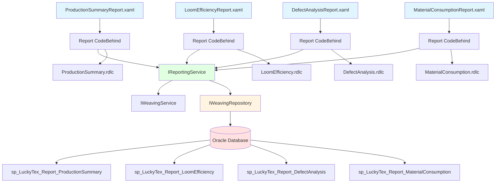
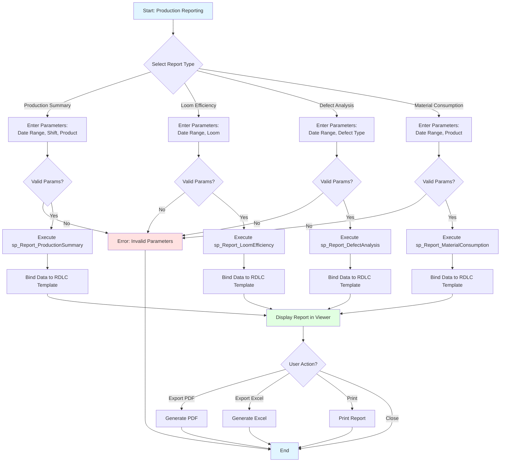
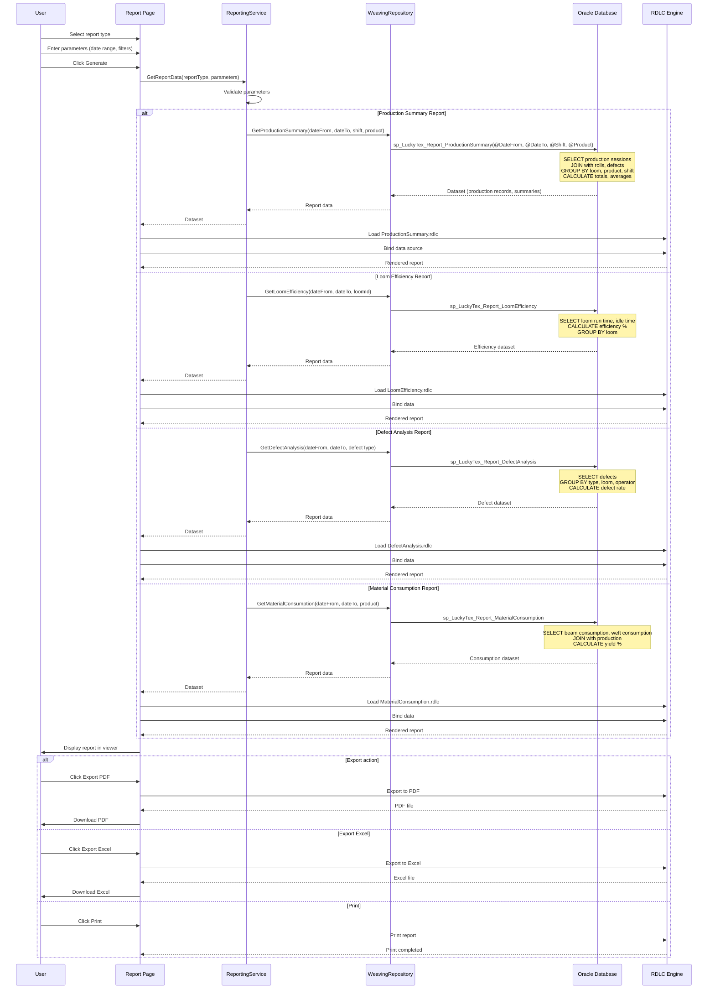

# Process: Weaving Production Reporting

**Process ID**: WV-004
**Module**: 05 - Weaving
**Priority**: P2 (Core Production Module)
**Created**: 2025-10-06

---

## 1. Process Overview

### Purpose
Generate production reports for weaving operations including daily production summary, loom efficiency analysis, defect tracking, and material consumption reports for management decision-making and performance monitoring.

### Scope
- Daily production summary report
- Loom efficiency report
- Defect analysis report
- Material consumption report (beam + weft)
- Operator performance report
- Production vs target analysis

### Module(s) Involved
- **Primary**: M05 - Weaving
- **Data Sources**: tblWeavingProduction, tblFabricRoll, tblWeavingDefect, tblLoom, tblEmployee

---

## 2. UI Files Inventory

### XAML Files
| File Path | Description | Purpose |
|-----------|-------------|---------|
| `LuckyTex.AirBag.Pages/Pages/05 - Weaving/Reports/ProductionSummaryReport.xaml` | Daily production summary | RDLC report viewer |
| `LuckyTex.AirBag.Pages/Pages/05 - Weaving/Reports/LoomEfficiencyReport.xaml` | Efficiency analysis | RDLC report viewer |
| `LuckyTex.AirBag.Pages/Pages/05 - Weaving/Reports/DefectAnalysisReport.xaml` | Defect tracking | RDLC report viewer |
| `LuckyTex.AirBag.Pages/Pages/05 - Weaving/Reports/MaterialConsumptionReport.xaml` | Material usage | RDLC report viewer |
| `LuckyTex.AirBag.Pages/Pages/05 - Weaving/WeavingMenuPage.xaml` | Module dashboard | Navigation |

### Code-Behind Files
| File Path | Description |
|-----------|-------------|
| `LuckyTex.AirBag.Pages/Pages/05 - Weaving/Reports/ProductionSummaryReport.xaml.cs` | Report parameter handling |
| `LuckyTex.AirBag.Pages/Pages/05 - Weaving/Reports/LoomEfficiencyReport.xaml.cs` | Report parameter handling |
| `LuckyTex.AirBag.Pages/Pages/05 - Weaving/Reports/DefectAnalysisReport.xaml.cs` | Report parameter handling |
| `LuckyTex.AirBag.Pages/Pages/05 - Weaving/Reports/MaterialConsumptionReport.xaml.cs` | Report parameter handling |

### Report Template Files (RDLC)
| File Path | Description |
|-----------|-------------|
| `LuckyTex.AirBag.Pages/Reports/Weaving/ProductionSummary.rdlc` | Production summary template |
| `LuckyTex.AirBag.Pages/Reports/Weaving/LoomEfficiency.rdlc` | Efficiency report template |
| `LuckyTex.AirBag.Pages/Reports/Weaving/DefectAnalysis.rdlc` | Defect analysis template |
| `LuckyTex.AirBag.Pages/Reports/Weaving/MaterialConsumption.rdlc` | Consumption report template |

### Service Files
| File Path | Description |
|-----------|-------------|
| *(To be created)* `LuckyTex.AirBag.Core/Repositories/WeavingRepository.cs` | Repository |
| *(To be created)* `LuckyTex.AirBag.Core/Services/WeavingService.cs` | Service layer |
| *(To be created)* `LuckyTex.AirBag.Core/Services/ReportingService.cs` | Report data aggregation |

---

## 3. UI Layout Description

### ProductionSummaryReport.xaml

**Screen Title**: "Daily Production Summary Report"

**Parameter Section**:
- Date range (From/To DatePickers)
- Shift filter (All, Day, Night)
- Product filter dropdown (optional)
- Loom filter dropdown (optional)
- `cmdGenerate` - Generate report

**Report Viewer**:
- ReportViewer control displaying:
  - Summary totals (total meters, rolls, looms used)
  - Production breakdown by loom
  - Production breakdown by product
  - Production breakdown by shift
  - Operator performance summary

### LoomEfficiencyReport.xaml

**Screen Title**: "Loom Efficiency Analysis"

**Parameter Section**:
- Date range
- Loom selection (All or specific loom)
- `cmdGenerate` - Generate report

**Report Viewer**:
- Efficiency metrics by loom:
  - Planned run time
  - Actual run time
  - Idle time
  - Efficiency % (actual / planned)
  - Average speed vs target
  - Downtime analysis (breaks, maintenance)

### DefectAnalysisReport.xaml

**Screen Title**: "Defect Analysis Report"

**Parameter Section**:
- Date range
- Defect type filter (All, Weft Break, Warp Break, Pattern Defect)
- `cmdGenerate` - Generate report

**Report Viewer**:
- Defect statistics:
  - Total defects by type
  - Defect rate (defects per 1000 meters)
  - Defects by loom
  - Defects by operator
  - Trend analysis chart

### MaterialConsumptionReport.xaml

**Screen Title**: "Material Consumption Report"

**Parameter Section**:
- Date range
- Product filter
- `cmdGenerate` - Generate report

**Report Viewer**:
- Consumption data:
  - Beam consumption (meters)
  - Weft yarn consumption (kg)
  - Consumption by product
  - Yield analysis (fabric output vs material input)
  - Waste percentage

---

## 4. Component Architecture Diagram

---

## 5. Workflow Diagram

---

## 6. Business Logic Sequence Diagram

---

## 7. Data Flow

### Input Data

| Data Element | Source | Format | Validation |
|--------------|--------|--------|------------|
| Date From | User input | DateTime | Required, <= Date To |
| Date To | User input | DateTime | Required, >= Date From |
| Shift Filter | Dropdown | String | Valid shift code or "All" |
| Product Filter | Dropdown | String | Valid product code or "All" |
| Loom Filter | Dropdown | String | Valid loom ID or "All" |
| Defect Type Filter | Dropdown | String | Valid defect type or "All" |

### Output Data

| Data Element | Destination | Format | Purpose |
|--------------|-------------|--------|---------|
| Production Summary Dataset | RDLC Report | Tabular data | Summary metrics |
| Efficiency Metrics | RDLC Report | Calculated values | Performance analysis |
| Defect Statistics | RDLC Report | Aggregated counts | Quality tracking |
| Consumption Data | RDLC Report | Quantities | Material usage |
| PDF/Excel Files | File system | Export formats | Distribution |

### Data Transformations

1. **Production Sessions → Daily Summary**: Aggregate by date, calculate totals
2. **Run Time → Efficiency %**: (Actual run time / Planned time) × 100
3. **Defects → Defect Rate**: (Defect count / Total meters) × 1000
4. **Material Used → Yield %**: (Fabric output / Material input) × 100

---

## 8. Database Operations

### Stored Procedures Used

#### sp_LuckyTex_Report_ProductionSummary
- **Purpose**: Get production summary data
- **Parameters**: @DateFrom, @DateTo, @Shift, @ProductCode
- **Returns**: Production sessions with totals, averages, breakdowns
- **Tables Read**: tblWeavingProduction, tblFabricRoll, tblLoom, tblEmployee

#### sp_LuckyTex_Report_LoomEfficiency
- **Purpose**: Calculate loom efficiency metrics
- **Parameters**: @DateFrom, @DateTo, @LoomID
- **Returns**: Efficiency percentages, run time, idle time
- **Tables Read**: tblWeavingProduction, tblLoom, tblLoomHistory

#### sp_LuckyTex_Report_DefectAnalysis
- **Purpose**: Aggregate defect statistics
- **Parameters**: @DateFrom, @DateTo, @DefectType
- **Returns**: Defect counts, rates, breakdowns
- **Tables Read**: tblWeavingDefect, tblWeavingProduction

#### sp_LuckyTex_Report_MaterialConsumption
- **Purpose**: Calculate material consumption
- **Parameters**: @DateFrom, @DateTo, @ProductCode
- **Returns**: Beam and weft usage, yield percentages
- **Tables Read**: tblWeavingProduction, tblInventoryTransaction, tblBeam

---

## 9. Implementation Checklist

### Phase 1: Repository Layer
- [ ] Extend `IWeavingRepository`
  - [ ] GetProductionSummary(params) method
  - [ ] GetLoomEfficiency(params) method
  - [ ] GetDefectAnalysis(params) method
  - [ ] GetMaterialConsumption(params) method
- [ ] Implement in `WeavingRepository`
- [ ] Unit tests

### Phase 2: Service Layer
- [ ] Create `IReportingService` interface
  - [ ] GetProductionSummaryData(params) method
  - [ ] GetLoomEfficiencyData(params) method
  - [ ] GetDefectAnalysisData(params) method
  - [ ] GetMaterialConsumptionData(params) method
- [ ] Implement `ReportingService`
  - [ ] Parameter validation
  - [ ] Data aggregation logic
- [ ] Unit tests

### Phase 3: RDLC Report Templates
- [ ] Create ProductionSummary.rdlc
  - [ ] Design layout with summaries and tables
  - [ ] Add charts (production trend)
- [ ] Create LoomEfficiency.rdlc
  - [ ] Design efficiency comparison layout
  - [ ] Add efficiency gauge charts
- [ ] Create DefectAnalysis.rdlc
  - [ ] Design defect breakdown layout
  - [ ] Add defect trend chart
- [ ] Create MaterialConsumption.rdlc
  - [ ] Design consumption layout
  - [ ] Add yield comparison chart

### Phase 4: UI Implementation
- [ ] Implement report pages (4 pages)
  - [ ] Parameter controls
  - [ ] ReportViewer binding
  - [ ] Export handlers (PDF, Excel)
  - [ ] Print handler
- [ ] Integration testing
  - [ ] Test each report with various parameters
  - [ ] Verify calculations
  - [ ] Test export functions

### Phase 5: Deployment
- [ ] Code review
- [ ] Unit tests passing
- [ ] UAT with management
- [ ] Production deployment

---

**Document Version**: 1.0
**Last Updated**: 2025-10-06
**Status**: Ready for Implementation
**Estimated Effort**: 3 days
