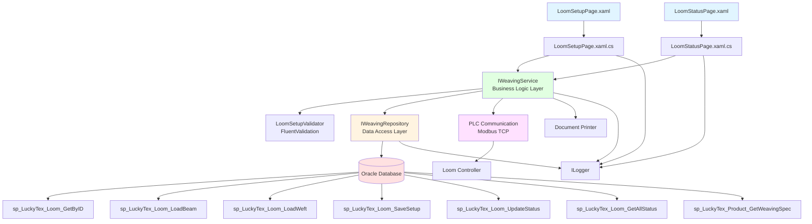
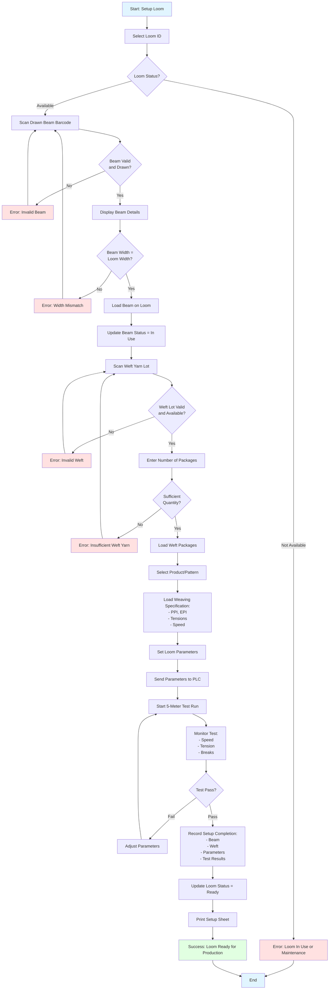

# Process: Loom Setup

**Process ID**: WV-001
**Module**: 05 - Weaving
**Priority**: P2 (Core Production Module)
**Created**: 2025-10-06

---

## 1. Process Overview

### Purpose
Set up weaving loom with drawn beam, weft yarn, and production parameters before starting fabric production. Ensure proper beam installation, yarn threading, and loom configuration to meet product specifications.

### Scope
- Load drawn beam onto loom
- Install weft yarn packages
- Configure loom parameters (weave pattern, tension, density)
- Verify threading and reed setup
- Test run and quality check
- Record setup completion

### Module(s) Involved
- **Primary**: M05 - Weaving
- **Upstream**: M04 - Drawing (drawn beam supply)
- **Upstream**: M01 - Warehouse (weft yarn supply)
- **Downstream**: Weaving production process

---

## 2. UI Files Inventory

### XAML Files
| File Path | Description | Purpose |
|-----------|-------------|---------|
| `LuckyTex.AirBag.Pages/Pages/05 - Weaving/LoomSetupPage.xaml` | Loom setup interface | Manage beam loading and configuration |
| `LuckyTex.AirBag.Pages/Pages/05 - Weaving/LoomStatusPage.xaml` | Loom status dashboard | View all loom statuses |
| `LuckyTex.AirBag.Pages/Pages/05 - Weaving/WeavingMenuPage.xaml` | Weaving module menu | Navigation hub |

### Code-Behind Files
| File Path | Description |
|-----------|-------------|
| `LuckyTex.AirBag.Pages/Pages/05 - Weaving/LoomSetupPage.xaml.cs` | Setup event handlers |
| `LuckyTex.AirBag.Pages/Pages/05 - Weaving/LoomStatusPage.xaml.cs` | Dashboard logic |

### Service Files
| File Path | Description |
|-----------|-------------|
| *(To be created)* `LuckyTex.AirBag.Core/Repositories/WeavingRepository.cs` | Repository for weaving operations |
| *(To be created)* `LuckyTex.AirBag.Core/Services/WeavingService.cs` | Service layer for weaving business logic |
| *(To be created)* `LuckyTex.AirBag.Core/Validators/LoomSetupValidator.cs` | FluentValidation for loom setup |

---

## 3. UI Layout Description

### LoomSetupPage.xaml

**Screen Title**: "Loom Setup" or "Beam Loading & Configuration"

**Key UI Controls**:

**Loom Selection Section**:
- Loom dropdown (or scan loom barcode)
  - Shows loom ID and current status
- Display loom specifications:
  - Width (cm)
  - Max speed (picks/min)
  - Current status (Available, In Setup, Running, Maintenance)

**Beam Loading Section**:
- Beam barcode textbox (focus on load)
  - KeyUp event: Enter triggers beam lookup
- Display beam details (read-only):
  - Beam barcode
  - Combined/drawn status
  - Length (meters)
  - Width (cm)
  - Number of ends
  - Yarn composition
- `cmdLoadBeam` - Confirm beam loading

**Weft Yarn Section**:
- Weft yarn lot textbox (scan or manual)
- Display weft details:
  - Lot number
  - Yarn type and color
  - Available quantity (kg)
- Number of weft packages to install (numeric input)
- `cmdLoadWeft` - Confirm weft loading

**Loom Parameters Section**:
- Product/pattern dropdown
  - Auto-loads weave pattern specifications
- Weave pattern display (read-only):
  - Pattern code
  - Picks per inch (PPI)
  - Ends per inch (EPI)
- Warp tension setting (numeric, N)
- Weft tension setting (numeric, N)
- Target picks per minute (speed)
- Target fabric width (cm)

**Test Run Section**:
- `cmdTestRun` - Run 5-meter test
- Test status display:
  - Meters woven (real-time from PLC)
  - Current speed
  - Tension readings
  - Break count
- Test result indicator (Pass/Fail)

**Action Buttons**:
- `cmdSave` - Save setup and mark loom as "Ready"
- `cmdCancel` - Cancel setup
- `cmdPrint` - Print setup sheet
- `cmdBack` - Return to dashboard

### LoomStatusPage.xaml

**Screen Title**: "Loom Status Dashboard"

**Key UI Controls**:
- DataGrid showing all looms:
  - Columns: Loom ID, Status, Beam Loaded, Product, Speed (picks/min), Operator, Last Update
  - Color coding: Green (Running), Yellow (Setup), Red (Error), Gray (Idle)
- Filter: Status dropdown
- `cmdRefresh` - Reload data
- `cmdSetup` - Navigate to setup page for selected loom

---

## 4. Component Architecture Diagram



---

## 5. Workflow Diagram



---

## 6. Business Logic Sequence Diagram

```mermaid
sequenceDiagram
    participant Operator
    participant UI as LoomSetupPage
    participant BL as WeavingService
    participant VAL as LoomSetupValidator
    participant REPO as WeavingRepository
    participant DB as Oracle Database
    participant PLC as Loom PLC
    participant Printer

    Note over Operator,Printer: Loom Setup Process

    Operator->>UI: Select loom ID
    UI->>BL: GetLoomDetails(loomId)
    BL->>REPO: GetLoomByID(loomId)
    REPO->>DB: sp_LuckyTex_Loom_GetByID
    DB-->>REPO: Loom details (width, speed, status)
    REPO-->>BL: Loom entity
    BL-->>UI: Display loom info

    alt Loom status = Available
        UI->>UI: Enable beam loading

        Operator->>UI: Scan beam barcode
        UI->>BL: ValidateBeamForLoom(barcode, loomId)
        BL->>REPO: GetBeamByBarcode(barcode)
        REPO->>DB: sp_LuckyTex_Beam_GetByBarcode
        DB-->>REPO: Beam details

        alt Beam exists and status = Drawn
            REPO-->>BL: Beam entity
            BL->>BL: Check beam.Width = loom.Width
            BL->>BL: Check beam.Status = "Drawn" or "Ready"

            alt Beam valid for loom
                BL-->>UI: Beam approved
                UI->>UI: Display beam details

                Operator->>UI: Click Load Beam
                UI->>BL: LoadBeamOnLoom(loomId, beamBarcode)
                BL->>REPO: BeginTransaction()

                BL->>REPO: UpdateLoomBeam(loomId, beamBarcode)
                REPO->>DB: sp_LuckyTex_Loom_LoadBeam
                Note over DB: UPDATE tblLoom<br/>SET currentBeam = @barcode,<br/>status = 'In Setup'
                DB-->>REPO: Success

                BL->>REPO: UpdateBeamStatus(beamBarcode, 'In Use')
                REPO->>DB: sp_LuckyTex_Beam_UpdateStatus
                DB-->>REPO: Success

                BL->>REPO: InsertLoomHistory(loomId, 'BEAM_LOADED')
                REPO->>DB: INSERT INTO tblLoomHistory
                DB-->>REPO: Success

                BL->>REPO: CommitTransaction()
                BL-->>UI: Beam loaded

                Operator->>UI: Scan weft yarn lot
                UI->>BL: ValidateWeftYarn(lotNumber)
                BL->>REPO: GetYarnLotByNumber(lotNumber)
                REPO->>DB: sp_LuckyTex_YarnLot_GetByNumber
                DB-->>REPO: Weft lot details

                alt Weft lot exists and available
                    REPO-->>BL: Yarn lot entity
                    BL-->>UI: Display weft details

                    Operator->>UI: Enter number of packages (e.g., 10)
                    Operator->>UI: Click Load Weft

                    UI->>BL: LoadWeftOnLoom(loomId, lotNumber, packages)
                    BL->>VAL: Validate weft loading request
                    VAL->>VAL: Check packages > 0
                    VAL->>VAL: Check sufficient inventory

                    alt Validation passed
                        VAL-->>BL: OK

                        BL->>REPO: UpdateLoomWeft(loomId, lotNumber, packages)
                        REPO->>DB: sp_LuckyTex_Loom_LoadWeft
                        Note over DB: UPDATE tblLoom<br/>SET weftLot = @lotNumber,<br/>weftPackages = @packages
                        DB-->>REPO: Success

                        BL->>REPO: InsertLoomHistory(loomId, 'WEFT_LOADED')
                        REPO->>DB: INSERT INTO tblLoomHistory
                        DB-->>REPO: Success

                        BL-->>UI: Weft loaded

                        Operator->>UI: Select product/pattern
                        UI->>BL: GetWeavingSpecification(productCode)
                        BL->>REPO: GetProductWeavingSpec(productCode)
                        REPO->>DB: sp_LuckyTex_Product_GetWeavingSpec
                        DB-->>REPO: Weaving spec (PPI, EPI, tensions, speed)
                        REPO-->>BL: Specification
                        BL-->>UI: Display spec

                        Operator->>UI: Review/adjust parameters
                        Operator->>UI: Click Save Setup

                        UI->>BL: SaveLoomSetup(setupRequest)
                        Note over setupRequest: loomId, beamBarcode,<br/>weftLot, productCode,<br/>parameters

                        BL->>VAL: Validate(setupRequest)
                        VAL->>VAL: Check all required fields
                        VAL->>VAL: Check parameters within spec ranges

                        alt Validation passed
                            VAL-->>BL: OK

                            BL->>REPO: SaveLoomSetup(setup)
                            REPO->>DB: sp_LuckyTex_Loom_SaveSetup
                            Note over DB: INSERT INTO tblLoomSetup<br/>(loomId, beamBarcode, weftLot,<br/>productCode, parameters, date)
                            DB-->>REPO: Setup ID

                            BL->>PLC: SendSetupParameters(loomId, parameters)
                            Note over PLC: Write to PLC registers:<br/>- Warp tension<br/>- Weft tension<br/>- Target speed<br/>- Weave pattern code
                            PLC-->>BL: Parameters set

                            Operator->>UI: Click Test Run
                            UI->>BL: StartTestRun(loomId)
                            BL->>PLC: StartLoom(targetLength=5.0m)
                            PLC-->>BL: Loom started

                            loop Every 2 seconds (test run)
                                BL->>PLC: ReadLoomStatus()
                                PLC-->>BL: Meters, speed, tension, breaks
                                BL->>UI: Update test display

                                alt Test complete (5m reached)
                                    PLC-->>BL: Test complete
                                    BL->>PLC: StopLoom()
                                    BL->>BL: Evaluate test (breaks = 0?)

                                    alt Test passed
                                        BL-->>UI: Test Pass (green)
                                        Operator->>UI: Confirm completion

                                        UI->>BL: CompleteSetup(loomId)
                                        BL->>REPO: UpdateLoomStatus(loomId, 'Ready')
                                        REPO->>DB: sp_LuckyTex_Loom_UpdateStatus
                                        DB-->>REPO: Status updated

                                        BL->>Printer: Print setup sheet with:<br/>- Loom ID<br/>- Beam barcode<br/>- Weft lot<br/>- Parameters<br/>- Test results
                                        Printer-->>BL: Sheet printed

                                        BL-->>UI: Setup complete
                                        UI->>UI: Display success, clear form

                                    else Test failed (breaks > 0)
                                        BL-->>UI: Test Failed - adjust parameters
                                    end
                                end
                            end

                        else Validation failed
                            VAL-->>BL: Error: Invalid setup
                            BL-->>UI: Show validation errors
                        end

                    else Validation failed
                        VAL-->>BL: Error: Invalid weft request
                        BL-->>UI: Show error
                    end

                else Weft lot invalid
                    REPO-->>BL: Error: Lot not found
                    BL-->>UI: Error: Invalid weft yarn lot
                end

            else Beam invalid for loom
                BL-->>UI: Error: Beam width mismatch or wrong status
            end

        else Beam not found or wrong status
            REPO-->>BL: Error: Beam not found
            BL-->>UI: Error: Invalid beam
        end

    else Loom not available
        BL-->>UI: Error: Loom not available for setup
    end
```



---

## 7. Data Flow

### Input Data

| Data Element | Source | Format | Validation |
|--------------|--------|--------|------------|
| Loom ID | Dropdown/scan | String (20 chars) | Must exist in tblMachine |
| Beam Barcode | Scan/manual | String (30 chars) | Must exist with status = Drawn |
| Weft Lot Number | Scan/manual | String (30 chars) | Must exist in tblInventory |
| Weft Packages | Operator input | Integer | > 0 |
| Product Code | Dropdown | String (20 chars) | Must exist in tblProduct |
| Warp Tension | Auto/manual | Decimal (5,2) N | Within spec range |
| Weft Tension | Auto/manual | Decimal (5,2) N | Within spec range |
| Target Speed | Auto/manual | Integer (picks/min) | Within loom capability |
| Target Width | Auto | Decimal (5,2) cm | Match beam width |
| Operator ID | Login session | String (10 chars) | Valid employee |

### Output Data

| Data Element | Destination | Format | Purpose |
|--------------|-------------|--------|---------|
| Loom Setup Record | tblLoomSetup | Database record | Setup configuration |
| Loom Status Update | tblLoom | Status = "Ready" | Loom readiness |
| Beam Status Update | tblBeam | Status = "In Use" | Beam consumption tracking |
| Loom History | tblLoomHistory | Transaction log | Audit trail |
| PLC Parameters | Loom Controller | Modbus registers | Machine configuration |
| Setup Sheet | Printer | Printed document | Operator reference |
| Test Run Results | tblLoomSetup | Metrics | Quality validation |

### Data Transformations

1. **Product Code → Weaving Specification**: Lookup weaving parameters from product master data
2. **Beam + Weft → Material Traceability**: Link beam (warp) and weft yarn for roll traceability
3. **Weaving Spec → PLC Registers**: Map specification parameters to PLC register addresses
4. **Test Run Meters → Pass/Fail**: Evaluate test (Pass if breaks = 0 and 5m completed)
5. **Setup Completion → Loom Status**: Update loom from "In Setup" to "Ready"

---

## 8. Database Operations

### Stored Procedures Used

#### sp_LuckyTex_Loom_GetByID
- **Purpose**: Get loom details by ID
- **Parameters**: @LoomID VARCHAR(20)
- **Returns**: Loom details (width, max speed, current status, current beam, weft lot)
- **Tables Read**: tblMachine (loom records)

#### sp_LuckyTex_Loom_LoadBeam
- **Purpose**: Assign beam to loom
- **Parameters**:
  - @LoomID VARCHAR(20)
  - @BeamBarcode VARCHAR(30)
- **Returns**: Success flag
- **Tables Written**: tblLoom

#### sp_LuckyTex_Loom_LoadWeft
- **Purpose**: Assign weft yarn to loom
- **Parameters**:
  - @LoomID VARCHAR(20)
  - @WeftLotNumber VARCHAR(30)
  - @Packages INT
- **Returns**: Success flag
- **Tables Written**: tblLoom

#### sp_LuckyTex_Loom_SaveSetup
- **Purpose**: Save loom setup configuration
- **Parameters**:
  - @LoomID VARCHAR(20)
  - @BeamBarcode VARCHAR(30)
  - @WeftLotNumber VARCHAR(30)
  - @ProductCode VARCHAR(20)
  - @WarpTension DECIMAL(5,2)
  - @WeftTension DECIMAL(5,2)
  - @TargetSpeed INT
  - @TargetWidth DECIMAL(5,2)
  - @SetupDate DATETIME
  - @OperatorID VARCHAR(10)
- **Returns**: Setup record ID
- **Tables Written**: tblLoomSetup

#### sp_LuckyTex_Loom_UpdateStatus
- **Purpose**: Update loom operational status
- **Parameters**:
  - @LoomID VARCHAR(20)
  - @Status VARCHAR(20) (Available, In Setup, Ready, Running, Maintenance, Error)
- **Returns**: Success flag
- **Tables Written**: tblLoom

#### sp_LuckyTex_Loom_GetAllStatus
- **Purpose**: Get status of all looms for dashboard
- **Parameters**: None
- **Returns**: List of all looms with current status, beam, operator
- **Tables Read**: tblLoom, tblEmployee

#### sp_LuckyTex_Product_GetWeavingSpec
- **Purpose**: Get weaving specification for product
- **Parameters**: @ProductCode VARCHAR(20)
- **Returns**: Weaving spec (PPI, EPI, tensions, speed, pattern)
- **Tables Read**: tblProduct, tblWeavingSpec

#### sp_LuckyTex_Beam_UpdateStatus
- **Purpose**: Update beam status
- **Parameters**:
  - @BeamBarcode VARCHAR(30)
  - @Status VARCHAR(20)
- **Returns**: Success flag
- **Tables Written**: tblBeam

#### sp_LuckyTex_LoomHistory_Insert
- **Purpose**: Insert loom history record
- **Parameters**:
  - @LoomID VARCHAR(20)
  - @Event VARCHAR(50) (BEAM_LOADED, WEFT_LOADED, SETUP_COMPLETE, TEST_RUN)
  - @OperatorID VARCHAR(10)
  - @Remarks VARCHAR(500)
- **Returns**: History record ID
- **Tables Written**: tblLoomHistory

### Transaction Scope

#### Loom Setup Transaction
```sql
BEGIN TRANSACTION
  1. INSERT INTO tblLoomSetup (sp_LuckyTex_Loom_SaveSetup)
  2. UPDATE tblLoom - set beam, weft, status = 'In Setup' (sp_LuckyTex_Loom_LoadBeam)
  3. UPDATE tblBeam - set status = 'In Use' (sp_LuckyTex_Beam_UpdateStatus)
  4. INSERT INTO tblLoomHistory - 'BEAM_LOADED' (sp_LuckyTex_LoomHistory_Insert)
  5. INSERT INTO tblLoomHistory - 'WEFT_LOADED' (sp_LuckyTex_LoomHistory_Insert)
COMMIT TRANSACTION
```

#### Setup Completion Transaction
```sql
BEGIN TRANSACTION
  1. UPDATE tblLoom - set status = 'Ready' (sp_LuckyTex_Loom_UpdateStatus)
  2. INSERT INTO tblLoomHistory - 'SETUP_COMPLETE' (sp_LuckyTex_LoomHistory_Insert)
COMMIT TRANSACTION
```

---

## 9. Implementation Checklist

### Phase 1: Repository Layer
- [ ] Extend `IWeavingRepository` interface
  - [ ] GetLoomByID(string loomId) method
  - [ ] LoadBeamOnLoom(string loomId, string beamBarcode) method
  - [ ] LoadWeftOnLoom(string loomId, string weftLot, int packages) method
  - [ ] SaveLoomSetup(LoomSetup setup) method
  - [ ] UpdateLoomStatus(string loomId, string status) method
  - [ ] GetAllLoomStatus() method
  - [ ] GetProductWeavingSpec(string productCode) method
  - [ ] InsertLoomHistory(LoomHistory history) method
- [ ] Implement in `WeavingRepository`
  - [ ] Map all stored procedures
  - [ ] Transaction management for setup (multi-step)
- [ ] Unit tests
  - [ ] Test loom setup transaction
  - [ ] Test status updates
  - [ ] Test rollback on error

### Phase 2: PLC Communication Layer
- [ ] Create `IPlcService` interface
  - [ ] Connect(string ipAddress, int port) method
  - [ ] SendSetupParameters(string loomId, LoomParameters params) method
  - [ ] StartLoom(string loomId, decimal targetLength) method
  - [ ] StopLoom(string loomId) method
  - [ ] ReadLoomStatus(string loomId) method (returns meters, speed, tension, breaks)
  - [ ] Disconnect() method
- [ ] Implement `ModbusPlcService`
  - [ ] Modbus TCP connection management
  - [ ] Register mapping for parameters
  - [ ] Error handling and reconnection logic
- [ ] Unit tests (with PLC simulator)
  - [ ] Test connection
  - [ ] Test parameter write
  - [ ] Test status read

### Phase 3: Service Layer
- [ ] Extend `IWeavingService` interface
  - [ ] GetLoomDetails(string loomId) method
  - [ ] ValidateBeamForLoom(string beamBarcode, string loomId) method
  - [ ] ValidateWeftYarn(string lotNumber) method
  - [ ] LoadBeamOnLoom(string loomId, string beamBarcode) method
  - [ ] LoadWeftOnLoom(string loomId, string weftLot, int packages) method
  - [ ] SaveLoomSetup(LoomSetupRequest request) method
  - [ ] GetAllLoomStatus() method
  - [ ] StartTestRun(string loomId) method
  - [ ] CompleteSetup(string loomId) method
- [ ] Create `LoomSetupValidator` using FluentValidation
  - [ ] Validate loom exists and available
  - [ ] Validate beam exists and status = Drawn
  - [ ] Validate beam width matches loom width
  - [ ] Validate weft yarn availability
  - [ ] Validate parameters within spec ranges
- [ ] Implement in `WeavingService`
  - [ ] Orchestrate loom setup workflow
  - [ ] PLC integration for test run
  - [ ] Error handling and logging
- [ ] Unit tests
  - [ ] Test beam validation (width mismatch)
  - [ ] Test weft validation (insufficient qty)
  - [ ] Test setup workflow
  - [ ] Test test run monitoring

### Phase 4: UI Refactoring
- [ ] Update `LoomSetupPage.xaml.cs`
  - [ ] Inject IWeavingService, IPlcService
  - [ ] Update beam scan handler
  - [ ] Update weft scan handler
  - [ ] Update save setup handler
  - [ ] Update test run handler
  - [ ] Real-time PLC status updates (2-second interval)
- [ ] Update `LoomStatusPage.xaml.cs`
  - [ ] Inject IWeavingService
  - [ ] Bind loom status DataGrid
  - [ ] Auto-refresh every 10 seconds
  - [ ] Color coding by status

### Phase 5: Integration Testing
- [ ] Test with real database
  - [ ] Complete loom setup workflow
  - [ ] Verify beam status updated to "In Use"
  - [ ] Verify loom status updated to "Ready"
  - [ ] Test setup sheet printing
- [ ] Test with PLC
  - [ ] Send setup parameters
  - [ ] Run test run
  - [ ] Read real-time status
- [ ] Performance testing
  - [ ] Loom status dashboard refresh
  - [ ] PLC polling performance

### Phase 6: Deployment
- [ ] Code review
- [ ] Unit tests passing (80%+)
- [ ] Integration tests passing
- [ ] User acceptance testing (UAT)
  - [ ] Production operators test setup
  - [ ] Technicians verify PLC integration
- [ ] Production deployment
- [ ] Monitor first week of use

---

**Document Version**: 1.0
**Last Updated**: 2025-10-06
**Status**: Ready for Implementation
**Estimated Effort**: 3-4 days (1 developer)
