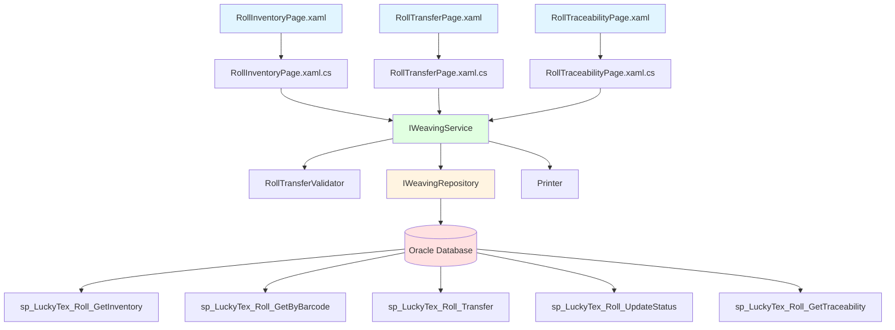
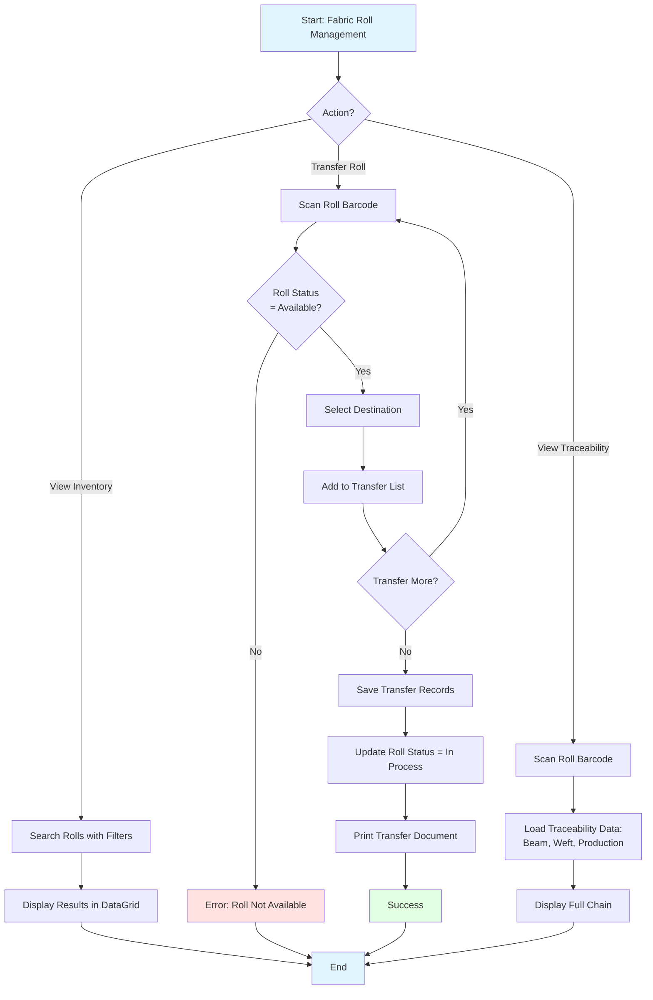
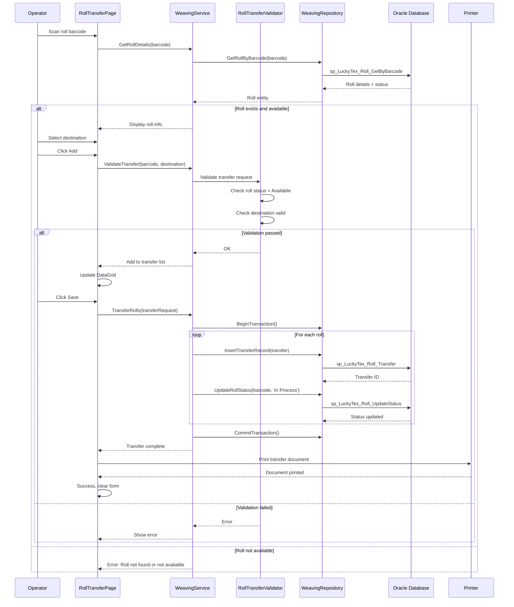

# Process: Fabric Roll Management

**Process ID**: WV-003
**Module**: 05 - Weaving
**Priority**: P2 (Core Production Module)
**Created**: 2025-10-06

---

## 1. Process Overview

### Purpose
Manage fabric roll inventory from creation during weaving to transfer to downstream processes (Finishing/Inspection). Track roll location, status, quality attributes, and provide traceability to source materials.

### Scope
- View and search fabric roll inventory
- Update roll status and location
- Transfer rolls to Finishing/Inspection departments
- Track roll consumption history
- Maintain traceability to beam and weft sources
- Handle roll adjustments (rework, scrap)

### Module(s) Involved
- **Primary**: M05 - Weaving
- **Upstream**: Weaving Production (roll creation)
- **Downstream**: M06 - Finishing, M08 - Inspection (roll consumption)

---

## 2. UI Files Inventory

### XAML Files
| File Path | Description | Purpose |
|-----------|-------------|---------|
| `LuckyTex.AirBag.Pages/Pages/05 - Weaving/RollInventoryPage.xaml` | Roll inventory dashboard | View and search rolls |
| `LuckyTex.AirBag.Pages/Pages/05 - Weaving/RollTransferPage.xaml` | Roll transfer interface | Transfer to downstream |
| `LuckyTex.AirBag.Pages/Pages/05 - Weaving/RollTraceabilityPage.xaml` | Traceability viewer | View roll source materials |
| `LuckyTex.AirBag.Pages/Pages/05 - Weaving/WeavingMenuPage.xaml` | Module dashboard | Navigation |

### Code-Behind Files
| File Path | Description |
|-----------|-------------|
| `LuckyTex.AirBag.Pages/Pages/05 - Weaving/RollInventoryPage.xaml.cs` | Inventory logic |
| `LuckyTex.AirBag.Pages/Pages/05 - Weaving/RollTransferPage.xaml.cs` | Transfer logic |
| `LuckyTex.AirBag.Pages/Pages/05 - Weaving/RollTraceabilityPage.xaml.cs` | Traceability display |

### Service Files
| File Path | Description |
|-----------|-------------|
| *(To be created)* `LuckyTex.AirBag.Core/Repositories/WeavingRepository.cs` | Repository |
| *(To be created)* `LuckyTex.AirBag.Core/Services/WeavingService.cs` | Service layer |
| *(To be created)* `LuckyTex.AirBag.Core/Validators/RollTransferValidator.cs` | FluentValidation |

---

## 3. UI Layout Description

### RollInventoryPage.xaml

**Screen Title**: "Fabric Roll Inventory"

**Key UI Controls**:
- **Search Section**:
  - Roll barcode search textbox
  - Date range filter (From/To)
  - Product filter dropdown
  - Status filter (All, Available, In Process, Consumed, Scrapped)
  - `cmdSearch` - Execute search

- **Inventory DataGrid**:
  - Columns: Barcode, Product, Length (m), Loom, Production Date, Status, Location, Age (days)
  - Row double-click: Open detail view

- **Summary Cards**:
  - Total rolls available
  - Total meters available
  - Rolls pending inspection
  - Rolls in finishing

- **Action Buttons**:
  - `cmdTransfer` - Transfer selected roll
  - `cmdViewTrace` - View traceability
  - `cmdPrint` - Print roll label
  - `cmdExport` - Export to Excel

### RollTransferPage.xaml

**Screen Title**: "Fabric Roll Transfer"

**Key UI Controls**:
- Roll barcode scan textbox
- Display roll details (read-only)
- Destination dropdown (Finishing, Inspection, Warehouse)
- Target location textbox
- Transfer remarks
- Transfer list DataGrid
- `cmdAdd` - Add to transfer list
- `cmdRemove` - Remove from list
- `cmdSave` - Confirm transfer
- `cmdPrint` - Print transfer document

### RollTraceabilityPage.xaml

**Screen Title**: "Fabric Roll Traceability"

**Key UI Controls**:
- Roll barcode input
- **Source Materials Section**:
  - Beam barcode
  - Beam source yarn lots (DataGrid)
  - Weft yarn lot
  - Weft supplier info
- **Production Info Section**:
  - Loom ID, Operator, Date
  - Production session details
- **Downstream Usage Section**:
  - Finishing records
  - Inspection results
  - Cut pieces (if consumed)

---

## 4. Component Architecture Diagram



---

## 5. Workflow Diagram



---

## 6. Business Logic Sequence Diagram



---

## 7. Data Flow

### Input Data

| Data Element | Source | Format | Validation |
|--------------|--------|--------|------------|
| Roll Barcode | Scan/search | String (30 chars) | Must exist |
| Search Filters | Operator input | Date range, product, status | Valid values |
| Destination | Dropdown | String | Valid department |
| Transfer Location | Operator input | String (50 chars) | Optional |
| Transfer Remarks | Operator input | String (500 chars) | Optional |

### Output Data

| Data Element | Destination | Format | Purpose |
|--------------|-------------|--------|---------|
| Roll Inventory List | UI Display | List of rolls | Search results |
| Transfer Records | tblRollTransfer | Database records | Audit trail |
| Roll Status Updates | tblFabricRoll | Status changes | Inventory tracking |
| Traceability Data | UI Display | Beam + Weft links | Quality investigation |
| Transfer Document | Printer | Printed document | Material movement record |

---

## 8. Database Operations

### Stored Procedures Used

#### sp_LuckyTex_Roll_GetInventory
- **Purpose**: Search fabric roll inventory
- **Parameters**: @ProductCode, @Status, @DateFrom, @DateTo
- **Returns**: List of rolls
- **Tables Read**: tblFabricRoll, tblProduct, tblLoom

#### sp_LuckyTex_Roll_GetByBarcode
- **Purpose**: Get roll details by barcode
- **Parameters**: @Barcode VARCHAR(30)
- **Returns**: Roll details + status
- **Tables Read**: tblFabricRoll

#### sp_LuckyTex_Roll_Transfer
- **Purpose**: Record roll transfer
- **Parameters**: @RollBarcode, @Destination, @Location, @OperatorID, @Remarks
- **Returns**: Transfer ID
- **Tables Written**: tblRollTransfer

#### sp_LuckyTex_Roll_UpdateStatus
- **Purpose**: Update roll status
- **Parameters**: @RollBarcode, @Status
- **Returns**: Success flag
- **Tables Written**: tblFabricRoll

#### sp_LuckyTex_Roll_GetTraceability
- **Purpose**: Get full traceability chain
- **Parameters**: @RollBarcode VARCHAR(30)
- **Returns**: Beam, weft, yarn lots, production details
- **Tables Read**: tblRollTraceability, tblBeam, tblBeamTraceability, tblInventory, tblWeavingProduction

### Transaction Scope

#### Roll Transfer Transaction
```sql
BEGIN TRANSACTION
  FOR EACH roll:
    1. INSERT INTO tblRollTransfer (sp_LuckyTex_Roll_Transfer)
    2. UPDATE tblFabricRoll - set status (sp_LuckyTex_Roll_UpdateStatus)
COMMIT TRANSACTION
```

---

## 9. Implementation Checklist

### Phase 1: Repository Layer
- [ ] Extend `IWeavingRepository`
  - [ ] GetRollInventory(filters) method
  - [ ] GetRollByBarcode(barcode) method
  - [ ] TransferRoll(transfer) method
  - [ ] UpdateRollStatus(barcode, status) method
  - [ ] GetRollTraceability(barcode) method
- [ ] Implement in `WeavingRepository`
- [ ] Unit tests

### Phase 2: Service Layer
- [ ] Extend `IWeavingService`
  - [ ] GetRollInventory(filters) method
  - [ ] GetRollDetails(barcode) method
  - [ ] TransferRolls(request) method
  - [ ] GetRollTraceability(barcode) method
- [ ] Create `RollTransferValidator`
  - [ ] Validate roll status
  - [ ] Validate destination
- [ ] Implement in `WeavingService`
- [ ] Unit tests

### Phase 3: UI Refactoring
- [ ] Update `RollInventoryPage.xaml.cs`
  - [ ] Inject IWeavingService
  - [ ] Search handler
  - [ ] Export to Excel
- [ ] Update `RollTransferPage.xaml.cs`
  - [ ] Transfer workflow
  - [ ] Print document
- [ ] Update `RollTraceabilityPage.xaml.cs`
  - [ ] Display traceability tree

### Phase 4: Integration Testing
- [ ] Test inventory search
- [ ] Test roll transfer
- [ ] Test traceability display
- [ ] Test document printing

### Phase 5: Deployment
- [ ] Code review
- [ ] Unit tests passing
- [ ] UAT
- [ ] Production deployment

---

**Document Version**: 1.0
**Last Updated**: 2025-10-06
**Status**: Ready for Implementation
**Estimated Effort**: 2 days
