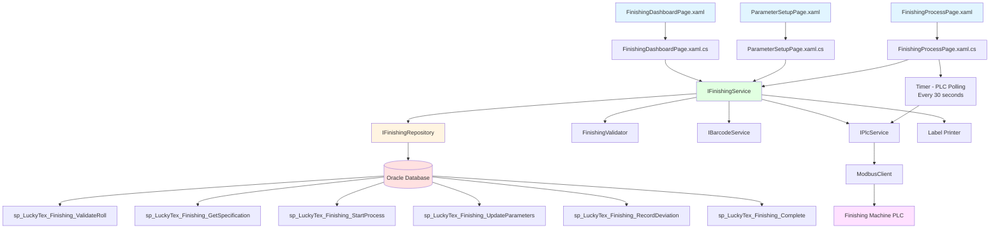

# Process: Coating and Heat-Setting

**Process ID**: FN-001
**Module**: 06 - Finishing
**Priority**: P3 (Production Module)
**Created**: 2025-10-06

---

## 1. Process Overview

### Purpose
Apply coating and/or heat-setting treatment to grey fabric rolls from weaving to create finished airbag fabric with required properties (strength, temperature resistance, coating thickness). Monitor process parameters via PLC to ensure quality specifications are met.

### Scope
- Validate grey fabric roll for finishing (inspection status required)
- Select finishing process type (Coating, Heat-Setting, or Both)
- Configure process parameters (temperature, speed, coating thickness)
- Start finishing process with PLC integration
- Monitor real-time process parameters (±2°C tolerance)
- Record parameter deviations
- Generate finished fabric roll with new barcode
- Print finished roll label
- Update inventory

### Module(s) Involved
- **Primary**: M06 - Finishing
- **Upstream**: M05 - Weaving (grey fabric rolls), M08 - Inspection (approval required)
- **Downstream**: M08 - Inspection (finished roll inspection)

---

## 2. UI Files Inventory

### XAML Files
| File Path | Description | Purpose |
|-----------|-------------|---------|
| `LuckyTex.AirBag.Pages/Pages/06 - Finishing/FinishingProcessPage.xaml` | Finishing operation interface | Process control and monitoring |
| `LuckyTex.AirBag.Pages/Pages/06 - Finishing/ParameterSetupPage.xaml` | Process parameter configuration | Set coating/heat-setting parameters |
| `LuckyTex.AirBag.Pages/Pages/06 - Finishing/FinishingDashboardPage.xaml` | Process monitoring dashboard | Real-time monitoring |
| `LuckyTex.AirBag.Pages/Pages/06 - Finishing/FinishingMenuPage.xaml` | Module menu | Navigation |

### Code-Behind Files
| File Path | Description |
|-----------|-------------|
| `LuckyTex.AirBag.Pages/Pages/06 - Finishing/FinishingProcessPage.xaml.cs` | Process control and PLC polling |
| `LuckyTex.AirBag.Pages/Pages/06 - Finishing/ParameterSetupPage.xaml.cs` | Parameter validation |
| `LuckyTex.AirBag.Pages/Pages/06 - Finishing/FinishingDashboardPage.xaml.cs` | Dashboard refresh |

### Service Files
| File Path | Description |
|-----------|-------------|
| *(To be created)* `LuckyTex.AirBag.Core/Repositories/FinishingRepository.cs` | Repository |
| *(To be created)* `LuckyTex.AirBag.Core/Services/FinishingService.cs` | Service layer |
| *(To be created)* `LuckyTex.AirBag.Core/Services/PlcService.cs` | PLC communication (shared) |
| *(To be created)* `LuckyTex.AirBag.Core/Validators/FinishingValidator.cs` | FluentValidation |

---

## 3. UI Layout Description

### FinishingProcessPage.xaml

**Screen Title**: "Coating and Heat-Setting Process"

**Roll Selection Section**:
- Grey fabric roll barcode textbox
- Display roll details (read-only):
  - Product, Length, Loom, Production Date
  - Inspection status (must be Approved)
  - Inspection grade (A/B/C)

**Process Type Section**:
- Radio buttons:
  - Coating only
  - Heat-setting only
  - Coating + Heat-setting (both)

**Machine Selection**:
- Finishing machine dropdown

**Parameter Configuration Section** (auto-loads from product spec):
- **Coating Parameters** (if coating selected):
  - Coating thickness (mm) - numeric input
  - Coating type dropdown
  - Application method (Spray, Roll, Dip)
- **Heat-Setting Parameters** (if heat-setting selected):
  - Temperature (°C) - numeric input
  - Speed (m/min) - numeric input
  - Dwell time (seconds) - numeric input
- Target specification ranges (read-only display)

**Process Control**:
- `cmdStart` - Start process
- `cmdStop` - Stop process
- `cmdPause` - Pause process
- Status indicator (Stopped, Running, Paused, Complete)

**Real-Time Monitoring Section** (updates every 30 seconds from PLC):
- Actual temperature (°C) - gauge display
  - Target temp ± tolerance (±2°C)
  - Color coding: Green (within), Yellow (warning), Red (out of spec)
- Actual speed (m/min)
- Actual coating thickness (mm) - if applicable
- Process time elapsed (HH:MM:SS)
- Meters processed (running total)

**Deviation Tracking**:
- Deviation count (real-time)
- Last deviation timestamp
- `cmdViewDeviations` - View deviation log

**Action Buttons**:
- `cmdComplete` - Complete process
- `cmdBack` - Return to dashboard

### ParameterSetupPage.xaml

**Screen Title**: "Process Parameter Configuration"

**Product Selection**:
- Product code dropdown
- Display product spec (read-only):
  - Required coating thickness range
  - Required temperature range
  - Required speed range

**Custom Parameters**:
- Temperature input with range validation
- Speed input with range validation
- Coating thickness input (if coating)
- Save as preset checkbox
- `cmdSave` - Save configuration
- `cmdCancel` - Cancel

---

## 4. Component Architecture Diagram



---

## 5. Workflow Diagram

```mermaid
graph TD
    START[Start: Finishing Process] --> SCAN[Scan Grey Fabric Roll]
    SCAN --> VALIDATE{Roll Approved<br/>for Finishing?}

    VALIDATE -->|No| ERROR1[Error: Roll Not Inspected/Rejected]
    ERROR1 --> END[End]

    VALIDATE -->|Yes| DISPLAY[Display Roll Details]
    DISPLAY --> SELECT_TYPE[Select Process Type:<br/>Coating / Heat-Setting / Both]

    SELECT_TYPE --> SELECT_MACHINE[Select Finishing Machine]
    SELECT_MACHINE --> LOAD_SPEC[Load Product Specification]
    LOAD_SPEC --> SET_PARAMS[Set Process Parameters]

    SET_PARAMS --> VALIDATE_PARAMS{Parameters<br/>Within Spec?}
    VALIDATE_PARAMS -->|No| ERROR2[Error: Out of Specification]
    ERROR2 --> SET_PARAMS

    VALIDATE_PARAMS -->|Yes| START_PROCESS[Click Start Process]
    START_PROCESS --> CREATE_SESSION[Create Finishing Session Record]
    CREATE_SESSION --> SEND_PLC[Send Parameters to PLC]

    SEND_PLC --> START_MACHINE[Start Finishing Machine]
    START_MACHINE --> POLL_START[Start PLC Polling Timer - 30 sec]

    POLL_START --> MONITOR[Monitor Real-Time Parameters:<br/>- Temperature<br/>- Speed<br/>- Coating Thickness]

    MONITOR --> CHECK_TOLERANCE{Within Tolerance<br/>(±2°C)?}
    CHECK_TOLERANCE -->|Yes| LOG_PARAMS[Log Parameters - Green Status]
    LOG_PARAMS --> CONTINUE{Process<br/>Complete?}

    CHECK_TOLERANCE -->|No| DEVIATION[Record Deviation]
    DEVIATION --> ALERT[Alert Operator - Yellow/Red]
    ALERT --> CONTINUE

    CONTINUE -->|No| MONITOR
    CONTINUE -->|Yes| OPERATOR_COMPLETE[Operator Clicks Complete]

    OPERATOR_COMPLETE --> STOP_MACHINE[Stop Finishing Machine]
    STOP_MACHINE --> GEN_BARCODE[Generate Finished Roll Barcode]
    GEN_BARCODE --> CREATE_FINISHED[Create Finished Roll Record]

    CREATE_FINISHED --> LINK_TRACE[Link Traceability:<br/>Finished Roll → Grey Roll → Beam/Weft]

    LINK_TRACE --> UPDATE_INV[Update Inventory:<br/>- Consume Grey Roll<br/>- Add Finished Roll]

    UPDATE_INV --> PRINT_LABEL[Print Finished Roll Label]
    PRINT_LABEL --> STOP_POLLING[Stop PLC Polling]
    STOP_POLLING --> SUCCESS[Success: Process Complete]
    SUCCESS --> END

    style START fill:#e1f5ff
    style SUCCESS fill:#e1ffe1
    style END fill:#e1f5ff
    style ERROR1 fill:#ffe1e1
    style ERROR2 fill:#ffe1e1
    style ALERT fill:#fff4e1
```

---

## 6. Business Logic Sequence Diagram

```mermaid
sequenceDiagram
    participant Operator
    participant UI as FinishingProcessPage
    participant Timer as Polling Timer
    participant BL as FinishingService
    participant VAL as FinishingValidator
    participant REPO as FinishingRepository
    participant DB as Oracle Database
    participant PLC as Finishing PLC
    participant Printer

    Operator->>UI: Scan grey fabric roll barcode
    UI->>BL: ValidateRollForFinishing(barcode)
    BL->>REPO: GetRollForFinishing(barcode)
    REPO->>DB: sp_LuckyTex_Finishing_ValidateRoll
    Note over DB: SELECT roll details<br/>JOIN with inspection<br/>WHERE status = 'Approved'

    alt Roll approved
        DB-->>REPO: Roll details + inspection grade
        REPO-->>BL: Roll entity
        BL-->>UI: Display roll info

        Operator->>UI: Select process type (Coating + Heat-Setting)
        Operator->>UI: Select machine
        Operator->>UI: Enter parameters:<br/>Temp = 180°C, Speed = 30 m/min, Thickness = 0.5mm

        UI->>BL: GetProcessSpecification(productCode)
        BL->>REPO: GetProductSpec(productCode)
        REPO->>DB: sp_LuckyTex_Finishing_GetSpecification
        DB-->>REPO: Spec ranges (temp: 175-185°C, speed: 25-35 m/min)
        REPO-->>BL: Specification
        BL-->>UI: Display spec ranges

        UI->>BL: ValidateParameters(params)
        BL->>VAL: Validate(params)
        VAL->>VAL: Check 175 <= temp <= 185
        VAL->>VAL: Check 25 <= speed <= 35
        VAL->>VAL: Check coating thickness > 0

        alt Validation passed
            VAL-->>BL: OK
            BL-->>UI: Parameters valid

            Operator->>UI: Click Start Process
            UI->>BL: StartFinishingProcess(request)
            BL->>REPO: BeginTransaction()

            BL->>REPO: CreateFinishingSession(session)
            REPO->>DB: sp_LuckyTex_Finishing_StartProcess
            Note over DB: INSERT INTO tblFinishingProcess<br/>(greyRollBarcode, machineId,<br/>processType, temperature, speed,<br/>coatingThickness, status='Running')
            DB-->>REPO: Session ID

            BL->>REPO: CommitTransaction()

            BL->>PLC: SendProcessParameters(machineId, params)
            Note over PLC: Write to PLC registers:<br/>- Reg 3000: Temperature setpoint<br/>- Reg 3001: Speed setpoint<br/>- Reg 3002: Coating thickness
            PLC-->>BL: Parameters set

            BL->>PLC: SendStartCommand(machineId)
            PLC-->>BL: Process started
            BL-->>UI: Process started

            UI->>Timer: Start polling timer (30-second interval)

            loop Every 30 seconds (process monitoring)
                Timer->>PLC: ReadProcessData(machineId)
                Note over PLC: Read Modbus registers:<br/>- Reg 3010: Actual temperature<br/>- Reg 3011: Actual speed<br/>- Reg 3012: Actual coating thickness<br/>- Reg 3020: Meters processed
                PLC-->>Timer: Data array

                Timer->>BL: ProcessPlcData(sessionId, data)
                BL->>BL: Check temperature tolerance: 178-182°C (±2°C)
                BL->>BL: Check actual temp = 181°C

                alt Within tolerance
                    BL->>REPO: LogParameters(sessionId, data, status='OK')
                    REPO->>DB: sp_LuckyTex_Finishing_UpdateParameters
                    Note over DB: INSERT INTO tblFinishingParameterLog<br/>(sessionId, temp, speed, thickness,<br/>status='OK', timestamp)
                    DB-->>REPO: Logged

                    BL-->>UI: Update display - Green status

                else Out of tolerance (e.g., 185.5°C)
                    BL->>REPO: RecordDeviation(sessionId, deviation)
                    REPO->>DB: sp_LuckyTex_Finishing_RecordDeviation
                    Note over DB: INSERT INTO tblFinishingDeviation<br/>(sessionId, parameterName='Temperature',<br/>target=180, actual=185.5,<br/>deviation=+5.5, timestamp)
                    DB-->>REPO: Deviation recorded

                    BL-->>UI: Alert: Temperature deviation (red)
                    UI->>UI: Display alert message
                end
            end

            Operator->>UI: Click Complete Process
            UI->>BL: CompleteFinishingProcess(sessionId, machineId)
            BL->>PLC: SendStopCommand(machineId)
            PLC-->>BL: Machine stopped

            BL->>PLC: ReadFinalMeters(machineId)
            PLC-->>BL: Total meters = 75.0 m

            BL->>BL: Generate finished roll barcode: FFR-YYYYMMDD-####
            BL->>REPO: BeginTransaction()

            BL->>REPO: CreateFinishedRoll(finishedRoll)
            REPO->>DB: sp_LuckyTex_Finishing_Complete
            Note over DB: INSERT INTO tblFinishedRoll<br/>(barcode, greyRollBarcode,<br/>processType, length, date, status='Completed')<br/><br/>UPDATE tblFinishingProcess<br/>SET status='Completed', endTime, totalMeters
            DB-->>REPO: Finished roll ID

            BL->>REPO: LinkFinishedRollTrace(finishedRollId, greyRollBarcode)
            REPO->>DB: sp_LuckyTex_Traceability_LinkFinished
            DB-->>REPO: Link created

            BL->>REPO: UpdateGreyRollStatus(greyRollBarcode, 'Consumed')
            REPO->>DB: sp_LuckyTex_Roll_UpdateStatus
            DB-->>REPO: Status updated

            BL->>REPO: CommitTransaction()

            BL->>Printer: PrintFinishedRollLabel with:<br/>- Finished roll barcode<br/>- Product, Length<br/>- Process parameters<br/>- Date, Operator
            Printer-->>BL: Label printed

            BL-->>UI: Process complete
            UI->>Timer: Stop polling timer
            UI->>UI: Display success, clear form

        else Validation failed
            VAL-->>BL: Error: Parameters out of spec
            BL-->>UI: Show validation errors
        end

    else Roll not approved
        DB-->>REPO: Error: Roll not inspected or rejected
        REPO-->>BL: Error
        BL-->>UI: Error: Roll not ready for finishing
    end
```



---

## 7. Data Flow

### Input Data

| Data Element | Source | Format | Validation |
|--------------|--------|--------|------------|
| Grey Roll Barcode | Scan | String (30 chars) | Must exist with inspection status = Approved |
| Process Type | Selection | Enum (Coating, HeatSetting, Both) | Required |
| Machine ID | Dropdown | String (20 chars) | Must exist, status = Available |
| Temperature | Input/spec | Decimal (5,2) °C | Within product spec range |
| Speed | Input/spec | Decimal (5,2) m/min | Within product spec range |
| Coating Thickness | Input/spec | Decimal (5,3) mm | > 0 if coating selected |
| Operator ID | Login session | String (10 chars) | Valid employee |

### Output Data

| Data Element | Destination | Format | Purpose |
|--------------|-------------|--------|---------|
| Finishing Session Record | tblFinishingProcess | Database record | Process tracking |
| Parameter Log Records | tblFinishingParameterLog | Time-series data | Quality control |
| Deviation Records | tblFinishingDeviation | Deviation logs | Quality analysis |
| Finished Roll Record | tblFinishedRoll | Database record | Inventory |
| Finished Roll Barcode | Label + DB | FFR-YYYYMMDD-#### | Identification |
| Traceability Link | tblTraceability | Grey → Finished mapping | Traceability |
| Grey Roll Status Update | tblFabricRoll | Status = Consumed | Inventory update |
| Finished Roll Label | Printer | Printed label | Physical ID |

### Data Transformations

1. **Product Code → Process Specification**: Lookup temperature, speed, coating ranges
2. **Actual Parameter - Target → Deviation**: Calculate variance for tolerance checking
3. **Grey Roll Barcode → Traceability Chain**: Link finished roll to beam/weft through grey roll
4. **Process Parameters → PLC Registers**: Map parameters to Modbus register addresses
5. **Meters Processed → Finished Roll Length**: Capture final length from PLC

---

## 8. Database Operations

### Stored Procedures Used

#### sp_LuckyTex_Finishing_ValidateRoll
- **Purpose**: Validate grey roll for finishing
- **Parameters**: @GreyRollBarcode VARCHAR(30)
- **Returns**: Roll details + inspection status/grade
- **Tables Read**: tblFabricRoll, tblInspection

#### sp_LuckyTex_Finishing_GetSpecification
- **Purpose**: Get process spec for product
- **Parameters**: @ProductCode VARCHAR(20)
- **Returns**: Temperature, speed, coating thickness ranges
- **Tables Read**: tblProduct, tblFinishingSpec

#### sp_LuckyTex_Finishing_StartProcess
- **Purpose**: Create finishing session
- **Parameters**: @GreyRollBarcode, @MachineID, @ProcessType, @Temperature, @Speed, @CoatingThickness, @OperatorID
- **Returns**: Session ID
- **Tables Written**: tblFinishingProcess

#### sp_LuckyTex_Finishing_UpdateParameters
- **Purpose**: Log actual parameters
- **Parameters**: @SessionID, @Temperature, @Speed, @Thickness, @MetersProcessed, @Status, @Timestamp
- **Returns**: Log ID
- **Tables Written**: tblFinishingParameterLog

#### sp_LuckyTex_Finishing_RecordDeviation
- **Purpose**: Record parameter deviation
- **Parameters**: @SessionID, @ParameterName, @TargetValue, @ActualValue, @Deviation, @Timestamp
- **Returns**: Deviation ID
- **Tables Written**: tblFinishingDeviation

#### sp_LuckyTex_Finishing_Complete
- **Purpose**: Complete process and create finished roll
- **Parameters**: @SessionID, @FinishedRollBarcode, @TotalMeters, @EndTime
- **Returns**: Finished roll ID
- **Tables Written**: tblFinishedRoll, tblFinishingProcess (UPDATE)

### Transaction Scope

#### Start Process Transaction
```sql
BEGIN TRANSACTION
  1. INSERT INTO tblFinishingProcess (sp_LuckyTex_Finishing_StartProcess)
  2. UPDATE tblMachine - set status = 'Running'
COMMIT TRANSACTION
```

#### Complete Process Transaction
```sql
BEGIN TRANSACTION
  1. INSERT INTO tblFinishedRoll (sp_LuckyTex_Finishing_Complete)
  2. UPDATE tblFinishingProcess - set status='Completed', endTime, totalMeters
  3. INSERT INTO tblTraceability - link finished to grey roll
  4. UPDATE tblFabricRoll - set grey roll status = 'Consumed'
  5. UPDATE tblMachine - set status = 'Available'
COMMIT TRANSACTION
```

---

## 9. Implementation Checklist

### Phase 1: Repository Layer
- [ ] Create `IFinishingRepository` interface
  - [ ] ValidateRollForFinishing(barcode) method
  - [ ] GetProductSpec(productCode) method
  - [ ] StartProcess(session) method
  - [ ] LogParameters(sessionId, data) method
  - [ ] RecordDeviation(sessionId, deviation) method
  - [ ] CompleteProcess(sessionId, finishedRoll) method
- [ ] Implement in `FinishingRepository`
- [ ] Unit tests

### Phase 2: PLC Communication Layer
- [ ] Extend `IPlcService` for finishing machines
  - [ ] SendProcessParameters(machineId, params) method
  - [ ] ReadProcessData(machineId) method → temp, speed, thickness, meters
  - [ ] StartFinishingMachine(machineId) method
  - [ ] StopFinishingMachine(machineId) method
- [ ] PLC register mapping:
  - 3000-3002: Setpoints (write)
  - 3010-3012: Actuals (read)
  - 3020: Meters processed (read)
- [ ] Unit tests with PLC simulator

### Phase 3: Service Layer
- [ ] Create `IFinishingService` interface
  - [ ] ValidateRollForFinishing(barcode) method
  - [ ] GetProcessSpecification(productCode) method
  - [ ] StartFinishingProcess(request) method
  - [ ] MonitorProcess(sessionId, plcData) method
  - [ ] CompleteFinishingProcess(sessionId) method
- [ ] Create `FinishingValidator`
  - [ ] Validate roll inspection status
  - [ ] Validate parameters within spec ranges
  - [ ] Validate tolerance (±2°C)
- [ ] Implement in `FinishingService`
- [ ] Unit tests

### Phase 4: UI Refactoring
- [ ] Update `FinishingProcessPage.xaml.cs`
  - [ ] Inject IFinishingService, IPlcService
  - [ ] Roll scan handler
  - [ ] Parameter validation
  - [ ] Start process handler
  - [ ] Polling timer (30-second interval)
  - [ ] Complete process handler
- [ ] Update `ParameterSetupPage.xaml.cs`
  - [ ] Parameter range validation
  - [ ] Preset management

### Phase 5: Integration Testing
- [ ] Test with real database
  - [ ] Complete finishing workflow
  - [ ] Verify parameter logging
  - [ ] Verify deviation recording
  - [ ] Test finished roll creation
- [ ] Test with PLC
  - [ ] Real-time monitoring
  - [ ] Tolerance checking
  - [ ] Control commands
- [ ] Performance testing

### Phase 6: Deployment
- [ ] Code review
- [ ] Unit tests passing
- [ ] UAT
- [ ] Production deployment

---

**Document Version**: 1.0
**Last Updated**: 2025-10-06
**Status**: Ready for Implementation
**Estimated Effort**: 4 days
