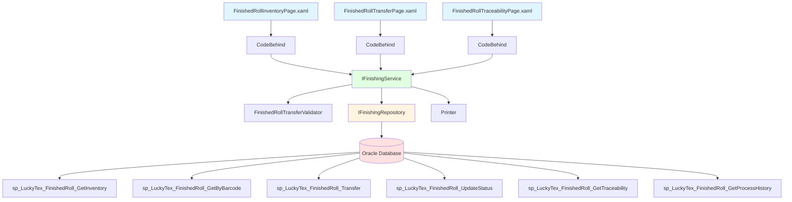
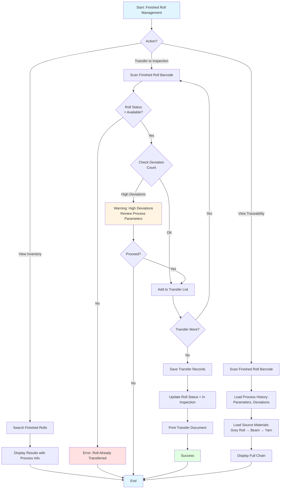
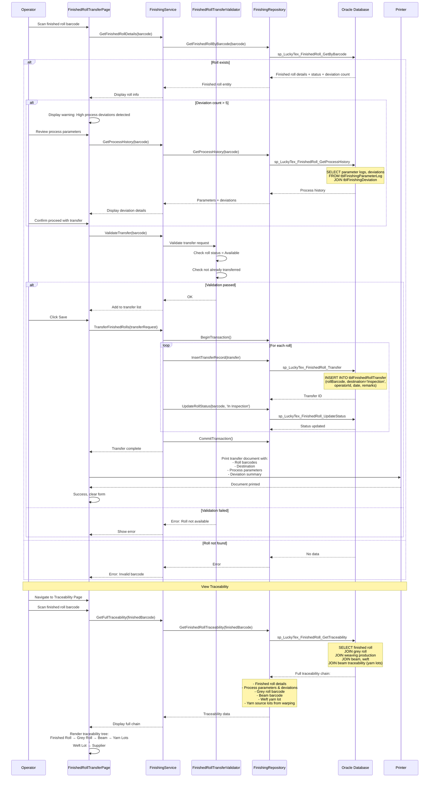

# Process: Finished Roll Management

**Process ID**: FN-002
**Module**: 06 - Finishing
**Priority**: P3 (Production Module)
**Created**: 2025-10-06

---

## 1. Process Overview

### Purpose
Manage finished fabric roll inventory from creation during finishing processes to transfer to Inspection department. Track finished roll location, status, process parameters, and maintain traceability to source grey rolls and original materials.

### Scope
- View and search finished roll inventory
- Transfer rolls to Inspection department
- Track roll quality parameters (process deviations, coating quality)
- Maintain traceability to grey rolls and source materials
- Handle roll rework/scrap (if quality issues detected)
- Generate finished roll reports

### Module(s) Involved
- **Primary**: M06 - Finishing
- **Upstream**: Finishing Process (roll creation)
- **Downstream**: M08 - Inspection (finished roll inspection)

---

## 2. UI Files Inventory

### XAML Files
| File Path | Description | Purpose |
|-----------|-------------|---------|
| `LuckyTex.AirBag.Pages/Pages/06 - Finishing/FinishedRollInventoryPage.xaml` | Inventory dashboard | View finished rolls |
| `LuckyTex.AirBag.Pages/Pages/06 - Finishing/FinishedRollTransferPage.xaml` | Transfer interface | Transfer to Inspection |
| `LuckyTex.AirBag.Pages/Pages/06 - Finishing/FinishedRollTraceabilityPage.xaml` | Traceability viewer | View process history |
| `LuckyTex.AirBag.Pages/Pages/06 - Finishing/FinishingMenuPage.xaml` | Module menu | Navigation |

### Code-Behind Files
| File Path | Description |
|-----------|-------------|
| `LuckyTex.AirBag.Pages/Pages/06 - Finishing/FinishedRollInventoryPage.xaml.cs` | Inventory logic |
| `LuckyTex.AirBag.Pages/Pages/06 - Finishing/FinishedRollTransferPage.xaml.cs` | Transfer logic |
| `LuckyTex.AirBag.Pages/Pages/06 - Finishing/FinishedRollTraceabilityPage.xaml.cs` | Traceability display |

### Service Files
| File Path | Description |
|-----------|-------------|
| *(To be created)* `LuckyTex.AirBag.Core/Repositories/FinishingRepository.cs` | Repository |
| *(To be created)* `LuckyTex.AirBag.Core/Services/FinishingService.cs` | Service layer |
| *(To be created)* `LuckyTex.AirBag.Core/Validators/FinishedRollTransferValidator.cs` | FluentValidation |

---

## 3. UI Layout Description

### FinishedRollInventoryPage.xaml

**Screen Title**: "Finished Fabric Roll Inventory"

**Search Section**:
- Finished roll barcode textbox
- Date range filter (From/To)
- Process type filter (All, Coating, Heat-Setting, Both)
- Status filter (All, Available, In Inspection, Approved, Rejected, Scrapped)
- `cmdSearch` - Execute search

**Inventory DataGrid**:
- Columns: Barcode, Product, Length (m), Process Type, Process Date, Status, Deviation Count, Location, Age (days)
- Row click: Show details

**Summary Cards**:
- Total finished rolls available
- Pending inspection
- Approved rolls
- Rolls with process deviations

**Action Buttons**:
- `cmdTransfer` - Transfer to Inspection
- `cmdViewProcess` - View process details
- `cmdViewTrace` - View traceability
- `cmdPrint` - Print roll label
- `cmdExport` - Export to Excel

### FinishedRollTransferPage.xaml

**Screen Title**: "Finished Roll Transfer to Inspection"

**Transfer Section**:
- Finished roll barcode scan textbox
- Display roll details (read-only):
  - Product, Length
  - Process parameters (temperature, speed, coating)
  - Deviation count
- Inspection department/location textbox
- Transfer remarks
- Transfer list DataGrid
- `cmdAdd` - Add to transfer list
- `cmdRemove` - Remove
- `cmdSave` - Confirm transfer
- `cmdPrint` - Print transfer document

### FinishedRollTraceabilityPage.xaml

**Screen Title**: "Finished Roll Traceability & Process History"

**Roll Information Section**:
- Finished roll barcode input
- Display finished roll details

**Process History Section** (read-only):
- Process type (Coating/Heat-Setting/Both)
- Machine ID, Operator, Date
- **Target Parameters**:
  - Temperature (°C)
  - Speed (m/min)
  - Coating thickness (mm)
- **Actual Average Parameters** (from parameter log)
- **Process Deviations** (DataGrid):
  - Columns: Timestamp, Parameter Name, Target, Actual, Deviation, Status

**Source Material Section**:
- Grey roll barcode (link to weaving)
- Click grey roll → Navigate to weaving traceability
  - Beam barcode
  - Weft yarn lot
  - Yarn suppliers

**Downstream Usage Section** (if consumed):
- Inspection result (grade, defects)
- Cut pieces (if further processed)

---

## 4. Component Architecture Diagram



---

## 5. Workflow Diagram



---

## 6. Business Logic Sequence Diagram



---

## 7. Data Flow

### Input Data

| Data Element | Source | Format | Validation |
|--------------|--------|--------|------------|
| Finished Roll Barcode | Scan | String (30 chars) | Must exist |
| Search Filters | Operator | Date range, process type, status | Valid values |
| Transfer Destination | Input | String | "Inspection" (default) |
| Transfer Remarks | Operator | String (500 chars) | Optional |

### Output Data

| Data Element | Destination | Format | Purpose |
|--------------|-------------|--------|---------|
| Inventory List | UI Display | List of finished rolls | Search results |
| Transfer Records | tblFinishedRollTransfer | Database records | Audit trail |
| Roll Status Updates | tblFinishedRoll | Status changes | Inventory tracking |
| Process History | UI Display | Parameters + deviations | Quality investigation |
| Full Traceability Chain | UI Display | Hierarchical tree | Root cause analysis |
| Transfer Document | Printer | Printed document | Material movement |

---

## 8. Database Operations

### Stored Procedures Used

#### sp_LuckyTex_FinishedRoll_GetInventory
- **Purpose**: Search finished roll inventory
- **Parameters**: @ProcessType, @Status, @DateFrom, @DateTo
- **Returns**: List of finished rolls with process info
- **Tables Read**: tblFinishedRoll, tblFinishingProcess, tblProduct

#### sp_LuckyTex_FinishedRoll_GetByBarcode
- **Purpose**: Get finished roll details
- **Parameters**: @Barcode VARCHAR(30)
- **Returns**: Roll details + status + deviation count
- **Tables Read**: tblFinishedRoll, tblFinishingProcess, tblFinishingDeviation

#### sp_LuckyTex_FinishedRoll_Transfer
- **Purpose**: Record finished roll transfer
- **Parameters**: @RollBarcode, @Destination, @OperatorID, @Remarks
- **Returns**: Transfer ID
- **Tables Written**: tblFinishedRollTransfer

#### sp_LuckyTex_FinishedRoll_UpdateStatus
- **Purpose**: Update finished roll status
- **Parameters**: @RollBarcode, @Status
- **Returns**: Success flag
- **Tables Written**: tblFinishedRoll

#### sp_LuckyTex_FinishedRoll_GetTraceability
- **Purpose**: Get full traceability chain
- **Parameters**: @FinishedRollBarcode VARCHAR(30)
- **Returns**: Finished → Grey → Beam → Yarn lots chain
- **Tables Read**: tblFinishedRoll, tblTraceability, tblFabricRoll, tblRollTraceability, tblBeam, tblBeamTraceability, tblInventory

#### sp_LuckyTex_FinishedRoll_GetProcessHistory
- **Purpose**: Get process parameters and deviations
- **Parameters**: @FinishedRollBarcode VARCHAR(30)
- **Returns**: Process parameters, parameter logs, deviations
- **Tables Read**: tblFinishingProcess, tblFinishingParameterLog, tblFinishingDeviation

### Transaction Scope

#### Finished Roll Transfer Transaction
```sql
BEGIN TRANSACTION
  FOR EACH roll:
    1. INSERT INTO tblFinishedRollTransfer (sp_LuckyTex_FinishedRoll_Transfer)
    2. UPDATE tblFinishedRoll - set status (sp_LuckyTex_FinishedRoll_UpdateStatus)
COMMIT TRANSACTION
```

---

## 9. Implementation Checklist

### Phase 1: Repository Layer
- [ ] Extend `IFinishingRepository`
  - [ ] GetFinishedRollInventory(filters) method
  - [ ] GetFinishedRollByBarcode(barcode) method
  - [ ] TransferFinishedRoll(transfer) method
  - [ ] UpdateFinishedRollStatus(barcode, status) method
  - [ ] GetFinishedRollTraceability(barcode) method
  - [ ] GetProcessHistory(barcode) method
- [ ] Implement in `FinishingRepository`
- [ ] Unit tests

### Phase 2: Service Layer
- [ ] Extend `IFinishingService`
  - [ ] GetFinishedRollInventory(filters) method
  - [ ] GetFinishedRollDetails(barcode) method
  - [ ] TransferFinishedRolls(request) method
  - [ ] GetFullTraceability(barcode) method
  - [ ] GetProcessHistory(barcode) method
- [ ] Create `FinishedRollTransferValidator`
  - [ ] Validate roll status = Available
  - [ ] Validate not already transferred
- [ ] Implement in `FinishingService`
- [ ] Unit tests

### Phase 3: UI Refactoring
- [ ] Update `FinishedRollInventoryPage.xaml.cs`
  - [ ] Inject IFinishingService
  - [ ] Search handler
  - [ ] Summary card calculations
  - [ ] Export to Excel
- [ ] Update `FinishedRollTransferPage.xaml.cs`
  - [ ] Transfer workflow
  - [ ] Deviation warning display
  - [ ] Print transfer document
- [ ] Update `FinishedRollTraceabilityPage.xaml.cs`
  - [ ] Traceability tree display
  - [ ] Process history display
  - [ ] Deviation details

### Phase 4: Integration Testing
- [ ] Test inventory search with filters
- [ ] Test transfer workflow
- [ ] Test traceability display (full chain)
- [ ] Test process history display
- [ ] Test transfer document printing

### Phase 5: Deployment
- [ ] Code review
- [ ] Unit tests passing
- [ ] UAT
- [ ] Production deployment

---

**Document Version**: 1.0
**Last Updated**: 2025-10-06
**Status**: Ready for Implementation
**Estimated Effort**: 2 days
