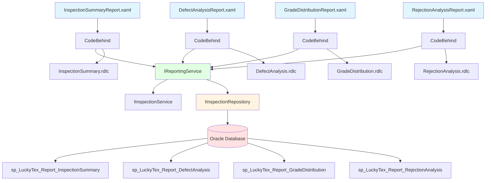
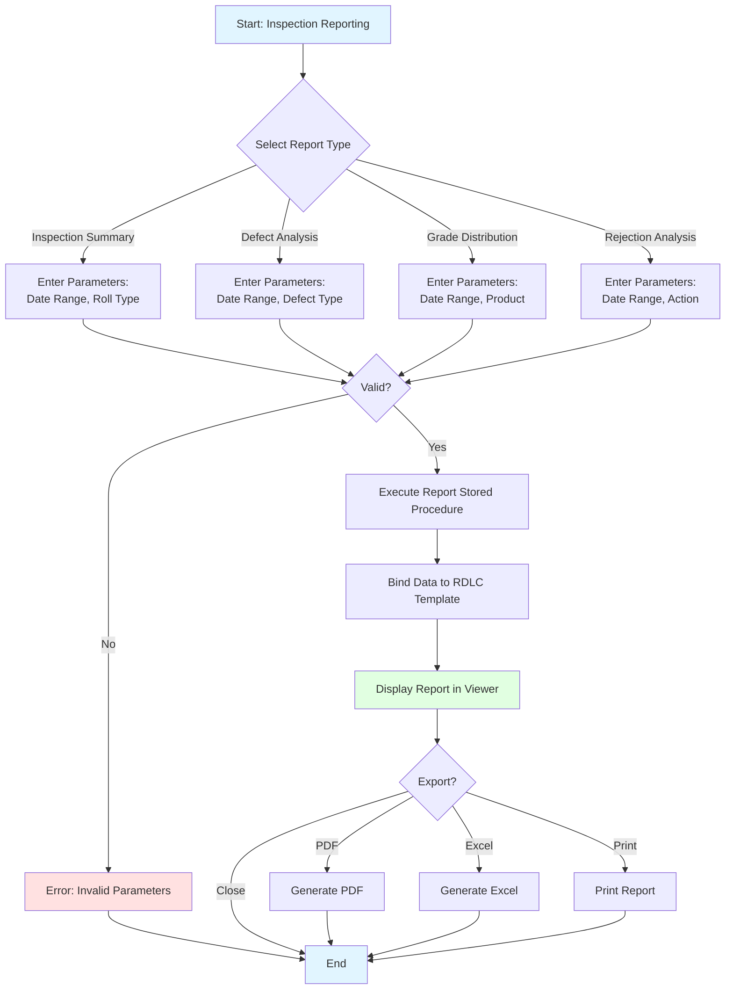
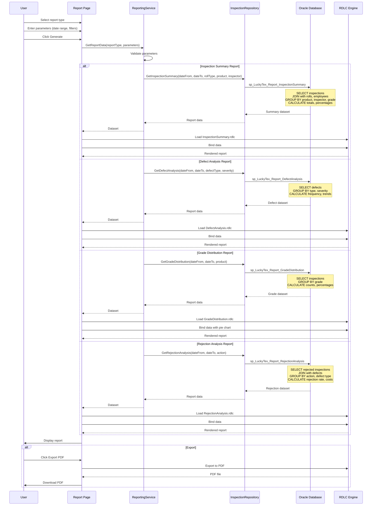

# Process: Inspection Reporting

**Process ID**: INS-002
**Module**: 08 - Inspection
**Priority**: P3 (Production Module)
**Created**: 2025-10-06

---

## 1. Process Overview

### Purpose
Generate inspection reports for quality analysis, defect trending, inspector performance, and compliance documentation. Provide management with visibility into quality metrics and continuous improvement opportunities.

### Scope
- Daily inspection summary report
- Defect analysis report (by type, frequency, trend)
- Quality grade distribution report
- Inspector performance report
- Rejection analysis report
- Inspection certificate generation

### Module(s) Involved
- **Primary**: M08 - Inspection
- **Data Sources**: tblInspection, tblInspectionDefect, tblFabricRoll, tblFinishedRoll, tblEmployee

---

## 2. UI Files Inventory

### XAML Files
| File Path | Description | Purpose |
|-----------|-------------|---------|
| `LuckyTex.AirBag.Pages/Pages/08 - Inspection/Reports/InspectionSummaryReport.xaml` | Daily summary report | RDLC viewer |
| `LuckyTex.AirBag.Pages/Pages/08 - Inspection/Reports/DefectAnalysisReport.xaml` | Defect analysis | RDLC viewer |
| `LuckyTex.AirBag.Pages/Pages/08 - Inspection/Reports/GradeDistributionReport.xaml` | Grade distribution | RDLC viewer |
| `LuckyTex.AirBag.Pages/Pages/08 - Inspection/Reports/RejectionAnalysisReport.xaml` | Rejection analysis | RDLC viewer |
| `LuckyTex.AirBag.Pages/Pages/08 - Inspection/InspectionMenuPage.xaml` | Module menu | Navigation |

### Report Template Files (RDLC)
| File Path | Description |
|-----------|-------------|
| `LuckyTex.AirBag.Pages/Reports/Inspection/InspectionSummary.rdlc` | Summary template |
| `LuckyTex.AirBag.Pages/Reports/Inspection/DefectAnalysis.rdlc` | Defect analysis template |
| `LuckyTex.AirBag.Pages/Reports/Inspection/GradeDistribution.rdlc` | Grade distribution template |
| `LuckyTex.AirBag.Pages/Reports/Inspection/RejectionAnalysis.rdlc` | Rejection analysis template |
| `LuckyTex.AirBag.Pages/Reports/Inspection/InspectionCertificate.rdlc` | Individual certificate template |

### Service Files
| File Path | Description |
|-----------|-------------|
| *(To be created)* `LuckyTex.AirBag.Core/Repositories/InspectionRepository.cs` | Repository |
| *(To be created)* `LuckyTex.AirBag.Core/Services/InspectionService.cs` | Service layer |
| *(To be created)* `LuckyTex.AirBag.Core/Services/ReportingService.cs` | Report data aggregation |

---

## 3. UI Layout Description

### InspectionSummaryReport.xaml

**Parameter Section**:
- Date range (From/To)
- Roll type filter (All, Grey, Finished)
- Product filter (optional)
- Inspector filter (optional)
- `cmdGenerate`

**Report Viewer**:
- Summary totals (rolls inspected, approved, rejected)
- Grade distribution (A/B/C/Reject counts and %)
- Average defect points per roll
- Inspection breakdown by product
- Inspection breakdown by inspector

### DefectAnalysisReport.xaml

**Parameter Section**:
- Date range
- Defect type filter (All or specific type)
- Severity filter (All, Minor, Major, Critical)
- `cmdGenerate`

**Report Viewer**:
- Total defects by type
- Defect frequency (defects per 100 meters)
- Defect trend chart (over time)
- Top 10 defect types
- Defects by product

### GradeDistributionReport.xaml

**Parameter Section**:
- Date range
- Product filter
- `cmdGenerate`

**Report Viewer**:
- Grade distribution pie chart (A/B/C/Reject)
- Grade percentages
- Grade trend over time
- Grade comparison by product

### RejectionAnalysisReport.xaml

**Parameter Section**:
- Date range
- Rejection action filter (All, Rework, Scrap)
- `cmdGenerate`

**Report Viewer**:
- Total rejections count
- Rejection rate %
- Rejection reasons (defect types)
- Rejection cost analysis (estimated scrap/rework cost)
- Rejection trend

---

## 4. Component Architecture Diagram

---

## 5. Workflow Diagram

---

## 6. Business Logic Sequence Diagram

---

## 7. Data Flow

### Input Data

| Data Element | Source | Format | Validation |
|--------------|--------|--------|------------|
| Date From | User input | DateTime | <= Date To |
| Date To | User input | DateTime | >= Date From |
| Roll Type Filter | Dropdown | Enum (All, Grey, Finished) | Valid value |
| Product Filter | Dropdown | String | Valid product or "All" |
| Inspector Filter | Dropdown | String | Valid employee or "All" |
| Defect Type Filter | Dropdown | String | Valid defect type or "All" |
| Severity Filter | Dropdown | Enum (All, Minor, Major, Critical) | Valid value |
| Rejection Action Filter | Dropdown | Enum (All, Rework, Scrap) | Valid value |

### Output Data

| Data Element | Destination | Format | Purpose |
|--------------|-------------|--------|---------|
| Inspection Summary Dataset | RDLC Report | Tabular data | Summary metrics |
| Defect Statistics | RDLC Report | Aggregated counts | Defect tracking |
| Grade Distribution Data | RDLC Report | Counts + percentages | Quality visualization |
| Rejection Data | RDLC Report | Rejection details | Cost analysis |
| PDF/Excel Files | File system | Export formats | Distribution |

### Data Transformations

1. **Inspections → Summary Totals**: Aggregate counts by grade, product, inspector
2. **Defects → Defect Rate**: (Defect count / Total meters) × 100
3. **Grade Counts → Percentages**: (Grade count / Total inspections) × 100%
4. **Rejections → Rejection Rate**: (Rejected count / Total inspections) × 100%

---

## 8. Database Operations

### Stored Procedures Used

#### sp_LuckyTex_Report_InspectionSummary
- **Purpose**: Get inspection summary data
- **Parameters**: @DateFrom, @DateTo, @RollType, @ProductCode, @InspectorID
- **Returns**: Inspection totals, grade distribution, breakdowns
- **Tables Read**: tblInspection, tblFabricRoll, tblFinishedRoll, tblEmployee

#### sp_LuckyTex_Report_DefectAnalysis
- **Purpose**: Aggregate defect statistics
- **Parameters**: @DateFrom, @DateTo, @DefectType, @Severity
- **Returns**: Defect counts, frequency, trends
- **Tables Read**: tblInspectionDefect, tblInspection

#### sp_LuckyTex_Report_GradeDistribution
- **Purpose**: Calculate grade distribution
- **Parameters**: @DateFrom, @DateTo, @ProductCode
- **Returns**: Grade counts and percentages
- **Tables Read**: tblInspection

#### sp_LuckyTex_Report_RejectionAnalysis
- **Purpose**: Analyze rejections
- **Parameters**: @DateFrom, @DateTo, @Action
- **Returns**: Rejection counts, reasons, costs
- **Tables Read**: tblInspection, tblInspectionDefect

---

## 9. Implementation Checklist

### Phase 1: Repository Layer
- [ ] Extend `IInspectionRepository`
  - [ ] GetInspectionSummary(params) method
  - [ ] GetDefectAnalysis(params) method
  - [ ] GetGradeDistribution(params) method
  - [ ] GetRejectionAnalysis(params) method
- [ ] Implement in `InspectionRepository`
- [ ] Unit tests

### Phase 2: Service Layer
- [ ] Extend `IReportingService`
  - [ ] GetInspectionSummaryData(params) method
  - [ ] GetDefectAnalysisData(params) method
  - [ ] GetGradeDistributionData(params) method
  - [ ] GetRejectionAnalysisData(params) method
- [ ] Implement in `ReportingService`
- [ ] Unit tests

### Phase 3: RDLC Report Templates
- [ ] Create InspectionSummary.rdlc
  - [ ] Summary section with totals
  - [ ] Grade distribution chart
  - [ ] Breakdown tables
- [ ] Create DefectAnalysis.rdlc
  - [ ] Defect type breakdown
  - [ ] Trend chart
- [ ] Create GradeDistribution.rdlc
  - [ ] Pie chart
  - [ ] Trend line chart
- [ ] Create RejectionAnalysis.rdlc
  - [ ] Rejection breakdown
  - [ ] Cost analysis table
- [ ] Create InspectionCertificate.rdlc
  - [ ] Roll info, grade, defects
  - [ ] Inspector signature

### Phase 4: UI Implementation
- [ ] Implement report pages (4 pages)
  - [ ] Parameter controls
  - [ ] ReportViewer binding
  - [ ] Export handlers
- [ ] Integration testing
  - [ ] Test each report
  - [ ] Verify calculations
  - [ ] Test exports

### Phase 5: Deployment
- [ ] Code review
- [ ] Unit tests passing
- [ ] UAT
- [ ] Production deployment

---

**Document Version**: 1.0
**Last Updated**: 2025-10-06
**Status**: Ready for Implementation
**Estimated Effort**: 3 days
