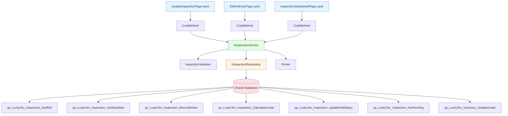
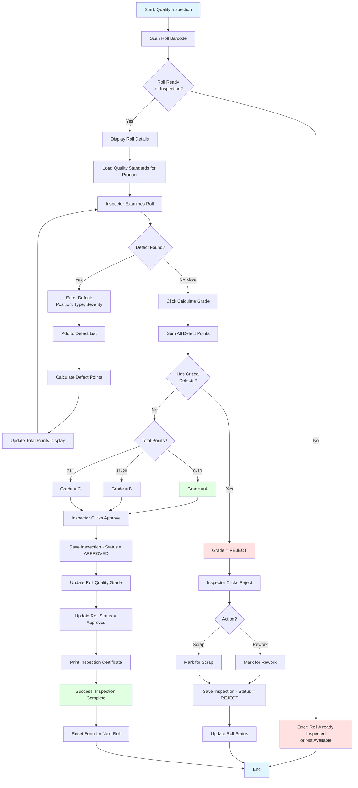

# Process: Quality Inspection

**Process ID**: INS-001
**Module**: 08 - Inspection
**Priority**: P3 (Production Module)
**Created**: 2025-10-06

---

## 1. Process Overview

### Purpose
Perform quality inspection on fabric rolls (grey or finished) to identify defects, calculate defect points using industry-standard grading formula, assign quality grade (A/B/C/Reject), and approve or reject rolls for downstream processes.

### Scope
- Scan fabric roll for inspection
- Record defects by type, position, and severity
- Calculate defect points using point system
- Determine quality grade based on defect point totals
- Approve or reject rolls
- Generate inspection certificate
- Update roll status and quality grade in inventory
- Handle rejected rolls (mark for rework/scrap)

### Module(s) Involved
- **Primary**: M08 - Inspection
- **Upstream**: M05 - Weaving (grey rolls), M06 - Finishing (finished rolls)
- **Downstream**: M06 - Finishing (for grey rolls), M11 - Cut & Print (for approved rolls)

---

## 2. UI Files Inventory

### XAML Files
| File Path | Description | Purpose |
|-----------|-------------|---------|
| `LuckyTex.AirBag.Pages/Pages/08 - Inspection/QualityInspectionPage.xaml` | Inspection interface | Defect entry and grading |
| `LuckyTex.AirBag.Pages/Pages/08 - Inspection/DefectEntryPage.xaml` | Defect entry form | Record individual defects |
| `LuckyTex.AirBag.Pages/Pages/08 - Inspection/InspectionDashboardPage.xaml` | Inspection dashboard | View pending inspections |
| `LuckyTex.AirBag.Pages/Pages/08 - Inspection/InspectionMenuPage.xaml` | Module menu | Navigation |

### Code-Behind Files
| File Path | Description |
|-----------|-------------|
| `LuckyTex.AirBag.Pages/Pages/08 - Inspection/QualityInspectionPage.xaml.cs` | Inspection logic |
| `LuckyTex.AirBag.Pages/Pages/08 - Inspection/DefectEntryPage.xaml.cs` | Defect validation |
| `LuckyTex.AirBag.Pages/Pages/08 - Inspection/InspectionDashboardPage.xaml.cs` | Dashboard display |

### Service Files
| File Path | Description |
|-----------|-------------|
| *(To be created)* `LuckyTex.AirBag.Core/Repositories/InspectionRepository.cs` | Repository |
| *(To be created)* `LuckyTex.AirBag.Core/Services/InspectionService.cs` | Service layer |
| *(To be created)* `LuckyTex.AirBag.Core/Validators/InspectionValidator.cs` | FluentValidation |

---

## 3. UI Layout Description

### QualityInspectionPage.xaml

**Screen Title**: "Quality Inspection"

**Roll Selection Section**:
- Roll barcode textbox (focus on load)
- Display roll details (read-only):
  - Roll type (Grey/Finished)
  - Product, Length
  - Production date
  - Current status

**Quality Standards Section** (auto-loaded):
- Display quality standards for product:
  - Allowed defect types
  - Defect point values (Minor=1, Major=3, Critical=10)
  - Grading thresholds:
    - Grade A: 0-10 points
    - Grade B: 11-20 points
    - Grade C: 21+ points
    - Reject: Any critical defects

**Defect Entry Section**:
- Defect type dropdown (loaded from standards)
- Defect position (meters from start) - numeric input
- Defect severity (Minor/Major/Critical) - radio buttons
- Defect description (optional textbox)
- `cmdAddDefect` - Add to defect list
- Defects DataGrid:
  - Columns: Position (m), Type, Severity, Points, Description, Actions
  - Row actions: Edit, Delete
  - Auto-calculate total points

**Grading Summary Section** (updates real-time):
- Total defect points (large numeric display)
- Color-coded grade indicator:
  - Green: Grade A (0-10 points)
  - Blue: Grade B (11-20 points)
  - Yellow: Grade C (21+ points)
  - Red: REJECT (critical defects present)
- Critical defect flag (if any critical defects)

**Action Buttons**:
- `cmdCalculateGrade` - Calculate final grade
- `cmdApprove` - Approve roll (if grade A/B/C)
- `cmdReject` - Reject roll (if grade = REJECT or operator decision)
- `cmdPrintCertificate` - Print inspection certificate
- `cmdBack` - Return to dashboard

### DefectEntryPage.xaml (Dialog or inline)

**Screen Title**: "Add Defect"

**Defect Input**:
- Position (meters) - numeric, required
- Type dropdown - required
- Severity radio buttons - required
- Description textbox - optional, max 200 chars
- `cmdSave` - Add defect
- `cmdCancel` - Cancel

### InspectionDashboardPage.xaml

**Screen Title**: "Inspection Dashboard"

**Summary Cards**:
- Pending inspections count
- Inspections today count
- Average quality grade
- Rejection rate %

**Pending Inspections DataGrid**:
- Columns: Roll Barcode, Type (Grey/Finished), Product, Length, Received Date, Age (days)
- Row click: Open inspection page

**Action Buttons**:
- `cmdRefresh` - Reload data
- `cmdViewHistory` - View inspection history

---

## 4. Component Architecture Diagram



---

## 5. Workflow Diagram



---

## 6. Business Logic Sequence Diagram

```mermaid
sequenceDiagram
    participant Inspector
    participant UI as QualityInspectionPage
    participant BL as InspectionService
    participant VAL as InspectionValidator
    participant REPO as InspectionRepository
    participant DB as Oracle Database
    participant Printer

    Inspector->>UI: Scan roll barcode
    UI->>BL: GetRollForInspection(barcode)
    BL->>REPO: GetRollByBarcode(barcode)
    REPO->>DB: sp_LuckyTex_Inspection_GetRoll

    alt Roll ready for inspection
        DB-->>REPO: Roll details (product, length, status)
        REPO-->>BL: Roll entity
        BL->>BL: Check roll not already inspected
        BL->>REPO: GetQualityStandard(productCode)
        REPO->>DB: sp_LuckyTex_Inspection_GetStandard
        DB-->>REPO: Quality standards (defect types, point values, grades)
        REPO-->>BL: Quality standard
        BL-->>UI: Display roll info + standards

        loop For each defect found
            Inspector->>Inspector: Examine roll, find defect
            Inspector->>UI: Enter defect (position=25.5m, type='Weft Break', severity='Minor')
            UI->>BL: AddDefect(defect)
            BL->>VAL: Validate defect
            VAL->>VAL: Check position > 0 and <= roll length
            VAL->>VAL: Check defect type valid for product
            VAL->>VAL: Check severity valid (Minor/Major/Critical)

            alt Validation passed
                VAL-->>BL: OK
                BL->>BL: Calculate defect points based on severity:<br/>Minor=1, Major=3, Critical=10
                BL-->>UI: Add to defect list with points
                UI->>UI: Update total points display
                UI->>UI: Update grade indicator (real-time)
            else Validation failed
                VAL-->>BL: Error: Invalid defect data
                BL-->>UI: Show validation error
            end
        end

        Inspector->>UI: Click Calculate Grade
        UI->>BL: CalculateGrade(rollBarcode, defects)
        BL->>BL: Sum all defect points (e.g., total = 8 points)
        BL->>BL: Check for critical defects (none)

        alt Has critical defects
            BL-->>UI: Grade = REJECT (red)
            UI->>UI: Display reject status
            Inspector->>UI: Select action (Rework/Scrap)
            Inspector->>UI: Click Reject

            UI->>BL: RejectRoll(rollBarcode, defects, action)
            BL->>REPO: BeginTransaction()

            loop For each defect
                BL->>REPO: InsertDefect(defect)
                REPO->>DB: sp_LuckyTex_Inspection_RecordDefect
                Note over DB: INSERT INTO tblInspectionDefect<br/>(rollBarcode, position, type,<br/>severity, points, description)
                DB-->>REPO: Defect ID
            end

            BL->>REPO: SaveInspectionResult(inspection)
            REPO->>DB: sp_LuckyTex_Inspection_CalculateGrade
            Note over DB: INSERT INTO tblInspection<br/>(rollBarcode, inspectorId, grade='REJECT',<br/>totalPoints, criticalDefects=TRUE,<br/>status='REJECTED', action, date)
            DB-->>REPO: Inspection ID

            BL->>REPO: UpdateRollStatus(rollBarcode, 'REJECTED', action)
            REPO->>DB: sp_LuckyTex_Inspection_UpdateRollStatus
            Note over DB: UPDATE tblFabricRoll (or tblFinishedRoll)<br/>SET status='REJECTED', action=@action
            DB-->>REPO: Status updated

            BL->>REPO: CommitTransaction()
            BL-->>UI: Inspection saved - Roll rejected

        else Points 0-10 (Grade A)
            BL-->>UI: Grade = A (green)
            Inspector->>UI: Click Approve

            UI->>BL: ApproveRoll(rollBarcode, defects, grade='A')
            BL->>REPO: BeginTransaction()

            loop For each defect (if any)
                BL->>REPO: InsertDefect(defect)
                REPO->>DB: sp_LuckyTex_Inspection_RecordDefect
                DB-->>REPO: Defect ID
            end

            BL->>REPO: SaveInspectionResult(inspection)
            REPO->>DB: sp_LuckyTex_Inspection_CalculateGrade
            Note over DB: INSERT INTO tblInspection<br/>(rollBarcode, inspectorId, grade='A',<br/>totalPoints=8, criticalDefects=FALSE,<br/>status='APPROVED', date)
            DB-->>REPO: Inspection ID

            BL->>REPO: UpdateRollGrade(rollBarcode, 'A')
            REPO->>DB: sp_LuckyTex_Inventory_UpdateGrade
            Note over DB: UPDATE tblFabricRoll<br/>SET qualityGrade='A'
            DB-->>REPO: Grade updated

            BL->>REPO: UpdateRollStatus(rollBarcode, 'APPROVED')
            REPO->>DB: sp_LuckyTex_Inspection_UpdateRollStatus
            DB-->>REPO: Status updated

            BL->>REPO: CommitTransaction()
            BL-->>UI: Inspection saved - Roll approved

            UI->>Printer: Print inspection certificate with:<br/>- Roll barcode<br/>- Grade: A<br/>- Total points: 8<br/>- Defect list<br/>- Inspector, Date
            Printer-->>UI: Certificate printed

            UI->>UI: Display success, reset form

        else Points 11-20 (Grade B)
            Note over Inspector,Printer: Similar approval process with Grade B

        else Points 21+ (Grade C)
            Note over Inspector,Printer: Similar approval process with Grade C
        end

    else Roll not found or already inspected
        DB-->>REPO: Error / Already inspected
        REPO-->>BL: Error
        BL-->>UI: Error: Invalid roll or already inspected
    end
```



---

## 7. Data Flow

### Input Data

| Data Element | Source | Format | Validation |
|--------------|--------|--------|------------|
| Roll Barcode | Scan | String (30 chars) | Must exist, not yet inspected |
| Defect Position | Inspector input | Decimal (10,2) meters | > 0, <= roll length |
| Defect Type | Dropdown | String | Valid defect type from standards |
| Defect Severity | Radio buttons | Enum (Minor, Major, Critical) | Required |
| Defect Description | Inspector input | String (200 chars) | Optional |
| Inspector ID | Login session | String (10 chars) | Valid employee |
| Rejection Action | Dropdown | Enum (Rework, Scrap) | Required if rejecting |

### Output Data

| Data Element | Destination | Format | Purpose |
|--------------|-------------|--------|---------|
| Defect Records | tblInspectionDefect | Database records | Defect tracking |
| Inspection Result | tblInspection | Database record | Quality record |
| Quality Grade | tblFabricRoll/tblFinishedRoll | Grade (A/B/C/REJECT) | Inventory classification |
| Roll Status Update | tblFabricRoll/tblFinishedRoll | Status (APPROVED/REJECTED) | Workflow control |
| Inspection Certificate | Printer | Printed document | Quality documentation |
| Total Defect Points | UI Display + DB | Numeric | Grading calculation |

### Data Transformations

1. **Defect Severity → Defect Points**: Minor=1, Major=3, Critical=10
2. **Sum(Defect Points) → Quality Grade**:
   - 0-10 points → Grade A
   - 11-20 points → Grade B
   - 21+ points → Grade C
   - Any critical defect → REJECT
3. **Defect Count ÷ Roll Length → Defect Rate**: Defects per 100 meters

---

## 8. Database Operations

### Stored Procedures Used

#### sp_LuckyTex_Inspection_GetRoll
- **Purpose**: Get roll details for inspection
- **Parameters**: @RollBarcode VARCHAR(30)
- **Returns**: Roll details (product, length, status, current grade)
- **Tables Read**: tblFabricRoll OR tblFinishedRoll (check both)

#### sp_LuckyTex_Inspection_GetStandard
- **Purpose**: Get quality standards for product
- **Parameters**: @ProductCode VARCHAR(20)
- **Returns**: Defect types, point values, grade thresholds
- **Tables Read**: tblQualityStandard, tblDefectType

#### sp_LuckyTex_Inspection_RecordDefect
- **Purpose**: Insert defect record
- **Parameters**: @RollBarcode, @Position, @DefectType, @Severity, @Points, @Description
- **Returns**: Defect ID
- **Tables Written**: tblInspectionDefect

#### sp_LuckyTex_Inspection_CalculateGrade
- **Purpose**: Save inspection result with grade
- **Parameters**: @RollBarcode, @InspectorID, @Grade, @TotalPoints, @CriticalDefects, @Status, @Action
- **Returns**: Inspection ID
- **Tables Written**: tblInspection

#### sp_LuckyTex_Inspection_UpdateRollStatus
- **Purpose**: Update roll status (Approved/Rejected)
- **Parameters**: @RollBarcode, @Status, @Action (Rework/Scrap if rejected)
- **Returns**: Success flag
- **Tables Written**: tblFabricRoll OR tblFinishedRoll

#### sp_LuckyTex_Inventory_UpdateGrade
- **Purpose**: Update roll quality grade
- **Parameters**: @RollBarcode, @Grade
- **Returns**: Success flag
- **Tables Written**: tblFabricRoll OR tblFinishedRoll

#### sp_LuckyTex_Inspection_GetPending
- **Purpose**: Get pending inspections for dashboard
- **Parameters**: None
- **Returns**: Rolls awaiting inspection
- **Tables Read**: tblFabricRoll, tblFinishedRoll

### Transaction Scope

#### Approve Roll Transaction
```sql
BEGIN TRANSACTION
  FOR EACH defect:
    1. INSERT INTO tblInspectionDefect (sp_LuckyTex_Inspection_RecordDefect)
  2. INSERT INTO tblInspection (sp_LuckyTex_Inspection_CalculateGrade)
  3. UPDATE tblFabricRoll/tblFinishedRoll - set grade (sp_LuckyTex_Inventory_UpdateGrade)
  4. UPDATE tblFabricRoll/tblFinishedRoll - set status='APPROVED' (sp_LuckyTex_Inspection_UpdateRollStatus)
COMMIT TRANSACTION
```

#### Reject Roll Transaction
```sql
BEGIN TRANSACTION
  FOR EACH defect:
    1. INSERT INTO tblInspectionDefect (sp_LuckyTex_Inspection_RecordDefect)
  2. INSERT INTO tblInspection - status='REJECTED' (sp_LuckyTex_Inspection_CalculateGrade)
  3. UPDATE tblFabricRoll/tblFinishedRoll - set status='REJECTED', action (sp_LuckyTex_Inspection_UpdateRollStatus)
COMMIT TRANSACTION
```

---

## 9. Implementation Checklist

### Phase 1: Repository Layer
- [ ] Create `IInspectionRepository` interface
  - [ ] GetRollForInspection(barcode) method
  - [ ] GetQualityStandard(productCode) method
  - [ ] RecordDefect(defect) method
  - [ ] SaveInspectionResult(inspection) method
  - [ ] UpdateRollGrade(barcode, grade) method
  - [ ] UpdateRollStatus(barcode, status, action) method
  - [ ] GetPendingInspections() method
- [ ] Implement in `InspectionRepository`
- [ ] Unit tests

### Phase 2: Service Layer
- [ ] Create `IInspectionService` interface
  - [ ] GetRollForInspection(barcode) method
  - [ ] GetQualityStandard(productCode) method
  - [ ] AddDefect(defect) method
  - [ ] CalculateGrade(rollBarcode, defects) method
  - [ ] ApproveRoll(rollBarcode, defects, grade) method
  - [ ] RejectRoll(rollBarcode, defects, action) method
  - [ ] GetPendingInspections() method
- [ ] Create `InspectionValidator`
  - [ ] Validate roll not already inspected
  - [ ] Validate defect position <= roll length
  - [ ] Validate defect type valid for product
  - [ ] Validate severity enum value
- [ ] Implement in `InspectionService`
  - [ ] Grading logic (sum points, check critical)
  - [ ] Grade assignment (A/B/C/REJECT)
- [ ] Unit tests
  - [ ] Test grading calculation
  - [ ] Test critical defect detection

### Phase 3: UI Refactoring
- [ ] Update `QualityInspectionPage.xaml.cs`
  - [ ] Inject IInspectionService
  - [ ] Roll scan handler
  - [ ] Defect entry handler
  - [ ] Real-time grade calculation
  - [ ] Approve/reject handlers
  - [ ] Print certificate
- [ ] Update `DefectEntryPage.xaml.cs`
  - [ ] Defect validation
- [ ] Update `InspectionDashboardPage.xaml.cs`
  - [ ] Pending inspections display
  - [ ] Summary cards

### Phase 4: Integration Testing
- [ ] Test inspection workflow end-to-end
- [ ] Test grade calculation (A/B/C/REJECT)
- [ ] Test critical defect detection
- [ ] Test roll status updates
- [ ] Test certificate printing

### Phase 5: Deployment
- [ ] Code review
- [ ] Unit tests passing
- [ ] UAT
- [ ] Production deployment

---

**Document Version**: 1.0
**Last Updated**: 2025-10-06
**Status**: Ready for Implementation
**Estimated Effort**: 3 days
