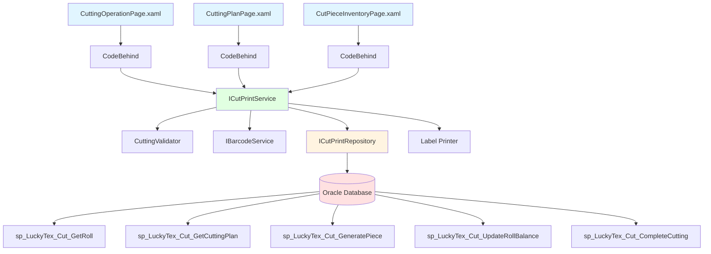
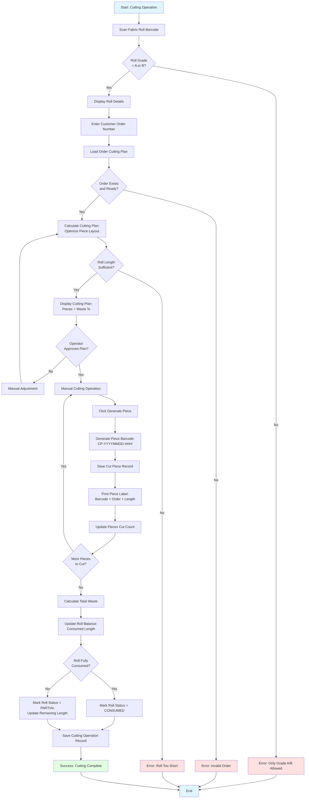

# Process: Cutting Operation

**Process ID**: CP-001
**Module**: 11 - Cut & Print
**Priority**: P4 (Downstream Module)
**Created**: 2025-10-06

---

## 1. Process Overview

### Purpose
Cut approved fabric rolls (Grade A or B only) into specified piece lengths according to customer order requirements. Optimize cutting layout to minimize waste, generate cut piece records with traceability to source rolls, and print piece labels for downstream packing operations.

### Scope
- Validate fabric roll for cutting (Grade A/B only)
- Load customer order and cutting plan
- Optimize cutting layout (minimize waste)
- Generate cut pieces with unique barcodes
- Print piece labels with traceability
- Update roll balance (consumed/partial)
- Record waste percentage

### Module(s) Involved
- **Primary**: M11 - Cut & Print
- **Upstream**: M08 - Inspection (approved rolls)
- **Downstream**: M13 - Packing (cut pieces)

---

## 2. UI Files Inventory

### XAML Files
| File Path | Description | Purpose |
|-----------|-------------|---------|
| `LuckyTex.AirBag.Pages/Pages/11 - CutPrint/CuttingOperationPage.xaml` | Cutting interface | Main cutting workflow |
| `LuckyTex.AirBag.Pages/Pages/11 - CutPrint/CuttingPlanPage.xaml` | Cutting plan viewer | Display optimized layout |
| `LuckyTex.AirBag.Pages/Pages/11 - CutPrint/CutPieceInventoryPage.xaml` | Cut piece inventory | View cut pieces |
| `LuckyTex.AirBag.Pages/Pages/11 - CutPrint/CutPrintMenuPage.xaml` | Module menu | Navigation |

### Code-Behind Files
| File Path | Description |
|-----------|-------------|
| `LuckyTex.AirBag.Pages/Pages/11 - CutPrint/CuttingOperationPage.xaml.cs` | Cutting logic |
| `LuckyTex.AirBag.Pages/Pages/11 - CutPrint/CuttingPlanPage.xaml.cs` | Plan calculation |
| `LuckyTex.AirBag.Pages/Pages/11 - CutPrint/CutPieceInventoryPage.xaml.cs` | Inventory display |

### Service Files
| File Path | Description |
|-----------|-------------|
| *(To be created)* `LuckyTex.AirBag.Core/Repositories/CutPrintRepository.cs` | Repository |
| *(To be created)* `LuckyTex.AirBag.Core/Services/CutPrintService.cs` | Service layer |
| *(To be created)* `LuckyTex.AirBag.Core/Services/BarcodeService.cs` | Barcode generation (shared) |
| *(To be created)* `LuckyTex.AirBag.Core/Validators/CuttingValidator.cs` | FluentValidation |

---

## 3. UI Layout Description

### CuttingOperationPage.xaml

**Screen Title**: "Fabric Cutting Operation"

**Roll Selection Section**:
- Fabric roll barcode textbox
- Display roll details (read-only):
  - Product, Length, Quality Grade
  - Inspection date
  - Current status

**Order Selection Section**:
- Customer order number textbox or dropdown
- Display order details:
  - Customer name
  - Product code
  - Required piece lengths (DataGrid)
  - Total quantity required
  - Delivery date

**Cutting Plan Section**:
- Display cutting plan:
  - Roll length available
  - Required pieces (length × quantity)
  - Optimized cutting layout (visual diagram)
  - Total length needed
  - Waste calculation (meters and %)
- `cmdOptimize` - Re-optimize cutting plan

**Cut Piece Generation Section**:
- Current piece number (auto-increment)
- Piece length input (from plan or manual)
- Pieces generated list (DataGrid):
  - Columns: Piece Barcode, Length (m), Order Number, Timestamp
- `cmdGeneratePiece` - Generate next piece
- `cmdBatchGenerate` - Generate all pieces in plan

**Progress Tracking**:
- Pieces cut: X / Total
- Roll remaining: XX.X meters
- Progress bar

**Action Buttons**:
- `cmdComplete` - Complete cutting operation
- `cmdCancel` - Cancel operation
- `cmdBack` - Return to dashboard

### CuttingPlanPage.xaml

**Screen Title**: "Cutting Plan Optimizer"

**Input Section**:
- Roll length input
- Required pieces table (length, quantity)
- `cmdCalculate` - Calculate optimized plan

**Plan Display**:
- Visual cutting layout (horizontal bar chart)
- Piece sequence
- Waste segments highlighted in red
- Total waste: XX.X meters (X.X%)

**Action Buttons**:
- `cmdApply` - Use this plan
- `cmdExport` - Export plan to Excel

---

## 4. Component Architecture Diagram



---

## 5. Workflow Diagram



---

## 6. Business Logic Sequence Diagram

```mermaid
sequenceDiagram
    participant Operator
    participant UI as CuttingOperationPage
    participant BL as CutPrintService
    participant VAL as CuttingValidator
    participant REPO as CutPrintRepository
    participant DB as Oracle Database
    participant Printer

    Operator->>UI: Scan fabric roll barcode
    UI->>BL: GetRollForCutting(barcode)
    BL->>REPO: GetRollByBarcode(barcode)
    REPO->>DB: sp_LuckyTex_Cut_GetRoll

    alt Roll exists and grade A/B
        DB-->>REPO: Roll details (product, length, grade, status)
        REPO-->>BL: Roll entity
        BL->>BL: Validate grade = A or B
        BL->>BL: Validate status = Approved

        alt Valid roll
            BL-->>UI: Display roll info

            Operator->>UI: Enter customer order number
            UI->>BL: GetCuttingPlan(orderNumber)
            BL->>REPO: GetOrderCuttingPlan(orderNumber)
            REPO->>DB: sp_LuckyTex_Cut_GetCuttingPlan
            Note over DB: SELECT order details<br/>JOIN tblOrderLine (piece specs)<br/>WHERE orderNumber = @orderNumber
            DB-->>REPO: Cutting plan (piece lengths, quantities)
            REPO-->>BL: Order cutting requirements

            BL->>BL: OptimizeCuttingLayout(rollLength, requiredPieces)
            Note over BL: Cutting optimization algorithm:<br/>1. Sort pieces by length (descending)<br/>2. First-fit decreasing heuristic<br/>3. Calculate waste segments
            BL->>BL: Calculate total length needed
            BL->>BL: Check rollLength >= totalNeeded

            alt Sufficient length
                BL-->>UI: Display cutting plan with waste %
                UI->>UI: Show visual layout

                Operator->>UI: Review plan, approve
                Operator->>UI: Click Generate Piece

                UI->>BL: GenerateCutPiece(rollBarcode, orderNumber, pieceLength)
                BL->>VAL: Validate piece generation
                VAL->>VAL: Check piece length > 0
                VAL->>VAL: Check piece length <= roll remaining
                VAL->>VAL: Check piece matches plan

                alt Validation passed
                    VAL-->>BL: OK

                    BL->>BL: Generate piece barcode: CP-YYYYMMDD-####
                    BL->>REPO: BeginTransaction()

                    BL->>REPO: CreateCutPiece(piece)
                    REPO->>DB: sp_LuckyTex_Cut_GeneratePiece
                    Note over DB: INSERT INTO tblCutPiece<br/>(barcode, rollBarcode, orderNumber,<br/>length, cutDate, operatorId)
                    DB-->>REPO: Piece ID

                    BL->>REPO: LinkTraceability(pieceId, rollBarcode)
                    REPO->>DB: sp_LuckyTex_Traceability_LinkPiece
                    Note over DB: INSERT INTO tblPieceTraceability<br/>(pieceId, rollBarcode)
                    DB-->>REPO: Link created

                    BL->>REPO: CommitTransaction()

                    BL->>Printer: Print piece label with:<br/>- Piece barcode<br/>- Order number<br/>- Length<br/>- Product<br/>- Roll barcode (traceability)
                    Printer-->>BL: Label printed

                    BL-->>UI: Piece generated successfully
                    UI->>UI: Add to pieces list
                    UI->>UI: Update progress (pieces cut + 1)

                    alt More pieces needed
                        Note over Operator: Repeat for next piece
                    else All pieces cut
                        Operator->>UI: Click Complete Cutting

                        UI->>BL: CompleteCuttingOperation(rollBarcode, orderNumber, pieces)
                        BL->>BL: Calculate total length used
                        BL->>BL: Calculate waste = rollLength - totalUsed
                        BL->>BL: Calculate waste % = (waste / rollLength) × 100

                        BL->>REPO: BeginTransaction()

                        BL->>REPO: UpdateRollBalance(rollBarcode, lengthUsed)
                        REPO->>DB: sp_LuckyTex_Cut_UpdateRollBalance
                        Note over DB: UPDATE tblFabricRoll (or tblFinishedRoll)<br/>SET remainingLength = remainingLength - @used

                        alt Remaining length <= 0
                            Note over DB: SET status = 'CONSUMED'
                        else Remaining length > 0
                            Note over DB: SET status = 'PARTIAL'
                        end

                        DB-->>REPO: Roll updated

                        BL->>REPO: SaveCuttingOperation(operation)
                        REPO->>DB: sp_LuckyTex_Cut_CompleteCutting
                        Note over DB: INSERT INTO tblCuttingOperation<br/>(rollBarcode, orderNumber,<br/>piecesGenerated, totalLength,<br/>waste, wastePercent, date)
                        DB-->>REPO: Operation ID

                        BL->>REPO: CommitTransaction()
                        BL-->>UI: Cutting operation complete

                        UI->>UI: Display success, clear form
                    end

                else Validation failed
                    VAL-->>BL: Error: Invalid piece
                    BL-->>UI: Show error
                end

            else Insufficient length
                BL-->>UI: Error: Roll too short for order
            end

        else Invalid roll
            BL-->>UI: Error: Only Grade A/B rolls allowed
        end

    else Roll not found or wrong grade
        DB-->>REPO: Error: Roll not found
        REPO-->>BL: Error
        BL-->>UI: Error: Invalid roll
    end
```



---

## 7. Data Flow

### Input Data

| Data Element | Source | Format | Validation |
|--------------|--------|--------|------------|
| Roll Barcode | Scan | String (30 chars) | Must exist with grade A or B |
| Order Number | Input | String (20 chars) | Must exist and ready to cut |
| Piece Length | Plan/manual | Decimal (10,2) meters | > 0, <= roll remaining |
| Operator ID | Login session | String (10 chars) | Valid employee |

### Output Data

| Data Element | Destination | Format | Purpose |
|--------------|-------------|--------|---------|
| Cut Piece Records | tblCutPiece | Database records | Piece tracking |
| Piece Barcodes | tblCutPiece + Label | CP-YYYYMMDD-#### | Piece identification |
| Traceability Links | tblPieceTraceability | Roll → Piece mapping | Backward traceability |
| Roll Balance Update | tblFabricRoll/tblFinishedRoll | Remaining length | Inventory tracking |
| Cutting Operation Record | tblCuttingOperation | Summary record | Performance tracking |
| Piece Labels | Printer | Printed labels | Physical identification |
| Waste Percentage | tblCuttingOperation | Decimal (5,2) % | Efficiency metric |

### Data Transformations

1. **Cutting Plan → Optimized Layout**: First-fit decreasing heuristic to minimize waste
2. **Roll Length - Sum(Piece Lengths) → Waste**: Calculate material waste
3. **Waste ÷ Roll Length × 100 → Waste %**: Efficiency metric
4. **Remaining Length → Roll Status**: "CONSUMED" if <= 0, "PARTIAL" if > 0

---

## 8. Database Operations

### Stored Procedures Used

#### sp_LuckyTex_Cut_GetRoll
- **Purpose**: Get roll details for cutting
- **Parameters**: @RollBarcode VARCHAR(30)
- **Returns**: Roll details (product, length, grade, status)
- **Tables Read**: tblFabricRoll, tblFinishedRoll, tblInspection

#### sp_LuckyTex_Cut_GetCuttingPlan
- **Purpose**: Get order cutting requirements
- **Parameters**: @OrderNumber VARCHAR(20)
- **Returns**: Order details with piece specifications (length, quantity)
- **Tables Read**: tblCustomerOrder, tblOrderLine

#### sp_LuckyTex_Cut_GeneratePiece
- **Purpose**: Create cut piece record
- **Parameters**: @Barcode, @RollBarcode, @OrderNumber, @Length, @CutDate, @OperatorID
- **Returns**: Piece ID
- **Tables Written**: tblCutPiece

#### sp_LuckyTex_Cut_UpdateRollBalance
- **Purpose**: Update roll remaining length and status
- **Parameters**: @RollBarcode, @LengthUsed
- **Returns**: Success flag
- **Tables Written**: tblFabricRoll OR tblFinishedRoll

#### sp_LuckyTex_Cut_CompleteCutting
- **Purpose**: Record cutting operation summary
- **Parameters**: @RollBarcode, @OrderNumber, @PiecesGenerated, @TotalLength, @Waste, @WastePercent, @OperatorID
- **Returns**: Operation ID
- **Tables Written**: tblCuttingOperation

#### sp_LuckyTex_Traceability_LinkPiece
- **Purpose**: Create traceability link for cut piece
- **Parameters**: @PieceID, @RollBarcode
- **Returns**: Link ID
- **Tables Written**: tblPieceTraceability

### Transaction Scope

#### Generate Cut Piece Transaction
```sql
BEGIN TRANSACTION
  1. INSERT INTO tblCutPiece (sp_LuckyTex_Cut_GeneratePiece)
  2. INSERT INTO tblPieceTraceability (sp_LuckyTex_Traceability_LinkPiece)
COMMIT TRANSACTION
```

#### Complete Cutting Transaction
```sql
BEGIN TRANSACTION
  1. UPDATE tblFabricRoll/tblFinishedRoll - remaining length and status (sp_LuckyTex_Cut_UpdateRollBalance)
  2. INSERT INTO tblCuttingOperation (sp_LuckyTex_Cut_CompleteCutting)
COMMIT TRANSACTION
```

---

## 9. Implementation Checklist

### Phase 1: Repository Layer
- [ ] Create `ICutPrintRepository` interface
  - [ ] GetRollForCutting(barcode) method
  - [ ] GetOrderCuttingPlan(orderNumber) method
  - [ ] CreateCutPiece(piece) method
  - [ ] UpdateRollBalance(barcode, lengthUsed) method
  - [ ] SaveCuttingOperation(operation) method
  - [ ] LinkPieceTraceability(pieceId, rollBarcode) method
- [ ] Implement in `CutPrintRepository`
- [ ] Unit tests

### Phase 2: Service Layer
- [ ] Create `ICutPrintService` interface
  - [ ] GetRollForCutting(barcode) method
  - [ ] GetCuttingPlan(orderNumber) method
  - [ ] OptimizeCuttingLayout(rollLength, pieces) method
  - [ ] GenerateCutPiece(rollBarcode, orderNumber, length) method
  - [ ] CompleteCuttingOperation(rollBarcode, orderNumber, pieces) method
- [ ] Create `CuttingValidator`
  - [ ] Validate roll grade = A or B
  - [ ] Validate roll status = Approved
  - [ ] Validate piece length > 0 and <= remaining
  - [ ] Validate sufficient roll length for order
- [ ] Implement in `CutPrintService`
  - [ ] Cutting optimization algorithm (first-fit decreasing)
  - [ ] Waste calculation
- [ ] Unit tests
  - [ ] Test optimization algorithm
  - [ ] Test waste calculation

### Phase 3: UI Refactoring
- [ ] Update `CuttingOperationPage.xaml.cs`
  - [ ] Inject ICutPrintService, IBarcodeService
  - [ ] Roll scan handler
  - [ ] Order selection handler
  - [ ] Generate piece handler
  - [ ] Complete cutting handler
- [ ] Update `CuttingPlanPage.xaml.cs`
  - [ ] Plan optimization display
  - [ ] Visual layout rendering
- [ ] Update `CutPieceInventoryPage.xaml.cs`
  - [ ] Cut piece search and display

### Phase 4: Integration Testing
- [ ] Test cutting workflow end-to-end
- [ ] Test optimization algorithm with various scenarios
- [ ] Test waste calculation
- [ ] Test roll balance updates
- [ ] Test piece label printing

### Phase 5: Deployment
- [ ] Code review
- [ ] Unit tests passing
- [ ] UAT
- [ ] Production deployment

---

**Document Version**: 1.0
**Last Updated**: 2025-10-06
**Status**: Ready for Implementation
**Estimated Effort**: 3 days
