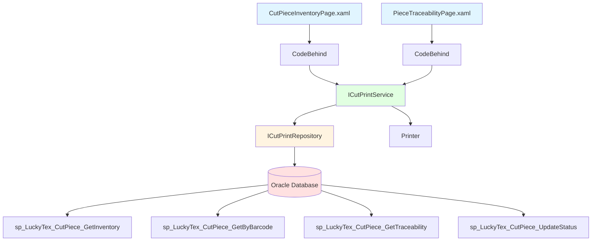
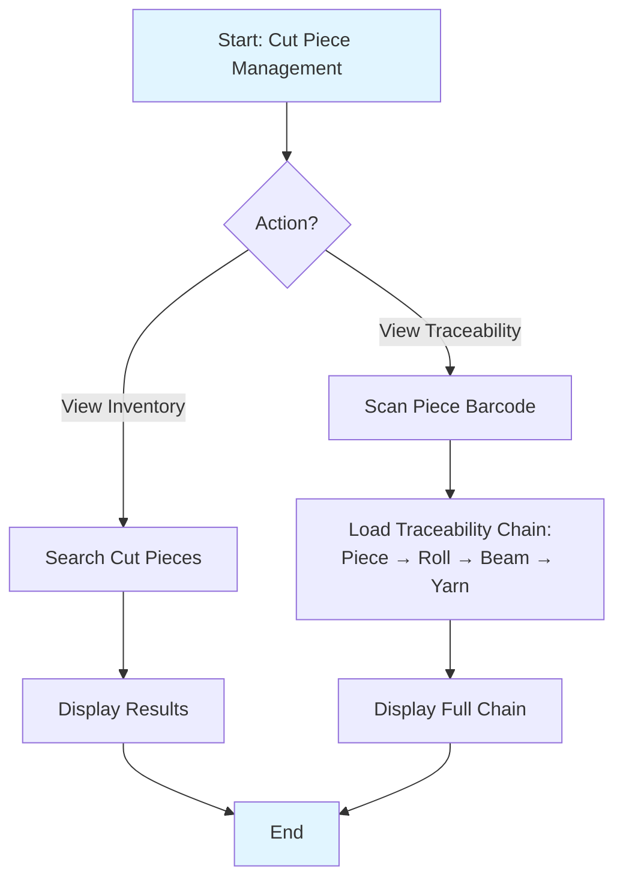
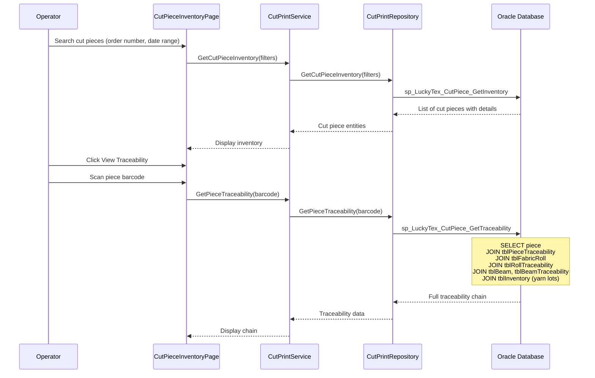

# Process: Cut Piece Management

**Process ID**: CP-002
**Module**: 11 - Cut & Print
**Priority**: P4 (Downstream Module)
**Created**: 2025-10-06

---

## 1. Process Overview

### Purpose
Manage cut piece inventory from generation during cutting operations to consumption in packing operations. Track piece location, order allocation, and maintain complete traceability to source rolls and original materials.

### Scope
- View and search cut piece inventory
- Track piece allocation to customer orders
- Transfer pieces to Packing department
- Maintain traceability to source rolls
- Handle piece adjustments (damaged, rework)
- Generate cut piece reports

### Module(s) Involved
- **Primary**: M11 - Cut & Print
- **Upstream**: Cutting Operation (piece creation)
- **Downstream**: M13 - Packing (piece consumption)

---

## 2. UI Files Inventory

### XAML Files
| File Path | Description | Purpose |
|-----------|-------------|---------|
| `LuckyTex.AirBag.Pages/Pages/11 - CutPrint/CutPieceInventoryPage.xaml` | Inventory dashboard | View cut pieces |
| `LuckyTex.AirBag.Pages/Pages/11 - CutPrint/PieceTraceabilityPage.xaml` | Traceability viewer | View source chain |
| `LuckyTex.AirBag.Pages/Pages/11 - CutPrint/CutPrintMenuPage.xaml` | Module menu | Navigation |

### Code-Behind Files
| File Path | Description |
|-----------|-------------|
| `LuckyTex.AirBag.Pages/Pages/11 - CutPrint/CutPieceInventoryPage.xaml.cs` | Inventory logic |
| `LuckyTex.AirBag.Pages/Pages/11 - CutPrint/PieceTraceabilityPage.xaml.cs` | Traceability display |

### Service Files
| File Path | Description |
|-----------|-------------|
| *(To be created)* `LuckyTex.AirBag.Core/Repositories/CutPrintRepository.cs` | Repository |
| *(To be created)* `LuckyTex.AirBag.Core/Services/CutPrintService.cs` | Service layer |

---

## 3. UI Layout Description

### CutPieceInventoryPage.xaml

**Screen Title**: "Cut Piece Inventory"

**Search Section**:
- Piece barcode search textbox
- Order number filter
- Date range filter
- Status filter (All, Available, Allocated, Packed, Damaged)
- `cmdSearch`

**Inventory DataGrid**:
- Columns: Piece Barcode, Order Number, Length (m), Product, Cut Date, Status, Location
- Row click: Show details

**Summary Cards**:
- Total pieces available
- Total pieces allocated
- Pieces pending packing
- Pieces damaged

**Action Buttons**:
- `cmdViewTrace` - View traceability
- `cmdPrint` - Print piece label
- `cmdExport` - Export to Excel

### PieceTraceabilityPage.xaml

**Screen Title**: "Cut Piece Traceability"

**Piece Information**:
- Piece barcode input
- Display piece details

**Source Chain Section** (backward traceability):
- Roll barcode
- Click roll → Navigate to roll traceability:
  - Grey roll → Finished roll → Weaving production
  - Beam barcode → Warping production
  - Yarn lot numbers → Suppliers

**Downstream Usage Section** (if packed):
- Packing box number
- Customer order
- Shipment number
- Delivery date

---

## 4. Component Architecture Diagram

---

## 5. Workflow Diagram

---

## 6. Business Logic Sequence Diagram

---

## 7. Data Flow

### Input Data

| Data Element | Source | Format | Validation |
|--------------|--------|--------|------------|
| Piece Barcode | Scan/search | String (30 chars) | Must exist |
| Search Filters | Operator | Order, date, status | Valid values |

### Output Data

| Data Element | Destination | Format | Purpose |
|--------------|-------------|--------|---------|
| Inventory List | UI Display | List of pieces | Search results |
| Traceability Chain | UI Display | Hierarchical tree | Quality investigation |

---

## 8. Database Operations

### Stored Procedures Used

#### sp_LuckyTex_CutPiece_GetInventory
- **Purpose**: Search cut piece inventory
- **Parameters**: @OrderNumber, @Status, @DateFrom, @DateTo
- **Returns**: List of cut pieces
- **Tables Read**: tblCutPiece, tblCustomerOrder

#### sp_LuckyTex_CutPiece_GetByBarcode
- **Purpose**: Get piece details
- **Parameters**: @Barcode VARCHAR(30)
- **Returns**: Piece details + status
- **Tables Read**: tblCutPiece

#### sp_LuckyTex_CutPiece_GetTraceability
- **Purpose**: Get full traceability chain
- **Parameters**: @PieceBarcode VARCHAR(30)
- **Returns**: Piece → Roll → Beam → Yarn chain
- **Tables Read**: tblCutPiece, tblPieceTraceability, tblFabricRoll, tblRollTraceability, tblBeam, tblBeamTraceability, tblInventory

#### sp_LuckyTex_CutPiece_UpdateStatus
- **Purpose**: Update piece status
- **Parameters**: @PieceBarcode, @Status
- **Returns**: Success flag
- **Tables Written**: tblCutPiece

---

## 9. Implementation Checklist

### Phase 1: Repository Layer
- [ ] Extend `ICutPrintRepository`
  - [ ] GetCutPieceInventory(filters) method
  - [ ] GetCutPieceByBarcode(barcode) method
  - [ ] GetCutPieceTraceability(barcode) method
  - [ ] UpdateCutPieceStatus(barcode, status) method
- [ ] Implement in `CutPrintRepository`
- [ ] Unit tests

### Phase 2: Service Layer
- [ ] Extend `ICutPrintService`
  - [ ] GetCutPieceInventory(filters) method
  - [ ] GetCutPieceDetails(barcode) method
  - [ ] GetPieceTraceability(barcode) method
- [ ] Implement in `CutPrintService`
- [ ] Unit tests

### Phase 3: UI Refactoring
- [ ] Update `CutPieceInventoryPage.xaml.cs`
  - [ ] Inject ICutPrintService
  - [ ] Search handler
  - [ ] Summary cards
- [ ] Update `PieceTraceabilityPage.xaml.cs`
  - [ ] Traceability tree display

### Phase 4: Integration Testing
- [ ] Test inventory search
- [ ] Test traceability display (full chain)
- [ ] Test label printing

### Phase 5: Deployment
- [ ] Code review
- [ ] Unit tests passing
- [ ] UAT
- [ ] Production deployment

---

**Document Version**: 1.0
**Last Updated**: 2025-10-06
**Status**: Ready for Implementation
**Estimated Effort**: 1-2 days
