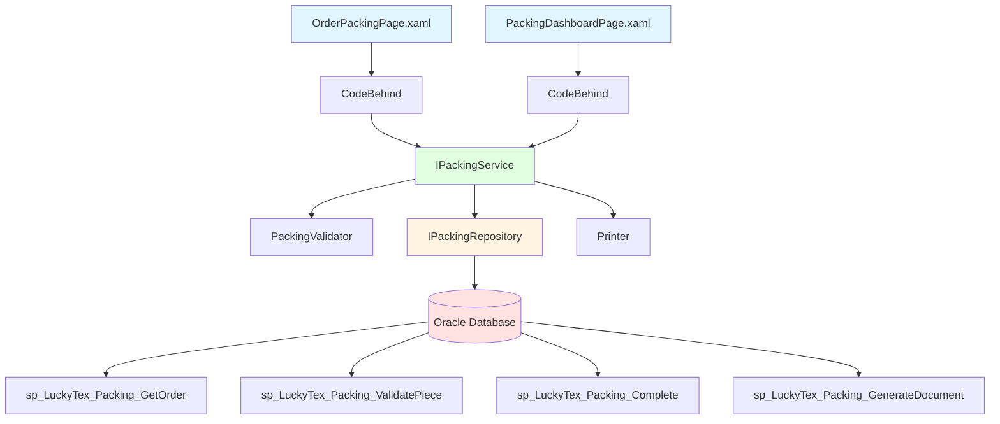
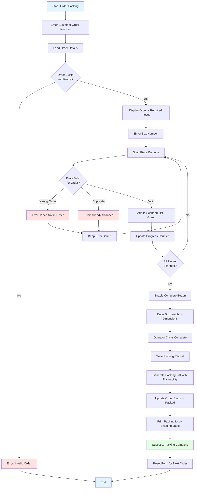

# Process: Order Packing

**Process ID**: PK-001
**Module**: 13 - Packing
**Priority**: P4 (Downstream Module)
**Created**: 2025-10-06

---

## 1. Process Overview

### Purpose
Pack cut fabric pieces into boxes according to customer order requirements. Validate each piece by barcode scanning, ensure all required pieces are included, generate packing list with complete traceability chain, and prepare boxes for shipping.

### Scope
- Load customer order and required piece list
- Scan and validate cut pieces for order
- Verify all pieces included (100% accuracy required)
- Record packing box details (weight, dimensions)
- Generate packing list with full traceability
- Print shipping labels
- Update order status to "Packed"

### Module(s) Involved
- **Primary**: M13 - Packing
- **Upstream**: M11 - Cut & Print (cut pieces)
- **Downstream**: M14 - Shipping (packed boxes)

---

## 2. UI Files Inventory

### XAML Files
| File Path | Description | Purpose |
|-----------|-------------|---------|
| `LuckyTex.AirBag.Pages/Pages/13 - Packing/OrderPackingPage.xaml` | Packing interface | Main packing workflow |
| `LuckyTex.AirBag.Pages/Pages/13 - Packing/PackingDashboardPage.xaml` | Packing dashboard | View pending orders |
| `LuckyTex.AirBag.Pages/Pages/13 - Packing/PackingMenuPage.xaml` | Module menu | Navigation |

### Code-Behind Files
| File Path | Description |
|-----------|-------------|
| `LuckyTex.AirBag.Pages/Pages/13 - Packing/OrderPackingPage.xaml.cs` | Packing logic |
| `LuckyTex.AirBag.Pages/Pages/13 - Packing/PackingDashboardPage.xaml.cs` | Dashboard display |

### Service Files
| File Path | Description |
|-----------|-------------|
| *(To be created)* `LuckyTex.AirBag.Core/Repositories/PackingRepository.cs` | Repository |
| *(To be created)* `LuckyTex.AirBag.Core/Services/PackingService.cs` | Service layer |
| *(To be created)* `LuckyTex.AirBag.Core/Validators/PackingValidator.cs` | FluentValidation |

---

## 3. UI Layout Description

### OrderPackingPage.xaml

**Screen Title**: "Customer Order Packing"

**Order Selection Section**:
- Customer order number textbox
- Display order details (read-only):
  - Customer name
  - Product code
  - Required pieces (quantity)
  - Delivery date
  - Order status

**Required Pieces Section**:
- DataGrid showing required pieces:
  - Columns: Piece Barcode (expected), Length (m), Status (Pending/Scanned), Scan Time
  - Color coding: Grey (pending), Green (scanned), Red (error)

**Scanning Section**:
- Box number input
- Piece barcode scan textbox (focus)
- Real-time validation feedback:
  - Green check: Valid piece
  - Red X: Invalid/wrong order/duplicate
  - Error message display

**Scanned Pieces List**:
- DataGrid of scanned pieces:
  - Columns: Piece Barcode, Length, Scan Time, Operator
- `cmdRemove` - Remove piece from list (if error)

**Progress Tracking**:
- Pieces scanned: X / Total Required
- Progress bar
- Visual indicator: Red (incomplete), Green (all scanned)

**Box Details Section** (enabled when all pieces scanned):
- Box weight (kg) - numeric input
- Box dimensions (L × W × H cm) - numeric inputs
- Special instructions textbox

**Action Buttons**:
- `cmdCompletePacking` - Complete packing (enabled when all scanned)
- `cmdCancel` - Cancel operation
- `cmdPrintLabel` - Reprint box label
- `cmdBack` - Return to dashboard

### PackingDashboardPage.xaml

**Screen Title**: "Packing Dashboard"

**Summary Cards**:
- Pending orders count
- Orders packed today
- Boxes packed today
- Average packing time

**Pending Orders DataGrid**:
- Columns: Order Number, Customer, Product, Pieces Required, Due Date, Priority
- Row click: Open packing page

---

## 4. Component Architecture Diagram



---

## 5. Workflow Diagram



---

## 6. Business Logic Sequence Diagram

```mermaid
sequenceDiagram
    participant Operator
    participant UI as OrderPackingPage
    participant BL as PackingService
    participant VAL as PackingValidator
    participant REPO as PackingRepository
    participant DB as Oracle Database
    participant Printer

    Operator->>UI: Enter customer order number
    UI->>BL: GetOrderForPacking(orderNumber)
    BL->>REPO: GetOrderDetails(orderNumber)
    REPO->>DB: sp_LuckyTex_Packing_GetOrder

    alt Order exists and ready
        DB-->>REPO: Order details + required piece list
        REPO-->>BL: Order entity
        BL-->>UI: Display order + required pieces

        Operator->>UI: Enter box number
        UI->>UI: Clear scanned pieces list

        loop For each piece to scan
            Operator->>Operator: Physical scanning
            Operator->>UI: Scan piece barcode

            UI->>BL: ValidatePieceForOrder(orderNumber, pieceBarcode)
            BL->>REPO: ValidatePiece(orderNumber, pieceBarcode)
            REPO->>DB: sp_LuckyTex_Packing_ValidatePiece
            Note over DB: SELECT piece<br/>WHERE barcode = @barcode<br/>AND orderNumber = @orderNumber<br/>AND status = 'Available'

            alt Piece belongs to order and not packed
                DB-->>REPO: Piece details + validation OK
                REPO-->>BL: Piece entity
                BL-->>UI: Valid - Green check

                UI->>UI: Add to scanned list (green row)
                UI->>UI: Update progress counter
                UI->>UI: Update required pieces status (mark green)

            else Piece not in order
                DB-->>REPO: Error: Piece not found for this order
                REPO-->>BL: Error
                BL-->>UI: Error: Wrong piece

                UI->>UI: Display error message (red)
                UI->>UI: Play error beep
                UI->>UI: Clear barcode field, refocus

            else Piece already packed
                DB-->>REPO: Error: Piece status = Packed
                REPO-->>BL: Error
                BL-->>UI: Error: Duplicate scan

                UI->>UI: Display error (red)
                UI->>UI: Play error beep
            end
        end

        alt All pieces scanned
            UI->>UI: Enable Complete Packing button
            Operator->>UI: Enter box weight and dimensions
            Operator->>UI: Click Complete Packing

            UI->>BL: CompletePackingOperation(packingRequest)
            Note over packingRequest: orderNumber, boxNumber,<br/>scannedPieces, boxWeight,<br/>boxDimensions

            BL->>VAL: Validate packing request
            VAL->>VAL: Check all required pieces scanned
            VAL->>VAL: Check box weight > 0
            VAL->>VAL: Check box dimensions valid

            alt Validation passed
                VAL-->>BL: OK

                BL->>REPO: BeginTransaction()

                BL->>REPO: SavePackingRecord(packing)
                REPO->>DB: sp_LuckyTex_Packing_Complete
                Note over DB: INSERT INTO tblPacking<br/>(orderNumber, boxNumber,<br/>boxWeight, boxDimensions,<br/>piecesCount, packDate, operatorId)
                DB-->>REPO: Packing ID

                loop For each scanned piece
                    BL->>REPO: UpdatePieceStatus(pieceBarcode, 'Packed', packingId)
                    REPO->>DB: UPDATE tblCutPiece SET status='Packed', packingId=@id
                    DB-->>REPO: Updated
                end

                BL->>REPO: UpdateOrderStatus(orderNumber, 'Packed')
                REPO->>DB: UPDATE tblCustomerOrder SET status='Packed'
                DB-->>REPO: Updated

                BL->>REPO: GeneratePackingDocument(packingId)
                REPO->>DB: sp_LuckyTex_Packing_GenerateDocument
                Note over DB: SELECT packing details<br/>JOIN pieces with full traceability<br/>(Piece → Roll → Beam → Yarn)
                DB-->>REPO: Packing document data
                REPO-->>BL: Document data

                BL->>REPO: CommitTransaction()

                BL->>Printer: Print packing list with:<br/>- Order number, Customer<br/>- All piece barcodes<br/>- Full traceability chain<br/>- Box weight, dimensions<br/>- Date, Operator
                Printer-->>BL: Packing list printed

                BL->>Printer: Print shipping label with:<br/>- Box number<br/>- Customer address<br/>- Order number<br/>- Weight
                Printer-->>BL: Shipping label printed

                BL-->>UI: Packing complete

                UI->>UI: Display success message
                UI->>UI: Clear form, reset for next order

            else Validation failed
                VAL-->>BL: Error: Validation failed
                BL-->>UI: Show validation errors
            end

        else Missing pieces
            UI->>UI: Display error: {count} pieces still needed
            UI->>UI: Highlight missing pieces in red
        end

    else Order not found or not ready
        DB-->>REPO: Error: Invalid order
        REPO-->>BL: Error
        BL-->>UI: Error: Order not found or not ready to pack
    end
```



---

## 7. Data Flow

### Input Data

| Data Element | Source | Format | Validation |
|--------------|--------|--------|------------|
| Order Number | Operator input | String (20 chars) | Must exist with status ready to pack |
| Box Number | Operator input | String (20 chars) | Required |
| Piece Barcode | Scan | String (30 chars) | Must belong to order, not yet packed |
| Box Weight | Operator input | Decimal (10,2) kg | > 0 |
| Box Dimensions | Operator input | L × W × H (cm) | All > 0 |
| Operator ID | Login session | String (10 chars) | Valid employee |

### Output Data

| Data Element | Destination | Format | Purpose |
|--------------|-------------|--------|---------|
| Packing Record | tblPacking | Database record | Packing tracking |
| Piece Status Updates | tblCutPiece | Status = Packed | Inventory update |
| Order Status Update | tblCustomerOrder | Status = Packed | Order tracking |
| Packing Document | Printer | Printed document | Traceability documentation |
| Shipping Label | Printer | Printed label | Box identification |

### Data Transformations

1. **Scanned Pieces → Validation**: Check piece exists in order required list
2. **Scanned Count vs Required Count → Completion Status**: 100% required for completion
3. **Pieces → Traceability Chain**: Query backward: Piece → Roll → Beam → Yarn lots

---

## 8. Database Operations

### Stored Procedures Used

#### sp_LuckyTex_Packing_GetOrder
- **Purpose**: Get order details and required piece list
- **Parameters**: @OrderNumber VARCHAR(20)
- **Returns**: Order details + list of required cut pieces
- **Tables Read**: tblCustomerOrder, tblOrderLine, tblCutPiece

#### sp_LuckyTex_Packing_ValidatePiece
- **Purpose**: Validate piece belongs to order
- **Parameters**: @OrderNumber, @PieceBarcode
- **Returns**: Piece details if valid, error if not
- **Tables Read**: tblCutPiece, tblOrderLine

#### sp_LuckyTex_Packing_Complete
- **Purpose**: Save packing record
- **Parameters**: @OrderNumber, @BoxNumber, @BoxWeight, @BoxDimensions, @PiecesCount, @OperatorID
- **Returns**: Packing ID
- **Tables Written**: tblPacking

#### sp_LuckyTex_Packing_GenerateDocument
- **Purpose**: Generate packing list with full traceability
- **Parameters**: @PackingID
- **Returns**: Packing details with complete traceability chain
- **Tables Read**: tblPacking, tblCutPiece, tblPieceTraceability, tblFabricRoll, tblRollTraceability, tblBeam, tblBeamTraceability, tblInventory

### Transaction Scope

#### Complete Packing Transaction
```sql
BEGIN TRANSACTION
  1. INSERT INTO tblPacking (sp_LuckyTex_Packing_Complete)
  FOR EACH scanned piece:
    2. UPDATE tblCutPiece - set status='Packed', packingId
  3. UPDATE tblCustomerOrder - set status='Packed'
COMMIT TRANSACTION
```

---

## 9. Implementation Checklist

### Phase 1: Repository Layer
- [ ] Create `IPackingRepository` interface
  - [ ] GetOrderForPacking(orderNumber) method
  - [ ] ValidatePieceForOrder(orderNumber, pieceBarcode) method
  - [ ] SavePackingRecord(packing) method
  - [ ] UpdatePieceStatus(pieceBarcode, status, packingId) method
  - [ ] UpdateOrderStatus(orderNumber, status) method
  - [ ] GeneratePackingDocument(packingId) method
- [ ] Implement in `PackingRepository`
- [ ] Unit tests

### Phase 2: Service Layer
- [ ] Create `IPackingService` interface
  - [ ] GetOrderForPacking(orderNumber) method
  - [ ] ValidatePieceForOrder(orderNumber, pieceBarcode) method
  - [ ] CompletePackingOperation(request) method
- [ ] Create `PackingValidator`
  - [ ] Validate order exists and ready
  - [ ] Validate all required pieces scanned
  - [ ] Validate box details
- [ ] Implement in `PackingService`
- [ ] Unit tests

### Phase 3: UI Refactoring
- [ ] Update `OrderPackingPage.xaml.cs`
  - [ ] Inject IPackingService
  - [ ] Order selection handler
  - [ ] Piece scanning handler (real-time validation)
  - [ ] Error beep/visual feedback
  - [ ] Progress tracking
  - [ ] Complete packing handler
- [ ] Update `PackingDashboardPage.xaml.cs`
  - [ ] Pending orders display
  - [ ] Summary cards

### Phase 4: Integration Testing
- [ ] Test packing workflow end-to-end
- [ ] Test piece validation (wrong order, duplicate)
- [ ] Test error feedback (beep, visual)
- [ ] Test packing document printing
- [ ] Test shipping label printing

### Phase 5: Deployment
- [ ] Code review
- [ ] Unit tests passing
- [ ] UAT
- [ ] Production deployment

---

**Document Version**: 1.0
**Last Updated**: 2025-10-06
**Status**: Ready for Implementation
**Estimated Effort**: 2-3 days
