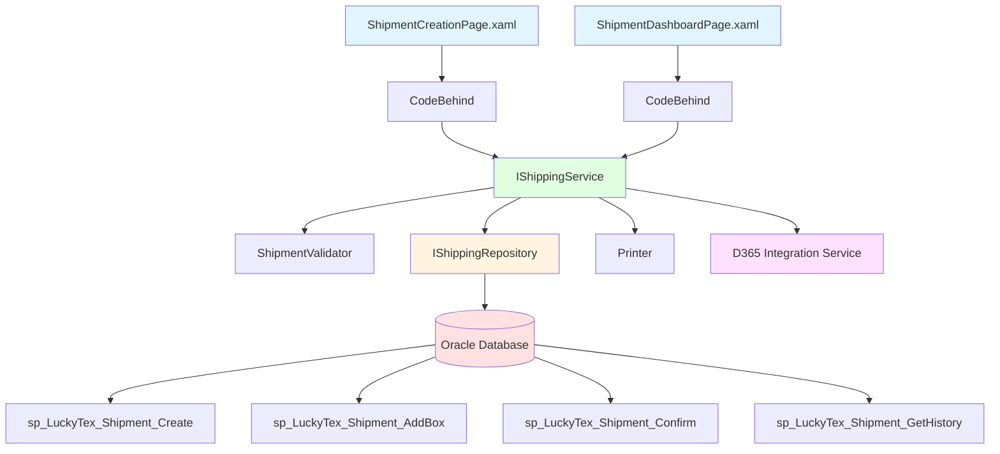
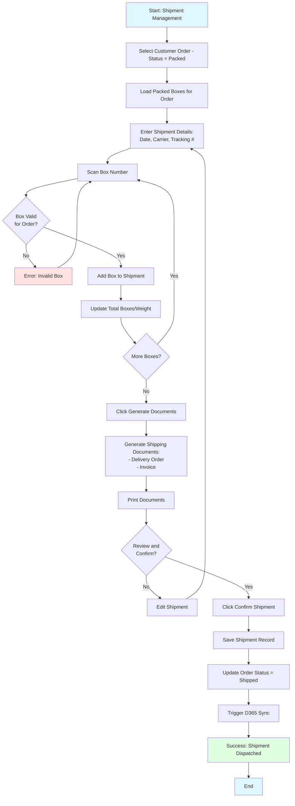
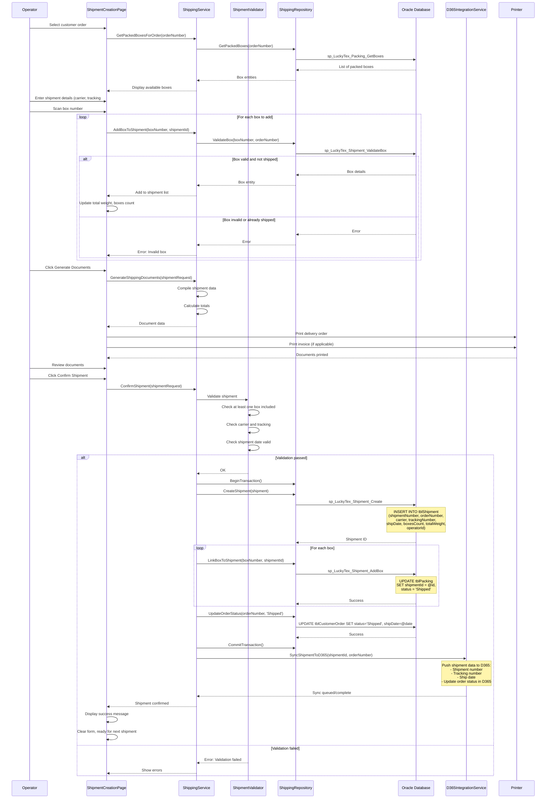

# Process: Shipment Management

**Process ID**: SH-001
**Module**: 14 - Shipping
**Priority**: P4 (Downstream Module)
**Created**: 2025-10-06

---

## 1. Process Overview

### Purpose
Manage shipment creation and delivery for packed customer orders. Consolidate packed boxes into shipments, generate shipping documents, record delivery information, and update order status to "Shipped" for D365 ERP synchronization.

### Scope
- Create shipment from packed boxes
- Scan and add boxes to shipment
- Generate shipping documents (delivery order, invoice)
- Record carrier and tracking information
- Confirm shipment dispatch
- Update order status to "Shipped"
- Trigger D365 sync for shipped orders

### Module(s) Involved
- **Primary**: M14 - Shipping
- **Upstream**: M13 - Packing (packed boxes)
- **Downstream**: M19 - D365 Integration (order sync)

---

## 2. UI Files Inventory

### XAML Files
| File Path | Description | Purpose |
|-----------|-------------|---------|
| `LuckyTex.AirBag.Pages/Pages/14 - Shipping/ShipmentCreationPage.xaml` | Shipment creation interface | Create and manage shipments |
| `LuckyTex.AirBag.Pages/Pages/14 - Shipping/ShipmentDashboardPage.xaml` | Shipment dashboard | View shipment history |
| `LuckyTex.AirBag.Pages/Pages/14 - Shipping/ShippingMenuPage.xaml` | Module menu | Navigation |

### Code-Behind Files
| File Path | Description |
|-----------|-------------|
| `LuckyTex.AirBag.Pages/Pages/14 - Shipping/ShipmentCreationPage.xaml.cs` | Shipment logic |
| `LuckyTex.AirBag.Pages/Pages/14 - Shipping/ShipmentDashboardPage.xaml.cs` | Dashboard display |

### Service Files
| File Path | Description |
|-----------|-------------|
| *(To be created)* `LuckyTex.AirBag.Core/Repositories/ShippingRepository.cs` | Repository |
| *(To be created)* `LuckyTex.AirBag.Core/Services/ShippingService.cs` | Service layer |
| *(To be created)* `LuckyTex.AirBag.Core/Validators/ShipmentValidator.cs` | FluentValidation |

---

## 3. UI Layout Description

### ShipmentCreationPage.xaml

**Screen Title**: "Shipment Creation"

**Shipment Header Section**:
- Shipment number (auto-generated or manual)
- Customer order number dropdown (filter: packed orders)
- Display customer details:
  - Customer name
  - Delivery address
  - Contact information
- Shipment date (default: today)
- Expected delivery date
- Carrier selection dropdown
- Tracking number textbox

**Boxes to Ship Section**:
- Available packed boxes for selected order (DataGrid):
  - Columns: Box Number, Weight (kg), Dimensions, Pieces Count, Pack Date
- `cmdAddBox` - Add selected box to shipment

**Shipment Contents Section**:
- Boxes in shipment (DataGrid):
  - Columns: Box Number, Weight, Dimensions, Pieces
- `cmdRemoveBox` - Remove box from shipment
- Total boxes count
- Total weight (kg)

**Action Buttons**:
- `cmdGenerateDocuments` - Generate shipping documents
- `cmdConfirmShipment` - Confirm dispatch
- `cmdPrint` - Print documents
- `cmdCancel` - Cancel shipment
- `cmdBack` - Return to dashboard

### ShipmentDashboardPage.xaml

**Screen Title**: "Shipment History"

**Summary Cards**:
- Shipments today
- Total boxes shipped
- Pending shipments
- Average delivery time

**Shipment DataGrid**:
- Columns: Shipment Number, Customer, Order Number, Boxes, Weight, Ship Date, Carrier, Status
- Row click: View details

---

## 4. Component Architecture Diagram



---

## 5. Workflow Diagram



---

## 6. Business Logic Sequence Diagram



---

## 7. Data Flow

### Input Data

| Data Element | Source | Format | Validation |
|--------------|--------|--------|------------|
| Order Number | Selection | String (20 chars) | Must exist with status = Packed |
| Shipment Number | Auto/manual | String (20 chars) | Unique |
| Box Numbers | Scan | String (20 chars) | Must belong to order, not yet shipped |
| Shipment Date | Input | DateTime | Required |
| Carrier | Dropdown | String (50 chars) | Required |
| Tracking Number | Input | String (50 chars) | Required |
| Operator ID | Login session | String (10 chars) | Valid employee |

### Output Data

| Data Element | Destination | Format | Purpose |
|--------------|-------------|--------|---------|
| Shipment Record | tblShipment | Database record | Shipment tracking |
| Box Updates | tblPacking | Status = Shipped, shipmentId | Box tracking |
| Order Status Update | tblCustomerOrder | Status = Shipped | Order completion |
| Shipping Documents | Printer | Printed documents | Delivery documentation |
| D365 Sync Message | D365 Integration queue | JSON payload | ERP synchronization |

### Data Transformations

1. **Boxes → Total Weight**: Sum of all box weights in shipment
2. **Shipment Confirmed → D365 Payload**: Map shipment data to D365 format

---

## 8. Database Operations

### Stored Procedures Used

#### sp_LuckyTex_Shipment_Create
- **Purpose**: Create shipment record
- **Parameters**: @ShipmentNumber, @OrderNumber, @Carrier, @TrackingNumber, @ShipDate, @BoxesCount, @TotalWeight, @OperatorID
- **Returns**: Shipment ID
- **Tables Written**: tblShipment

#### sp_LuckyTex_Shipment_AddBox
- **Purpose**: Link box to shipment
- **Parameters**: @BoxNumber, @ShipmentID
- **Returns**: Success flag
- **Tables Written**: tblPacking

#### sp_LuckyTex_Shipment_Confirm
- **Purpose**: Confirm shipment dispatch (wrapper)
- **Parameters**: @ShipmentID
- **Returns**: Success flag
- **Tables Written**: tblCustomerOrder

#### sp_LuckyTex_Shipment_GetHistory
- **Purpose**: Get shipment history
- **Parameters**: @DateFrom, @DateTo, @CustomerFilter
- **Returns**: List of shipments
- **Tables Read**: tblShipment, tblCustomerOrder

### Transaction Scope

#### Confirm Shipment Transaction
```sql
BEGIN TRANSACTION
  1. INSERT INTO tblShipment (sp_LuckyTex_Shipment_Create)
  FOR EACH box:
    2. UPDATE tblPacking - set shipmentId, status='Shipped' (sp_LuckyTex_Shipment_AddBox)
  3. UPDATE tblCustomerOrder - set status='Shipped', shipDate
COMMIT TRANSACTION
```

---

## 9. Implementation Checklist

### Phase 1: Repository Layer
- [ ] Create `IShippingRepository` interface
  - [ ] GetPackedBoxesForOrder(orderNumber) method
  - [ ] CreateShipment(shipment) method
  - [ ] LinkBoxToShipment(boxNumber, shipmentId) method
  - [ ] UpdateOrderStatus(orderNumber, status) method
  - [ ] GetShipmentHistory(filters) method
- [ ] Implement in `ShippingRepository`
- [ ] Unit tests

### Phase 2: Service Layer
- [ ] Create `IShippingService` interface
  - [ ] GetPackedBoxesForOrder(orderNumber) method
  - [ ] ConfirmShipment(request) method
  - [ ] GenerateShippingDocuments(shipmentId) method
  - [ ] GetShipmentHistory(filters) method
- [ ] Create `ShipmentValidator`
  - [ ] Validate at least one box
  - [ ] Validate carrier and tracking #
  - [ ] Validate shipment date
- [ ] Implement in `ShippingService`
  - [ ] D365 sync integration
- [ ] Unit tests

### Phase 3: UI Refactoring
- [ ] Update `ShipmentCreationPage.xaml.cs`
  - [ ] Inject IShippingService
  - [ ] Order selection handler
  - [ ] Box scanning handler
  - [ ] Confirm shipment handler
  - [ ] Print documents
- [ ] Update `ShipmentDashboardPage.xaml.cs`
  - [ ] Shipment history display

### Phase 4: Integration Testing
- [ ] Test shipment workflow end-to-end
- [ ] Test box validation
- [ ] Test document generation
- [ ] Test D365 sync trigger

### Phase 5: Deployment
- [ ] Code review
- [ ] Unit tests passing
- [ ] UAT
- [ ] Production deployment

---

**Document Version**: 1.0
**Last Updated**: 2025-10-06
**Status**: Ready for Implementation
**Estimated Effort**: 2 days
