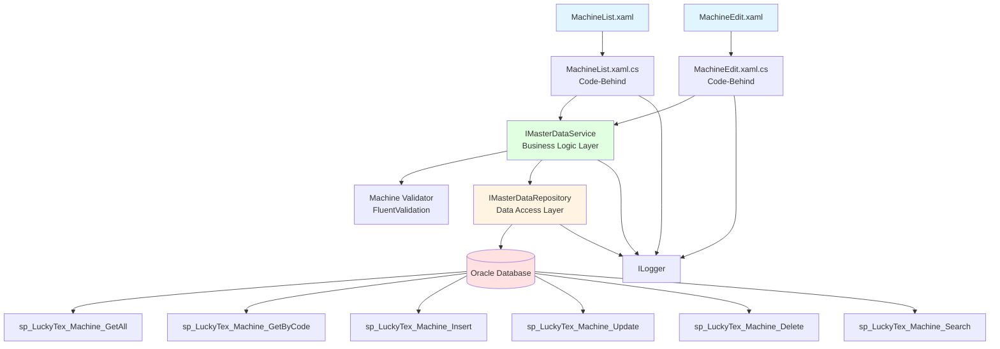
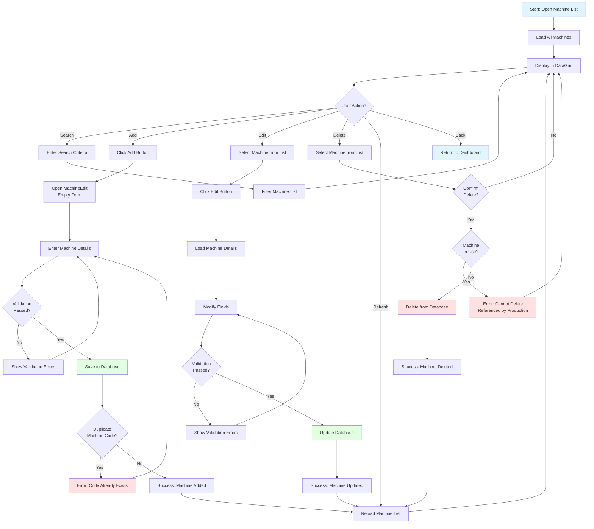

# Process: Machine Management

**Process ID**: MD-001
**Module**: 17 - Master Data
**Priority**: P1 (Foundation Module)
**Created**: 2025-10-05

---

## 1. Process Overview

### Purpose
Maintain machine master data including machine registration, specifications, maintenance schedules, and operational status for all production equipment across the manufacturing facility.

### Scope
- Create new machine records
- Update machine specifications and configurations
- Manage machine status (Active, Inactive, Under Maintenance)
- Track machine location and department assignment
- View machine history and maintenance records
- Delete obsolete machine records (with constraint checks)
- Search and filter machine list

### Module(s) Involved
- **Primary**: M17 - Master Data
- **Consumers**: All production modules (M01-M14) reference machine data

---

## 2. UI Files Inventory

### XAML Files
| File Path | Description | Purpose |
|-----------|-------------|---------|
| `LuckyTex.AirBag.Pages/Pages/17 - Master Data/MachineList.xaml` | Machine list screen | Display all machines in DataGrid with search/filter |
| `LuckyTex.AirBag.Pages/Pages/17 - Master Data/MachineEdit.xaml` | Machine add/edit form | CRUD operations for machine records |
| `LuckyTex.AirBag.Pages/Pages/17 - Master Data/MasterDataDashboard.xaml` | Master data dashboard | Navigation hub to all master data screens |

### Code-Behind Files
| File Path | Description |
|-----------|-------------|
| `LuckyTex.AirBag.Pages/Pages/17 - Master Data/MachineList.xaml.cs` | List screen logic and event handlers |
| `LuckyTex.AirBag.Pages/Pages/17 - Master Data/MachineEdit.xaml.cs` | Form validation and save logic |

### Service Files
| File Path | Description |
|-----------|-------------|
| *(Existing)* `LuckyTex.AirBag.Core/Services/DataService/MasterDataService.cs` | Current singleton service |
| *(To be created)* `LuckyTex.AirBag.Core/Repositories/IMasterDataRepository.cs` | Repository interface |
| *(To be created)* `LuckyTex.AirBag.Core/Repositories/MasterDataRepository.cs` | Repository implementation |
| *(To be created)* `LuckyTex.AirBag.Core/Services/IMasterDataService.cs` | Service interface |
| *(To be created)* `LuckyTex.AirBag.Core/Services/MasterDataService.cs` | Service implementation |

---

## 3. UI Layout Description

### MachineList.xaml

**Screen Title**: "Machine Master Data"

**Key UI Controls**:

**Search/Filter Section** (Top):
- Search textbox (`txtSearch`) - Filter by machine code or name
- Department filter dropdown
- Status filter dropdown (All, Active, Inactive, Under Maintenance)
- `cmdSearch` button
- `cmdClearFilter` button

**Data Grid Section** (Center):
- DataGrid displaying machine list
- Columns:
  - Machine Code (primary key)
  - Machine Name
  - Department
  - Location
  - Machine Type
  - Status (with color indicator)
  - Last Maintenance Date
- Row selection enabled
- Sort by column headers

**Action Buttons** (Bottom):
- `cmdAdd` - Open MachineEdit in Add mode
- `cmdEdit` - Open MachineEdit with selected machine
- `cmdDelete` - Delete selected machine (with confirmation)
- `cmdRefresh` - Reload machine list
- `cmdExport` - Export to Excel
- `cmdBack` - Return to dashboard

**Data Binding Points**:
- DataGrid.ItemsSource → ObservableCollection<Machine>
- Search/filter → Filtered collection
- Status indicator → Value converter for color

---

### MachineEdit.xaml

**Screen Title**: "Machine Details" (Add/Edit mode indicator)

**Key UI Controls**:

**Machine Information Section**:
- Machine Code (`txtMachineCode`) - Required, unique, disabled in edit mode
- Machine Name (`txtMachineName`) - Required
- Machine Type dropdown (`cmbMachineType`) - Warping, Weaving, Finishing, etc.
- Department dropdown (`cmbDepartment`) - Required
- Location textbox (`txtLocation`) - Required

**Specifications Section**:
- Manufacturer (`txtManufacturer`)
- Model (`txtModel`)
- Serial Number (`txtSerialNumber`)
- Installation Date (`dtpInstallDate`) - DatePicker
- Capacity/Speed (`txtCapacity`) - Numeric input

**Status Section**:
- Status dropdown (`cmbStatus`) - Active, Inactive, Under Maintenance
- Status change reason (`txtStatusReason`) - Visible if status changed
- Last Maintenance Date (`dtpLastMaintenance`) - DatePicker, read-only
- Next Maintenance Date (`dtpNextMaintenance`) - DatePicker

**Remarks Section**:
- Remarks textbox (`txtRemarks`) - Multiline, optional

**Action Buttons**:
- `cmdSave` - Validate and save machine record
- `cmdCancel` - Close without saving

---

## 4. Component Architecture Diagram

---

## 5. Workflow Diagram

---

## 6. Business Logic Sequence Diagram

```mermaid
sequenceDiagram
    participant User
    participant ListUI as MachineList
    participant EditUI as MachineEdit
    participant BL as MasterDataService
    participant VAL as MachineValidator
    participant REPO as MasterDataRepository
    participant DB as Oracle Database

    User->>ListUI: Open Machine List page
    ListUI->>BL: GetAllMachines()
    BL->>REPO: GetAllMachines()
    REPO->>DB: sp_LuckyTex_Machine_GetAll
    DB-->>REPO: Machine records
    REPO-->>BL: List<Machine>
    BL-->>ListUI: Machine data
    ListUI->>ListUI: Bind to DataGrid

    alt Add New Machine
        User->>ListUI: Click Add button
        ListUI->>EditUI: Navigate to MachineEdit (Add mode)
        EditUI->>EditUI: Clear all fields, enable MachineCode

        User->>EditUI: Enter machine details
        User->>EditUI: Click Save

        EditUI->>BL: InsertMachine(machine)
        BL->>VAL: Validate(machine)
        VAL->>VAL: Check MachineCode not empty
        VAL->>VAL: Check MachineName not empty
        VAL->>VAL: Check Department selected
        VAL->>VAL: Check MachineCode format (alphanumeric)

        alt Validation passed
            VAL-->>BL: Validation OK
            BL->>REPO: InsertMachine(machine)
            REPO->>DB: sp_LuckyTex_Machine_Insert

            alt Insert successful
                DB-->>REPO: Machine inserted
                REPO-->>BL: Success
                BL-->>EditUI: Success result
                EditUI->>EditUI: Show success message
                EditUI->>ListUI: Navigate back to list
                ListUI->>BL: GetAllMachines() (refresh)
                BL->>REPO: GetAllMachines()
                REPO->>DB: sp_LuckyTex_Machine_GetAll
                DB-->>REPO: Updated list
                REPO-->>BL: List<Machine>
                BL-->>ListUI: Refreshed data
                ListUI->>ListUI: Refresh DataGrid
            else Duplicate machine code
                DB-->>REPO: Error: Unique constraint violation
                REPO-->>BL: Error: Duplicate code
                BL-->>EditUI: Error message
                EditUI->>EditUI: Highlight MachineCode field
                EditUI->>EditUI: Show error: Code already exists
            end
        else Validation failed
            VAL-->>BL: Validation errors
            BL-->>EditUI: Validation error list
            EditUI->>EditUI: Highlight invalid fields
            EditUI->>EditUI: Display validation messages
        end

    else Edit Existing Machine
        User->>ListUI: Select machine row
        User->>ListUI: Click Edit button
        ListUI->>BL: GetMachineByCode(machineCode)
        BL->>REPO: GetMachineByCode(machineCode)
        REPO->>DB: sp_LuckyTex_Machine_GetByCode
        DB-->>REPO: Machine details
        REPO-->>BL: Machine entity
        BL-->>ListUI: Machine data
        ListUI->>EditUI: Navigate to MachineEdit (Edit mode, machine data)
        EditUI->>EditUI: Populate fields, disable MachineCode

        User->>EditUI: Modify fields
        User->>EditUI: Click Save

        EditUI->>BL: UpdateMachine(machine)
        BL->>VAL: Validate(machine)

        alt Validation passed
            VAL-->>BL: OK
            BL->>REPO: UpdateMachine(machine)
            REPO->>DB: sp_LuckyTex_Machine_Update
            DB-->>REPO: Rows affected = 1
            REPO-->>BL: Success
            BL-->>EditUI: Success result
            EditUI->>EditUI: Show success message
            EditUI->>ListUI: Navigate back
            ListUI->>BL: GetAllMachines() (refresh)
            BL->>REPO: GetAllMachines()
            REPO->>DB: sp_LuckyTex_Machine_GetAll
            DB-->>REPO: Updated list
            REPO-->>BL: List<Machine>
            BL-->>ListUI: Data
            ListUI->>ListUI: Refresh DataGrid
        else Validation failed
            VAL-->>BL: Errors
            BL-->>EditUI: Error list
            EditUI->>EditUI: Display errors
        end

    else Delete Machine
        User->>ListUI: Select machine row
        User->>ListUI: Click Delete button
        ListUI->>ListUI: Show confirmation dialog:<br/>"Delete machine [Code]?"

        alt User confirms
            User->>ListUI: Click Yes
            ListUI->>BL: DeleteMachine(machineCode)
            BL->>REPO: DeleteMachine(machineCode)
            REPO->>DB: sp_LuckyTex_Machine_Delete

            alt Delete successful
                DB-->>REPO: Rows affected = 1
                REPO-->>BL: Success
                BL-->>ListUI: Success result
                ListUI->>ListUI: Show success message
                ListUI->>BL: GetAllMachines() (refresh)
                BL->>REPO: GetAllMachines()
                REPO->>DB: sp_LuckyTex_Machine_GetAll
                DB-->>REPO: Updated list
                REPO-->>BL: List<Machine>
                BL-->>ListUI: Data
                ListUI->>ListUI: Refresh DataGrid
            else Foreign key constraint
                DB-->>REPO: Error: FK constraint violation
                REPO-->>BL: Error: Machine in use
                BL-->>ListUI: Error message
                ListUI->>ListUI: Show error:<br/>"Cannot delete - machine is referenced by production records"
            end
        else User cancels
            User->>ListUI: Click No
            ListUI->>ListUI: Close dialog, no action
        end

    else Search/Filter
        User->>ListUI: Enter search text or select filters
        User->>ListUI: Click Search
        ListUI->>BL: SearchMachines(criteria)
        BL->>REPO: SearchMachines(criteria)
        REPO->>DB: sp_LuckyTex_Machine_Search
        DB-->>REPO: Filtered results
        REPO-->>BL: List<Machine>
        BL-->>ListUI: Filtered data
        ListUI->>ListUI: Refresh DataGrid with filtered data
    end
```

---

## 7. Data Flow

### Input Data
| Data Element | Source | Format | Validation |
|--------------|--------|--------|------------|
| Machine Code | User input | String, 10 chars max | Required, unique, alphanumeric |
| Machine Name | User input | String, 100 chars | Required |
| Machine Type | Dropdown | String | Required, from predefined list |
| Department | Dropdown | String | Required, from tblDepartment |
| Location | User input | String, 50 chars | Required |
| Manufacturer | User input | String, 100 chars | Optional |
| Model | User input | String, 50 chars | Optional |
| Serial Number | User input | String, 50 chars | Optional |
| Installation Date | DatePicker | DateTime | Optional |
| Capacity/Speed | User input | Decimal | Optional, must be > 0 if provided |
| Status | Dropdown | String | Required (Active/Inactive/Under Maintenance) |
| Remarks | User input | String, 500 chars | Optional |

### Output Data
| Data Element | Destination | Format | Purpose |
|--------------|-------------|--------|---------|
| Machine Record | tblMachine | Database row | Master data storage |
| Success/Error Message | UI | String | User feedback |
| Machine List | DataGrid | Collection | Display all machines |
| Filtered List | DataGrid | Collection | Search results |

### Data Transformations
1. **Machine Code**: Uppercase transformation on input
2. **Status**: Enum to string for database storage
3. **Dates**: UI DateTime to database DATE format
4. **Validation Results**: FluentValidation ValidationResult to UI error messages

---

## 8. Database Operations

### Stored Procedures Used

#### sp_LuckyTex_Machine_GetAll
- **Purpose**: Retrieve all machine records
- **Parameters**: None
- **Returns**: All columns from tblMachine
- **Tables Read**: tblMachine, tblDepartment (join)

#### sp_LuckyTex_Machine_GetByCode
- **Purpose**: Retrieve single machine by code
- **Parameters**: @MachineCode VARCHAR(10)
- **Returns**: Machine details
- **Tables Read**: tblMachine

#### sp_LuckyTex_Machine_Insert
- **Purpose**: Insert new machine record
- **Parameters**:
  - @MachineCode VARCHAR(10)
  - @MachineName VARCHAR(100)
  - @MachineType VARCHAR(50)
  - @Department VARCHAR(50)
  - @Location VARCHAR(50)
  - @Manufacturer VARCHAR(100)
  - @Model VARCHAR(50)
  - @SerialNumber VARCHAR(50)
  - @InstallationDate DATETIME
  - @Capacity DECIMAL(10,2)
  - @Status VARCHAR(20)
  - @Remarks VARCHAR(500)
  - @CreatedBy VARCHAR(10)
  - @CreatedDate DATETIME
- **Returns**: Success flag
- **Tables Written**: tblMachine

#### sp_LuckyTex_Machine_Update
- **Purpose**: Update existing machine record
- **Parameters**: Same as Insert (except @MachineCode is WHERE condition)
- **Returns**: Rows affected
- **Tables Written**: tblMachine

#### sp_LuckyTex_Machine_Delete
- **Purpose**: Delete machine record
- **Parameters**: @MachineCode VARCHAR(10)
- **Returns**: Rows affected
- **Tables Written**: tblMachine
- **Constraints**: FK checks from production tables

#### sp_LuckyTex_Machine_Search
- **Purpose**: Search/filter machines
- **Parameters**:
  - @SearchText VARCHAR(100) (optional)
  - @Department VARCHAR(50) (optional)
  - @Status VARCHAR(20) (optional)
- **Returns**: Filtered machine list
- **Tables Read**: tblMachine, tblDepartment

### Table Structure

**tblMachine**:
- PK: MachineCode VARCHAR(10)
- MachineName VARCHAR(100) NOT NULL
- MachineType VARCHAR(50) NOT NULL
- Department VARCHAR(50) NOT NULL (FK to tblDepartment)
- Location VARCHAR(50) NOT NULL
- Manufacturer VARCHAR(100)
- Model VARCHAR(50)
- SerialNumber VARCHAR(50)
- InstallationDate DATETIME
- Capacity DECIMAL(10,2)
- Status VARCHAR(20) NOT NULL
- LastMaintenanceDate DATETIME
- NextMaintenanceDate DATETIME
- Remarks VARCHAR(500)
- CreatedBy VARCHAR(10)
- CreatedDate DATETIME
- ModifiedBy VARCHAR(10)
- ModifiedDate DATETIME

---

## 9. Implementation Checklist

### Phase 1: Repository Layer
- [ ] Create `Machine` entity model
  - [ ] Properties matching tblMachine columns
  - [ ] Data annotations for validation
  - [ ] ToString() override for debugging
- [ ] Extend `IMasterDataRepository` interface
  - [ ] GetAllMachines() method
  - [ ] GetMachineByCode(string code) method
  - [ ] InsertMachine(Machine machine) method
  - [ ] UpdateMachine(Machine machine) method
  - [ ] DeleteMachine(string code) method
  - [ ] SearchMachines(MachineSearchCriteria criteria) method
- [ ] Implement in `MasterDataRepository`
  - [ ] Map all stored procedures
  - [ ] OracleDataReader to Machine entity mapping
  - [ ] Error handling and logging
- [ ] Unit tests for repository
  - [ ] Test GetAllMachines returns collection
  - [ ] Test GetMachineByCode with valid/invalid code
  - [ ] Test InsertMachine success
  - [ ] Test InsertMachine duplicate code error
  - [ ] Test UpdateMachine success
  - [ ] Test DeleteMachine with FK constraint
  - [ ] Test SearchMachines with various filters

### Phase 2: Service Layer
- [ ] Extend `IMasterDataService` interface
  - [ ] GetAllMachines() method returning ServiceResult<List<Machine>>
  - [ ] GetMachineByCode(string code) method
  - [ ] InsertMachine(Machine machine) method
  - [ ] UpdateMachine(Machine machine) method
  - [ ] DeleteMachine(string code) method
  - [ ] SearchMachines(MachineSearchCriteria criteria) method
- [ ] Create `MachineValidator` using FluentValidation
  - [ ] MachineCode: Required, max 10 chars, alphanumeric
  - [ ] MachineName: Required, max 100 chars
  - [ ] MachineType: Required, from valid list
  - [ ] Department: Required, exists in tblDepartment
  - [ ] Status: Required, valid enum value
  - [ ] Capacity: If provided, must be > 0
- [ ] Implement in `MasterDataService`
  - [ ] Constructor with IMasterDataRepository, IValidator<Machine>, ILogger
  - [ ] All methods with try-catch and ServiceResult wrapping
  - [ ] Validation before Insert/Update
  - [ ] Business rule: Cannot change status to "Under Maintenance" without reason
- [ ] Unit tests for service
  - [ ] Test validation errors are returned
  - [ ] Test successful Insert/Update/Delete
  - [ ] Test duplicate code handling
  - [ ] Test FK constraint error handling
  - [ ] Test search with empty results

### Phase 3: UI Refactoring
- [ ] Update `MachineList.xaml.cs`
  - [ ] Remove DataService.Instance calls
  - [ ] Inject IMasterDataService via constructor or property
  - [ ] Update Page_Loaded to call GetAllMachines
  - [ ] Update cmdSearch_Click to call SearchMachines
  - [ ] Update cmdEdit_Click to navigate with selected machine
  - [ ] Update cmdDelete_Click to call DeleteMachine with confirmation
  - [ ] Handle ServiceResult (check IsSuccess, display errors)
  - [ ] Add loading indicator during async operations
- [ ] Update `MachineEdit.xaml.cs`
  - [ ] Inject IMasterDataService
  - [ ] Support two modes: Add (machineCode = null) vs Edit (machineCode provided)
  - [ ] Disable MachineCode textbox in Edit mode
  - [ ] Update cmdSave_Click to call Insert or Update
  - [ ] Display validation errors from ServiceResult
  - [ ] Navigate back to list on success
- [ ] XAML data binding
  - [ ] Bind DataGrid to ObservableCollection<Machine>
  - [ ] Bind dropdowns to reference data
  - [ ] Value converter for Status color indicator
- [ ] User-friendly error messages
  - [ ] Map technical errors to user messages
  - [ ] Highlight invalid fields

### Phase 4: Integration Testing
- [ ] Test with real Oracle database
  - [ ] Add new machine (success)
  - [ ] Add duplicate machine code (error)
  - [ ] Edit existing machine (success)
  - [ ] Delete machine not in use (success)
  - [ ] Delete machine referenced by production (error)
  - [ ] Search by machine code
  - [ ] Search by department
  - [ ] Filter by status
- [ ] UI testing
  - [ ] Page navigation (list → edit → list)
  - [ ] DataGrid refresh after CRUD operations
  - [ ] Validation error display
  - [ ] Confirmation dialogs
- [ ] Performance testing
  - [ ] Load 1000+ machines (acceptable grid performance)
  - [ ] Search response time < 500ms

### Phase 5: Deployment Preparation
- [ ] Code review completed
- [ ] Unit tests passing (80%+ coverage)
- [ ] Integration tests passing
- [ ] Documentation updated
- [ ] UAT completed
- [ ] Production deployment checklist ready

---

**Document Version**: 1.0
**Last Updated**: 2025-10-05
**Status**: Ready for Implementation
**Estimated Effort**: 3 days (1 developer)
**Dependencies**: Department master data must exist
