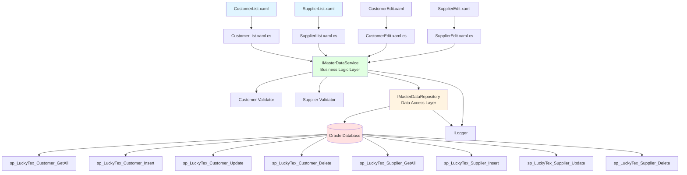
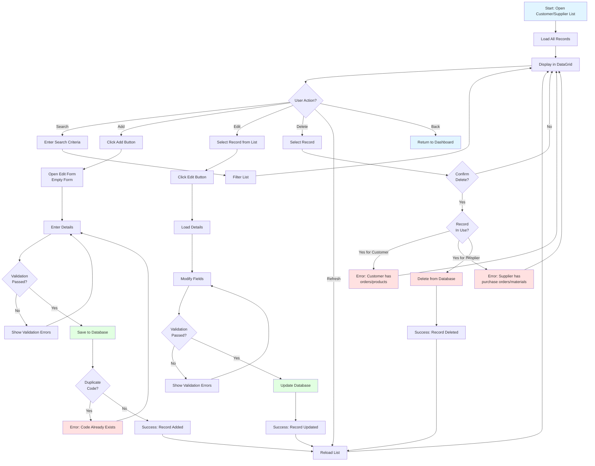

# Process: Customer & Supplier Management

**Process ID**: MD-005
**Module**: 17 - Master Data
**Priority**: P1 (Foundation Module)
**Created**: 2025-10-05

---

## 1. Process Overview

### Purpose
Maintain customer and supplier master data including contact information, payment terms, credit limits, and business relationship details for all trading partners.

### Scope
- Create new customer/supplier records
- Update contact information and addresses
- Manage payment terms and credit limits
- Track business relationship status (Active, Inactive, Suspended)
- View transaction history and performance metrics
- Delete obsolete records
- Search and filter customer/supplier lists
- Manage multiple contacts per customer/supplier

### Module(s) Involved
- **Primary**: M17 - Master Data
- **Consumers**:
  - M01 - Warehouse (supplier data for yarn receiving)
  - M13 - Packing (customer data for shipping)
  - M14 - Shipping (customer data)
  - M19 - D365 Integration (sync with ERP)

---

## 2. UI Files Inventory

### XAML Files
| File Path | Description | Purpose |
|-----------|-------------|---------|
| `LuckyTex.AirBag.Pages/Pages/17 - Master Data/CustomerList.xaml` | Customer list screen | Display all customers |
| `LuckyTex.AirBag.Pages/Pages/17 - Master Data/SupplierList.xaml` | Supplier list screen | Display all suppliers |
| `LuckyTex.AirBag.Pages/Pages/17 - Master Data/CustomerEdit.xaml` | Customer add/edit form (shared or separate) | CRUD for customers |
| `LuckyTex.AirBag.Pages/Pages/17 - Master Data/SupplierEdit.xaml` | Supplier add/edit form (shared or separate) | CRUD for suppliers |
| `LuckyTex.AirBag.Pages/Pages/17 - Master Data/MasterDataDashboard.xaml` | Master data dashboard | Navigation hub |

**Note**: Customer and Supplier screens may share common UI structure since they have similar data fields.

### Code-Behind Files
| File Path | Description |
|-----------|-------------|
| `LuckyTex.AirBag.Pages/Pages/17 - Master Data/CustomerList.xaml.cs` | Customer list logic |
| `LuckyTex.AirBag.Pages/Pages/17 - Master Data/SupplierList.xaml.cs` | Supplier list logic |
| `LuckyTex.AirBag.Pages/Pages/17 - Master Data/CustomerEdit.xaml.cs` | Customer form logic |
| `LuckyTex.AirBag.Pages/Pages/17 - Master Data/SupplierEdit.xaml.cs` | Supplier form logic |

### Service Files
| File Path | Description |
|-----------|-------------|
| *(To be created)* `LuckyTex.AirBag.Core/Repositories/IMasterDataRepository.cs` | Repository interface |
| *(To be created)* `LuckyTex.AirBag.Core/Repositories/MasterDataRepository.cs` | Repository implementation |
| *(To be created)* `LuckyTex.AirBag.Core/Services/IMasterDataService.cs` | Service interface |
| *(To be created)* `LuckyTex.AirBag.Core/Services/MasterDataService.cs` | Service implementation |

---

## 3. UI Layout Description

### CustomerList.xaml / SupplierList.xaml

**Screen Title**: "Customer Master Data" / "Supplier Master Data"

**Key UI Controls** (Similar structure for both):

**Search/Filter Section** (Top):
- Search textbox (`txtSearch`) - Filter by code or name
- Country filter dropdown
- Status filter dropdown (All, Active, Inactive, Suspended)
- `cmdSearch` button
- `cmdClearFilter` button

**Data Grid Section** (Center):
- DataGrid displaying customer/supplier list
- Columns:
  - Code (primary key)
  - Name
  - Country
  - Contact Person
  - Phone
  - Email
  - Payment Terms
  - Credit Limit (customers only)
  - Status (with color indicator)
- Row selection enabled

**Action Buttons** (Bottom):
- `cmdAdd` - Open edit form in Add mode
- `cmdEdit` - Open edit form with selected record
- `cmdDelete` - Delete selected record (with confirmation)
- `cmdRefresh` - Reload list
- `cmdExport` - Export to Excel
- `cmdBack` - Return to dashboard

---

### CustomerEdit.xaml / SupplierEdit.xaml

**Screen Title**: "Customer Details" / "Supplier Details"

**Key UI Controls**:

**Basic Information Section**:
- Code (`txtCode`) - Required, unique, disabled in edit mode, max 20 chars
- Name (`txtName`) - Required, max 100 chars
- Short Name (`txtShortName`) - Max 50 chars
- Tax ID / VAT Number (`txtTaxID`) - Max 30 chars
- Status dropdown (`cmbStatus`) - Active, Inactive, Suspended

**Address Section**:
- Address Line 1 (`txtAddress1`) - Max 100 chars
- Address Line 2 (`txtAddress2`) - Max 100 chars
- City (`txtCity`) - Max 50 chars
- State/Province (`txtState`) - Max 50 chars
- Postal Code (`txtPostalCode`) - Max 10 chars
- Country dropdown (`cmbCountry`) - Required

**Contact Information Section**:
- Primary Contact Person (`txtContactPerson`) - Max 100 chars
- Phone (`txtPhone`) - Max 20 chars, phone format
- Fax (`txtFax`) - Max 20 chars
- Email (`txtEmail`) - Max 100 chars, email format
- Website (`txtWebsite`) - Max 100 chars, URL format
- Additional Contacts button → Opens sub-form to manage multiple contacts

**Business Terms Section** (Customer specific):
- Payment Terms dropdown (`cmbPaymentTerms`) - Net 30, Net 60, COD, etc.
- Credit Limit (`txtCreditLimit`) - Numeric, decimal
- Currency (`cmbCurrency`) - USD, EUR, THB, etc.
- Customer Category (`cmbCategory`) - VIP, Standard, New, etc.

**Business Terms Section** (Supplier specific):
- Payment Terms dropdown (`cmbPaymentTerms`)
- Lead Time (days) (`txtLeadTime`) - Integer
- Supplier Category (`cmbCategory`) - Preferred, Approved, Trial, etc.
- Certifications (`txtCertifications`) - Multiline

**Banking Information Section**:
- Bank Name (`txtBankName`) - Max 100 chars
- Bank Account Number (`txtAccountNumber`) - Max 50 chars
- Bank Branch (`txtBankBranch`) - Max 100 chars
- SWIFT Code (`txtSwiftCode`) - Max 20 chars

**Remarks Section**:
- Remarks textbox (`txtRemarks`) - Multiline, optional

**Action Buttons**:
- `cmdSave` - Validate and save record
- `cmdCancel` - Close without saving

---

## 4. Component Architecture Diagram

---

## 5. Workflow Diagram

---

## 6. Business Logic Sequence Diagram

```mermaid
sequenceDiagram
    participant User
    participant ListUI as Customer/Supplier List
    participant EditUI as Customer/Supplier Edit
    participant BL as MasterDataService
    participant VAL as Validator
    participant REPO as MasterDataRepository
    participant DB as Oracle Database

    User->>ListUI: Open list page
    ListUI->>BL: GetAllCustomers() or GetAllSuppliers()
    BL->>REPO: GetAll...()
    REPO->>DB: sp_LuckyTex_Customer/Supplier_GetAll
    DB-->>REPO: Records
    REPO-->>BL: List<Customer/Supplier>
    BL-->>ListUI: Data
    ListUI->>ListUI: Bind to DataGrid

    alt Add New Record
        User->>ListUI: Click Add button
        ListUI->>EditUI: Navigate to Edit form (Add mode)
        EditUI->>EditUI: Clear all fields

        User->>EditUI: Enter code, name, address
        User->>EditUI: Enter contact information
        User->>EditUI: Enter business terms
        User->>EditUI: Enter banking information (optional)
        User->>EditUI: Click Save

        EditUI->>BL: InsertCustomer(customer) or InsertSupplier(supplier)
        BL->>VAL: Validate(entity)
        VAL->>VAL: Check Code not empty, unique format
        VAL->>VAL: Check Name not empty
        VAL->>VAL: Check Email format (if provided)
        VAL->>VAL: Check Phone format (if provided)
        VAL->>VAL: Check Country selected
        VAL->>VAL: For Customer: Check CreditLimit >= 0

        alt Validation passed
            VAL-->>BL: Validation OK
            BL->>REPO: Insert...(entity)
            REPO->>DB: sp_LuckyTex_Customer/Supplier_Insert

            alt Insert successful
                DB-->>REPO: Record inserted
                REPO-->>BL: Success
                BL-->>EditUI: Success result
                EditUI->>EditUI: Show success message
                EditUI->>ListUI: Navigate back to list
                ListUI->>BL: GetAll...() (refresh)
                BL->>REPO: GetAll...()
                REPO->>DB: sp_LuckyTex_..._GetAll
                DB-->>REPO: Updated list
                REPO-->>BL: List<>
                BL-->>ListUI: Refreshed data
                ListUI->>ListUI: Refresh DataGrid
            else Duplicate code
                DB-->>REPO: Error: Unique constraint violation
                REPO-->>BL: Error: Duplicate code
                BL-->>EditUI: Error message
                EditUI->>EditUI: Highlight Code field
            end
        else Validation failed
            VAL-->>BL: Validation errors
            BL-->>EditUI: Validation error list
            EditUI->>EditUI: Highlight invalid fields
            EditUI->>EditUI: Display validation messages
        end

    else Edit Existing Record
        User->>ListUI: Select row
        User->>ListUI: Click Edit button
        ListUI->>BL: GetCustomerByCode(code) or GetSupplierByCode(code)
        BL->>REPO: Get...ByCode(code)
        REPO->>DB: sp_LuckyTex_Customer/Supplier_GetByCode
        DB-->>REPO: Record details
        REPO-->>BL: Entity
        BL-->>ListUI: Data
        ListUI->>EditUI: Navigate to Edit form (Edit mode, data)
        EditUI->>EditUI: Populate all fields, disable Code

        User->>EditUI: Modify fields
        User->>EditUI: Click Save

        EditUI->>BL: UpdateCustomer(customer) or UpdateSupplier(supplier)
        BL->>VAL: Validate(entity)

        alt Validation passed
            VAL-->>BL: OK
            BL->>REPO: Update...(entity)
            REPO->>DB: sp_LuckyTex_Customer/Supplier_Update
            DB-->>REPO: Rows affected = 1
            REPO-->>BL: Success
            BL-->>EditUI: Success result
            EditUI->>EditUI: Show success message
            EditUI->>ListUI: Navigate back
            ListUI->>BL: GetAll...() (refresh)
            BL->>REPO: GetAll...()
            REPO->>DB: sp_LuckyTex_..._GetAll
            DB-->>REPO: Updated list
            REPO-->>BL: List<>
            BL-->>ListUI: Data
            ListUI->>ListUI: Refresh DataGrid
        else Validation failed
            VAL-->>BL: Errors
            BL-->>EditUI: Error list
            EditUI->>EditUI: Display errors
        end

    else Delete Record
        User->>ListUI: Select row
        User->>ListUI: Click Delete button
        ListUI->>ListUI: Show confirmation dialog:<br/>"Delete [Code]?"

        alt User confirms
            User->>ListUI: Click Yes
            ListUI->>BL: DeleteCustomer(code) or DeleteSupplier(code)
            BL->>REPO: Delete...(code)
            REPO->>DB: sp_LuckyTex_Customer/Supplier_Delete

            alt Delete successful
                DB-->>REPO: Rows affected = 1
                REPO-->>BL: Success
                BL-->>ListUI: Success result
                ListUI->>ListUI: Show success message
                ListUI->>BL: GetAll...() (refresh)
                BL->>REPO: GetAll...()
                REPO->>DB: sp_LuckyTex_..._GetAll
                DB-->>REPO: Updated list
                REPO-->>BL: List<>
                BL-->>ListUI: Data
                ListUI->>ListUI: Refresh DataGrid
            else Foreign key constraint
                DB-->>REPO: Error: FK constraint violation
                REPO-->>BL: Error: Record in use
                BL-->>ListUI: Error message
                ListUI->>ListUI: Show error:<br/>"Cannot delete - referenced by transactions"
            end
        else User cancels
            User->>ListUI: Click No
            ListUI->>ListUI: Close dialog, no action
        end

    else Search/Filter
        User->>ListUI: Enter search text or select filters
        User->>ListUI: Click Search
        ListUI->>BL: SearchCustomers(criteria) or SearchSuppliers(criteria)
        BL->>REPO: Search...(criteria)
        REPO->>DB: sp_LuckyTex_Customer/Supplier_Search
        DB-->>REPO: Filtered results
        REPO-->>BL: List<>
        BL-->>ListUI: Filtered data
        ListUI->>ListUI: Refresh DataGrid with filtered data
    end
```

---

## 7. Data Flow

### Input Data
| Data Element | Source | Format | Validation |
|--------------|--------|--------|------------|
| Code | User input | String, 20 chars max | Required, unique, alphanumeric |
| Name | User input | String, 100 chars | Required |
| Tax ID | User input | String, 30 chars | Optional |
| Address | User input | String, 100 chars × 2 | Optional |
| City, State | User input | String, 50 chars | Optional |
| Postal Code | User input | String, 10 chars | Optional |
| Country | Dropdown | String | Required |
| Contact Person | User input | String, 100 chars | Optional |
| Phone | User input | String, 20 chars | Optional, phone format |
| Email | User input | String, 100 chars | Optional, email format |
| Website | User input | String, 100 chars | Optional, URL format |
| Payment Terms | Dropdown | String | Required |
| Credit Limit (Customer) | User input | Decimal | Optional, >= 0 |
| Lead Time (Supplier) | User input | Integer | Optional, > 0 |
| Currency | Dropdown | String | Required |
| Status | Dropdown | String | Required |
| Banking Information | User input | Strings | Optional |
| Remarks | User input | String, 500 chars | Optional |

### Output Data
| Data Element | Destination | Format | Purpose |
|--------------|-------------|--------|---------|
| Customer/Supplier Record | tblCustomer/tblSupplier | Database row | Master data storage |
| Success/Error Message | UI | String | User feedback |
| List | DataGrid | Collection | Display all records |

### Data Transformations
1. **Code**: Uppercase transformation
2. **Email**: Lowercase transformation
3. **Phone**: Format standardization (remove spaces/dashes)
4. **Status**: Enum to string
5. **Credit Limit**: Round to 2 decimal places

---

## 8. Database Operations

### Stored Procedures Used

#### Customer Procedures
- **sp_LuckyTex_Customer_GetAll**: Retrieve all customer records
- **sp_LuckyTex_Customer_GetByCode**: Retrieve single customer
- **sp_LuckyTex_Customer_Insert**: Insert new customer
- **sp_LuckyTex_Customer_Update**: Update customer
- **sp_LuckyTex_Customer_Delete**: Delete customer
- **sp_LuckyTex_Customer_Search**: Search/filter customers

#### Supplier Procedures
- **sp_LuckyTex_Supplier_GetAll**: Retrieve all supplier records
- **sp_LuckyTex_Supplier_GetByCode**: Retrieve single supplier
- **sp_LuckyTex_Supplier_Insert**: Insert new supplier
- **sp_LuckyTex_Supplier_Update**: Update supplier
- **sp_LuckyTex_Supplier_Delete**: Delete supplier
- **sp_LuckyTex_Supplier_Search**: Search/filter suppliers

### Table Structure

**tblCustomer**:
- PK: CustomerCode VARCHAR(20)
- CustomerName VARCHAR(100) NOT NULL
- ShortName VARCHAR(50)
- TaxID VARCHAR(30)
- Address1 VARCHAR(100)
- Address2 VARCHAR(100)
- City VARCHAR(50)
- State VARCHAR(50)
- PostalCode VARCHAR(10)
- Country VARCHAR(50) NOT NULL
- ContactPerson VARCHAR(100)
- Phone VARCHAR(20)
- Fax VARCHAR(20)
- Email VARCHAR(100)
- Website VARCHAR(100)
- PaymentTerms VARCHAR(20) NOT NULL
- CreditLimit DECIMAL(15,2)
- Currency VARCHAR(10) NOT NULL
- CustomerCategory VARCHAR(20)
- BankName VARCHAR(100)
- BankAccount VARCHAR(50)
- BankBranch VARCHAR(100)
- SwiftCode VARCHAR(20)
- Status VARCHAR(20) NOT NULL
- Remarks VARCHAR(500)
- CreatedBy VARCHAR(10)
- CreatedDate DATETIME
- ModifiedBy VARCHAR(10)
- ModifiedDate DATETIME

**tblSupplier**: (Similar structure to tblCustomer with supplier-specific fields)
- PK: SupplierCode VARCHAR(20)
- (... similar fields ...)
- LeadTimeDays INT
- SupplierCategory VARCHAR(20)
- Certifications VARCHAR(500)
- (... other fields ...)

---

## 9. Implementation Checklist

### Phase 1: Repository Layer
- [ ] Create `Customer` entity model
- [ ] Create `Supplier` entity model
- [ ] Extend `IMasterDataRepository` interface
  - [ ] Customer CRUD methods
  - [ ] Supplier CRUD methods
  - [ ] Search methods for both
- [ ] Implement in `MasterDataRepository`
  - [ ] Map all stored procedures (12 procedures)
  - [ ] OracleDataReader to entity mapping
- [ ] Unit tests for repository

### Phase 2: Service Layer
- [ ] Extend `IMasterDataService` interface
  - [ ] Customer CRUD methods
  - [ ] Supplier CRUD methods
- [ ] Create `CustomerValidator` using FluentValidation
  - [ ] Code: Required, unique, max 20 chars
  - [ ] Name: Required, max 100 chars
  - [ ] Country: Required
  - [ ] Email: Optional, valid email format
  - [ ] Phone: Optional, phone format
  - [ ] CreditLimit: If provided, >= 0
- [ ] Create `SupplierValidator` (similar to CustomerValidator)
  - [ ] LeadTime: If provided, > 0
- [ ] Implement in `MasterDataService`
  - [ ] Constructor with IMasterDataRepository, validators, ILogger
  - [ ] Validation before Insert/Update
- [ ] Unit tests for service

### Phase 3: UI Refactoring
- [ ] Update `CustomerList.xaml.cs`
  - [ ] Inject IMasterDataService
  - [ ] Update Page_Loaded to call GetAllCustomers
  - [ ] Handle ServiceResult
- [ ] Update `SupplierList.xaml.cs` (similar to CustomerList)
- [ ] Update `CustomerEdit.xaml.cs`
  - [ ] Inject IMasterDataService
  - [ ] Support Add vs Edit modes
  - [ ] Disable Code in Edit mode
  - [ ] Populate country, currency, payment terms dropdowns
  - [ ] Update cmdSave_Click to call Insert or Update
  - [ ] Display validation errors
- [ ] Update `SupplierEdit.xaml.cs` (similar to CustomerEdit)
- [ ] XAML data binding
  - [ ] Bind DataGrid
  - [ ] Bind dropdowns
  - [ ] Value converter for Status color
- [ ] User-friendly error messages

### Phase 4: Integration Testing
- [ ] Test with real database
  - [ ] Add new customer (success)
  - [ ] Add duplicate customer code (error)
  - [ ] Email format validation
  - [ ] Phone format validation
  - [ ] Credit limit validation (negative value error)
  - [ ] Edit customer (success)
  - [ ] Delete customer not in use (success)
  - [ ] Delete customer with orders (error)
  - [ ] Search by code, name, country, status
  - [ ] Repeat all tests for supplier
- [ ] UI testing
  - [ ] Page navigation
  - [ ] DataGrid refresh after CRUD
  - [ ] Validation error display
- [ ] Performance testing
  - [ ] Load 500+ customers/suppliers

### Phase 5: Deployment Preparation
- [ ] Code review
- [ ] Unit tests passing (80%+)
- [ ] Integration tests passing
- [ ] UAT completed
- [ ] Production deployment

---

**Document Version**: 1.0
**Last Updated**: 2025-10-05
**Status**: Ready for Implementation
**Estimated Effort**: 3-4 days (1 developer)
**Dependencies**: None (foundation data)
**Special Notes**: Customer and Supplier entities share similar structure - consider using base class or shared validator logic
