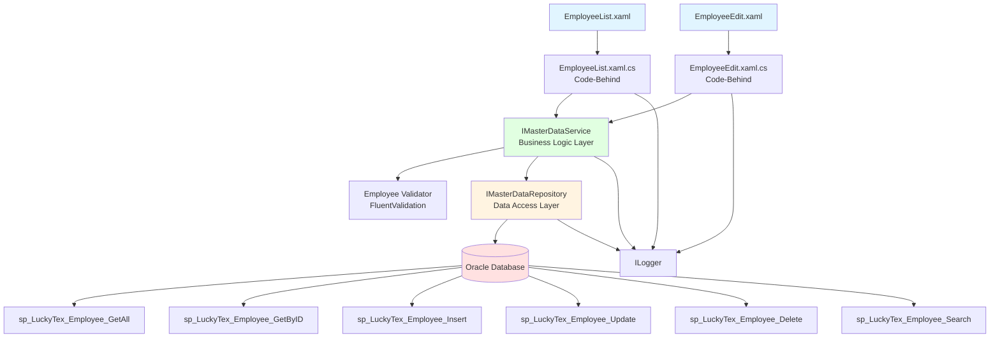
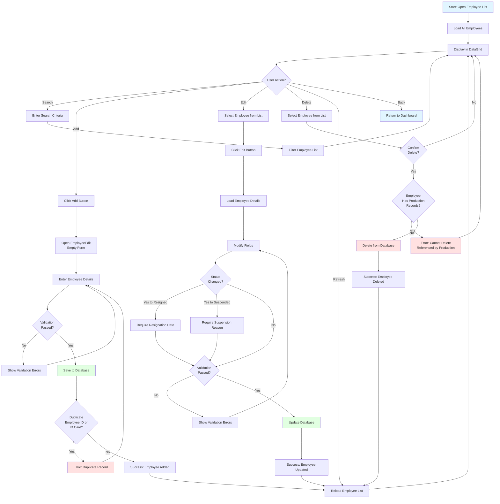

# Process: Employee Management

**Process ID**: MD-002
**Module**: 17 - Master Data
**Priority**: P1 (Foundation Module)
**Created**: 2025-10-05

---

## 1. Process Overview

### Purpose
Maintain employee master data including employee registration, personal information, department assignments, shift assignments, skill levels, and employment status for all personnel in the manufacturing facility.

### Scope
- Create new employee records
- Update employee information and assignments
- Manage employee status (Active, Resigned, Suspended)
- Track employee department and shift assignments
- Manage employee skill levels and certifications
- View employee work history
- Delete employee records (with constraint checks)
- Search and filter employee list

### Module(s) Involved
- **Primary**: M17 - Master Data
- **Consumers**: All production modules (M01-M14) reference employee data for operator tracking

---

## 2. UI Files Inventory

### XAML Files
| File Path | Description | Purpose |
|-----------|-------------|---------|
| `LuckyTex.AirBag.Pages/Pages/17 - Master Data/EmployeeList.xaml` | Employee list screen | Display all employees in DataGrid with search/filter |
| `LuckyTex.AirBag.Pages/Pages/17 - Master Data/EmployeeEdit.xaml` | Employee add/edit form | CRUD operations for employee records |
| `LuckyTex.AirBag.Pages/Pages/17 - Master Data/MasterDataDashboard.xaml` | Master data dashboard | Navigation hub |

### Code-Behind Files
| File Path | Description |
|-----------|-------------|
| `LuckyTex.AirBag.Pages/Pages/17 - Master Data/EmployeeList.xaml.cs` | List screen logic and event handlers |
| `LuckyTex.AirBag.Pages/Pages/17 - Master Data/EmployeeEdit.xaml.cs` | Form validation and save logic |

### Service Files
| File Path | Description |
|-----------|-------------|
| *(To be created)* `LuckyTex.AirBag.Core/Repositories/IMasterDataRepository.cs` | Repository interface |
| *(To be created)* `LuckyTex.AirBag.Core/Repositories/MasterDataRepository.cs` | Repository implementation |
| *(To be created)* `LuckyTex.AirBag.Core/Services/IMasterDataService.cs` | Service interface |
| *(To be created)* `LuckyTex.AirBag.Core/Services/MasterDataService.cs` | Service implementation |

---

## 3. UI Layout Description

### EmployeeList.xaml

**Screen Title**: "Employee Master Data"

**Key UI Controls**:

**Search/Filter Section** (Top):
- Search textbox (`txtSearch`) - Filter by employee ID or name
- Department filter dropdown
- Shift filter dropdown
- Status filter dropdown (All, Active, Resigned, Suspended)
- `cmdSearch` button
- `cmdClearFilter` button

**Data Grid Section** (Center):
- DataGrid displaying employee list
- Columns:
  - Employee ID (primary key)
  - Employee Name
  - Department
  - Shift
  - Position/Role
  - Skill Level
  - Status (with color indicator)
  - Hire Date
- Row selection enabled
- Sort by column headers

**Action Buttons** (Bottom):
- `cmdAdd` - Open EmployeeEdit in Add mode
- `cmdEdit` - Open EmployeeEdit with selected employee
- `cmdDelete` - Delete selected employee (with confirmation)
- `cmdRefresh` - Reload employee list
- `cmdExport` - Export to Excel
- `cmdBack` - Return to dashboard

---

### EmployeeEdit.xaml

**Screen Title**: "Employee Details" (Add/Edit mode indicator)

**Key UI Controls**:

**Personal Information Section**:
- Employee ID (`txtEmployeeID`) - Required, unique, disabled in edit mode
- First Name (`txtFirstName`) - Required
- Last Name (`txtLastName`) - Required
- ID Card Number (`txtIDCard`) - Required, unique
- Date of Birth (`dtpDateOfBirth`) - DatePicker
- Gender dropdown (`cmbGender`) - Male, Female, Other
- Contact Number (`txtContactNumber`)
- Email (`txtEmail`) - Email format validation
- Address (`txtAddress`) - Multiline

**Employment Information Section**:
- Department dropdown (`cmbDepartment`) - Required
- Position/Role (`txtPosition`) - Required
- Shift dropdown (`cmbShift`) - Required (Day, Night, Rotating)
- Skill Level dropdown (`cmbSkillLevel`) - Trainee, Operator, Senior Operator, Technician, Supervisor
- Hire Date (`dtpHireDate`) - DatePicker, required
- Probation End Date (`dtpProbationEnd`) - DatePicker
- Employment Type (`cmbEmploymentType`) - Permanent, Contract, Temporary

**Status Section**:
- Status dropdown (`cmbStatus`) - Active, Resigned, Suspended
- Status change date (`dtpStatusChangeDate`) - Auto-set when status changes
- Resignation date (`dtpResignationDate`) - Visible if status = Resigned
- Suspension reason (`txtSuspensionReason`) - Visible if status = Suspended

**Certification Section**:
- Certifications list (multiline textbox or list control)
- Training records link (navigate to training module if exists)

**Remarks Section**:
- Remarks textbox (`txtRemarks`) - Multiline, optional

**Action Buttons**:
- `cmdSave` - Validate and save employee record
- `cmdCancel` - Close without saving

---

## 4. Component Architecture Diagram

---

## 5. Workflow Diagram

---

## 6. Business Logic Sequence Diagram

```mermaid
sequenceDiagram
    participant User
    participant ListUI as EmployeeList
    participant EditUI as EmployeeEdit
    participant BL as MasterDataService
    participant VAL as EmployeeValidator
    participant REPO as MasterDataRepository
    participant DB as Oracle Database

    User->>ListUI: Open Employee List page
    ListUI->>BL: GetAllEmployees()
    BL->>REPO: GetAllEmployees()
    REPO->>DB: sp_LuckyTex_Employee_GetAll
    DB-->>REPO: Employee records
    REPO-->>BL: List<Employee>
    BL-->>ListUI: Employee data
    ListUI->>ListUI: Bind to DataGrid

    alt Add New Employee
        User->>ListUI: Click Add button
        ListUI->>EditUI: Navigate to EmployeeEdit (Add mode)
        EditUI->>EditUI: Clear all fields, enable EmployeeID

        User->>EditUI: Enter employee details
        User->>EditUI: Click Save

        EditUI->>BL: InsertEmployee(employee)
        BL->>VAL: Validate(employee)
        VAL->>VAL: Check EmployeeID not empty, format valid
        VAL->>VAL: Check FirstName, LastName not empty
        VAL->>VAL: Check IDCard not empty, unique
        VAL->>VAL: Check Email format (if provided)
        VAL->>VAL: Check Department, Shift selected
        VAL->>VAL: Check HireDate not future date

        alt Validation passed
            VAL-->>BL: Validation OK
            BL->>REPO: InsertEmployee(employee)
            REPO->>DB: sp_LuckyTex_Employee_Insert

            alt Insert successful
                DB-->>REPO: Employee inserted
                REPO-->>BL: Success
                BL-->>EditUI: Success result
                EditUI->>EditUI: Show success message
                EditUI->>ListUI: Navigate back to list
                ListUI->>BL: GetAllEmployees() (refresh)
                BL->>REPO: GetAllEmployees()
                REPO->>DB: sp_LuckyTex_Employee_GetAll
                DB-->>REPO: Updated list
                REPO-->>BL: List<Employee>
                BL-->>ListUI: Refreshed data
                ListUI->>ListUI: Refresh DataGrid
            else Duplicate EmployeeID or IDCard
                DB-->>REPO: Error: Unique constraint violation
                REPO-->>BL: Error: Duplicate record
                BL-->>EditUI: Error message
                EditUI->>EditUI: Highlight duplicate field
                EditUI->>EditUI: Show error message
            end
        else Validation failed
            VAL-->>BL: Validation errors
            BL-->>EditUI: Validation error list
            EditUI->>EditUI: Highlight invalid fields
            EditUI->>EditUI: Display validation messages
        end

    else Edit Existing Employee
        User->>ListUI: Select employee row
        User->>ListUI: Click Edit button
        ListUI->>BL: GetEmployeeByID(employeeID)
        BL->>REPO: GetEmployeeByID(employeeID)
        REPO->>DB: sp_LuckyTex_Employee_GetByID
        DB-->>REPO: Employee details
        REPO-->>BL: Employee entity
        BL-->>ListUI: Employee data
        ListUI->>EditUI: Navigate to EmployeeEdit (Edit mode, data)
        EditUI->>EditUI: Populate fields, disable EmployeeID

        User->>EditUI: Modify fields

        alt Status changed to Resigned
            User->>EditUI: Change status to "Resigned"
            EditUI->>EditUI: Show Resignation Date field
            User->>EditUI: Enter resignation date
        else Status changed to Suspended
            User->>EditUI: Change status to "Suspended"
            EditUI->>EditUI: Show Suspension Reason field
            User->>EditUI: Enter suspension reason
        end

        User->>EditUI: Click Save

        EditUI->>BL: UpdateEmployee(employee)
        BL->>VAL: Validate(employee)
        VAL->>VAL: Validate all required fields

        alt Status = Resigned
            VAL->>VAL: Check resignation date provided
            VAL->>VAL: Check resignation date >= hire date
        else Status = Suspended
            VAL->>VAL: Check suspension reason provided
        end

        alt Validation passed
            VAL-->>BL: OK
            BL->>REPO: UpdateEmployee(employee)
            REPO->>DB: sp_LuckyTex_Employee_Update
            DB-->>REPO: Rows affected = 1
            REPO-->>BL: Success
            BL-->>EditUI: Success result
            EditUI->>EditUI: Show success message
            EditUI->>ListUI: Navigate back
            ListUI->>BL: GetAllEmployees() (refresh)
            BL->>REPO: GetAllEmployees()
            REPO->>DB: sp_LuckyTex_Employee_GetAll
            DB-->>REPO: Updated list
            REPO-->>BL: List<Employee>
            BL-->>ListUI: Data
            ListUI->>ListUI: Refresh DataGrid
        else Validation failed
            VAL-->>BL: Errors
            BL-->>EditUI: Error list
            EditUI->>EditUI: Display errors
        end

    else Delete Employee
        User->>ListUI: Select employee row
        User->>ListUI: Click Delete button
        ListUI->>ListUI: Show confirmation dialog:<br/>"Delete employee [ID]?"

        alt User confirms
            User->>ListUI: Click Yes
            ListUI->>BL: DeleteEmployee(employeeID)
            BL->>REPO: DeleteEmployee(employeeID)
            REPO->>DB: sp_LuckyTex_Employee_Delete

            alt Delete successful
                DB-->>REPO: Rows affected = 1
                REPO-->>BL: Success
                BL-->>ListUI: Success result
                ListUI->>ListUI: Show success message
                ListUI->>BL: GetAllEmployees() (refresh)
                BL->>REPO: GetAllEmployees()
                REPO->>DB: sp_LuckyTex_Employee_GetAll
                DB-->>REPO: Updated list
                REPO-->>BL: List<Employee>
                BL-->>ListUI: Data
                ListUI->>ListUI: Refresh DataGrid
            else Foreign key constraint
                DB-->>REPO: Error: FK constraint violation
                REPO-->>BL: Error: Employee has production records
                BL-->>ListUI: Error message
                ListUI->>ListUI: Show error:<br/>"Cannot delete - employee has production records"
            end
        else User cancels
            User->>ListUI: Click No
            ListUI->>ListUI: Close dialog, no action
        end

    else Search/Filter
        User->>ListUI: Enter search text or select filters
        User->>ListUI: Click Search
        ListUI->>BL: SearchEmployees(criteria)
        BL->>REPO: SearchEmployees(criteria)
        REPO->>DB: sp_LuckyTex_Employee_Search
        DB-->>REPO: Filtered results
        REPO-->>BL: List<Employee>
        BL-->>ListUI: Filtered data
        ListUI->>ListUI: Refresh DataGrid with filtered data
    end
```

---

## 7. Data Flow

### Input Data
| Data Element | Source | Format | Validation |
|--------------|--------|--------|------------|
| Employee ID | User input | String, 10 chars max | Required, unique, alphanumeric |
| First Name | User input | String, 50 chars | Required |
| Last Name | User input | String, 50 chars | Required |
| ID Card Number | User input | String, 20 chars | Required, unique |
| Date of Birth | DatePicker | DateTime | Optional, must be < hire date |
| Gender | Dropdown | String | Required |
| Contact Number | User input | String, 20 chars | Optional, phone format |
| Email | User input | String, 100 chars | Optional, email format |
| Address | User input | String, 200 chars | Optional |
| Department | Dropdown | String | Required, from tblDepartment |
| Position | User input | String, 50 chars | Required |
| Shift | Dropdown | String | Required |
| Skill Level | Dropdown | String | Required |
| Hire Date | DatePicker | DateTime | Required, not future date |
| Probation End Date | DatePicker | DateTime | Optional, must be > hire date |
| Employment Type | Dropdown | String | Required |
| Status | Dropdown | String | Required (Active/Resigned/Suspended) |
| Resignation Date | DatePicker | DateTime | Required if status = Resigned |
| Suspension Reason | User input | String, 200 chars | Required if status = Suspended |
| Remarks | User input | String, 500 chars | Optional |

### Output Data
| Data Element | Destination | Format | Purpose |
|--------------|-------------|--------|---------|
| Employee Record | tblEmployee | Database row | Master data storage |
| Success/Error Message | UI | String | User feedback |
| Employee List | DataGrid | Collection | Display all employees |
| Filtered List | DataGrid | Collection | Search results |

### Data Transformations
1. **Employee ID**: Uppercase transformation on input
2. **Email**: Lowercase transformation
3. **Status**: Enum to string for database storage
4. **Dates**: UI DateTime to database DATE format
5. **Validation Results**: FluentValidation ValidationResult to UI error messages

---

## 8. Database Operations

### Stored Procedures Used

#### sp_LuckyTex_Employee_GetAll
- **Purpose**: Retrieve all employee records
- **Parameters**: None
- **Returns**: All columns from tblEmployee with department/shift names
- **Tables Read**: tblEmployee, tblDepartment, tblShift (joins)

#### sp_LuckyTex_Employee_GetByID
- **Purpose**: Retrieve single employee by ID
- **Parameters**: @EmployeeID VARCHAR(10)
- **Returns**: Employee details
- **Tables Read**: tblEmployee

#### sp_LuckyTex_Employee_Insert
- **Purpose**: Insert new employee record
- **Parameters**:
  - @EmployeeID VARCHAR(10)
  - @FirstName VARCHAR(50)
  - @LastName VARCHAR(50)
  - @IDCard VARCHAR(20)
  - @DateOfBirth DATETIME
  - @Gender VARCHAR(10)
  - @ContactNumber VARCHAR(20)
  - @Email VARCHAR(100)
  - @Address VARCHAR(200)
  - @Department VARCHAR(50)
  - @Position VARCHAR(50)
  - @Shift VARCHAR(20)
  - @SkillLevel VARCHAR(30)
  - @HireDate DATETIME
  - @ProbationEndDate DATETIME
  - @EmploymentType VARCHAR(20)
  - @Status VARCHAR(20)
  - @Remarks VARCHAR(500)
  - @CreatedBy VARCHAR(10)
  - @CreatedDate DATETIME
- **Returns**: Success flag
- **Tables Written**: tblEmployee

#### sp_LuckyTex_Employee_Update
- **Purpose**: Update existing employee record
- **Parameters**: Same as Insert (EmployeeID is WHERE condition)
- **Additional Parameters**:
  - @ResignationDate DATETIME (nullable)
  - @SuspensionReason VARCHAR(200) (nullable)
  - @StatusChangeDate DATETIME (auto-set if status changed)
- **Returns**: Rows affected
- **Tables Written**: tblEmployee

#### sp_LuckyTex_Employee_Delete
- **Purpose**: Delete employee record
- **Parameters**: @EmployeeID VARCHAR(10)
- **Returns**: Rows affected
- **Tables Written**: tblEmployee
- **Constraints**: FK checks from production tracking tables

#### sp_LuckyTex_Employee_Search
- **Purpose**: Search/filter employees
- **Parameters**:
  - @SearchText VARCHAR(100) (optional)
  - @Department VARCHAR(50) (optional)
  - @Shift VARCHAR(20) (optional)
  - @Status VARCHAR(20) (optional)
  - @SkillLevel VARCHAR(30) (optional)
- **Returns**: Filtered employee list
- **Tables Read**: tblEmployee, tblDepartment, tblShift

### Table Structure

**tblEmployee**:
- PK: EmployeeID VARCHAR(10)
- FirstName VARCHAR(50) NOT NULL
- LastName VARCHAR(50) NOT NULL
- IDCard VARCHAR(20) NOT NULL UNIQUE
- DateOfBirth DATETIME
- Gender VARCHAR(10) NOT NULL
- ContactNumber VARCHAR(20)
- Email VARCHAR(100)
- Address VARCHAR(200)
- Department VARCHAR(50) NOT NULL (FK to tblDepartment)
- Position VARCHAR(50) NOT NULL
- Shift VARCHAR(20) NOT NULL (FK to tblShift)
- SkillLevel VARCHAR(30) NOT NULL
- HireDate DATETIME NOT NULL
- ProbationEndDate DATETIME
- EmploymentType VARCHAR(20) NOT NULL
- Status VARCHAR(20) NOT NULL
- ResignationDate DATETIME
- SuspensionReason VARCHAR(200)
- StatusChangeDate DATETIME
- Certifications VARCHAR(500)
- Remarks VARCHAR(500)
- CreatedBy VARCHAR(10)
- CreatedDate DATETIME
- ModifiedBy VARCHAR(10)
- ModifiedDate DATETIME

---

## 9. Implementation Checklist

### Phase 1: Repository Layer
- [ ] Create `Employee` entity model
  - [ ] Properties matching tblEmployee columns
  - [ ] Data annotations for validation
  - [ ] Computed property: FullName (FirstName + LastName)
- [ ] Extend `IMasterDataRepository` interface
  - [ ] GetAllEmployees() method
  - [ ] GetEmployeeByID(string id) method
  - [ ] InsertEmployee(Employee employee) method
  - [ ] UpdateEmployee(Employee employee) method
  - [ ] DeleteEmployee(string id) method
  - [ ] SearchEmployees(EmployeeSearchCriteria criteria) method
- [ ] Implement in `MasterDataRepository`
  - [ ] Map all stored procedures
  - [ ] OracleDataReader to Employee entity mapping
  - [ ] Error handling and logging
- [ ] Unit tests for repository
  - [ ] Test GetAllEmployees returns collection
  - [ ] Test GetEmployeeByID with valid/invalid ID
  - [ ] Test InsertEmployee success
  - [ ] Test InsertEmployee duplicate ID/IDCard error
  - [ ] Test UpdateEmployee success
  - [ ] Test DeleteEmployee with FK constraint
  - [ ] Test SearchEmployees with various filters

### Phase 2: Service Layer
- [ ] Extend `IMasterDataService` interface
  - [ ] GetAllEmployees() method
  - [ ] GetEmployeeByID(string id) method
  - [ ] InsertEmployee(Employee employee) method
  - [ ] UpdateEmployee(Employee employee) method
  - [ ] DeleteEmployee(string id) method
  - [ ] SearchEmployees(EmployeeSearchCriteria criteria) method
- [ ] Create `EmployeeValidator` using FluentValidation
  - [ ] EmployeeID: Required, max 10 chars, alphanumeric
  - [ ] FirstName, LastName: Required, max 50 chars
  - [ ] IDCard: Required, max 20 chars, unique
  - [ ] Email: Optional, valid email format
  - [ ] ContactNumber: Optional, phone format
  - [ ] Department: Required, exists in tblDepartment
  - [ ] HireDate: Required, not future date
  - [ ] DateOfBirth: If provided, must be < hire date
  - [ ] ProbationEndDate: If provided, must be > hire date
  - [ ] Status: Required, valid enum
  - [ ] If Status = Resigned, ResignationDate required
  - [ ] If Status = Suspended, SuspensionReason required
- [ ] Implement in `MasterDataService`
  - [ ] Constructor with IMasterDataRepository, IValidator<Employee>, ILogger
  - [ ] All methods with try-catch and ServiceResult wrapping
  - [ ] Validation before Insert/Update
  - [ ] Auto-set StatusChangeDate when status changes
- [ ] Unit tests for service
  - [ ] Test validation errors (missing required fields)
  - [ ] Test email format validation
  - [ ] Test resignation date requirement
  - [ ] Test suspension reason requirement
  - [ ] Test successful Insert/Update/Delete
  - [ ] Test duplicate handling
  - [ ] Test FK constraint error handling

### Phase 3: UI Refactoring
- [ ] Update `EmployeeList.xaml.cs`
  - [ ] Remove DataService.Instance calls
  - [ ] Inject IMasterDataService
  - [ ] Update Page_Loaded to call GetAllEmployees
  - [ ] Update cmdSearch_Click to call SearchEmployees
  - [ ] Update cmdEdit_Click to navigate with selected employee
  - [ ] Update cmdDelete_Click with confirmation
  - [ ] Handle ServiceResult
  - [ ] Add loading indicator
- [ ] Update `EmployeeEdit.xaml.cs`
  - [ ] Inject IMasterDataService
  - [ ] Support Add vs Edit modes
  - [ ] Disable EmployeeID in Edit mode
  - [ ] Conditional UI: Show resignation date if status = Resigned
  - [ ] Conditional UI: Show suspension reason if status = Suspended
  - [ ] Update cmdSave_Click to call Insert or Update
  - [ ] Display validation errors
  - [ ] Navigate back on success
- [ ] XAML data binding
  - [ ] Bind DataGrid to ObservableCollection<Employee>
  - [ ] Bind dropdowns to reference data
  - [ ] Value converter for Status color indicator
  - [ ] Visibility converter for conditional fields
- [ ] User-friendly error messages

### Phase 4: Integration Testing
- [ ] Test with real Oracle database
  - [ ] Add new employee (success)
  - [ ] Add duplicate EmployeeID (error)
  - [ ] Add duplicate IDCard (error)
  - [ ] Edit existing employee (success)
  - [ ] Change status to Resigned without date (validation error)
  - [ ] Change status to Resigned with date (success)
  - [ ] Change status to Suspended without reason (validation error)
  - [ ] Change status to Suspended with reason (success)
  - [ ] Delete employee not in use (success)
  - [ ] Delete employee with production records (error)
  - [ ] Search by employee ID, name, department, shift, status
- [ ] UI testing
  - [ ] Page navigation
  - [ ] DataGrid refresh after CRUD
  - [ ] Validation error display
  - [ ] Conditional field visibility
  - [ ] Confirmation dialogs
- [ ] Performance testing
  - [ ] Load 1000+ employees (grid performance)
  - [ ] Search response time < 500ms

### Phase 5: Deployment Preparation
- [ ] Code review completed
- [ ] Unit tests passing (80%+ coverage)
- [ ] Integration tests passing
- [ ] Documentation updated
- [ ] UAT completed
- [ ] Production deployment checklist ready

---

**Document Version**: 1.0
**Last Updated**: 2025-10-05
**Status**: Ready for Implementation
**Estimated Effort**: 3-4 days (1 developer)
**Dependencies**: Department and Shift master data must exist
**Security Note**: Employee personal data - ensure proper access control
