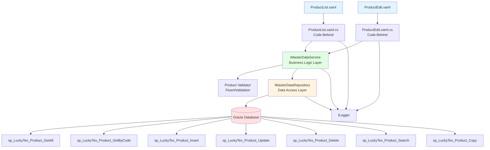
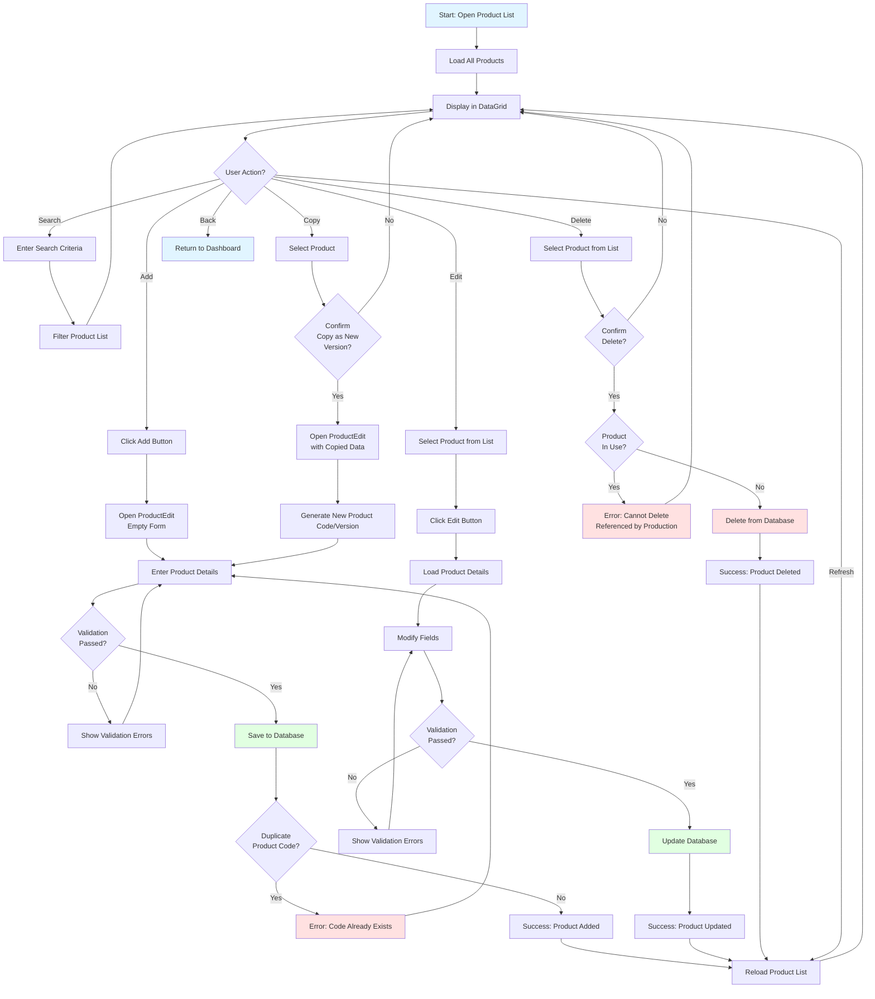

# Process: Product Management

**Process ID**: MD-004
**Module**: 17 - Master Data
**Priority**: P1 (Foundation Module)
**Created**: 2025-10-05

---

## 1. Process Overview

### Purpose
Maintain product master data including product specifications, bill of materials (BOM), quality standards, and customer requirements for all airbag fabric products manufactured.

### Scope
- Create new product records
- Update product specifications and BOM
- Manage product versions and revisions
- Define quality inspection criteria
- Configure production parameters (speed, temperature, etc.)
- Link products to customer orders
- View product history and changes
- Delete obsolete product records
- Search and filter product catalog

### Module(s) Involved
- **Primary**: M17 - Master Data
- **Consumers**: All production modules (M02-M14) reference product data for production planning and quality control

---

## 2. UI Files Inventory

### XAML Files
| File Path | Description | Purpose |
|-----------|-------------|---------|
| `LuckyTex.AirBag.Pages/Pages/17 - Master Data/ProductList.xaml` | Product catalog screen | Display all products with specifications |
| `LuckyTex.AirBag.Pages/Pages/17 - Master Data/ProductEdit.xaml` | Product add/edit form | CRUD operations for product records |
| `LuckyTex.AirBag.Pages/Pages/17 - Master Data/MasterDataDashboard.xaml` | Master data dashboard | Navigation hub |

### Code-Behind Files
| File Path | Description |
|-----------|-------------|
| `LuckyTex.AirBag.Pages/Pages/17 - Master Data/ProductList.xaml.cs` | List screen logic |
| `LuckyTex.AirBag.Pages/Pages/17 - Master Data/ProductEdit.xaml.cs` | Form validation and save logic |

### Service Files
| File Path | Description |
|-----------|-------------|
| *(To be created)* `LuckyTex.AirBag.Core/Repositories/IMasterDataRepository.cs` | Repository interface |
| *(To be created)* `LuckyTex.AirBag.Core/Repositories/MasterDataRepository.cs` | Repository implementation |
| *(To be created)* `LuckyTex.AirBag.Core/Services/IMasterDataService.cs` | Service interface |
| *(To be created)* `LuckyTex.AirBag.Core/Services/MasterDataService.cs` | Service implementation |

---

## 3. UI Layout Description

### ProductList.xaml

**Screen Title**: "Product Master Data"

**Key UI Controls**:

**Search/Filter Section** (Top):
- Search textbox (`txtSearch`) - Filter by product code or name
- Customer filter dropdown
- Product type filter dropdown (Warp, Weft, Coated, Printed)
- Status filter dropdown (All, Active, Development, Obsolete)
- `cmdSearch` button
- `cmdClearFilter` button

**Data Grid Section** (Center):
- DataGrid displaying product list
- Columns:
  - Product Code (primary key)
  - Product Name
  - Customer
  - Product Type
  - Fabric Width (cm)
  - Fabric Weight (g/m²)
  - Version
  - Status (with color indicator)
  - Last Modified Date
- Row selection enabled

**Action Buttons** (Bottom):
- `cmdAdd` - Open ProductEdit in Add mode
- `cmdEdit` - Open ProductEdit with selected product
- `cmdCopy` - Copy product to create new version
- `cmdDelete` - Delete selected product (with confirmation)
- `cmdRefresh` - Reload product list
- `cmdExport` - Export to Excel
- `cmdBack` - Return to dashboard

---

### ProductEdit.xaml

**Screen Title**: "Product Details" (Add/Edit mode indicator)

**Key UI Controls**:

**Product Information Section**:
- Product Code (`txtProductCode`) - Required, unique, disabled in edit mode, max 20 chars
- Product Name (`txtProductName`) - Required, max 100 chars
- Customer dropdown (`cmbCustomer`) - Required, from tblCustomer
- Product Type (`cmbProductType`) - Required (Warp, Weft, Coated, Printed)
- Version (`txtVersion`) - Auto-generated or manual, max 10 chars
- Status dropdown (`cmbStatus`) - Active, Development, Obsolete

**Fabric Specifications Section**:
- Fabric Width (`txtFabricWidth`) - Numeric, cm, required
- Fabric Weight (`txtFabricWeight`) - Numeric, g/m², required
- Fabric Construction (`txtConstruction`) - e.g., "Plain weave", max 50 chars
- Warp Density (ends/cm) (`txtWarpDensity`) - Numeric, required
- Weft Density (picks/cm) (`txtWeftDensity`) - Numeric, required
- Fabric Color (`txtColor`) - Max 30 chars
- Coating Type (`cmbCoatingType`) - Dropdown if product type = Coated

**Raw Material Specifications (BOM) Section**:
- Warp Yarn Type (`cmbWarpYarnType`) - Dropdown, from yarn master
- Warp Yarn Denier (`txtWarpDenier`) - Numeric
- Weft Yarn Type (`cmbWeftYarnType`) - Dropdown
- Weft Yarn Denier (`txtWeftDenier`) - Numeric
- Coating Material (`cmbCoatingMaterial`) - If applicable

**Production Parameters Section**:
- Warping Speed (m/min) (`txtWarpingSpeed`) - Numeric
- Weaving Speed (picks/min) (`txtWeavingSpeed`) - Numeric
- Finishing Temperature (°C) (`txtFinishingTemp`) - Numeric
- Coating Thickness (mm) (`txtCoatingThickness`) - Numeric, if applicable

**Quality Standards Section**:
- Tensile Strength (N) (`txtTensileStrength`) - Numeric, required
- Tear Strength (N) (`txtTearStrength`) - Numeric
- Air Permeability (L/m²/s) (`txtAirPermeability`) - Numeric
- Thickness Tolerance (mm) (`txtThicknessTolerance`) - Numeric
- Quality Standard Reference (`txtQualityStandard`) - e.g., "ISO 9001", max 50 chars

**Drawing/Attachment Section**:
- Technical Drawing link/upload
- Customer specification document link

**Remarks Section**:
- Remarks textbox (`txtRemarks`) - Multiline, optional

**Action Buttons**:
- `cmdSave` - Validate and save product record
- `cmdCancel` - Close without saving

---

## 4. Component Architecture Diagram

---

## 5. Workflow Diagram

---

## 6. Business Logic Sequence Diagram

```mermaid
sequenceDiagram
    participant User
    participant ListUI as ProductList
    participant EditUI as ProductEdit
    participant BL as MasterDataService
    participant VAL as ProductValidator
    participant REPO as MasterDataRepository
    participant DB as Oracle Database

    User->>ListUI: Open Product List page
    ListUI->>BL: GetAllProducts()
    BL->>REPO: GetAllProducts()
    REPO->>DB: sp_LuckyTex_Product_GetAll
    DB-->>REPO: Product records
    REPO-->>BL: List<Product>
    BL-->>ListUI: Product data
    ListUI->>ListUI: Bind to DataGrid

    alt Add New Product
        User->>ListUI: Click Add button
        ListUI->>EditUI: Navigate to ProductEdit (Add mode)
        EditUI->>EditUI: Clear all fields

        User->>EditUI: Enter product code, name, customer
        User->>EditUI: Enter fabric specifications
        User->>EditUI: Select yarn types for BOM
        User->>EditUI: Enter production parameters
        User->>EditUI: Enter quality standards
        User->>EditUI: Click Save

        EditUI->>BL: InsertProduct(product)
        BL->>VAL: Validate(product)
        VAL->>VAL: Check ProductCode not empty, unique
        VAL->>VAL: Check ProductName not empty
        VAL->>VAL: Check Customer selected
        VAL->>VAL: Check FabricWidth, FabricWeight > 0
        VAL->>VAL: Check WarpDensity, WeftDensity > 0
        VAL->>VAL: Check TensileStrength > 0

        alt Validation passed
            VAL-->>BL: Validation OK
            BL->>REPO: InsertProduct(product)
            REPO->>DB: sp_LuckyTex_Product_Insert

            alt Insert successful
                DB-->>REPO: Product inserted
                REPO-->>BL: Success
                BL-->>EditUI: Success result
                EditUI->>EditUI: Show success message
                EditUI->>ListUI: Navigate back to list
                ListUI->>BL: GetAllProducts() (refresh)
                BL->>REPO: GetAllProducts()
                REPO->>DB: sp_LuckyTex_Product_GetAll
                DB-->>REPO: Updated list
                REPO-->>BL: List<Product>
                BL-->>ListUI: Refreshed data
                ListUI->>ListUI: Refresh DataGrid
            else Duplicate product code
                DB-->>REPO: Error: Unique constraint violation
                REPO-->>BL: Error: Duplicate code
                BL-->>EditUI: Error message
                EditUI->>EditUI: Highlight ProductCode field
            end
        else Validation failed
            VAL-->>BL: Validation errors
            BL-->>EditUI: Validation error list
            EditUI->>EditUI: Highlight invalid fields
            EditUI->>EditUI: Display validation messages
        end

    else Edit Existing Product
        User->>ListUI: Select product row
        User->>ListUI: Click Edit button
        ListUI->>BL: GetProductByCode(productCode)
        BL->>REPO: GetProductByCode(productCode)
        REPO->>DB: sp_LuckyTex_Product_GetByCode
        DB-->>REPO: Product details (including BOM)
        REPO-->>BL: Product entity
        BL-->>ListUI: Product data
        ListUI->>EditUI: Navigate to ProductEdit (Edit mode, data)
        EditUI->>EditUI: Populate all fields, disable ProductCode

        User->>EditUI: Modify specifications/parameters
        User->>EditUI: Click Save

        EditUI->>BL: UpdateProduct(product)
        BL->>VAL: Validate(product)

        alt Validation passed
            VAL-->>BL: OK
            BL->>REPO: UpdateProduct(product)
            REPO->>DB: sp_LuckyTex_Product_Update
            DB-->>REPO: Rows affected = 1
            REPO-->>BL: Success
            BL-->>EditUI: Success result
            EditUI->>EditUI: Show success message
            EditUI->>ListUI: Navigate back
            ListUI->>BL: GetAllProducts() (refresh)
            BL->>REPO: GetAllProducts()
            REPO->>DB: sp_LuckyTex_Product_GetAll
            DB-->>REPO: Updated list
            REPO-->>BL: List<Product>
            BL-->>ListUI: Data
            ListUI->>ListUI: Refresh DataGrid
        else Validation failed
            VAL-->>BL: Errors
            BL-->>EditUI: Error list
            EditUI->>EditUI: Display errors
        end

    else Copy Product (New Version)
        User->>ListUI: Select product row
        User->>ListUI: Click Copy button
        ListUI->>ListUI: Show confirmation:<br/>"Copy product as new version?"

        User->>ListUI: Click Yes
        ListUI->>BL: GetProductByCode(productCode)
        BL->>REPO: GetProductByCode(productCode)
        REPO->>DB: sp_LuckyTex_Product_GetByCode
        DB-->>REPO: Product details
        REPO-->>BL: Product entity
        BL-->>ListUI: Product data
        ListUI->>EditUI: Navigate to ProductEdit (Add mode, copied data)
        EditUI->>EditUI: Populate fields from source product
        EditUI->>EditUI: Clear ProductCode field (enable for input)
        EditUI->>EditUI: Increment version number (e.g., V1 → V2)
        EditUI->>EditUI: Show message: "Creating new version of [ProductName]"

        User->>EditUI: Enter new product code
        User->>EditUI: Adjust specifications if needed
        User->>EditUI: Click Save

        EditUI->>BL: InsertProduct(newProduct)
        BL->>VAL: Validate(newProduct)

        alt Validation passed
            VAL-->>BL: OK
            BL->>REPO: InsertProduct(newProduct)
            REPO->>DB: sp_LuckyTex_Product_Insert
            DB-->>REPO: Product inserted
            REPO-->>BL: Success
            BL-->>EditUI: Success: New version created
            EditUI->>ListUI: Navigate back
            ListUI->>BL: GetAllProducts() (refresh)
            BL->>REPO: GetAllProducts()
            REPO->>DB: sp_LuckyTex_Product_GetAll
            DB-->>REPO: Updated list
            REPO-->>BL: List<Product>
            BL-->>ListUI: Data
            ListUI->>ListUI: Refresh DataGrid
        end

    else Delete Product
        User->>ListUI: Select product row
        User->>ListUI: Click Delete button
        ListUI->>ListUI: Show confirmation dialog:<br/>"Delete product [Code]?"

        alt User confirms
            User->>ListUI: Click Yes
            ListUI->>BL: DeleteProduct(productCode)
            BL->>REPO: DeleteProduct(productCode)
            REPO->>DB: sp_LuckyTex_Product_Delete

            alt Delete successful
                DB-->>REPO: Rows affected = 1
                REPO-->>BL: Success
                BL-->>ListUI: Success result
                ListUI->>ListUI: Show success message
                ListUI->>BL: GetAllProducts() (refresh)
                BL->>REPO: GetAllProducts()
                REPO->>DB: sp_LuckyTex_Product_GetAll
                DB-->>REPO: Updated list
                REPO-->>BL: List<Product>
                BL-->>ListUI: Data
                ListUI->>ListUI: Refresh DataGrid
            else Foreign key constraint
                DB-->>REPO: Error: FK constraint violation
                REPO-->>BL: Error: Product in use
                BL-->>ListUI: Error message
                ListUI->>ListUI: Show error:<br/>"Cannot delete - product is referenced by production orders"
            end
        else User cancels
            User->>ListUI: Click No
            ListUI->>ListUI: Close dialog, no action
        end

    else Search/Filter
        User->>ListUI: Enter search text or select filters
        User->>ListUI: Click Search
        ListUI->>BL: SearchProducts(criteria)
        BL->>REPO: SearchProducts(criteria)
        REPO->>DB: sp_LuckyTex_Product_Search
        DB-->>REPO: Filtered results
        REPO-->>BL: List<Product>
        BL-->>ListUI: Filtered data
        ListUI->>ListUI: Refresh DataGrid with filtered data
    end
```

---

## 7. Data Flow

### Input Data
| Data Element | Source | Format | Validation |
|--------------|--------|--------|------------|
| Product Code | User input | String, 20 chars max | Required, unique, alphanumeric |
| Product Name | User input | String, 100 chars | Required |
| Customer | Dropdown | String | Required, from tblCustomer |
| Product Type | Dropdown | String | Required |
| Version | User input | String, 10 chars | Optional, default "V1" |
| Status | Dropdown | String | Required |
| Fabric Width (cm) | User input | Decimal | Required, > 0 |
| Fabric Weight (g/m²) | User input | Decimal | Required, > 0 |
| Fabric Construction | User input | String, 50 chars | Optional |
| Warp Density | User input | Decimal | Required, > 0 |
| Weft Density | User input | Decimal | Required, > 0 |
| Fabric Color | User input | String, 30 chars | Optional |
| Coating Type | Dropdown | String | Required if product type = Coated |
| Warp Yarn Type | Dropdown | String | Required |
| Weft Yarn Type | Dropdown | String | Required |
| Production Parameters | User input | Decimal values | Optional, must be > 0 if provided |
| Tensile Strength | User input | Decimal | Required, > 0 |
| Quality Standards | User input | Decimal values | Optional |
| Remarks | User input | String, 500 chars | Optional |

### Output Data
| Data Element | Destination | Format | Purpose |
|--------------|-------------|--------|---------|
| Product Record | tblProduct | Database row | Master data storage |
| BOM Records | tblProductBOM | Database rows | Bill of materials |
| Success/Error Message | UI | String | User feedback |
| Product List | DataGrid | Collection | Display all products |

### Data Transformations
1. **Product Code**: Uppercase transformation
2. **Version**: Auto-increment for copied products
3. **Status**: Enum to string
4. **Decimal values**: Round to 2 decimal places
5. **Validation Results**: FluentValidation to UI error messages

---

## 8. Database Operations

### Stored Procedures Used

#### sp_LuckyTex_Product_GetAll
- **Purpose**: Retrieve all product records
- **Parameters**: None
- **Returns**: All columns from tblProduct with customer names
- **Tables Read**: tblProduct, tblCustomer, tblProductBOM (joins)

#### sp_LuckyTex_Product_GetByCode
- **Purpose**: Retrieve single product with BOM
- **Parameters**: @ProductCode VARCHAR(20)
- **Returns**: Product details including BOM
- **Tables Read**: tblProduct, tblProductBOM

#### sp_LuckyTex_Product_Insert
- **Purpose**: Insert new product record
- **Parameters**: All product fields (40+ parameters)
- **Returns**: Success flag
- **Tables Written**: tblProduct, tblProductBOM
- **Transaction**: Insert product + insert BOM records

#### sp_LuckyTex_Product_Update
- **Purpose**: Update existing product record
- **Parameters**: Same as Insert (ProductCode is WHERE condition)
- **Returns**: Rows affected
- **Tables Written**: tblProduct, tblProductBOM

#### sp_LuckyTex_Product_Delete
- **Purpose**: Delete product record
- **Parameters**: @ProductCode VARCHAR(20)
- **Returns**: Rows affected
- **Tables Written**: tblProduct, tblProductBOM
- **Constraints**: FK checks from production order tables

#### sp_LuckyTex_Product_Search
- **Purpose**: Search/filter products
- **Parameters**:
  - @SearchText VARCHAR(100) (optional)
  - @Customer VARCHAR(50) (optional)
  - @ProductType VARCHAR(20) (optional)
  - @Status VARCHAR(20) (optional)
- **Returns**: Filtered product list
- **Tables Read**: tblProduct, tblCustomer

### Table Structure

**tblProduct**: (40+ columns)
- PK: ProductCode VARCHAR(20)
- ProductName VARCHAR(100) NOT NULL
- Customer VARCHAR(50) NOT NULL (FK to tblCustomer)
- ProductType VARCHAR(20) NOT NULL
- Version VARCHAR(10)
- Status VARCHAR(20) NOT NULL
- FabricWidth DECIMAL(10,2) NOT NULL
- FabricWeight DECIMAL(10,2) NOT NULL
- FabricConstruction VARCHAR(50)
- WarpDensity DECIMAL(10,2) NOT NULL
- WeftDensity DECIMAL(10,2) NOT NULL
- FabricColor VARCHAR(30)
- CoatingType VARCHAR(30)
- (... production parameters ...)
- TensileStrength DECIMAL(10,2) NOT NULL
- TearStrength DECIMAL(10,2)
- AirPermeability DECIMAL(10,2)
- QualityStandard VARCHAR(50)
- Remarks VARCHAR(500)
- CreatedBy VARCHAR(10)
- CreatedDate DATETIME
- ModifiedBy VARCHAR(10)
- ModifiedDate DATETIME

**tblProductBOM**:
- PK: BOMLineID INT (auto-increment)
- ProductCode VARCHAR(20) NOT NULL (FK to tblProduct)
- MaterialType VARCHAR(20) NOT NULL (Warp, Weft, Coating)
- YarnType VARCHAR(50)
- YarnDenier DECIMAL(10,2)
- Material VARCHAR(100)
- Quantity DECIMAL(10,2)

---

## 9. Implementation Checklist

### Phase 1: Repository Layer
- [ ] Create `Product` entity model (40+ properties)
- [ ] Create `ProductBOM` entity model
- [ ] Extend `IMasterDataRepository` interface
  - [ ] GetAllProducts() method
  - [ ] GetProductByCode(string code) method
  - [ ] InsertProduct(Product product) method
  - [ ] UpdateProduct(Product product) method
  - [ ] DeleteProduct(string code) method
  - [ ] SearchProducts(ProductSearchCriteria criteria) method
  - [ ] CopyProduct(string sourceCode, string newCode) method
- [ ] Implement in `MasterDataRepository`
  - [ ] Map all stored procedures
  - [ ] Handle product + BOM as transaction
  - [ ] OracleDataReader to entity mapping
- [ ] Unit tests for repository

### Phase 2: Service Layer
- [ ] Extend `IMasterDataService` interface
  - [ ] All product CRUD methods
- [ ] Create `ProductValidator` using FluentValidation
  - [ ] ProductCode: Required, unique, max 20 chars
  - [ ] ProductName: Required, max 100 chars
  - [ ] Customer: Required, exists in tblCustomer
  - [ ] FabricWidth, FabricWeight: Required, > 0
  - [ ] Densities: Required, > 0
  - [ ] TensileStrength: Required, > 0
  - [ ] Production parameters: If provided, must be > 0
  - [ ] BOM: At least warp and weft materials required
- [ ] Implement in `MasterDataService`
  - [ ] Constructor with IMasterDataRepository, IValidator<Product>, ILogger
  - [ ] Validation before Insert/Update
  - [ ] Copy product logic with version increment
- [ ] Unit tests for service

### Phase 3: UI Refactoring
- [ ] Update `ProductList.xaml.cs`
  - [ ] Inject IMasterDataService
  - [ ] Update Page_Loaded to call GetAllProducts
  - [ ] Update cmdCopy_Click for product copy/version
  - [ ] Handle ServiceResult
- [ ] Update `ProductEdit.xaml.cs`
  - [ ] Inject IMasterDataService
  - [ ] Support Add vs Edit vs Copy modes
  - [ ] Populate dropdowns (customer, yarn types, etc.)
  - [ ] Conditional UI: Show coating fields if product type = Coated
  - [ ] Update cmdSave_Click to call Insert or Update
  - [ ] Display validation errors
- [ ] XAML data binding
  - [ ] Bind DataGrid
  - [ ] Bind dropdowns to reference data
  - [ ] Value converter for Status color
  - [ ] Visibility converter for conditional fields
- [ ] User-friendly error messages

### Phase 4: Integration Testing
- [ ] Test with real database
  - [ ] Add new product (success)
  - [ ] Add duplicate ProductCode (error)
  - [ ] Edit product specifications (success)
  - [ ] Copy product as new version (success)
  - [ ] Delete product not in use (success)
  - [ ] Delete product with production orders (error)
  - [ ] Search by code, name, customer, type, status
- [ ] UI testing
  - [ ] Conditional field visibility (coating fields)
  - [ ] BOM data entry and validation
  - [ ] Product copy workflow
- [ ] Performance testing
  - [ ] Load 500+ products
  - [ ] Search response time < 500ms

### Phase 5: Deployment Preparation
- [ ] Code review
- [ ] Unit tests passing (80%+)
- [ ] Integration tests passing
- [ ] UAT completed
- [ ] Production deployment

---

**Document Version**: 1.0
**Last Updated**: 2025-10-05
**Status**: Ready for Implementation
**Estimated Effort**: 4-5 days (1 developer)
**Dependencies**: Customer master data must exist
**Special Notes**: Complex entity with BOM - requires careful transaction handling
