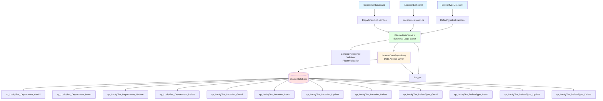
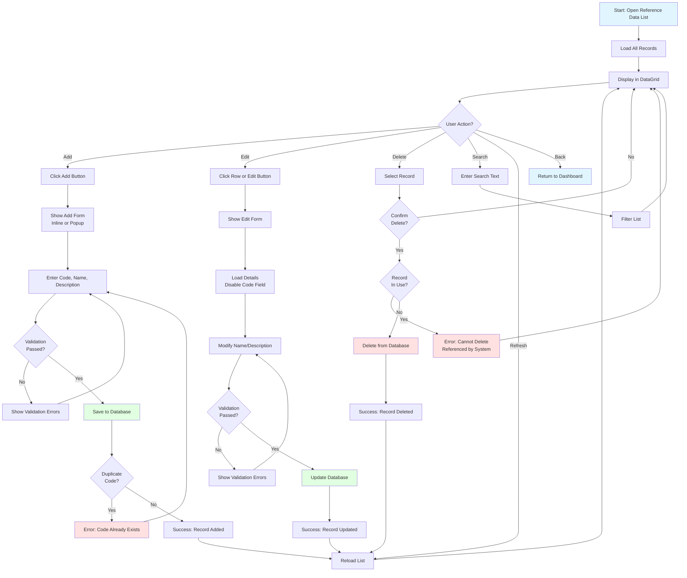

# Process: Reference Data Management

**Process ID**: MD-006
**Module**: 17 - Master Data
**Priority**: P1 (Foundation Module)
**Created**: 2025-10-05

---

## 1. Process Overview

### Purpose
Maintain system reference data including departments, locations, defect types, rejection reasons, and other lookup tables used throughout the manufacturing execution system.

### Scope
- Manage department master data (production departments)
- Manage warehouse location codes
- Manage defect type definitions for quality inspection
- Manage rejection reason codes
- Manage other reference/lookup tables
- Create, update, and delete reference data records
- Search and filter reference data lists
- Export reference data for reporting

### Module(s) Involved
- **Primary**: M17 - Master Data
- **Consumers**: All modules use reference data for dropdowns and lookups

---

## 2. UI Files Inventory

### XAML Files
| File Path | Description | Purpose |
|-----------|-------------|---------|
| `LuckyTex.AirBag.Pages/Pages/17 - Master Data/DepartmentList.xaml` | Department list screen | CRUD for departments |
| `LuckyTex.AirBag.Pages/Pages/17 - Master Data/LocationList.xaml` | Location list screen | CRUD for warehouse locations |
| `LuckyTex.AirBag.Pages/Pages/17 - Master Data/DefectTypeList.xaml` | Defect type list screen | CRUD for defect types |
| `LuckyTex.AirBag.Pages/Pages/17 - Master Data/MasterDataDashboard.xaml` | Master data dashboard | Navigation hub |

**Note**: These screens may use a generic CRUD template since they share similar simple structure (code, name, description, status).

### Code-Behind Files
| File Path | Description |
|-----------|-------------|
| `LuckyTex.AirBag.Pages/Pages/17 - Master Data/DepartmentList.xaml.cs` | Department list logic |
| `LuckyTex.AirBag.Pages/Pages/17 - Master Data/LocationList.xaml.cs` | Location list logic |
| `LuckyTex.AirBag.Pages/Pages/17 - Master Data/DefectTypeList.xaml.cs` | Defect type list logic |

### Service Files
| File Path | Description |
|-----------|-------------|
| *(To be created)* `LuckyTex.AirBag.Core/Repositories/IMasterDataRepository.cs` | Repository interface |
| *(To be created)* `LuckyTex.AirBag.Core/Repositories/MasterDataRepository.cs` | Repository implementation |
| *(To be created)* `LuckyTex.AirBag.Core/Services/IMasterDataService.cs` | Service interface |
| *(To be created)* `LuckyTex.AirBag.Core/Services/MasterDataService.cs` | Service implementation |
| *(To be created)* `LuckyTex.AirBag.Core/Models/ReferenceData/` | Entity models for each reference type |

---

## 3. UI Layout Description

### Generic Reference Data Screen (Department/Location/DefectType)

**Screen Title**: "[Entity Type] Master Data" (e.g., "Department Master Data")

**Key UI Controls**:

**Search/Filter Section** (Top):
- Search textbox (`txtSearch`) - Filter by code or name
- Status filter dropdown (All, Active, Inactive)
- `cmdSearch` button
- `cmdClearFilter` button

**Data Grid Section** (Center):
- DataGrid displaying reference data list
- Columns (generic for most reference tables):
  - Code (primary key, 10-20 chars)
  - Name (50-100 chars)
  - Description (optional, 200 chars)
  - Status (Active/Inactive, with color indicator)
  - Display Order (for dropdown sorting)
- Inline editing enabled OR click row to edit in form
- Row selection enabled

**Action Buttons** (Bottom):
- `cmdAdd` - Add new record (inline or form)
- `cmdEdit` - Edit selected record
- `cmdDelete` - Delete selected record (with confirmation)
- `cmdRefresh` - Reload list
- `cmdExport` - Export to Excel
- `cmdBack` - Return to dashboard

---

### Inline Add/Edit Form (Embedded in Grid or Popup)

**Key UI Controls**:

**Simple Form** (for basic reference data):
- Code (`txtCode`) - Required, unique, disabled in edit mode
- Name (`txtName`) - Required
- Description (`txtDescription`) - Optional
- Display Order (`txtDisplayOrder`) - Integer, for dropdown sorting
- Status (`cmbStatus`) - Active, Inactive

**Action Buttons**:
- `cmdSave` - Save record
- `cmdCancel` - Cancel edit

---

### Specific Reference Data Screens

#### DepartmentList.xaml

**Additional Fields**:
- Department Type (Production, Support, Quality, Warehouse, etc.)
- Manager (from employee list)
- Cost Center Code

#### LocationList.xaml

**Additional Fields**:
- Warehouse Zone (A, B, C, etc.)
- Aisle Number
- Rack Number
- Shelf Number
- Location Type (Pallet, Shelf, Floor, etc.)
- Capacity (cubic meters or units)

#### DefectTypeList.xaml

**Additional Fields**:
- Defect Category (Warp, Weft, Weaving, Coating, Finishing, etc.)
- Severity (Critical, Major, Minor)
- Default Action (Rework, Reject, Downgrade)
- Quality Impact Score (1-10)

---

## 4. Component Architecture Diagram

---

## 5. Workflow Diagram

---

## 6. Business Logic Sequence Diagram

```mermaid
sequenceDiagram
    participant User
    participant ListUI as Reference Data List
    participant BL as MasterDataService
    participant VAL as Validator
    participant REPO as MasterDataRepository
    participant DB as Oracle Database

    User->>ListUI: Open reference data list page
    ListUI->>BL: GetAllDepartments() OR GetAllLocations() OR GetAllDefectTypes()
    BL->>REPO: GetAll[EntityType]()
    REPO->>DB: sp_LuckyTex_[EntityType]_GetAll
    DB-->>REPO: Records
    REPO-->>BL: List<Entity>
    BL-->>ListUI: Data
    ListUI->>ListUI: Bind to DataGrid, sort by DisplayOrder

    alt Add New Record
        User->>ListUI: Click Add button
        ListUI->>ListUI: Show add form (inline or popup)
        ListUI->>ListUI: Clear all fields, enable Code field

        User->>ListUI: Enter code (e.g., "DEPT01")
        User->>ListUI: Enter name (e.g., "Warping Department")
        User->>ListUI: Enter description (optional)
        User->>ListUI: Enter display order (e.g., 10)
        User->>ListUI: Click Save

        ListUI->>BL: InsertDepartment(dept) OR InsertLocation(loc) OR InsertDefectType(def)
        BL->>VAL: Validate(entity)
        VAL->>VAL: Check Code not empty, alphanumeric, max length
        VAL->>VAL: Check Name not empty, max length
        VAL->>VAL: Check DisplayOrder >= 0
        VAL->>VAL: Entity-specific validations

        alt Validation passed
            VAL-->>BL: Validation OK
            BL->>REPO: Insert[EntityType](entity)
            REPO->>DB: sp_LuckyTex_[EntityType]_Insert

            alt Insert successful
                DB-->>REPO: Record inserted
                REPO-->>BL: Success
                BL-->>ListUI: Success result
                ListUI->>ListUI: Close add form
                ListUI->>ListUI: Show success message
                ListUI->>BL: GetAll[EntityType]() (refresh)
                BL->>REPO: GetAll[EntityType]()
                REPO->>DB: sp_LuckyTex_[EntityType]_GetAll
                DB-->>REPO: Updated list
                REPO-->>BL: List<Entity>
                BL-->>ListUI: Refreshed data
                ListUI->>ListUI: Refresh DataGrid
            else Duplicate code
                DB-->>REPO: Error: Unique constraint violation
                REPO-->>BL: Error: Duplicate code
                BL-->>ListUI: Error message
                ListUI->>ListUI: Highlight Code field
                ListUI->>ListUI: Show error: "Code already exists"
            end
        else Validation failed
            VAL-->>BL: Validation errors
            BL-->>ListUI: Validation error list
            ListUI->>ListUI: Highlight invalid fields
            ListUI->>ListUI: Display validation messages
        end

    else Edit Existing Record
        User->>ListUI: Click row or Edit button
        ListUI->>ListUI: Show edit form
        ListUI->>ListUI: Populate fields from selected row
        ListUI->>ListUI: Disable Code field (read-only)

        User->>ListUI: Modify name or description
        User->>ListUI: Modify display order
        User->>ListUI: Click Save

        ListUI->>BL: UpdateDepartment(dept) OR UpdateLocation(loc) OR UpdateDefectType(def)
        BL->>VAL: Validate(entity)

        alt Validation passed
            VAL-->>BL: OK
            BL->>REPO: Update[EntityType](entity)
            REPO->>DB: sp_LuckyTex_[EntityType]_Update
            DB-->>REPO: Rows affected = 1
            REPO-->>BL: Success
            BL-->>ListUI: Success result
            ListUI->>ListUI: Close edit form
            ListUI->>ListUI: Show success message
            ListUI->>BL: GetAll[EntityType]() (refresh)
            BL->>REPO: GetAll[EntityType]()
            REPO->>DB: sp_LuckyTex_[EntityType]_GetAll
            DB-->>REPO: Updated list
            REPO-->>BL: List<Entity>
            BL-->>ListUI: Data
            ListUI->>ListUI: Refresh DataGrid
        else Validation failed
            VAL-->>BL: Errors
            BL-->>ListUI: Error list
            ListUI->>ListUI: Display errors
        end

    else Delete Record
        User->>ListUI: Select row
        User->>ListUI: Click Delete button
        ListUI->>ListUI: Show confirmation dialog:<br/>"Delete [Code]?"

        alt User confirms
            User->>ListUI: Click Yes
            ListUI->>BL: DeleteDepartment(code) OR DeleteLocation(code) OR DeleteDefectType(code)
            BL->>REPO: Delete[EntityType](code)
            REPO->>DB: sp_LuckyTex_[EntityType]_Delete

            alt Delete successful
                DB-->>REPO: Rows affected = 1
                REPO-->>BL: Success
                BL-->>ListUI: Success result
                ListUI->>ListUI: Show success message
                ListUI->>BL: GetAll[EntityType]() (refresh)
                BL->>REPO: GetAll[EntityType]()
                REPO->>DB: sp_LuckyTex_[EntityType]_GetAll
                DB-->>REPO: Updated list
                REPO-->>BL: List<Entity>
                BL-->>ListUI: Data
                ListUI->>ListUI: Refresh DataGrid
            else Foreign key constraint
                DB-->>REPO: Error: FK constraint violation
                REPO-->>BL: Error: Record in use
                BL-->>ListUI: Error message
                ListUI->>ListUI: Show error:<br/>"Cannot delete - referenced by system"
            end
        else User cancels
            User->>ListUI: Click No
            ListUI->>ListUI: Close dialog, no action
        end

    else Search/Filter
        User->>ListUI: Enter search text (code or name)
        User->>ListUI: Press Enter or Click Search
        ListUI->>ListUI: Filter DataGrid locally OR
        ListUI->>BL: SearchReferenceData(entityType, searchText)
        BL->>REPO: Search[EntityType](searchText)
        REPO->>DB: sp_LuckyTex_[EntityType]_Search
        DB-->>REPO: Filtered results
        REPO-->>BL: List<Entity>
        BL-->>ListUI: Filtered data
        ListUI->>ListUI: Refresh DataGrid with filtered data
    end
```

---

## 7. Data Flow

### Input Data (Generic for All Reference Tables)
| Data Element | Source | Format | Validation |
|--------------|--------|--------|------------|
| Code | User input | String, 10-20 chars | Required, unique, alphanumeric |
| Name | User input | String, 50-100 chars | Required |
| Description | User input | String, 200 chars | Optional |
| Status | Dropdown | String | Required (Active/Inactive) |
| Display Order | User input | Integer | Optional, >= 0, for dropdown sorting |

### Additional Fields (Entity-Specific)

**Department**:
- Department Type (Production, Support, Quality, etc.)
- Manager (FK to tblEmployee)
- Cost Center Code

**Location**:
- Warehouse Zone (A-Z)
- Aisle Number (Integer)
- Rack Number (Integer)
- Shelf Number (Integer)
- Location Type (Pallet, Shelf, Floor)
- Capacity (Decimal, cubic meters)

**Defect Type**:
- Defect Category (Warp, Weft, Weaving, Coating, Finishing)
- Severity (Critical, Major, Minor)
- Default Action (Rework, Reject, Downgrade)
- Quality Impact Score (1-10)

### Output Data
| Data Element | Destination | Format | Purpose |
|--------------|-------------|--------|---------|
| Reference Data Record | tbl[EntityType] | Database row | Master data storage |
| Success/Error Message | UI | String | User feedback |
| Reference Data List | DataGrid | Collection | Display all records, sorted by DisplayOrder |
| Dropdown Options | Other modules | Collection | Populate dropdowns throughout system |

### Data Transformations
1. **Code**: Uppercase transformation
2. **Name**: Title case (optional)
3. **Status**: Enum to string
4. **Display Order**: Default to 999 if not provided (sort to end)

---

## 8. Database Operations

### Stored Procedures Used (Pattern for Each Entity Type)

#### Department Procedures
- **sp_LuckyTex_Department_GetAll**: Retrieve all departments, ordered by DisplayOrder
- **sp_LuckyTex_Department_GetByCode**: Retrieve single department
- **sp_LuckyTex_Department_Insert**: Insert new department
- **sp_LuckyTex_Department_Update**: Update department
- **sp_LuckyTex_Department_Delete**: Delete department

#### Location Procedures
- **sp_LuckyTex_Location_GetAll**: Retrieve all locations
- **sp_LuckyTex_Location_GetByCode**: Retrieve single location
- **sp_LuckyTex_Location_Insert**: Insert new location
- **sp_LuckyTex_Location_Update**: Update location
- **sp_LuckyTex_Location_Delete**: Delete location

#### DefectType Procedures
- **sp_LuckyTex_DefectType_GetAll**: Retrieve all defect types
- **sp_LuckyTex_DefectType_GetByCode**: Retrieve single defect type
- **sp_LuckyTex_DefectType_Insert**: Insert new defect type
- **sp_LuckyTex_DefectType_Update**: Update defect type
- **sp_LuckyTex_DefectType_Delete**: Delete defect type

### Table Structure (Generic Pattern)

**tblDepartment**:
- PK: DepartmentCode VARCHAR(20)
- DepartmentName VARCHAR(100) NOT NULL
- Description VARCHAR(200)
- DepartmentType VARCHAR(20)
- Manager VARCHAR(10) (FK to tblEmployee)
- CostCenter VARCHAR(20)
- DisplayOrder INT DEFAULT 999
- Status VARCHAR(20) NOT NULL
- CreatedBy VARCHAR(10)
- CreatedDate DATETIME
- ModifiedBy VARCHAR(10)
- ModifiedDate DATETIME

**tblLocation**:
- PK: LocationCode VARCHAR(20)
- LocationName VARCHAR(100) NOT NULL
- Description VARCHAR(200)
- WarehouseZone VARCHAR(10)
- AisleNumber INT
- RackNumber INT
- ShelfNumber INT
- LocationType VARCHAR(20)
- Capacity DECIMAL(10,2)
- DisplayOrder INT DEFAULT 999
- Status VARCHAR(20) NOT NULL
- CreatedBy VARCHAR(10)
- CreatedDate DATETIME
- ModifiedBy VARCHAR(10)
- ModifiedDate DATETIME

**tblDefectType**:
- PK: DefectTypeCode VARCHAR(20)
- DefectTypeName VARCHAR(100) NOT NULL
- Description VARCHAR(200)
- DefectCategory VARCHAR(20)
- Severity VARCHAR(20)
- DefaultAction VARCHAR(20)
- QualityImpactScore INT
- DisplayOrder INT DEFAULT 999
- Status VARCHAR(20) NOT NULL
- CreatedBy VARCHAR(10)
- CreatedDate DATETIME
- ModifiedBy VARCHAR(10)
- ModifiedDate DATETIME

---

## 9. Implementation Checklist

### Phase 1: Repository Layer
- [ ] Create base `ReferenceData` entity model (abstract or interface)
  - [ ] Properties: Code, Name, Description, DisplayOrder, Status
- [ ] Create entity models:
  - [ ] `Department` : ReferenceData
  - [ ] `Location` : ReferenceData
  - [ ] `DefectType` : ReferenceData
- [ ] Extend `IMasterDataRepository` interface
  - [ ] Generic methods: GetAll<T>(), Insert<T>(), Update<T>(), Delete<T>()
  - [ ] OR specific methods for each entity type
- [ ] Implement in `MasterDataRepository`
  - [ ] Map all stored procedures (15 procedures)
  - [ ] Generic OracleDataReader to entity mapping (if using generics)
- [ ] Unit tests for repository
  - [ ] Test CRUD for each entity type
  - [ ] Test FK constraint on delete

### Phase 2: Service Layer
- [ ] Extend `IMasterDataService` interface
  - [ ] CRUD methods for Department, Location, DefectType
- [ ] Create `ReferenceDataValidator<T>` using FluentValidation (generic validator)
  - [ ] Code: Required, max length, alphanumeric
  - [ ] Name: Required, max length
  - [ ] DisplayOrder: >= 0
  - [ ] Status: Required, valid enum
- [ ] Create entity-specific validators (if needed)
  - [ ] `DepartmentValidator` : ReferenceDataValidator<Department>
  - [ ] `LocationValidator` : ReferenceDataValidator<Location>
  - [ ] `DefectTypeValidator` : ReferenceDataValidator<DefectType>
- [ ] Implement in `MasterDataService`
  - [ ] Constructor with IMasterDataRepository, validators, ILogger
  - [ ] Validation before Insert/Update
- [ ] Unit tests for service

### Phase 3: UI Refactoring
- [ ] Consider creating a **generic reference data CRUD control/page**
  - [ ] Reusable WPF UserControl with DataGrid and inline form
  - [ ] Configuration-driven (pass entity type, column definitions)
  - [ ] Reduces code duplication
- [ ] OR update individual pages:
  - [ ] Update `DepartmentList.xaml.cs`
    - [ ] Inject IMasterDataService
    - [ ] Update Page_Loaded to call GetAllDepartments
    - [ ] Handle ServiceResult
  - [ ] Update `LocationList.xaml.cs` (similar to DepartmentList)
  - [ ] Update `DefectTypeList.xaml.cs` (similar to DepartmentList)
- [ ] Inline editing or popup form
  - [ ] Implement add/edit form (inline in grid or popup dialog)
  - [ ] Validation error display
- [ ] XAML data binding
  - [ ] Bind DataGrid
  - [ ] Sort by DisplayOrder by default
  - [ ] Value converter for Status color
- [ ] User-friendly error messages

### Phase 4: Integration Testing
- [ ] Test with real database
  - [ ] Add new department/location/defect type (success)
  - [ ] Add duplicate code (error)
  - [ ] Edit record (success)
  - [ ] Delete record not in use (success)
  - [ ] Delete department referenced by employees (error)
  - [ ] Delete location referenced by inventory (error)
  - [ ] Delete defect type referenced by inspection records (error)
  - [ ] Search/filter functionality
  - [ ] Display order sorting in dropdowns
- [ ] UI testing
  - [ ] Inline editing (if implemented)
  - [ ] DataGrid refresh after CRUD
  - [ ] Validation error display
- [ ] Performance testing
  - [ ] Load 100+ reference records (fast load)

### Phase 5: Deployment Preparation
- [ ] Code review
- [ ] Unit tests passing (80%+)
- [ ] Integration tests passing
- [ ] UAT completed
- [ ] Production deployment

---

**Document Version**: 1.0
**Last Updated**: 2025-10-05
**Status**: Ready for Implementation
**Estimated Effort**: 2-3 days (1 developer)
**Dependencies**: None (foundation data)
**Special Notes**:
- Consider creating a generic CRUD component to reduce code duplication across multiple reference data screens
- Reference data is critical - ensure proper FK constraint handling to prevent deletion of in-use records
- Display order field is important for user experience in dropdowns throughout the system
