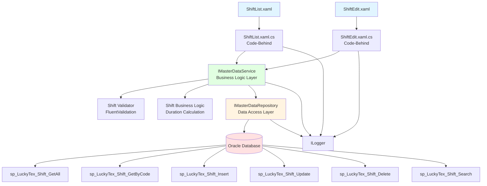
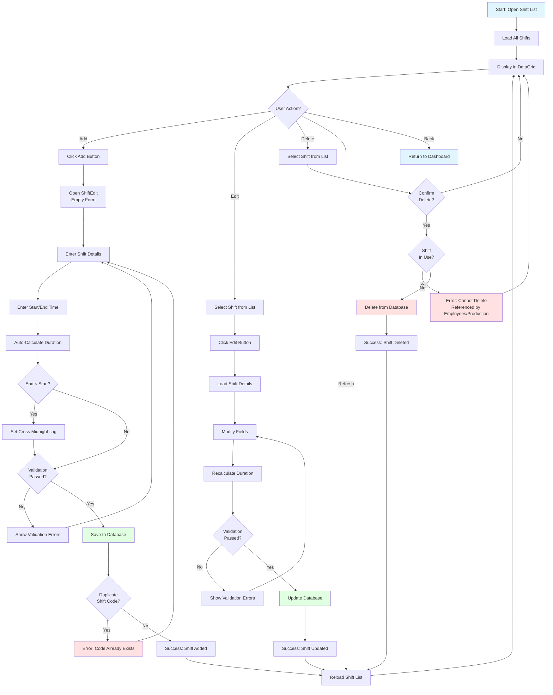

# Process: Shift Management

**Process ID**: MD-003
**Module**: 17 - Master Data
**Priority**: P1 (Foundation Module)
**Created**: 2025-10-05

---

## 1. Process Overview

### Purpose
Maintain shift master data including shift schedules, work hours, break times, and shift assignments for production planning and employee scheduling.

### Scope
- Create new shift definitions
- Update shift schedules and timings
- Manage shift status (Active, Inactive)
- Define shift work hours and break times
- Configure shift overlaps and handover times
- View shift utilization and coverage
- Delete obsolete shift records
- Search and filter shift list

### Module(s) Involved
- **Primary**: M17 - Master Data
- **Consumers**: All production modules use shift data for production scheduling and operator tracking

---

## 2. UI Files Inventory

### XAML Files
| File Path | Description | Purpose |
|-----------|-------------|---------|
| `LuckyTex.AirBag.Pages/Pages/17 - Master Data/ShiftList.xaml` | Shift list screen | Display all shifts with schedules |
| `LuckyTex.AirBag.Pages/Pages/17 - Master Data/ShiftEdit.xaml` | Shift add/edit form | CRUD operations for shift records |
| `LuckyTex.AirBag.Pages/Pages/17 - Master Data/MasterDataDashboard.xaml` | Master data dashboard | Navigation hub |

### Code-Behind Files
| File Path | Description |
|-----------|-------------|
| `LuckyTex.AirBag.Pages/Pages/17 - Master Data/ShiftList.xaml.cs` | List screen logic |
| `LuckyTex.AirBag.Pages/Pages/17 - Master Data/ShiftEdit.xaml.cs` | Form validation and save logic |

### Service Files
| File Path | Description |
|-----------|-------------|
| *(To be created)* `LuckyTex.AirBag.Core/Repositories/IMasterDataRepository.cs` | Repository interface |
| *(To be created)* `LuckyTex.AirBag.Core/Repositories/MasterDataRepository.cs` | Repository implementation |
| *(To be created)* `LuckyTex.AirBag.Core/Services/IMasterDataService.cs` | Service interface |
| *(To be created)* `LuckyTex.AirBag.Core/Services/MasterDataService.cs` | Service implementation |

---

## 3. UI Layout Description

### ShiftList.xaml

**Screen Title**: "Shift Master Data"

**Key UI Controls**:

**Search/Filter Section** (Top):
- Search textbox (`txtSearch`) - Filter by shift code or name
- Status filter dropdown (All, Active, Inactive)
- `cmdSearch` button
- `cmdClearFilter` button

**Data Grid Section** (Center):
- DataGrid displaying shift list
- Columns:
  - Shift Code (primary key)
  - Shift Name
  - Start Time
  - End Time
  - Duration (hours)
  - Break Time (minutes)
  - Status (with color indicator)
  - Description
- Row selection enabled

**Action Buttons** (Bottom):
- `cmdAdd` - Open ShiftEdit in Add mode
- `cmdEdit` - Open ShiftEdit with selected shift
- `cmdDelete` - Delete selected shift (with confirmation)
- `cmdRefresh` - Reload shift list
- `cmdBack` - Return to dashboard

---

### ShiftEdit.xaml

**Screen Title**: "Shift Details" (Add/Edit mode indicator)

**Key UI Controls**:

**Shift Information Section**:
- Shift Code (`txtShiftCode`) - Required, unique, disabled in edit mode, max 10 chars
- Shift Name (`txtShiftName`) - Required, max 50 chars
- Description (`txtDescription`) - Optional, max 200 chars

**Schedule Section**:
- Start Time (`tpStartTime`) - TimePicker, required, format: HH:mm
- End Time (`tpEndTime`) - TimePicker, required, format: HH:mm
- Duration (calculated, read-only) - Display hours between start and end
- Cross Midnight checkbox (`chkCrossMidnight`) - Checked if end time < start time

**Break Configuration Section**:
- Break 1 Start Time (`tpBreak1Start`) - TimePicker, optional
- Break 1 Duration (`txtBreak1Duration`) - Numeric, minutes
- Break 2 Start Time (`tpBreak2Start`) - TimePicker, optional
- Break 2 Duration (`txtBreak2Duration`) - Numeric, minutes
- Total Break Time (calculated, read-only) - Sum of all breaks

**Handover Section**:
- Handover Duration (`txtHandoverDuration`) - Numeric, minutes, default 15
- Handover Notes (`txtHandoverNotes`) - Multiline, optional

**Status Section**:
- Status dropdown (`cmbStatus`) - Active, Inactive
- Effective Date (`dtpEffectiveDate`) - DatePicker, required
- End Date (`dtpEndDate`) - DatePicker, optional (for inactive shifts)

**Remarks Section**:
- Remarks textbox (`txtRemarks`) - Multiline, optional

**Action Buttons**:
- `cmdSave` - Validate and save shift record
- `cmdCancel` - Close without saving

---

## 4. Component Architecture Diagram

---

## 5. Workflow Diagram

---

## 6. Business Logic Sequence Diagram

```mermaid
sequenceDiagram
    participant User
    participant ListUI as ShiftList
    participant EditUI as ShiftEdit
    participant BL as MasterDataService
    participant VAL as ShiftValidator
    participant BIZ as ShiftBusinessLogic
    participant REPO as MasterDataRepository
    participant DB as Oracle Database

    User->>ListUI: Open Shift List page
    ListUI->>BL: GetAllShifts()
    BL->>REPO: GetAllShifts()
    REPO->>DB: sp_LuckyTex_Shift_GetAll
    DB-->>REPO: Shift records
    REPO-->>BL: List<Shift>
    BL-->>ListUI: Shift data
    ListUI->>ListUI: Bind to DataGrid

    alt Add New Shift
        User->>ListUI: Click Add button
        ListUI->>EditUI: Navigate to ShiftEdit (Add mode)
        EditUI->>EditUI: Clear all fields

        User->>EditUI: Enter shift code and name
        User->>EditUI: Enter start time (e.g., 07:00)
        User->>EditUI: Enter end time (e.g., 15:00)

        EditUI->>BIZ: CalculateDuration(startTime, endTime)
        BIZ->>BIZ: Check if endTime < startTime

        alt End time < Start time (cross midnight)
            BIZ->>BIZ: Duration = (24:00 - startTime) + endTime
            BIZ->>BIZ: Set CrossMidnight flag = true
        else Normal shift
            BIZ->>BIZ: Duration = endTime - startTime
            BIZ->>BIZ: Set CrossMidnight flag = false
        end

        BIZ-->>EditUI: Duration calculated (e.g., 8 hours)
        EditUI->>EditUI: Display duration, set CrossMidnight checkbox

        User->>EditUI: Enter break times (optional)
        User->>EditUI: Click Save

        EditUI->>BL: InsertShift(shift)
        BL->>VAL: Validate(shift)
        VAL->>VAL: Check ShiftCode not empty, format valid
        VAL->>VAL: Check ShiftName not empty
        VAL->>VAL: Check StartTime and EndTime provided
        VAL->>VAL: Check EffectiveDate provided
        VAL->>VAL: Check break times within shift hours

        alt Validation passed
            VAL-->>BL: Validation OK
            BL->>REPO: InsertShift(shift)
            REPO->>DB: sp_LuckyTex_Shift_Insert

            alt Insert successful
                DB-->>REPO: Shift inserted
                REPO-->>BL: Success
                BL-->>EditUI: Success result
                EditUI->>EditUI: Show success message
                EditUI->>ListUI: Navigate back to list
                ListUI->>BL: GetAllShifts() (refresh)
                BL->>REPO: GetAllShifts()
                REPO->>DB: sp_LuckyTex_Shift_GetAll
                DB-->>REPO: Updated list
                REPO-->>BL: List<Shift>
                BL-->>ListUI: Refreshed data
                ListUI->>ListUI: Refresh DataGrid
            else Duplicate shift code
                DB-->>REPO: Error: Unique constraint violation
                REPO-->>BL: Error: Duplicate code
                BL-->>EditUI: Error message
                EditUI->>EditUI: Highlight ShiftCode field
            end
        else Validation failed
            VAL-->>BL: Validation errors
            BL-->>EditUI: Validation error list
            EditUI->>EditUI: Highlight invalid fields
            EditUI->>EditUI: Display validation messages
        end

    else Edit Existing Shift
        User->>ListUI: Select shift row
        User->>ListUI: Click Edit button
        ListUI->>BL: GetShiftByCode(shiftCode)
        BL->>REPO: GetShiftByCode(shiftCode)
        REPO->>DB: sp_LuckyTex_Shift_GetByCode
        DB-->>REPO: Shift details
        REPO-->>BL: Shift entity
        BL-->>ListUI: Shift data
        ListUI->>EditUI: Navigate to ShiftEdit (Edit mode, shift data)
        EditUI->>EditUI: Populate fields, disable ShiftCode

        User->>EditUI: Modify start/end times

        EditUI->>BIZ: CalculateDuration(newStartTime, newEndTime)
        BIZ->>BIZ: Calculate duration with cross-midnight check
        BIZ-->>EditUI: Updated duration
        EditUI->>EditUI: Update duration display

        User->>EditUI: Click Save

        EditUI->>BL: UpdateShift(shift)
        BL->>VAL: Validate(shift)

        alt Validation passed
            VAL-->>BL: OK
            BL->>REPO: UpdateShift(shift)
            REPO->>DB: sp_LuckyTex_Shift_Update
            DB-->>REPO: Rows affected = 1
            REPO-->>BL: Success
            BL-->>EditUI: Success result
            EditUI->>EditUI: Show success message
            EditUI->>ListUI: Navigate back
            ListUI->>BL: GetAllShifts() (refresh)
            BL->>REPO: GetAllShifts()
            REPO->>DB: sp_LuckyTex_Shift_GetAll
            DB-->>REPO: Updated list
            REPO-->>BL: List<Shift>
            BL-->>ListUI: Data
            ListUI->>ListUI: Refresh DataGrid
        else Validation failed
            VAL-->>BL: Errors
            BL-->>EditUI: Error list
            EditUI->>EditUI: Display errors
        end

    else Delete Shift
        User->>ListUI: Select shift row
        User->>ListUI: Click Delete button
        ListUI->>ListUI: Show confirmation dialog:<br/>"Delete shift [Code]?"

        alt User confirms
            User->>ListUI: Click Yes
            ListUI->>BL: DeleteShift(shiftCode)
            BL->>REPO: DeleteShift(shiftCode)
            REPO->>DB: sp_LuckyTex_Shift_Delete

            alt Delete successful
                DB-->>REPO: Rows affected = 1
                REPO-->>BL: Success
                BL-->>ListUI: Success result
                ListUI->>ListUI: Show success message
                ListUI->>BL: GetAllShifts() (refresh)
                BL->>REPO: GetAllShifts()
                REPO->>DB: sp_LuckyTex_Shift_GetAll
                DB-->>REPO: Updated list
                REPO-->>BL: List<Shift>
                BL-->>ListUI: Data
                ListUI->>ListUI: Refresh DataGrid
            else Foreign key constraint
                DB-->>REPO: Error: FK constraint violation
                REPO-->>BL: Error: Shift in use
                BL-->>ListUI: Error message
                ListUI->>ListUI: Show error:<br/>"Cannot delete - shift is assigned to employees or production"
            end
        else User cancels
            User->>ListUI: Click No
            ListUI->>ListUI: Close dialog, no action
        end
    end
```

---

## 7. Data Flow

### Input Data
| Data Element | Source | Format | Validation |
|--------------|--------|--------|------------|
| Shift Code | User input | String, 10 chars max | Required, unique, alphanumeric |
| Shift Name | User input | String, 50 chars | Required |
| Description | User input | String, 200 chars | Optional |
| Start Time | TimePicker | TimeSpan (HH:mm) | Required, format: HH:mm (00:00-23:59) |
| End Time | TimePicker | TimeSpan (HH:mm) | Required, format: HH:mm (00:00-23:59) |
| Cross Midnight | Calculated | Boolean | Auto-set if end < start |
| Break 1 Start | TimePicker | TimeSpan | Optional, must be between shift start/end |
| Break 1 Duration | User input | Integer (minutes) | Optional, must be > 0 if start provided |
| Break 2 Start | TimePicker | TimeSpan | Optional, must be between shift start/end |
| Break 2 Duration | User input | Integer (minutes) | Optional, must be > 0 if start provided |
| Handover Duration | User input | Integer (minutes) | Optional, default 15 |
| Status | Dropdown | String | Required (Active/Inactive) |
| Effective Date | DatePicker | DateTime | Required |
| End Date | DatePicker | DateTime | Optional, must be > effective date |
| Remarks | User input | String, 500 chars | Optional |

### Output Data
| Data Element | Destination | Format | Purpose |
|--------------|-------------|--------|---------|
| Shift Record | tblShift | Database row | Master data storage |
| Duration (hours) | UI | Decimal | Calculated display field |
| Total Break Time (minutes) | UI | Integer | Calculated display field |
| Success/Error Message | UI | String | User feedback |
| Shift List | DataGrid | Collection | Display all shifts |

### Data Transformations
1. **Shift Code**: Uppercase transformation
2. **Duration Calculation**:
   - If CrossMidnight: (24:00 - StartTime) + EndTime
   - Else: EndTime - StartTime
3. **Total Break Time**: Sum(Break1Duration + Break2Duration)
4. **TimeSpan to String**: HH:mm format for database storage
5. **Status**: Enum to string

---

## 8. Database Operations

### Stored Procedures Used

#### sp_LuckyTex_Shift_GetAll
- **Purpose**: Retrieve all shift records
- **Parameters**: None
- **Returns**: All columns from tblShift
- **Tables Read**: tblShift

#### sp_LuckyTex_Shift_GetByCode
- **Purpose**: Retrieve single shift by code
- **Parameters**: @ShiftCode VARCHAR(10)
- **Returns**: Shift details
- **Tables Read**: tblShift

#### sp_LuckyTex_Shift_Insert
- **Purpose**: Insert new shift record
- **Parameters**:
  - @ShiftCode VARCHAR(10)
  - @ShiftName VARCHAR(50)
  - @Description VARCHAR(200)
  - @StartTime VARCHAR(5) -- HH:mm format
  - @EndTime VARCHAR(5)
  - @CrossMidnight BIT
  - @DurationHours DECIMAL(5,2)
  - @Break1Start VARCHAR(5)
  - @Break1Duration INT
  - @Break2Start VARCHAR(5)
  - @Break2Duration INT
  - @HandoverDuration INT
  - @Status VARCHAR(20)
  - @EffectiveDate DATETIME
  - @EndDate DATETIME
  - @Remarks VARCHAR(500)
  - @CreatedBy VARCHAR(10)
  - @CreatedDate DATETIME
- **Returns**: Success flag
- **Tables Written**: tblShift

#### sp_LuckyTex_Shift_Update
- **Purpose**: Update existing shift record
- **Parameters**: Same as Insert (ShiftCode is WHERE condition)
- **Returns**: Rows affected
- **Tables Written**: tblShift

#### sp_LuckyTex_Shift_Delete
- **Purpose**: Delete shift record
- **Parameters**: @ShiftCode VARCHAR(10)
- **Returns**: Rows affected
- **Tables Written**: tblShift
- **Constraints**: FK checks from tblEmployee, production tables

#### sp_LuckyTex_Shift_Search
- **Purpose**: Search/filter shifts
- **Parameters**:
  - @SearchText VARCHAR(100) (optional)
  - @Status VARCHAR(20) (optional)
- **Returns**: Filtered shift list
- **Tables Read**: tblShift

### Table Structure

**tblShift**:
- PK: ShiftCode VARCHAR(10)
- ShiftName VARCHAR(50) NOT NULL
- Description VARCHAR(200)
- StartTime VARCHAR(5) NOT NULL -- HH:mm format
- EndTime VARCHAR(5) NOT NULL
- CrossMidnight BIT NOT NULL
- DurationHours DECIMAL(5,2) NOT NULL
- Break1Start VARCHAR(5)
- Break1Duration INT
- Break2Start VARCHAR(5)
- Break2Duration INT
- TotalBreakMinutes INT (calculated)
- HandoverDuration INT
- HandoverNotes VARCHAR(200)
- Status VARCHAR(20) NOT NULL
- EffectiveDate DATETIME NOT NULL
- EndDate DATETIME
- Remarks VARCHAR(500)
- CreatedBy VARCHAR(10)
- CreatedDate DATETIME
- ModifiedBy VARCHAR(10)
- ModifiedDate DATETIME

---

## 9. Implementation Checklist

### Phase 1: Repository Layer
- [ ] Create `Shift` entity model
  - [ ] Properties matching tblShift columns
  - [ ] Computed property: TotalBreakMinutes
  - [ ] Data annotations for validation
- [ ] Extend `IMasterDataRepository` interface
  - [ ] GetAllShifts() method
  - [ ] GetShiftByCode(string code) method
  - [ ] InsertShift(Shift shift) method
  - [ ] UpdateShift(Shift shift) method
  - [ ] DeleteShift(string code) method
  - [ ] SearchShifts(ShiftSearchCriteria criteria) method
- [ ] Implement in `MasterDataRepository`
  - [ ] Map all stored procedures
  - [ ] TimeSpan to string conversion for database
  - [ ] Error handling and logging
- [ ] Unit tests for repository

### Phase 2: Service Layer
- [ ] Extend `IMasterDataService` interface
  - [ ] GetAllShifts() method
  - [ ] GetShiftByCode(string code) method
  - [ ] InsertShift(Shift shift) method
  - [ ] UpdateShift(Shift shift) method
  - [ ] DeleteShift(string code) method
  - [ ] SearchShifts(ShiftSearchCriteria criteria) method
- [ ] Create `ShiftBusinessLogic` helper class
  - [ ] CalculateDuration(startTime, endTime) method
  - [ ] IsCrossMidnight(startTime, endTime) method
  - [ ] CalculateTotalBreak(break1, break2) method
  - [ ] ValidateBreakTimes(shift) method
- [ ] Create `ShiftValidator` using FluentValidation
  - [ ] ShiftCode: Required, max 10 chars
  - [ ] ShiftName: Required, max 50 chars
  - [ ] StartTime, EndTime: Required, valid time format
  - [ ] EffectiveDate: Required
  - [ ] EndDate: If provided, must be > EffectiveDate
  - [ ] Break times: Must be within shift hours
  - [ ] Break durations: Must be > 0 if break start provided
- [ ] Implement in `MasterDataService`
  - [ ] Constructor with IMasterDataRepository, IValidator<Shift>, ILogger
  - [ ] Call ShiftBusinessLogic for calculations
  - [ ] Validation before Insert/Update
- [ ] Unit tests for service
  - [ ] Test duration calculation (normal and cross-midnight)
  - [ ] Test validation errors
  - [ ] Test successful CRUD operations

### Phase 3: UI Refactoring
- [ ] Update `ShiftList.xaml.cs`
  - [ ] Inject IMasterDataService
  - [ ] Update Page_Loaded to call GetAllShifts
  - [ ] Handle ServiceResult
- [ ] Update `ShiftEdit.xaml.cs`
  - [ ] Inject IMasterDataService
  - [ ] Support Add vs Edit modes
  - [ ] Disable ShiftCode in Edit mode
  - [ ] Real-time duration calculation on time change
  - [ ] Auto-set CrossMidnight checkbox
  - [ ] Calculate total break time
  - [ ] Update cmdSave_Click to call Insert or Update
  - [ ] Display validation errors
- [ ] XAML data binding
  - [ ] TimePicker controls for times
  - [ ] Calculated fields (duration, total break)
  - [ ] Value converter for Status color
- [ ] User-friendly error messages

### Phase 4: Integration Testing
- [ ] Test with real database
  - [ ] Add normal shift (08:00-17:00)
  - [ ] Add cross-midnight shift (22:00-06:00)
  - [ ] Duration calculation accuracy
  - [ ] Edit shift times (recalculation)
  - [ ] Break time validation (within shift hours)
  - [ ] Delete shift not in use (success)
  - [ ] Delete shift assigned to employees (error)
- [ ] UI testing
  - [ ] Real-time duration calculation
  - [ ] Cross-midnight checkbox auto-update
  - [ ] Break time total calculation
- [ ] Performance testing

### Phase 5: Deployment Preparation
- [ ] Code review
- [ ] Unit tests passing (80%+)
- [ ] Integration tests passing
- [ ] UAT completed
- [ ] Production deployment

---

**Document Version**: 1.0
**Last Updated**: 2025-10-05
**Status**: Ready for Implementation
**Estimated Effort**: 2-3 days (1 developer)
**Dependencies**: None (foundation data)
**Special Notes**: Duration calculation logic is critical - must handle cross-midnight shifts correctly
