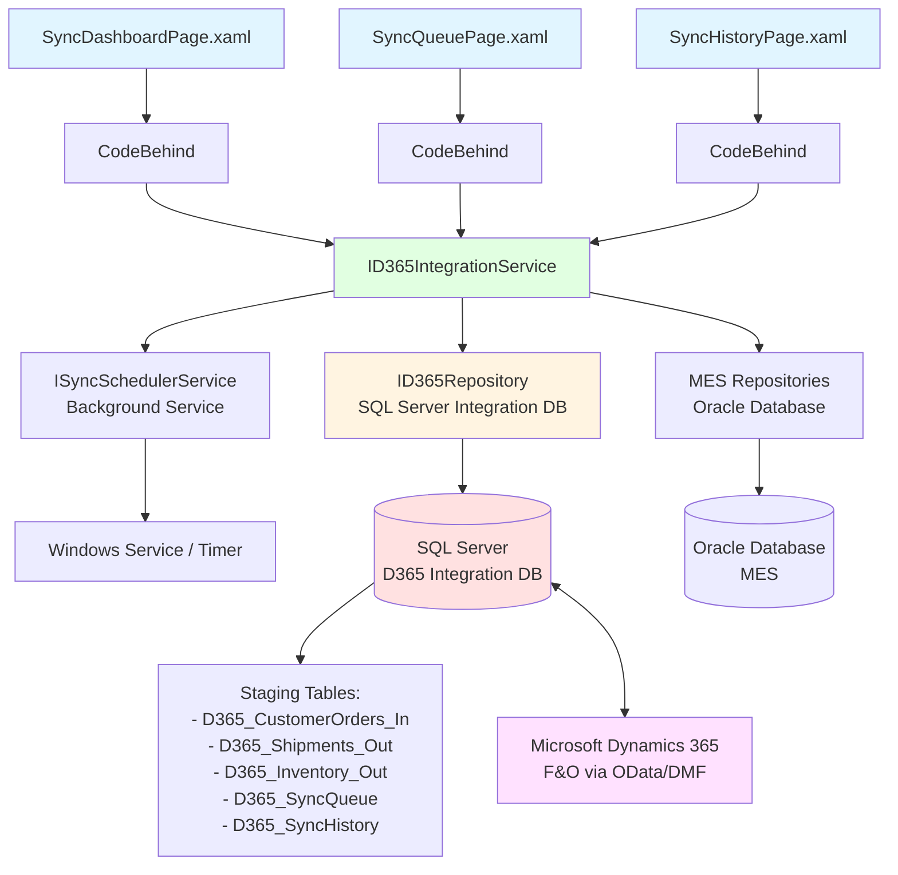
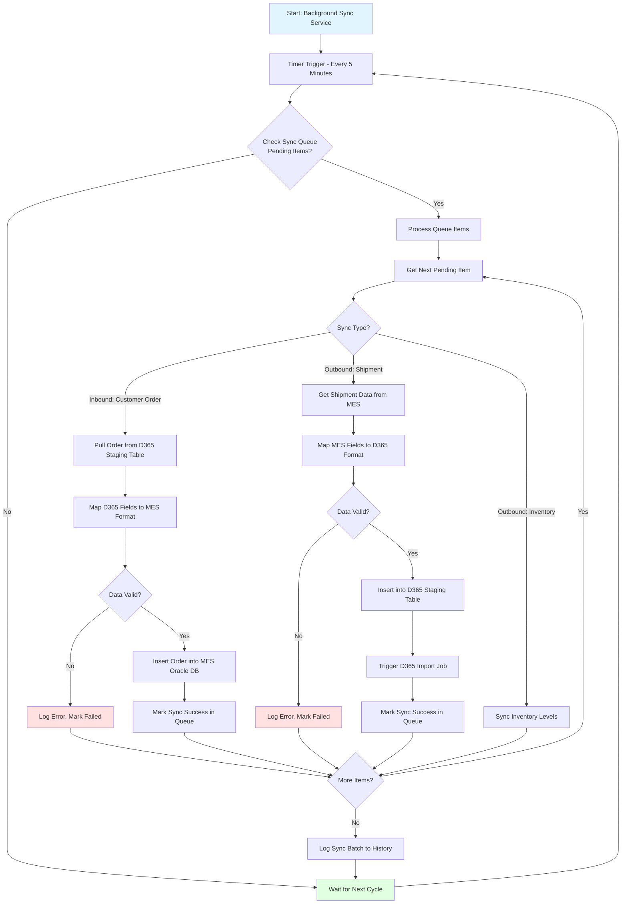
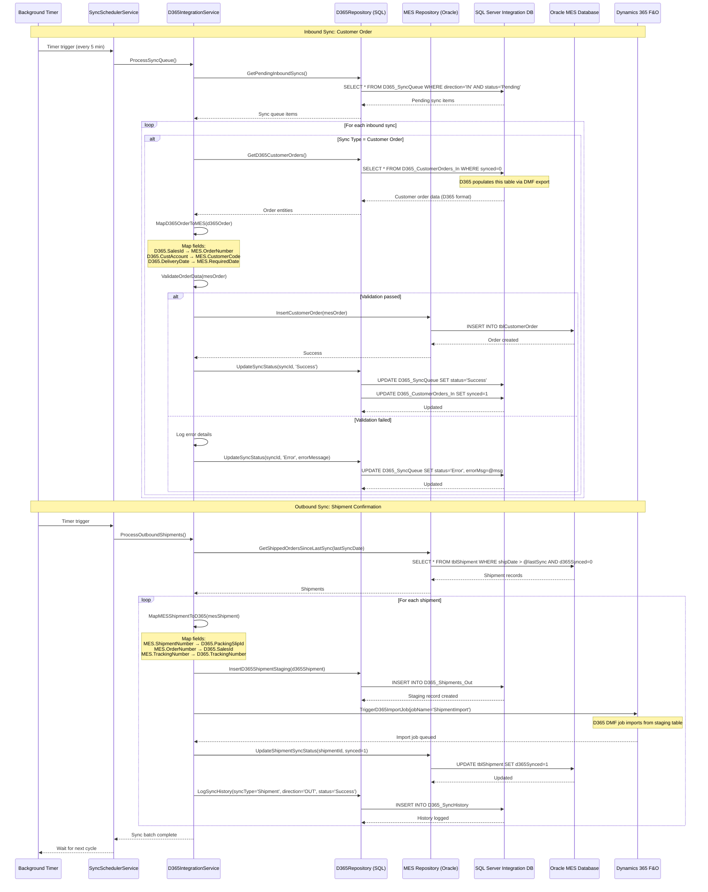

# Process: ERP Synchronization (D365 Integration)

**Process ID**: D365-001
**Module**: 19 - D365 Integration
**Priority**: P5 (Support Module)
**Created**: 2025-10-06

---

## 1. Process Overview

### Purpose
Synchronize production data between LuckyTex AirBag MES and Microsoft Dynamics 365 Finance & Operations ERP system. Enable bidirectional data exchange for customer orders, inventory levels, shipments, and production status to maintain data consistency across systems.

### Scope
- **Inbound (D365 → MES)**:
  - Customer order download
  - Product master data sync
  - Customer master data sync
- **Outbound (MES → D365)**:
  - Shipment confirmations
  - Inventory level updates
  - Production completion reports
- **Synchronization Management**:
  - Sync queue monitoring
  - Error handling and retry logic
  - Sync history tracking

### Module(s) Involved
- **Primary**: M19 - D365 Integration
- **Data Sources**: All production modules (especially Shipping, Warehouse)
- **Target System**: Microsoft Dynamics 365 F&O via SQL Server integration database

---

## 2. UI Files Inventory

### XAML Files
| File Path | Description | Purpose |
|-----------|-------------|---------|
| `LuckyTex.AirBag.Pages/Pages/19 - D365Integration/SyncDashboardPage.xaml` | Sync monitoring dashboard | Monitor sync status |
| `LuckyTex.AirBag.Pages/Pages/19 - D365Integration/SyncQueuePage.xaml` | Sync queue viewer | View pending syncs |
| `LuckyTex.AirBag.Pages/Pages/19 - D365Integration/SyncHistoryPage.xaml` | Sync history | View completed syncs |
| `LuckyTex.AirBag.Pages/Pages/19 - D365Integration/D365MenuPage.xaml` | Module menu | Navigation |

### Code-Behind Files
| File Path | Description |
|-----------|-------------|
| `LuckyTex.AirBag.Pages/Pages/19 - D365Integration/SyncDashboardPage.xaml.cs` | Dashboard logic |
| `LuckyTex.AirBag.Pages/Pages/19 - D365Integration/SyncQueuePage.xaml.cs` | Queue display |
| `LuckyTex.AirBag.Pages/Pages/19 - D365Integration/SyncHistoryPage.xaml.cs` | History display |

### Service Files
| File Path | Description |
|-----------|-------------|
| *(To be created)* `LuckyTex.AirBag.Core/Repositories/D365Repository.cs` | Repository (SQL Server integration DB) |
| *(To be created)* `LuckyTex.AirBag.Core/Services/D365IntegrationService.cs` | Service layer |
| *(To be created)* `LuckyTex.AirBag.Core/Services/SyncSchedulerService.cs` | Background sync scheduler |

---

## 3. UI Layout Description

### SyncDashboardPage.xaml

**Screen Title**: "D365 Integration Dashboard"

**Summary Cards**:
- Syncs pending (count)
- Syncs today (count)
- Sync errors (count)
- Last successful sync (timestamp)

**Sync Status Section**:
- **Inbound Syncs**:
  - Customer orders: Last sync time, Status (OK/Error)
  - Product master: Last sync, Status
  - Customer master: Last sync, Status
- **Outbound Syncs**:
  - Shipments: Last sync, Status
  - Inventory: Last sync, Status
  - Production: Last sync, Status

**Recent Activity DataGrid**:
- Columns: Sync Type, Direction (In/Out), Status, Record Count, Timestamp, Error Message
- Row click: View details

**Action Buttons**:
- `cmdSyncNow` - Manual sync trigger (dropdown: select sync type)
- `cmdViewQueue` - View sync queue
- `cmdViewHistory` - View sync history
- `cmdRefresh` - Refresh dashboard

### SyncQueuePage.xaml

**Screen Title**: "Sync Queue"

**Queue DataGrid**:
- Columns: Queue ID, Sync Type, Direction, Data Payload (summary), Status (Pending/Processing/Error), Created Date, Retry Count
- Row actions: View, Retry, Delete

**Action Buttons**:
- `cmdRetryAll` - Retry all failed syncs
- `cmdClearErrors` - Clear error records
- `cmdExport` - Export queue to Excel

### SyncHistoryPage.xaml

**Screen Title**: "Sync History"

**Filter Section**:
- Date range
- Sync type filter
- Status filter (All, Success, Error)
- `cmdSearch`

**History DataGrid**:
- Columns: Sync ID, Type, Direction, Records Processed, Status, Start Time, End Time, Duration (sec), Error Message

---

## 4. Component Architecture Diagram

---

## 5. Workflow Diagram

---

## 6. Business Logic Sequence Diagram

---

## 7. Data Flow

### Inbound Data (D365 → MES)

| D365 Entity | D365 Field | MES Table | MES Field | Transformation |
|-------------|------------|-----------|-----------|----------------|
| Sales Order | SalesId | tblCustomerOrder | OrderNumber | Direct mapping |
| Sales Order | CustAccount | tblCustomerOrder | CustomerCode | Lookup customer ID |
| Sales Order | DeliveryDate | tblCustomerOrder | RequiredDate | Date format conversion |
| Sales Order Line | ItemId | tblOrderLine | ProductCode | Product lookup |
| Sales Order Line | QtyOrdered | tblOrderLine | Quantity | Decimal |
| Customer | AccountNum | tblCustomer | CustomerCode | Direct mapping |
| Customer | Name | tblCustomer | CustomerName | Direct mapping |

### Outbound Data (MES → D365)

| MES Table | MES Field | D365 Entity | D365 Field | Transformation |
|-----------|-----------|-------------|------------|----------------|
| tblShipment | ShipmentNumber | Packing Slip | PackingSlipId | Direct mapping |
| tblShipment | OrderNumber | Sales Order | SalesId | Direct mapping |
| tblShipment | TrackingNumber | Packing Slip | TrackingNumber | Direct mapping |
| tblShipment | ShipDate | Packing Slip | DeliveryDate | Date format |
| tblInventory | YarnLotNumber | Inventory Journal | ItemId | Item mapping |
| tblInventory | QuantityOnHand | Inventory Journal | Qty | Decimal |

---

## 8. Database Operations

### SQL Server Integration Database

#### Staging Tables

**D365_CustomerOrders_In** (Inbound):
- SalesId, CustAccount, DeliveryDate, Status, Synced, CreatedDate

**D365_Shipments_Out** (Outbound):
- PackingSlipId, SalesId, TrackingNumber, ShipDate, Synced, CreatedDate

**D365_Inventory_Out** (Outbound):
- ItemId, Qty, TransDate, Synced, CreatedDate

**D365_SyncQueue**:
- SyncId, SyncType, Direction, Status, DataPayload, CreatedDate, ProcessedDate, RetryCount, ErrorMessage

**D365_SyncHistory**:
- HistoryId, SyncType, Direction, RecordCount, Status, StartTime, EndTime, ErrorMessage

### Stored Procedures

#### sp_D365_EnqueueSync
- **Purpose**: Add sync to queue
- **Parameters**: @SyncType, @Direction, @DataPayload
- **Returns**: Queue ID

#### sp_D365_ProcessQueue
- **Purpose**: Get pending queue items
- **Parameters**: @Direction (IN/OUT), @Limit
- **Returns**: Pending syncs

#### sp_D365_UpdateSyncStatus
- **Purpose**: Update sync status
- **Parameters**: @SyncId, @Status, @ErrorMessage
- **Returns**: Success flag

#### sp_D365_LogSyncHistory
- **Purpose**: Log sync to history
- **Parameters**: @SyncType, @Direction, @RecordCount, @Status, @ErrorMessage
- **Returns**: History ID

---

## 9. Implementation Checklist

### Phase 1: Infrastructure Setup
- [ ] Create SQL Server Integration Database
- [ ] Create staging tables (IN/OUT)
- [ ] Create sync queue and history tables
- [ ] Set up D365 DMF data entities
- [ ] Configure D365 OData endpoints

### Phase 2: Repository Layer
- [ ] Create `ID365Repository` interface (SQL Server)
  - [ ] EnqueueSync(sync) method
  - [ ] GetPendingSyncs(direction) method
  - [ ] UpdateSyncStatus(syncId, status, error) method
  - [ ] GetD365CustomerOrders() method (inbound)
  - [ ] InsertD365Shipment(shipment) method (outbound)
  - [ ] InsertD365Inventory(inventory) method (outbound)
  - [ ] LogSyncHistory(history) method
- [ ] Implement in `D365Repository`
- [ ] Unit tests

### Phase 3: Service Layer
- [ ] Create `ID365IntegrationService` interface
  - [ ] ProcessInboundOrders() method
  - [ ] ProcessOutboundShipments() method
  - [ ] ProcessOutboundInventory() method
  - [ ] EnqueueManualSync(syncType) method
  - [ ] GetSyncQueue() method
  - [ ] GetSyncHistory(filters) method
- [ ] Create `ISyncSchedulerService` interface
  - [ ] StartScheduler() method
  - [ ] StopScheduler() method
  - [ ] ProcessSyncQueue() method (background task)
- [ ] Implement services with field mapping
- [ ] Unit tests

### Phase 4: Background Service
- [ ] Create Windows Service or Timer-based background task
- [ ] Configure polling interval (default: 5 minutes)
- [ ] Error handling and retry logic (max 3 retries)
- [ ] Logging (to file and database)

### Phase 5: UI Refactoring
- [ ] Update `SyncDashboardPage.xaml.cs`
  - [ ] Inject ID365IntegrationService
  - [ ] Display sync status
  - [ ] Manual sync trigger
- [ ] Update `SyncQueuePage.xaml.cs`
  - [ ] Display queue
  - [ ] Retry functionality
- [ ] Update `SyncHistoryPage.xaml.cs`
  - [ ] Display history with filters

### Phase 6: Integration Testing
- [ ] Test inbound order sync (D365 → MES)
- [ ] Test outbound shipment sync (MES → D365)
- [ ] Test outbound inventory sync
- [ ] Test error handling and retry
- [ ] Test D365 DMF job triggering
- [ ] Performance testing (large batches)

### Phase 7: Deployment
- [ ] Deploy SQL Server Integration DB
- [ ] Deploy background sync service
- [ ] Configure D365 integration endpoints
- [ ] UAT with test D365 environment
- [ ] Production deployment
- [ ] Monitor first week of syncs

---

**Document Version**: 1.0
**Last Updated**: 2025-10-06
**Status**: Ready for Implementation
**Estimated Effort**: 5-7 days (complex integration)
