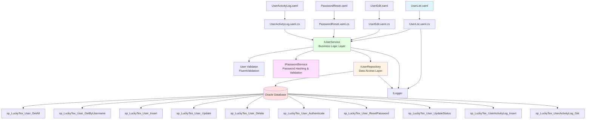
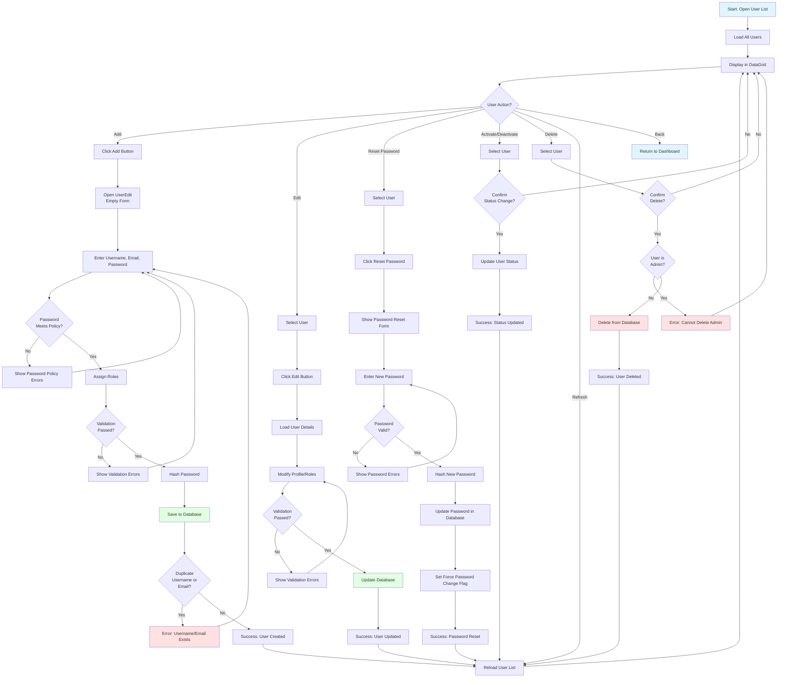

# Process: User Management

**Process ID**: UM-001
**Module**: 20 - User Management
**Priority**: P1 (Foundation Module)
**Created**: 2025-10-05

---

## 1. Process Overview

### Purpose
Maintain system user accounts including user registration, authentication credentials, profile management, password reset, and account activation/deactivation for all MES system users.

### Scope
- Create new user accounts
- Update user profiles and credentials
- Reset user passwords (admin and self-service)
- Activate/deactivate user accounts
- Manage user-employee linkage (link user to employee master data)
- Track user login history and activity
- Enforce password policies
- Delete obsolete user accounts
- Search and filter user lists

### Module(s) Involved
- **Primary**: M20 - User Management
- **Related**: M17 - Master Data (employee linkage)
- **Consumers**: All modules (authentication and authorization)

---

## 2. UI Files Inventory

### XAML Files
| File Path | Description | Purpose |
|-----------|-------------|---------|
| `LuckyTex.AirBag.Pages/Pages/20 - User Management/UserList.xaml` | User list screen | Display all users with status |
| `LuckyTex.AirBag.Pages/Pages/20 - User Management/UserEdit.xaml` | User add/edit form | CRUD operations for user accounts |
| `LuckyTex.AirBag.Pages/Pages/20 - User Management/PasswordReset.xaml` | Password reset form | Admin password reset |
| `LuckyTex.AirBag.Pages/Pages/20 - User Management/UserActivityLog.xaml` | User activity log screen | View login history and actions |
| `LuckyTex.AirBag.Pages/Pages/20 - User Management/UserDashboard.xaml` | User management dashboard | Navigation hub |

### Code-Behind Files
| File Path | Description |
|-----------|-------------|
| `LuckyTex.AirBag.Pages/Pages/20 - User Management/UserList.xaml.cs` | List screen logic |
| `LuckyTex.AirBag.Pages/Pages/20 - User Management/UserEdit.xaml.cs` | Form validation and save logic |
| `LuckyTex.AirBag.Pages/Pages/20 - User Management/PasswordReset.xaml.cs` | Password reset logic |
| `LuckyTex.AirBag.Pages/Pages/20 - User Management/UserActivityLog.xaml.cs` | Activity log display |

### Service Files
| File Path | Description |
|-----------|-------------|
| *(To be created)* `LuckyTex.AirBag.Core/Repositories/IUserRepository.cs` | Repository interface |
| *(To be created)* `LuckyTex.AirBag.Core/Repositories/UserRepository.cs` | Repository implementation |
| *(To be created)* `LuckyTex.AirBag.Core/Services/IUserService.cs` | Service interface |
| *(To be created)* `LuckyTex.AirBag.Core/Services/UserService.cs` | Service implementation |
| *(To be created)* `LuckyTex.AirBag.Core/Services/IPasswordService.cs` | Password hashing/validation service |
| *(To be created)* `LuckyTex.AirBag.Core/Services/PasswordService.cs` | Password service implementation |

---

## 3. UI Layout Description

### UserList.xaml

**Screen Title**: "User Management"

**Key UI Controls**:

**Search/Filter Section** (Top):
- Search textbox (`txtSearch`) - Filter by username or email
- Status filter dropdown (All, Active, Inactive, Locked)
- Role filter dropdown (All roles + specific roles)
- `cmdSearch` button
- `cmdClearFilter` button

**Data Grid Section** (Center):
- DataGrid displaying user list
- Columns:
  - Username (primary key)
  - Full Name (from linked employee or user profile)
  - Email
  - Role(s) (comma-separated if multiple)
  - Employee ID (linked employee)
  - Status (with color indicator: Active=Green, Inactive=Gray, Locked=Red)
  - Last Login Date
  - Created Date
- Row selection enabled

**Action Buttons** (Bottom):
- `cmdAdd` - Open UserEdit in Add mode
- `cmdEdit` - Open UserEdit with selected user
- `cmdResetPassword` - Open PasswordReset dialog
- `cmdActivate` - Activate selected user account
- `cmdDeactivate` - Deactivate selected user account
- `cmdUnlock` - Unlock locked account
- `cmdDelete` - Delete selected user (with confirmation)
- `cmdActivityLog` - View user activity log
- `cmdRefresh` - Reload user list
- `cmdBack` - Return to dashboard

---

### UserEdit.xaml

**Screen Title**: "User Details" (Add/Edit mode indicator)

**Key UI Controls**:

**User Account Section**:
- Username (`txtUsername`) - Required, unique, disabled in edit mode, max 50 chars, alphanumeric + underscore
- Email (`txtEmail`) - Required, unique, email format, max 100 chars
- Status dropdown (`cmbStatus`) - Active, Inactive, Locked (read-only, managed by buttons)

**Password Section** (Add mode only):
- Password (`txtPassword`) - PasswordBox, required in Add mode, hidden in Edit mode
- Confirm Password (`txtConfirmPassword`) - PasswordBox, must match password
- Password strength indicator (Weak/Medium/Strong)
- Show password policy requirements:
  - Minimum 8 characters
  - At least 1 uppercase letter
  - At least 1 lowercase letter
  - At least 1 digit
  - At least 1 special character

**Employee Linkage Section**:
- Link to Employee (`cmbEmployee`) - Dropdown from tblEmployee, optional
- If linked: Display employee name, department, position
- If not linked: Manual entry of full name

**Profile Section**:
- Full Name (`txtFullName`) - Required if not linked to employee, max 100 chars
- Phone (`txtPhone`) - Optional, max 20 chars
- Department (`txtDepartment`) - Auto-filled if linked to employee, else manual

**Role Assignment Section**:
- Available Roles list (CheckListBox or multi-select)
  - Administrator
  - Production Manager
  - Quality Manager
  - Warehouse Manager
  - Operator
  - Read-Only
- Assign roles by checkbox

**Settings Section**:
- Force Password Change on Next Login (`chkForcePasswordChange`) - Checkbox
- Account Expiration Date (`dtpAccountExpiration`) - DatePicker, optional

**Remarks Section**:
- Remarks textbox (`txtRemarks`) - Multiline, optional

**Action Buttons**:
- `cmdSave` - Validate and save user account
- `cmdCancel` - Close without saving

---

### PasswordReset.xaml

**Screen Title**: "Reset Password"

**Key UI Controls**:

**User Information Section** (Read-only):
- Username display
- Full Name display
- Email display

**Password Reset Section**:
- New Password (`txtNewPassword`) - PasswordBox, required
- Confirm New Password (`txtConfirmNewPassword`) - PasswordBox, must match
- Password strength indicator
- Force Password Change on Next Login (`chkForcePasswordChange`) - Checkbox, default checked

**Action Buttons**:
- `cmdReset` - Reset password and save
- `cmdCancel` - Close without resetting

---

### UserActivityLog.xaml

**Screen Title**: "User Activity Log"

**Key UI Controls**:

**Filter Section**:
- Username filter (if viewing all users)
- Date Range (from/to DatePickers)
- Action Type filter (Login, Logout, Create, Update, Delete, etc.)
- `cmdFilter` button

**Data Grid Section**:
- DataGrid displaying activity log
- Columns:
  - Timestamp
  - Username
  - Action Type
  - Description
  - IP Address
  - Module
  - Success/Failure
- Sort by timestamp descending (latest first)

**Action Buttons**:
- `cmdExport` - Export log to Excel
- `cmdBack` - Return to user list

---

## 4. Component Architecture Diagram

---

## 5. Workflow Diagram

---

## 6. Business Logic Sequence Diagram

```mermaid
sequenceDiagram
    participant User as Administrator
    participant ListUI as UserList
    participant EditUI as UserEdit
    participant PwdUI as PasswordReset
    participant BL as UserService
    participant PWD as PasswordService
    participant VAL as UserValidator
    participant REPO as UserRepository
    participant DB as Oracle Database

    User->>ListUI: Open User Management page
    ListUI->>BL: GetAllUsers()
    BL->>REPO: GetAllUsers()
    REPO->>DB: sp_LuckyTex_User_GetAll
    DB-->>REPO: User records (without passwords)
    REPO-->>BL: List<User>
    BL-->>ListUI: User data
    ListUI->>ListUI: Bind to DataGrid

    alt Add New User
        User->>ListUI: Click Add button
        ListUI->>EditUI: Navigate to UserEdit (Add mode)
        EditUI->>EditUI: Clear all fields

        User->>EditUI: Enter username (e.g., "john.doe")
        User->>EditUI: Enter email (e.g., "john.doe@luckytex.com")
        User->>EditUI: Enter password

        EditUI->>PWD: ValidatePasswordPolicy(password)
        PWD->>PWD: Check length >= 8
        PWD->>PWD: Check has uppercase
        PWD->>PWD: Check has lowercase
        PWD->>PWD: Check has digit
        PWD->>PWD: Check has special char

        alt Password policy passed
            PWD-->>EditUI: Validation OK, strength: Strong
            EditUI->>EditUI: Show green checkmark, enable Save

            User->>EditUI: Confirm password (must match)
            User->>EditUI: Select employee link (optional)
            User->>EditUI: Assign roles (e.g., Operator)
            User->>EditUI: Click Save

            EditUI->>BL: InsertUser(user)
            BL->>VAL: Validate(user)
            VAL->>VAL: Check Username not empty, alphanumeric
            VAL->>VAL: Check Email not empty, valid format
            VAL->>VAL: Check Password and ConfirmPassword match
            VAL->>VAL: Check at least one role assigned

            alt Validation passed
                VAL-->>BL: Validation OK
                BL->>PWD: HashPassword(user.Password)
                PWD->>PWD: Generate salt
                PWD->>PWD: Hash password with salt (SHA256 or bcrypt)
                PWD-->>BL: Hashed password + salt

                BL->>REPO: InsertUser(user with hashed password)
                REPO->>DB: sp_LuckyTex_User_Insert

                alt Insert successful
                    DB-->>REPO: User inserted
                    REPO-->>BL: Success

                    BL->>REPO: InsertActivityLog(username, "UserCreated", admin)
                    REPO->>DB: sp_LuckyTex_UserActivityLog_Insert
                    DB-->>REPO: Log inserted

                    BL-->>EditUI: Success result
                    EditUI->>EditUI: Show success message
                    EditUI->>ListUI: Navigate back to list
                    ListUI->>BL: GetAllUsers() (refresh)
                    BL->>REPO: GetAllUsers()
                    REPO->>DB: sp_LuckyTex_User_GetAll
                    DB-->>REPO: Updated list
                    REPO-->>BL: List<User>
                    BL-->>ListUI: Refreshed data
                    ListUI->>ListUI: Refresh DataGrid
                else Duplicate username or email
                    DB-->>REPO: Error: Unique constraint violation
                    REPO-->>BL: Error: Duplicate username/email
                    BL-->>EditUI: Error message
                    EditUI->>EditUI: Highlight Username or Email field
                end
            else Validation failed
                VAL-->>BL: Validation errors
                BL-->>EditUI: Validation error list
                EditUI->>EditUI: Highlight invalid fields
                EditUI->>EditUI: Display validation messages
            end
        else Password policy failed
            PWD-->>EditUI: Policy violation errors
            EditUI->>EditUI: Show red X, display policy requirements
            EditUI->>EditUI: Disable Save button
        end

    else Reset Password
        User->>ListUI: Select user row
        User->>ListUI: Click Reset Password button
        ListUI->>PwdUI: Navigate to PasswordReset (username)
        PwdUI->>BL: GetUserByUsername(username)
        BL->>REPO: GetUserByUsername(username)
        REPO->>DB: sp_LuckyTex_User_GetByUsername
        DB-->>REPO: User details (without password)
        REPO-->>BL: User entity
        BL-->>PwdUI: User data
        PwdUI->>PwdUI: Display username, email (read-only)

        User->>PwdUI: Enter new password
        PwdUI->>PWD: ValidatePasswordPolicy(newPassword)

        alt Password valid
            PWD-->>PwdUI: OK
            User->>PwdUI: Confirm new password
            User->>PwdUI: Check "Force password change on next login"
            User->>PwdUI: Click Reset

            PwdUI->>BL: ResetPassword(username, newPassword, forceChange)
            BL->>PWD: HashPassword(newPassword)
            PWD-->>BL: Hashed password + salt
            BL->>REPO: UpdatePassword(username, hashedPassword, salt, forceChange)
            REPO->>DB: sp_LuckyTex_User_ResetPassword

            alt Reset successful
                DB-->>REPO: Password updated
                REPO-->>BL: Success
                BL->>REPO: InsertActivityLog(username, "PasswordReset", admin)
                REPO->>DB: sp_LuckyTex_UserActivityLog_Insert
                BL-->>PwdUI: Success result
                PwdUI->>PwdUI: Show success message
                PwdUI->>ListUI: Navigate back
                ListUI->>BL: GetAllUsers() (refresh)
                BL->>REPO: GetAllUsers()
                REPO->>DB: sp_LuckyTex_User_GetAll
                DB-->>REPO: Updated list
                REPO-->>BL: List<User>
                BL-->>ListUI: Data
                ListUI->>ListUI: Refresh DataGrid
            end
        else Password invalid
            PWD-->>PwdUI: Policy errors
            PwdUI->>PwdUI: Display errors
        end

    else Activate/Deactivate User
        User->>ListUI: Select user row
        User->>ListUI: Click Activate or Deactivate button
        ListUI->>ListUI: Show confirmation dialog:<br/>"Activate/Deactivate user [Username]?"

        User->>ListUI: Click Yes
        ListUI->>BL: UpdateUserStatus(username, newStatus)
        BL->>REPO: UpdateUserStatus(username, newStatus)
        REPO->>DB: sp_LuckyTex_User_UpdateStatus

        alt Update successful
            DB-->>REPO: Status updated
            REPO-->>BL: Success
            BL->>REPO: InsertActivityLog(username, "StatusChanged", admin)
            REPO->>DB: sp_LuckyTex_UserActivityLog_Insert
            BL-->>ListUI: Success result
            ListUI->>ListUI: Show success message
            ListUI->>BL: GetAllUsers() (refresh)
            BL->>REPO: GetAllUsers()
            REPO->>DB: sp_LuckyTex_User_GetAll
            DB-->>REPO: Updated list
            REPO-->>BL: List<User>
            BL-->>ListUI: Data
            ListUI->>ListUI: Refresh DataGrid
        end

    else Delete User
        User->>ListUI: Select user row
        User->>ListUI: Click Delete button
        ListUI->>ListUI: Show confirmation dialog:<br/>"Delete user [Username]?"

        User->>ListUI: Click Yes
        ListUI->>BL: DeleteUser(username)

        alt User is system admin
            BL->>BL: Check if user has Admin role and is last admin
            BL-->>ListUI: Error: Cannot delete last administrator
            ListUI->>ListUI: Show error message
        else User can be deleted
            BL->>REPO: DeleteUser(username)
            REPO->>DB: sp_LuckyTex_User_Delete

            alt Delete successful
                DB-->>REPO: User deleted
                REPO-->>BL: Success
                BL->>REPO: InsertActivityLog(username, "UserDeleted", admin)
                REPO->>DB: sp_LuckyTex_UserActivityLog_Insert
                BL-->>ListUI: Success result
                ListUI->>ListUI: Show success message
                ListUI->>BL: GetAllUsers() (refresh)
                BL->>REPO: GetAllUsers()
                REPO->>DB: sp_LuckyTex_User_GetAll
                DB-->>REPO: Updated list
                REPO-->>BL: List<User>
                BL-->>ListUI: Data
                ListUI->>ListUI: Refresh DataGrid
            end
        end
    end
```

---

## 7. Data Flow

### Input Data
| Data Element | Source | Format | Validation |
|--------------|--------|--------|------------|
| Username | User input | String, 50 chars max | Required, unique, alphanumeric + underscore, no spaces |
| Email | User input | String, 100 chars | Required, unique, valid email format |
| Password | User input | String, 100 chars | Required (Add mode), min 8 chars, complexity rules |
| Confirm Password | User input | String | Must match Password |
| Full Name | User input or Employee link | String, 100 chars | Required if not linked to employee |
| Phone | User input | String, 20 chars | Optional |
| Employee Link | Dropdown | String (Employee ID) | Optional, FK to tblEmployee |
| Roles | Checkboxes | List<String> | Required (at least one role) |
| Force Password Change | Checkbox | Boolean | Optional, default false |
| Account Expiration | DatePicker | DateTime | Optional |
| Status | Dropdown | String | Required (Active/Inactive/Locked) |
| Remarks | User input | String, 500 chars | Optional |

### Output Data
| Data Element | Destination | Format | Purpose |
|--------------|-------------|--------|---------|
| User Record | tblUser | Database row | User account storage |
| Hashed Password | tblUser.PasswordHash | String (hashed) | Secure password storage |
| Salt | tblUser.PasswordSalt | String | Password salt for hashing |
| User-Role Mappings | tblUserRole | Database rows | Role assignments |
| Activity Log | tblUserActivityLog | Database rows | Audit trail |
| Success/Error Message | UI | String | User feedback |

### Data Transformations
1. **Username**: Lowercase transformation
2. **Email**: Lowercase transformation
3. **Password**: Hash with salt (SHA256 or bcrypt)
4. **Roles**: List to comma-separated string for display, separate table for storage
5. **Status**: Enum to string

---

## 8. Database Operations

### Stored Procedures Used

#### sp_LuckyTex_User_GetAll
- **Purpose**: Retrieve all user records (without passwords)
- **Parameters**: None
- **Returns**: Username, Email, FullName, EmployeeID, Roles, Status, LastLoginDate, CreatedDate
- **Tables Read**: tblUser, tblUserRole, tblRole (joins)

#### sp_LuckyTex_User_GetByUsername
- **Purpose**: Retrieve single user (without password)
- **Parameters**: @Username VARCHAR(50)
- **Returns**: User details with roles
- **Tables Read**: tblUser, tblUserRole, tblRole

#### sp_LuckyTex_User_Insert
- **Purpose**: Insert new user account
- **Parameters**:
  - @Username VARCHAR(50)
  - @Email VARCHAR(100)
  - @PasswordHash VARCHAR(200)
  - @PasswordSalt VARCHAR(100)
  - @FullName VARCHAR(100)
  - @Phone VARCHAR(20)
  - @EmployeeID VARCHAR(10) (nullable)
  - @Status VARCHAR(20)
  - @ForcePasswordChange BIT
  - @AccountExpiration DATETIME (nullable)
  - @Remarks VARCHAR(500)
  - @CreatedBy VARCHAR(50)
- **Returns**: Success flag
- **Tables Written**: tblUser
- **Transaction**: Insert user + insert user-role mappings

#### sp_LuckyTex_User_Update
- **Purpose**: Update user profile (not password)
- **Parameters**: Same as Insert (Username is WHERE condition)
- **Returns**: Rows affected
- **Tables Written**: tblUser, tblUserRole (delete + insert roles)

#### sp_LuckyTex_User_ResetPassword
- **Purpose**: Reset user password
- **Parameters**:
  - @Username VARCHAR(50)
  - @PasswordHash VARCHAR(200)
  - @PasswordSalt VARCHAR(100)
  - @ForcePasswordChange BIT
  - @ResetBy VARCHAR(50)
- **Returns**: Success flag
- **Tables Written**: tblUser (PasswordHash, PasswordSalt, ForcePasswordChange, LastPasswordChangeDate)

#### sp_LuckyTex_User_UpdateStatus
- **Purpose**: Update user status (Activate/Deactivate/Lock)
- **Parameters**:
  - @Username VARCHAR(50)
  - @Status VARCHAR(20)
  - @ModifiedBy VARCHAR(50)
- **Returns**: Rows affected
- **Tables Written**: tblUser

#### sp_LuckyTex_User_Delete
- **Purpose**: Delete user account
- **Parameters**: @Username VARCHAR(50)
- **Returns**: Rows affected
- **Tables Written**: tblUser, tblUserRole (cascade delete)

#### sp_LuckyTex_User_Authenticate
- **Purpose**: Authenticate user login
- **Parameters**:
  - @Username VARCHAR(50)
  - @PasswordHash VARCHAR(200) (pre-hashed by client)
- **Returns**: Authentication success, User details with roles
- **Tables Read**: tblUser, tblUserRole
- **Tables Written**: tblUser (LastLoginDate if success)

#### sp_LuckyTex_UserActivityLog_Insert
- **Purpose**: Log user activity
- **Parameters**:
  - @Username VARCHAR(50)
  - @ActionType VARCHAR(50)
  - @Description VARCHAR(200)
  - @IPAddress VARCHAR(50)
  - @Module VARCHAR(50)
  - @Success BIT
  - @PerformedBy VARCHAR(50)
- **Returns**: Success flag
- **Tables Written**: tblUserActivityLog

#### sp_LuckyTex_UserActivityLog_Get
- **Purpose**: Retrieve activity log
- **Parameters**:
  - @Username VARCHAR(50) (optional)
  - @DateFrom DATETIME (optional)
  - @DateTo DATETIME (optional)
  - @ActionType VARCHAR(50) (optional)
- **Returns**: Activity log records
- **Tables Read**: tblUserActivityLog

### Table Structure

**tblUser**:
- PK: Username VARCHAR(50)
- Email VARCHAR(100) NOT NULL UNIQUE
- PasswordHash VARCHAR(200) NOT NULL
- PasswordSalt VARCHAR(100) NOT NULL
- FullName VARCHAR(100) NOT NULL
- Phone VARCHAR(20)
- EmployeeID VARCHAR(10) (FK to tblEmployee, nullable)
- Status VARCHAR(20) NOT NULL (Active/Inactive/Locked)
- ForcePasswordChange BIT DEFAULT 0
- FailedLoginAttempts INT DEFAULT 0
- LastLoginDate DATETIME
- LastPasswordChangeDate DATETIME
- AccountExpiration DATETIME
- Remarks VARCHAR(500)
- CreatedBy VARCHAR(50)
- CreatedDate DATETIME
- ModifiedBy VARCHAR(50)
- ModifiedDate DATETIME

**tblUserRole**:
- PK: UserRoleID INT (auto-increment)
- Username VARCHAR(50) NOT NULL (FK to tblUser)
- RoleCode VARCHAR(20) NOT NULL (FK to tblRole)
- AssignedBy VARCHAR(50)
- AssignedDate DATETIME

**tblUserActivityLog**:
- PK: LogID INT (auto-increment)
- Username VARCHAR(50)
- ActionType VARCHAR(50) NOT NULL
- Description VARCHAR(200)
- IPAddress VARCHAR(50)
- Module VARCHAR(50)
- Success BIT
- PerformedBy VARCHAR(50)
- Timestamp DATETIME DEFAULT GETDATE()

---

## 9. Implementation Checklist

### Phase 1: Repository Layer
- [ ] Create `User` entity model
- [ ] Create `UserRole` entity model
- [ ] Create `UserActivityLog` entity model
- [ ] Create `IUserRepository` interface
  - [ ] GetAllUsers() method
  - [ ] GetUserByUsername(string username) method
  - [ ] InsertUser(User user) method
  - [ ] UpdateUser(User user) method
  - [ ] DeleteUser(string username) method
  - [ ] ResetPassword(...) method
  - [ ] UpdateUserStatus(string username, string status) method
  - [ ] AuthenticateUser(string username, string passwordHash) method
  - [ ] InsertActivityLog(UserActivityLog log) method
  - [ ] GetActivityLog(ActivityLogCriteria criteria) method
- [ ] Implement `UserRepository`
  - [ ] Map all stored procedures
  - [ ] OracleDataReader to entity mapping
  - [ ] Transaction handling for user + role insert
- [ ] Unit tests for repository

### Phase 2: Service Layer
- [ ] Create `IPasswordService` interface
  - [ ] HashPassword(string password) method → returns (hash, salt)
  - [ ] VerifyPassword(string password, string hash, string salt) method → returns bool
  - [ ] ValidatePasswordPolicy(string password) method → returns PolicyResult
- [ ] Implement `PasswordService`
  - [ ] Use SHA256 or bcrypt for hashing
  - [ ] Generate random salt
  - [ ] Password policy validation logic
- [ ] Create `IUserService` interface
  - [ ] All user CRUD methods
  - [ ] ResetPassword method
  - [ ] ActivateUser, DeactivateUser, UnlockUser methods
  - [ ] AuthenticateUser method
- [ ] Create `UserValidator` using FluentValidation
  - [ ] Username: Required, alphanumeric + underscore, max 50 chars, unique
  - [ ] Email: Required, valid email format, max 100 chars, unique
  - [ ] Password: Required (Add mode), min 8 chars, complexity rules
  - [ ] ConfirmPassword: Must match Password
  - [ ] Roles: At least one role assigned
  - [ ] FullName: Required if EmployeeID is null
- [ ] Implement `UserService`
  - [ ] Constructor with IUserRepository, IPasswordService, IValidator<User>, ILogger
  - [ ] Validation before Insert/Update
  - [ ] Call PasswordService for password operations
  - [ ] Log all user management actions to activity log
  - [ ] Business rule: Cannot delete last administrator
- [ ] Unit tests for service
  - [ ] Test password hashing and verification
  - [ ] Test password policy validation
  - [ ] Test validation errors
  - [ ] Test successful CRUD operations
  - [ ] Test admin deletion prevention

### Phase 3: UI Refactoring
- [ ] Update `UserList.xaml.cs`
  - [ ] Inject IUserService
  - [ ] Update Page_Loaded to call GetAllUsers
  - [ ] Update cmdResetPassword_Click
  - [ ] Update cmdActivate/Deactivate/Unlock_Click
  - [ ] Handle ServiceResult
- [ ] Update `UserEdit.xaml.cs`
  - [ ] Inject IUserService
  - [ ] Support Add vs Edit modes
  - [ ] Disable Username in Edit mode
  - [ ] Real-time password strength indicator
  - [ ] Password policy display
  - [ ] Populate employee dropdown
  - [ ] Populate roles checklist
  - [ ] Update cmdSave_Click to call Insert or Update
  - [ ] Display validation errors
- [ ] Update `PasswordReset.xaml.cs`
  - [ ] Inject IUserService
  - [ ] Password policy validation
  - [ ] Update cmdReset_Click
- [ ] Update `UserActivityLog.xaml.cs`
  - [ ] Inject IUserService
  - [ ] Load activity log with filters
  - [ ] Export to Excel functionality
- [ ] XAML data binding
  - [ ] Bind DataGrid
  - [ ] Value converter for Status color
  - [ ] Password strength indicator color
- [ ] User-friendly error messages

### Phase 4: Integration Testing
- [ ] Test with real database
  - [ ] Add new user (success)
  - [ ] Add duplicate username (error)
  - [ ] Add duplicate email (error)
  - [ ] Weak password (validation error)
  - [ ] Strong password (success)
  - [ ] Password mismatch (error)
  - [ ] Edit user profile (success)
  - [ ] Reset password (success)
  - [ ] Activate/deactivate user (success)
  - [ ] Unlock locked account (success)
  - [ ] Delete user (success)
  - [ ] Delete last admin (error)
  - [ ] View activity log (success)
  - [ ] Search/filter users
- [ ] UI testing
  - [ ] Password strength indicator
  - [ ] Role assignment (multiple roles)
  - [ ] Employee linkage
- [ ] Security testing
  - [ ] Password hashing verification
  - [ ] Salt uniqueness
  - [ ] Activity log accuracy
- [ ] Performance testing

### Phase 5: Deployment Preparation
- [ ] Security review (password hashing, salt storage)
- [ ] Code review
- [ ] Unit tests passing (80%+)
- [ ] Integration tests passing
- [ ] UAT completed
- [ ] Production deployment

---

**Document Version**: 1.0
**Last Updated**: 2025-10-05
**Status**: Ready for Implementation
**Estimated Effort**: 4-5 days (1 developer)
**Dependencies**: Employee master data (optional linkage), Role master data
**Security Notes**:
- Password hashing is critical - use strong algorithm (bcrypt recommended)
- Unique salt per user
- Activity logging for compliance
- Admin deletion prevention
- Account lockout after failed login attempts (implement in authentication)
