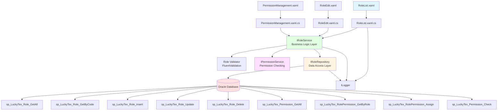
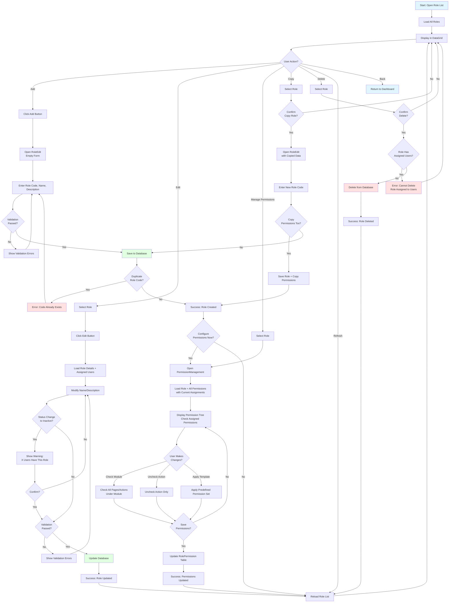

# Process: Role & Permission Management

**Process ID**: UM-002
**Module**: 20 - User Management
**Priority**: P1 (Foundation Module)
**Created**: 2025-10-05

---

## 1. Process Overview

### Purpose
Maintain role definitions and permission assignments for role-based access control (RBAC), including role creation, permission configuration, and user-role assignments for securing the MES system.

### Scope
- Create and update role definitions
- Assign permissions to roles
- Define permission hierarchies (module → page → action level)
- Manage role status (Active, Inactive)
- View role-permission matrix
- Copy roles to create similar roles
- Delete obsolete roles (with constraint checks)
- Search and filter roles
- View users assigned to each role

### Module(s) Involved
- **Primary**: M20 - User Management
- **Consumers**: All modules (authorization checks)

---

## 2. UI Files Inventory

### XAML Files
| File Path | Description | Purpose |
|-----------|-------------|---------|
| `LuckyTex.AirBag.Pages/Pages/20 - User Management/RoleList.xaml` | Role list screen | Display all roles |
| `LuckyTex.AirBag.Pages/Pages/20 - User Management/RoleEdit.xaml` | Role add/edit form | CRUD for roles |
| `LuckyTex.AirBag.Pages/Pages/20 - User Management/PermissionManagement.xaml` | Permission assignment screen | Assign permissions to roles |
| `LuckyTex.AirBag.Pages/Pages/20 - User Management/UserDashboard.xaml` | User management dashboard | Navigation hub |

### Code-Behind Files
| File Path | Description |
|-----------|-------------|
| `LuckyTex.AirBag.Pages/Pages/20 - User Management/RoleList.xaml.cs` | Role list logic |
| `LuckyTex.AirBag.Pages/Pages/20 - User Management/RoleEdit.xaml.cs` | Role form logic |
| `LuckyTex.AirBag.Pages/Pages/20 - User Management/PermissionManagement.xaml.cs` | Permission assignment logic |

### Service Files
| File Path | Description |
|-----------|-------------|
| *(To be created)* `LuckyTex.AirBag.Core/Repositories/IRoleRepository.cs` | Repository interface |
| *(To be created)* `LuckyTex.AirBag.Core/Repositories/RoleRepository.cs` | Repository implementation |
| *(To be created)* `LuckyTex.AirBag.Core/Services/IRoleService.cs` | Service interface |
| *(To be created)* `LuckyTex.AirBag.Core/Services/RoleService.cs` | Service implementation |
| *(To be created)* `LuckyTex.AirBag.Core/Services/IPermissionService.cs` | Permission checking service |

---

## 3. UI Layout Description

### RoleList.xaml

**Screen Title**: "Role Management"

**Key UI Controls**:

**Search/Filter Section** (Top):
- Search textbox (`txtSearch`) - Filter by role code or name
- Status filter dropdown (All, Active, Inactive)
- `cmdSearch` button
- `cmdClearFilter` button

**Data Grid Section** (Center):
- DataGrid displaying role list
- Columns:
  - Role Code (primary key)
  - Role Name
  - Description
  - User Count (number of users with this role)
  - Status (with color indicator)
  - Created Date
- Row selection enabled

**Action Buttons** (Bottom):
- `cmdAdd` - Open RoleEdit in Add mode
- `cmdEdit` - Open RoleEdit with selected role
- `cmdPermissions` - Open PermissionManagement for selected role
- `cmdCopy` - Copy selected role to create new role
- `cmdDelete` - Delete selected role (with confirmation)
- `cmdRefresh` - Reload role list
- `cmdBack` - Return to dashboard

---

### RoleEdit.xaml

**Screen Title**: "Role Details" (Add/Edit mode indicator)

**Key UI Controls**:

**Role Information Section**:
- Role Code (`txtRoleCode`) - Required, unique, disabled in edit mode, max 20 chars, alphanumeric
- Role Name (`txtRoleName`) - Required, max 100 chars
- Description (`txtDescription`) - Multiline, max 500 chars

**Status Section**:
- Status dropdown (`cmbStatus`) - Active, Inactive
- If Inactive: Show warning "X users currently have this role"

**Role Type Section** (Optional categorization):
- Role Type dropdown (`cmbRoleType`) - System Admin, Production Manager, Operator, Read-Only, Custom

**Assigned Users Section** (Read-only):
- DataGrid showing users with this role
- Columns: Username, Full Name, Email
- Link to user management to modify user roles

**Remarks Section**:
- Remarks textbox (`txtRemarks`) - Multiline, optional

**Action Buttons**:
- `cmdSave` - Save role
- `cmdManagePermissions` - Go to PermissionManagement screen
- `cmdCancel` - Close without saving

---

### PermissionManagement.xaml

**Screen Title**: "Manage Permissions for Role: [RoleName]"

**Key UI Controls**:

**Role Information Section** (Top, Read-only):
- Role Code, Role Name display

**Permission Tree Section** (Main area):
- TreeView or Hierarchical CheckListBox
- Structure:
  - **Module** (e.g., M01 - Warehouse)
    - **Page** (e.g., Yarn Receiving)
      - **Action** (e.g., View, Create, Edit, Delete, Print, Export)
- Checkboxes at all levels:
  - Check/uncheck module → affects all pages and actions
  - Check/uncheck page → affects all actions
  - Check/uncheck individual actions

**Permission Matrix Alternative** (Optional tab view):
- DataGrid with modules as rows, action types as columns
- Checkboxes in cells for quick permission assignment

**Predefined Permission Templates** (Optional):
- Buttons to apply common permission sets:
  - `cmdApplyReadOnly` - Check all "View" actions
  - `cmdApplyFullAccess` - Check all actions
  - `cmdApplyOperator` - Check View, Create, Edit (exclude Delete)
  - `cmdClearAll` - Uncheck all permissions

**Action Buttons**:
- `cmdSave` - Save permission assignments
- `cmdCancel` - Close without saving
- `cmdBack` - Return to role list

---

## 4. Component Architecture Diagram

---

## 5. Workflow Diagram

---

## 6. Business Logic Sequence Diagram

```mermaid
sequenceDiagram
    participant User as Administrator
    participant ListUI as RoleList
    participant EditUI as RoleEdit
    participant PermUI as PermissionManagement
    participant BL as RoleService
    participant VAL as RoleValidator
    participant REPO as RoleRepository
    participant DB as Oracle Database

    User->>ListUI: Open Role Management page
    ListUI->>BL: GetAllRoles()
    BL->>REPO: GetAllRoles()
    REPO->>DB: sp_LuckyTex_Role_GetAll
    DB-->>REPO: Role records with user counts
    REPO-->>BL: List<Role>
    BL-->>ListUI: Role data
    ListUI->>ListUI: Bind to DataGrid

    alt Add New Role
        User->>ListUI: Click Add button
        ListUI->>EditUI: Navigate to RoleEdit (Add mode)
        EditUI->>EditUI: Clear all fields

        User->>EditUI: Enter role code (e.g., "PROD_MGR")
        User->>EditUI: Enter role name (e.g., "Production Manager")
        User->>EditUI: Enter description
        User->>EditUI: Select role type (e.g., "Production Manager")
        User->>EditUI: Click Save

        EditUI->>BL: InsertRole(role)
        BL->>VAL: Validate(role)
        VAL->>VAL: Check RoleCode not empty, alphanumeric
        VAL->>VAL: Check RoleName not empty
        VAL->>VAL: Check RoleCode max 20 chars

        alt Validation passed
            VAL-->>BL: Validation OK
            BL->>REPO: InsertRole(role)
            REPO->>DB: sp_LuckyTex_Role_Insert

            alt Insert successful
                DB-->>REPO: Role inserted
                REPO-->>BL: Success
                BL-->>EditUI: Success result
                EditUI->>EditUI: Show success message
                EditUI->>EditUI: Show dialog:<br/>"Configure permissions now?"

                alt User clicks Yes
                    User->>EditUI: Yes
                    EditUI->>PermUI: Navigate to PermissionManagement (roleCode)
                else User clicks No
                    User->>EditUI: No
                    EditUI->>ListUI: Navigate back to list
                end

                ListUI->>BL: GetAllRoles() (refresh)
                BL->>REPO: GetAllRoles()
                REPO->>DB: sp_LuckyTex_Role_GetAll
                DB-->>REPO: Updated list
                REPO-->>BL: List<Role>
                BL-->>ListUI: Refreshed data
                ListUI->>ListUI: Refresh DataGrid
            else Duplicate role code
                DB-->>REPO: Error: Unique constraint violation
                REPO-->>BL: Error: Duplicate code
                BL-->>EditUI: Error message
                EditUI->>EditUI: Highlight RoleCode field
            end
        else Validation failed
            VAL-->>BL: Validation errors
            BL-->>EditUI: Validation error list
            EditUI->>EditUI: Highlight invalid fields
            EditUI->>EditUI: Display validation messages
        end

    else Manage Permissions
        User->>ListUI: Select role row
        User->>ListUI: Click Manage Permissions button
        ListUI->>PermUI: Navigate to PermissionManagement (roleCode)

        PermUI->>BL: GetRoleByCode(roleCode)
        BL->>REPO: GetRoleByCode(roleCode)
        REPO->>DB: sp_LuckyTex_Role_GetByCode
        DB-->>REPO: Role details
        REPO-->>BL: Role entity
        BL-->>PermUI: Role data
        PermUI->>PermUI: Display role code, name (read-only)

        PermUI->>BL: GetAllPermissions()
        BL->>REPO: GetAllPermissions()
        REPO->>DB: sp_LuckyTex_Permission_GetAll
        DB-->>REPO: All permissions (module, page, action hierarchy)
        REPO-->>BL: List<Permission>

        PermUI->>BL: GetRolePermissions(roleCode)
        BL->>REPO: GetRolePermissions(roleCode)
        REPO->>DB: sp_LuckyTex_RolePermission_GetByRole
        DB-->>REPO: Assigned permission IDs
        REPO-->>BL: List<PermissionID>

        BL-->>PermUI: All permissions + assigned permissions
        PermUI->>PermUI: Build permission tree
        PermUI->>PermUI: Check checkboxes for assigned permissions

        User->>PermUI: Check module "M01 - Warehouse"
        PermUI->>PermUI: Check all pages and actions under M01

        User->>PermUI: Uncheck specific action "Delete" on "Yarn Receiving" page
        PermUI->>PermUI: Uncheck that action only

        User->>PermUI: Click "Apply Operator Template" button
        PermUI->>PermUI: Check View, Create, Edit actions for all modules
        PermUI->>PermUI: Uncheck Delete, Admin actions

        User->>PermUI: Click Save

        PermUI->>BL: AssignPermissionsToRole(roleCode, selectedPermissionIDs)
        BL->>REPO: DeleteRolePermissions(roleCode)
        REPO->>DB: DELETE FROM tblRolePermission WHERE RoleCode = @RoleCode

        loop For each selected permission
            BL->>REPO: InsertRolePermission(roleCode, permissionID)
            REPO->>DB: sp_LuckyTex_RolePermission_Assign
            DB-->>REPO: Permission assigned
        end

        REPO-->>BL: All permissions assigned
        BL-->>PermUI: Success result
        PermUI->>PermUI: Show success message
        PermUI->>ListUI: Navigate back to role list

        ListUI->>BL: GetAllRoles() (refresh)
        BL->>REPO: GetAllRoles()
        REPO->>DB: sp_LuckyTex_Role_GetAll
        DB-->>REPO: Updated list
        REPO-->>BL: List<Role>
        BL-->>ListUI: Data
        ListUI->>ListUI: Refresh DataGrid

    else Copy Role
        User->>ListUI: Select role row
        User->>ListUI: Click Copy button
        ListUI->>ListUI: Show confirmation:<br/>"Copy role [RoleCode]?"

        User->>ListUI: Click Yes
        ListUI->>BL: GetRoleByCode(roleCode)
        BL->>REPO: GetRoleByCode(roleCode)
        REPO->>DB: sp_LuckyTex_Role_GetByCode
        DB-->>REPO: Role details
        REPO-->>BL: Role entity

        BL->>REPO: GetRolePermissions(roleCode)
        REPO->>DB: sp_LuckyTex_RolePermission_GetByRole
        DB-->>REPO: Permission IDs
        REPO-->>BL: List<PermissionID>

        BL-->>ListUI: Role + permissions
        ListUI->>EditUI: Navigate to RoleEdit (Add mode, copied data)
        EditUI->>EditUI: Populate name, description from source role
        EditUI->>EditUI: Clear RoleCode field (enable for input)
        EditUI->>EditUI: Show message: "Creating copy of [SourceRoleName]"

        User->>EditUI: Enter new role code
        User->>EditUI: Adjust description if needed
        User->>EditUI: Click Save

        EditUI->>BL: InsertRole(newRole)
        BL->>REPO: InsertRole(newRole)
        REPO->>DB: sp_LuckyTex_Role_Insert
        DB-->>REPO: Role inserted

        loop For each permission from source role
            BL->>REPO: InsertRolePermission(newRoleCode, permissionID)
            REPO->>DB: sp_LuckyTex_RolePermission_Assign
            DB-->>REPO: Permission assigned
        end

        REPO-->>BL: Success
        BL-->>EditUI: Success: New role created with copied permissions
        EditUI->>ListUI: Navigate back
        ListUI->>BL: GetAllRoles() (refresh)
        BL->>REPO: GetAllRoles()
        REPO->>DB: sp_LuckyTex_Role_GetAll
        DB-->>REPO: Updated list
        REPO-->>BL: List<Role>
        BL-->>ListUI: Data
        ListUI->>ListUI: Refresh DataGrid

    else Delete Role
        User->>ListUI: Select role row
        User->>ListUI: Click Delete button
        ListUI->>ListUI: Show confirmation dialog:<br/>"Delete role [Code]?"

        alt User confirms
            User->>ListUI: Click Yes
            ListUI->>BL: DeleteRole(roleCode)
            BL->>REPO: GetUserCountByRole(roleCode)
            REPO->>DB: SELECT COUNT FROM tblUserRole WHERE RoleCode = @RoleCode
            DB-->>REPO: User count

            alt User count > 0
                REPO-->>BL: Error: Role assigned to X users
                BL-->>ListUI: Error message
                ListUI->>ListUI: Show error:<br/>"Cannot delete - role assigned to X users"
            else User count = 0
                BL->>REPO: DeleteRole(roleCode)
                REPO->>DB: sp_LuckyTex_Role_Delete
                DB-->>REPO: Role deleted (cascade delete permissions)
                REPO-->>BL: Success
                BL-->>ListUI: Success result
                ListUI->>ListUI: Show success message
                ListUI->>BL: GetAllRoles() (refresh)
                BL->>REPO: GetAllRoles()
                REPO->>DB: sp_LuckyTex_Role_GetAll
                DB-->>REPO: Updated list
                REPO-->>BL: List<Role>
                BL-->>ListUI: Data
                ListUI->>ListUI: Refresh DataGrid
            end
        else User cancels
            User->>ListUI: Click No
            ListUI->>ListUI: Close dialog, no action
        end
    end
```

---

## 7. Data Flow

### Input Data
| Data Element | Source | Format | Validation |
|--------------|--------|--------|------------|
| Role Code | User input | String, 20 chars max | Required, unique, alphanumeric + underscore |
| Role Name | User input | String, 100 chars | Required |
| Description | User input | String, 500 chars | Optional |
| Role Type | Dropdown | String | Optional |
| Status | Dropdown | String | Required (Active/Inactive) |
| Permission Assignments | Checkboxes | List<PermissionID> | Optional (can create role without permissions) |
| Remarks | User input | String, 500 chars | Optional |

### Output Data
| Data Element | Destination | Format | Purpose |
|--------------|-------------|--------|---------|
| Role Record | tblRole | Database row | Role definition storage |
| Role-Permission Mappings | tblRolePermission | Database rows | Permission assignments |
| Success/Error Message | UI | String | User feedback |
| Role List | DataGrid | Collection | Display all roles |
| Permission Tree | TreeView/CheckListBox | Hierarchical collection | Assign permissions |

### Data Transformations
1. **Role Code**: Uppercase transformation
2. **Status**: Enum to string
3. **Permission List**: Flatten tree to list of permission IDs for database storage
4. **User Count**: Aggregate count from tblUserRole

---

## 8. Database Operations

### Stored Procedures Used

#### sp_LuckyTex_Role_GetAll
- **Purpose**: Retrieve all roles with user counts
- **Parameters**: None
- **Returns**: RoleCode, RoleName, Description, RoleType, Status, UserCount, CreatedDate
- **Tables Read**: tblRole, tblUserRole (join with COUNT)

#### sp_LuckyTex_Role_GetByCode
- **Purpose**: Retrieve single role
- **Parameters**: @RoleCode VARCHAR(20)
- **Returns**: Role details
- **Tables Read**: tblRole

#### sp_LuckyTex_Role_Insert
- **Purpose**: Insert new role
- **Parameters**:
  - @RoleCode VARCHAR(20)
  - @RoleName VARCHAR(100)
  - @Description VARCHAR(500)
  - @RoleType VARCHAR(50)
  - @Status VARCHAR(20)
  - @Remarks VARCHAR(500)
  - @CreatedBy VARCHAR(50)
- **Returns**: Success flag
- **Tables Written**: tblRole

#### sp_LuckyTex_Role_Update
- **Purpose**: Update role
- **Parameters**: Same as Insert (RoleCode is WHERE condition)
- **Returns**: Rows affected
- **Tables Written**: tblRole

#### sp_LuckyTex_Role_Delete
- **Purpose**: Delete role
- **Parameters**: @RoleCode VARCHAR(20)
- **Returns**: Rows affected
- **Tables Written**: tblRole, tblRolePermission (cascade delete)

#### sp_LuckyTex_Permission_GetAll
- **Purpose**: Retrieve all permission definitions
- **Parameters**: None
- **Returns**: PermissionID, Module, Page, Action, Description
- **Tables Read**: tblPermission

#### sp_LuckyTex_RolePermission_GetByRole
- **Purpose**: Retrieve permissions assigned to role
- **Parameters**: @RoleCode VARCHAR(20)
- **Returns**: List of PermissionIDs
- **Tables Read**: tblRolePermission

#### sp_LuckyTex_RolePermission_Assign
- **Purpose**: Assign permission to role
- **Parameters**:
  - @RoleCode VARCHAR(20)
  - @PermissionID INT
  - @AssignedBy VARCHAR(50)
- **Returns**: Success flag
- **Tables Written**: tblRolePermission

#### sp_LuckyTex_Permission_Check
- **Purpose**: Check if user has specific permission (via roles)
- **Parameters**:
  - @Username VARCHAR(50)
  - @Module VARCHAR(50)
  - @Page VARCHAR(100)
  - @Action VARCHAR(50)
- **Returns**: Boolean (has permission or not)
- **Tables Read**: tblUserRole, tblRolePermission, tblPermission (joins)

### Table Structure

**tblRole**:
- PK: RoleCode VARCHAR(20)
- RoleName VARCHAR(100) NOT NULL
- Description VARCHAR(500)
- RoleType VARCHAR(50)
- Status VARCHAR(20) NOT NULL
- Remarks VARCHAR(500)
- CreatedBy VARCHAR(50)
- CreatedDate DATETIME
- ModifiedBy VARCHAR(50)
- ModifiedDate DATETIME

**tblPermission**:
- PK: PermissionID INT (auto-increment)
- Module VARCHAR(50) NOT NULL
- Page VARCHAR(100) NOT NULL
- Action VARCHAR(50) NOT NULL (View, Create, Edit, Delete, Print, Export, Admin)
- Description VARCHAR(200)
- DisplayOrder INT
- UNIQUE constraint on (Module, Page, Action)

**tblRolePermission**:
- PK: RolePermissionID INT (auto-increment)
- RoleCode VARCHAR(20) NOT NULL (FK to tblRole)
- PermissionID INT NOT NULL (FK to tblPermission)
- AssignedBy VARCHAR(50)
- AssignedDate DATETIME
- UNIQUE constraint on (RoleCode, PermissionID)

---

## 9. Implementation Checklist

### Phase 1: Repository Layer
- [ ] Create `Role` entity model
- [ ] Create `Permission` entity model (Module, Page, Action hierarchy)
- [ ] Create `RolePermission` entity model
- [ ] Create `IRoleRepository` interface
  - [ ] GetAllRoles() method
  - [ ] GetRoleByCode(string code) method
  - [ ] InsertRole(Role role) method
  - [ ] UpdateRole(Role role) method
  - [ ] DeleteRole(string code) method
  - [ ] GetUserCountByRole(string code) method
  - [ ] GetAllPermissions() method
  - [ ] GetRolePermissions(string roleCode) method
  - [ ] AssignPermissionsToRole(string roleCode, List<int> permissionIDs) method
  - [ ] DeleteRolePermissions(string roleCode) method
  - [ ] CheckPermission(string username, string module, string page, string action) method
- [ ] Implement `RoleRepository`
  - [ ] Map all stored procedures
  - [ ] Transaction handling for delete + insert permissions
- [ ] Unit tests for repository

### Phase 2: Service Layer
- [ ] Create `IRoleService` interface
  - [ ] All role CRUD methods
  - [ ] Permission assignment methods
  - [ ] Copy role method
- [ ] Create `IPermissionService` interface
  - [ ] CheckPermission(username, module, page, action) method
  - [ ] GetUserPermissions(username) method → returns all permissions for user
  - [ ] HasPermission(username, permissionID) method
- [ ] Create `RoleValidator` using FluentValidation
  - [ ] RoleCode: Required, alphanumeric + underscore, max 20 chars, unique
  - [ ] RoleName: Required, max 100 chars
  - [ ] Status: Required, valid enum
- [ ] Implement `RoleService`
  - [ ] Constructor with IRoleRepository, IValidator<Role>, ILogger
  - [ ] Validation before Insert/Update
  - [ ] Business rule: Cannot delete role with assigned users
  - [ ] Copy role logic with permission copy option
- [ ] Implement `PermissionService`
  - [ ] Cache user permissions for performance (in-memory cache with expiration)
  - [ ] CheckPermission with cache lookup
  - [ ] ClearUserPermissionCache on role/permission change
- [ ] Unit tests for service

### Phase 3: UI Refactoring
- [ ] Update `RoleList.xaml.cs`
  - [ ] Inject IRoleService
  - [ ] Update Page_Loaded to call GetAllRoles
  - [ ] Update cmdPermissions_Click to navigate
  - [ ] Update cmdCopy_Click for role copy
  - [ ] Handle ServiceResult
- [ ] Update `RoleEdit.xaml.cs`
  - [ ] Inject IRoleService
  - [ ] Support Add vs Edit modes
  - [ ] Disable RoleCode in Edit mode
  - [ ] Display assigned users count
  - [ ] Show warning if deactivating role with users
  - [ ] Update cmdSave_Click
  - [ ] Display validation errors
- [ ] Update `PermissionManagement.xaml.cs`
  - [ ] Inject IRoleService
  - [ ] Build permission tree from flat permission list
  - [ ] Group by Module → Page → Action
  - [ ] Implement hierarchical checkbox logic:
    - Parent check → check all children
    - Child uncheck → uncheck parent
  - [ ] Predefined template buttons (Read-Only, Operator, etc.)
  - [ ] Update cmdSave_Click to save permissions
- [ ] XAML data binding
  - [ ] Bind DataGrid
  - [ ] Value converter for Status color
  - [ ] TreeView for permission hierarchy OR
  - [ ] Hierarchical CheckListBox
- [ ] User-friendly error messages

### Phase 4: Integration Testing
- [ ] Test with real database
  - [ ] Add new role (success)
  - [ ] Add duplicate role code (error)
  - [ ] Edit role (success)
  - [ ] Assign permissions to role (success)
  - [ ] Check permission hierarchy (module check → all pages/actions checked)
  - [ ] Apply permission template (success)
  - [ ] Copy role with permissions (success)
  - [ ] Delete role with no users (success)
  - [ ] Delete role with assigned users (error)
  - [ ] Deactivate role with users (warning + success)
  - [ ] Search/filter roles
- [ ] UI testing
  - [ ] Permission tree interaction
  - [ ] Hierarchical checkbox behavior
  - [ ] Template button functionality
- [ ] Authorization testing (in other modules)
  - [ ] Create test user with test role
  - [ ] Assign specific permissions
  - [ ] Verify permission checks work correctly in production modules
- [ ] Performance testing
  - [ ] Permission check response time < 50ms (with caching)
  - [ ] Load 100+ permissions in tree (acceptable load time)

### Phase 5: Deployment Preparation
- [ ] Code review
- [ ] Unit tests passing (80%+)
- [ ] Integration tests passing
- [ ] Authorization testing across modules
- [ ] UAT completed
- [ ] Production deployment

---

**Document Version**: 1.0
**Last Updated**: 2025-10-05
**Status**: Ready for Implementation
**Estimated Effort**: 4-5 days (1 developer)
**Dependencies**: User Management (tblUser), Permission definitions (tblPermission must be seeded)
**Special Notes**:
- Permission hierarchy: Module → Page → Action (3 levels)
- Permission caching is critical for performance - clear cache on role/permission changes
- Prevent deletion of roles with assigned users
- Consider seeding default roles and permissions during system setup (Administrator, Operator, Read-Only)
- Permission check should be called at UI level (button visibility) and API level (authorization)
