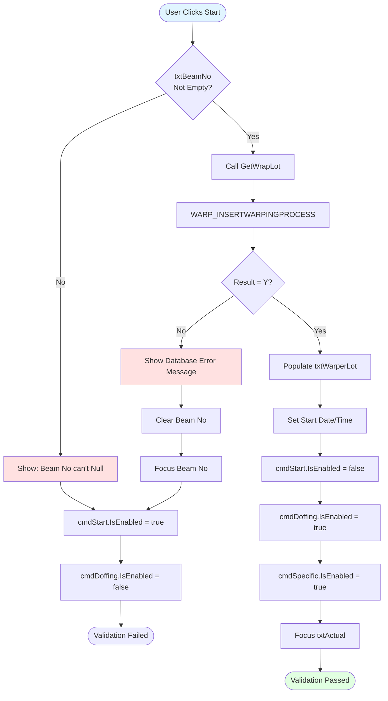
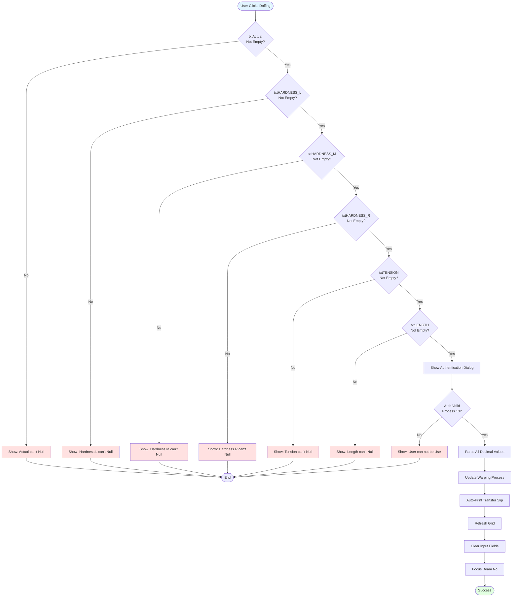
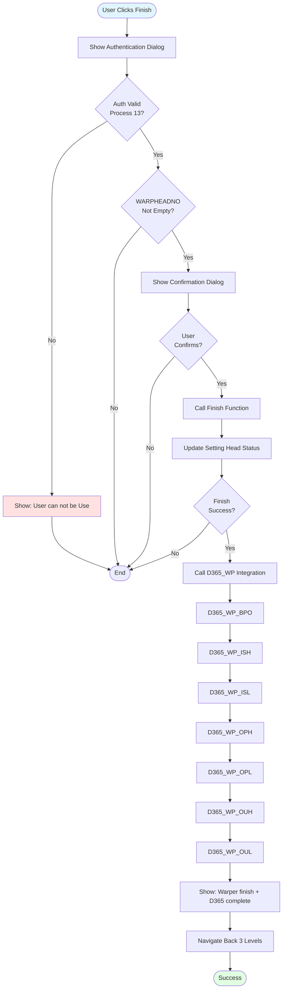
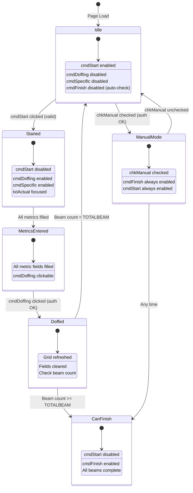
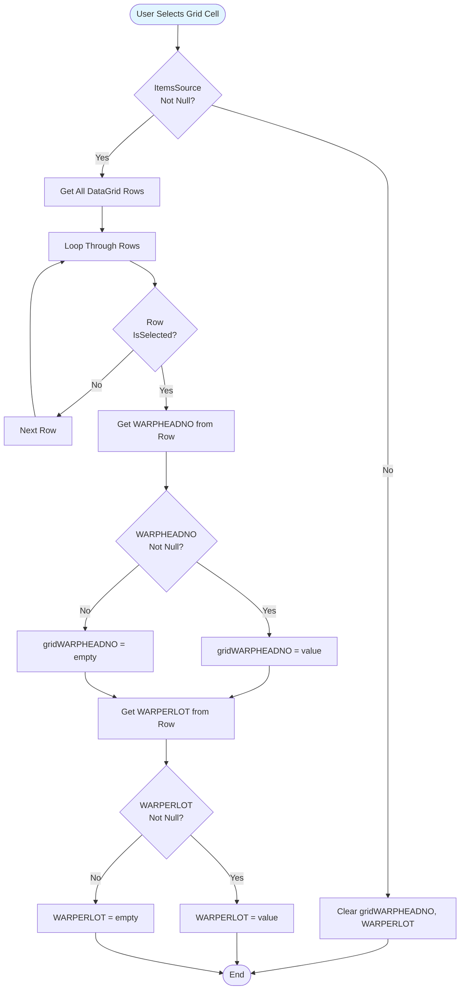
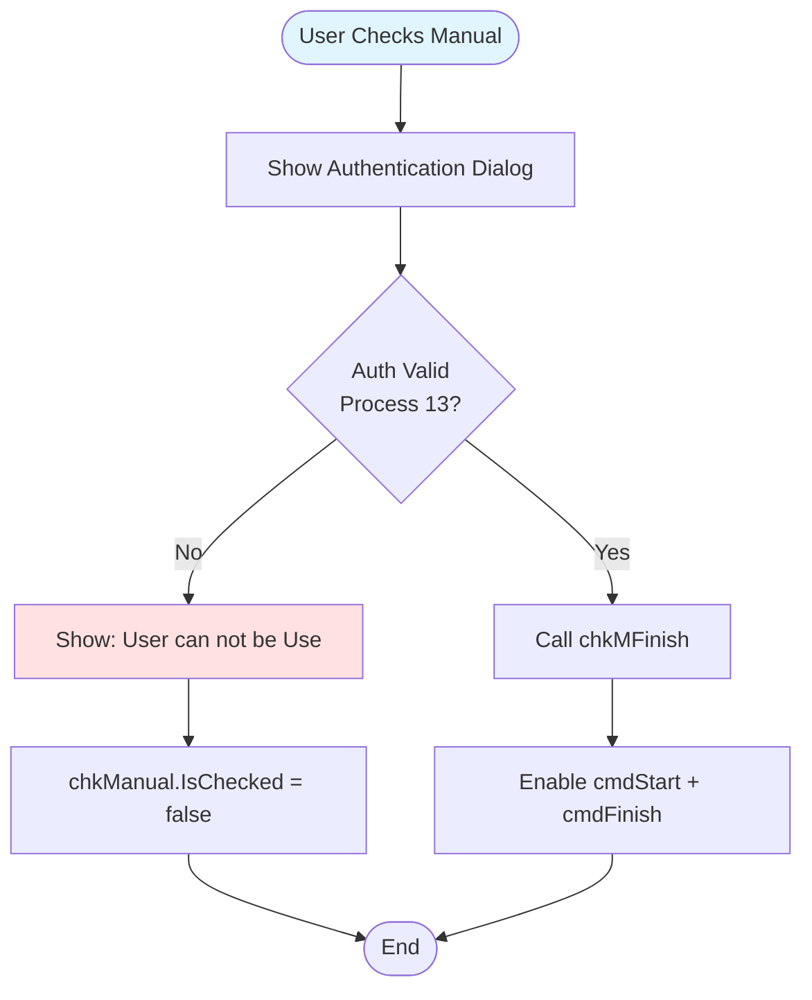
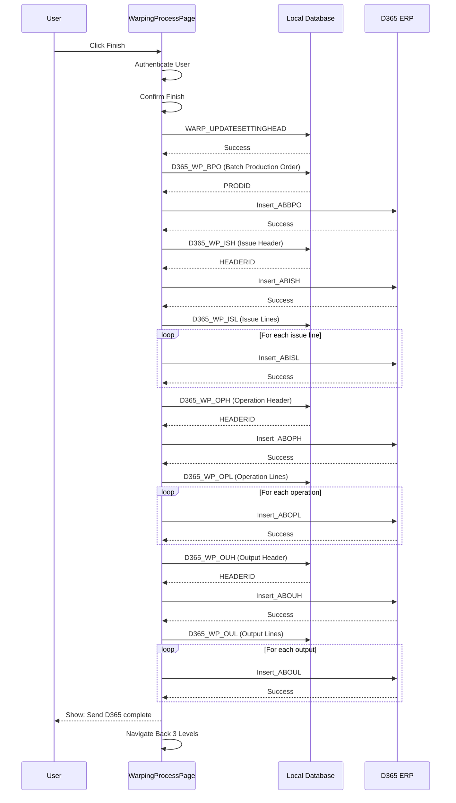
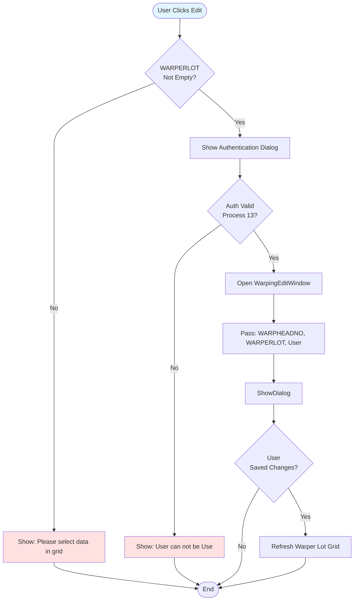

# UI Logic Analysis: Warping Process Page

**File**: `WarpingProcessPage.xaml` / `WarpingProcessPage.xaml.cs`
**Module**: 02 - Warping
**Lines of Code**: 1,770 lines (C# code-behind)
**Complexity**: Very High
**Last Updated**: 2025-10-06

---

## 1. Overview

### Purpose
Main warping production tracking page for recording beam production in the warping process. This page handles:
- Starting new warper rolls (beams)
- Recording quality metrics (speed, tension, hardness)
- Doffing completed beams
- Tracking production progress
- ERP integration (D365) when finishing a warper lot
- Editing and reprinting warper roll labels

### Business Context
Warping is a critical process that prepares yarns for weaving by winding them onto beams in parallel. Each warp head (machine) can produce multiple beams before finishing. The page enforces a workflow where operators must complete a defined number of beams before finishing a lot.

### Key Workflow States
1. **Idle** → Ready for beam input
2. **Started** → Beam started, awaiting doffing
3. **Doffing** → Recording quality metrics and completing beam
4. **Finished** → Entire warp lot complete (all beams done)

---

## 2. UI Components Inventory

### Input Controls
| Control Name | Type | Purpose | Validation | MaxLength |
|--------------|------|---------|------------|-----------|
| txtMCName | TextBox | Machine name (read-only) | - | - |
| txtWARPHEADNO | TextBox | Warp head/lot number (read-only) | - | - |
| txtITM_PREPARE | TextBox | Item preparation code (read-only) | - | - |
| txtSide | TextBox | Creel side (A/B) (read-only) | - | - |
| txtOperator | TextBox | Operator name (read-only) | - | - |
| txtBeamNo | TextBox | Beam number (editable) | Numeric only | 3 |
| txtSPEED | TextBox | Machine speed (read-only) | - | - |
| txtDefualtLength | TextBox | Length specification (read-only) | - | - |
| txtWarperLot | TextBox | Generated warper roll lot (read-only) | - | - |
| txtActual | TextBox | Actual speed (editable) | Numeric only | - |
| txtMCL | TextBox | Machine count L (editable) | Numeric only | - |
| txtMCS | TextBox | Machine count S (editable) | Numeric only | - |
| txtTENSION_IT | TextBox | Tension IT (editable) | Numeric only | - |
| txtTENSION_TAKE | TextBox | Tension Take Up (editable) | Numeric only | - |
| txtTENSION | TextBox | Actual tension (editable) | Numeric only | - |
| txtHARDNESS_L | TextBox | Hardness Left (editable) | Numeric only | - |
| txtHARDNESS_M | TextBox | Hardness Middle (editable) | Numeric only | - |
| txtHARDNESS_R | TextBox | Hardness Right (editable) | Numeric only | - |
| txtSTARTDATE | TextBox | Start date/time (read-only) | - | - |
| txtLENGTH | TextBox | Beam length (editable) | Numeric only | - |
| chkManual | CheckBox | Manual finish mode | User auth required | - |

### Action Buttons
| Button | Purpose | Enable Condition | Auth Required |
|--------|---------|------------------|---------------|
| cmdStart | Start new beam | Default enabled | No |
| cmdDoffing | Complete beam (doff) | After Start clicked | Yes (Process 13) |
| cmdSpecific | Record M/C stop reason | After Start clicked | No |
| cmdFinish | Finish entire warp lot | Auto-enabled when beam count reached | Yes (Process 13) |
| cmdPrint | Print transfer slip | Grid row selected | No |
| cmdEdit | Edit warper roll data | Grid row selected | Yes (Process 13) |
| cmdBack | Return to previous page | Always enabled | No |

### Data Grid
| Grid Name | Columns | Purpose | Selection |
|-----------|---------|---------|-----------|
| gridWarp_getwarperlotbyheadno | 15 columns | Display all completed beams for current warp head | Single row |

Grid Columns:
1. Warper Roll (lot number)
2. Beam No
3. Start Date
4. End Date
5. Length
6. Machine L
7. Machine S
8. Tension IT
9. Take Up
10. Actual Tension
11. Hardness L
12. Hardness M
13. Hardness R
14. Doff By (operator)
15. STOP Reason (button)
16. Remark (button)

---

## 3. Input Flow & Sequencing

### Tab Order (Enter Key Navigation)
The page implements custom keyboard navigation using Enter key handlers:

```
txtBeamNo → [cmdStart button] → [Start operation] → txtActual → txtMCL →
txtMCS → txtTENSION_IT → txtTENSION_TAKE → txtTENSION → txtHARDNESS_L →
txtHARDNESS_M → txtHARDNESS_R → txtLENGTH → [cmdDoffing button]
```

### Sequential Input Flow Diagram

```mermaid
flowchart TD
    Start([Page Load]) --> LoadSetup[Load Setup Parameters]
    LoadSetup --> DisplayInfo[Display Machine Info]
    DisplayInfo --> CheckStatus{STATUS = 1?}

    CheckStatus -->|Yes| LoadExisting[Load Existing Warper Lot]
    CheckStatus -->|No| FocusBeam[Focus on Beam No]

    LoadExisting --> CheckInProcess[Check In-Process Lot]
    CheckInProcess --> HasInProcess{In-Process<br/>Lot Found?}

    HasInProcess -->|Yes| PopulateFields[Populate All Fields]
    HasInProcess -->|No| FocusBeam

    PopulateFields --> EnableDoffing[Enable Doffing Button]
    EnableDoffing --> DisableStart[Disable Start Button]

    FocusBeam --> WaitBeam[Wait for Beam No Input]
    WaitBeam --> BeamEntered{Beam No<br/>Entered?}

    BeamEntered -->|No| ErrorBeam[Show: Beam No can't Null]
    BeamEntered -->|Yes| ClickStart[User Clicks Start]

    ClickStart --> InsertProcess[Insert Warping Process]
    InsertProcess --> CheckInsert{Insert<br/>Success?}

    CheckInsert -->|No| ShowError[Show Error Message]
    CheckInsert -->|Yes| GenLot[Generate Warper Lot]

    ShowError --> FocusBeam
    GenLot --> SetStartDate[Set Start Date/Time]
    SetStartDate --> SwitchButtons[Enable Doffing, Disable Start]
    SwitchButtons --> EnableSpecific[Enable Specific Button]
    EnableSpecific --> FocusActual[Focus on Actual Speed]

    FocusActual --> EnterMetrics[Enter Quality Metrics]
    EnterMetrics --> AllFilled{All Required<br/>Fields Filled?}

    AllFilled -->|No| ErrorMetrics[Show Missing Field Error]
    AllFilled -->|Yes| ClickDoffing[User Clicks Doffing]

    ErrorMetrics --> EnterMetrics

    ClickDoffing --> AuthDoffing[Authentication Dialog]
    AuthDoffing --> CheckAuth{Auth Valid?}

    CheckAuth -->|No| ShowAuthError[Show: User can not be Use]
    CheckAuth -->|Yes| ParseMetrics[Parse All Metric Values]

    ShowAuthError --> EnterMetrics

    ParseMetrics --> UpdateProcess[Update Warping Process]
    UpdateProcess --> PrintLabel[Auto-Print Transfer Slip]
    PrintLabel --> RefreshGrid[Refresh Grid Display]
    RefreshGrid --> ClearFields[Clear Metric Fields]
    ClearFields --> CheckBeamCount[Check Total Beam Count]

    CheckBeamCount --> CountReached{Count >=<br/>TOTALBEAM?}

    CountReached -->|No| EnableStart2[Enable Start]
    CountReached -->|Yes| EnableFinish[Enable Finish Button]

    EnableStart2 --> FocusBeam
    EnableFinish --> DisableStart2[Disable Start Button]
    DisableStart2 --> WaitFinish[Wait for Finish]

    style Start fill:#e1f5ff
    style ErrorBeam fill:#ffe1e1
    style ErrorMetrics fill:#ffe1e1
    style ShowAuthError fill:#ffe1e1
    style EnableFinish fill:#e1ffe1
```



---

## 4. Validation Logic

### 4.1 Start Button Validation

**Location**: `cmdStart_Click` (lines 137-167)



**Validation Rules**:
1. Beam No must not be empty
2. Database must successfully create warper lot
3. If duplicate beam number → show database error

---

### 4.2 Doffing Button Validation

**Location**: `cmdDoffing_Click` (lines 173-391)



**Validation Rules** (in sequence):
1. **txtActual** must not be empty → "Actual can't Null"
2. **txtHARDNESS_L** must not be empty → "Hardness L can't Null"
3. **txtHARDNESS_M** must not be empty → "Hardness M can't Null"
4. **txtHARDNESS_R** must not be empty → "Hardness R can't Null"
5. **txtTENSION** must not be empty → "Tension can't Null"
6. **txtLENGTH** must not be empty → "Length can't Null"
7. User must authenticate with Process ID 13 permissions

**Value Parsing**:
All numeric fields use try-catch parsing with default to 0:
- length, speed, hardnessL, hardnessM, hardnessR, tension
- tensionIT, tensionTake, mcl, mcs

---

### 4.3 Finish Button Validation

**Location**: `cmdFinish_Click` (lines 418-469)



**Validation Rules**:
1. User authentication required (Process ID 13)
2. WARPHEADNO must not be empty
3. User must confirm finish action
4. Triggers complex D365 ERP integration (7 sequential steps)

---

## 5. Button Enable/Disable Logic

### State Transition Rules



### Auto-Enable Logic (chkMFinish function)

**Location**: `chkMFinish()` (lines 1034-1072)

**Logic**:
```
IF chkManual.IsChecked = true THEN
    cmdFinish.IsEnabled = true
    cmdStart.IsEnabled = true
ELSE
    IF gridWarp_getwarperlotbyheadno.Items.Count >= TOTALBEAM THEN
        cmdFinish.IsEnabled = true
        cmdStart.IsEnabled = false
    ELSE
        cmdFinish.IsEnabled = false
        cmdStart.IsEnabled = true
    END IF
END IF
```

This function is called:
1. After loading warper lot grid
2. After doffing a beam
3. When checking/unchecking manual mode

---

## 6. Numeric Input Validation

### PreviewKeyDown Handler

**Location**: `Common_PreviewKeyDown` (lines 565-568)

```csharp
private void Common_PreviewKeyDown(object sender, KeyEventArgs e)
{
    e.Handled = !this.IsNumericInput(e);
}
```

**Applied To**:
- txtBeamNo
- txtActual
- txtMCL, txtMCS
- txtTENSION_IT, txtTENSION_TAKE, txtTENSION
- txtHARDNESS_L, txtHARDNESS_M, txtHARDNESS_R
- txtLENGTH

**Effect**: Blocks all non-numeric keystrokes at input time

---

## 7. Grid Selection Logic

### Grid Row Selection Handler

**Location**: `gridWarp_getwarperlotbyheadno_SelectedCellsChanged` (lines 766-807)



**Purpose**: Stores selected row's WARPHEADNO and WARPERLOT for Print/Edit buttons

---

## 8. Manual Mode (chkManual)

### Checkbox Logic

**Location**: `chkManual_Checked` and `chkManual_Unchecked` (lines 720-745)



**Purpose**: Allows supervisor to manually finish a warp lot before completing all required beams

**Security**: Requires Process 13 authentication

---

## 9. D365 ERP Integration

### Integration Workflow

**Trigger**: When cmdFinish button is clicked and finish operation succeeds

**Location**: `D365_WP()` (lines 1244-1318)



### D365 Integration Steps

**Sequential Execution** (any failure stops the chain):

1. **D365_WP_BPO** - Batch Production Order
   - Creates production order record
   - Returns PRODID
   - Inserts into ABBPO table

2. **D365_WP_ISH** - Issue Header
   - Creates material issue header
   - Returns HEADERID
   - Inserts into ABISH table

3. **D365_WP_ISL** - Issue Lines
   - Creates material issue lines (loop)
   - References HEADERID from step 2
   - Inserts into ABISL table

4. **D365_WP_OPH** - Operation Header
   - Creates operation tracking header
   - Returns new HEADERID
   - Inserts into ABOPH table

5. **D365_WP_OPL** - Operation Lines
   - Records machine operations (loop)
   - Includes start/end times, operator, machine
   - Inserts into ABOPL table

6. **D365_WP_OUH** - Output Header
   - Creates finished goods header
   - Returns HEADERID
   - Inserts into ABOUH table

7. **D365_WP_OUL** - Output Lines
   - Records finished beam details (loop)
   - Includes dimensions, weight, grade, location
   - Inserts into ABOUL table

**Error Handling**: Each step shows error message and stops if any database/D365 error occurs

---

## 10. Print Functionality

### Auto-Print After Doffing

**Location**: `PrintProcess()` (lines 1009-1032)

**Flow**:
1. Update warping process in database
2. Refresh grid display
3. Auto-print transfer slip using default printer
4. Clear metric input fields
5. Re-enable Start button

### Manual Print

**Location**: `cmdPrint_Click` (lines 473-483)

**Requirements**:
- Grid row must be selected
- gridWARPHEADNO and WARPERLOT variables populated

### Print Implementation

**Location**: `PrintWarp_tranferSlip()` (lines 848-869)

**Uses**:
- Windows default printer (GetDefaultPrinter Win32 API)
- ConmonReportService singleton
- Report name: "TransferSlip"
- Direct print without preview

---

## 11. Edit Functionality

### Edit Button Handler

**Location**: `cmdEdit_Click` (lines 487-520)



**Purpose**: Opens popup window to edit quality metrics for a specific warper roll

**Security**: Requires Process 13 authentication

---

## 12. Special Features

### 12.1 Specific M/C Stop Reason

**Location**: `cmdSpecific_Click` (lines 397-413)

**Purpose**: Record unplanned machine stoppage reasons

**Requirements**:
- txtWarperLot must not be empty
- Opens SpecificMCStopBox dialog
- No authentication required

### 12.2 STOP Reason (Grid Button)

**Location**: `STOPReason_Click` (lines 524-533)

**Purpose**: View/record stop reasons for completed beams

**Requirements**:
- WARPERLOT variable populated from grid selection
- Opens MCSTOPReasonBox dialog

### 12.3 Remark (Grid Button)

**Location**: `Remark_Click` (lines 539-555)

**Purpose**: Add/edit remarks for specific warper roll

**Flow**:
1. Load existing remark from database
2. Show RemarkBox dialog
3. If user enters remark → update database

---

## 13. Database Operations

### Stored Procedures Used

| Procedure | Purpose | Called From |
|-----------|---------|-------------|
| WARP_GETSPECBYCHOPNOANDMC | Get machine speed and length spec | GetMCSpeed() |
| WARP_INSERTWARPINGPROCESS | Create new warper roll/lot | GetWrapLot() |
| WARP_UPDATEWARPINGPROCESS | Update beam quality metrics | PrintProcess() |
| WARP_GETWARPERLOTBYHEADNO | Get all beams for warp head | GetWarperLot() |
| WARP_GETINPROCESSLOTBYHEADNO | Get in-progress beam data | WARP_GETINPROCESSLOTBYHEADNO() |
| WARP_UPDATESETTINGHEAD | Mark warp lot as finished | Finish() |
| WARP_UPDATEWARPINGPROCESS_REMARK | Update remark | Remark_Click() |
| WARP_GETWARPERROLLREMARK | Get existing remark | Remark_Click() |
| D365_WP_BPO | D365 Batch Production Order | D365_WP_BPO() |
| D365_WP_ISH | D365 Issue Header | D365_WP_ISH() |
| D365_WP_ISL | D365 Issue Lines | D365_WP_ISL() |
| D365_WP_OPH | D365 Operation Header | D365_WP_OPH() |
| D365_WP_OPL | D365 Operation Lines | D365_WP_OPL() |
| D365_WP_OUH | D365 Output Header | D365_WP_OUH() |
| D365_WP_OUL | D365 Output Lines | D365_WP_OUL() |
| Insert_ABBPO | Insert D365 BPO | D365DataService |
| Insert_ABISH | Insert D365 ISH | D365DataService |
| Insert_ABISL | Insert D365 ISL | D365DataService |
| Insert_ABOPH | Insert D365 OPH | D365DataService |
| Insert_ABOPL | Insert D365 OPL | D365DataService |
| Insert_ABOUH | Insert D365 OUH | D365DataService |
| Insert_ABOUL | Insert D365 OUL | D365DataService |

---

## 14. Critical Business Rules

### Rule 1: Beam Count Enforcement
**Description**: Cannot finish warp lot until TOTALBEAM count is reached
**Exception**: Manual mode (chkManual) bypasses this rule with supervisor auth
**Enforced In**: `chkMFinish()` function

### Rule 2: Sequential Workflow
**Description**: Must complete Start → Enter Metrics → Doffing sequence
**Enforced In**: Button enable/disable state machine

### Rule 3: Quality Metrics Required
**Description**: All 6 quality metrics must be entered before doffing:
- Actual Speed
- Hardness L, M, R
- Tension
- Length

**Enforced In**: `cmdDoffing_Click` validation

### Rule 4: Auto-Print After Doffing
**Description**: Transfer slip automatically prints after each beam doffing
**Purpose**: Immediate physical label for beam tracking

### Rule 5: D365 Integration on Finish
**Description**: Finishing a warp lot triggers 7-step ERP integration
**Failure Handling**: Any step failure shows error and stops process

---

## 15. Error Handling Patterns

### Try-Catch Blocks

**Decimal Parsing** (lines 206-338):
```csharp
try {
    if (!string.IsNullOrEmpty(txtLENGTH.Text))
        length = decimal.Parse(txtLENGTH.Text);
}
catch {
    length = 0;
}
```

**Pattern**: All numeric inputs default to 0 if parsing fails (no user notification)

**Grid Operations** (lines 768-806):
```csharp
try {
    // Grid selection logic
}
catch (Exception ex) {
    MessageBox.Show(ex.Message.ToString(), "Error", ...);
}
```

**D365 Integration** (lines 1382-1387):
```csharp
catch (Exception ex) {
    ex.Err();
    MessageBox.Show(ex.Message.ToString(), "Error", ...);
    return false;
}
```

---

## 16. Page Load Logic

### Setup Method

**Location**: `Setup()` (lines 1731-1765)

**Parameters**:
- user: Operator username
- mcName: Machine name
- mcNo: Machine number
- warpheadNo: Warp lot number
- itm_Prepare: Item preparation code
- side: Creel side (A/B)
- status: Lot status (1 = in progress)

**Purpose**: Initialize page with context from previous screen

### UserControl_Loaded

**Location**: `UserControl_Loaded` (lines 88-115)

**Flow**:
1. Call ClearControl() to reset form
2. Populate read-only fields from Setup parameters
3. If ITM_PREPARE exists → load machine speed/length
4. If STATUS = 1 → load existing warper lot grid
5. If WARPHEADNO exists → check for in-process lot and resume

---

## 17. Performance Considerations

### Issues Identified

1. **Manual Grid Rebinding** (lines 1116)
   - Uses manual list creation and rebinding
   - Should use ObservableCollection for auto-refresh

2. **No Async Operations**
   - All database calls are synchronous
   - UI freezes during D365 integration (7 sequential calls)

3. **Repeated Code**
   - D365 integration has similar patterns repeated 7 times
   - Could be refactored into reusable methods

4. **Exception Swallowing**
   - Decimal.Parse errors silently default to 0
   - May hide data entry mistakes

---

## 18. Security Model

### Authentication Points

1. **Doffing Button** (Process ID 13)
2. **Finish Button** (Process ID 13)
3. **Edit Button** (Process ID 13)
4. **Manual Mode Checkbox** (Process ID 13)

**Process ID 13** = Inspection/Quality Control permission level

### User Tracking

**Operators Recorded**:
- opera (txtOperator): Page-level operator
- P_STARTBY: Operator who started beam
- P_DOFFBY: Operator who completed beam
- P_FINISHBY: Operator who finished warp lot

---

## 19. UI State Summary

### 12 Distinct UI States

| State | Start | Doffing | Specific | Finish | Focus |
|-------|-------|---------|----------|--------|-------|
| 1. Initial Load | ✅ | ❌ | ❌ | Auto | txtBeamNo |
| 2. In-Process Resumed | ❌ | ✅ | ✅ | Auto | txtActual |
| 3. Beam Started | ❌ | ✅ | ✅ | Auto | txtActual |
| 4. Metrics Entered | ❌ | ✅ | ✅ | Auto | - |
| 5. Beam Doffed | ✅ | ❌ | ❌ | Auto | txtBeamNo |
| 6. All Beams Done | ❌ | ❌ | ❌ | ✅ | - |
| 7. Manual Mode | ✅ | ❌ | ❌ | ✅ | - |
| 8. Manual + Started | ❌ | ✅ | ✅ | ✅ | txtActual |
| 9. Grid Row Selected | - | - | - | - | - |
| 10. Edit Dialog Open | - | - | - | - | - |
| 11. D365 Integration | - | - | - | - | - |
| 12. Finished (Exit) | - | - | - | - | - |

**Auto**: Finish button auto-enables based on beam count

---

## 20. Modernization Recommendations

### High Priority

1. **Async/Await Pattern**
   - Convert all database calls to async
   - Show progress indicator during D365 integration
   - Prevent UI freeze

2. **ObservableCollection**
   - Replace manual grid rebinding
   - Automatic UI refresh on data changes

3. **MVVM Pattern**
   - Separate business logic from code-behind
   - Enable unit testing
   - Reduce code complexity

4. **Validation Framework**
   - Replace sequential if-else with validation attributes
   - Centralized error message management
   - Better user feedback

5. **Error Logging**
   - Replace silent exception swallowing
   - Implement structured logging
   - Track decimal parsing failures

### Medium Priority

6. **Dependency Injection**
   - Remove singleton service calls
   - Inject WarpingDataService and D365DataService
   - Improve testability

7. **Command Pattern**
   - Replace Click event handlers with ICommand
   - Centralize button logic
   - Enable/disable through CanExecute

8. **Repository Pattern**
   - Abstract database operations
   - Single responsibility for data access
   - Easier to mock for testing

### Low Priority

9. **Localization**
   - Externalize all error messages
   - Support multiple languages

10. **UI Responsiveness**
    - Convert fixed Grid layouts to responsive
    - Support different screen sizes

---

## 21. Key Findings

### Strengths
✅ Comprehensive quality tracking (9 metrics)
✅ Strong authentication controls
✅ Automatic transfer slip printing
✅ Full D365 ERP integration
✅ In-process lot resumption
✅ Manual override for supervisors

### Weaknesses
❌ No async operations (UI freezes)
❌ Silent decimal parsing errors
❌ Manual grid rebinding
❌ No input validation feedback
❌ Tightly coupled to services
❌ Long sequential D365 integration (no rollback)

### Security Concerns
⚠️ Same Process ID (13) for all auth checks
⚠️ No audit trail for manual mode usage
⚠️ Authentication happens at action time (not page load)

---

## 22. Related Files

**Data Service**: `WarpingDataService.cs`
**D365 Service**: `D365DataService.cs`
**Edit Window**: `WarpingEditWindow.xaml.cs`
**Setup Page**: `WarpingSettingPage.xaml.cs` (previous screen)
**Process Document**: `Documents/Processes/02_Warping/012-PROCESS_WARPING_PRODUCTION.md`

---

**Analysis Completed**: 2025-10-06
**Total Code Lines Analyzed**: 1,770
**Total Mermaid Diagrams**: 9
**Total Database Operations**: 22 stored procedures
