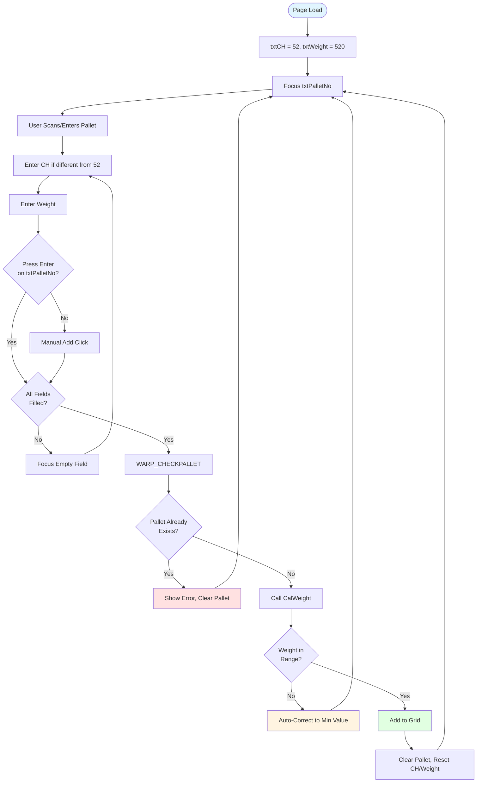
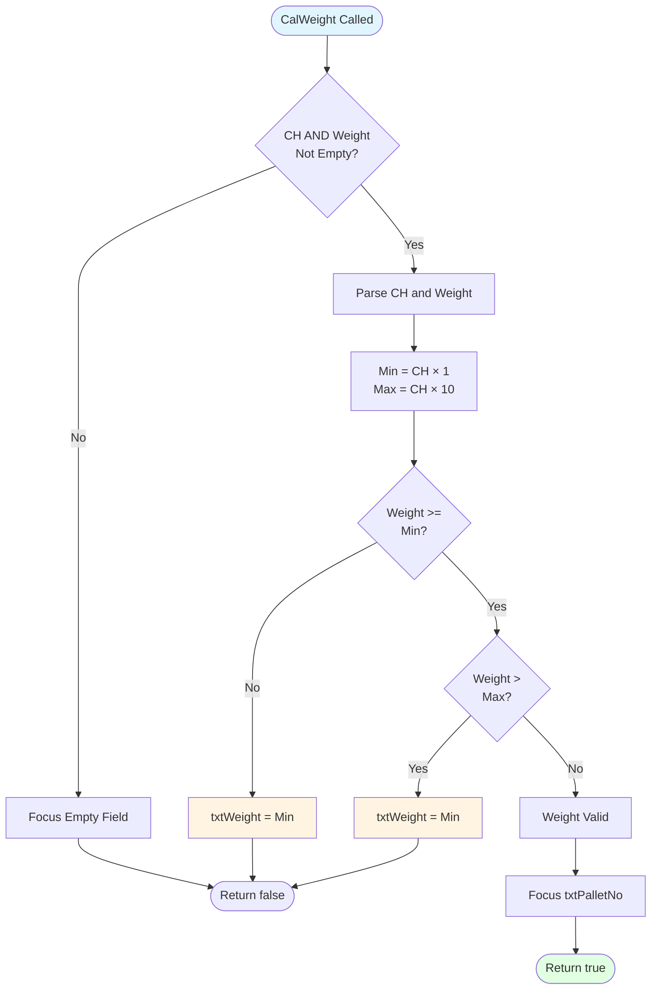
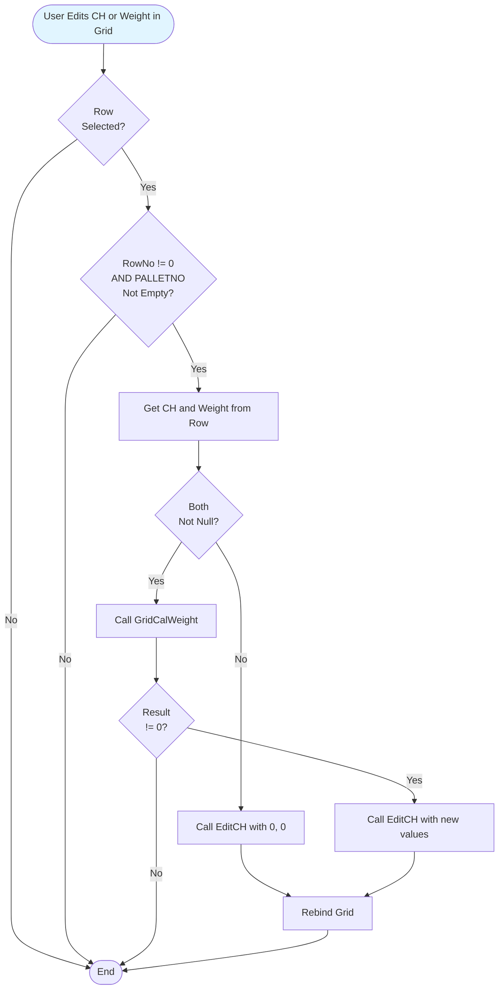
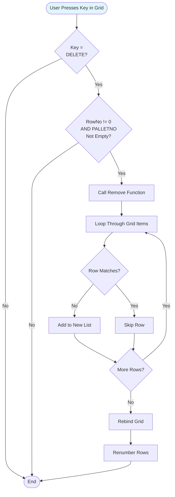
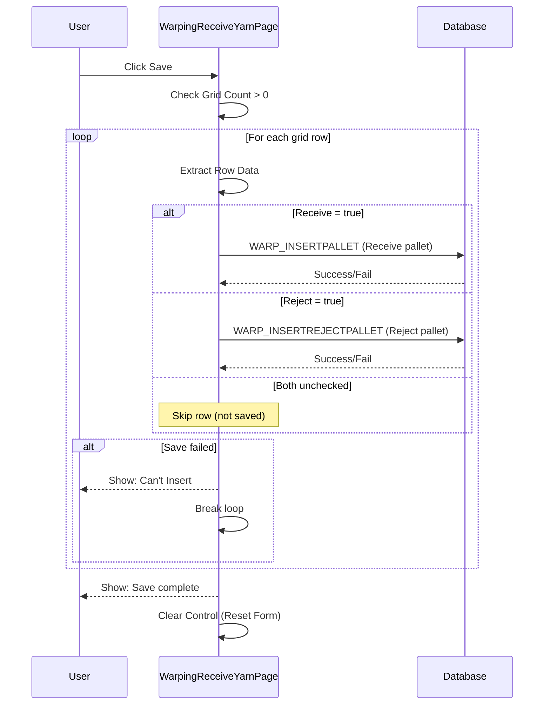

# UI Logic Analysis: Warping Receive Yarn Page

**File**: `WarpingReceiveYarnPage.xaml` / `WarpingReceiveYarnPage.xaml.cs`
**Module**: 02 - Warping
**Lines of Code**: 1,304 lines (C# code-behind)
**Complexity**: Medium-High
**Last Updated**: 2025-10-06

---

## 1. Overview

### Purpose
Yarn receiving page specifically for warping department. This page handles:
- Recording yarn pallet receipts for warping operations
- Validating weight-to-channel ratios
- Marking pallets as received or rejected
- Grid-based batch entry with inline editing
- Auto-calculation of weight based on channel count

### Business Context
This is a specialized receiving function for the warping department. Unlike the main warehouse receiving (Module 12 - G3), this page focuses on recording yarn pallets that will be used specifically for warping operations, with built-in validation rules for weight ranges based on channel counts.

### Key Workflow States
1. **Entry Mode** → Scan/enter pallet, enter CH and weight
2. **Grid Editing** → Modify existing entries, toggle receive/reject
3. **Save** → Commit all entries to database

---

## 2. UI Components Inventory

### Input Controls
| Control Name | Type | Purpose | Validation | Default Value |
|--------------|------|---------|------------|---------------|
| txtPalletNo | TextBox | Pallet number/barcode | Required, unique check | Empty |
| cbItemCode | ComboBox | Item yarn selection | Required | Null |
| dteReceiveDate | DatePicker | Receipt date | Auto-filled | Today |
| txtCH | TextBox | Channel count | Numeric only | "52" |
| txtWeight | TextBox | Weight in KG | Numeric + range check | "520" |
| txtOperator | TextBox | Operator name (read-only) | Auto-filled | From setup |

### Action Buttons
| Button | Purpose | Enable Condition | Visibility |
|--------|---------|------------------|------------|
| cmdAdd | Add to grid | All fields valid | Collapsed (legacy) |
| cmdSave | Save all entries | Grid has items | Always |
| cmdBack | Return to previous | Always enabled | Always |

### Data Grid (gridWarping)
**Purpose**: Batch entry grid with inline editing and checkbox controls

| Column | Editable | Type | Purpose |
|--------|----------|------|---------|
| Row No | ❌ No | Int | Sequential number |
| Pallet No | ❌ No | Text | Pallet identifier |
| Item Yarn | ❌ No | Text | Yarn type |
| Receive Date | ❌ No | Date | Receipt date |
| CH | ✅ Yes | Decimal | Channel count (editable inline) |
| Weight | ✅ Yes | Decimal | Weight KG (editable inline) |
| Receive | ✅ Yes | Checkbox | Mark as received |
| Reject | ✅ Yes | Checkbox | Mark as rejected |

**Special Feature**: Pressing DELETE key removes selected row from grid

---

## 3. Input Flow & Validation

### 3.1 Main Entry Flow



### 3.2 Weight Validation Logic

**Location**: `CalWeight()` (lines 699-779)



**Weight Validation Rule**: `CH × 1 ≤ Weight ≤ CH × 10`

**Example**:
- CH = 52
- Min Weight = 52 × 1 = 52 kg
- Max Weight = 52 × 10 = 520 kg
- Allowed range: 52-520 kg

**Auto-Correction**: If weight is outside range → automatically set to minimum value

---

## 4. Grid Operations

### 4.1 Inline CH/Weight Editing

**Location**: `P_CH_LostFocus` and `P_WEIGHT_LostFocus` (lines 504-570)



**GridCalWeight Function** (lines 785-825):
- Same validation as CalWeight but returns corrected value
- `CH × 1 ≤ Weight ≤ CH × 10`
- Auto-corrects to minimum if out of range

---

### 4.2 Receive/Reject Checkbox Logic

**Mutual Exclusivity**: Checking one unchecks the other

**Receive Checkbox Checked** (lines 397-417):
```
IF Receive = true THEN
    Call EditReceive(RowNo, PalletNo, "N", "", true, false)
END IF
```

**Receive Checkbox Unchecked** (lines 423-444):
```
IF Receive = false THEN
    Generate Barcode = PALLETNO + RECEIVEDATE (ddMMyy format)
    Call EditReceive(RowNo, PalletNo, "Y", Barcode, false, true)
END IF
```

**Reject Checkbox Checked** (lines 450-471):
```
IF Reject = true THEN
    Generate Barcode = PALLETNO + RECEIVEDATE (ddMMyy format)
    Call EditReceive(RowNo, PalletNo, "Y", Barcode, false, true)
END IF
```

**Reject Checkbox Unchecked** (lines 477-497):
```
IF Reject = false THEN
    Call EditReceive(RowNo, PalletNo, "N", "", true, false)
END IF
```

**EditReceive Parameters**:
1. RowNo: Row number
2. PalletNo: Pallet identifier
3. VerifyFlag: "Y" or "N"
4. Barcode: Generated or empty
5. ReceiveChecked: true/false
6. RejectChecked: true/false

---

### 4.3 Grid Row Deletion

**Location**: `gridWarping_KeyUp` (lines 376-391)



**⚠️ No Confirmation**: DELETE key immediately removes row without asking user

---

## 5. Save Operation

### Database Transaction Flow

**Location**: `SaveWarping()` (lines 1111-1243)



**Critical Logic**:
- Only saves rows where Receive OR Reject is checked
- Rows with both unchecked are silently ignored
- If any row fails → stops saving remaining rows
- No rollback if partial save occurs

---

## 6. Default Values & Auto-Calculation

### Default CH and Weight

**Location**: `ClearControl()` (lines 602-627)

```csharp
txtCH.Text = "52";      // Default channel count
txtWeight.Text = "520";  // Default weight (52 × 10)
```

**Rationale**:
- 52 channels is standard for most yarn types
- 520 kg is maximum allowed weight (52 × 10)
- Speeds up data entry for common cases

### Auto-Generated Barcode Format

**Pattern**: `PALLETNO + RECEIVEDATE(ddMMyy)`

**Example**:
- Pallet No: `ABC123`
- Receive Date: `06/10/2025`
- Generated Barcode: `ABC123061025`

**Used When**: Receive or Reject checkbox is unchecked (marking as verified/rejected)

---

## 7. Input Validation Summary

### Field-Level Validation

| Field | Validation Rule | Error Handling |
|-------|----------------|----------------|
| txtPalletNo | Not empty, unique | Show error, clear field |
| cbItemCode | Must be selected | Show: "Item Yarn isn't Null" |
| txtCH | Numeric only | PreviewKeyDown blocks non-numeric |
| txtWeight | Numeric + range check | Auto-correct to minimum |
| dteReceiveDate | Auto-filled | Always has value |

### Weight Range Validation

**Formula**: `Weight must be between (CH × 1) and (CH × 10)`

**Behavior on Invalid**:
1. Automatically set txtWeight to minimum value (CH × 1)
2. Return false (prevents Add)
3. No error message shown to user

---

## 8. Key Findings & Issues

### Strengths
✅ Auto-calculation of weight ranges
✅ Inline grid editing for quick corrections
✅ Mutual exclusivity of Receive/Reject
✅ Default values speed up data entry
✅ Barcode auto-generation

### Weaknesses
❌ No confirmation on DELETE key
❌ Partial save possible (no transaction)
❌ Weight auto-correction has no user notification
❌ Rows with both checkboxes unchecked silently ignored on save
❌ Duplicate pallet check only on add, not on save
❌ No async operations

### Security Concerns
⚠️ No authentication required
⚠️ No audit trail
⚠️ Can delete grid rows instantly

### Performance Issues
⚠️ Manual grid rebinding on every change
⚠️ Should use ObservableCollection

---

## 9. Critical Business Rules

### Rule 1: Weight-to-Channel Ratio
**Description**: Weight must be 1-10 times the channel count
**Formula**: `CH × 1 ≤ Weight ≤ CH × 10`
**Enforcement**: Auto-correction on entry
**Rationale**: Prevents data entry errors on unrealistic weights

### Rule 2: Mutual Exclusivity (Receive/Reject)
**Description**: A pallet can be marked as received OR rejected, not both
**Enforcement**: Checking one automatically unchecks the other
**Purpose**: Clear status tracking

### Rule 3: Unsaved Rows Ignored
**Description**: Rows with both Receive AND Reject unchecked are not saved
**Behavior**: Silent skip (no warning)
**Risk**: User may not realize data wasn't saved

---

## 10. Modernization Recommendations

### High Priority
1. **Transaction Support**
   - Wrap save in transaction
   - Rollback on any error
   - Atomic all-or-nothing save

2. **ObservableCollection**
   - Auto UI refresh
   - Remove manual rebinding

3. **Confirmation Dialogs**
   - Add "Are you sure?" for DELETE
   - Warn when unsaved rows exist

4. **User Feedback**
   - Show message when weight auto-corrected
   - Count of saved/skipped rows

### Medium Priority
5. **Async/Await**
   - Non-blocking database calls
   - Progress indicator

6. **Validation Framework**
   - Centralized validation
   - Clear error messages

---

## 11. Related Files

**Data Service**: `WarpingDataService.cs`
**Session Object**: `WarpingSession.cs`
**Related Pages**: `WarpingSettingPage.xaml.cs` (creel setup)
**Process Document**: `Documents/Processes/02_Warping/`

---

**Analysis Completed**: 2025-10-06
**Total Code Lines Analyzed**: 1,304
**Total Mermaid Diagrams**: 5
**Critical Issues Found**: 5
