# UI Logic Analysis: Warping Setting (Creel Setup) Page

**File**: `WarpingSettingPage.xaml` / `WarpingSettingPage.xaml.cs`
**Module**: 02 - Warping
**Lines of Code**: 1,163 lines (C# code-behind)
**Complexity**: High
**Last Updated**: 2025-10-06

---

## 1. Overview

### Purpose
Creel setup page for preparing warping operations. This page handles:
- Loading item preparation specifications
- Selecting yarn pallets for warping
- Configuring warp head parameters (side, reed, wax)
- Recording yarn usage and rejection quantities
- Creating warping setup records before production starts

### Business Context
Before warping production can begin, operators must set up the creel (yarn feeding system) by selecting which yarn pallets will be used. This page manages the allocation of yarn pallets to a specific warp head, records the setup configuration, and tracks partial pallet usage.

### Key Workflow States
1. **New Setup** → Select item, create warp head, choose pallets
2. **Resume Setup** → Load existing in-progress setup for continuation
3. **Save Complete** → Save setup and start conditioning

---

## 2. UI Components Inventory

### Input Controls
| Control Name | Type | Purpose | Validation | Read-Only | MaxLength |
|--------------|------|---------|------------|-----------|-----------|
| cbItemCode | ComboBox | Item preparation selection | Required | No | - |
| txtWARPERHEADNO | TextBox | Warp lot number | Required | Context | 10 |
| txtNoCH | TextBox | Number of channels (spec) | Auto-filled | Yes | - |
| txtMCNo | TextBox | Machine number | Auto-filled | Yes | - |
| cbSide | ComboBox | Creel side (A/B) | Required | No | - |
| txtReedNo | TextBox | Reed number | Required | No | - |
| txtWaxApp | TextBox | Wax application (Y/N) | Auto-filled | Yes | - |
| txtPALLETNO | TextBox | Pallet barcode scanner | Barcode input | No | - |
| rbMassProduction | RadioButton | Production type | Default selected | No | - |
| rbTest | RadioButton | Test production type | Alternative | No | - |
| txtOperator | TextBox | Operator name | Auto-filled | Yes | - |
| txtTotalCH | TextBox | Total channels selected | Auto-calculated | Yes | - |

### Action Buttons
| Button | Purpose | Enable Condition | Auth Required |
|--------|---------|------------------|---------------|
| cmdSave | Save creel setup | Grid has items + validation | No |
| cmdBack | Return to previous page | Always enabled | No |

### Data Grid (gridWarping)
**Purpose**: Display available yarn pallets with selection and usage tracking

| Column | Editable | Type | Purpose |
|--------|----------|------|---------|
| Select | ✅ Yes | Checkbox | Select pallet for use |
| Yarn Type | ❌ No | Text | Yarn item code |
| Pallet No | ❌ No | Text | Pallet identifier |
| No CH | ❌ No | Decimal | Total channels on pallet |
| Use | ✅ Yes | Decimal | Channels to use from pallet |
| Reject | ✅ Yes | Decimal | Rejected channels |
| Remain | 🔄 Auto | Decimal | Calculated: NoCH - Use - Reject |

---

## 3. Input Flow & Sequencing

### 3.1 New Setup Flow


### 3.2 Barcode Scanning Flow


---

## 4. Validation Logic

### 4.1 Save Button Validation

**Location**: `cmdSave_Click` (lines 108-174)

```mermaid
flowchart TD
    ClickSave([User Clicks Save]) --> CheckGridCount{Grid Items<br/>Count > 0?}

    CheckGridCount -->|No| End([End])

    CheckGridCount -->|Yes| CheckWarpHead{txtWARPERHEADNO<br/>Not Empty?}

    CheckWarpHead -->|No| Error1[Show: Warper No isn't Null]
    Error1 --> End

    CheckWarpHead -->|Yes| CheckReed{txtReedNo<br/>Not Empty?}

    CheckReed -->|No| Error2[Show: Reed No isn't Null]
    Error2 --> End

    CheckReed -->|Yes| CheckCH{txtNoCH AND<br/>txtTotalCH<br/>Not Empty?}

    CheckCH -->|No| Error3[Show: Can't Save]
    Error3 --> End

    CheckCH -->|Yes| ParseValues[Parse NoCH and TotalCH]
    ParseValues --> CompareCH{NoCH ==<br/>TotalCH?}

    CompareCH -->|No| Error4[Show: Total CH != No CH<br/>โปรดเลือก Pallet เพิ่ม]
    Error4 --> End

    CompareCH -->|Yes| CallSave[Call SaveWarping Function]
    CallSave --> CheckSaveResult{Save<br/>Success?}

    CheckSaveResult -->|No| End
    CheckSaveResult -->|Yes| ShowSuccess[Show: Wrapper created and start conditioning]
    ShowSuccess --> ClearForm[Clear Control]
    ClearForm --> EndSuccess([Success])

    style ClickSave fill:#e1f5ff
    style Error1 fill:#ffe1e1
    style Error2 fill:#ffe1e1
    style Error3 fill:#ffe1e1
    style Error4 fill:#ffe1e1
    style EndSuccess fill:#e1ffe1
```



**Critical Validation Rule**: `txtNoCH (required channels) MUST equal txtTotalCH (selected channels)`

This ensures the operator selects exactly the right amount of yarn for the specification.

---

### 4.2 Use/Reject Field Validation

**Location**: `Use_LostFocus` and `Reject_LostFocus` (lines 336-386)


**Business Logic**:
- `Remain = NoCH - Use - Reject`
- Auto-recalculates on every change
- Immediately updates grid display

---

## 5. Auto-Calculation Logic

### 5.1 Total CH Calculation

**Location**: `CalTotal()` (lines 646-674)


**Triggered By**:
1. Checkbox checked/unchecked
2. Use field LostFocus
3. Reject field LostFocus
4. Barcode scan selection

---

## 6. State Machine Logic

### Page Modes


---

## 7. Database Operations

### Stored Procedures Used

| Procedure | Purpose | When Called |
|-----------|---------|-------------|
| WARP_GETSPECBYCHOPNOANDMC | Load machine spec for item | Item selection |
| WARP_PALLETLISTBYITMYARN | Load available pallets by yarn type | After spec load |
| WARP_GETCREELSETUPSTATUS | Check if setup already exists | Page load + side change |
| WARP_GETCREELSETUPDETAIL | Load existing setup pallets | Resume setup |
| WARP_INSERTSETTINGHEAD | Create warp head record | Save (once) |
| WARP_INSERTSETTINGDETAIL | Insert pallet usage detail | Save (per selected pallet) |
| WARP_UPDATEPALLET | Update pallet quantities | Save (per selected pallet) |

### Save Operation Sequence

**Location**: `SaveWarping()` (lines 945-1134)


**Critical Flow**:
1. Update pallet first (reduce available quantity)
2. Insert setting head ONCE (on first pallet)
3. Insert setting detail for each pallet
4. If any step fails → stop and show error

---

## 8. Special Features

### 8.1 Side Change Auto-Reload

**Location**: `cbSide_LostFocus` (lines 192-201)

**Behavior**: Changing side (A ↔ B) triggers a new check for existing setup


**Purpose**: Allows operators to switch between A and B creel sides, loading the appropriate setup for each.

---

### 8.2 Automatic Warp Head Number Generation

**Location**: `WARP_GETCREELSETUPSTATUS` (lines 778-866)

**Logic**:
```csharp
if (results[0].WARPHEADNO != null)
    txtWARPERHEADNO.Text = results[0].WARPHEADNO + dt.ToString("yy");
```

**Example**:
- Base from DB: `WP001`
- Current year: `2025`
- Generated: `WP00125`

---

### 8.3 Grid Manual Rebinding Pattern

**Location**: Multiple functions (EditReceive, SelectPALLETNO, WARP_PALLETLISTBYITMYARN)

**Pattern**:
1. Create new `List<WARP_PALLETLISTBYITMYARN>`
2. Loop through existing grid items
3. Apply modifications to matching rows
4. Rebind entire grid: `this.gridWarping.ItemsSource = dataList`

**Performance Issue**: Every change causes full grid rebuild (should use ObservableCollection)

---

## 9. Critical Business Rules

### Rule 1: Channel Balance Validation
**Description**: Total selected channels (Total CH) must exactly equal required channels (No CH)

**Enforced**: Save button validation

**Message**: "Total CH != No CH โปรดเลือก Pallet เพิ่ม" (Please select more pallets)

---

### Rule 2: Single Setup Per Side
**Description**: Each machine can have only one in-progress setup per side (A or B)

**Behavior**:
- If setup exists → Load it (resume mode)
- If no setup → Create new setup

**Enforced**: `WARP_GETCREELSETUPSTATUS` stored procedure

---

### Rule 3: Pallet Update Before Header
**Description**: Pallet quantities updated BEFORE creating warp head

**Purpose**: Prevent inventory discrepancies if header creation fails

**Location**: Lines 1075-1098

---

## 10. Error Handling Patterns

### Try-Catch Usage

**Decimal Parsing** (lines 118-140):
```csharp
try {
    noch = decimal.Parse(txtNoCH.Text);
}
catch {
    noch = 0;
}
```

**Grid Operations** (lines 282-311, 564-640):
```csharp
try {
    // Grid manipulation logic
}
catch (Exception ex) {
    MessageBox.Show(ex.Message.ToString(), "Error", ...);
}
```

**Save Operation** (lines 1130-1133):
```csharp
catch {
    return false;  // Silent failure!
}
```

⚠️ **Issue**: Save function swallows all exceptions without user notification

---

## 11. Performance Considerations

### Issues Identified

1. **Manual Grid Rebinding** (lines 549, 630, 759, 926)
   - Full grid recreation on every change
   - Should use `ObservableCollection<T>` for auto-update

2. **No Async Operations**
   - All database calls block UI thread
   - Loading pallets can be slow with many records

3. **Repeated Code Patterns**
   - EditReceive, SelectPALLETNO have nearly identical loops
   - Could be extracted to reusable method

4. **Silent Exception in Save**
   - Generic catch block hides errors from user
   - No logging

---

## 12. UI State Summary

### 8 Distinct UI States

| State | cbItemCode | txtWARPERHEADNO | Grid | txtPALLETNO | Focus |
|-------|------------|-----------------|------|-------------|-------|
| 1. Initial Load (New) | Enabled | Enabled | Empty | Disabled | cbItemCode |
| 2. Item Selected | Enabled | Enabled | Loaded | Enabled | txtWARPERHEADNO |
| 3. Resume Existing | Disabled | Disabled | Pre-filled | Enabled | txtPALLETNO |
| 4. Editing Pallets | Context | Context | Active | Enabled | Grid |
| 5. Barcode Scanning | Disabled | Disabled | Active | Enabled | txtPALLETNO |
| 6. Ready to Save | Context | Context | Valid | Enabled | Any |
| 7. Saving | Disabled | Disabled | Read-only | Disabled | - |
| 8. Post-Save | Enabled | Enabled | Empty | Disabled | cbItemCode |

---

## 13. Modernization Recommendations

### High Priority

1. **ObservableCollection Implementation**
   - Replace manual grid rebinding
   - Enable automatic UI refresh
   - Improve performance

2. **Async/Await Pattern**
   - Convert database calls to async
   - Show loading indicator
   - Prevent UI freeze

3. **Validation Framework**
   - Replace if-else validation with attributes
   - Centralized error messages
   - Better user feedback

4. **Error Logging**
   - Remove silent exception swallowing
   - Implement structured logging
   - User-friendly error messages

### Medium Priority

5. **MVVM Pattern**
   - Separate business logic from UI
   - Enable unit testing
   - Reduce code-behind complexity

6. **Barcode Scanner Integration**
   - Dedicated barcode scanner service
   - Better error handling
   - Support multiple scanner types

7. **Grid Calculation Service**
   - Extract CalTotal logic
   - Reusable calculation methods
   - Testable business rules

---

## 14. Key Findings

### Strengths
✅ Resume capability for interrupted setups
✅ Barcode scanning support for fast pallet selection
✅ Auto-calculation of totals and remaining quantities
✅ Side-switching with automatic context loading
✅ Comprehensive validation before save

### Weaknesses
❌ Manual grid rebinding (performance)
❌ No async operations (UI freezes)
❌ Silent exception in save function
❌ Repeated code patterns
❌ Tightly coupled to data services
❌ No undo capability

### Security Concerns
⚠️ No authentication required for saving setup
⚠️ No audit trail for setup changes
⚠️ Pallet updates have no rollback on header failure

---

## 15. Related Files

**Data Service**: `WarpingDataService.cs`
**Next Page**: `WarpingProcessPage.xaml.cs` (production tracking)
**Session Object**: `WarpingSession.cs` (item code data)
**Process Document**: `Documents/Processes/02_Warping/PROCESS_CREEL_LOADING.md`

---

**Analysis Completed**: 2025-10-06
**Total Code Lines Analyzed**: 1,163
**Total Mermaid Diagrams**: 7
**Total Database Operations**: 7 stored procedures
